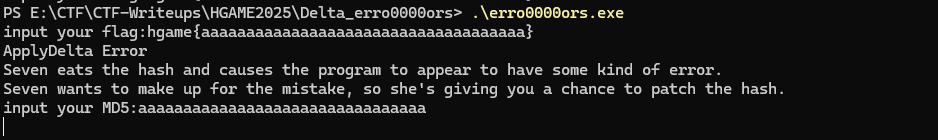
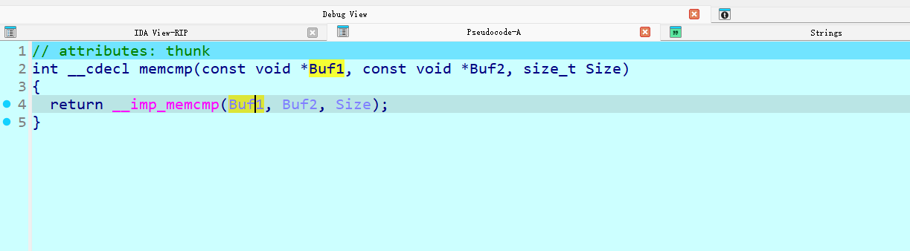
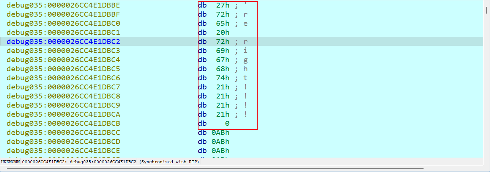
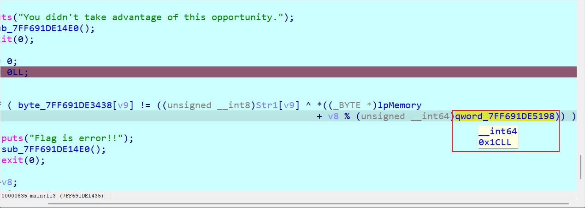
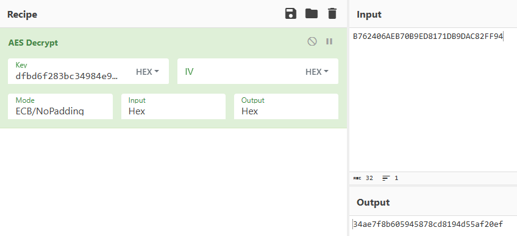

# Hgame 2025

## Compress dot new

deepseek一把梭，自己还分析啥

~~~python
# 哈夫曼树结构
huffman_tree = {"a":{"a":{"a":{"a":{"a":{"s":125},"b":{"a":{"s":119},"b":{"s":123}}},"b":{"a":{"s":104},"b":{"s":105}}},"b":{"a":{"s":101},"b":{"s":103}}},"b":{"a":{"a":{"a":{"s":10},"b":{"s":13}},"b":{"s":32}},"b":{"a":{"s":115},"b":{"s":116}}}},"b":{"a":{"a":{"a":{"a":{"a":{"s":46},"b":{"s":48}},"b":{"a":{"a":{"s":76},"b":{"s":78}},"b":{"a":{"s":83},"b":{"a":{"s":68},"b":{"s":69}}}}},"b":{"a":{"a":{"s":44},"b":{"a":{"s":33},"b":{"s":38}}},"b":{"s":45}}},"b":{"a":{"a":{"s":100},"b":{"a":{"s":98},"b":{"s":99}}},"b":{"a":{"a":{"s":49},"b":{"s":51}},"b":{"s":97}}}},"b":{"a":{"a":{"a":{"s":117},"b":{"s":118}},"b":{"a":{"a":{"s":112},"b":{"s":113}},"b":{"s":114}}},"b":{"a":{"a":{"s":108},"b":{"s":109}},"b":{"a":{"s":110},"b":{"s":111}}}}}}

# 编码数据
encoded_data = "00010001110111111010010000011100010111000100111000110000100010111001110010011011010101111011101100110100011101101001110111110111011011001110110011110011110110111011101101011001111011001111000111001101111000011001100001011011101100011100101001110010111001111000011000101001010000000100101000100010011111110110010111010101000111101000110110001110101011010011111111001111111011010101100001101110101101111110100100111100100010110101111111111100110001010101101110010011111000110110101101111010000011110100000110110101011000111111000110101001011100000110111100000010010100010001011100011100111001011101011111000101010110101111000001100111100011100101110101111100010110101110000010100000010110001111011100011101111110101010010011101011100100011110010010110111101110111010111110110001111010101110010001011100100101110001011010100001110101000101111010100110001110101011101100011011011000011010000001011000111011111111100010101011100000"

# 解码函数
def decode_huffman(tree, encoded_data):
    decoded_text = []
    current_node = tree
    for bit in encoded_data:
        if bit == '0':
            current_node = current_node['a']
        else:
            current_node = current_node['b']
        if 's' in current_node:
            decoded_text.append(chr(current_node['s']))
            current_node = tree
    return ''.join(decoded_text)

# 解码
decoded_text = decode_huffman(huffman_tree, encoded_data)
print(decoded_text)
~~~

## Turtle

64位手脱下，sub_401550和sub_40175A一眼rc4

~~~c
__int64 sub_401876()
{//...
  _BYTE v1[256]; // [rsp+20h] [rbp-60h] BYREF
  sub_401C20();
  strcpy(v8, "yekyek");
  Buf2[0] = -51;
  Buf2[1] = -113;
  Buf2[2] = 37;
  Buf2[3] = 61;
  Buf2[4] = -31;
  qmemcpy(v5, "QJ", sizeof(v5));
  v2[0] = -8;
  v2[1] = -43;
  v2[2] = 98;
  v2[3] = -49;
  v2[4] = 67;
  v2[5] = -70;
  v2[6] = -62;
  v2[7] = 35;
  v2[8] = 21;
  v2[9] = 74;
  v2[10] = 81;
  v2[11] = 16;
  v2[12] = 39;
  v2[13] = 16;
  v2[14] = -79;
  v2[15] = -49;
  v2[16] = -60;
  v2[17] = 9;
  v2[18] = -2;
  v2[19] = -29;
  v2[20] = -97;
  v2[21] = 73;
  v2[22] = -121;
  v2[23] = -22;
  v2[24] = 89;
  v2[25] = -62;
  v2[26] = 7;
  v2[27] = 59;
  v2[28] = -87;
  v2[29] = 17;
  v2[30] = -63;
  v2[31] = -68;
  v2[32] = -3;
  v2[33] = 75;
  v2[34] = 87;
  v2[35] = -60;
  v2[36] = 126;
  v2[37] = -48;
  v2[38] = -86;
  v2[39] = 10;
  v13 = 6;
  v12 = 7;
  v11 = 40;
  j_printf("plz input the key: ");
  j_scanf("%s", Source);
  j__mbscpy(Dest, Source);
  v10 = 7;
  sub_401550(v8, v13, v1);
  sub_40163E(Source, v10, v1);
  if ( !j_memcmp(Source, Buf2, v12) )
  {
    j_printf("plz input the flag: ");
    j_scanf("%s", Buf1);
    v9 = 40;
    sub_401550(Dest, v10, v1);
    sub_40175A(Buf1, v9, v1);
    if ( !j_memcmp(Buf1, v2, v11) )
      j_puts(Buffer);
    else
      j_puts(aWrongPlzTryAga);
  }
  else
  {
    j_puts(aKeyIsWrong);
  }
  return 0LL;
}
~~~

解密

~~~python
def KSA(key):
    """ Key-Scheduling Algorithm (KSA) 密钥调度算法"""
    S = list(range(256))
    j = 0
    for i in range(256):
        j = (j + S[i] + key[i % len(key)]) % 256
        S[i], S[j] = S[j], S[i]
    return S


def PRGA(S):
    """ Pseudo-Random Generation Algorithm (PRGA) 伪随机数生成算法"""
    i, j = 0, 0
    while True:
        i = (i + 1) % 256
        j = (j + S[i]) % 256
        S[i], S[j] = S[j], S[i]
        K = S[(S[i] + S[j]) % 256]
        yield K


def RC4_sub(key, text):
    """ RC4 encryption/decryption """
    S = KSA(key)
    keystream = PRGA(S)
    res = []
    for char in text:
        res.append((char + next(keystream))&0xff)
    return bytes(res)

def RC4(key, text):
    """ RC4 encryption/decryption """
    S = KSA(key)
    keystream = PRGA(S)
    res = []
    for char in text:
        res.append(char ^ next(keystream))
    return bytes(res)


key = b"yekyek"
text = [0xcd, 0x8f, 0x25, 0x3d, 0xe1, ord("Q"), ord("J")]
key = RC4(key, text)
print(key)
text = [248, 213, 98, 207, 67, 186, 194, 35, 21, 74, 81, 16, 39, 16, 177, 207, 196, 9, 254, 227, 159, 73, 135, 234, 89, 194, 7, 59, 169, 17, 193, 188, 253, 75, 87, 196, 126, 208, 170, 10]
print(RC4_sub(key, text))
# hgame{Y0u'r3_re4l1y_g3t_0Ut_of_th3_upX!}
~~~

## Delta Erro0000ors

~~~c
int __fastcall main(int argc, const char **argv, const char **envp)
{
  HMODULE LibraryA; // rax
  DWORD LastError; // eax
  char *v5; // rbx
  char *v6; // rdi
  __int64 v7; // rsi
  int v8; // ecx
  __int64 v9; // r8
  __int128 v11; // [rsp+20h] [rbp-138h]
  __int64 v12; // [rsp+30h] [rbp-128h]
  __int128 v13; // [rsp+38h] [rbp-120h]
  __int64 v14; // [rsp+48h] [rbp-110h]
  __int128 v15; // [rsp+50h] [rbp-108h] BYREF
  __int64 v16; // [rsp+60h] [rbp-F8h]
  __int128 v17; // [rsp+70h] [rbp-E8h] BYREF
  __int64 v18; // [rsp+80h] [rbp-D8h]
  char Destination[16]; // [rsp+90h] [rbp-C8h] BYREF
  __int128 v20; // [rsp+A0h] [rbp-B8h]
  int v21; // [rsp+B0h] [rbp-A8h]
  char v22; // [rsp+B4h] [rbp-A4h]
  char Buffer[16]; // [rsp+B8h] [rbp-A0h] BYREF
  __int128 v24; // [rsp+C8h] [rbp-90h]
  __int64 v25; // [rsp+D8h] [rbp-80h]
  char Str1[16]; // [rsp+E0h] [rbp-78h] BYREF
  __int128 v27; // [rsp+F0h] [rbp-68h]
  __int128 v28; // [rsp+100h] [rbp-58h]
  __int128 v29; // [rsp+110h] [rbp-48h]
  __int128 v30; // [rsp+120h] [rbp-38h]
  __int128 v31; // [rsp+130h] [rbp-28h]
  int v32; // [rsp+140h] [rbp-18h]

  LibraryA = LoadLibraryA("msdelta.dll");
  hLibModule = LibraryA;
  if ( LibraryA )
  {
    off_7FF691DE5180 = (__int64 (__fastcall *)(_QWORD, _QWORD, _QWORD, _QWORD))GetProcAddress(LibraryA, "ApplyDeltaB");
    DeltaFree = (BOOL (__stdcall *)(LPVOID))GetProcAddress(hLibModule, "DeltaFree");
  }
  else
  {
    puts("LoadLibrary Error");
  }
  *(_OWORD *)Str1 = 0LL;
  v27 = 0LL;
  v28 = 0LL;
  v29 = 0LL;
  v30 = 0LL;
  v31 = 0LL;
  v32 = 0;
  *(_OWORD *)Destination = 0LL;
  v20 = 0LL;
  v21 = 0;
  v22 = 0;
  *(_OWORD *)Buffer = 0LL;
  v24 = 0LL;
  v25 = 0LL;
  printf("input your flag:");
  scanf("%43s", Str1);
  if ( !strncmp(Str1, "hgame{", 6uLL) && BYTE10(v28) == 125 )
  {
    strncpy(Destination, &Str1[6], 0x24uLL);
    LODWORD(v14) = 0;
    *(_QWORD *)&v13 = Destination;
    *((_QWORD *)&v13 + 1) = 37LL;
    LODWORD(v12) = 0;
    *(_QWORD *)&v11 = &unk_7FF691DE50A0;
    *((_QWORD *)&v11 + 1) = 69LL;
    v15 = v11;
    v16 = v12;
    v17 = v13;
    v18 = v14;
    if ( off_7FF691DE5180(0LL, &v17, &v15, &lpMemory) )
    {
      printf("%s", (const char *)lpMemory);
    }
    else
    {
      puts("ApplyDelta Error");
      LastError = GetLastError();
      RaiseException(LastError, 1u, 0, 0LL);
    }
    puts("Seven eats the hash and causes the program to appear to have some kind of error.");
    puts("Seven wants to make up for the mistake, so she's giving you a chance to patch the hash.");
    printf("input your MD5:");
    scanf("%32s", Buffer);
    v5 = Buffer;
    v6 = (char *)&unk_7FF691DE50B4;
    v7 = 16LL;
    do
    {
      sub_7FF691DE10E0(v5, "%02x", (_DWORD)v6++);
      v5 += 2;
      --v7;
    }
    while ( v7 );
    word_7FF691DE50C4 = 0x7A01;
    v17 = v11;
    v18 = v12;
    v15 = v13;
    v16 = v14;
    if ( !off_7FF691DE5180(0LL, &v15, &v17, &lpMemory) )
    {
      puts("You didn't take advantage of this opportunity.");
      sub_7FF691DE14E0();
      exit(0);
    }
    v8 = 0;
    v9 = 0LL;
    do
    {
      if ( byte_7FF691DE3438[v9] != ((unsigned __int8)Str1[v9] ^ *((_BYTE *)lpMemory
                                                                 + v8 % (unsigned __int64)qword_7FF691DE5198)) )
      {
        puts("Flag is error!!");
        sub_7FF691DE14E0();
        exit(0);
      }
      ++v8;
      ++v9;
    }
    while ( v8 < 43 );
  }
  puts(aGreat);
  DeltaFree(lpMemory);
  FreeLibrary(hLibModule);
  return 0;
}
~~~

奇怪的题目，调用了个msdelta.dll，主函数可以patch掉getlasterror附近的一个jmp即可看完整逻辑，发现两处输入第一处会调用applydelta但会抛出错误



第二处要求输入md5，因此在dll文件里memcmp处下了断点（attach到主进程下）看谁来和输入比较的找到值44D292FFE2E91730AE69EB50AE11D04A（其实第一次也有）



再回到exe主函数，下断点看lpMemory值（异或值），注意长度为28，因此包括最后的0





~~~python
xor = [0x53, 0x65, 0x76, 0x65, 0x6E, 0x20, 0x73, 0x61, 0x79, 0x73, 0x20, 0x79, 0x6F, 0x75, 0x27, 0x72, 0x65, 0x20, 0x72, 0x69, 0x67, 0x68, 0x74, 0x21, 0x21, 0x21, 0x21, 0x00]
cmp = [0x3B, 0x02, 0x17, 0x08, 0x0B, 0x5B, 0x4A, 0x52, 0x4D, 0x11, 0x11, 0x4B, 0x5C, 0x43, 0x0A, 0x13, 0x54, 0x12, 0x46, 0x44, 0x53, 0x59, 0x41, 0x11, 0x0C, 0x18, 0x17, 0x37, 0x30, 0x48, 0x15, 0x07, 0x5A, 0x46, 0x15, 0x54, 0x1B, 0x10, 0x43, 0x40, 0x5F, 0x45, 0x5A, 0x00, 0x00, 0x00, 0x00, 0x00, 0x00, 0x00, 0x00, 0x00, 0x00, 0x00, 0x00, 0x00]
for i in range(43):
    print(chr(cmp[i]^xor[i%len(xor)]), end="")
~~~

这个题目需要直到msdelta.dll的作用，直接去定位哈希值，拿到补丁（lpMemory）

## 尊嘟假嘟

pass不想看了，会做了

## Nop'd

一眼launcher有问题，打开后在init\_array里发现了利用ptrace实现的修改内存

~~~c
__int64 __fastcall sub_1B9B(__pid_t pid)
{
  unsigned int v1; // ebx
  char i; // bl
  int v3; // ebx
  __int64 v4; // rax
  __int64 v5; // r15
  char v6; // dl
  __int64 v7; // r15
  __int64 (__fastcall *v8)(); // rax
  unsigned int pida; // [rsp+4h] [rbp-64h]
  __int64 v11; // [rsp+18h] [rbp-50h] BYREF
  _BYTE v12[4]; // [rsp+22h] [rbp-46h] BYREF
  unsigned __int8 v13; // [rsp+26h] [rbp-42h]
  unsigned __int8 v14; // [rsp+27h] [rbp-41h]
  unsigned __int64 v15; // [rsp+28h] [rbp-40h]

  v1 = pid;
  v15 = __readfsqword(0x28u);
  waitpid(pid, 0LL, 0);
  ptrace(PTRACE_SETOPTIONS, (unsigned int)pid, 0LL, 0x100000LL);
  while ( ptrace(PTRACE_SYSCALL, v1, 0LL, 0LL) >= 0 )
  {
    waitpid(v1, 0LL, 0);
    ptrace(PTRACE_GETREGS, v1, 0LL, &qword_55E0);
    sub_134B(PTRACE_PEEKTEXT, v1, (__int64)byte_55C0, *(&qword_55E0 + 16) - 8, 6uLL);
    if ( (byte_55C0[0] & 0xFC) != 0x48
      || byte_55C0[1] != 15
      || byte_55C2 != 31
      || (byte_55C3 & 0xC7) != 0x44
      || byte_55C5 != 127 )
    {
      v11 = *(&qword_55E0 + 16);
      goto LABEL_41;
    }
    memset(byte_5540, 0, sizeof(byte_5540));
    qword_5520 = 0LL;
    pida = v1;
    for ( i = 0; ; i = 1 )
    {
      v5 = qword_5520;
      sub_134B(PTRACE_PEEKTEXT, pida, (__int64)v12, qword_5660 + 6 * qword_5520, 6uLL);
      if ( (v12[0] & 0xFC) != 0x48 || v12[1] != 15 || v12[2] != 31 || (v12[3] & 0xC7) != 0x44 || v14 == 126 )
        break;
      v3 = (v14 - 1) % 128;
      if ( v13 > 0x3Fu )
      {
        sub_1464(pida, (__int64)&v11, qword_5678 + ((8 * (v13 & 7 | (unsigned __int8)(8 * (v12[0] & 1)))) & 0x78), 8uLL);
        qword_5120[(unsigned __int8)v3] = v11;
      }
      else
      {
        switch ( v13 & 7 | (unsigned __int8)(8 * (v12[0] & 1)) )
        {
          case 0:
            v4 = qword_5658;
            break;
          case 1:
            v4 = qword_5638;
            break;
          case 2:
            v4 = qword_5640;
            break;
          case 3:
            v4 = qword_5608;
            break;
          case 4:
            v4 = qword_5678;
            break;
          case 5:
            v4 = qword_5600;
            break;
          case 6:
            v4 = qword_5648;
            break;
          case 7:
            v4 = qword_5650;
            break;
          case 8:
            v4 = qword_5628;
            break;
          case 9:
            v4 = qword_5620;
            break;
          case 10:
            v4 = qword_5618;
            break;
          case 11:
            v4 = qword_5610;
            break;
          case 12:
            v4 = qword_55F8;
            break;
          case 13:
            v4 = qword_55F0;
            break;
          case 14:
            v4 = qword_55E8;
            break;
          case 15:
            v4 = qword_55E0;
            break;
        }
        qword_5120[(unsigned __int8)v3] = v4;
      }
      byte_5540[(unsigned __int8)v3] = 1;
      qword_5520 = v5 + 1;
    }
    v6 = i;
    v1 = pida;
    v11 = *(&qword_55E0 + 16);
    if ( v6 )
    {
      v7 = -38LL;
      if ( byte_5540[0] )
      {
        if ( qword_5120[0] <= 9uLL )
        {
          v8 = funcs_1DBD[qword_5120[0]];
          if ( v8 )
            v7 = ((int (__fastcall *)(_QWORD, __int64 *, char *, __int64 *))v8)(pida, qword_5120, byte_5540, &v11);
        }
        *(&qword_55E0 + 15) = -1LL;
        ptrace(PTRACE_SETREGS, pida, 0LL, &qword_55E0);
      }
      ptrace(PTRACE_SYSCALL, pida, 0LL, 0LL);
      waitpid(pida, 0LL, 0);
      ptrace(PTRACE_GETREGS, pida, 0LL, qword_5040);
      qword_5040[10] = v7;
      qword_5040[16] = v11;
      ptrace(PTRACE_SETREGS, pida, 0LL, qword_5040);
    }
    else
    {
LABEL_41:
      ptrace(PTRACE_SYSCALL, v1, 0LL, 0LL);
      waitpid(v1, 0LL, 0);
    }
  }
  return 0LL;
}
~~~

通过sub_134B获取game寄存器rip值-8地址的字节并比较是否等于\x48\x0f\x1f\x44\x00\x7f，去game里可以搜到这串指令正是`nop     qword ptr [rax+rax+7Fh]`，分析可知从`nop     qword ptr [rax+rax+7Fh]`开始到`nop     qword ptr [rax+rax+7Eh]`结束，根据中间内容

略...出的太好了研究了好一会，自己留着了

实际上实现了个魔改chacha20加密

~~~python
import struct


# 宏定义：循环左移（左移操作后，右边溢出的部分重新回到左边）
def ROTL(a, b):
    return ((a << b) & 0xFFFFFFFF) | (a >> (32 - b))


# 宏定义：Chacha20的四分之一轮（Quarter Round）操作
def QR(a, b, c, d):
    a = (a + b) & 0xFFFFFFFF
    d ^= a
    d = ROTL(d, 16)
    c = (c + d) & 0xFFFFFFFF
    b ^= c
    b = ROTL(b, 12)
    a = (a + b) & 0xFFFFFFFF
    d ^= a
    d = ROTL(d, 8)
    c = (c + d) & 0xFFFFFFFF
    b ^= c
    b = ROTL(b, 7)
    return a, b, c, d


# ChaCha20加密算法中的块函数
def chacha20_block(output, input_state):
    x = list(input_state)

    # 进行20轮加密操作，每轮执行四分之一轮操作
    for _ in range(10):
        # 奇数轮
        x[0], x[4], x[8], x[12] = QR(x[0], x[4], x[8], x[12])
        x[1], x[5], x[9], x[13] = QR(x[1], x[5], x[9], x[13])
        x[2], x[6], x[10], x[14] = QR(x[2], x[6], x[10], x[14])
        x[3], x[7], x[11], x[15] = QR(x[3], x[7], x[11], x[15])
        x = [x[i] for i in [0, 1, 2, 3, 5, 6, 7, 4, 10, 11, 8, 9, 15, 12, 13, 14]]
        # 偶数轮
        x[0], x[4], x[8], x[12] = QR(x[0], x[4], x[8], x[12])
        x[1], x[5], x[9], x[13] = QR(x[1], x[5], x[9], x[13])
        x[2], x[6], x[10], x[14] = QR(x[2], x[6], x[10], x[14])
        x[3], x[7], x[11], x[15] = QR(x[3], x[7], x[11], x[15])
        x = [x[i] for i in [0, 1, 2, 3, 7, 4, 5, 6, 10, 11, 8, 9, 13, 14, 15, 12]]
    # 将加密结果与原始输入状态相加，输出最终结果
    for i in range(16):
        output[i] = (x[i] + input_state[i]) & 0xFFFFFFFF


# ChaCha20加密函数
def chacha20_encrypt(out, in_data, in_len, key, nonce, counter):
    state = [
        0x61707865, 0x3320646e, 0x79622d32, 0x6b206574,  # 固定常量（ASCII编码：expand 32-byte k）
        key[0], key[1], key[2], key[3],  # 256位密钥（8个32位字）
        key[4], key[5], key[6], key[7],
        counter, nonce[0], nonce[1], nonce[2]  # 计数器和nonce
    ]
    block = [0] * 16  # 存储每次生成的64字节的加密块
    while in_len > 0:
        # 生成一个加密块
        chacha20_block(block, state)
        state[12] = (state[12] + 1) & 0xFFFFFFFF  # 每次加密后递增计数器

        block_size = min(in_len, 64)  # 计算当前块的大小
        tmp = 0x61C88646&0xff
        for i in range(block_size):
            out[i] = tmp ^ in_data[i] ^ (block[i // 4] >> (8 * (i % 4)) & 0xFF)  # 将输入数据与加密块异或得到密文
            tmp = in_data[i]

        # 更新剩余输入数据的长度和指针
        in_len -= block_size
        in_data = in_data[block_size:]
        out = out[block_size:]


# 主函数
def main():
    key = [0x73277449, 0x6C6C6120, 0x69727720, 0x6E657474, 0x206E6920, 0x20656874, 0x6B6F6F42, 0x20666F20]
    nonce = [0x74616857, 0x79207327, 0x2072756F]
    ciphertext = [0x64, 0x6A, 0x50, 0x17, 0x81, 0x7D, 0x6F, 0x1A, 0x87, 0xB1, 0xA4, 0x00, 0x09, 0x03, 0xF8, 0x8D, 0xF8,
                  0x6B, 0xDF, 0x32, 0x5F, 0x40, 0x90, 0x9C, 0xB8, 0x3D, 0x86, 0x13, 0x26, 0xB7, 0x63, 0xF7, 0x74, 0xE8,
                  0x53, 0xED, 0x58, 0x20, 0x4F, 0xD9, 0x99, 0x26, 0x21, 0x37, 0xDE, 0x35, 0x76, 0xC8, 0xBC, 0xD0, 0x6E]
    decrypted = bytearray(len(ciphertext))
    chacha20_encrypt(decrypted, ciphertext, len(ciphertext), key, nonce, 0)
    print(decrypted.hex())
    # 解密后的数据应当与原始明文相同
    print(decrypted.decode('utf-8'))

# https://blog.csdn.net/weixin_59166557/article/details/144060806
if __name__ == "__main__":
    main()

~~~

## Fast and frustrating

给了PDB调试信息和符号表，定位FastAndFrustrating_FastAndFrustrating_Program__Main

把Base64串和main代码传给GPT，thinking模式下9min梭了

可以。你给的那段 Base64（`H4sI...`）解出来其实是 **gzip 压缩的 JSON**，里面是一个 27×27 的整数矩阵 `mat_a` 和一个长度 27 的向量 `vec_b`，程序用它们对输入 key 做线性约束校验。

我按程序逻辑把整条链还原并算出来了：

### 1) 先解压你给的 Base64 → 得到约束

解 gzip 后是：

- `mat_a`：27×27
- `vec_b`：27

校验本质是解线性方程组 **A·x = b**（x 是 key 的 27 个 ASCII 字节）。

解出来的 key（ASCII）是：

- `CompressedEmbeddedResources`

### 2) 从 exe 静态区取另外两个常量

在你那段大 Base64 附近还能找到：

- 密文 Base64：`GFxmVucV6MVUXiWCMAnWpyvzXoLdHc5CmFeim+JjUBszB8HFX8Ku8NMc201AGZ9X`
- HKDF 的 info 字符串：`HGAME2025`

### 3) HKDF 派生 AES 参数 + 解密

程序用 **HKDF-SHA256** 派生 `Key || IV`（注意顺序是 **Key 在前，IV 在后**）：

- 输出长度 = 32（AES-256 key） + 16（CBC IV）= 48 bytes
- Key = 前 32 bytes
- IV = 后 16 bytes
   然后 AES-256-CBC 解密并做 PKCS7 去 padding，得到 flag。

------

## ✅ flag

**`hgame{F4st_4nd_frustr4t1ng_A0T_compilat1on}`**

~~~python
import base64, hmac, hashlib, math
from cryptography.hazmat.primitives.kdf.hkdf import HKDF
from cryptography.hazmat.primitives import hashes, padding as cpadding
from cryptography.hazmat.primitives.ciphers import Cipher, algorithms, modes
from cryptography.hazmat.backends import default_backend

ikm=b"CompressedEmbeddedResources"
info=b"HGAME2025"
keysize_bits=256
blocksize_bits=128
length=(keysize_bits+blocksize_bits)//8
okm=HKDF(algorithm=hashes.SHA256(), length=length, salt=None, info=info, backend=default_backend()).derive(ikm)
key=okm[:keysize_bits//8]
iv=okm[keysize_bits//8:keysize_bits//8+blocksize_bits//8]
ct=base64.b64decode("GFxmVucV6MVUXiWCMAnWpyvzXoLdHc5CmFeim+JjUBszB8HFX8Ku8NMc201AGZ9X")
cipher=Cipher(algorithms.AES(key), modes.CBC(iv), backend=default_backend())
pt_padded=cipher.decryptor().update(ct)+cipher.decryptor().finalize()
# unpad pkcs7
unpadder=cpadding.PKCS7(blocksize_bits).unpadder()
pt=unpadder.update(pt_padded)+unpadder.finalize()
print(pt)
~~~

## Mysterious signals

没环境了，就是个TEA类魔改

## Signin

出现了**硬件断点检测**

~~~c++
__int64 __fastcall sub_14000F730(__int64 a1, __int64 a2, __int64 a3)
{
  __int64 result; // rax
  HANDLE CurrentThread; // rax
  LPCONTEXT lpContext; // [rsp+28h] [rbp+8h]

  j___CheckForDebuggerJustMyCode(&unk_1400C70A3, a2, a3);
  lpContext = (LPCONTEXT)VirtualAlloc(0LL, 0x4D0uLL, 0x1000u, 4u);
  if ( lpContext )
  {
    sub_1400034FE(lpContext, 1232LL);
    lpContext->ContextFlags = 1048592;
    CurrentThread = GetCurrentThread();
    if ( GetThreadContext(CurrentThread, lpContext) )
    {
      qword_1400BB880[0] = lpContext->Dr0;
      qword_1400BB880[1] = lpContext->Dr1;
      qword_1400BB880[2] = lpContext->Dr2;
      qword_1400BB880[3] = lpContext->Dr3;
      if ( qword_1400BB880[0] || qword_1400BB880[1] || qword_1400BB880[2] || (result = 24LL, qword_1400BB880[3]) )
      {
        j_puts("Debug error.");
        j_exit(0);
      }
    }
    else
    {
      return 0LL;
    }
  }
  else
  {
    j_puts("VirtualAlloc failed.");
    return 0LL;
  }
  return result;
}
~~~

类似CRC检测

~~~c++
__int64 __fastcall sub_140008670(__int64 a1, __int64 a2, __int64 a3)
{
  __int64 v3; // rdx
  __int64 v4; // rcx
  __int64 v5; // r8
  __int64 v6; // r8
  void *v8; // [rsp+48h] [rbp+28h]
  int i; // [rsp+64h] [rbp+44h]

  j___CheckForDebuggerJustMyCode(&unk_1400C70A3, a2, a3);
  v8 = j_j_j__malloc_base(0x10000uLL);
  j_memset(v8, 0, 0x10000uLL);
  j_memcpy(v8, main, 0x10000uLL);
  sub_1400011D6(v4, v3, v5);
  for ( i = 0; i < 4; ++i )
    dword_1400BB2A0[i] = sub_140001AB4((__int64)v8 + 0x4000 * i, 0x4000uLL, v6);
  return 1LL;
}
// attributes: thunk
__int64 __fastcall sub_1400011D6(__int64 a1, __int64 a2, __int64 a3)
{
  return sub_1400088D0(a1, a2, a3);
}
__int64 __fastcall sub_1400088D0(__int64 a1, __int64 a2, __int64 a3)
{
  __int64 result; // rax
  unsigned int v4; // [rsp+24h] [rbp+4h]
  int i; // [rsp+44h] [rbp+24h]
  int j; // [rsp+64h] [rbp+44h]

  result = j___CheckForDebuggerJustMyCode(&unk_1400C70A3, a2, a3);
  for ( i = 0; i < 256; ++i )
  {
    v4 = i;
    for ( j = 0; j < 8; ++j )
    {
      if ( (v4 & 1) != 0 )
        v4 = (v4 >> 1) ^ 0xEDB88320;
      else
        v4 >>= 1;
    }
    dword_1400BD1A0[i] = v4;
    result = (unsigned int)(i + 1);
  }
  return result;
}
// attributes: thunk
__int64 __fastcall sub_140001AB4(__int64 a1, unsigned __int64 a2, __int64 a3)
{
  return sub_140008760(a1, a2, a3);
}
__int64 __fastcall sub_140008760(__int64 a1, unsigned __int64 a2, __int64 a3)
{
  unsigned int v4; // [rsp+24h] [rbp+4h]
  unsigned __int64 i; // [rsp+48h] [rbp+28h]

  j___CheckForDebuggerJustMyCode(&unk_1400C70A3, a2, a3);
  v4 = -1;
  for ( i = 0LL; i < a2; ++i )
    v4 = dword_1400BD1A0[(unsigned __int8)(*(_BYTE *)(i + a1) ^ v4)] ^ (v4 >> 8);
  return ~v4;
}
~~~

所以需要保证断点不能影响main后面的代码，这样才能拿到正确秘钥

~~~python
from ctypes import c_uint32
import struct
v = [0x23, 0xEA, 0x50, 0x30, 0x00, 0x4C, 0x51, 0x47, 0xEE, 0x9C, 0x76, 0x2B, 0xD5, 0xE6, 0x94, 0x17, 0xED, 0x2B, 0xE4, 0xB3, 0xCB, 0x36, 0xD5, 0x61, 0xC0, 0xC2, 0xA0, 0x7C, 0xFE, 0x67, 0xD7, 0x5E, 0xAF, 0xE0, 0x79, 0xC5]
v = [struct.unpack("<I", bytes(v[i:i+4]))[0] for i in range(0, len(v), 4)]
k = [0x97A25FB5, 0xE1756DBA, 0xA143464A, 0x5A8F284F]


def xxtea_decrypt(n, v, key):
    # 全部转为c_unit32格式
    v = [c_uint32(i) for i in v]
    r = 11
    v0 = v[0].value
    delta = 0
    total = c_uint32(delta * r)
    for i in range(r):
        e = (total.value >> 2) & 3
        for j in range(n-1, 0, -1):
            v1 = v[j-1].value
            v[j].value -= ((((v1 >> 5) ^ (v0 << 2)) + ((v0 >> 3) ^ (v1 << 4))) ^ ((total.value ^ v0) + (key[(j & 3) ^ e] ^ v1)))
            v0 = v[j].value
        v1 = v[n-1].value
        v[0].value -= ((((v1 >> 5) ^ (v0 << 2)) + ((v0 >> 3) ^ (v1 << 4))) ^ ((total.value ^ v0) + (key[(0 & 3) ^ e] ^ v1)))
        v0 = v[0].value
        total.value -= delta
    return [i.value for i in v]


v = xxtea_decrypt(len(v), v, k)

# 输出解密后的数据
str_list = []
for i in range(len(v)):
    str_list.append(struct.pack('<I', v[i]).decode())
print('decrypted: %s' % ''.join(str_list))
~~~

flag为hgame{3fe4722c-1dbf-43b7-8659-c1c4a0e42e4d}

## Middlemen

java层没啥看的，native层注册了middlemen，可以看到flag格式以及做了syscall 172操作，具体是利用sscanf把32个hex字符转成16个字节，写进 v12

~~~c++
bool __fastcall sub_22DC(JNIEnv *a1, __int64 a2, __int64 a3)
{
  _QWORD v4[14]; // [xsp+0h] [xbp-C0h] BYREF
  __int64 v5; // [xsp+70h] [xbp-50h]
  const char *v6; // [xsp+78h] [xbp-48h]
  __int64 v7; // [xsp+80h] [xbp-40h]
  __int64 v8; // [xsp+88h] [xbp-38h]
  JNIEnv *v9; // [xsp+90h] [xbp-30h]
  bool v10; // [xsp+98h] [xbp-28h]
  char v11[4]; // [xsp+9Ch] [xbp-24h] BYREF
  _QWORD v12[4]; // [xsp+A0h] [xbp-20h] BYREF

  v12[3] = *(_QWORD *)(_ReadStatusReg(ARM64_SYSREG(3, 3, 13, 0, 2)) + 40);
  v9 = a1;
  v8 = a2;
  v7 = a3;
  memset(v12, 0, 20);
  v4[12] = v12;
  v4[11] = &v12[1];
  v6 = (const char *)sub_2454(a1, a3, (__int64)v11);
  v4[13] = v4;
  v10 = sscanf(
          v6,
          "hgame{%02x%02x%02x%02x-%02x%02x-%02x%02x-%02x%02x-%02x%02x%02x%02x%02x%02x}",
          v12,
          (char *)v12 + 1,
          (char *)v12 + 2,
          (char *)v12 + 3,
          (char *)v12 + 4,
          (char *)v12 + 5,
          (char *)v12 + 6,
          (char *)v12 + 7,
          &v12[1],
          (char *)&v12[1] + 1,
          (char *)&v12[1] + 2,
          (char *)&v12[1] + 3,
          (char *)&v12[1] + 4,
          (char *)&v12[1] + 5,
          (char *)&v12[1] + 6,
          (char *)&v12[1] + 7)
     && (v5 = syscall(172LL, v12[0], *(_QWORD *)((char *)v12 + 4), v12[1], *(_QWORD *)((char *)&v12[1] + 4), 0x221221LL),
         v5 >= 0x1000000000001LL);
  _ReadStatusReg(ARM64_SYSREG(3, 3, 13, 0, 2));
  return v10;
}
~~~

信息很少不太对，直接看init_array发现猫腻函数sub_2020

~~~c++
__int64 sub_2020()
{
  __int64 result; // x0
  __int128 v1; // [xsp+0h] [xbp-40h] BYREF
  __int64 v2; // [xsp+10h] [xbp-30h] BYREF
  int v3; // [xsp+18h] [xbp-28h] BYREF
  __int64 (__fastcall *v4)(__int64, __int64, __int64); // [xsp+20h] [xbp-20h]
  __int64 v5; // [xsp+28h] [xbp-18h]
  __int64 v6; // [xsp+38h] [xbp-8h]

  v6 = *(_QWORD *)(_ReadStatusReg(ARM64_SYSREG(3, 3, 13, 0, 2)) + 40);
  v1 = *(_OWORD *)&off_48D8;
  result = prctl(PR_SET_NO_NEW_PRIVS, 1LL, 0LL, 0LL);// 禁止通过 execve 提升权限（如禁用 setuid）‌
  if ( (_DWORD)result != -1 )
  {
    result = prctl(PR_SET_SECCOMP, 2LL, &v1);   // 启用 seccomp 模式，限制进程可调用的系统调用（沙盒安全）‌
    if ( (_DWORD)result != -1 )
    {
      sigfillset((sigset_t *)&v2);              // 初始化一个信号集，使其包含所有定义的信号
      v4 = sub_1ECC;
      v5 = v2;
      v3 = 4;
      result = sigaction(SIGSYS, (const struct sigaction *)&v3, 0LL);// 当进程收到 SIGSYS 时，会跳转到v3里定义的handler也就是sub_1ECC
    }
  }
  _ReadStatusReg(ARM64_SYSREG(3, 3, 13, 0, 2));
  return result;
}
~~~

先看[prctl函数](https://blog.csdn.net/zhaominyong/article/details/149532622)，发现启用了seccomp模式，所以v1实际上没有识别出来是sock_fprog结构体，按下Y键可以手动恢复结构体

~~~c++
__int64 sub_2020()
{
  __int64 result; // x0
  sock_fprog v1; // [xsp+0h] [xbp-40h] BYREF
  __int64 v2; // [xsp+10h] [xbp-30h] BYREF
  int v3; // [xsp+18h] [xbp-28h] BYREF
  __int64 (__fastcall *v4)(__int64, __int64, __int64); // [xsp+20h] [xbp-20h]
  __int64 v5; // [xsp+28h] [xbp-18h]
  __int64 v6; // [xsp+38h] [xbp-8h]

  v6 = *(_QWORD *)(_ReadStatusReg(ARM64_SYSREG(3, 3, 13, 0, 2)) + 40);
  v1 = prog;
  result = prctl(PR_SET_NO_NEW_PRIVS, 1LL, 0LL, 0LL);// 禁止通过 execve 提升权限（如禁用 setuid）‌
  if ( (_DWORD)result != -1 )
  {
    result = prctl(PR_SET_SECCOMP, 2LL, &v1);   // 启用 seccomp 模式，限制进程可调用的系统调用（沙盒安全）‌
    if ( (_DWORD)result != -1 )
    {
      sigfillset((sigset_t *)&v2);              // 初始化一个信号集，使其包含所有定义的信号
      v4 = sub_1ECC;
      v5 = v2;
      v3 = 4;
      result = sigaction(SIGSYS, (const struct sigaction *)&v3, 0LL);// 当进程收到 SIGSYS 时，会跳转到v3里定义的handler也就是sub_1ECC
    }
  }
  _ReadStatusReg(ARM64_SYSREG(3, 3, 13, 0, 2));
  return result;
}
~~~

跳转prog，我们先要了解sock_fprog的结构，第一个数值是filter的大小，filter是指针指向sock_filter结构体数组

~~~c++
struct sock_fprog
{
  unsigned __int16 len;
  struct sock_filter *filter;
};
struct sock_filter
{
  __u16 code;
  __u8 jt;
  __u8 jf;
  __u32 k;
};
~~~

ida最开始是没法识别出filter指针的，需要我们手动操作，来到filter指向的地址，首先先转为8字节的qword，再设置type，然后在这个结构体右键按下`Array`，设置数组大小0x2a，即可得到sock_filter数组

seccomp的sock_filter没法用seccomp-tools dump，所以直接我们手动把这个42个qword大小保存为code.bpf，然后

~~~
seccomp-tools disasm code.bpf
~~~

得到反汇编代码

~~~assembly
 line  CODE  JT   JF      K
=================================
 0000: 0x20 0x00 0x00 0x00000004  A = arch
 0001: 0x15 0x00 0x26 0xc00000b7  if (A != ARCH_AARCH64) goto 0040
 0002: 0x20 0x00 0x00 0x00000020  A = args[2]	// v12[1]
 0003: 0x02 0x00 0x00 0x00000000  mem[0] = A
 0004: 0x20 0x00 0x00 0x00000028  A = args[3]	// v12[1]+4
 0005: 0x02 0x00 0x00 0x00000001  mem[1] = A
 0006: 0x64 0x00 0x00 0x00000004  A <<= 4
 0007: 0x04 0x00 0x00 0x65766573  A += 0x65766573
 0008: 0x02 0x00 0x00 0x00000002  mem[2] = A
 0009: 0x60 0x00 0x00 0x00000001  A = mem[1]
 0010: 0x07 0x00 0x00 0x00000000  X = A
 0011: 0x00 0x00 0x00 0x22122122  A = 571613474
 0012: 0x0c 0x00 0x00 0x00000000  A += X
 0013: 0x07 0x00 0x00 0x00000000  X = A
 0014: 0x60 0x00 0x00 0x00000002  A = mem[2]
 0015: 0xac 0x00 0x00 0x00000000  A ^= X
 0016: 0x07 0x00 0x00 0x00000000  X = A
 0017: 0x60 0x00 0x00 0x00000000  A = mem[0]
 0018: 0x0c 0x00 0x00 0x00000000  A += X
 0019: 0x15 0x00 0x14 0x93cd6340  if (A != 2479711040) goto 0040
 0020: 0x02 0x00 0x00 0x00000000  mem[0] = A
 0021: 0x74 0x00 0x00 0x00000005  A >>= 5
 0022: 0x04 0x00 0x00 0x6e6e6e6e  A += 0x6e6e6e6e
 0023: 0x02 0x00 0x00 0x00000002  mem[2] = A
 0024: 0x60 0x00 0x00 0x00000000  A = mem[0]
 0025: 0x07 0x00 0x00 0x00000000  X = A
 0026: 0x00 0x00 0x00 0x22122122  A = 571613474
 0027: 0x0c 0x00 0x00 0x00000000  A += X
 0028: 0x07 0x00 0x00 0x00000000  X = A
 0029: 0x60 0x00 0x00 0x00000002  A = mem[2]
 0030: 0xac 0x00 0x00 0x00000000  A ^= X
 0031: 0x07 0x00 0x00 0x00000000  X = A
 0032: 0x60 0x00 0x00 0x00000001  A = mem[1]
 0033: 0x0c 0x00 0x00 0x00000000  A += X
 0034: 0x15 0x00 0x05 0xb5f40d3f  if (A != 3052670271) goto 0040
 0035: 0x20 0x00 0x00 0x00000000  A = sys_number
 0036: 0x15 0x00 0x03 0x000000ac  if (A != aarch64.getpid) goto 0040
 0037: 0x20 0x00 0x00 0x00000030  A = args[4]
 0038: 0x15 0x00 0x01 0x00221221  if (A != 0x221221) goto 0040	// 对应syscal 172里传入参数的第四个
 0039: 0x06 0x00 0x00 0x00030000  return TRAP
 0040: 0x06 0x00 0x00 0x7fff0000  return ALLOW
 0041: 0x06 0x00 0x00 0x00050000  return ERRNO(0)
~~~

接着我们要分析的是[sigaction函数](https://man7.org/linux/man-pages/man2/sigaction.2.html)里第二个参数，结构体是sigaction

~~~c++
struct sigaction {
   void     (*sa_handler)(int);
   void     (*sa_sigaction)(int, siginfo_t *, void *);
   sigset_t   sa_mask;
   int        sa_flags;
   void     (*sa_restorer)(void);
};
~~~

```
SIGSYS, generated (since Linux 3.5) when a seccomp filter
          returns SECCOMP_RET_TRAP, fills in si_call_addr, si_syscall,
          si_arch, si_errno, and other fields as described in seccomp(2).
```

当传入SIGSYS时，会判断seccomp也就是上面反汇编出来的东西是否为SECCOMP_RET_TRAP，然后才会进入handler

其中的handler参数类型具体如下

~~~c++
void
handler(int sig, siginfo_t *info, void *ucontext)
{
   ...
}
~~~

结合文档可以把sub_1ECC函数的第三个参数设置为ucontext_t

前面分析知道必须要return SECCOMP_RET_TRAP，回到反汇编代码里分析，大概简单化可以发现检查了两个等式

~~~
mem[0]=args[2]
mem[1]=args[3]
mem[2]=(args[3]<<4)+0x65766573
((mem[1]+571613474)^mem[2])+mem[0]==2479711040
mem[0]=2479711040
mem[2]=(2479711040>>5)+0x6e6e6e6e
((mem[0]+571613474)^mem[2])+mem[1]==3052670271
~~~

z3求解可以得到两个数值分别为1293539468、4011896661

~~~python
from z3 import *

s = Solver()
x = BitVec('x', 32)
y = BitVec('y', 32)
mem = [0]*3
mem[0]=x
mem[1]=y
mem[2]=(y<<4)+0x65766573
s.add(((mem[1]+571613474)^mem[2])+mem[0]==2479711040)
mem[0]=2479711040
mem[2]=(2479711040>>5)+0x6e6e6e6e
s.add(((mem[0]+571613474)^mem[2])+mem[1]==3052670271)
if s.check() == sat:
    print(s.model())
~~~

> 所以前面在做的就是seccomp 把 syscall(172) 变成一个会触发 SIGSYS 的“私有入口”，AES 的 key 从该入口触发时的寄存器快照里取出，并在 SIGSYS handler 内完成 AES 校验，再通过修改 ucontext 伪造 syscall 返回值，把结果传回调用者。

传入sub_1ECC，

~~~c++
__int64 __fastcall sub_1ECC(__int64 a1, __int64 a2, ucontext_t *a3)
{
  int v3; // w9
  __int64 result; // x0
  int i; // [xsp+14h] [xbp-5Ch]
  char v7[24]; // [xsp+30h] [xbp-40h] BYREF
  char v8[16]; // [xsp+48h] [xbp-28h] BYREF
  _QWORD v9[3]; // [xsp+58h] [xbp-18h] BYREF

  v9[2] = *(_QWORD *)(_ReadStatusReg(ARM64_SYSREG(3, 3, 13, 0, 2)) + 40);
  strcpy(v7, "Sevenlikeseccmop");
  v9[0] = a3->uc_mcontext.gregs[4];	// 这里结构体可能还有点问题，不过已经可以看出，v9[0]、v9[1]就是接收前面的16字节
  v9[1] = a3->uc_mcontext.gregs[6];	// 这里是后8字节，需要满足seccomp里的过滤条件，同时被用来生成正确的aes key
  for ( i = 0; i <= 15; ++i )
  {
    if ( i <= 0 )
      v3 = -(-i & 7);
    else
      v3 = i & 7;
    v7[i] ^= *((_BYTE *)&v9[1] + v3);
  }
  aes_enc((__int64)v7, 0x10u, v9, v8, 0x10u);
  result = strncmp(v8, byte_5B58, 0x10u);
  if ( (_DWORD)result )
  {
    result = getpid();
    a3->uc_mcontext.gregs[4] = (int)result;
  }
  else
  {
    a3->uc_mcontext.gregs[4] = 0x1145141919810LL;
  }
  _ReadStatusReg(ARM64_SYSREG(3, 3, 13, 0, 2));
  return result;
}
~~~

计算了新的秘钥dfbd6f283bc34984e9ab7c2e36c24f9f

~~~python
x = 1293539468
y = 4011896661
key = list(b"Sevenlikeseccmop")
xor = int.to_bytes(x, length=4, byteorder='little')+int.to_bytes(y, length=4, byteorder='little')
for i in range(len(key)):
    key[i] ^= xor[i%8]
print(bytes(key).hex())
~~~



然后把解密的hex转回"hgame{%02x%02x%02x%02x-%02x%02x-%02x%02x-%02x%02x-%02x%02x%02x%02x%02x%02x}"格式即可
