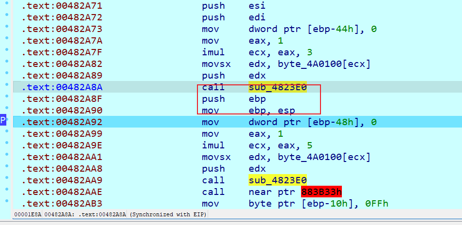
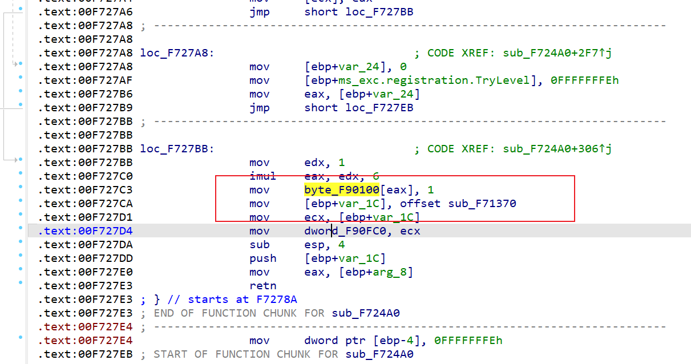
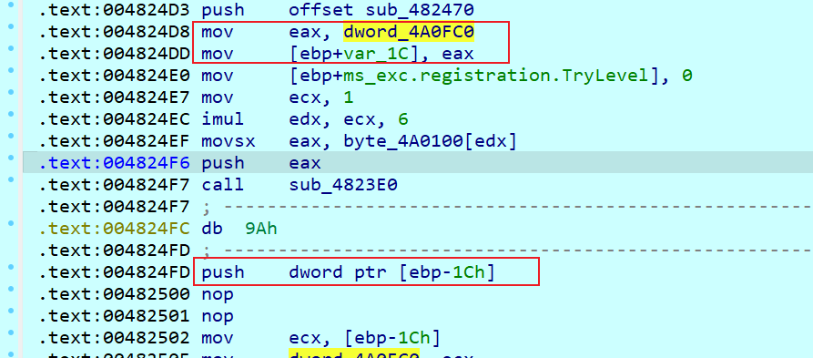
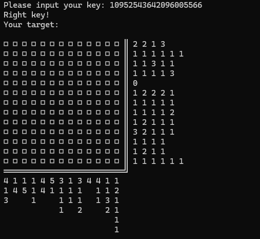
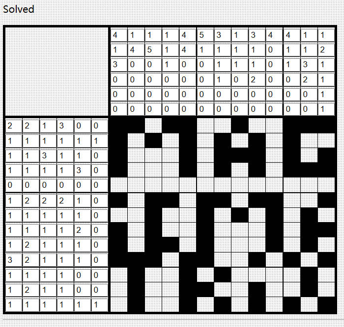

# N1Junior 2025

## FlowerHidden

明显的花指令，进来后先是一堆push函数，然后进到函数里不断修改计算EAX，最后跳转了0x482A60

单步走完sub_4823E0函数发现直接跳转到后面的指令，交叉引用发现他出现了很多次

函数如下，可以发现实际上就是retaddr+=a1

~~~c
int __stdcall sub_4823E0(int a1)
{
  unsigned int v1; // ebx
  int result; // eax
  char *retaddr; // [esp+0h] [ebp+0h]

  v1 = ~a1 & 0xA | a1 & 0xFFFFFFF5;
  result = 10 * (unsigned __int64)v1 / v1;
  retaddr += result ^ v1;
  return result;
}
~~~

发现传参正是前面push的值，分析下汇编代码，实现了一个取值

~~~
.text:00482A7A                 mov     eax, 1
.text:00482A7F                 imul    ecx, eax, 3
.text:00482A82                 movsx   edx, byte_4A0100[ecx]
.text:00482A89                 push    edx
~~~

byte_4A0100数组值开头是0-7，因此基本确认ecx值是多少就往后面跳多少字节，options-general-number of opcode bytes填上5就可以开始手动nop了

nop完成后

~~~c
int sub_482A60()
{
  FILE *v0; // eax
  FILE *v1; // eax
  int v2; // eax
  int v3; // eax
  int v4; // eax
  int v6; // [esp+10h] [ebp-58h]
  int ii; // [esp+14h] [ebp-54h]
  int v8; // [esp+18h] [ebp-50h]
  int v9; // [esp+20h] [ebp-48h]
  int v10; // [esp+24h] [ebp-44h]
  int v11; // [esp+28h] [ebp-40h] BYREF
  int v12; // [esp+2Ch] [ebp-3Ch] BYREF
  unsigned int k; // [esp+30h] [ebp-38h]
  unsigned int j; // [esp+34h] [ebp-34h]
  unsigned int i; // [esp+38h] [ebp-30h]
  int v16; // [esp+3Ch] [ebp-2Ch]
  int n; // [esp+40h] [ebp-28h]
  int m; // [esp+44h] [ebp-24h]
  _BYTE v19[16]; // [esp+48h] [ebp-20h]
  _BYTE v20[12]; // [esp+58h] [ebp-10h]

  v10 = 0;
  v9 = 0;
  v20[0] = -1;
  v20[1] = -29;
  v20[2] = -11;
  v20[3] = -81;
  v20[4] = -26;
  v20[5] = -31;
  v20[6] = -1;
  v20[7] = -6;
  v20[8] = -5;
  v20[9] = -75;
  for ( i = 0; i < 0xA; ++i )
    sub_4830D0("%c", ~v20[i] & 0x8F | v20[i] & 0x70);
  v0 = __acrt_iob_func(0);
  fgets(Buffer, 100, v0);
  for ( j = 0; j < 0xA; ++j )
    sub_4830D0("%c", ~v20[j] & 0x8F | v20[j] & 0x70);
  v1 = __acrt_iob_func(0);
  fgets(byte_4A0F84, 100, v1);
  while ( byte_4A0F84[v9] != 10 )
    ++v9;
  while ( Buffer[v10] != 10 )
    ++v10;
  v19[0] = -40;
  v19[1] = -3;
  v19[2] = -32;
  v19[3] = -31;
  v19[4] = -24;
  v19[5] = -81;
  v19[6] = -58;
  v19[7] = -31;
  v19[8] = -1;
  v19[9] = -6;
  v19[10] = -5;
  v19[11] = -81;
  v19[12] = -61;
  v19[13] = -22;
  v19[14] = -31;
  v19[15] = -82;
  if ( v10 == 42 && v9 == 42 )
  {
    v8 = 1;
  }
  else
  {
    for ( k = 0; k < 0x10; ++k )
      sub_4830D0("%c", ~v19[k] & 0x8F | v19[k] & 0x70);
    v8 = 0;
  }
  if ( v8 == 1 )
  {
    v12 = 0;
    v11 = 0;
    v6 = 0;
    v16 = 0;
    for ( m = 0; m < 12; ++m )
    {
      for ( n = 0; n < 12; ++n )
        byte_4A0388[12 * m + n] = ~byte_4A0388[12 * m + n] & 0x98 | byte_4A0388[12 * m + n] & 0x67;
    }
    for ( ii = 0; ; ++ii )
    {
      switch ( byte_4A0F84[ii] )
      {
        case 'a':
          sub_4824A0((int)&v12, (int)&v11, 3);
          v16 = v3;
          break;
        case 'd':
          sub_4824A0((int)&v12, (int)&v11, 4);
          v16 = v4;
          break;
        case 's':
          sub_4824A0((int)&v12, (int)&v11, 2);
          v16 = v2;
          break;
        case 'w':
          JUMPOUT(0x482EA7);
        default:
          sub_4830D0("wrong move");
          _loaddll((char *)1);
          break;
      }
      if ( v16 )
      {
        v6 += v16;
        if ( byte_4A0388[12 * v12 + v11] == 38 && v6 == 117 )
        {
          sub_4830D0("ohh! you did it!");
          _loaddll(0);
        }
      }
      else
      {
        sub_4830D0("Where are you going?");
        _loaddll(0);
      }
    }
  }
  return 0;
}
~~~

要求输入两个字符串长度均为42，byte_4A0388数组做了异或0x98，动调取出来可以看到是个迷宫

~~~python
maze = [0x40, 0x31, 0x31, 0x31, 0x31, 0x31, 0x30, 0x30, 0x30, 0x30, 0x31, 0x00, 0x30, 0x30, 0x30, 0x31, 0x30, 0x30, 0x30, 0x31, 0x31, 0x30, 0x31, 0x00, 0x31, 0x31, 0x30, 0x31, 0x30, 0x31, 0x30, 0x30, 0x31, 0x30, 0x31, 0x00, 0x31, 0x31, 0x30, 0x30, 0x30, 0x31, 0x31, 0x30, 0x30, 0x30, 0x31, 0x00, 0x31, 0x31, 0x30, 0x31, 0x31, 0x30, 0x30, 0x30, 0x31, 0x31, 0x31, 0x00, 0x31, 0x31, 0x30, 0x31, 0x31, 0x30, 0x31, 0x31, 0x31, 0x31, 0x31, 0x00, 0x31, 0x30, 0x30, 0x30, 0x30, 0x30, 0x31, 0x31, 0x31, 0x31, 0x31, 0x00, 0x31, 0x30, 0x31, 0x31, 0x31, 0x30, 0x30, 0x31, 0x30, 0x30, 0x30, 0x00, 0x31, 0x30, 0x30, 0x30, 0x31, 0x31, 0x30, 0x30, 0x30, 0x31, 0x30, 0x00, 0x31, 0x31, 0x31, 0x30, 0x31, 0x31, 0x30, 0x31, 0x31, 0x31, 0x30, 0x00, 0x31, 0x31, 0x31, 0x30, 0x30, 0x30, 0x30, 0x30, 0x30, 0x30, 0x26, 0x00, 0x31, 0x31, 0x31, 0x31, 0x31, 0x31, 0x31, 0x31, 0x31, 0x31, 0x31, 0x00]
for i in range(0, len(maze), 12):
    for j in range(11):
        print(chr(maze[i + j]), end="")
    print()
"""
@1111100001
00010001101
11010100101
11000110001
11011000111
11011011111
10000011111
10111001000
10001100010
11101101110
1110000000&
11111111111
"""
~~~

查看sub_4824A0，是迷宫检查

~~~c
int __cdecl sub_4824A0(_DWORD *a1, _DWORD *a2, int a3)
{
  int result; // eax

  switch ( a3 )
  {
    case 2:
      if ( *a1 == 11 )
      {
        result = 0;
      }
      else if ( byte_4A0388[12 * *a1 + 12 + *a2] == 49 )
      {
        result = 0;
      }
      else
      {
        byte_4A0388[12 * (*a1)++ + *a2] = 49;
        result = 2;
      }
      break;
    case 3:
      if ( *a2 )
      {
        if ( byte_4A0387[12 * *a1 + *a2] == 49 )
        {
          result = 0;
        }
        else
        {
          byte_4A0388[12 * *a1 + (*a2)--] = 49;
          result = 3;
        }
      }
      else
      {
        result = 0;
      }
      break;
    case 4:
      if ( *a2 == 11 )
      {
        result = 0;
      }
      else if ( byte_4A0389[12 * *a1 + *a2] == 49 )
      {
        result = 0;
      }
      else
      {
        byte_4A0388[12 * *a1 + (*a2)++] = 49;
        result = 4;
      }
      break;
    default:
      if ( *a1 )
      {
        if ( byte_4A0388[12 * *a1 - 12 + *a2] == 49 )
        {
          result = 0;
        }
        else
        {
          byte_4A0388[12 * (*a1)-- + *a2] = 49;
          result = 1;
        }
      }
      else
      {
        result = 0;
      }
      break;
  }
  return result;
}
~~~

patch完发现sub_4824A0函数下方出现try-catch，由此可知有东西藏起来了

出现了byte_F90100，交叉引用找到一个带有反调试的函数

~~~c
HANDLE sub_F71D80()
{
  HANDLE result; // eax
  _SYSTEM_INFO SystemInfo; // [esp+0h] [ebp-3C8h] BYREF
  DWORD flOldProtect; // [esp+24h] [ebp-3A4h] BYREF
  DWORD CurrentProcessId; // [esp+2Ch] [ebp-39Ch]
  SIZE_T dwSize; // [esp+30h] [ebp-398h]
  int v5; // [esp+34h] [ebp-394h]
  LPVOID lpAddress; // [esp+38h] [ebp-390h]
  void *v7; // [esp+3Ch] [ebp-38Ch]
  DWORD th32ParentProcessID; // [esp+40h] [ebp-388h]
  DWORD dwPageSize; // [esp+44h] [ebp-384h]
  size_t Size; // [esp+48h] [ebp-380h]
  unsigned int m; // [esp+4Ch] [ebp-37Ch]
  unsigned int k; // [esp+50h] [ebp-378h]
  size_t v13; // [esp+54h] [ebp-374h]
  unsigned int i; // [esp+58h] [ebp-370h]
  char String2[4]; // [esp+5Ch] [ebp-36Ch] BYREF
  _BYTE v16[4]; // [esp+60h] [ebp-368h] BYREF
  FILE *Stream; // [esp+64h] [ebp-364h]
  void *Buffer; // [esp+68h] [ebp-360h]
  size_t j; // [esp+6Ch] [ebp-35Ch]
  HANDLE hSnapshot; // [esp+70h] [ebp-358h]
  PROCESSENTRY32W pe; // [esp+74h] [ebp-354h] BYREF
  char String1[260]; // [esp+2A0h] [ebp-128h] BYREF
  _BYTE v23[16]; // [esp+3A4h] [ebp-24h]
  char FileName[16]; // [esp+3B4h] [ebp-14h] BYREF

  FileName[0] = -29;
  FileName[1] = -66;
  FileName[2] = -1;
  FileName[3] = -30;
  FileName[4] = -32;
  FileName[5] = -29;
  FileName[6] = -6;
  FileName[7] = -10;
  FileName[8] = -95;
  FileName[9] = -26;
  FileName[10] = -1;
  FileName[11] = -6;
  FileName[12] = -113;
  for ( i = 0; i < 0xD; ++i )
    FileName[i] ^= 0x8Fu;
  Stream = fopen(FileName, "rb");
  if ( !Stream )
  {
    sub_F730D0("%c%c", 58, 40);
    _loaddll((char *)1);
  }
  fseek(Stream, 0, 2);
  Size = ftell(Stream);
  rewind(Stream);
  Buffer = malloc(Size);
  if ( !Buffer )
  {
    fclose(Stream);
    sub_F730D0("%c%c", 58, 40);
    _loaddll((char *)1);
  }
  v13 = fread(Buffer, 1u, Size, Stream);
  if ( v13 != Size )
  {
    free(Buffer);
    fclose(Stream);
    sub_F730D0("%c%c", 58, 40);
    _loaddll((char *)1);
  }
  v23[0] = -32;
  v23[1] = -114;
  v23[2] = -25;
  v23[3] = -59;
  v23[4] = -5;
  v23[5] = -63;
  v23[6] = -109;
  v23[7] = -62;
  v23[8] = -98;
  v23[9] = -27;
  v23[10] = -12;
  v23[11] = -53;
  v23[12] = -25;
  v23[13] = -31;
  v23[14] = -119;
  v23[15] = -3;
  for ( j = 0; j < v13; ++j )
  {
    *((_BYTE *)Buffer + j) ^= v23[j % 0x10];
    *((_BYTE *)Buffer + j) += v23[j % 0x10];
  }
  dword_F90FB0 = (int)malloc(0x10u);
  if ( !dword_F90FB0 )
  {
    sub_F730D0("%c%c", 58, 40);
    _loaddll((char *)1);
  }
  *(_DWORD *)dword_F90FB0 = Buffer;
  qmemcpy(v16, "FUNC", sizeof(v16));
  *(_DWORD *)(dword_F90FB0 + 4) = *(_DWORD *)dword_F90FB0 + sub_F71AC0(*(_DWORD *)dword_F90FB0, v16, v13);
  *(_DWORD *)(dword_F90FB0 + 8) = *(_DWORD *)(dword_F90FB0 + 4) + sub_F71AC0(*(_DWORD *)(dword_F90FB0 + 4), v16, v13);
  *(_DWORD *)(dword_F90FB0 + 12) = *(_DWORD *)(dword_F90FB0 + 8) + sub_F71AC0(*(_DWORD *)(dword_F90FB0 + 8), v16, v13);
  GetSystemInfo(&SystemInfo);
  dwPageSize = SystemInfo.dwPageSize;
  v7 = Buffer;
  lpAddress = (LPVOID)((unsigned int)Buffer & ~(SystemInfo.dwPageSize - 1));
  dwSize = (~(SystemInfo.dwPageSize - 1) & ((unsigned int)Buffer + Size + SystemInfo.dwPageSize - 1))
         - (_DWORD)lpAddress;
  if ( !VirtualProtect(lpAddress, dwSize, 0x40u, &flOldProtect) )
  {
    sub_F730D0("%c%c", 58, 40);
    _loaddll((char *)1);
  }
  CurrentProcessId = GetCurrentProcessId();
  th32ParentProcessID = 0;
  result = CreateToolhelp32Snapshot(2u, 0);
  hSnapshot = result;
  if ( result != (HANDLE)-1 )
  {
    pe.dwSize = 556;
    if ( !Process32FirstW(hSnapshot, &pe) )
      return (HANDLE)CloseHandle(hSnapshot);
    while ( pe.th32ProcessID != CurrentProcessId )
    {
      if ( !Process32NextW(hSnapshot, &pe) )
        goto LABEL_23;
    }
    th32ParentProcessID = pe.th32ParentProcessID;
LABEL_23:
    result = (HANDLE)CloseHandle(hSnapshot);
    if ( th32ParentProcessID )
    {
      result = CreateToolhelp32Snapshot(2u, 0);
      hSnapshot = result;
      if ( result != (HANDLE)-1 )
      {
        pe.dwSize = 556;
        if ( !Process32FirstW(hSnapshot, &pe) )
          return (HANDLE)CloseHandle(hSnapshot);
        memset(String1, 0, sizeof(String1));
        v5 = 0;
        while ( pe.th32ProcessID != th32ParentProcessID )
        {
          if ( !Process32NextW(hSnapshot, &pe) )
            goto LABEL_33;
        }
        for ( k = 0; k < 0x103; ++k )
          String1[k] = pe.szExeFile[k];
        v5 = 1;
LABEL_33:
        result = (HANDLE)CloseHandle(hSnapshot);
        if ( v5 )
        {
          String2[0] = -26;
          String2[1] = -21;
          String2[2] = -18;
          String2[3] = -113;
          for ( m = 0; m < 4; ++m )
            String2[m] ^= 0x8Fu;
          result = (HANDLE)_strnicmp(String1, String2, 3u);
          if ( result )
            byte_F90100[6] = 10;
        }
      }
    }
  }
  return result;
}
~~~

这个函数动调可知读取了l1pmoluy.ipu文件，同时在_strnicmp比较了ida字符串，所以如果正常的话会修改byte_F90100[6]为10

拐回去看sub_4823E0，如果这里是10，那么v1就是0，这时候会发生除0异常，所以我们不能把调用byte_F90100[6]的地方patch掉

所以回去修改，然后直接在原来的附件上动调到反调试这里，进到if里然后F9直到碰到除0异常，会发现来到了抛出的地方，单步调试看做了什么

~~~
.text:00482790 loc_482790:                             ; DATA XREF: .rdata:stru_49F0E0↓o
.text:00482790 mov     esp, [ebp-18h]
.text:00482793 cmp     dword ptr [ebp+10h], 2
.text:00482797 jnz     short loc_4827A8
.text:00482799 mov     edx, [ebp+8]
.text:0048279C mov     eax, [edx]
.text:0048279E add     eax, 1
.text:004827A1 mov     ecx, [ebp+8]
.text:004827A4 mov     [ecx], eax
.text:004827A6 jmp     short loc_4827BB
.text:004827A8 ; ---------------------------------------------------------------------------
.text:004827A8
.text:004827A8 loc_4827A8:                             ; CODE XREF: .text:00482797↑j
.text:004827A8 mov     dword ptr [ebp-24h], 0
.text:004827AF mov     dword ptr [ebp-4], 0FFFFFFFEh
.text:004827B6 mov     eax, [ebp-24h]
.text:004827B9 jmp     short loc_4827EB
.text:004827BB ; ---------------------------------------------------------------------------
.text:004827BB
.text:004827BB loc_4827BB:                             ; CODE XREF: .text:004827A6↑j
.text:004827BB mov     edx, 1
.text:004827C0 imul    eax, edx, 6
.text:004827C3 mov     byte_4A0100[eax], 1
.text:004827CA mov     dword ptr [ebp-1Ch], offset sub_481370
.text:004827D1 mov     ecx, [ebp-1Ch]
.text:004827D4 mov     dword_4A0FC0, ecx
.text:004827DA sub     esp, 4
.text:004827DD push    dword ptr [ebp-1Ch]
.text:004827E0 mov     eax, [ebp+10h]
.text:004827E3 retn
.text:004827E4 ; ---------------------------------------------------------------------------
.text:004827E4 mov     dword ptr [ebp-4], 0FFFFFFFEh
.text:004827EB
.text:004827EB loc_4827EB:                             ; CODE XREF: .text:00482788↑j
.text:004827EB                                         ; .text:004827B9↑j
.text:004827EB mov     ecx, [ebp-10h]
.text:004827EE mov     large fs:0, ecx
.text:004827F5 pop     ecx
.text:004827F6 pop     edi
.text:004827F7 pop     esi
.text:004827F8 pop     ebx
.text:004827F9 mov     esp, ebp
.text:004827FB pop     ebp
.text:004827FC retn
~~~

首先把byte_4A0100[6]设置为了1（所以只会出现一次除0异常，之后这里都是跳过1字节），然后把sub_481370地址赋给了dword_4A0FC0并push（之后在sub_4824A0会把retn地址设置为sub_481370），retn返回就直接来到了sub_481370

~~~c
// positive sp value has been detected, the output may be wrong!
int __usercall sub_481370@<eax>(int a1@<eax>)
{
  dword_4A0FB8 = a1;
  if ( a1 == 1 )
  {
    (*(void (__cdecl **)(char *))dword_4A0FB0)(off_4A0234);
  }
  else
  {
    switch ( dword_4A0FB8 )
    {
      case 2:
        (*(void (__cdecl **)(char *))(dword_4A0FB0 + 4))(off_4A0234);
        break;
      case 3:
        (*(void (__cdecl **)(char *))(dword_4A0FB0 + 8))(off_4A0234);
        break;
      case 4:
        (*(void (__cdecl **)(char *))(dword_4A0FB0 + 12))(off_4A0234);
        break;
      default:
        return dword_4A0FB8;
    }
  }
  sub_481210();
  return dword_4A0FB8;
}
~~~

可以发现根据a1的值跳转进了不同函数，分别提取出来

~~~c
int __cdecl sub_114BFD0(int a1)
{
  int result; // eax
  unsigned __int8 v2; // [esp+4Fh] [ebp-5h]
  int i; // [esp+50h] [ebp-4h]

  for ( i = 0; i < 42; ++i )
  {
    v2 = *(_BYTE *)(i + a1);
    *(_BYTE *)(i + a1) = i ^ ~((int)(unsigned __int8)(i ^ ((v2 << (8 - (i & 7))) | ((int)v2 >> (i & 7)))) >> (8 - (i & 7))) & ~(unsigned __int8)((unsigned __int8)(i ^ ((v2 << (8 - (i & 7))) | ((int)v2 >> (i & 7)))) << (i & 7));
    result = i + 1;
  }
  return result;
}
int __cdecl sub_114C097(int a1)
{
  int result; // eax
  char v2; // [esp+4Eh] [ebp-4Ah]
  char v3; // [esp+4Fh] [ebp-49h]
  int n; // [esp+50h] [ebp-48h]
  int ii; // [esp+50h] [ebp-48h]
  int m; // [esp+54h] [ebp-44h]
  int k; // [esp+58h] [ebp-40h]
  int v8; // [esp+5Ch] [ebp-3Ch]
  _BYTE v9[31]; // [esp+60h] [ebp-38h] BYREF
  char v10; // [esp+7Fh] [ebp-19h]
  int j; // [esp+80h] [ebp-18h]
  int i; // [esp+84h] [ebp-14h]
  _BYTE v13[16]; // [esp+88h] [ebp-10h]

  v13[0] = -67;
  v13[1] = -65;
  v13[2] = -67;
  v13[3] = -70;
  v13[4] = -63;
  v13[5] = -66;
  v13[6] = -20;
  v13[7] = -5;
  v13[8] = -23;
  v13[9] = -113;
  for ( i = 0; i < 10; ++i )
  {
    v13[i] = ~v13[i] & 0x8F | v13[i] & 0x70;
    result = i + 1;
  }
  for ( j = 0; j < 42; ++j )
  {
    v10 = *(_BYTE *)(j + a1);
    v8 = 0;
    for ( k = -1; k <= 1; ++k )
    {
      for ( m = -1; m <= 1; ++m )
      {
        v9[3 * v8] = m + v13[j % 10] + 16 * k;
        v9[3 * v8 + 1] = ((unsigned __int8)v9[3 * v8] % 3) & 1;
        v9[3 * v8 + 2] = ((unsigned __int8)v9[3 * v8] % 5) & 1;
        ++v8;
      }
    }
    v3 = 0;
    v2 = 0;
    for ( n = 0; n < 8; ++n )
      v3 |= (unsigned __int8)v9[3 * n + 1] << (7 - n);
    if ( v9[3 * n + 1] )
      v10 -= v3;
    else
      v10 += v3 + 1;
    for ( ii = 0; ii < 8; ++ii )
      v2 |= (unsigned __int8)v9[3 * ii + 2] << (7 - ii);
    if ( v9[3 * ii + 2] )
      v10 += ~v2;
    else
      v10 += v2;
    *(_BYTE *)(j + a1) = v10;
    result = j + 1;
  }
  return result;
}
int __cdecl sub_114C33D(int a1)
{
  int result; // eax
  unsigned __int8 v2; // [esp+93h] [ebp-209h]
  int i; // [esp+94h] [ebp-208h]
  _BYTE v4[256]; // [esp+98h] [ebp-204h] BYREF
  _BYTE v5[260]; // [esp+198h] [ebp-104h] BYREF

  v5[0] = 0;
  v5[1] = 1;
  v5[2] = 2;
  v5[3] = 3;
  v5[4] = 4;
  v5[5] = 5;
  v5[6] = 6;
  v5[7] = 7;
  v5[8] = 8;
  v5[9] = 9;
  v5[10] = 10;
  v5[11] = 11;
  v5[12] = 12;
  v5[13] = 13;
  v5[14] = 14;
  v5[15] = 15;
  v5[16] = 0;
  v5[17] = 3;
  v5[18] = 2;
  v5[19] = 5;
  v5[20] = 4;
  v5[21] = 7;
  v5[22] = 6;
  v5[23] = 9;
  v5[24] = 8;
  v5[25] = 11;
  v5[26] = 10;
  v5[27] = 13;
  v5[28] = 12;
  v5[29] = 15;
  v5[30] = 14;
  v5[31] = 1;
  v5[32] = 0;
  v5[33] = 1;
  v5[34] = 6;
  v5[35] = 7;
  v5[36] = 4;
  v5[37] = 5;
  v5[38] = 10;
  v5[39] = 11;
  v5[40] = 8;
  v5[41] = 9;
  v5[42] = 14;
  v5[43] = 15;
  v5[44] = 12;
  v5[45] = 13;
  v5[46] = 2;
  v5[47] = 3;
  v5[48] = 0;
  v5[49] = 7;
  v5[50] = 6;
  v5[51] = 5;
  v5[52] = 4;
  v5[53] = 11;
  v5[54] = 10;
  v5[55] = 9;
  v5[56] = 8;
  v5[57] = 15;
  v5[58] = 14;
  v5[59] = 13;
  v5[60] = 12;
  v5[61] = 3;
  v5[62] = 2;
  v5[63] = 1;
  v5[64] = 0;
  v5[65] = 1;
  v5[66] = 2;
  v5[67] = 3;
  v5[68] = 12;
  v5[69] = 13;
  v5[70] = 14;
  v5[71] = 15;
  v5[72] = 8;
  v5[73] = 9;
  v5[74] = 10;
  v5[75] = 11;
  v5[76] = 4;
  v5[77] = 5;
  v5[78] = 6;
  v5[79] = 7;
  v5[80] = 0;
  v5[81] = 3;
  v5[82] = 2;
  v5[83] = 13;
  v5[84] = 12;
  v5[85] = 15;
  v5[86] = 14;
  v5[87] = 9;
  v5[88] = 8;
  v5[89] = 11;
  v5[90] = 10;
  v5[91] = 5;
  v5[92] = 4;
  v5[93] = 7;
  v5[94] = 6;
  v5[95] = 1;
  v5[96] = 0;
  v5[97] = 1;
  v5[98] = 14;
  v5[99] = 15;
  v5[100] = 12;
  v5[101] = 13;
  v5[102] = 10;
  v5[103] = 11;
  v5[104] = 8;
  v5[105] = 9;
  v5[106] = 6;
  v5[107] = 7;
  v5[108] = 4;
  v5[109] = 5;
  v5[110] = 2;
  v5[111] = 3;
  v5[112] = 0;
  v5[113] = 15;
  v5[114] = 14;
  v5[115] = 13;
  v5[116] = 12;
  v5[117] = 11;
  v5[118] = 10;
  v5[119] = 9;
  v5[120] = 8;
  v5[121] = 7;
  v5[122] = 6;
  v5[123] = 5;
  v5[124] = 4;
  v5[125] = 3;
  v5[126] = 2;
  v5[127] = 1;
  v5[128] = 0;
  v5[129] = 1;
  v5[130] = 2;
  v5[131] = 3;
  v5[132] = 4;
  v5[133] = 5;
  v5[134] = 6;
  v5[135] = 7;
  v5[136] = 8;
  v5[137] = 9;
  v5[138] = 10;
  v5[139] = 11;
  v5[140] = 12;
  v5[141] = 13;
  v5[142] = 14;
  v5[143] = 15;
  v5[144] = 0;
  v5[145] = 3;
  v5[146] = 2;
  v5[147] = 5;
  v5[148] = 4;
  v5[149] = 7;
  v5[150] = 6;
  v5[151] = 9;
  v5[152] = 8;
  v5[153] = 11;
  v5[154] = 10;
  v5[155] = 13;
  v5[156] = 12;
  v5[157] = 15;
  v5[158] = 14;
  v5[159] = 1;
  v5[160] = 0;
  v5[161] = 1;
  v5[162] = 6;
  v5[163] = 7;
  v5[164] = 4;
  v5[165] = 5;
  v5[166] = 10;
  v5[167] = 11;
  v5[168] = 8;
  v5[169] = 9;
  v5[170] = 14;
  v5[171] = 15;
  v5[172] = 12;
  v5[173] = 13;
  v5[174] = 2;
  v5[175] = 3;
  v5[176] = 0;
  v5[177] = 7;
  v5[178] = 6;
  v5[179] = 5;
  v5[180] = 4;
  v5[181] = 11;
  v5[182] = 10;
  v5[183] = 9;
  v5[184] = 8;
  v5[185] = 15;
  v5[186] = 14;
  v5[187] = 13;
  v5[188] = 12;
  v5[189] = 3;
  v5[190] = 2;
  v5[191] = 1;
  v5[192] = 0;
  v5[193] = 1;
  v5[194] = 2;
  v5[195] = 3;
  v5[196] = 12;
  v5[197] = 13;
  v5[198] = 14;
  v5[199] = 15;
  v5[200] = 8;
  v5[201] = 9;
  v5[202] = 10;
  v5[203] = 11;
  v5[204] = 4;
  v5[205] = 5;
  v5[206] = 6;
  v5[207] = 7;
  v5[208] = 0;
  v5[209] = 3;
  v5[210] = 2;
  v5[211] = 13;
  v5[212] = 12;
  v5[213] = 15;
  v5[214] = 14;
  v5[215] = 9;
  v5[216] = 8;
  v5[217] = 11;
  v5[218] = 10;
  v5[219] = 5;
  v5[220] = 4;
  v5[221] = 7;
  v5[222] = 6;
  v5[223] = 1;
  v5[224] = 0;
  v5[225] = 1;
  v5[226] = 14;
  v5[227] = 15;
  v5[228] = 12;
  v5[229] = 13;
  v5[230] = 10;
  v5[231] = 11;
  v5[232] = 8;
  v5[233] = 9;
  v5[234] = 6;
  v5[235] = 7;
  v5[236] = 4;
  v5[237] = 5;
  v5[238] = 2;
  v5[239] = 3;
  v5[240] = 0;
  v5[241] = 15;
  v5[242] = 14;
  v5[243] = 13;
  v5[244] = 12;
  v5[245] = 11;
  v5[246] = 10;
  v5[247] = 9;
  v5[248] = 8;
  v5[249] = 7;
  v5[250] = 6;
  v5[251] = 5;
  v5[252] = 4;
  v5[253] = 3;
  v5[254] = 2;
  v5[255] = 1;
  v4[0] = 0;
  v4[1] = 15;
  v4[2] = 14;
  v4[3] = 13;
  v4[4] = 12;
  v4[5] = 11;
  v4[6] = 10;
  v4[7] = 9;
  v4[8] = 8;
  v4[9] = 7;
  v4[10] = 6;
  v4[11] = 5;
  v4[12] = 4;
  v4[13] = 3;
  v4[14] = 2;
  v4[15] = 1;
  v4[16] = 0;
  v4[17] = 1;
  v4[18] = 14;
  v4[19] = 15;
  v4[20] = 12;
  v4[21] = 13;
  v4[22] = 10;
  v4[23] = 11;
  v4[24] = 8;
  v4[25] = 9;
  v4[26] = 6;
  v4[27] = 7;
  v4[28] = 4;
  v4[29] = 5;
  v4[30] = 2;
  v4[31] = 3;
  v4[32] = 0;
  v4[33] = 3;
  v4[34] = 2;
  v4[35] = 13;
  v4[36] = 12;
  v4[37] = 15;
  v4[38] = 14;
  v4[39] = 9;
  v4[40] = 8;
  v4[41] = 11;
  v4[42] = 10;
  v4[43] = 5;
  v4[44] = 4;
  v4[45] = 7;
  v4[46] = 6;
  v4[47] = 1;
  v4[48] = 0;
  v4[49] = 1;
  v4[50] = 2;
  v4[51] = 3;
  v4[52] = 12;
  v4[53] = 13;
  v4[54] = 14;
  v4[55] = 15;
  v4[56] = 8;
  v4[57] = 9;
  v4[58] = 10;
  v4[59] = 11;
  v4[60] = 4;
  v4[61] = 5;
  v4[62] = 6;
  v4[63] = 7;
  v4[64] = 0;
  v4[65] = 7;
  v4[66] = 6;
  v4[67] = 5;
  v4[68] = 4;
  v4[69] = 11;
  v4[70] = 10;
  v4[71] = 9;
  v4[72] = 8;
  v4[73] = 15;
  v4[74] = 14;
  v4[75] = 13;
  v4[76] = 12;
  v4[77] = 3;
  v4[78] = 2;
  v4[79] = 1;
  v4[80] = 0;
  v4[81] = 1;
  v4[82] = 6;
  v4[83] = 7;
  v4[84] = 4;
  v4[85] = 5;
  v4[86] = 10;
  v4[87] = 11;
  v4[88] = 8;
  v4[89] = 9;
  v4[90] = 14;
  v4[91] = 15;
  v4[92] = 12;
  v4[93] = 13;
  v4[94] = 2;
  v4[95] = 3;
  v4[96] = 0;
  v4[97] = 3;
  v4[98] = 2;
  v4[99] = 5;
  v4[100] = 4;
  v4[101] = 7;
  v4[102] = 6;
  v4[103] = 9;
  v4[104] = 8;
  v4[105] = 11;
  v4[106] = 10;
  v4[107] = 13;
  v4[108] = 12;
  v4[109] = 15;
  v4[110] = 14;
  v4[111] = 1;
  v4[112] = 0;
  v4[113] = 1;
  v4[114] = 2;
  v4[115] = 3;
  v4[116] = 4;
  v4[117] = 5;
  v4[118] = 6;
  v4[119] = 7;
  v4[120] = 8;
  v4[121] = 9;
  v4[122] = 10;
  v4[123] = 11;
  v4[124] = 12;
  v4[125] = 13;
  v4[126] = 14;
  v4[127] = 15;
  v4[128] = 0;
  v4[129] = 15;
  v4[130] = 14;
  v4[131] = 13;
  v4[132] = 12;
  v4[133] = 11;
  v4[134] = 10;
  v4[135] = 9;
  v4[136] = 8;
  v4[137] = 7;
  v4[138] = 6;
  v4[139] = 5;
  v4[140] = 4;
  v4[141] = 3;
  v4[142] = 2;
  v4[143] = 1;
  v4[144] = 0;
  v4[145] = 1;
  v4[146] = 14;
  v4[147] = 15;
  v4[148] = 12;
  v4[149] = 13;
  v4[150] = 10;
  v4[151] = 11;
  v4[152] = 8;
  v4[153] = 9;
  v4[154] = 6;
  v4[155] = 7;
  v4[156] = 4;
  v4[157] = 5;
  v4[158] = 2;
  v4[159] = 3;
  v4[160] = 0;
  v4[161] = 3;
  v4[162] = 2;
  v4[163] = 13;
  v4[164] = 12;
  v4[165] = 15;
  v4[166] = 14;
  v4[167] = 9;
  v4[168] = 8;
  v4[169] = 11;
  v4[170] = 10;
  v4[171] = 5;
  v4[172] = 4;
  v4[173] = 7;
  v4[174] = 6;
  v4[175] = 1;
  v4[176] = 0;
  v4[177] = 1;
  v4[178] = 2;
  v4[179] = 3;
  v4[180] = 12;
  v4[181] = 13;
  v4[182] = 14;
  v4[183] = 15;
  v4[184] = 8;
  v4[185] = 9;
  v4[186] = 10;
  v4[187] = 11;
  v4[188] = 4;
  v4[189] = 5;
  v4[190] = 6;
  v4[191] = 7;
  v4[192] = 0;
  v4[193] = 7;
  v4[194] = 6;
  v4[195] = 5;
  v4[196] = 4;
  v4[197] = 11;
  v4[198] = 10;
  v4[199] = 9;
  v4[200] = 8;
  v4[201] = 15;
  v4[202] = 14;
  v4[203] = 13;
  v4[204] = 12;
  v4[205] = 3;
  v4[206] = 2;
  v4[207] = 1;
  v4[208] = 0;
  v4[209] = 1;
  v4[210] = 6;
  v4[211] = 7;
  v4[212] = 4;
  v4[213] = 5;
  v4[214] = 10;
  v4[215] = 11;
  v4[216] = 8;
  v4[217] = 9;
  v4[218] = 14;
  v4[219] = 15;
  v4[220] = 12;
  v4[221] = 13;
  v4[222] = 2;
  v4[223] = 3;
  v4[224] = 0;
  v4[225] = 3;
  v4[226] = 2;
  v4[227] = 5;
  v4[228] = 4;
  v4[229] = 7;
  v4[230] = 6;
  v4[231] = 9;
  v4[232] = 8;
  v4[233] = 11;
  v4[234] = 10;
  v4[235] = 13;
  v4[236] = 12;
  v4[237] = 15;
  v4[238] = 14;
  v4[239] = 1;
  v4[240] = 0;
  v4[241] = 1;
  v4[242] = 2;
  v4[243] = 3;
  v4[244] = 4;
  v4[245] = 5;
  v4[246] = 6;
  v4[247] = 7;
  v4[248] = 8;
  v4[249] = 9;
  v4[250] = 10;
  v4[251] = 11;
  v4[252] = 12;
  v4[253] = 13;
  v4[254] = 14;
  v4[255] = 15;
  for ( i = 0; i < 42; ++i )
  {
    v2 = *(_BYTE *)(i + a1);
    *(_BYTE *)(i + a1) = (v4[16 * (v2 & 0xF) + (i & 0xF)] ^ v2 & 0xF) & 0xF | (16
                                                                             * ((v5[16 * (((int)v2 >> 4) & 0xF)
                                                                                  + (i & 0xF)] ^ ((int)v2 >> 4) & 0xF) & 0xF));
    result = i + 1;
  }
  return result;
}
int __cdecl sub_114D16E(int a1)
{
  int result; // eax
  int m; // [esp+50h] [ebp-E0h]
  int k; // [esp+54h] [ebp-DCh]
  int j; // [esp+58h] [ebp-D8h]
  int v5; // [esp+5Ch] [ebp-D4h]
  int v6; // [esp+60h] [ebp-D0h]
  int v7; // [esp+64h] [ebp-CCh]
  _BYTE v8[176]; // [esp+68h] [ebp-C8h]
  unsigned int i; // [esp+118h] [ebp-18h]
  _BYTE v10[20]; // [esp+11Ch] [ebp-14h]

  v10[0] = -50;
  v10[1] = -67;
  v10[2] = -68;
  v10[3] = -69;
  v10[4] = -70;
  v10[5] = -71;
  v10[6] = -72;
  v10[7] = -73;
  v10[8] = -74;
  v10[9] = -65;
  v10[10] = -59;
  v10[11] = -34;
  v10[12] = -60;
  for ( i = 0; i < 0xD; ++i )
    v10[i] = ~v10[i] & 0x8F | v10[i] & 0x70;
  v7 = 0;
  v6 = 0;
  v5 = 0;
  for ( j = 0; j < 42; ++j )
  {
    v8[j + 88] = j;
    if ( (unsigned int)j >= 0x2A )
      ((void (*)(void))unk_114D724)();
    v8[j] = 0;
  }
  while ( 1 )
  {
    v5 = (v5 + v7 + (char)v10[v7 % 13]) % 42;
    result = v5;
    if ( !v8[v5] )
    {
      v8[v6 + 44] = v8[v5 + 88];
      v8[v5] = 1;
      result = ++v6;
    }
    if ( v6 == 42 )
      break;
    ++v7;
  }
  for ( k = 0; k < 42; ++k )
  {
    v8[k + 132] = *(_BYTE *)(k + a1);
    result = k + 1;
  }
  for ( m = 0; m < 42; ++m )
  {
    *(_BYTE *)(m + a1) = v8[(unsigned __int8)v8[m + 44] + 132];
    result = m + 1;
  }
  return result;
}
~~~

分别对应值为1、2、3、4，我们输入第一个字符s对应2，正好是sub_4824A0最后的result值；每个函数里的a1正是前面Bufer的地址

~~~c
int sub_481210()
{
  unsigned int j; // [esp+0h] [ebp-8h]
  int i; // [esp+4h] [ebp-4h]

  dword_4A0FBC = 1;
  for ( i = 0; i < 42; ++i )
  {
    if ( off_4A0234[i] != byte_4A0358[i] )
      return 0;
  }
  for ( j = 0; j < 0x1D; ++j )
    sub_4830D0("%c", (unsigned __int8)byte_4A0518[j] ^ 0x8F);
  return 1;
}
~~~

sub_481210比较了Buffer和byte_4A0358

到这里基本清楚了，每次迷宫走的方向都会对Buffer做一次加密，要求最后到达&的位置且v6 == 117（result值求和），同时加密结果等于byte_4A0358

首先求解迷宫

~~~python
import sys

# 深度优先搜索的路径较长，可能超出Python默认的递归深度限制，因此提高该限制。
sys.setrecursionlimit(2000)

def solve_maze_on_zeros():
    """
    在一个12x11的网格中，寻找一条从'@'到'&'的路径。

    约束条件:
    - 路径只能在值为'0'的格子上行走。
    - 总步数必须为 42 步。
    - 根据移动方向(w,s,a,d)累加的分数总和必须为 117。
    """

    # 1. 定义网格
    grid_str = [
        "@1111100001",
        "00010001101",
        "11010100101",
        "11000110001",
        "11011000111",
        "11011011111",
        "10000011111",
        "10111001000",
        "10001100010",
        "11101101110",
        "1110000000&",
        "11111111111",
    ]

    # 2. 解析网格，设定起点和终点
    grid = []
    start_pos = None
    end_pos = None
    for r, row_str in enumerate(grid_str):
        row = list(row_str)
        if '@' in row:
            c = row.index('@')
            start_pos = (r, c)
            # 将起点'@'视为可通行的'0'
            row[c] = '0'
        if '&' in row:
            c = row.index('&')
            end_pos = (r, c)
            # 将终点'&'视为可通行的'0'
            row[c] = '0'
        grid.append(row)

    # 3. 定义常量
    ROWS = len(grid)
    COLS = len(grid[0])
    TARGET_STEPS = 42
    TARGET_SUM = 117

    # 使用列表来存储最终找到的解决方案，便于在递归函数中修改
    solution_holder = []

    # 4. 核心算法：深度优先搜索 (DFS) + 回溯 + 剪枝
    def find_path(x, y, steps, current_sum, path, visited):
        # 如果已找到解，则停止所有其他搜索分支
        if solution_holder:
            return

        # --- 剪枝优化 ---
        # 这是一个非常关键的优化：根据剩余步数和剩余分数，判断当前路径是否可能成功。
        # 如果剩余分数超出了剩余步数能达到的最大/最小范围，则该路径无效。
        steps_rem = TARGET_STEPS - steps
        if steps_rem < 0: return  # 步数已超

        sum_rem = TARGET_SUM - current_sum
        # 剩余步数能产生的最小分数是 steps_rem * 1 (全走'w')
        # 剩余步数能产生的最大分数是 steps_rem * 4 (全走'd')
        if not (steps_rem * 1 <= sum_rem <= steps_rem * 4):
            return

        # --- 终点判断 ---
        if (x, y) == end_pos:
            if steps == TARGET_STEPS and current_sum == TARGET_SUM:
                solution_holder.append(path)
            return

        # --- 递归探索 ---
        # 将当前格子加入“已访问”集合，防止在同一条路径中重复行走
        visited.add((x, y))

        # 定义移动方向：(行变化, 列变化, 方向字符, 分数)
        # 不同的探索顺序可能影响找到解的速度，但最终结果应一致
        moves = [
            (1, 0, '2', 2),  # 下
            (0, 1, '4', 4),  # 右
            (0, -1, '3', 3),  # 左
            (-1, 0, '1', 1),  # 上
        ]

        for dx, dy, move_char, move_val in moves:
            nx, ny = x + dx, y + dy

            # 检查下一步是否有效：在边界内、是'0'格子、且当前路径未访问过
            # 这是与上一个问题的核心区别
            if 0 <= nx < ROWS and 0 <= ny < COLS and grid[nx][ny] == '0' and (nx, ny) not in visited:
                find_path(nx, ny, steps + 1, current_sum + move_val, path + move_char, visited)
                # 如果在递归调用中找到了解，立即返回
                if solution_holder:
                    return

        # --- 回溯 ---
        # 将当前格子移出“已访问”集合，以便其他路径可以访问它
        visited.remove((x, y))

    # 5. 启动搜索
    print("正在搜索路径...")
    find_path(start_pos[0], start_pos[1], 0, 0, "", set())

    # 6. 返回结果
    if solution_holder:
        return solution_holder[0]
    else:
        return "未找到满足条件的路径。"

# --- 执行脚本并打印结果 ---
if __name__ == "__main__":
    result_path = solve_maze_on_zeros()
    print(list(map(int, list(result_path))))
~~~

得到[2, 4, 4, 2, 2, 4, 4, 1, 1, 4, 4, 2, 4, 2, 2, 3, 3, 2, 2, 3, 3, 3, 3, 2, 2, 4, 4, 2, 2, 4, 4, 4, 1, 1, 4, 4, 1, 4, 4, 2, 2, 2]

再去逆向解密

~~~python
def dec2(s):
    key = [0x96, 0x91, 0x96, 0xBB, 0x91, 0x3B, 0x96, 0xE6, 0x3C, 0xAC, 0x96, 0x91, 0x96, 0xBB, 0x91, 0x3B, 0x96, 0xE6, 0x3C,
     0xAC, 0x96, 0x91, 0x96, 0xBB, 0x91, 0x3B, 0x96, 0xE6, 0x3C, 0xAC, 0x96, 0x91, 0x96, 0xBB, 0x91, 0x3B, 0x96, 0xE6,
     0x3C, 0xAC, 0x96, 0x91]
    return [(s[i] - (key[i] - 97))&0xff for i in range(42)]

def dec4(s):
    key = [23, 32, 1, 14, 29, 4, 2, 25, 40, 6, 9, 3, 7, 33, 19, 39, 31, 11, 24, 26, 10, 30, 8, 22, 16, 28, 37, 0, 12, 13, 17, 41, 35, 27, 5, 15, 36, 18, 21, 38, 34, 20]
    return [s[key.index(i)] for i in range(42)]

def dec1(s):
    rol = lambda b, n: ((b << n) | (b >> (8 - n))) & 0xFF
    ror = lambda b, n: ((b >> n) | (b << (8 - n))) & 0xFF
    s = [rol(i ^ ror((~(i ^ c)) & 0xFF, i & 7), i & 7) for i, c in enumerate(s)]
    return s

def dec3(s):
    v4 = [
        0, 15, 14, 13, 12, 11, 10, 9, 8, 7, 6, 5, 4, 3, 2, 1, 0, 1, 14, 15, 12, 13, 10, 11,
        8, 9, 6, 7, 4, 5, 2, 3, 0, 3, 2, 13, 12, 15, 14, 9, 8, 11, 10, 5, 4, 7, 6, 1, 0, 1,
        2, 3, 12, 13, 14, 15, 8, 9, 10, 11, 4, 5, 6, 7, 0, 7, 6, 5, 4, 11, 10, 9, 8, 15,
        14, 13, 12, 3, 2, 1, 0, 1, 6, 7, 4, 5, 10, 11, 8, 9, 14, 15, 12, 13, 2, 3, 0, 3, 2,
        5, 4, 7, 6, 9, 8, 11, 10, 13, 12, 15, 14, 1, 0, 1, 2, 3, 4, 5, 6, 7, 8, 9, 10, 11,
        12, 13, 14, 15, 0, 15, 14, 13, 12, 11, 10, 9, 8, 7, 6, 5, 4, 3, 2, 1, 0, 1, 14,
        15, 12, 13, 10, 11, 8, 9, 6, 7, 4, 5, 2, 3, 0, 3, 2, 13, 12, 15, 14, 9, 8, 11,
        10, 5, 4, 7, 6, 1, 0, 1, 2, 3, 12, 13, 14, 15, 8, 9, 10, 11, 4, 5, 6, 7, 0, 7, 6,
        5, 4, 11, 10, 9, 8, 15, 14, 13, 12, 3, 2, 1, 0, 1, 6, 7, 4, 5, 10, 11, 8, 9,
        14, 15, 12, 13, 2, 3, 0, 3, 2, 5, 4, 7, 6, 9, 8, 11, 10, 13, 12, 15, 14, 1, 0,
        1, 2, 3, 4, 5, 6, 7, 8, 9, 10, 11, 12, 13, 14, 15
    ]
    v5 = [
        0, 1, 2, 3, 4, 5, 6, 7, 8, 9, 10, 11, 12, 13, 14, 15, 0, 3, 2, 5, 4, 7, 6, 9, 8,
        11, 10, 13, 12, 15, 14, 1, 0, 1, 6, 7, 4, 5, 10, 11, 8, 9, 14, 15, 12, 13, 2, 3,
        0, 7, 6, 5, 4, 11, 10, 9, 8, 15, 14, 13, 12, 3, 2, 1, 0, 1, 2, 3, 12, 13, 14, 15,
        8, 9, 10, 11, 4, 5, 6, 7, 0, 3, 2, 13, 12, 15, 14, 9, 8, 11, 10, 5, 4, 7, 6, 1,
        0, 1, 14, 15, 12, 13, 10, 11, 8, 9, 6, 7, 4, 5, 2, 3, 0, 15, 14, 13, 12, 11,
        10, 9, 8, 7, 6, 5, 4, 3, 2, 1, 0, 1, 2, 3, 4, 5, 6, 7, 8, 9, 10, 11, 12, 13, 14,
        15, 0, 3, 2, 5, 4, 7, 6, 9, 8, 11, 10, 13, 12, 15, 14, 1, 0, 1, 6, 7, 4, 5, 10,
        11, 8, 9, 14, 15, 12, 13, 2, 3, 0, 7, 6, 5, 4, 11, 10, 9, 8, 15, 14, 13, 12, 3,
        2, 1, 0, 1, 2, 3, 12, 13, 14, 15, 8, 9, 10, 11, 4, 5, 6, 7, 0, 3, 2, 13, 12,
        15, 14, 9, 8, 11, 10, 5, 4, 7, 6, 1, 0, 1, 14, 15, 12, 13, 10, 11, 8, 9, 6, 7,
        4, 5, 2, 3, 0, 15, 14, 13, 12, 11, 10, 9, 8, 7, 6, 5, 4, 3, 2, 1
    ]

    # --- 预计算逆运算表 ---
    inv_v4 = [[0] * 16 for _ in range(16)]
    inv_v5 = [[0] * 16 for _ in range(16)]
    for i in range(16):
        for c_nibble in range(16):
            # 计算 v4 正向映射并存入逆向表
            p_nibble_v4 = (v4[c_nibble * 16 + i] ^ c_nibble) & 0xF
            inv_v4[i][p_nibble_v4] = c_nibble
            # 计算 v5 正向映射并存入逆向表
            p_nibble_v5 = (v5[c_nibble * 16 + i] ^ c_nibble) & 0xF
            inv_v5[i][p_nibble_v5] = c_nibble
    """使用预计算的逆运算表解密数据"""
    s = [
        (inv_v5[i & 0xF][p >> 4] << 4) | inv_v4[i & 0xF][p & 0xF]
        for i, p in enumerate(s)
    ]
    return s

cmp = [0xBA, 0x46, 0x11, 0x54, 0x95, 0xFC, 0x44, 0xD7, 0x93, 0x15, 0x67, 0xBE, 0x11, 0x67, 0xF5, 0x2E, 0xEA, 0x43, 0xA3, 0x1F, 0xA9, 0xEB, 0xF0, 0x27, 0xCE, 0x34, 0x3A, 0xA5, 0x01, 0x40, 0x5F, 0xBD, 0x44, 0xC4, 0xFC, 0x41, 0x8E, 0x86, 0xD2, 0xCA, 0xB4, 0x2F]
decs = [2, 4, 4, 2, 2, 4, 4, 1, 1, 4, 4, 2, 4, 2, 2, 3, 3, 2, 2, 3, 3, 3, 3, 2, 2, 4, 4, 2, 2, 4, 4, 4, 1, 1, 4, 4, 1, 4, 4, 2, 2, 2]
for i in decs[::-1]:
    if i == 1:
        cmp = dec1(cmp)
    elif i == 2:
        cmp = dec2(cmp)
    elif i == 3:
        cmp = dec3(cmp)
    else:
        cmp = dec4(cmp)
print("".join(map(chr, cmp)))
~~~

得到flag为`flag{Und4r1ying_ch@o5_Wi7h_E7_Maz4_crypt0}`

## Multiple Magic Matrices

难评，塞了一堆东西；整体还可以，没有想象的特别难，大部分借助ai和工具可以完成解题

~~~c
__int64 sub_7FF6F8924A1B()
{
  int v1; // [rsp+48h] [rbp-78h] BYREF
  int v2; // [rsp+4Ch] [rbp-74h] BYREF
  char v3[79]; // [rsp+50h] [rbp-70h] BYREF
  _BYTE v4[9]; // [rsp+9Fh] [rbp-21h] BYREF
  void *Block; // [rsp+A8h] [rbp-18h]
  __int64 v6; // [rsp+B0h] [rbp-10h]
  _DWORD *v7; // [rsp+B8h] [rbp-8h]

  sub_7FF6F8924C50();
  printf("Please input your key: ");
  sub_7FF6F8922CC3((__int64)v4);
  puts("Your target: \n");
  sub_7FF6F89234C9(
    13,
    13,
    (__int64)&unk_7FF6F8927000,
    (__int64)&unk_7FF6F8927220,
    (__int64)&unk_7FF6F8927260,
    (__int64)&unk_7FF6F8927480);
  printf("\nYour input?: ");
  sub_7FF6F8925CC0("%s", v3);
  v7 = sub_7FF6F8922F00(v3, &v2);
  if ( !v7 || v2 <= 143 )                       // 输入长度不小于36
    return 1LL;
  sub_7FF6F8923070((__int64)v7, v2, (__int64)v4);
  v6 = v1 - 1LL;
  Block = sub_7FF6F892334F(v7, v2, &v1);
  if ( !Block )
    return 1LL;
  sub_7FF6F89236CC(
    v1,
    v1,
    Block,
    (__int64)&unk_7FF6F8927000,
    (__int64)&unk_7FF6F8927220,
    (__int64)&unk_7FF6F8927260,
    (__int64)&unk_7FF6F8927480);
  free(Block);
  return 0LL;
}
~~~

首先需要输入正确的key才能进行下一步，查看sub_7FF6F8922CC3

~~~c
__int64 __fastcall sub_7FF6F8922CC3(__int64 a1)
{
  _QWORD v2[8]; // [rsp+20h] [rbp-60h] BYREF
  char v3; // [rsp+60h] [rbp-20h]
  unsigned __int64 v4; // [rsp+68h] [rbp-18h] BYREF
  int k; // [rsp+70h] [rbp-10h]
  int j; // [rsp+74h] [rbp-Ch]
  int i; // [rsp+78h] [rbp-8h]
  int v8; // [rsp+7Ch] [rbp-4h]

  if ( sub_7FF6F8925CC0("%llu", &v4) != 1 )
  {
    puts("Invalid input.");
    sub_7FF6F8925840(1LL);
  }
  memset(v2, 0, sizeof(v2));
  v3 = 0;
  long2bin(v4, (__int64)v2);
  v8 = 0;
  for ( i = 0; i <= 7; ++i )
  {
    for ( j = 0; j <= 7; ++j )
      byte_7FF6F892B040[8 * i + j] = *((_BYTE *)v2 + v8++) == 49;
  }
  if ( !sub_7FF6F8921BDB() )
  {
    puts("Wrong key!");
    sub_7FF6F8925840(1LL);
  }
  puts("Right key!");
  for ( k = 7; k >= 0; --k )
  {
    *(_BYTE *)(a1 + k) = v4;
    v4 >>= 8;
  }
  *(_BYTE *)(a1 + 8) = -17;
  return 0LL;
}
~~~

很明显将输入long数字转为01字符串并赋值给byte_7FF6F892B040数组，长度是64比特

sub_7FF6F8921BDB明显是校验key函数

~~~c
_BOOL8 sub_7FF6F8921BDB()
{
  bool v1; // al
  _DWORD v2[8]; // [rsp+20h] [rbp-60h] BYREF
  _DWORD v3[8]; // [rsp+40h] [rbp-40h] BYREF
  __int64 v4; // [rsp+60h] [rbp-20h]
  __int64 v5; // [rsp+68h] [rbp-18h]
  __int64 v6; // [rsp+70h] [rbp-10h]
  __int64 v7; // [rsp+78h] [rbp-8h]
  __int64 v8; // [rsp+80h] [rbp+0h]
  __int64 v9; // [rsp+88h] [rbp+8h]
  __int64 v10; // [rsp+90h] [rbp+10h]
  __int64 v11; // [rsp+98h] [rbp+18h]
  int v12; // [rsp+A8h] [rbp+28h]
  int i23; // [rsp+ACh] [rbp+2Ch]
  char v14; // [rsp+B3h] [rbp+33h]
  int i22; // [rsp+B4h] [rbp+34h]
  char v16; // [rsp+BBh] [rbp+3Bh]
  int i21; // [rsp+BCh] [rbp+3Ch]
  char v18; // [rsp+C3h] [rbp+43h]
  int i20; // [rsp+C4h] [rbp+44h]
  int v20; // [rsp+C8h] [rbp+48h]
  int i19; // [rsp+CCh] [rbp+4Ch]
  int v22; // [rsp+D0h] [rbp+50h]
  int i18; // [rsp+D4h] [rbp+54h]
  int i17; // [rsp+D8h] [rbp+58h]
  char v25; // [rsp+DFh] [rbp+5Fh]
  int i16; // [rsp+E0h] [rbp+60h]
  int v27; // [rsp+E4h] [rbp+64h]
  int i15; // [rsp+E8h] [rbp+68h]
  int i14; // [rsp+ECh] [rbp+6Ch]
  char v30; // [rsp+F3h] [rbp+73h]
  int i13; // [rsp+F4h] [rbp+74h]
  int i12; // [rsp+F8h] [rbp+78h]
  char v33; // [rsp+FFh] [rbp+7Fh]
  int i11; // [rsp+100h] [rbp+80h]
  int i10; // [rsp+104h] [rbp+84h]
  char v36; // [rsp+10Bh] [rbp+8Bh]
  int i9; // [rsp+10Ch] [rbp+8Ch]
  int i8; // [rsp+110h] [rbp+90h]
  int v39; // [rsp+114h] [rbp+94h]
  int i7; // [rsp+118h] [rbp+98h]
  int i6; // [rsp+11Ch] [rbp+9Ch]
  int v42; // [rsp+120h] [rbp+A0h]
  int i5; // [rsp+124h] [rbp+A4h]
  int i4; // [rsp+128h] [rbp+A8h]
  int v45; // [rsp+12Ch] [rbp+ACh]
  int i3; // [rsp+130h] [rbp+B0h]
  char v47; // [rsp+137h] [rbp+B7h]
  int i2; // [rsp+138h] [rbp+B8h]
  int i1; // [rsp+13Ch] [rbp+BCh]
  char v50; // [rsp+143h] [rbp+C3h]
  int nn; // [rsp+144h] [rbp+C4h]
  int v52; // [rsp+148h] [rbp+C8h]
  int mm; // [rsp+14Ch] [rbp+CCh]
  int v54; // [rsp+150h] [rbp+D0h]
  int v55; // [rsp+154h] [rbp+D4h]
  int kk; // [rsp+158h] [rbp+D8h]
  char v57; // [rsp+15Fh] [rbp+DFh]
  int jj; // [rsp+160h] [rbp+E0h]
  char v59; // [rsp+166h] [rbp+E6h]
  char v60; // [rsp+167h] [rbp+E7h]
  int ii; // [rsp+168h] [rbp+E8h]
  char v62; // [rsp+16Fh] [rbp+EFh]
  int n; // [rsp+170h] [rbp+F0h]
  char v64; // [rsp+177h] [rbp+F7h]
  int m; // [rsp+178h] [rbp+F8h]
  char v66; // [rsp+17Fh] [rbp+FFh]
  int k; // [rsp+180h] [rbp+100h]
  char v68; // [rsp+187h] [rbp+107h]
  int j; // [rsp+188h] [rbp+108h]
  int i; // [rsp+18Ch] [rbp+10Ch]

  v8 = 0LL;
  v9 = 0LL;
  v10 = 0LL;
  v11 = 0LL;
  v4 = 0LL;
  v5 = 0LL;
  v6 = 0LL;
  v7 = 0LL;
  for ( i = 0; i <= 7; ++i )
  {
    for ( j = 0; j <= 7; ++j )
    {
      if ( byte_7FF6F892B040[8 * i + j] )
      {
        ++*((_DWORD *)&v8 + i);
        ++*((_DWORD *)&v4 + j);
      }
    }
  }
  if ( byte_7FF6F892B04C != 1 )
    return 0LL;
  if ( byte_7FF6F892B060 != (int)v6 <= 5 )
    return 0LL;
  v68 = 0;
  for ( k = 0; k <= 7; ++k )
  {
    v66 = 1;
    for ( m = 0; m <= 7; ++m )
    {
      if ( byte_7FF6F892B040[8 * k + m] != 1 )
      {
        v66 = 0;
        break;
      }
    }
    if ( v66 )
    {
      v68 = 1;
      break;
    }
  }
  if ( byte_7FF6F892B04C != v68 )
    return 0LL;
  if ( byte_7FF6F892B074 )
    return 0LL;
  if ( byte_7FF6F892B042 != SHIDWORD(v4) < (int)v5 )
    return 0LL;
  v64 = 0;
  for ( n = 0; n <= 7; ++n )
  {
    v62 = 1;
    for ( ii = 0; ii <= 7; ++ii )
    {
      if ( byte_7FF6F892B040[8 * ii + n] != 1 )
      {
        v62 = 0;
        break;
      }
    }
    if ( v62 )
    {
      v64 = 1;
      break;
    }
  }
  if ( byte_7FF6F892B044 != v64 )
    return 0LL;
  if ( byte_7FF6F892B057 )
    return 0LL;
  if ( byte_7FF6F892B059 != SHIDWORD(v9) < SHIDWORD(v4) )
    return 0LL;
  v60 = 0;
  v59 = 1;
  for ( jj = 0; jj <= 7; ++jj )
  {
    if ( byte_7FF6F892B040[9 * jj] != 1 )
    {
      v59 = 0;
      break;
    }
  }
  if ( v59 )
    v60 = 1;
  if ( byte_7FF6F892B061 != 1 )
    return 0LL;
  v57 = 1;
  for ( kk = 0; kk <= 7; ++kk )
  {
    if ( byte_7FF6F892B040[8 * kk + 7 - kk] != 1 )
    {
      v57 = 0;
      break;
    }
  }
  if ( v57 )
    v60 = 1;
  if ( byte_7FF6F892B054 != v60 )
    return 0LL;
  if ( byte_7FF6F892B07F )
    return 0LL;
  v55 = 0;
  if ( byte_7FF6F892B040[0] )
    ++v55;
  if ( byte_7FF6F892B047 )
    ++v55;
  if ( byte_7FF6F892B078 )
    ++v55;
  if ( byte_7FF6F892B07F )
    ++v55;
  if ( byte_7FF6F892B06B != 1 )
    return 0LL;
  if ( (v55 == 1) != byte_7FF6F892B06D )
    return 0LL;
  v12 = sub_7FF6F8921B0C(1, 0, (__int64)v3, (__int64)v2);
  v54 = 0;
  for ( mm = 0; mm < v12; ++mm )
  {
    if ( byte_7FF6F892B040[8 * v3[mm] + v2[mm]] )
      ++v54;
  }
  if ( byte_7FF6F892B048 != (v54 % 2 == 1) )
    return 0LL;
  if ( byte_7FF6F892B055 )
    return 0LL;
  v12 = sub_7FF6F8921B0C(5, 6, (__int64)v3, (__int64)v2);
  v52 = 0;
  for ( nn = 0; nn < v12; ++nn )
  {
    if ( byte_7FF6F892B040[8 * v3[nn] + v2[nn]] )
      ++v52;
  }
  if ( byte_7FF6F892B06E != !(v52 & 1) )
    return 0LL;
  if ( byte_7FF6F892B059 != 1 )
    return 0LL;
  if ( byte_7FF6F892B062 != (int)v4 > 5 )
    return 0LL;
  v50 = 0;
  for ( i1 = 0; i1 <= 7; ++i1 )
  {
    for ( i2 = 0; i2 <= 7; ++i2 )
    {
      v47 = 1;
      v12 = sub_7FF6F8921B0C(i1, i2, (__int64)v3, (__int64)v2);
      for ( i3 = 0; i3 < v12; ++i3 )
      {
        if ( byte_7FF6F892B040[8 * v3[i3] + v2[i3]] )
        {
          v47 = 0;
          break;
        }
      }
      if ( v47 && v12 > 0 )
      {
        v50 = 1;
        break;
      }
    }
    if ( v50 )
      break;
  }
  if ( (unsigned __int8)byte_7FF6F892B04A != ((unsigned __int8)v50 ^ 1) )
    return 0LL;
  if ( byte_7FF6F892B050 != byte_7FF6F892B052 )
    return 0LL;
  v45 = 0;
  for ( i4 = 0; i4 <= 2; ++i4 )
  {
    for ( i5 = 0; i5 <= 2; ++i5 )
    {
      if ( byte_7FF6F892B040[8 * i4 + i5] )
        ++v45;
    }
  }
  if ( v45 > 4 != byte_7FF6F892B051 )
    return 0LL;
  if ( byte_7FF6F892B070 != SHIDWORD(v7) <= 3 )
    return 0LL;
  v42 = 0;
  for ( i6 = 0; i6 <= 3; ++i6 )
  {
    for ( i7 = 0; i7 <= 1; ++i7 )
    {
      if ( byte_7FF6F892B040[8 * i6 + i7] )
        v42 += 4;
      else
        v42 += 3;
    }
  }
  if ( v42 <= 3 != byte_7FF6F892B056 )
    return 0LL;
  if ( v42 > 7 != byte_7FF6F892B04E )
    return 0LL;
  if ( (v55 == 3) != byte_7FF6F892B04B )
    return 0LL;
  v39 = 0;
  for ( i8 = 0; i8 <= 4; ++i8 )
  {
    for ( i9 = 0; i9 <= 2; ++i9 )
    {
      if ( byte_7FF6F892B040[8 * i8 + i9] )
        v39 += 2;
      else
        v39 += 4;
    }
  }
  if ( v39 <= 2 != byte_7FF6F892B05E )
    return 0LL;
  if ( byte_7FF6F892B068 != SHIDWORD(v10) <= 1 )
    return 0LL;
  v36 = 0;
  for ( i10 = 0; i10 <= 6; ++i10 )
  {
    for ( i11 = 0; i11 <= 7; ++i11 )
    {
      if ( byte_7FF6F892B040[8 * i10 + i11] && byte_7FF6F892B040[8 * i10 + 8 + i11] )
      {
        v36 = 1;
        break;
      }
    }
    if ( v36 )
      break;
  }
  if ( (unsigned __int8)byte_7FF6F892B052 != ((unsigned __int8)v36 ^ 1) )
    return 0LL;
  if ( byte_7FF6F892B06B != (int)v8 < SHIDWORD(v5) )
    return 0LL;
  if ( (v55 == 4) != byte_7FF6F892B079 )
    return 0LL;
  v33 = 0;
  for ( i12 = 1; i12 <= 6; ++i12 )
  {
    for ( i13 = 1; i13 <= 6; ++i13 )
    {
      if ( byte_7FF6F892B040[8 * i12 - 8 + i13]
        && byte_7FF6F892B040[8 * i12 + 8 + i13]
        && byte_7FF6F892B040[8 * i12 - 1 + i13]
        && byte_7FF6F892B040[8 * i12 + 1 + i13]
        && byte_7FF6F892B040[8 * i12 + i13] != 1 )
      {
        v33 = 1;
        break;
      }
    }
    if ( v33 )
      break;
  }
  if ( (unsigned __int8)byte_7FF6F892B053 != ((unsigned __int8)v33 ^ 1) )
    return 0LL;
  if ( byte_7FF6F892B06F != v50 )
    return 0LL;
  v30 = 0;
  for ( i14 = 0; i14 <= 7; ++i14 )
  {
    for ( i15 = 0; i15 <= 7; ++i15 )
    {
      v12 = sub_7FF6F8921B0C(i14, i15, (__int64)v3, (__int64)v2);
      v27 = 0;
      for ( i16 = 0; i16 < v12; ++i16 )
      {
        if ( byte_7FF6F892B040[8 * v3[i16] + v2[i16]] )
          ++v27;
      }
      if ( v27 > 6 )
      {
        v30 = 1;
        break;
      }
    }
    if ( v30 )
      break;
  }
  if ( byte_7FF6F892B058 != v30 )
    return 0LL;
  if ( byte_7FF6F892B073 != byte_7FF6F892B07D )
    return 0LL;
  v25 = 0;
  for ( i17 = 0; i17 <= 6; ++i17 )
  {
    for ( i18 = 0; i18 <= 6; ++i18 )
    {
      if ( byte_7FF6F892B040[8 * i17 + i18]
        && byte_7FF6F892B040[8 * i17 + 8 + i18]
        && byte_7FF6F892B040[8 * i17 + 1 + i18]
        && byte_7FF6F892B040[8 * i17 + 9 + i18] )
      {
        v25 = 1;
        break;
      }
    }
    if ( v25 )
      break;
  }
  if ( byte_7FF6F892B05A != v25 )
    return 0LL;
  if ( (v55 == 2) != byte_7FF6F892B06E )
    return 0LL;
  v22 = 0;
  v12 = sub_7FF6F8921B0C(3, 3, (__int64)v3, (__int64)v2);
  for ( i19 = 0; i19 < v12; ++i19 )
  {
    if ( byte_7FF6F892B040[8 * v3[i19] + v2[i19]] )
      ++v22;
  }
  if ( byte_7FF6F892B05B != !(v22 & 1) )
    return 0LL;
  v20 = 0;
  v12 = sub_7FF6F8921B0C(6, 4, (__int64)v3, (__int64)v2);
  for ( i20 = 0; i20 < v12; ++i20 )
  {
    if ( byte_7FF6F892B040[8 * v3[i20] + v2[i20]] )
      ++v20;
  }
  if ( byte_7FF6F892B056 != (v20 % 2 == 1) )
    return 0LL;
  if ( byte_7FF6F892B076 != SHIDWORD(v9) > SHIDWORD(v7) )
    return 0LL;
  v18 = 1;
  for ( i21 = 0; i21 <= 7; ++i21 )
  {
    if ( (int)v7 > *((_DWORD *)&v4 + i21) )
    {
      v18 = 0;
      break;
    }
  }
  if ( byte_7FF6F892B063 != v18 )
    return 0LL;
  if ( byte_7FF6F892B067 != SHIDWORD(v10) > SHIDWORD(v4) )
    return 0LL;
  v16 = 0;
  for ( i22 = 0; i22 <= 7; ++i22 )
  {
    if ( !*((_DWORD *)&v8 + i22) )
    {
      v16 = 1;
      break;
    }
  }
  if ( byte_7FF6F892B06A != (int)v8 < SHIDWORD(v4) )
    return 0LL;
  if ( byte_7FF6F892B047 != (int)v8 > 4 )
    return 0LL;
  v14 = 0;
  for ( i23 = 0; i23 <= 7; ++i23 )
  {
    if ( !*((_DWORD *)&v4 + i23) )
    {
      v14 = 1;
      break;
    }
  }
  v1 = v16 || v14;
  return byte_7FF6F892B064 == v1 && byte_7FF6F892B07A == (int)v8 > (int)v5;
}
~~~

可以发现里面出现大量字节检查，比如下面代码要求byte_7FF6F892B04C必须等于1，否则返回0是错误key

~~~c
if ( byte_7FF6F892B04C != 1 )
    return 0LL;
~~~

因此我们可以z3求解每个比特位

~~~python
from z3 import *

# --------------------------------------------------------------------------
# 1. 建模：创建Z3变量来代表输入数据
# --------------------------------------------------------------------------

# 创建一个Z3求解器实例
solver = Solver()

# 将 8x8 棋盘建模为 BitVec 变量数组，每个单元格为8位宽
board = [[BitVec(f'b_{r}_{c}', 8) for c in range(8)] for r in range(8)]

# 将外部标志建模为 BitVec 变量数组
# C代码访问的最大偏移量约为0x80 (128)，我们创建一个足够大的数组
flags = [BitVec(f'flag_{i}', 8) for i in range(128)]

# 添加基本约束：棋盘上每个单元格的值只能是 0 或 1
for r in range(8):
    for c in range(8):
        solver.add(Or(board[r][c] == 0, board[r][c] == 1))
        solver.add(board[r][c] == flags[8 * r + c])

# --------------------------------------------------------------------------
# 2. Python辅助函数：模拟C中的sub_7FF729D91B0C
# --------------------------------------------------------------------------

def get_neighbors(r, c):
    """计算给定坐标 (r, c) 在8x8棋盘上的所有邻居坐标"""
    neighbors = []
    for i in range(max(0, r - 1), min(8, r + 2)):
        for j in range(max(0, c - 1), min(8, c + 2)):
            if i == r and j == c:
                continue
            neighbors.append((i, j))
    return neighbors

# --------------------------------------------------------------------------
# 3. 添加约束：将C代码的验证逻辑翻译为Z3约束
# --------------------------------------------------------------------------

# --- 行和与列和 ---
row_sums = [Sum([board[i][j] for j in range(8)]) for i in range(8)]
col_sums = [Sum([board[j][i] for j in range(8)]) for i in range(8)]

# --- 开始翻译C代码中的每一个if条件 ---

# if ( byte_7FF729D9B04C != 1 ) return 0LL;
solver.add(flags[0x0C] == 1)

# if ( byte_7FF729D9B060 != (int)v6 <= 5 ) return 0LL;
# v6 是第5列(索引4)的和
solver.add(flags[0x20] == If(col_sums[4] <= 5, BitVecVal(1, 8), BitVecVal(0, 8)))

# v68 = (存在任意一行全为1)
any_row_all_ones = Or([And([board[r][c] == 1 for c in range(8)]) for r in range(8)])
solver.add(flags[0x0C] == If(any_row_all_ones, BitVecVal(1, 8), BitVecVal(0, 8)))  # 检查与 flag[0x0C]==1 的一致性

# if ( byte_7FF729D9B074 ) return 0LL;
solver.add(flags[0x34] == 0)

# if ( byte_7FF729D9B042 != SHIDWORD(v4) < (int)v5 ) return 0LL;
# SHIDWORD(v4) = col_sums[1], v5 = col_sums[2]
solver.add(flags[0x02] == If(col_sums[1] < col_sums[2], BitVecVal(1, 8), BitVecVal(0, 8)))

# v64 = (存在任意一列全为1)
any_col_all_ones = Or([And([board[r][c] == 1 for r in range(8)]) for c in range(8)])
solver.add(flags[0x04] == If(any_col_all_ones, BitVecVal(1, 8), BitVecVal(0, 8)))

# if ( byte_7FF729D9B057 ) return 0LL;
solver.add(flags[0x17] == 0)

# if ( byte_7FF729D9B059 != SHIDWORD(v9) < SHIDWORD(v4) ) return 0LL;
# SHIDWORD(v9)=row_sums[5], SHIDWORD(v4)=col_sums[1]
solver.add(flags[0x19] == If(row_sums[3] < col_sums[1], BitVecVal(1, 8), BitVecVal(0, 8)))

# v60 = (主对角线全为1 或 副对角线全为1)
main_diag_all_ones = And([board[i][i] == 1 for i in range(8)])
anti_diag_all_ones = And([board[i][7 - i] == 1 for i in range(8)])
solver.add(flags[0x14] == If(Or(main_diag_all_ones, anti_diag_all_ones), BitVecVal(1, 8), BitVecVal(0, 8)))

# if ( byte_7FF729D9B061 != 1 ) return 0LL;
solver.add(flags[0x21] == 1)

# if ( byte_7FF729D9B07F ) return 0LL;
solver.add(flags[0x3F] == 0)

# v55 = sum of corner values
corners_sum = flags[0] + flags[7] + flags[0x38] + flags[0x3F]

# if ( (v55 == 1) != byte_7FF729D9B06D ) return 0LL;
solver.add(If(corners_sum == 1, BitVecVal(1, 8), BitVecVal(0, 8)) == flags[0x2D])

# if ( byte_7FF729D9B06B != 1 ) return 0LL;
solver.add(flags[0x2B] == 1)

# Check parity of neighbors of (1,0)
neighbors_1_0 = get_neighbors(1, 0)
sum_neighbors_1_0 = Sum([flags[r*8+c] for r, c in neighbors_1_0])
solver.add(flags[0x08] == If(sum_neighbors_1_0 % 2 == 1, BitVecVal(1, 8), BitVecVal(0, 8)))

# if ( byte_7FF729D9B055 ) return 0LL;
solver.add(flags[0x15] == 0)

# Check parity of neighbors of (5,6)
neighbors_5_6 = get_neighbors(5, 6)
sum_neighbors_5_6 = Sum([board[r][c] for r, c in neighbors_5_6])
solver.add(flags[0x2E] == If(sum_neighbors_5_6 % 2 == 0, BitVecVal(1, 8), BitVecVal(0, 8)))

# if ( byte_7FF729D9B059 != 1 ) return 0LL;
solver.add(flags[0x19] == 1)  # This is a hard constraint on the flag

# if ( byte_7FF729D9B062 != (int)v4 > 5 ) return 0LL;
# v4 = col_sums[0]
solver.add(flags[0x22] == If(col_sums[0] > 5, BitVecVal(1, 8), BitVecVal(0, 8)))

# v50 = (存在一个单元格，其所有邻居都为0)
v50 = Or([And([flags[nr*8+nc] == 0 for nr, nc in get_neighbors(r, c)]) for r in range(8) for c in range(8)])
solver.add(flags[0x0A] == If(Not(v50), BitVecVal(1, 8), BitVecVal(0, 8)))
solver.add(flags[0x10] == flags[0x12])

v45 = Sum([flags[r*8+c] for r in range(3) for c in range(3)])
solver.add(flags[0x11] == If(v45 > 4, BitVecVal(1, 8), BitVecVal(0, 8)))
solver.add(flags[0x30] == If(col_sums[7] <= 3, BitVecVal(1, 8), BitVecVal(0, 8)))

v42_sum_expr = Sum([If(board[r][c] == 1, 4, 3) for r in range(4) for c in range(2)])
solver.add(flags[0x16] == If(v42_sum_expr <= 3, BitVecVal(1, 8), BitVecVal(0, 8)))
solver.add(flags[0xE] == If(v42_sum_expr > 7, BitVecVal(1, 8), BitVecVal(0, 8)))

c_v8_l, c_v8_h = row_sums[0], row_sums[1]
c_v9_l, c_v9_h = row_sums[2], row_sums[3]
c_v10_l, c_v10_h = row_sums[4], row_sums[5]
c_v11_l, c_v11_h = row_sums[6], row_sums[7]

c_v4_l, c_v4_h = col_sums[0], col_sums[1]
c_v5_l, c_v5_h = col_sums[2], col_sums[3]
c_v6_l, c_v6_h = col_sums[4], col_sums[5]
c_v7_l, c_v7_h = col_sums[6], col_sums[7]

# Calculation for v55 (sum of corners)
solver.add(flags[0xB] == If(corners_sum == 3, BitVecVal(1, 8), BitVecVal(0, 8)))

# Calculation for v39
v39_sum_expr = Sum([If(board[r][c] == 1, 2, 4) for r in range(5) for c in range(3)])
solver.add(flags[0x1E] == If(v39_sum_expr <= 2, BitVecVal(1, 8), BitVecVal(0, 8)))

# Constraint on row_sums[5]
solver.add(flags[0x28] == If(c_v10_h <= 1, BitVecVal(1, 8), BitVecVal(0, 8)))

# v36: Checks for any two vertically adjacent 1s
v36_expr = Or([And(flags[r*8+c] == 1, flags[(r + 1)*8+c] == 1) for r in range(7) for c in range(8)])
solver.add(flags[0x12] == If(Not(v36_expr), BitVecVal(1, 8), BitVecVal(0, 8)))

# Constraint on row_sums[0] and col_sums[3]
solver.add(flags[0x2B] == If(c_v8_l < c_v5_h, BitVecVal(1, 8), BitVecVal(0, 8)))

# Another constraint on the sum of corners
solver.add(flags[0x39] == If(corners_sum == 4, BitVecVal(1, 8), BitVecVal(0, 8)))

# v33: Checks for a cross shape of 1s with a 0 in the middle
v33_expr = Or([
    And(
        flags[(r - 1)*8+c] == 1, flags[(r + 1)*8+c] == 1,
        flags[r*8+(c - 1)] == 1, flags[r*8+(c + 1)] == 1,
        flags[r*8+c] == 0
    ) for r in range(1, 7) for c in range(1, 7)
])
solver.add(flags[0x13] == If(Not(v33_expr), BitVecVal(1, 8), BitVecVal(0, 8)))

# Constraint based on v50 (existence of a cell with all-zero neighbors)
solver.add(flags[0x2F] == If(v50, BitVecVal(1, 8), BitVecVal(0, 8)))

# v30: Checks if any cell has more than 6 neighbors that are 1
v30_expr = Or([Sum([flags[nr*8+nc] for nr, nc in get_neighbors(r, c)]) > 6 for r in range(8) for c in range(8)])
solver.add(flags[0x28] == If(v30_expr, BitVecVal(1, 8), BitVecVal(0, 8)))

# Simple flag equality check
solver.add(flags[0x33] == flags[0x3D])

# v25: Checks for any 2x2 block of 1s
v25_expr = Or([
    And(
        flags[r*8+c] == 1, flags[(r + 1)*8+c] == 1,
        flags[r*8+(c + 1)] == 1, flags[(r + 1)*8+(c + 1)] == 1
    ) for r in range(7) for c in range(7)
])
solver.add(flags[0x1A] == If(v25_expr, BitVecVal(1, 8), BitVecVal(0, 8)))

# Another constraint on sum of corners
solver.add(flags[0x2E] == If(corners_sum == 2, BitVecVal(1, 8), BitVecVal(0, 8)))

# Check parity of neighbors of (3,3)
sum_neighbors_3_3 = Sum([board[r][c] for r, c in get_neighbors(3, 3)])
solver.add(flags[0x1B] == If(sum_neighbors_3_3 % 2 == 0, BitVecVal(1, 8), BitVecVal(0, 8)))

# Check parity of neighbors of (6,4)
sum_neighbors_6_4 = Sum([board[r][c] for r, c in get_neighbors(6, 4)])
solver.add(flags[0x16] == If(sum_neighbors_6_4 % 2 == 1, BitVecVal(1, 8), BitVecVal(0, 8)))

# Constraint on row and col sums
solver.add(flags[0x36] == If(c_v9_h > c_v7_h, BitVecVal(1, 8), BitVecVal(0, 8)))

# v18: Checks if col_sums[6] is the minimum of all col_sums
v18_expr = And([c_v7_l <= col_sums[i] for i in range(8)])
solver.add(flags[0x23] == If(v18_expr, BitVecVal(1, 8), BitVecVal(0, 8)))

# More constraints on row and col sums
solver.add(flags[0x27] == If(c_v10_h > c_v4_h, BitVecVal(1, 8), BitVecVal(0, 8)))
solver.add(flags[0x2A] == If(c_v8_l < c_v4_h, BitVecVal(1, 8), BitVecVal(0, 8)))
solver.add(flags[0x7] == If(c_v8_l > 4, BitVecVal(1, 8), BitVecVal(0, 8)))

# Final return statement constraints
any_row_is_zero = Or([s == 0 for s in row_sums])
any_col_is_zero = Or([s == 0 for s in col_sums])
v1_expr = Or(any_row_is_zero, any_col_is_zero)

solver.add(flags[0x24] == If(v1_expr, BitVecVal(1, 8), BitVecVal(0, 8)))
solver.add(flags[0x3A] == If(c_v8_l > c_v5_l, BitVecVal(1, 8), BitVecVal(0, 8)))

# --------------------------------------------------------------------------
# 4. 求解并打印结果
# --------------------------------------------------------------------------

print("正在使用Z3求解约束...")
if solver.check() == sat:
    model = solver.model()
    row_str = ''
    for r in range(8):
        for c in range(8):
            cell_val = model.evaluate(board[r][c]).as_long()
            row_str += '1' if cell_val == 1 else '0'
    print(row_str)
    row_str = ''
    for r in range(64):
        cell_val = model.evaluate(flags[r])
        row_str += '1' if cell_val == 1 else '0'
    print(int(row_str, 2))

~~~

得到key为10952543642096005566

通过key校验后可以发现打印了数织游戏

找个在线求解，隐约看出来是歌MAGYxxx

现在需要分析怎么从input得到数织图案的

首先是sub_7FF6F8922F00对输入字符进行处理

~~~c
_DWORD *__fastcall sub_7FF6F8922F00(const char *a1, _DWORD *a2)
{
  int v3; // eax
  _DWORD v4[7]; // [rsp+20h] [rbp-40h] BYREF
  unsigned int v5; // [rsp+3Ch] [rbp-24h]
  _DWORD *v6; // [rsp+40h] [rbp-20h]
  int v7; // [rsp+48h] [rbp-18h]
  int v8; // [rsp+4Ch] [rbp-14h]
  int k; // [rsp+50h] [rbp-10h]
  int j; // [rsp+54h] [rbp-Ch]
  int v11; // [rsp+58h] [rbp-8h]
  int i; // [rsp+5Ch] [rbp-4h]

  if ( a1 )
  {
    sub_7FF6F8922E30();
    v8 = strlen(a1);
    v7 = 6 * v8;
    *a2 = 6 * v8;
    for ( i = 0; i < v8; ++i )
    {
      if ( dword_7FF6F892B080[(unsigned __int8)a1[i]] == -1 )
      {
        *a2 = 0;
        return 0LL;
      }
    }
    v6 = malloc(4LL * v7);
    if ( v6 )
    {
      v11 = 0;
      for ( j = 0; j < v8; ++j )
      {
        v5 = dword_7FF6F892B080[(unsigned __int8)a1[j]];
        sub_7FF6F8922EAE(v5, v4);
        for ( k = 0; k <= 5; ++k )
        {
          v3 = v11++;
          v6[v3] = v4[k];
        }
      }
      return v6;
    }
    else
    {
      *a2 = 0;
      return 0LL;
    }
  }
  else
  {
    *a2 = 0;
    return 0LL;
  }
}
_DWORD *sub_7FF6F8922E30()
{
  _DWORD *result; // rax
  int j; // [rsp+8h] [rbp-8h]
  int i; // [rsp+Ch] [rbp-4h]

  for ( i = 0; i <= 255; ++i )
  {
    result = dword_7FF6F892B080;
    dword_7FF6F892B080[i] = -1;
  }
  for ( j = 0; j <= 63; ++j )
  {
    result = dword_7FF6F892B080;
    dword_7FF6F892B080[(unsigned __int8)aAbcdefghijklmn[j]] = j;
  }
  return result;
}
~~~

可以发现扩展为了4倍输入大小返回，因此长度不小于36

sub_7FF6F892334F函数稍微喂给ai分析可知是对称加密，直接让ai同构出一个算法

sub_7FF6F89236CC函数里面开头先对加密完的Block结果选取了部分位进行了反转，反转完逐bit填入矩阵（也就是数织游戏图案，黑色对应1，白色0）
~~~c
__int64 __fastcall sub_7FF6F89236CC(int a1, int a2, _DWORD *a3, __int64 a4, __int64 a5, __int64 a6, __int64 a7)
{
  void *v9; // rsp
  void *v10; // rsp
  void *v11; // rsp
  void *v12; // rsp
  int v13; // r8d
  int v14; // eax
  int v15; // eax
  int v16; // eax
  int v17; // eax
  int v18; // eax
  int v19; // eax
  void *v20[2]; // [rsp+20h] [rbp-70h] BYREF
  void **v21; // [rsp+30h] [rbp-60h]
  __int64 v22; // [rsp+38h] [rbp-58h]
  void *v23; // [rsp+40h] [rbp-50h]
  __int64 v24; // [rsp+48h] [rbp-48h]
  void **v25; // [rsp+50h] [rbp-40h]
  __int64 v26; // [rsp+58h] [rbp-38h]
  __int64 v27; // [rsp+60h] [rbp-30h]
  const char *v28; // [rsp+68h] [rbp-28h]
  int v29; // [rsp+74h] [rbp-1Ch]
  int v30; // [rsp+78h] [rbp-18h]
  int v31; // [rsp+7Ch] [rbp-14h]
  unsigned int v32; // [rsp+80h] [rbp-10h]
  int k; // [rsp+84h] [rbp-Ch]
  int j; // [rsp+88h] [rbp-8h]
  int i; // [rsp+8Ch] [rbp-4h]

  v27 = a2 - 1LL;
  if ( a1 != 13 || a2 != 13 )
    return 0LL;
  a3[4] ^= 1u;
  a3[5] ^= 1u;
  a3[6] ^= 1u;
  a3[11] ^= 1u;
  a3[15] ^= 1u;
  a3[16] ^= 1u;
  a3[17] ^= 1u;
  a3[21] ^= 1u;
  a3[24] ^= 1u;
  a3[25] ^= 1u;
  a3[27] ^= 1u;
  a3[38] ^= 1u;
  a3[41] ^= 1u;
  a3[44] ^= 1u;
  a3[46] ^= 1u;
  a3[53] ^= 1u;
  a3[55] ^= 1u;
  a3[59] ^= 1u;
  a3[61] ^= 1u;
  a3[62] ^= 1u;
  a3[69] ^= 1u;
  a3[71] ^= 1u;
  a3[72] ^= 1u;
  a3[76] ^= 1u;
  a3[77] ^= 1u;
  a3[79] ^= 1u;
  a3[82] ^= 1u;
  a3[83] ^= 1u;
  a3[87] ^= 1u;
  a3[88] ^= 1u;
  a3[89] ^= 1u;
  a3[92] ^= 1u;
  a3[94] ^= 1u;
  a3[95] ^= 1u;
  a3[107] ^= 1u;
  a3[114] ^= 1u;
  a3[117] ^= 1u;
  a3[118] ^= 1u;
  a3[120] ^= 1u;
  a3[122] ^= 1u;
  a3[132] ^= 1u;
  a3[134] ^= 1u;
  a3[135] ^= 1u;
  a3[142] ^= 1u;
  a3[146] ^= 1u;
  a3[149] ^= 1u;
  a3[157] ^= 1u;
  a3[158] ^= 1u;
  a3[162] ^= 1u;
  a3[164] ^= 1u;
  a3[166] ^= 1u;
  a3[168] ^= 1u;
  SetConsoleOutputCP(0xFDE9u);
  v32 = 1;
  v26 = 12LL;
  v9 = alloca(sub_7FF6F8925C60());
  v25 = v20;
  v24 = 12LL;
  v10 = alloca(sub_7FF6F8925C60());
  v23 = v20;
  v22 = 12LL;
  v11 = alloca(sub_7FF6F8925C60());
  v21 = v20;
  v20[1] = (void *)12;
  v12 = alloca(sub_7FF6F8925C60());
  v20[0] = v20;
  memset(v23, 0, 4LL * v13);
  memset(v20[0], 0, 0x34uLL);
  for ( i = 0; i < 13; ++i )
  {
    v31 = 0;
    for ( j = 0; j < 13; ++j )
    {
      if ( a3[i * (__int64)a2 + j] == 1 )
      {
        ++v31;
      }
      else if ( v31 > 0 )
      {
        v14 = *((_DWORD *)v23 + i);
        *((_DWORD *)v23 + i) = v14 + 1;
        *((_DWORD *)&v25[5 * i] + v14) = v31;
        v31 = 0;
      }
    }
    if ( v31 > 0 )
    {
      v15 = *((_DWORD *)v23 + i);
      *((_DWORD *)v23 + i) = v15 + 1;
      *((_DWORD *)&v25[5 * i] + v15) = v31;
    }
    if ( !*((_DWORD *)v23 + i) )
    {
      v16 = *((_DWORD *)v23 + i);
      *((_DWORD *)v23 + i) = v16 + 1;
      *((_DWORD *)&v25[5 * i] + v16) = 0;
    }
  }
  for ( j = 0; j < 13; ++j )
  {
    v30 = 0;
    for ( i = 0; i < 13; ++i )
    {
      if ( a3[i * (__int64)a2 + j] == 1 )
      {
        ++v30;
      }
      else if ( v30 > 0 )
      {
        v17 = *((_DWORD *)v20[0] + j);
        *((_DWORD *)v20[0] + j) = v17 + 1;
        *((_DWORD *)&v21[5 * j] + v17) = v30;
        v30 = 0;
      }
    }
    if ( v30 > 0 )
    {
      v18 = *((_DWORD *)v20[0] + j);
      *((_DWORD *)v20[0] + j) = v18 + 1;
      *((_DWORD *)&v21[5 * j] + v18) = v30;
    }
    if ( !*((_DWORD *)v20[0] + j) )
    {
      v19 = *((_DWORD *)v20[0] + j);
      *((_DWORD *)v20[0] + j) = v19 + 1;
      *((_DWORD *)&v21[5 * j] + v19) = 0;
    }
  }
  for ( i = 0; i < 13; ++i )
  {
    if ( *((_DWORD *)v23 + i) == *(_DWORD *)(4LL * i + a5) )
    {
      for ( k = 0; k < *(_DWORD *)(4LL * i + a5); ++k )
      {
        if ( *((_DWORD *)&v25[5 * i] + k) != *(_DWORD *)(a4 + 40LL * i + 4LL * k) )
        {
          v32 = 0;
          break;
        }
      }
    }
    else
    {
      v32 = 0;
    }
  }
  for ( j = 0; j < 13; ++j )
  {
    if ( *((_DWORD *)v20[0] + j) == *(_DWORD *)(4LL * j + a7) )
    {
      for ( k = 0; k < *(_DWORD *)(4LL * j + a7); ++k )
      {
        if ( *((_DWORD *)&v21[5 * j] + k) != *(_DWORD *)(a6 + 40LL * j + 4LL * k) )
        {
          v32 = 0;
          break;
        }
      }
    }
    else
    {
      v32 = 0;
    }
  }
  v29 = 0;
  for ( j = 0; j < 13; ++j )
  {
    if ( v29 < *((_DWORD *)v20[0] + j) )
      v29 = *((_DWORD *)v20[0] + j);
  }
  putchar(10);
  for ( i = 0; i < 13; ++i )
  {
    for ( j = 0; j < 13; ++j )
    {
      if ( a3[i * (__int64)a2 + j] == 1 )
        v28 = (const char *)&unk_7FF6F89281BA;
      else
        v28 = "  ";
      printf("%s", v28);
    }
    printf((char *)&byte_7FF6F89281A6);
    for ( k = 0; k < *((_DWORD *)v23 + i); ++k )
      printf("%d ", *((_DWORD *)&v25[5 * i] + k));
    putchar(10);
  }
  for ( j = 0; j < 26; ++j )
    printf((char *)&byte_7FF6F89281AF);
  puts(&byte_7FF6F89281B3);
  for ( k = 0; k < v29; ++k )
  {
    for ( j = 0; j < 13; ++j )
    {
      if ( k >= *((_DWORD *)v20[0] + j) )
        printf("  ");
      else
        printf("%d ", *((_DWORD *)&v21[5 * j] + k));
    }
    putchar(10);
  }
  if ( v32 )
    puts("\nRight input! Flag is flag{your input}.");
  else
    puts("\nWrong input!");
  return v32;
}
~~~

因此思路是拿到数织矩阵还原得到对称加密密文，密文再解密，然后再还原到扩展前

~~~python
# decode_nonogram.py
# 完整实现（构建 key schedule / block cipher / sliding-window 反向）并尝试若干 a2 值。
from typing import List
from math import ceil, sqrt

# --- 输入（把你自己的矩阵或 key 放这里） ---
final_grid_lines = [
"1101100100111",
"1010101010100",
"1000101110101",
"1000101010111",
"0000000000000",
"1011011011001",
"0010010101010",
"1010010001011",
"1011010001010",
"1110110010101",
"0100101000010",
"0100110010010",
"0100101010101"
]

user_key_bytes = bytes([0x97, 0xFF, 0x40, 0x69, 0xD6, 0x18, 0x71, 0xBE, 0xEF])

# --- 程序内部常量（来源于反编译） ---
ALPHABET = "ABCDEFGHIJKLMNOPQRSTUVWXYZabcdefghijklmnopqrstuvwxyz0123456789_!"
byte_const = [4, 9, 2, 3, 5, 7, 8, 1, 6]
# S-box（反编译给出的 256 字节）
SBOX = [
0x38,0xD6,0x18,0x0E,0xC6,0xA4,0x47,0x4A,0x97,0xA1,0xA2,0x79,0xE3,0xF9,0x61,0x0B,
0xC3,0xFA,0x08,0x32,0x5F,0x73,0x4F,0x6C,0xBE,0x68,0x7B,0xB3,0x4C,0x1B,0x8D,0x3C,
0x63,0xF5,0xE8,0xD8,0xCB,0xCF,0xBC,0xC1,0x9A,0x3F,0x6F,0x9F,0x70,0xCA,0x60,0x49,
0x30,0xE6,0x86,0x90,0xC8,0x1F,0xE5,0x6E,0x8E,0x00,0x2E,0x36,0xEA,0x91,0x5D,0x92,
0x2D,0x6B,0xEF,0xC9,0xDF,0xAC,0xF7,0x20,0x9B,0x99,0x58,0xB8,0x74,0x16,0x42,0xF3,
0xB5,0x89,0x2C,0xDA,0x12,0x87,0xE1,0xAD,0xFF,0x19,0x9E,0x80,0x27,0xB6,0x8F,0x53,
0x65,0xDE,0x24,0x2A,0x78,0x82,0x95,0x09,0x34,0x48,0xD2,0x33,0xE2,0x3D,0x55,0xBB,
0x0D,0x6A,0x8A,0x6D,0xAB,0x02,0x59,0x01,0x2B,0x56,0xDC,0x14,0x72,0xB0,0x15,0x37,
0xCE,0x8B,0xB4,0x39,0xAF,0x83,0x10,0x88,0x26,0xF2,0x40,0x84,0x98,0xC2,0x5B,0xDB,
0x46,0x51,0x7E,0xA0,0xA3,0xD4,0x85,0x43,0xDD,0xE0,0x3A,0x17,0xD9,0xAA,0x23,0x4D,
0xFE,0x21,0x44,0xC5,0x1A,0x31,0x9D,0x2F,0xA5,0xA7,0x71,0x54,0x5C,0x5E,0xC4,0x41,
0xB7,0xB1,0xF0,0xC0,0x05,0x1C,0x66,0x7F,0x29,0x77,0xCC,0x57,0xFD,0x4E,0x13,0x28,
0x5A,0xF4,0xD1,0x50,0x96,0xD7,0x52,0xD3,0xBD,0xEE,0x9C,0x7A,0xF8,0xEB,0x93,0x3B,
0xD0,0x69,0x81,0x03,0x22,0x45,0xE4,0x0A,0x7C,0xA9,0xF6,0x62,0xA8,0x3E,0xBF,0x7D,
0x67,0xEC,0x0C,0x1D,0xE7,0x4B,0xCD,0xED,0x94,0xA6,0x8C,0x04,0x75,0xFC,0x1E,0xFB,
0xB2,0x07,0x0F,0xD5,0xB9,0x76,0x11,0x25,0x35,0xBA,0xF1,0xC7,0x64,0xAE,0x06,0xE9
]

INV_SBOX = [0]*256
for i,b in enumerate(SBOX):
    INV_SBOX[b] = i

perm = [p-1 for p in byte_const]
inv_perm = [0]*9
for i,p in enumerate(perm):
    inv_perm[p] = i

def rol_byte(b:int, n:int)->int:
    n &= 7
    return ((b << n) & 0xFF) | ((b & 0xFF) >> (8-n))

def ror_byte(b:int, n:int)->int:
    n &= 7
    return ((b & 0xFF) >> n) | ((b << (8-n)) & 0xFF)

def build_key_schedule(user_key: bytes):
    a1 = bytearray(430)
    a1[0:9] = user_key[:9].ljust(9, b'\x00')
    # seed constant (来自反编译): v6 = 0x5FB548D0433F93FA, v7 = 0x3E
    v6 = 0x5FB548D0433F93FA
    v7 = 0x3E
    v6_bytes = v6.to_bytes(8, 'little')
    second9 = v6_bytes + bytes([v7])
    a1[9:18] = second9[:]
    a1[18:27] = a1[0:9]
    v5 = sum(byte_const)
    for j in range(9, 405):
        v2 = a1[18 + (j - 9)]
        val = (v5 * ((v2 + byte_const[j % 9]) & 0xFF)) & 0xFF
        a1[j + 18] = val
    round_keys = [bytes(a1[18 + 9*i: 18 + 9*i + 9]) for i in range(45)]
    iv = bytes(a1[9:18])
    return round_keys, iv

def permute(block: List[int]) -> List[int]:
    return [block[p] for p in perm]

def inv_permute(block: List[int]) -> List[int]:
    return [block[inv_perm[i]] for i in range(9)]

def substitute(block: List[int]) -> List[int]:
    return [SBOX[b] for b in block]

def inv_substitute(block: List[int]) -> List[int]:
    return [INV_SBOX[b] for b in block]

def xor_bytes(dst: List[int], src: List[int]) -> List[int]:
    return [ (dst[i] ^ src[i]) & 0xFF for i in range(9) ]

def rol_block_by_key(block: List[int], key9: bytes) -> List[int]:
    return [ rol_byte(block[i], key9[i]) for i in range(9) ]

def ror_block_by_key(block: List[int], key9: bytes) -> List[int]:
    return [ ror_byte(block[i], key9[i]) for i in range(9) ]

def rol_block_by_const(block: List[int]) -> List[int]:
    return [ rol_byte(block[i], byte_const[i]) for i in range(9) ]

def ror_block_by_const(block: List[int]) -> List[int]:
    return [ ror_byte(block[i], byte_const[i]) for i in range(9) ]

def enc_block(block9: bytes, round_keys: List[bytes]) -> bytes:
    b = list(block9)
    for i in range(45):
        b = xor_bytes(b, byte_const)
        if i % 2 == 1:
            b = rol_block_by_key(b, round_keys[i])
        else:
            b = ror_block_by_key(b, round_keys[i])
        b = permute(b)
        b = xor_bytes(b, list(round_keys[i]))
        if (i & 1) != 0:
            b = ror_block_by_const(b)
        else:
            b = rol_block_by_const(b)
        b = substitute(b)
    return bytes(b)

def dec_block(block9: bytes, round_keys: List[bytes]) -> bytes:
    b = list(block9)
    for i in reversed(range(45)):
        b = inv_substitute(b)
        if (i & 1) != 0:
            b = rol_block_by_const(b)
        else:
            b = ror_block_by_const(b)
        b = xor_bytes(b, list(round_keys[i]))
        b = inv_permute(b)
        if i % 2 == 1:
            b = ror_block_by_key(b, round_keys[i])
        else:
            b = rol_block_by_key(b, round_keys[i])
        b = xor_bytes(b, byte_const)
    return bytes(b)

def encrypt_buffer(buf: bytearray, round_keys: List[bytes], iv: bytes) -> bytearray:
    padlen = (9 - (len(buf) % 9)) % 9
    padded = bytearray(buf) + bytearray([padlen])*padlen
    out = bytearray(len(padded))
    for i in range(0, len(padded), 9):
        block = padded[i:i+9]
        if i == 0 and iv is not None:
            tmp = xor_bytes(list(block), list(iv))
        elif i > 0 and iv is not None:
            tmp = xor_bytes(list(block), list(out[i-9:i]))
        else:
            tmp = list(block)
        cipher = enc_block(bytes(tmp), round_keys)
        out[i:i+9] = cipher
    return out

def decrypt_buffer(buf: bytearray, round_keys: List[bytes], iv: bytes) -> bytearray:
    assert len(buf) % 9 == 0
    out = bytearray(len(buf))
    for i in range(0, len(buf), 9):
        cblock = bytes(buf[i:i+9])
        pblock = dec_block(cblock, round_keys)
        if i == 0 and iv is not None:
            pb = xor_bytes(list(pblock), list(iv))
        elif i > 0 and iv is not None:
            prev_cipher = list(buf[i-9:i])
            pb = xor_bytes(list(pblock), prev_cipher)
        else:
            pb = list(pblock)
        out[i:i+9] = bytes(pb)
    return out

def bits_to_bytes_msbf(bits: List[int]) -> bytes:
    assert len(bits) == 144
    out = bytearray(18)
    for k in range(144):
        out[k//8] |= (bits[k] & 1) << (7 - (k % 8))
    return bytes(out)

def bytes_to_bits_msbf(b18: bytes) -> List[int]:
    assert len(b18) == 18
    bits = [0]*144
    for m in range(144):
        bits[m] = (b18[m//8] >> (7 - (m % 8))) & 1
    return bits

# flip indices 在 sub_36CC 函数开头被 XOR 的那些位置（从反汇编复制）
flip_indices = [
4,5,6,11,15,16,17,21,24,25,27,38,41,44,46,53,55,59,61,62,69,71,72,76,77,79,82,83,87,88,89,92,94,95,
107,114,117,118,120,122,132,134,135,142,146,149,157,158,162,164,166,168
]

# flatten final printed 13x13 矩阵（行主序）
final_bits = []
for line in final_grid_lines:
    assert len(line) == 13
    for ch in line:
        final_bits.append(1 if ch == '1' else 0)
assert len(final_bits) == 169

# 先把那些在 sub_36CC 里被 XOR 的位再 XOR 一次（恢复成 sub_36CC 被调用时的 a3 内容）
preflip_bits = final_bits[:]
for idx in flip_indices:
    preflip_bits[idx] ^= 1

# 构建 round keys 与 IV（按 sub_1780 / sub_16A8）
round_keys, iv = build_key_schedule(user_key_bytes)

# 试一组可能的 a2（bit 长度），我们只测试能被 6 整除的 a2（这样能精确还原字符）
candidates_a2 = [144,150,156,162,168]
solutions = []

for a2 in candidates_a2:
    enc_bits = preflip_bits[:a2]
    bits = enc_bits[:]
    n = a2
    last_i = n - 144
    if last_i < 0:
        continue
    for i in range(last_i, -1, -1):
        cbits = bits[i:i+144]
        cbytes = bits_to_bytes_msbf(cbits)
        pbytes = decrypt_buffer(bytearray(cbytes), round_keys, iv)
        pbytes = bytes(pbytes[:18])
        pbits = bytes_to_bits_msbf(pbytes)
        bits[i:i+144] = pbits
    if len(bits) % 6 != 0:
        continue
    chars = []
    valid = True
    for ci in range(0, len(bits), 6):
        val = 0
        for k in range(6):
            val = (val << 1) | (bits[ci + k] & 1)
        if val >= len(ALPHABET):
            valid = False
            break
        chars.append(ALPHABET[val])
    if not valid:
        continue
    candidate = ''.join(chars)
    solutions.append((a2, candidate))

print("Candidates (a2 length -> decoded string):")
for a2, cand in solutions:
    print(f"{a2} -> {cand}")

for a2, cand in solutions:
    print("flag{" + cand + "}")

"""
1101100100111
1010101010100
1000101110101
1000101010111
0000000000000
1011011011001
0010010101010
1010010001011
1011010001010
1110110010101
0100101000010
0100110010010
0100101010101
"""
~~~

输出里可以找到flag

~~~
Candidates (a2 length -> decoded string):
144 -> HzdIBdEhLkGELQ3U0gjO5mEw
150 -> L6x1W9FFlqYfgv0CCS6WIBUWw
156 -> ayDxbtNjUWN2pvNh5e3FQFgDxw
162 -> M4g1c_m47r1x_15_ev3rYwH3rE!
168 -> jAp3hmDhIp2yxAQ6B4qTHg5ShR7m
flag{HzdIBdEhLkGELQ3U0gjO5mEw}
flag{L6x1W9FFlqYfgv0CCS6WIBUWw}
flag{ayDxbtNjUWN2pvNh5e3FQFgDxw}
flag{M4g1c_m47r1x_15_ev3rYwH3rE!}
flag{jAp3hmDhIp2yxAQ6B4qTHg5ShR7m}
~~~

这题挺神奇的，基本全靠ai写脚本就能做出来，难点在于key求解

## Let Operator Dance Alltime！！！

主函数

~~~c
void sub_7FF646751450()
{
  unsigned __int64 Buf2; // [rsp+20h] [rbp-60h] BYREF
  _QWORD v1[3]; // [rsp+28h] [rbp-58h]
  char Str[36]; // [rsp+40h] [rbp-40h] BYREF
  int v3; // [rsp+64h] [rbp-1Ch]
  char v4; // [rsp+6Bh] [rbp-15h]
  int v5; // [rsp+6Ch] [rbp-14h]
  void (*v6)(); // [rsp+70h] [rbp-10h]
  int i; // [rsp+7Ch] [rbp-4h]

  sub_7FF646751620();
  puts("Input your key: ");
  sub_7FF6467526A0("%23s");
  Buf2 = 0xB0BABDA0BCBAB7BDuLL;
  v1[0] = 0x9584BCBAB7BD84BEuLL;
  *(_QWORD *)((char *)v1 + 7) = 0xA6819EB488AFB495uLL;
  v6 = sub_7FF646751450;
  v5 = 10;
  v4 = *((_BYTE *)sub_7FF646751450 + 10);
  v3 = strlen(Str);
  for ( i = 0; i < v3; ++i )
    Str[i] ^= v4 - 16;
  if ( v3 == 23 && !memcmp(Str, &Buf2, 0x17uLL) )
    puts("Right!");
  else
    puts("Wrong!");
  sub_7FF646752220(0LL);
  JUMPOUT(0x7FF646751559LL);
}
~~~

很明显假的，交叉引用函数发现会在反调试里检测到调试跳转到这里，这里有个异或处理然后打印字符

~~~c
void __fastcall sub_7FF6467535C5(__int64 a1, int a2, char a3)
{
  FILE *v3; // rax
  int i; // [rsp+2Ch] [rbp-4h]

  if ( IsDebuggerPresent() )
    sub_7FF646751450();
  if ( a1 && a2 > 0 )
  {
    for ( i = 0; i < a2; ++i )
      putchar(*(_BYTE *)(a1 + i) ^ a3);
    putchar(10);
    v3 = __acrt_iob_func(1u);
    fflush(v3);
  }
}
~~~

继续往上看调用找到真实逻辑

~~~c
void sub_7FF646753659()
{
  // [COLLAPSED LOCAL DECLARATIONS. PRESS NUMPAD "+" TO EXPAND]

  v13 = 0x180E57030207193ELL;
  v14 = 0x574D0E121C570502LL;
  Format = "%23s";
  sub_7FF6467535C5((__int64)(&v9 + 10), 16, 119);
  sub_7FF6467526A0(Format);
  v49 = (__int64)sub_7FF6467530E7(v12);
  Block = malloc(0x199E00uLL);
  if ( !Block )
    sub_7FF646752220(0LL);
  memcpy(Block, &unk_7FF646758000, 0x199E00uLL);
  for ( i = 0LL; i < 0x199E00; ++i )
  {
    v0 = (char *)Block + i;
    *v0 = sub_7FF646753539(*((_BYTE *)Block + i), v49, 20);
  }
  v47 = (int *)Block;
  if ( *(_WORD *)Block != 0x5A4D )
  {
    free(Block);
    sub_7FF646752220(0LL);
  }
  v46 = (char *)Block + v47[15];
  if ( *(_DWORD *)v46 != 'EP' )
  {
    free(Block);
    sub_7FF646752220(0LL);
  }
  lpBaseAddress = VirtualAlloc(*((LPVOID *)v46 + 6), *((unsigned int *)v46 + 20), 0x3000u, 4u);
  if ( !lpBaseAddress )
  {
    lpBaseAddress = VirtualAlloc(0LL, *((unsigned int *)v46 + 20), 0x3000u, 4u);
    if ( !lpBaseAddress )
    {
      free(Block);
      sub_7FF646752220(0LL);
    }
  }
  memset((void *)lpBaseAddress, 0, *((unsigned int *)v46 + 20));
  v45 = (__int64)&v46[*((unsigned __int16 *)v46 + 10) + 24];
  for ( j = 0; j < *((unsigned __int16 *)v46 + 3); ++j )
  {
    if ( *(_DWORD *)(40LL * j + v45 + 16) )
    {
      v17 = *(_DWORD *)(40LL * j + v45 + 12);
      Size_4 = *(_DWORD *)(40LL * j + v45 + 20);
      v1 = *(_DWORD *)(40LL * j + v45 + 16);
      if ( *(_DWORD *)(40LL * j + v45 + 8) <= v1 )
        v1 = *(_DWORD *)(40LL * j + v45 + 8);
      Size = v1;
      memcpy((char *)lpBaseAddress + v17, (char *)Block + Size_4, v1);
    }
  }
  if ( *((LPCVOID *)v46 + 6) != lpBaseAddress )
  {
    v44 = (unsigned int *)(v46 + 176);
    if ( *((_DWORD *)v46 + 45) )
    {
      if ( *v44 )
      {
        v43 = sub_7FF646753431((__int64)v46, *v44);
        if ( v43 )
        {
          v61 = (unsigned int *)((char *)Block + v43);
          v60 = 0;
          while ( v60 < v44[1] )
          {
            v42 = *v61;
            v41 = v61[1];
            v40 = ((unsigned __int64)v41 - 8) >> 1;
            v39 = v61 + 2;
            for ( k = 0; k < v40; ++k )
            {
              v38 = *((_WORD *)v39 + k);
              v37 = v38 >> 12;
              v36 = v38 & 0xFFF;
              if ( v37 == 3 )
              {
                v34 = (char *)lpBaseAddress + v36 + (unsigned __int64)v42;
                *v34 += (_DWORD)lpBaseAddress - *((_QWORD *)v46 + 6);
              }
              else if ( v37 == 10 )
              {
                v35 = (char *)lpBaseAddress + v36 + (unsigned __int64)v42;
                *v35 += (char *)lpBaseAddress - *((_QWORD *)v46 + 6);
              }
            }
            v60 += v41;
            v61 = (unsigned int *)((char *)v61 + v41);
          }
        }
      }
    }
  }
  v33 = (unsigned int *)(v46 + 144);
  if ( *((_DWORD *)v46 + 37) )
  {
    v32 = sub_7FF646753431((__int64)v46, *v33);
    if ( v32 )
    {
      for ( m = (unsigned int *)((char *)Block + v32); m[3]; m += 5 )
      {
        v2 = sub_7FF646753431((__int64)v46, m[3]);
        lpLibFileName = (char *)Block + v2;
        hModule = LoadLibraryA(lpLibFileName);
        if ( hModule )
        {
          v57 = (FARPROC *)((char *)lpBaseAddress + m[4]);
          if ( *m )
          {
            v3 = sub_7FF646753431((__int64)v46, *m);
            v56 = (__int64 *)((char *)Block + v3);
            while ( *v56 )
            {
              if ( *v56 >= 0 )
              {
                v5 = sub_7FF646753431((__int64)v46, *v56);
                v29 = (char *)Block + v5;
                ProcAddress = GetProcAddress(hModule, v29 + 2);
              }
              else
              {
                ProcAddress = GetProcAddress(hModule, (LPCSTR)(unsigned __int16)*v56);
              }
              *v57 = ProcAddress;
              ++v56;
              ++v57;
            }
          }
        }
      }
    }
  }
  for ( n = 0; n < *((unsigned __int16 *)v46 + 3); ++n )
  {
    flNewProtect = 0;
    dwSize_4 = *(_DWORD *)(40LL * n + v45 + 36);
    if ( (dwSize_4 & 0x20000000) != 0 )
    {
      if ( dwSize_4 >= 0 )
        flNewProtect = 32;
      else
        flNewProtect = 64;
    }
    else if ( dwSize_4 >= 0 )
    {
      flNewProtect = 2;
    }
    else
    {
      flNewProtect = 4;
    }
    dwSize = *(_DWORD *)(40LL * n + v45 + 8);
    if ( dwSize )
      VirtualProtect(
        (char *)lpBaseAddress + *(unsigned int *)(40LL * n + v45 + 12),
        dwSize,
        flNewProtect,
        &flOldProtect);
  }
  v6 = *((unsigned int *)v46 + 20);
  CurrentProcess = GetCurrentProcess();
  FlushInstructionCache(CurrentProcess, lpBaseAddress, v6);
  nSize = 4096;
  v27 = 4095LL;
  v8 = alloca(sub_7FF646752640());
  lpBuffer = v10;
  EnvironmentVariableA = GetEnvironmentVariableA("LODA_ARGS", v10, nSize);
  if ( EnvironmentVariableA && EnvironmentVariableA < nSize )
  {
    Destination = (char *)malloc(EnvironmentVariableA + 1);
    if ( Destination )
    {
      strcpy(Destination, lpBuffer);
      v53 = 0LL;
      v52 = 0;
      v53 = realloc(0LL, 8uLL);
      if ( v53 )
      {
        *(_QWORD *)v53 = "loda.dll";
        v52 = 1;
        for ( ii = strtok(Destination, " "); ii; ii = strtok(0LL, " ") )
        {
          v53 = realloc(v53, 8LL * (v52 + 1));
          if ( !v53 )
            return;
          *((_QWORD *)v53 + v52++) = ii;
        }
        v53 = realloc(v53, 8LL * (v52 + 1));
        if ( v53 )
        {
          *((_QWORD *)v53 + v52) = 0LL;
          v23 = *((_DWORD *)v46 + 10);
          v22 = (void (__fastcall *)(LPCVOID, __int64, void *))((char *)lpBaseAddress + v23);
          v22(lpBaseAddress, 1LL, v53);
          free(Destination);
          free(v53);
        }
      }
    }
  }
  else
  {
    v21 = *((_DWORD *)v46 + 10);
    v20 = (char *)lpBaseAddress + v21;
    ((void (__fastcall *)(LPCVOID, __int64, _QWORD))v20)(lpBaseAddress, 1LL, 0LL);
    sub_7FF646752220(0LL);
  }
}
~~~

动态调试过掉反调试可以发现打印要求输入key，后面还有生成load.dll文件的代码

找key的校验位置

~~~c
char *__fastcall sub_7FF7916730E7(const char *a1)
{
  char v2; // [rsp+2Bh] [rbp-55h]
  int v3; // [rsp+2Ch] [rbp-54h]
  char *v4; // [rsp+30h] [rbp-50h]
  char v5; // [rsp+47h] [rbp-39h]
  char *Destination; // [rsp+48h] [rbp-38h]
  int m; // [rsp+54h] [rbp-2Ch]
  __int64 v8; // [rsp+58h] [rbp-28h]
  int k; // [rsp+60h] [rbp-20h]
  int v10; // [rsp+64h] [rbp-1Ch]
  int j; // [rsp+68h] [rbp-18h]
  __int64 v12; // [rsp+6Ch] [rbp-14h]
  int i; // [rsp+74h] [rbp-Ch]
  int v14; // [rsp+78h] [rbp-8h]
  int v15; // [rsp+7Ch] [rbp-4h]

  Destination = (char *)malloc(0x100uLL);
  if ( !Destination )
    return 0LL;
  strncpy(Destination, a1, 0xFFuLL);
  Destination[255] = 0;
  v15 = strlen(Destination);
  if ( v15 > 0 && Destination[v15 - 1] == 10 )
    Destination[--v15] = 0;
  if ( v15 != 22 )
    return Destination;
  v14 = 0;
  for ( i = 0; i < 22; ++i )
  {
    v2 = Destination[i];
    if ( (v2 <= '@' || v2 > 'Z') && (v2 <= '`' || v2 > 'z') && (v2 <= '/' || v2 > '9') && v2 != 95 && v2 != 33 )
      return Destination;
    if ( v2 == '_' )
      ++v14;
  }
  if ( v14 != 4 || Destination[21] != '!' )
    return Destination;
  sub_7FF791673000();
  v12 = 0x1B0000002FLL;
  for ( j = 0; j < 22; ++j )
  {
    v5 = Destination[j];
    if ( v5 <= 64 || v5 > 90 )
    {
      if ( v5 <= 96 || v5 > 'z' )
      {
        if ( v5 <= 47 || v5 > 57 )
        {
          if ( v5 == '_' )
          {
            v10 = 62;
          }
          else
          {
            if ( v5 != '!' )
              return Destination;
            v10 = 63;
          }
        }
        else
        {
          v10 = v5 + 4;
        }
      }
      else
      {
        v10 = v5 - 71;
      }
    }
    else
    {
      v10 = v5 - 65;
    }
    for ( k = 0; k < byte_7FF7918131E0[v10]; ++k )
    {
      v4 = (char *)&unk_7FF7918130E0 + byte_7FF791813220[v10];
      v3 = (unsigned __int8)v4[k];
      v8 = v12;
      if ( v3 == 3 )
      {
        LODWORD(v8) = v12 + 1;
      }
      else
      {
        if ( (unsigned __int8)v4[k] > 3u )
          return Destination;
        if ( v3 == 2 )
        {
          LODWORD(v8) = v12 - 1;
        }
        else if ( v4[k] )
        {
          HIDWORD(v8) = HIDWORD(v12) + 1;
        }
        else
        {
          HIDWORD(v8) = HIDWORD(v12) - 1;
        }
      }
      if ( HIDWORD(v8) > 28 || (unsigned int)v8 > 48 || dword_7FF791676000[29 * (int)v8 + SHIDWORD(v8)] )
        return Destination;
      v12 = v8;
    }
  }
  if ( v12 != 0x100000001LL )
    return Destination;
  for ( m = 0; m < 22; ++m )
    Destination[m] = a1[m] ^ 0xA;
  return Destination;
}
~~~

可以发现对输入字符进行限制，限制范围为`ascii_uppercase + ascii_lowercase + digits + "_!"`，然后对每个字符进行查表（根据v10），然后byte_7FF7918131E0数组表示每个字符在unk_7FF7918130E0中映射的数组长度，byte_7FF791813220表示字符映射数组在unk_7FF7918130E0中的起始位置

由此可以写个脚本简单打印下映射

~~~python
s = [0x03, 0x03, 0x01, 0x01, 0x02, 0x01, 0x02, 0x00, 0x00, 0x02, 0x00, 0x03, 0x03, 0x03, 0x02, 0x01, 0x02, 0x00, 0x00, 0x03, 0x00, 0x03, 0x00, 0x03, 0x00, 0x00, 0x00, 0x00, 0x02, 0x02, 0x00, 0x02, 0x01, 0x01, 0x03, 0x01, 0x02, 0x02, 0x03, 0x02, 0x01, 0x00, 0x02, 0x00, 0x03, 0x03, 0x00, 0x03, 0x00, 0x00, 0x03, 0x01, 0x03, 0x03, 0x03, 0x02, 0x00, 0x02, 0x03, 0x00, 0x00, 0x00, 0x01, 0x03, 0x01, 0x03, 0x03, 0x02, 0x02, 0x01, 0x01, 0x01, 0x01, 0x01, 0x03, 0x03, 0x03, 0x03, 0x00, 0x02, 0x01, 0x01, 0x01, 0x03, 0x01, 0x01, 0x01, 0x01, 0x01, 0x01, 0x02, 0x00, 0x03, 0x03, 0x03, 0x03, 0x01, 0x03, 0x01, 0x03, 0x03, 0x01, 0x03, 0x02, 0x03, 0x02, 0x01, 0x03, 0x03, 0x01, 0x01, 0x02, 0x01, 0x01, 0x02, 0x00, 0x00, 0x02, 0x03, 0x03, 0x00, 0x00, 0x02, 0x02, 0x01, 0x01, 0x01, 0x01, 0x01, 0x01, 0x02, 0x02, 0x03, 0x03, 0x03, 0x03, 0x00, 0x00, 0x03, 0x01, 0x01, 0x02, 0x03, 0x00, 0x00, 0x02, 0x02, 0x01, 0x01, 0x03, 0x03, 0x00, 0x00, 0x02, 0x00, 0x01, 0x01, 0x03, 0x02, 0x01, 0x01, 0x00, 0x02, 0x02, 0x02, 0x01, 0x00, 0x00, 0x00, 0x02, 0x01, 0x02, 0x02, 0x02, 0x03, 0x01, 0x01, 0x02, 0x00, 0x02, 0x01, 0x00, 0x02, 0x00, 0x00, 0x03, 0x01, 0x01, 0x02, 0x01, 0x00, 0x02, 0x02, 0x02, 0x00, 0x00, 0x00, 0x03, 0x03, 0x01, 0x02, 0x02, 0x02, 0x02, 0x02, 0x02, 0x01, 0x02, 0x00, 0x02, 0x02, 0x02, 0x02, 0x02, 0x00, 0x02, 0x01, 0x01, 0x02, 0x01, 0x03, 0x01, 0x03, 0x02, 0x00, 0x02, 0x02, 0x03, 0x00, 0x00, 0x00, 0x00, 0x03, 0x00, 0x00, 0x02, 0x00, 0x00, 0x00, 0x02, 0x02, 0, 0]
l = [0x04, 0x04, 0x03, 0x03, 0x03, 0x04, 0x03, 0x03, 0x04, 0x04, 0x04, 0x04, 0x04, 0x04, 0x04, 0x04, 0x04, 0x04, 0x04, 0x04, 0x04, 0x04, 0x04, 0x04, 0x04, 0x04, 0x04, 0x04, 0x03, 0x04, 0x04, 0x03, 0x04, 0x03, 0x04, 0x04, 0x03, 0x04, 0x04, 0x04, 0x04, 0x03, 0x04, 0x04, 0x04, 0x04, 0x04, 0x04, 0x04, 0x04, 0x03, 0x03, 0x04, 0x04, 0x04, 0x04, 0x03, 0x04, 0x04, 0x04, 0x04, 0x04, 0x04, 0x04]
from string import *
chars = ascii_uppercase + ascii_lowercase + digits + "_!"
sum = 0
for i in range(0,len(chars)):
    print(chars[i], s[sum:sum+l[i]])
    sum += l[i]
~~~

~~~
A [3, 3, 1, 1]
B [2, 1, 2, 0]
C [0, 2, 0]
D [3, 3, 3]
E [2, 1, 2]
F [0, 0, 3, 0]
G [3, 0, 3]
H [0, 0, 0]
I [0, 2, 2, 0]
J [2, 1, 1, 3]
K [1, 2, 2, 3]
L [2, 1, 0, 2]
M [0, 3, 3, 0]
N [3, 0, 0, 3]
O [1, 3, 3, 3]
P [2, 0, 2, 3]
Q [0, 0, 0, 1]
R [3, 1, 3, 3]
S [2, 2, 1, 1]
T [1, 1, 1, 3]
U [3, 3, 3, 0]
V [2, 1, 1, 1]
W [3, 1, 1, 1]
X [1, 1, 1, 2]
Y [0, 3, 3, 3]
Z [3, 1, 3, 1]
a [3, 3, 1, 3]
b [2, 3, 2, 1]
c [3, 3, 1]
d [1, 2, 1, 1]
e [2, 0, 0, 2]
f [3, 3, 0]
g [0, 2, 2, 1]
h [1, 1, 1]
i [1, 1, 2, 2]
j [3, 3, 3, 3]
k [0, 0, 3]
l [1, 1, 2, 3]
m [0, 0, 2, 2]
n [1, 1, 3, 3]
o [0, 0, 2, 0]
p [1, 1, 3]
q [2, 1, 1, 0]
r [2, 2, 2, 1]
s [0, 0, 0, 2]
t [1, 2, 2, 2]
u [3, 1, 1, 2]
v [0, 2, 1, 0]
w [2, 0, 0, 3]
x [1, 1, 2, 1]
y [0, 2, 2]
z [2, 0, 0]
0 [0, 3, 3, 1]
1 [2, 2, 2, 2]
2 [2, 2, 1, 2]
3 [0, 2, 2, 2]
4 [2, 2, 0]
5 [2, 1, 1, 2]
6 [1, 3, 1, 3]
7 [2, 0, 2, 2]
8 [3, 0, 0, 0]
9 [0, 3, 0, 0]
_ [2, 0, 0, 0]
! [2, 2, 0, 0]
~~~

接着分析可知，每个字符对应的正是走迷宫的方向，0-3分别对应左右上下，迷宫是dword_7FF791676000数组，前面已经初始化好了，长29宽49；同时输入key长度为22，里面必须要有4个下划线且最后一位为感叹号，保证了这些才能去初始化迷宫

提取出迷宫打印下

~~~python
maze = [0x00000001, 0x00000001, 0x00000001, 0x00000001, 0x00000001, 0x00000001, 0x00000001, 0x00000001, 0x00000001, 0x00000001, 0x00000001, 0x00000001, 0x00000001, 0x00000001, 0x00000001, 0x00000001, 0x00000001, 0x00000001, 0x00000001, 0x00000001, 0x00000001, 0x00000001, 0x00000001, 0x00000001, 0x00000001, 0x00000001, 0x00000001, 0x00000001, 0x00000001, 0x00000001, 0x00000000, 0x00000000, 0x00000000, 0x00000001, 0x00000001, 0x00000001, 0x00000001, 0x00000001, 0x00000001, 0x00000001, 0x00000001, 0x00000001, 0x00000001, 0x00000001, 0x00000001, 0x00000001, 0x00000001, 0x00000001, 0x00000001, 0x00000001, 0x00000001, 0x00000001, 0x00000001, 0x00000001, 0x00000001, 0x00000001, 0x00000001, 0x00000001, 0x00000001, 0x00000001, 0x00000001, 0x00000000, 0x00000001, 0x00000001, 0x00000001, 0x00000001, 0x00000001, 0x00000001, 0x00000001, 0x00000001, 0x00000001, 0x00000001, 0x00000001, 0x00000001, 0x00000001, 0x00000001, 0x00000001, 0x00000001, 0x00000001, 0x00000001, 0x00000001, 0x00000001, 0x00000001, 0x00000001, 0x00000001, 0x00000001, 0x00000001, 0x00000001, 0x00000001, 0x00000001, 0x00000000, 0x00000001, 0x00000001, 0x00000001, 0x00000001, 0x00000001, 0x00000001, 0x00000001, 0x00000001, 0x00000001, 0x00000001, 0x00000001, 0x00000001, 0x00000001, 0x00000001, 0x00000001, 0x00000001, 0x00000001, 0x00000001, 0x00000001, 0x00000001, 0x00000001, 0x00000001, 0x00000001, 0x00000001, 0x00000001, 0x00000001, 0x00000001, 0x00000001, 0x00000000, 0x00000001, 0x00000001, 0x00000001, 0x00000001, 0x00000001, 0x00000001, 0x00000001, 0x00000001, 0x00000001, 0x00000001, 0x00000001, 0x00000001, 0x00000001, 0x00000001, 0x00000001, 0x00000001, 0x00000001, 0x00000001, 0x00000001, 0x00000001, 0x00000001, 0x00000001, 0x00000001, 0x00000001, 0x00000001, 0x00000001, 0x00000001, 0x00000001, 0x00000000, 0x00000001, 0x00000001, 0x00000001, 0x00000001, 0x00000001, 0x00000001, 0x00000001, 0x00000001, 0x00000001, 0x00000001, 0x00000001, 0x00000001, 0x00000001, 0x00000001, 0x00000001, 0x00000001, 0x00000001, 0x00000001, 0x00000001, 0x00000001, 0x00000001, 0x00000001, 0x00000001, 0x00000001, 0x00000001, 0x00000001, 0x00000001, 0x00000001, 0x00000000, 0x00000000, 0x00000000, 0x00000000, 0x00000001, 0x00000001, 0x00000001, 0x00000001, 0x00000001, 0x00000001, 0x00000001, 0x00000001, 0x00000001, 0x00000001, 0x00000001, 0x00000001, 0x00000001, 0x00000001, 0x00000001, 0x00000001, 0x00000001, 0x00000001, 0x00000001, 0x00000001, 0x00000001, 0x00000001, 0x00000001, 0x00000001, 0x00000001, 0x00000001, 0x00000001, 0x00000001, 0x00000000, 0x00000000, 0x00000001, 0x00000001, 0x00000001, 0x00000001, 0x00000001, 0x00000001, 0x00000001, 0x00000001, 0x00000001, 0x00000001, 0x00000001, 0x00000001, 0x00000001, 0x00000001, 0x00000001, 0x00000001, 0x00000001, 0x00000001, 0x00000001, 0x00000001, 0x00000001, 0x00000001, 0x00000001, 0x00000001, 0x00000001, 0x00000001, 0x00000001, 0x00000001, 0x00000000, 0x00000001, 0x00000001, 0x00000001, 0x00000001, 0x00000001, 0x00000001, 0x00000001, 0x00000001, 0x00000001, 0x00000001, 0x00000001, 0x00000001, 0x00000001, 0x00000001, 0x00000001, 0x00000001, 0x00000001, 0x00000001, 0x00000001, 0x00000001, 0x00000001, 0x00000001, 0x00000001, 0x00000001, 0x00000001, 0x00000001, 0x00000001, 0x00000001, 0x00000000, 0x00000001, 0x00000001, 0x00000001, 0x00000001, 0x00000001, 0x00000001, 0x00000001, 0x00000001, 0x00000001, 0x00000001, 0x00000001, 0x00000001, 0x00000001, 0x00000001, 0x00000001, 0x00000001, 0x00000001, 0x00000001, 0x00000001, 0x00000001, 0x00000001, 0x00000001, 0x00000001, 0x00000001, 0x00000001, 0x00000001, 0x00000001, 0x00000001, 0x00000000, 0x00000001, 0x00000001, 0x00000001, 0x00000001, 0x00000001, 0x00000001, 0x00000001, 0x00000001, 0x00000001, 0x00000001, 0x00000001, 0x00000001, 0x00000001, 0x00000001, 0x00000001, 0x00000001, 0x00000001, 0x00000001, 0x00000001, 0x00000001, 0x00000001, 0x00000001, 0x00000001, 0x00000001, 0x00000001, 0x00000001, 0x00000001, 0x00000001, 0x00000000, 0x00000000, 0x00000000, 0x00000000, 0x00000000, 0x00000000, 0x00000001, 0x00000001, 0x00000001, 0x00000001, 0x00000001, 0x00000001, 0x00000001, 0x00000001, 0x00000001, 0x00000001, 0x00000001, 0x00000001, 0x00000001, 0x00000001, 0x00000001, 0x00000001, 0x00000001, 0x00000001, 0x00000001, 0x00000001, 0x00000001, 0x00000001, 0x00000001, 0x00000001, 0x00000001, 0x00000001, 0x00000001, 0x00000001, 0x00000000, 0x00000001, 0x00000001, 0x00000001, 0x00000001, 0x00000001, 0x00000001, 0x00000001, 0x00000001, 0x00000001, 0x00000001, 0x00000001, 0x00000001, 0x00000001, 0x00000001, 0x00000001, 0x00000001, 0x00000001, 0x00000001, 0x00000001, 0x00000001, 0x00000001, 0x00000001, 0x00000001, 0x00000001, 0x00000001, 0x00000001, 0x00000000, 0x00000000, 0x00000000, 0x00000001, 0x00000001, 0x00000001, 0x00000001, 0x00000001, 0x00000001, 0x00000001, 0x00000001, 0x00000001, 0x00000001, 0x00000001, 0x00000001, 0x00000001, 0x00000001, 0x00000001, 0x00000001, 0x00000001, 0x00000001, 0x00000001, 0x00000001, 0x00000001, 0x00000001, 0x00000001, 0x00000001, 0x00000001, 0x00000001, 0x00000000, 0x00000001, 0x00000001, 0x00000001, 0x00000001, 0x00000001, 0x00000001, 0x00000001, 0x00000001, 0x00000001, 0x00000001, 0x00000001, 0x00000001, 0x00000001, 0x00000001, 0x00000001, 0x00000001, 0x00000001, 0x00000001, 0x00000001, 0x00000001, 0x00000001, 0x00000001, 0x00000001, 0x00000001, 0x00000001, 0x00000001, 0x00000001, 0x00000001, 0x00000000, 0x00000001, 0x00000001, 0x00000001, 0x00000001, 0x00000001, 0x00000001, 0x00000001, 0x00000001, 0x00000001, 0x00000001, 0x00000001, 0x00000001, 0x00000001, 0x00000001, 0x00000001, 0x00000001, 0x00000001, 0x00000001, 0x00000001, 0x00000001, 0x00000001, 0x00000001, 0x00000001, 0x00000001, 0x00000001, 0x00000001, 0x00000001, 0x00000001, 0x00000000, 0x00000001, 0x00000001, 0x00000001, 0x00000001, 0x00000001, 0x00000001, 0x00000001, 0x00000001, 0x00000001, 0x00000001, 0x00000001, 0x00000001, 0x00000001, 0x00000001, 0x00000001, 0x00000001, 0x00000001, 0x00000001, 0x00000001, 0x00000001, 0x00000001, 0x00000001, 0x00000001, 0x00000001, 0x00000001, 0x00000001, 0x00000001, 0x00000001, 0x00000000, 0x00000001, 0x00000001, 0x00000001, 0x00000001, 0x00000001, 0x00000001, 0x00000001, 0x00000001, 0x00000001, 0x00000001, 0x00000001, 0x00000001, 0x00000001, 0x00000001, 0x00000001, 0x00000001, 0x00000001, 0x00000001, 0x00000001, 0x00000001, 0x00000001, 0x00000001, 0x00000001, 0x00000001, 0x00000001, 0x00000001, 0x00000001, 0x00000000, 0x00000000, 0x00000001, 0x00000001, 0x00000001, 0x00000001, 0x00000001, 0x00000001, 0x00000001, 0x00000001, 0x00000001, 0x00000001, 0x00000001, 0x00000001, 0x00000001, 0x00000001, 0x00000001, 0x00000001, 0x00000001, 0x00000001, 0x00000001, 0x00000001, 0x00000001, 0x00000001, 0x00000001, 0x00000001, 0x00000001, 0x00000001, 0x00000001, 0x00000000, 0x00000001, 0x00000001, 0x00000001, 0x00000001, 0x00000001, 0x00000001, 0x00000001, 0x00000001, 0x00000001, 0x00000001, 0x00000001, 0x00000001, 0x00000001, 0x00000001, 0x00000001, 0x00000001, 0x00000001, 0x00000001, 0x00000001, 0x00000001, 0x00000001, 0x00000001, 0x00000001, 0x00000001, 0x00000001, 0x00000001, 0x00000001, 0x00000001, 0x00000000, 0x00000001, 0x00000001, 0x00000001, 0x00000001, 0x00000001, 0x00000001, 0x00000001, 0x00000001, 0x00000001, 0x00000001, 0x00000001, 0x00000001, 0x00000001, 0x00000001, 0x00000001, 0x00000001, 0x00000001, 0x00000001, 0x00000001, 0x00000001, 0x00000001, 0x00000001, 0x00000001, 0x00000001, 0x00000001, 0x00000001, 0x00000001, 0x00000001, 0x00000000, 0x00000001, 0x00000001, 0x00000001, 0x00000001, 0x00000001, 0x00000001, 0x00000001, 0x00000001, 0x00000001, 0x00000001, 0x00000001, 0x00000001, 0x00000001, 0x00000001, 0x00000001, 0x00000001, 0x00000001, 0x00000001, 0x00000001, 0x00000001, 0x00000001, 0x00000001, 0x00000001, 0x00000001, 0x00000001, 0x00000001, 0x00000001, 0x00000001, 0x00000000, 0x00000001, 0x00000001, 0x00000001, 0x00000001, 0x00000001, 0x00000001, 0x00000001, 0x00000001, 0x00000001, 0x00000001, 0x00000001, 0x00000001, 0x00000001, 0x00000001, 0x00000001, 0x00000001, 0x00000001, 0x00000001, 0x00000001, 0x00000001, 0x00000001, 0x00000001, 0x00000001, 0x00000001, 0x00000001, 0x00000001, 0x00000001, 0x00000001, 0x00000000, 0x00000001, 0x00000001, 0x00000001, 0x00000001, 0x00000001, 0x00000001, 0x00000001, 0x00000001, 0x00000001, 0x00000001, 0x00000001, 0x00000001, 0x00000001, 0x00000001, 0x00000001, 0x00000001, 0x00000001, 0x00000001, 0x00000001, 0x00000001, 0x00000001, 0x00000001, 0x00000001, 0x00000001, 0x00000001, 0x00000001, 0x00000001, 0x00000000, 0x00000000, 0x00000001, 0x00000001, 0x00000001, 0x00000001, 0x00000001, 0x00000001, 0x00000001, 0x00000001, 0x00000001, 0x00000001, 0x00000001, 0x00000001, 0x00000001, 0x00000001, 0x00000001, 0x00000001, 0x00000001, 0x00000001, 0x00000001, 0x00000001, 0x00000001, 0x00000001, 0x00000001, 0x00000001, 0x00000001, 0x00000001, 0x00000001, 0x00000000, 0x00000001, 0x00000001, 0x00000001, 0x00000001, 0x00000001, 0x00000001, 0x00000001, 0x00000001, 0x00000001, 0x00000001, 0x00000001, 0x00000001, 0x00000001, 0x00000001, 0x00000001, 0x00000001, 0x00000001, 0x00000001, 0x00000001, 0x00000001, 0x00000001, 0x00000001, 0x00000001, 0x00000001, 0x00000001, 0x00000001, 0x00000001, 0x00000001, 0x00000000, 0x00000001, 0x00000001, 0x00000001, 0x00000001, 0x00000001, 0x00000001, 0x00000001, 0x00000001, 0x00000001, 0x00000001, 0x00000001, 0x00000001, 0x00000001, 0x00000001, 0x00000001, 0x00000001, 0x00000001, 0x00000001, 0x00000001, 0x00000001, 0x00000001, 0x00000001, 0x00000001, 0x00000001, 0x00000001, 0x00000001, 0x00000001, 0x00000001, 0x00000000, 0x00000000, 0x00000001, 0x00000001, 0x00000001, 0x00000001, 0x00000001, 0x00000001, 0x00000001, 0x00000001, 0x00000001, 0x00000001, 0x00000001, 0x00000001, 0x00000001, 0x00000001, 0x00000001, 0x00000001, 0x00000001, 0x00000001, 0x00000001, 0x00000001, 0x00000001, 0x00000001, 0x00000001, 0x00000001, 0x00000001, 0x00000001, 0x00000001, 0x00000001, 0x00000000, 0x00000001, 0x00000001, 0x00000001, 0x00000001, 0x00000001, 0x00000001, 0x00000001, 0x00000001, 0x00000001, 0x00000001, 0x00000001, 0x00000001, 0x00000001, 0x00000001, 0x00000001, 0x00000001, 0x00000001, 0x00000001, 0x00000001, 0x00000001, 0x00000001, 0x00000001, 0x00000001, 0x00000001, 0x00000001, 0x00000001, 0x00000001, 0x00000001, 0x00000000, 0x00000000, 0x00000001, 0x00000001, 0x00000001, 0x00000001, 0x00000001, 0x00000001, 0x00000001, 0x00000001, 0x00000001, 0x00000001, 0x00000001, 0x00000001, 0x00000001, 0x00000001, 0x00000001, 0x00000001, 0x00000001, 0x00000001, 0x00000001, 0x00000001, 0x00000001, 0x00000001, 0x00000001, 0x00000001, 0x00000001, 0x00000001, 0x00000001, 0x00000001, 0x00000000, 0x00000000, 0x00000000, 0x00000000, 0x00000001, 0x00000001, 0x00000001, 0x00000001, 0x00000001, 0x00000001, 0x00000001, 0x00000001, 0x00000001, 0x00000001, 0x00000001, 0x00000001, 0x00000001, 0x00000001, 0x00000001, 0x00000001, 0x00000001, 0x00000001, 0x00000001, 0x00000001, 0x00000001, 0x00000001, 0x00000001, 0x00000001, 0x00000001, 0x00000001, 0x00000001, 0x00000001, 0x00000000, 0x00000000, 0x00000001, 0x00000001, 0x00000001, 0x00000001, 0x00000001, 0x00000001, 0x00000001, 0x00000001, 0x00000001, 0x00000001, 0x00000001, 0x00000001, 0x00000001, 0x00000001, 0x00000001, 0x00000001, 0x00000001, 0x00000001, 0x00000001, 0x00000001, 0x00000001, 0x00000001, 0x00000001, 0x00000001, 0x00000001, 0x00000001, 0x00000001, 0x00000001, 0x00000000, 0x00000001, 0x00000001, 0x00000001, 0x00000001, 0x00000001, 0x00000001, 0x00000001, 0x00000001, 0x00000001, 0x00000001, 0x00000001, 0x00000001, 0x00000001, 0x00000001, 0x00000001, 0x00000001, 0x00000001, 0x00000001, 0x00000001, 0x00000001, 0x00000001, 0x00000001, 0x00000001, 0x00000001, 0x00000001, 0x00000001, 0x00000001, 0x00000001, 0x00000000, 0x00000000, 0x00000000, 0x00000000, 0x00000001, 0x00000001, 0x00000001, 0x00000001, 0x00000001, 0x00000001, 0x00000001, 0x00000001, 0x00000001, 0x00000001, 0x00000001, 0x00000001, 0x00000001, 0x00000001, 0x00000001, 0x00000001, 0x00000001, 0x00000001, 0x00000001, 0x00000001, 0x00000001, 0x00000001, 0x00000001, 0x00000001, 0x00000001, 0x00000001, 0x00000001, 0x00000001, 0x00000000, 0x00000001, 0x00000001, 0x00000001, 0x00000001, 0x00000001, 0x00000001, 0x00000001, 0x00000001, 0x00000001, 0x00000001, 0x00000001, 0x00000001, 0x00000001, 0x00000001, 0x00000001, 0x00000001, 0x00000001, 0x00000001, 0x00000001, 0x00000001, 0x00000001, 0x00000001, 0x00000001, 0x00000001, 0x00000001, 0x00000001, 0x00000001, 0x00000001, 0x00000000, 0x00000000, 0x00000000, 0x00000000, 0x00000000, 0x00000001, 0x00000001, 0x00000001, 0x00000001, 0x00000001, 0x00000001, 0x00000001, 0x00000001, 0x00000001, 0x00000001, 0x00000001, 0x00000001, 0x00000001, 0x00000001, 0x00000001, 0x00000001, 0x00000001, 0x00000001, 0x00000001, 0x00000001, 0x00000001, 0x00000001, 0x00000001, 0x00000001, 0x00000001, 0x00000001, 0x00000001, 0x00000001, 0x00000000, 0x00000001, 0x00000001, 0x00000001, 0x00000001, 0x00000001, 0x00000001, 0x00000001, 0x00000001, 0x00000001, 0x00000001, 0x00000001, 0x00000001, 0x00000001, 0x00000001, 0x00000001, 0x00000001, 0x00000001, 0x00000001, 0x00000001, 0x00000001, 0x00000001, 0x00000001, 0x00000001, 0x00000001, 0x00000001, 0x00000001, 0x00000001, 0x00000001, 0x00000000, 0x00000000, 0x00000000, 0x00000000, 0x00000000, 0x00000001, 0x00000001, 0x00000001, 0x00000001, 0x00000001, 0x00000001, 0x00000001, 0x00000001, 0x00000001, 0x00000001, 0x00000001, 0x00000001, 0x00000001, 0x00000001, 0x00000001, 0x00000001, 0x00000001, 0x00000001, 0x00000001, 0x00000001, 0x00000001, 0x00000001, 0x00000001, 0x00000001, 0x00000001, 0x00000001, 0x00000001, 0x00000001, 0x00000000, 0x00000001, 0x00000001, 0x00000001, 0x00000001, 0x00000001, 0x00000001, 0x00000001, 0x00000001, 0x00000001, 0x00000001, 0x00000001, 0x00000001, 0x00000001, 0x00000001, 0x00000001, 0x00000001, 0x00000001, 0x00000001, 0x00000001, 0x00000001, 0x00000001, 0x00000001, 0x00000001, 0x00000001, 0x00000001, 0x00000001, 0x00000000, 0x00000000, 0x00000000, 0x00000001, 0x00000001, 0x00000001, 0x00000001, 0x00000001, 0x00000001, 0x00000001, 0x00000001, 0x00000001, 0x00000001, 0x00000001, 0x00000001, 0x00000001, 0x00000001, 0x00000001, 0x00000001, 0x00000001, 0x00000001, 0x00000001, 0x00000001, 0x00000001, 0x00000001, 0x00000001, 0x00000001, 0x00000001, 0x00000001, 0x00000000, 0x00000001, 0x00000001, 0x00000001, 0x00000001, 0x00000001, 0x00000001, 0x00000001, 0x00000001, 0x00000001, 0x00000001, 0x00000001, 0x00000001, 0x00000001, 0x00000001, 0x00000001, 0x00000001, 0x00000001, 0x00000001, 0x00000001, 0x00000001, 0x00000001, 0x00000001, 0x00000001, 0x00000001, 0x00000001, 0x00000001, 0x00000001, 0x00000001, 0x00000000, 0x00000001, 0x00000001, 0x00000001, 0x00000001, 0x00000001, 0x00000001, 0x00000001, 0x00000001, 0x00000001, 0x00000001, 0x00000001, 0x00000001, 0x00000001, 0x00000001, 0x00000001, 0x00000001, 0x00000001, 0x00000001, 0x00000001, 0x00000001, 0x00000001, 0x00000001, 0x00000001, 0x00000001, 0x00000001, 0x00000001, 0x00000001, 0x00000001, 0x00000000, 0x00000001, 0x00000001, 0x00000001, 0x00000001, 0x00000001, 0x00000001, 0x00000001, 0x00000001, 0x00000001, 0x00000001, 0x00000001, 0x00000001, 0x00000001, 0x00000001, 0x00000001, 0x00000001, 0x00000001, 0x00000001, 0x00000001, 0x00000001, 0x00000001, 0x00000001, 0x00000001, 0x00000001, 0x00000001, 0x00000001, 0x00000001, 0x00000001, 0x00000000, 0x00000001, 0x00000001, 0x00000001, 0x00000001, 0x00000001, 0x00000001, 0x00000001, 0x00000001, 0x00000001, 0x00000001, 0x00000001, 0x00000001, 0x00000001, 0x00000001, 0x00000001, 0x00000001, 0x00000001, 0x00000001, 0x00000001, 0x00000001, 0x00000001, 0x00000001, 0x00000001, 0x00000001, 0x00000001, 0x00000001, 0x00000001, 0x00000001, 0x00000000, 0x00000000, 0x00000000, 0x00000000, 0x00000001, 0x00000001, 0x00000001, 0x00000001, 0x00000001, 0x00000001, 0x00000001, 0x00000001, 0x00000001, 0x00000001, 0x00000001, 0x00000001, 0x00000001, 0x00000001, 0x00000001, 0x00000001, 0x00000001, 0x00000001, 0x00000001, 0x00000001, 0x00000001, 0x00000001, 0x00000001, 0x00000001, 0x00000001, 0x00000001, 0x00000001, 0x00000001, 0x00000000, 0x00000001, 0x00000001, 0x00000001, 0x00000001, 0x00000001, 0x00000001, 0x00000001, 0x00000001, 0x00000001, 0x00000001, 0x00000001, 0x00000001, 0x00000001, 0x00000001, 0x00000001, 0x00000001, 0x00000001, 0x00000001, 0x00000001, 0x00000001, 0x00000001, 0x00000001, 0x00000001, 0x00000001, 0x00000001, 0x00000001, 0x00000001, 0x00000001, 0x00000000, 0x00000000, 0x00000001, 0x00000001, 0x00000001, 0x00000001, 0x00000001, 0x00000001, 0x00000001, 0x00000001, 0x00000001, 0x00000001, 0x00000001, 0x00000001, 0x00000001, 0x00000001, 0x00000001, 0x00000001, 0x00000001, 0x00000001, 0x00000001, 0x00000001, 0x00000001, 0x00000001, 0x00000001, 0x00000001, 0x00000001, 0x00000001, 0x00000001, 0x00000001, 0x00000000, 0x00000001, 0x00000001, 0x00000001, 0x00000001, 0x00000001, 0x00000001, 0x00000001, 0x00000001, 0x00000001, 0x00000001, 0x00000001, 0x00000001, 0x00000001, 0x00000001, 0x00000001, 0x00000001, 0x00000001, 0x00000001, 0x00000001, 0x00000001, 0x00000001, 0x00000001, 0x00000001, 0x00000001, 0x00000001, 0x00000001, 0x00000001, 0x00000001, 0x00000001, 0x00000001, 0x00000000, 0x00000000, 0x00000000, 0x00000000, 0x00000000, 0x00000000, 0x00000000, 0x00000000, 0x00000000, 0x00000000, 0x00000000, 0x00000000, 0x00000000, 0x00000000, 0x00000000, 0x00000000, 0x00000000, 0x00000000, 0x00000000, 0x00000000, 0x00000000, 0x00000000, 0x00000000, 0x00000000, 0x00000000, 0x00000000, 0x00000000, 0x00000000, 0x00000000, 0x00000000, 0x00000000, 0x00000000, 0x00000000, 0x00000000, 0x00000000, 0x00000000, 0x00000000, 0x00000000, 0x00000000, 0x00000000, 0x00000000, 0x00000000, 0x00000000, 0x00000000, 0x00000000, 0x00000000, 0x00000000, 0x00000000, 0x00000000, 0x00000000, 0x00000000, 0x00000000, 0x00000000, 0x00000000, 0x00000000, 0x00000000, 0x00000000, 0x00000000, 0x00000000, 0x00000000, 0x00000000, 0x00000000, 0x00000000, 0x00000000, 0x00000000, 0x00000000, 0x00000000, 0x00000000, 0x00000000, 0x00000000, 0x00000000, 0x00000000, 0x00000000, 0x00000000, 0x00000000, 0x00000000, 0x00000000, 0x00000000, 0x00000000, 0x00000000, 0x00000000, 0x00000000, 0x00000000, 0x00000000, 0x00000000, 0x00000000, 0x00000000, 0x00000000, 0x00000000, 0x00000000, 0x00000000, 0x00000000, 0x00000000, 0x00000000, 0x00000000, 0x00000000, 0x00000000, 0x00000000, 0x00000000, 0x00000000, 0x00000000, 0x00000000, 0x00000000, 0x00000000, 0x00000000, 0x00000000, 0x00000000, 0x00000000, 0x00000000, 0x00000000, 0x00000000, 0x00000000, 0x00000000, 0x00000000, 0x00000000]
print(len(maze), 29*49)
for i in range(49):
    for j in range(29):
        print(maze[29*i+j], end=",")
    print()
~~~

~~~
1,1,1,1,1,1,1,1,1,1,1,1,1,1,1,1,1,1,1,1,1,1,1,1,1,1,1,1,1,
1,0,0,0,1,1,1,1,1,1,1,1,1,1,1,1,1,1,1,1,1,1,1,1,1,1,1,1,1,
1,1,1,0,1,1,1,1,1,1,1,1,1,1,1,1,1,1,1,1,1,1,1,1,1,1,1,1,1,
1,1,1,0,1,1,1,1,1,1,1,1,1,1,1,1,1,1,1,1,1,1,1,1,1,1,1,1,1,
1,1,1,0,1,1,1,1,1,1,1,1,1,1,1,1,1,1,1,1,1,1,1,1,1,1,1,1,1,
1,1,1,0,1,1,1,1,1,1,1,1,1,1,1,1,1,1,1,1,1,1,1,1,1,1,1,1,1,
1,1,1,0,0,0,0,1,1,1,1,1,1,1,1,1,1,1,1,1,1,1,1,1,1,1,1,1,1,
1,1,1,1,1,1,0,0,1,1,1,1,1,1,1,1,1,1,1,1,1,1,1,1,1,1,1,1,1,
1,1,1,1,1,1,1,0,1,1,1,1,1,1,1,1,1,1,1,1,1,1,1,1,1,1,1,1,1,
1,1,1,1,1,1,1,0,1,1,1,1,1,1,1,1,1,1,1,1,1,1,1,1,1,1,1,1,1,
1,1,1,1,1,1,1,0,1,1,1,1,1,1,1,1,1,1,1,1,1,1,1,1,1,1,1,1,1,
1,1,1,1,1,1,1,0,0,0,0,0,0,1,1,1,1,1,1,1,1,1,1,1,1,1,1,1,1,
1,1,1,1,1,1,1,1,1,1,1,1,0,1,1,1,1,1,1,1,1,1,1,1,1,1,1,1,1,
1,1,1,1,1,1,1,1,1,1,0,0,0,1,1,1,1,1,1,1,1,1,1,1,1,1,1,1,1,
1,1,1,1,1,1,1,1,1,1,0,1,1,1,1,1,1,1,1,1,1,1,1,1,1,1,1,1,1,
1,1,1,1,1,1,1,1,1,1,0,1,1,1,1,1,1,1,1,1,1,1,1,1,1,1,1,1,1,
1,1,1,1,1,1,1,1,1,1,0,1,1,1,1,1,1,1,1,1,1,1,1,1,1,1,1,1,1,
1,1,1,1,1,1,1,1,1,1,0,1,1,1,1,1,1,1,1,1,1,1,1,1,1,1,1,1,1,
1,1,1,1,1,1,1,1,1,0,0,1,1,1,1,1,1,1,1,1,1,1,1,1,1,1,1,1,1,
1,1,1,1,1,1,1,1,1,0,1,1,1,1,1,1,1,1,1,1,1,1,1,1,1,1,1,1,1,
1,1,1,1,1,1,1,1,1,0,1,1,1,1,1,1,1,1,1,1,1,1,1,1,1,1,1,1,1,
1,1,1,1,1,1,1,1,1,0,1,1,1,1,1,1,1,1,1,1,1,1,1,1,1,1,1,1,1,
1,1,1,1,1,1,1,1,1,0,1,1,1,1,1,1,1,1,1,1,1,1,1,1,1,1,1,1,1,
1,1,1,1,1,1,1,1,1,0,1,1,1,1,1,1,1,1,1,1,1,1,1,1,1,1,1,1,1,
1,1,1,1,1,1,1,1,0,0,1,1,1,1,1,1,1,1,1,1,1,1,1,1,1,1,1,1,1,
1,1,1,1,1,1,1,1,0,1,1,1,1,1,1,1,1,1,1,1,1,1,1,1,1,1,1,1,1,
1,1,1,1,1,1,1,1,0,1,1,1,1,1,1,1,1,1,1,1,1,1,1,1,1,1,1,1,1,
1,1,1,1,1,1,1,1,0,0,1,1,1,1,1,1,1,1,1,1,1,1,1,1,1,1,1,1,1,
1,1,1,1,1,1,1,1,1,0,1,1,1,1,1,1,1,1,1,1,1,1,1,1,1,1,1,1,1,
1,1,1,1,1,1,1,1,1,0,0,1,1,1,1,1,1,1,1,1,1,1,1,1,1,1,1,1,1,
1,1,1,1,1,1,1,1,1,1,0,0,0,0,1,1,1,1,1,1,1,1,1,1,1,1,1,1,1,
1,1,1,1,1,1,1,1,1,1,1,1,1,0,0,1,1,1,1,1,1,1,1,1,1,1,1,1,1,
1,1,1,1,1,1,1,1,1,1,1,1,1,1,0,1,1,1,1,1,1,1,1,1,1,1,1,1,1,
1,1,1,1,1,1,1,1,1,1,1,1,1,1,0,0,0,0,1,1,1,1,1,1,1,1,1,1,1,
1,1,1,1,1,1,1,1,1,1,1,1,1,1,1,1,1,0,1,1,1,1,1,1,1,1,1,1,1,
1,1,1,1,1,1,1,1,1,1,1,1,1,1,1,1,1,0,0,0,0,0,1,1,1,1,1,1,1,
1,1,1,1,1,1,1,1,1,1,1,1,1,1,1,1,1,1,1,1,1,0,1,1,1,1,1,1,1,
1,1,1,1,1,1,1,1,1,1,1,1,1,1,1,1,1,1,1,1,1,0,0,0,0,0,1,1,1,
1,1,1,1,1,1,1,1,1,1,1,1,1,1,1,1,1,1,1,1,1,1,1,1,1,0,1,1,1,
1,1,1,1,1,1,1,1,1,1,1,1,1,1,1,1,1,1,1,1,1,1,1,0,0,0,1,1,1,
1,1,1,1,1,1,1,1,1,1,1,1,1,1,1,1,1,1,1,1,1,1,1,0,1,1,1,1,1,
1,1,1,1,1,1,1,1,1,1,1,1,1,1,1,1,1,1,1,1,1,1,1,0,1,1,1,1,1,
1,1,1,1,1,1,1,1,1,1,1,1,1,1,1,1,1,1,1,1,1,1,1,0,1,1,1,1,1,
1,1,1,1,1,1,1,1,1,1,1,1,1,1,1,1,1,1,1,1,1,1,1,0,1,1,1,1,1,
1,1,1,1,1,1,1,1,1,1,1,1,1,1,1,1,1,1,1,1,1,1,1,0,0,0,0,1,1,
1,1,1,1,1,1,1,1,1,1,1,1,1,1,1,1,1,1,1,1,1,1,1,1,1,1,0,1,1,
1,1,1,1,1,1,1,1,1,1,1,1,1,1,1,1,1,1,1,1,1,1,1,1,1,1,0,0,1,
1,1,1,1,1,1,1,1,1,1,1,1,1,1,1,1,1,1,1,1,1,1,1,1,1,1,1,0,1,
1,1,1,1,1,1,1,1,1,1,1,1,1,1,1,1,1,1,1,1,1,1,1,1,1,1,1,1,1,
~~~

非常明显的道路，直接上路径求解

~~~python
width = 29
height = 49
print(width, height)
visited = [0] * (width * height)  # 记录访问过的点

def BFS(maze, x, y):
    queue = [(x, y, [])]  # 设置队列，bfs用队列，dfs用栈
    while queue:
        x, y, path = queue.pop(0)
        if x < height and y < width and x >= 0 and y >= 0 and visited[x * width + y] != 1 and maze[x * width + y] != 1:
            visited[x * width + y] = 1  # 证明已经访问过了
            queue.append((x + 1, y, path + [1]))  # 只能字符串相加
            queue.append((x, y - 1, path + [2]))
            queue.append((x, y + 1, path + [3]))
            queue.append((x - 1, y, path + [0]))
        else:
            continue
        if x == 1 and y == 1:
            return path

flag = BFS(maze, 47, 27)
print(flag)
~~~

得到`[0, 2, 0, 0, 2, 2, 2, 0, 0, 0, 0, 0, 3, 3, 0, 0, 2, 2, 2, 2, 0, 0, 2, 2, 2, 2, 0, 0, 2, 2, 2, 0, 0, 2, 0, 2, 2, 2, 0, 2, 0, 0, 2, 0, 0, 0, 3, 0, 0, 0, 0, 0, 0, 3, 0, 0, 0, 0, 0, 3, 3, 0, 0, 2, 2, 2, 2, 2, 0, 0, 0, 0, 2, 0, 2, 2, 2, 0, 0, 0, 0, 0, 2, 2]`

很明显需要根据字符映射来拼接，交给ai来，要保证一定的动态规划，比如[0, 2, 0]可以映射字符C，但是之后的[0, 2, 2, 2]既可以映射字符y，也可以字符3

~~~python
def solve_key_puzzle_backtracking():
    """
    使用回溯算法解码数字序列，以找到所有可能的、满足约束的密钥。
    """
    # 字符到移动指令序列的映射
    char_map = {
        'A': [3, 3, 1, 1], 'B': [2, 1, 2, 0], 'C': [0, 2, 0], 'D': [3, 3, 3], 'E': [2, 1, 2],
        'F': [0, 0, 3, 0], 'G': [3, 0, 3], 'H': [0, 0, 0], 'I': [0, 2, 2, 0], 'J': [2, 1, 1, 3],
        'K': [1, 2, 2, 3], 'L': [2, 1, 0, 2], 'M': [0, 3, 3, 0], 'N': [3, 0, 0, 3], 'O': [1, 3, 3, 3],
        'P': [2, 0, 2, 3], 'Q': [0, 0, 0, 1], 'R': [3, 1, 3, 3], 'S': [2, 2, 1, 1], 'T': [1, 1, 1, 3],
        'U': [3, 3, 3, 0], 'V': [2, 1, 1, 1], 'W': [3, 1, 1, 1], 'X': [1, 1, 1, 2], 'Y': [0, 3, 3, 3],
        'Z': [3, 1, 3, 1], 'a': [3, 3, 1, 3], 'b': [2, 3, 2, 1], 'c': [3, 3, 1], 'd': [1, 2, 1, 1],
        'e': [2, 0, 0, 2], 'f': [3, 3, 0], 'g': [0, 2, 2, 1], 'h': [1, 1, 1], 'i': [1, 1, 2, 2],
        'j': [3, 3, 3, 3], 'k': [0, 0, 3], 'l': [1, 1, 2, 3], 'm': [0, 0, 2, 2], 'n': [1, 1, 3, 3],
        'o': [0, 0, 2, 0], 'p': [1, 1, 3], 'q': [2, 1, 1, 0], 'r': [2, 2, 2, 1], 's': [0, 0, 0, 2],
        't': [1, 2, 2, 2], 'u': [3, 1, 1, 2], 'v': [0, 2, 1, 0], 'w': [2, 0, 0, 3], 'x': [1, 1, 2, 1],
        'y': [0, 2, 2], 'z': [2, 0, 0], '0': [0, 3, 3, 1], '1': [2, 2, 2, 2], '2': [2, 2, 1, 2],
        '3': [0, 2, 2, 2], '4': [2, 2, 0], '5': [2, 1, 1, 2], '6': [1, 3, 1, 3], '7': [2, 0, 2, 2],
        '8': [3, 0, 0, 0], '9': [0, 3, 0, 0], '_': [2, 0, 0, 0], '!': [2, 2, 0, 0]
    }

    # 目标数字序列
    target_sequence = [2, 0, 2, 2, 0, 0, 0, 2, 2, 2, 2, 2, 1, 1, 2, 2, 0, 0, 0, 0, 2, 2, 0, 0, 0, 0, 2, 2, 0, 0, 0, 2, 2, 0, 2, 0, 0, 0,
     2, 0, 2, 2, 0, 2, 2, 2, 1, 2, 2, 2, 2, 2, 2, 1, 2, 2, 2, 2, 2, 1, 1, 2, 2, 0, 0, 0, 0, 0, 2, 2, 2, 2, 0, 2, 0, 0,
     0, 2, 2, 2, 2, 2, 0, 0]

    solutions = []

    # 使用一个备忘录来缓存结果，避免重复计算（动态规划思想）
    memo = {}

    def search(index, current_path):
        # 如果当前路径已经不满足长度约束，提前剪枝
        if len(current_path) > 22:
            return

        # 如果已经处理过这个索引，直接返回缓存结果
        if index in memo and memo[index] == "FAIL":
            return

        # 基本情况：成功解码整个序列
        if index == len(target_sequence):
            # 检查解码出的路径是否满足所有约束
            if (len(current_path) == 22 and
                    current_path.count('_') == 4 and
                    current_path.endswith('!')):
                solutions.append(current_path)
            return

        # 递归步骤：探索所有可能的下一个字符
        match_in_this_level = False
        for char, sequence in char_map.items():
            end_pos = index + len(sequence)
            if end_pos <= len(target_sequence) and target_sequence[index:end_pos] == sequence:
                match_in_this_level = True
                print(current_path)
                search(end_pos, current_path + char)

        # 如果在当前层没有任何匹配，说明此路不通
        if not match_in_this_level:
            memo[index] = "FAIL"

    # 从索引0和空路径开始搜索
    search(0, "")

    # 打印结果
    if not solutions:
        print("未找到满足所有条件的密钥。")
    else:
        print(f"找到了 {len(solutions)} 个可能的密钥:")
        for sol in solutions:
            print(f"  -> {sol}")

# 运行回溯算法
solve_key_puzzle_backtracking()
~~~

经过很多回溯后得到key为`7H15_Is_4_73tr15_m4z3!`，动态调试可以拿出来loda.dll了

继续分析可以看到后面有个读取环境变量然后进到函数里，很明显是loda.dll的函数

~~~c
EnvironmentVariableA = GetEnvironmentVariableA("LODA_ARGS", v10, nSize);
  if ( !EnvironmentVariableA || EnvironmentVariableA >= nSize )
  {
    v21 = *(_DWORD *)(v46 + 40);
    v20 = (char *)lpBaseAddress + v21;
    ((void (__fastcall *)(LPCVOID, __int64, _QWORD))v20)(lpBaseAddress, 1LL, 0LL);
    sub_7FF791672220(0);
  }
~~~

我们可以直接设置个环境变量值，然后动态调试发现if可以进入了，慢慢一点点找到主逻辑

~~~c
void __fastcall __noreturn sub_180024D00(int a1, __int64 a2)
{
  __int64 v4; // rax
  __int64 v5[3]; // [rsp+28h] [rbp-130h] BYREF
  _BYTE v6[128]; // [rsp+40h] [rbp-118h] BYREF
  _BYTE v7[128]; // [rsp+C0h] [rbp-98h] BYREF

  sub_1801090E0((__int64)v7);
  sub_180109550((__int64)v7, v5, a1, a2);
  sub_18000A600(qword_180190BB0, (__int64)"Input your flag: ");
  sub_180022040((__int64)&unk_180190D70, (__int64)&unk_18018C030);
  v4 = sub_180012930((__int64)v6, (__int64)v7);
  sub_1800224F0(v4, v5);
  sub_18011C524(0LL);
  JUMPOUT(0x180024D97LL);
}
~~~

尝试输入提示`Unknown command`

~~~
Input your key:
7H15_Is_4_73tr15_m4z3!
Input your flag: aaaa
Unknown command: aaaaaaaa
~~~

修改环境变量值为help可以测出来参数和命令

~~~
Welcome to LODA CTF version. More information at https://loda-lang.org/

Usage: loda <command> <options>

Commands:
  eval      <program>  Evaluate an integer sequence program (see -t,-b,-s)
  check     <program>  Verify correctness of an integer sequence program (see -b)
  mine                 Mine programs for integer sequences (see -i,-p,-P,-H)
  submit  <file> [id]  Submit an integer sequence program to the central repository
  export    <program>  Export a program and print the result (see -o,-t)
  optimize  <program>  Optimize a program and print the result
  minimize  <program>  Minimize a program and print the result (see -t)
  profile   <program>  Measure program evaluation time (see -t)
  fold <program> <id>  Fold a subprogram given by ID into a seq-operation
  unfold    <program>  Unfold the first seq-operation of a program
  mutate    <program>  Mutate a program to mine for integer sequences
  setup                Run interactive setup to configure LODA
  update               Update integer sequence and program data
  upgrade              Check for and install the latest LODA version

Targets:
  <file>               Path to a LODA file (file extension: *.asm)
  <id>                 ID of an integer sequence (example: A000045)
  <program>            Either an <file> or an <id>

Options:
  -t <number>          Number of sequence terms (default: 8)
  -b                   Print result in the OEIS b-file format
  -o <string>          Export format (formula,loda,pari,range)
  -d                   Export with dependencies to other programs
  -s                   Evaluate program and return number of execution steps
  -c <number>          Maximum number of execution steps (no limit: -1)
  -m <number>          Maximum number of used memory cells (no limit: -1)
  -z <number>          Maximum evaluation time in seconds (no limit: -1)
  -l <string>          Log level (values: debug,info,warn,error,alert)
  -i <string>          Name of miner configuration from miners.json
  -p                   Parallel mining using default number of instances
  -P <number>          Parallel mining using custom number of instances
  -H <number>          Number of mining hours (default: unlimited)
~~~

由此定位到项目https://loda-lang.org/，简介写着LODA 是一个开源项目，专注于系统地发现和分析整数序列的程序和公式

在loda.dll里搜索Wrong flag定位到函数，上方有个很大的数据块

~~~c
// Hidden C++ exception states: #wind=17
__int64 __fastcall sub_18001A7B0(_QWORD *a1, __int64 a2)
{//...

  v3 = a1;
  v4 = 0LL;
  LODWORD(v47) = 0;
  LOBYTE(a1) = 1;
  sub_18001C610(a1);
  v5 = (__int64 *)sub_1800F1070(&v66, a2);
  v6 = v5[2];
  v5[2] = 0LL;
  v7 = v5[1];
  v5[1] = 0LL;
  v8 = *v5;
  *v5 = 0LL;
  v55[0] = v8;
  v55[1] = v7;
  v55[2] = v6;
  v56 = 0LL;
  v9 = sub_180110524(72LL);
  *(_QWORD *)v9 = v9;
  *(_QWORD *)(v9 + 8) = v9;
  *(_QWORD *)(v9 + 16) = v9;
  *(_WORD *)(v9 + 24) = 257;
  *(_QWORD *)&v56 = v9;
  *(_QWORD *)&v56 = v5[3];
  v5[3] = v9;
  v10 = *((_QWORD *)&v56 + 1);
  *((_QWORD *)&v56 + 1) = v5[4];
  v5[4] = v10;
  sub_18000AD10(v68, v68, *(_QWORD *)(v68[0] + 8LL));
  sub_180110560(v68[0], 72LL);
  sub_18000DD00(&v66);
  sub_18004C060(v69, *v3, 7LL, 0LL);
  v51 = 0LL;
  v52 = 0LL;
  sub_18004D1C0((unsigned int)v69, (unsigned int)&v66, (unsigned int)v55, (unsigned int)&v51, -1LL);
  if ( !*(_BYTE *)(*v3 + 120LL) )
  {
    sub_180004490(v57, 1LL);
    sub_1800A2090(v58, &v51);
    v66 = 0LL;
    v11 = 0LL;
    v67 = 0LL;
    v12 = 15LL;
    v68[0] = 15LL;
    LOBYTE(v66) = 0;
    LODWORD(v47) = 2;
    v53 = 0LL;
    v54 = 0LL;
    v13 = v65;
    if ( (v65 & 0x22) == 2 || (v14 = *v62) == 0 )
    {
      if ( (v65 & 4) != 0 || (v13 = *v61) == 0 )
      {
        v16 = *((_QWORD *)&v53 + 1);
        v15 = v53;
      }
      else
      {
        v15 = *v59;
        v16 = v13 + *v63 - *v59;
      }
    }
    else
    {
      v15 = *v60;
      if ( v14 < v64 )
        v14 = v64;
      v16 = v14 - v15;
    }
    if ( v15 )
    {
      sub_180007690(&v66, v15, v16);
      v12 = v68[0];
      v11 = v67;
    }
    v17 = (__int128 *)v66;
    if ( (_QWORD)xmmword_18018C020 )
    {
      v21 = 0LL;
      v48 = 0LL;
      v22 = 0LL;
      v49 = 0LL;
      v50 = 0LL;
      v47 = v11;
      if ( v11 )
      {
        if ( v11 > 0x7FFFFFFFFFFFFFFFLL )
          std::vector<void *>::_Xlen(v13, v15, v16);
        sub_180017600(&v48, &v47, v16);
        v4 = v50;
        v22 = v49;
        v21 = v48;
      }
      v23 = 0LL;
      if ( v11 )
      {
        do
        {
          v24 = &v66;
          if ( v12 > 0xF )
            v24 = v17;
          v25 = *((_BYTE *)v24 + v23);
          v26 = &qword_18018C010;
          if ( *((_QWORD *)&xmmword_18018C020 + 1) > 0xFuLL )
            v26 = (__int64 *)qword_18018C010;
          v27 = v25 ^ *((_BYTE *)v26 + v23 % (unsigned __int64)xmmword_18018C020);
          v46[0] = v27;
          if ( v22 == v4 )
          {
            sub_1800172F0(&v48, v22, v46);
            v4 = v50;
            v22 = v49;
          }
          else
          {
            v22->m128i_i8[0] = v27;
            v22 = (__m128i *)((char *)v22 + 1);
            v49 = v22;
          }
          ++v23;
        }
        while ( v23 < v11 );
        v21 = v48;
      }
      sub_18013E330(v70, xmmword_180154070, 0x1034uLL);
      v53 = 0LL;
      v54 = 0LL;
      v28 = sub_180110524(4187LL);
      if ( !v28 )
        invalid_parameter_noinfo_noreturn();
      v29 = (__m128i *)((v28 + 39) & 0xFFFFFFFFFFFFFFE0uLL);
      v29[-1].m128i_i64[1] = v28;
      *(_QWORD *)&v53 = v29;
      v54 = &v29[259].m128i_i8[4];
      sub_18013E330(v29, v70, 0x1034uLL);
      *((_QWORD *)&v53 + 1) = (char *)v29 + 4148;
      if ( (char *)v22 - (char *)v21 == 4148 )
      {
        v30 = v29;
        while ( v30->m128i_i8[(char *)v21 - (char *)v29] == v30->m128i_i8[0] )
        {
          v30 = (__m128i *)((char *)v30 + 1);
          if ( (unsigned __int64)((char *)v30 - (char *)v29) >= 0x1034 )
          {
            v31 = "Right flag!";
            goto LABEL_35;
          }
        }
      }
      v31 = "Wrong flag!";
LABEL_35:
      v32 = sub_18000A600(&qword_180190BB0, (__int64)v31);
      LOBYTE(v33) = 10;
      v34 = sub_18000A3A0((char *)v32 + *(int *)(*v32 + 4), v33);
      sub_1800112E0(v32, v34);
      sub_180008F20(v32);
      if ( v29 )
      {
        v35 = v29;
        v36 = v29[-1].m128i_i64[1];
        if ( (unsigned __int64)v35 - v36 - 8 > 0x1F )
          invalid_parameter_noinfo_noreturn();
        sub_180110560(v36, 4187LL);
      }
      if ( v21 )
      {
        v37 = (char *)v4 - (char *)v21;
        v38 = v21;
        if ( v37 >= 0x1000 )
        {
          v37 += 39LL;
          v21 = (const __m128i *)v21[-1].m128i_i64[1];
          if ( (unsigned __int64)((char *)v38 - (char *)v21 - 8) > 0x1F )
            invalid_parameter_noinfo_noreturn();
        }
        sub_180110560(v21, v37);
      }
    }
    else
    {
      v18 = sub_18000A600(&qword_180190BB0, (__int64)"wrong");
      LOBYTE(v19) = 10;
      v20 = sub_18000A3A0((char *)v18 + *(int *)(*v18 + 4), v19);
      sub_1800112E0(v18, v20);
      sub_180008F20(v18);
    }
    if ( v12 > 0xF )
    {
      v39 = v12 + 1;
      v40 = (char *)v17;
      if ( v12 + 1 >= 0x1000 )
      {
        v39 = v12 + 40;
        v17 = (__int128 *)*((_QWORD *)v17 - 1);
        if ( (unsigned __int64)(v40 - (char *)v17 - 8) > 0x1F )
          invalid_parameter_noinfo_noreturn();
      }
      sub_180110560(v17, v39);
    }
    sub_180005AF0(v57);
  }
  v41 = v51;
  if ( (_QWORD)v51 )
  {
    v42 = *((_QWORD *)&v51 + 1);
    if ( (_QWORD)v51 != *((_QWORD *)&v51 + 1) )
    {
      do
      {
        sub_1800A0720(v41);
        v41 += 16LL;
      }
      while ( v41 != v42 );
      v41 = v51;
    }
    v43 = (v52 - v41) & 0xFFFFFFFFFFFFFFF0uLL;
    v44 = v41;
    if ( v43 >= 0x1000 )
    {
      v43 += 39LL;
      v41 = *(_QWORD *)(v41 - 8);
      if ( (unsigned __int64)(v44 - v41 - 8) > 0x1F )
        invalid_parameter_noinfo_noreturn();
    }
    sub_180110560(v41, v43);
    v51 = 0LL;
    v52 = 0LL;
  }
  sub_18000C310(v69);
  sub_18000AD10(&v56, &v56, *(_QWORD *)(v56 + 8));
  sub_180110560(v56, 72LL);
  return sub_18000DD00(v55);
}
~~~

注意到上方的循环异或，交叉引用找qword_18018C010，找到疑似赋值的地方

~~~c
for ( i = 0LL; i < 9; ++i )
  {
    v8 = byte_18015BD88[i];
    LOBYTE(v8) = v8 ^ 0xCC;
    v9 = xmmword_18018C020;
    if ( (unsigned __int64)xmmword_18018C020 >= *((_QWORD *)&xmmword_18018C020 + 1) )
    {
      sub_18000B0E0(&qword_18018C010, 1LL, 0LL, v8);
    }
    else
    {
      *(_QWORD *)&xmmword_18018C020 = xmmword_18018C020 + 1;
      v10 = &qword_18018C010;
      if ( *((_QWORD *)&v9 + 1) > 0xFuLL )
        v10 = (__int64 *)qword_18018C010;
      *((_BYTE *)v10 + v9) = v8;
      *((_BYTE *)v10 + v9 + 1) = 0;
    }
  }
~~~

byte_18015BD88解密后得到`Loda_Lang`，再去用这个字符串循环异或xmmword_180154070得到很大的数据

~~~
583816102810052800589434335069219286405826406630421989889686064356068205809909774121462460601326025288509488060186540672688592635715723433315421893336296834148679608422191981907424653118438603335430859349845434037593630964251937832355292049020864523737762582094808993539638654563699089038209584551358553991909861266732226673248842442203439010762618318248702523232866474166818905065779215570910502879852007937495130,827704072678612886223153147399290850661022945529286866943398734005195447510363078995087843368215874310970056068705803945250285962553669389323971931220479551505982213885700227711843124365943461519691125733003722837430472451500047875157396636076027077284317802011824248045810864881382082857918356507197182949446072224631984230135651996398164889038209542184754161017209072489158566575505424165294117177009771871228665,449370908557206263669364433712787468540823965880521351163618231812271760706181910371788136598949467985463885699494505701231196552477959530645655847059958728478087576272283565004750568195960388680603835305536103068323871487543027935367209464374652644043011538829273839525068430517787713718151517918959960106113055813339343097787988060801557722656955387987222324706431849864596070783781808169580959353810072245736678,136723235546734809341061710477970416021661770286965197229882277483672900055557397432619926493881674610500435355836723597075190507430965956414347394506902551894990907192821436606424776631381555435487208847436931557824635268620128775278744122665436584062015233116510653693457977181245539242143819576668315412385153611755087464387481198691220636622256544747711427314977305054701211178511629210462570158054037210559471,582734364161892683523669045682477973399547644657127704051069076453665670665199839845898218709981400674198420657349992080050711964236166946872639282311768870391421467896217270868101814002100343832256594630059387278231073416779019701796525553394901837836140529304572096777588202847484039992411585527113959646097858840858316067820995591285034891757339656201014806182579727870789457554208061619207925734174094456906174,859290962943512089620583884324807994259168069031934797815738073537690886391795396959608694116540742265952662151164052010187896166280164101129250748780586227476438406030729848603651164185966148760986364047271318256291035694005499647571728360419241738332540458799415836667591886691039111151968520788415157035929894877485129278065878964965062839767234103947916397846693111696357030783770940975047296121833459368179814,597559553592567104251755654491068552734420942918132558186777351819277930284012291180303814813371477575242937917048475900273494053006530360987904199553195469301754073352414029996806374782850453601642716448300298513280528406165422169309241696970925786506055418197116733161648569447598597374767373408784717682835962672392156958575059887787184803167348493500601598385893665354868844213067991156387207893780603100533035,51371459758899855390514976341374571021497511490267510786457964055298962757456676520029757438013806266752199653793584016794833425441823101379994221385544658220407840994428598261525351677673005392418066006814237184206332707747812431962668464758795676801576458672760565675146377651690769585285569954135143756577417154046779216874479143646863007967043831145618484607607908821492512151163088100333272555355395651817292,701424428617789363861974889959692466334764618468458527064555566455417290608695655394264063740043008822041518107197889768213948494068810896579929622596820710394340299428108036305197469300377709904155842455439877158688532119755290910101965886099047283654442385419856452530763741924289269529802996787251638977873223698332245936564987502884804393263403453495216774156521258169977355669617271852237089492234534991667427,302648813311899031744908856773255354187356978276630394356874821345787992614524284580778327246433455049291405778430845498486366587619983908976667771237650357706647753992753332814803365381856567734244278341148986294910526427214290214390515305801755021147278725497232669081941725830136195646455368286701243369402712793040371378301784682786599018039026609923216448179479921564914179775067903851681440055529845164654471
~~~

还有个地方引用了qword_18018C010

~~~c
v8 = &qword_18018C010;
  if ( *((_QWORD *)&xmmword_18018C020 + 1) > 0xFuLL )
    v8 = (__int64 *)qword_18018C010;
  v9 = v2;
  if ( v2[3] > 0xFuLL )
    v9 = (_QWORD *)*v2;
  if ( v2[2] != (_QWORD)xmmword_18018C020 )
    goto LABEL_50;
  if ( (unsigned int)sub_18013ED70(v9, v8) )
    goto LABEL_50;
  try
  {
    v62 = 0LL;
    v16 = (__int128 *)sub_180110524(928LL);
    v15 = 927LL;
    v64 = 927LL;
    *(_BYTE *)v16 = 0;
    *(_QWORD *)&v62 = v16;
    v63 = 0LL;
    v14 = 0LL;
    while ( v14 < 0x39B )
    {
      v11 = v2;
      if ( v2[3] > 0xFuLL )
        v11 = (_QWORD *)*v2;
      v12 = *((unsigned __int8 *)v11 + v14 % v2[2]);
      LOBYTE(v12) = byte_18015A320[v14] ^ v12;
      if ( v4 >= v15 )
      {
        sub_18000B0E0(&v62, 1LL, 0LL, v12);
      }
      else
      {
        v63 = v4 + 1;
        v13 = &v62;
        if ( v15 > 0xF )
          v13 = v16;
        *((_BYTE *)v13 + v4) = v12;
        *((_BYTE *)v13 + v4 + 1) = 0;
      }
      ++v14;
      v15 = v64;
      v4 = v63;
      v16 = (__int128 *)v62;
    }
~~~

同样循环异或得到了一大串代码，分析可知正是loda汇编语言，可以学习一波https://loda-lang.org/spec/

~~~
mov $1, $0
mov $2, $0
div $1, 4294967296
ban $2, 4294967295
mov $3, 195948557
mov $4, 3735928559
mov $5, 181321950
mov $6, 4277009102
mov $7, 289739801
mov $8, 11325165
mov $9, 114
lpb $9
  mov $10, $2
  mul $10, 32
  add $10, $3
  mov $11, $2
  div $11, 16
  add $11, $4
  mov $12, $2
  add $12, $8
  bxo $10, $11
  bxo $10, $12
  add $1, $10
  ban $1, 4294967295
  add $8, $7
  ban $8, 4294967295
  mov $10, $1
  mul $10, 8
  add $10, $5
  mov $11, $1
  div $11, 64
  add $11, $6
  mov $12, $1
  add $12, $8
  bxo $10, $11
  bxo $10, $12
  add $2, $10
	ban $2, 4294967295
  sub $9, 1
lpe
mul $1, 4294967296
mov $0, $1
bor $0, $2
mov $1, 142291871983652659
mov $2, 98998887741403650
mov $3, 1
mov $4, 0
mov $5, 23
lpb $5
  sub $5, 1
  mov $4, $2
  mul $4, $5
  add $4, $1
  mul $3, $4
lpe
mov $9, 1336
mov $1, $0
lpb $9
  mul $0, $1
  mod $0, $3
  sub $9, 1
lpeLangL
~~~

dollar开头的都是寄存器，ban是按位与，bor是按位或，bxo是按位异或，lpb..lpe是条件循环，

tea+rsa（不会），直接拿出题人脚本学习下

~~~python
from Crypto.Util.number import *

def b2nbe(b, n):
    return [int.from_bytes(b[i:i+n], byteorder='big', signed=False) for i in range(0, len(b), n)]

def n2bbe(d, n):
    b = bytearray()
    for nw in d: b.extend(nw.to_bytes(n, byteorder='big'))
    return b

enc = [583816102810052800589434335069219286405826406630421989889686064356068205809909774121462460601326025288509488060186540672688592635715723433315421893336296834148679608422191981907424653118438603335430859349845434037593630964251937832355292049020864523737762582094808993539638654563699089038209584551358553991909861266732226673248842442203439010762618318248702523232866474166818905065779215570910502879852007937495130,
827704072678612886223153147399290850661022945529286866943398734005195447510363078995087843368215874310970056068705803945250285962553669389323971931220479551505982213885700227711843124365943461519691125733003722837430472451500047875157396636076027077284317802011824248045810864881382082857918356507197182949446072224631984230135651996398164889038209542184754161017209072489158566575505424165294117177009771871228665,
449370908557206263669364433712787468540823965880521351163618231812271760706181910371788136598949467985463885699494505701231196552477959530645655847059958728478087576272283565004750568195960388680603835305536103068323871487543027935367209464374652644043011538829273839525068430517787713718151517918959960106113055813339343097787988060801557722656955387987222324706431849864596070783781808169580959353810072245736678,
136723235546734809341061710477970416021661770286965197229882277483672900055557397432619926493881674610500435355836723597075190507430965956414347394506902551894990907192821436606424776631381555435487208847436931557824635268620128775278744122665436584062015233116510653693457977181245539242143819576668315412385153611755087464387481198691220636622256544747711427314977305054701211178511629210462570158054037210559471,
582734364161892683523669045682477973399547644657127704051069076453665670665199839845898218709981400674198420657349992080050711964236166946872639282311768870391421467896217270868101814002100343832256594630059387278231073416779019701796525553394901837836140529304572096777588202847484039992411585527113959646097858840858316067820995591285034891757339656201014806182579727870789457554208061619207925734174094456906174,
859290962943512089620583884324807994259168069031934797815738073537690886391795396959608694116540742265952662151164052010187896166280164101129250748780586227476438406030729848603651164185966148760986364047271318256291035694005499647571728360419241738332540458799415836667591886691039111151968520788415157035929894877485129278065878964965062839767234103947916397846693111696357030783770940975047296121833459368179814,
597559553592567104251755654491068552734420942918132558186777351819277930284012291180303814813371477575242937917048475900273494053006530360987904199553195469301754073352414029996806374782850453601642716448300298513280528406165422169309241696970925786506055418197116733161648569447598597374767373408784717682835962672392156958575059887787184803167348493500601598385893665354868844213067991156387207893780603100533035,
51371459758899855390514976341374571021497511490267510786457964055298962757456676520029757438013806266752199653793584016794833425441823101379994221385544658220407840994428598261525351677673005392418066006814237184206332707747812431962668464758795676801576458672760565675146377651690769585285569954135143756577417154046779216874479143646863007967043831145618484607607908821492512151163088100333272555355395651817292,
701424428617789363861974889959692466334764618468458527064555566455417290608695655394264063740043008822041518107197889768213948494068810896579929622596820710394340299428108036305197469300377709904155842455439877158688532119755290910101965886099047283654442385419856452530763741924289269529802996787251638977873223698332245936564987502884804393263403453495216774156521258169977355669617271852237089492234534991667427,
302648813311899031744908856773255354187356978276630394356874821345787992614524284580778327246433455049291405778430845498486366587619983908976667771237650357706647753992753332814803365381856567734244278341148986294910526427214290214390515305801755021147278725497232669081941725830136195646455368286701243369402712793040371378301784682786599018039026609923216448179479921564914179775067903851681440055529845164654471]
dec = []
p = 142291871983652659
delta = 98998887741403650
n = 1
primes = []
for i in range(23):
    ps = p + delta * i
    n *= ps
    primes.append(ps)
e = 1337
phin = 1
for i in range(23):
    phin *= primes[i]-1
d = inverse(e, phin)
for i in range(len(enc)):
    dec.append(pow(enc[i], d, n))
benc = n2bbe(dec, 8)
denc = b2nbe(benc, 4)

key = [195948557, 3735928559, 181321950, 4277009102]
delta = 289739801
result = []
for j in range(0, len(denc)//2):
    m1 = denc[2*j]
    m2 = denc[2*j+1]
    ttl = (11325165 + 114 * delta) & 0xFFFFFFFF
    for j in range(114):
        m2 = (m2 - ((key[3] + (m1 >> 6)) ^ (ttl + m1) ^ (key[2] + (m1 << 3)))) & 0xFFFFFFFF
        ttl = (ttl - delta) & 0xFFFFFFFF
        m1 = (m1 - ((key[1] + (m2 >> 4)) ^ (ttl + m2) ^ (key[0] + (m2 << 5)))) & 0xFFFFFFFF
    result.append(m1)
    result.append(m2)
flag = n2bbe(result, 4)
print(flag)
~~~

## SummerTimeLaps 

主逻辑在MainActivityKt的MainPage里，jadx里的反编译错误，可以直接换jeb5

代码比较多，贴出来核心的部分

~~~java
byte[] data = new byte[MainActivityKt.MainPage$lambda$1(((MutableState)object1)).length()];
if(MainActivityKt.MainPage$lambda$1(((MutableState)object1)).length() > 0 && MainActivityKt.MainPage$lambda$1(((MutableState)object1)).length() == 80) {
    Random random0 = RandomKt.Random(0x68178F00);
    byte[] arr_b1 = new byte[80];
    for(int v3 = 0; v3 < 80; ++v3) {
        arr_b1[v3] = (byte)random0.nextInt(0, 0x100);
    }

    int v5 = MainActivityKt.MainPage$lambda$1(((MutableState)object1)).length();
    for(int i = 0; i < v5; ++i) {
        int randByte = arr_b1[i % 80];
        data[i] = (byte)(MainActivityKt.MainPage$lambda$1(((MutableState)object1)).charAt(i) ^ randByte);
    }
}

private static final String MainPage$lambda$1(MutableState $input$delegate) {
    return (String)$input$delegate.getValue();
}

composer1.startReplaceGroup(615110977);
ComposerKt.sourceInformation(composer1, "148@5804L1182,146@5729L1399");
composer1.startReplaceGroup(0xE0268E00);
ComposerKt.sourceInformation(composer1, "CC(remember):MainActivity.kt#9igjgp");
int invalid\52 = composer1.changedInstance(coroutineScope0) | composer1.changedInstance(method) | composer1.changedInstance(data);
Object object12 = composer1.rememberedValue();
if(invalid\52 == 0) {
    data = data;
    if(object12 == Composer.Companion.getEmpty()) {
        goto label_223;
    }
    else {
        composer6 = composer1;
        composer9 = composer1;
        $composer\50 = composer1;
        factory\45 = (MutableState)$i$a$-cache-MainActivityKt$MainPage$showSuccessDialog$2\9\360\0;
        isLoading$delegate = composer1;
        materialized\44 = (MutableState)object7;
    }
}
else {
    data = data;
label_223:
    isLoading$delegate = composer1;
    materialized\44 = (MutableState)object7;
    factory\45 = (MutableState)$i$a$-cache-MainActivityKt$MainPage$showSuccessDialog$2\9\360\0;
    composer6 = composer1;
    composer9 = composer1;
    $composer\50 = composer1;
    object12 = () -> {
        if(MainActivityKt.MainPage$lambda$1(input$delegate).length() != 80) {
            MainActivityKt.MainPage$lambda$11(materialized\44, true);
            return Unit.INSTANCE;
        }

        MainActivityKt.MainPage$lambda$5(((MutableState)object3), true);
        BuildersKt__Builders_commonKt.launch$default(coroutineScope0, Dispatchers.getDefault(), null, new MainActivityKt.MainPage.1.1.2.1.1.1(method, data, ((MutableState)object3), factory\45, materialized\44, null), 2, null);
        return Unit.INSTANCE;
    };
    composer1.updateRememberedValue(object12);
}

composer9.endReplaceGroup();
localMap\44 = composer9;
MainActivityKt.CheckButton(((Function0)object12), PaddingKt.padding-VpY3zN4(Modifier.Companion, 32.0f, 16.0f), localMap\44, 0x30);
localMap\44.endReplaceGroup();
~~~

可以发现输入是$input$delegate，长度应该是80，赋给data同时异或了randByte，处理完的结果在CheckButton的object12里做了处理，传给了MainActivityKt.MainPage.1.1.2.1.1.1

来看MainActivityKt.MainPage.1.1.2.1.1.1

~~~java
final class MainActivityKt.MainPage.1.1.2.1.1.1 extends SuspendLambda implements Function2 {
    final byte[] $data;
    final MutableState $isLoading$delegate;
    final Method $method;
    final MutableState $showFailDialog$delegate;
    final MutableState $showSuccessDialog$delegate;
    private Object L$0;
    int label;

    MainActivityKt.MainPage.1.1.2.1.1.1(Method method0, byte[] arr_b, MutableState mutableState0, MutableState mutableState1, MutableState mutableState2, Continuation continuation0) {
        this.$method = method0;
        this.$data = arr_b;
        this.$isLoading$delegate = mutableState0;
        this.$showSuccessDialog$delegate = mutableState1;
        this.$showFailDialog$delegate = mutableState2;
        super(2, continuation0);
    }

    @Override  // kotlin.coroutines.jvm.internal.BaseContinuationImpl
    public final Continuation create(Object object0, Continuation continuation0) {
        MainActivityKt.MainPage.1.1.2.1.1.1 mainActivityKt$MainPage$1$1$2$1$1$10 = new MainActivityKt.MainPage.1.1.2.1.1.1(this.$method, this.$data, this.$isLoading$delegate, this.$showSuccessDialog$delegate, this.$showFailDialog$delegate, continuation0);
        mainActivityKt$MainPage$1$1$2$1$1$10.L$0 = object0;
        return mainActivityKt$MainPage$1$1$2$1$1$10;
    }

    @Override  // kotlin.jvm.functions.Function2
    public Object invoke(Object object0, Object object1) {
        return this.invoke(((CoroutineScope)object0), ((Continuation)object1));
    }

    public final Object invoke(CoroutineScope coroutineScope0, Continuation continuation0) {
        return ((MainActivityKt.MainPage.1.1.2.1.1.1)this.create(coroutineScope0, continuation0)).invokeSuspend(Unit.INSTANCE);
    }

    @Override  // kotlin.coroutines.jvm.internal.BaseContinuationImpl
    public final Object invokeSuspend(Object object0) {
        boolean z;
        if(this.label != 0) {
            throw new IllegalStateException("call to \'resume\' before \'invoke\' with coroutine");
        }

        ResultKt.throwOnFailure(object0);
        CoroutineScope $this$launch = (CoroutineScope)this.L$0;
        try {
            Object object1 = this.$method == null ? null : this.$method.invoke(MainActivityKt.getInstance(), this.$data);
            Intrinsics.checkNotNull(object1, "null cannot be cast to non-null type kotlin.Boolean");
            z = ((Boolean)object1).booleanValue();
        }
        catch(Exception e) {
            e.printStackTrace();
            z = false;
        }

        BuildersKt__Builders_commonKt.launch$default($this$launch, Dispatchers.getMain(), null, new Function2(this.$isLoading$delegate, this.$showSuccessDialog$delegate, this.$showFailDialog$delegate, null) {
            final MutableState $isLoading$delegate;
            final boolean $isSuccess;
            final MutableState $showFailDialog$delegate;
            final MutableState $showSuccessDialog$delegate;
            int label;

            {
                this.$isSuccess = z;
                this.$isLoading$delegate = mutableState0;
                this.$showSuccessDialog$delegate = mutableState1;
                this.$showFailDialog$delegate = mutableState2;
                super(2, continuation0);
            }

            @Override  // kotlin.coroutines.jvm.internal.BaseContinuationImpl
            public final Continuation create(Object object0, Continuation continuation0) {
                return new com.huanghunr.summertimelaps.MainActivityKt.MainPage.1.1.2.1.1.1.1(this.$isSuccess, this.$isLoading$delegate, this.$showSuccessDialog$delegate, this.$showFailDialog$delegate, continuation0);
            }

            @Override  // kotlin.jvm.functions.Function2
            public Object invoke(Object object0, Object object1) {
                return this.invoke(((CoroutineScope)object0), ((Continuation)object1));
            }

            public final Object invoke(CoroutineScope coroutineScope0, Continuation continuation0) {
                return ((com.huanghunr.summertimelaps.MainActivityKt.MainPage.1.1.2.1.1.1.1)this.create(coroutineScope0, continuation0)).invokeSuspend(Unit.INSTANCE);
            }

            @Override  // kotlin.coroutines.jvm.internal.BaseContinuationImpl
            public final Object invokeSuspend(Object object0) {
                if(this.label != 0) {
                    throw new IllegalStateException("call to \'resume\' before \'invoke\' with coroutine");
                }

                ResultKt.throwOnFailure(object0);
                MainActivityKt.MainPage$lambda$5(this.$isLoading$delegate, false);
                if(this.$isSuccess) {
                    MainActivityKt.MainPage$lambda$8(this.$showSuccessDialog$delegate, true);
                    return Unit.INSTANCE;
                }

                MainActivityKt.MainPage$lambda$11(this.$showFailDialog$delegate, true);
                return Unit.INSTANCE;
            }
        }, 2, null);
        return Unit.INSTANCE;
    }
}
~~~

在invokeSuspend中`Object object1 = this.$method == null ? null : this.$method.invoke(MainActivityKt.getInstance(), this.$data);`把data传入了method，返回结果`z = ((Boolean)object1).booleanValue();`赋给z，this.$isSuccess是true的话弹出`this.$showSuccessDialog$delegate`，否则`this.$showFailDialog$delegate`

需要确定method是什么，不断往回走发现是MainPage的传参

~~~java
Method method0 = MainActivity.this.method;
if(method0 == null) {
    Intrinsics.throwUninitializedPropertyAccessException("method");
    method0 = null;
}

MainActivityKt.MainPage(painter0, method0, Modifier.Companion, $composer, 0x180, 0);
~~~

发现是MainActivity.this.method，来到MainActivity可以看到`this.method = MainActivityKt.getClazz().getDeclaredMethod(MainActivityKt.getStrPool().d(3), byte[].class);`

~~~java
public final class MainActivity extends ComponentActivity {
    public static final int $stable;
    private Method method;

    static {
        MainActivity.$stable = 8;
    }

    @Override  // androidx.activity.ComponentActivity
    protected void onCreate(Bundle savedInstanceState) {
        super.onCreate(savedInstanceState);
        this.method = MainActivityKt.getClazz().getDeclaredMethod(MainActivityKt.getStrPool().d(3), byte[].class);
        EdgeToEdge.enable$default(this, null, null, 3, null);
        ComponentActivityKt.setContent$default(this, null, ComposableLambdaKt.composableLambdaInstance(0x3E058FD1, true, new MainActivity.onCreate.1(this)), 1, null);
    }
}
~~~

其中MainActivityKt.getStrPool().d(3)如下

~~~java
public final class StrPool {
    public static final int $stable;

    static {
    }

    public StrPool() {
        System.loadLibrary("dobby");
        System.loadLibrary("sunstring");
    }

    public final native String d(int arg1) {
    }
}
~~~

加载了两个so，都去分析下找到在sunstring里的native函数

~~~c
__int64 __fastcall Java_com_huanghunr_summertimelaps_StrPool_d(JNIEnv *a1, __int64 a2, int a3)
{
  __int64 v3; // x0
  __int64 v5; // [xsp+20h] [xbp-50h]
  _BYTE v7[24]; // [xsp+50h] [xbp-20h] BYREF
  __int64 v8; // [xsp+68h] [xbp-8h]

  v8 = *(_QWORD *)(_ReadStatusReg(ARM64_SYSREG(3, 3, 13, 0, 2)) + 40);
  sub_2A410(a3, (__int64)v7);
  v3 = sub_2A714(v7);
  v5 = sub_2A6E0(a1, v3);
  std::string::~string(v7);
  _ReadStatusReg(ARM64_SYSREG(3, 3, 13, 0, 2));
  return v5;
}
~~~

我首先尝试了hook d函数

~~~js
Java.perform(function () {
    let StrPool = Java.use("com.huanghunr.summertimelaps.StrPool");
    StrPool["d"].implementation = function (idx) {
        console.log(`StrPool.m78d is called: idx=${idx}`);
        let result = this["d"](idx);
        console.log(`StrPool.m78d result=${result}`);
        return result;
    };
})
~~~

~~~
StrPool.m78d is called: idx=0
StrPool.m78d result=com.huanghunr.summertimelaps.NativeBridge
Process terminated
~~~

发现在一个传0的调用后就结束了，由此发现还有其他地方调用了d native函数，同时知道了NativeBridge函数里有玄机

~~~java
public final class MainActivityKt {
    private static final Class clazz;
    private static final Object instance;
    private static final StrPool strPool;

    static {
        MainActivityKt.strPool = new StrPool();
        MainActivityKt.clazz = Class.forName(MainActivityKt.strPool.d(0));
        MainActivityKt.instance = MainActivityKt.clazz.getDeclaredConstructor().newInstance();
    }
//...
}
~~~

再来看NativeBridge，发现调用了summertimelaps里的checkA-D

~~~java
public final class NativeBridge {
    public static final int $stable;

    static {
    }

    public NativeBridge() {
        System.loadLibrary("summertimelaps");
    }

    public final native boolean checkA(byte[] arg1) {
    }

    public final native boolean checkB(byte[] arg1) {
    }

    public final native boolean checkC(byte[] arg1) {
    }

    public final native boolean checkD(byte[] arg1) {
    }
}
~~~

很明显真正的逻辑只调用了其中一个，且在两次d native函数调用中间哪里反frida hook了。找一个[hook so加载的脚本](https://cyrus-studio.github.io/blog/posts/frida-native-%E5%B1%82-hook-%E6%8A%80%E5%B7%A7jni-%E5%87%BD%E6%95%B0%E8%B0%83%E7%94%A8%E5%AD%97%E7%AC%A6%E4%B8%B2%E8%A7%A3%E6%9E%90so-%E5%8A%A0%E8%BD%BD/)

~~~js
function hook_dlopen(package_name) {
    // Hook dlopen 函数
    const dlopenAddr = Module.findExportByName(null, "dlopen");
    const dlopen = new NativeFunction(dlopenAddr, 'pointer', ['pointer', 'int']);
    Interceptor.attach(dlopen, {
        onEnter(args) {
            // 获取传递给 dlopen 的参数（SO 文件路径）
            const soPath = Memory.readUtf8String(args[0]);
            // 如果是目标 app SO 文件，则打印路径
            if (package_name) {
                if (soPath.includes(package_name)) {
                    // 打印信息
                    console.log("dlopen() - Loaded SO file:", soPath);
                }
            }else{
                console.log("dlopen() - Loaded SO file:", soPath);
            }
        }, onLeave(retval) {
        }
    });

    // Hook android_dlopen_ext 函数
    const android_dlopen_extAddr = Module.findExportByName(null, "android_dlopen_ext");
    const android_dlopen_ext = new NativeFunction(android_dlopen_extAddr, 'pointer', ['pointer', 'int', 'pointer']);
    Interceptor.attach(android_dlopen_ext, {
        onEnter(args) {
            // 获取传递给 android_dlopen_ext 的参数（SO 文件路径）
            const soPath = Memory.readUtf8String(args[0]);
            // 如果是目标 app SO 文件，则打印路径
            if (package_name) {
                if (soPath.includes(package_name)) {
                    // 打印信息
                    console.log("android_dlopen_ext() - Loaded SO file:", soPath);
                }
            }else{
                console.log("android_dlopen_ext() - Loaded SO file:", soPath);
            }
        }, onLeave(retval) {
        }
    });
}

setImmediate(function () {
    hook_dlopen("com.huanghunr.summertimelaps")
});
~~~

结果如下，很明显反hook在libsummertimelaps.so中

~~~
android_dlopen_ext() - Loaded SO file: /data/app/com.huanghunr.summertimelaps-DdBulE52-ehDOAER7W1Dog==/oat/arm64/base.odex
android_dlopen_ext() - Loaded SO file: /data/app/com.huanghunr.summertimelaps-DdBulE52-ehDOAER7W1Dog==/base.apk!/lib/arm64-v8a/libdobby.so
android_dlopen_ext() - Loaded SO file: /data/app/com.huanghunr.summertimelaps-DdBulE52-ehDOAER7W1Dog==/base.apk!/lib/arm64-v8a/libsunstring.so
android_dlopen_ext() - Loaded SO file: /data/app/com.huanghunr.summertimelaps-DdBulE52-ehDOAER7W1Dog==/base.apk!/lib/arm64-v8a/libsummertimelaps.so
~~~

查看libsummertimelaps.so，没有JNI_OnLoad函数，因此检测在init_array里

~~~
.init_array:00000000000B2940 ; ELF Initialization Function Table
.init_array:00000000000B2940 ; ===========================================================================
.init_array:00000000000B2940
.init_array:00000000000B2940 ; Segment type: Pure data
.init_array:00000000000B2940                 AREA .init_array, DATA, ALIGN=3
.init_array:00000000000B2940                 ; ORG 0xB2940
.init_array:00000000000B2940                 DCQ sub_A7F54
.init_array:00000000000B2948                 DCQ sub_A85AC
.init_array:00000000000B2950                 DCQ sub_52710
.init_array:00000000000B2958                 DCQ sub_5276C
.init_array:00000000000B2960                 DCQ sub_506D0
.init_array:00000000000B2960 ; .init_array   ends
.init_array:00000000000B2960
~~~

在sub_52710中出现了线程创建和附加

~~~c
__int64 sub_52710()
{
  __int64 result; // x0

  pthread_create(&qword_B4BC8, 0LL, (void *(*)(void *))&sub_51094, 0LL);
  pthread_detach(qword_B4BC8);
  result = pthread_gettid_np(qword_B4BC8);
  dword_B49D0 = result;
  return result;
}
~~~

在sub_5276C中出现很多字符串

~~~c
__int64 sub_5276C()
{
  int v0; // w1
  const char *v1; // x0
  __int64 result; // x0
  char v3; // [xsp+54h] [xbp-42Ch]
  __int64 *v4; // [xsp+78h] [xbp-408h]
  __int64 v5; // [xsp+C0h] [xbp-3C0h]
  char v6; // [xsp+D7h] [xbp-3A9h]
  struct dirent *v7; // [xsp+D8h] [xbp-3A8h]
  DIR *dirp; // [xsp+100h] [xbp-380h]
  _DWORD v9[3]; // [xsp+11Ch] [xbp-364h] BYREF
  __int64 v10; // [xsp+128h] [xbp-358h] BYREF
  _BYTE v11[24]; // [xsp+130h] [xbp-350h] BYREF
  _QWORD v12[3]; // [xsp+148h] [xbp-338h] BYREF
  _QWORD v13[3]; // [xsp+160h] [xbp-320h] BYREF
  _QWORD v14[3]; // [xsp+178h] [xbp-308h] BYREF
  _QWORD v15[3]; // [xsp+190h] [xbp-2F0h] BYREF
  _QWORD v16[3]; // [xsp+1A8h] [xbp-2D8h] BYREF
  _BYTE v17[24]; // [xsp+1C0h] [xbp-2C0h] BYREF
  _BYTE v18[24]; // [xsp+1D8h] [xbp-2A8h] BYREF
  _QWORD v19[3]; // [xsp+1F0h] [xbp-290h] BYREF
  _QWORD v20[3]; // [xsp+208h] [xbp-278h] BYREF
  _QWORD v21[3]; // [xsp+220h] [xbp-260h] BYREF
  _QWORD v22[3]; // [xsp+238h] [xbp-248h] BYREF
  _QWORD v23[3]; // [xsp+250h] [xbp-230h] BYREF
  _QWORD v24[42]; // [xsp+268h] [xbp-218h] BYREF
  _QWORD v25[3]; // [xsp+3B8h] [xbp-C8h] BYREF
  _QWORD v26[3]; // [xsp+3D0h] [xbp-B0h] BYREF
  _QWORD v27[3]; // [xsp+3E8h] [xbp-98h] BYREF
  _QWORD v28[3]; // [xsp+400h] [xbp-80h] BYREF
  _QWORD v29[3]; // [xsp+418h] [xbp-68h] BYREF
  _QWORD v30[3]; // [xsp+430h] [xbp-50h] BYREF
  _QWORD v31[3]; // [xsp+448h] [xbp-38h] BYREF
  _QWORD v32[3]; // [xsp+460h] [xbp-20h] BYREF
  __int64 v33; // [xsp+478h] [xbp-8h] BYREF

  v33 = *(_QWORD *)(_ReadStatusReg(ARM64_SYSREG(3, 3, 13, 0, 2)) + 40);
  v9[0] = getpid();
  getString(v21, 5);
  std::to_string(v20, (std::__ndk1 *)v9[0], v0);
  sub_52EA8(v22, v21, v20);
  getString(v19, 6);
  sub_52EA8(v23, v22, v19);
  std::string::~string(v19);
  std::string::~string(v22);
  std::string::~string(v20);
  std::string::~string(v21);
  v1 = (const char *)sub_52660((__int64)v23);
  dirp = opendir(v1);
  if ( dirp )
  {
    getString(v25, 7);
    getString(v26, 8);
    getString(v27, 9);
    getString(v28, 10);
    getString(v29, 11);
    getString(v30, 12);
    getString(v31, 19);
    getString(v32, 20);
    sub_52EE8(v18, v25, 8LL);
    v4 = &v33;
    do
    {
      std::string::~string(v4 - 3);
      v4 -= 3;
    }
    while ( v4 != v25 );
    while ( 1 )
    {
      v7 = readdir(dirp);
      if ( !v7 )
        break;
      if ( v7->d_type == 4 )
      {
        sub_53040(v17, v7->d_name);
        v6 = 0;
        getString(v16, 14);
        v3 = 1;
        if ( (sub_530BC(v17, v16) & 1) == 0 )
        {
          getString(v15, 15);
          v6 = 1;
          v3 = sub_530BC(v17, v15);
        }
        if ( v6 == 1 )
          std::string::~string(v15);
        std::string::~string(v16);
        if ( (v3 & 1) == 0 )
        {
          sub_531F0(v13, v23, v17);
          getString(v12, 13);
          sub_52EA8(v14, v13, v12);
          std::string::~string(v12);
          std::string::~string(v13);
          sub_51958(v24, v14, 8LL);
          if ( (sub_51C04((char *)v24 + *(_QWORD *)(v24[0] - 24LL)) & 1) != 0 )
          {
            sub_51AD0();
            sub_51BAC(v24, v11);
            v10 = sub_53338(v18);
            *(_QWORD *)&v9[1] = sub_53368(v18);
            while ( (sub_53398(&v10, &v9[1]) & 1) != 0 )
            {
              v5 = sub_533CC(&v10);
              if ( sub_52264(v11, v5, 0LL) != -1 )
              {
                closedir(dirp);
                syscall(94LL, 0LL);
                dword_0 = 57005;
              }
              sub_533E4(&v10);
            }
            std::string::~string(v11);
          }
          sub_526D4(v24);
          std::string::~string(v14);
        }
        std::string::~string(v17);
      }
    }
    closedir(dirp);
    sub_53404(v18);
  }
  result = std::string::~string(v23);
  _ReadStatusReg(ARM64_SYSREG(3, 3, 13, 0, 2));
  return result;
}
~~~

syscall(94LL, 0LL);会进行exit操作，checkA-D看一下都可以发现做了一个系统调用SYS_tgkill，对线程存活进行了检测，检测到线程死亡会返回0

~~~c
if ( dword_B49D0 == -1 || (v16 = getpid(), syscall(0x83LL, v16, (unsigned int)dword_B49D0, 0LL) == -1) )
  {
    v29 = 0;
  }
~~~

因此需要创建一个无限循环的函数规避检查，或者hook判断存活的地方，同时把sub_5276C hook掉

很多frida操作还是不太会，只能抄抄代码学习下

~~~js
function findSo(name) {
    var lib = null;
    try {
        lib = Process.findModuleByName(name);
        if (lib === null) {
            setTimeout(findSo, 200, name);
        }
        else {
            return lib;
        }
    } catch {}
}

function fakePersistentThread() {
    const codeAddr = Memory.alloc(0x1000);
    Memory.protect(codeAddr, 0x1000, 'rwx');
    const cw = new Arm64Writer(codeAddr, {pc: codeAddr});
    cw.putBLabel('loop');
    cw.putNop();
    cw.putNop();
    cw.putBCondLabel('al', 'loop');
    return codeAddr;
}

function hookInitArrayfunc() {
    try {
        var lib = findSo("libsummertimelaps.so");
        var destFuncAddr = lib.base.add(0x5276c);
        Interceptor.replace(destFuncAddr, new NativeCallback(function () {
            console.log(`replace func: ${destFuncAddr}`);
            return 0;
        }, 'int', []))
    } catch {}
}

var fakeAddr = fakePersistentThread();

function hookInitArray() {
    var linkerModule = Process.getModuleByName("linker64");
    var callFuncAddr = null;
    var symbols = linkerModule.enumerateSymbols();
    for (var i = 0; i < symbols.length; i++) {
        var symbol = symbols[i];
        if (symbol.name.indexOf("__dl__ZN6soinfo17call_constructorsEv") != -1) {
            callFuncAddr = symbol.address;
            Interceptor.attach(callFuncAddr, {
                onEnter: function (args) {
                    hookInitArrayfunc();
                }
            });
            return;
        }
    }
}

var flag = 0;
function hookThreadCreate() {
    var libc = findSo("libc.so");
    var handle = libc.getExportByName("pthread_create");
    Interceptor.attach(handle, {
        onEnter: function (args) {
            var addr = args[2];
            var lib = findSo("libsummertimelaps.so");
            try {
                var libAddr = lib.base;
                if (lib != null && addr.compare(libAddr) == 1) {
                    var funcaddr = addr.sub(libAddr);
                    if (funcaddr.compare(new NativePointer(0x51094)) == 0) {
                        console.log("pthread_create: "+funcaddr+" to "+fakeAddr);
                        args[2] = fakeAddr;
                        flag = 1;
                    }
                }
            } catch {}
        },
        onLeave: function (retval) {
            if (flag == 1) {
                flag = 0;
                console.log(`HookThread`,retval);
            }
        }
    })
}

hookThreadCreate()
hookInitArray()

Java.perform(function () {
    let StrPool = Java.use("com.huanghunr.summertimelaps.StrPool");
    StrPool["d"].implementation = function (idx) {
        console.log(`StrPool.d is called: idx=${idx}`);
        let result = this["d"](idx);
        console.log(`StrPool.d result=${result}`);
        return result;
    };
})
~~~

好难，现在知道了就是checkC

~~~
StrPool.d is called: idx=0
StrPool.d result=com.huanghunr.summertimelaps.NativeBridge
pthread_create: 0x51094 to 0x730e424000
HookThread 0x0
replace func: 0x729b21376c
StrPool.d is called: idx=3
StrPool.d result=checkC
~~~

~~~c
__int64 __fastcall Java_com_huanghunr_summertimelaps_NativeBridge_checkC(__int64 a1, __int64 a2, __int64 a3)
{
  // [COLLAPSED LOCAL DECLARATIONS. PRESS NUMPAD "+" TO EXPAND]

  v46[3] = *(_QWORD *)(_ReadStatusReg(ARM64_SYSREG(3, 3, 13, 0, 2)) + 40);
  sub_53464();
  v26 = sub_54010(a1, a3, 0LL);
  v25 = sub_5404C(a1, a3);
  sub_54080(v46, v26, v26 + v25);
  sub_62510(v45, 0LL);
  if ( dword_B49D0 == -1 || (v16 = getpid(), syscall(131LL, v16, (unsigned int)dword_B49D0, 0LL) == -1) )
  {
    v29 = 0;
  }
  else
  {
    sub_54120(v43, qword_B4B98);                // 拷贝key，
    sub_54120(v42, qword_B4B80);                // 交叉引用可知为summertimelaps
    sub_63F1C((__int64)v45, v43, (__int64)v42); // aes加密
    sub_50844((__int64)v42);
    sub_50844((__int64)v43);
    v40 = sub_541D4(v46);
    v24 = sub_54204(&v40, 0LL);
    v39 = sub_541D4(v46);
    v23 = sub_54204(&v39, 40LL);
    sub_54274(v41, v24, v23);
    v37 = sub_541D4(v46);
    v22 = sub_54204(&v37, 40LL);
    v21 = sub_54334((__int64)v46);
    sub_54274(v38, v22, v21);
    v15 = sub_54364(v41);
    v14 = (int)sub_5438C(v41) / 4;
    v3 = sub_54364(v44);
    sub_536B0(v15, v14, v3);                    // xxtea加密
    v13 = sub_54364(v41);
    v4 = sub_5438C(v41);
    sub_5399C(v13, v4);                         // 异或随机数
    usleep(0x186A0u);
    getString(v36, 16);
    v5 = (const char *)sub_52660((__int64)v36);
    __android_log_print(3, "summerNative", "%s", v5);
    std::string::~string(v36);
    v12 = sub_54364(v38);
    v11 = (int)sub_5438C(v38) / 4;
    v6 = sub_54364(v44);
    sub_536B0(v12, v11, v6 + 16);               // 后16字节密钥xxtea加密后半部分
    v10 = sub_54364(v38);
    v7 = sub_5438C(v38);
    sub_5399C(v10, v7);
    sub_543AC(v35);
    v33 = sub_54334((__int64)v35);
    sub_544D4(&v34, (__int64)&v33);
    v20 = sub_541D4(v41);
    v19 = sub_54334((__int64)v41);
    sub_5441C((__int64)v35, v34, v20, v19);
    v31 = sub_54334((__int64)v35);
    sub_544D4(&v32, (__int64)&v31);
    v18 = sub_541D4(v38);
    v17 = sub_54334((__int64)v38);
    sub_5441C((__int64)v35, v32, v18, v17);
    if ( (sub_5450C((__int64)v35, (__int64)&unk_B4BB0) & 1) != 0 )
    {
      v29 = 0;
    }
    else
    {
      getString(v30, 17);
      v8 = (const char *)sub_52660((__int64)v30);
      __android_log_print(3, "summerNative", "%s", v8);
      std::string::~string(v30);
      v29 = 1;
    }
    sub_50844((__int64)v35);
    sub_50844((__int64)v38);
    sub_50844((__int64)v41);
    sub_50844((__int64)v44);
  }
  sub_50844((__int64)v46);
  _ReadStatusReg(ARM64_SYSREG(3, 3, 13, 0, 2));
  return v29;
}
~~~

随机数那里是被dobby hook了，time实际返回值是固定的

后面不做了，原理都没搞懂，继续做下去也没学会啥了，等安卓hook学精点再回来看
