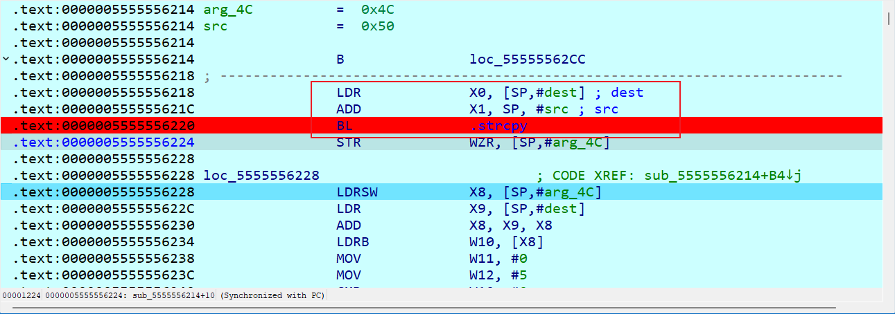
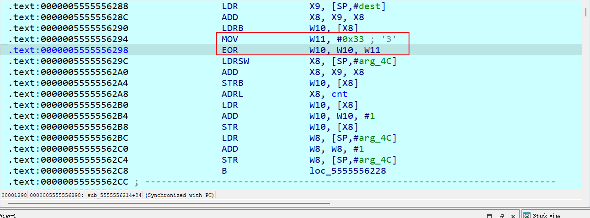
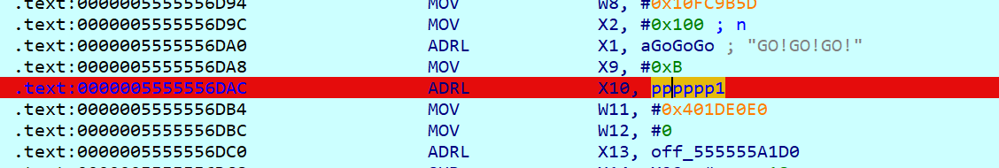
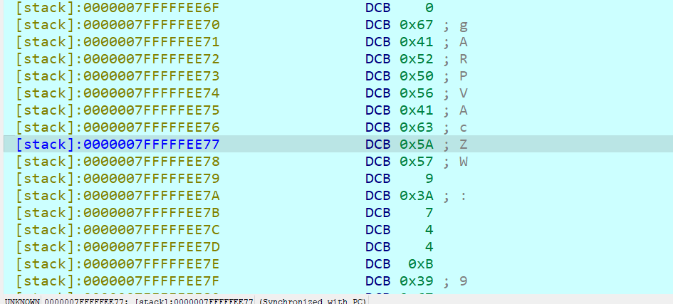

# N1CTFJunior3rd 2025 复现

原来N1他们办了这么多比赛，看到有他们题目的存档所以来做做

## 5mc

很明显SMC，直接v30处下断点进去看函数

~~~c
VirtualProtect(v30, 0xD2uLL, 0x20u, flOldProtect);
((void (__fastcall *)(char *, _UNKNOWN **))v30)(Buf1, &off_7FF700AC5068);
VirtualProtect(v30, 0xD2uLL, 4u, flOldProtect);
~~~

发现出现了16组函数，一个个写解密即可，比较简单的。注意python里变量复制需要使用copy

~~~python
cmp = [0x5B, 0x2D, 0xE9, 0x66, 0xED, 0x39, 0x90, 0x23, 0xAF, 0xDA, 0xEB, 0x2E, 0xD1, 0x0D, 0xBB, 0xBD, 0x57, 0x52, 0x02, 0xB0, 0xBA, 0x9D, 0x52, 0xFA, 0x67, 0xEE, 0xA3, 0x85, 0xA9, 0x84, 0xE2, 0x6F]
# cmp = [0x95, 0x3B, 0xB2, 0x0B, 0xED, 0xE9, 0x4D, 0xD5, 0xA7, 0x22, 0x64, 0x1B, 0x5E, 0xCD, 0xBB, 0x8B, 0x06, 0x52, 0xD3, 0x82, 0x72, 0x28, 0x8E, 0x4C, 0xBE, 0xD3, 0x32, 0x66, 0x87, 0xB5, 0x6C, 0x76]
table1 = [0xB0, 0xF0, 0x21, 0xCF, 0xF2, 0x04, 0x3A, 0x68, 0x84, 0x7B, 0x39, 0x86, 0x36, 0x87, 0x9B, 0xF7, 0x3D, 0x18, 0x1E, 0x61, 0x1B, 0x2E, 0x6C, 0xDF, 0x2C, 0xAE, 0x65, 0x9D, 0xEB, 0x2F, 0xDA, 0xF4, 0xDE, 0xCA, 0x56, 0x92, 0x75, 0x3B, 0x62, 0x45, 0x06, 0x3C, 0x52, 0x33, 0x6E, 0x25, 0xCE, 0xA3, 0xD2, 0x44, 0xA1, 0x4A, 0x58, 0xB1, 0xA0, 0x2A, 0x47, 0x0A, 0x02, 0xAF, 0x50, 0xC3, 0xDC, 0xEA, 0xE5, 0x0D, 0x67, 0x91, 0xE1, 0x51, 0xE3, 0xC1, 0xAA, 0x95, 0x5C, 0x79, 0x72, 0x1C, 0x3F, 0xB8, 0xE8, 0x1F, 0xFF, 0x7A, 0x73, 0x26, 0x54, 0x9E, 0xED, 0xA9, 0x41, 0x20, 0xEF, 0xA6, 0x48, 0x97, 0x4F, 0xD4, 0xBB, 0x23, 0x66, 0xD9, 0xE4, 0x0B, 0x30, 0x15, 0xD7, 0x6B, 0x19, 0xCD, 0xC4, 0x08, 0xB4, 0xC8, 0x14, 0xFD, 0x7F, 0x28, 0x0E, 0x05, 0x0F, 0x4B, 0x6F, 0xF5, 0x90, 0x76, 0xBF, 0x60, 0xE7, 0x24, 0x78, 0x6D, 0x71, 0xA8, 0x43, 0xB5, 0x0C, 0x31, 0xF9, 0xA2, 0x9C, 0x99, 0xF6, 0x2D, 0xDB, 0xB7, 0xC9, 0x85, 0x81, 0x03, 0x64, 0x1D, 0x07, 0x34, 0x5A, 0xBD, 0x37, 0x4C, 0xA7, 0x5F, 0x46, 0xE9, 0x35, 0x93, 0x8D, 0xA5, 0xFB, 0x42, 0x01, 0xC2, 0x17, 0x12, 0x1A, 0x77, 0xC6, 0x53, 0x83, 0x4D, 0xB2, 0x10, 0x2B, 0xF8, 0x88, 0x6A, 0x3E, 0xD0, 0x7C, 0x63, 0x40, 0x27, 0xBE, 0xD5, 0x38, 0xD1, 0x74, 0xB6, 0x57, 0x94, 0xAB, 0x8A, 0xB9, 0xBC, 0x7D, 0xB3, 0x96, 0x7E, 0xFC, 0xAD, 0x22, 0x4E, 0xFA, 0xE0, 0xCB, 0x8B, 0xEE, 0x32, 0xA4, 0x16, 0xFE, 0x5B, 0x13, 0xDD, 0xC0, 0x9A, 0x5E, 0x8E, 0x29, 0xF3, 0x8F, 0x49, 0xE6, 0x9F, 0xF1, 0xC5, 0x70, 0x55, 0x8C, 0x11, 0xCC, 0x5D, 0xEC, 0x00, 0xAC, 0x89, 0xD3, 0x82, 0x69, 0xD6, 0xBA, 0xD8, 0x59, 0x98, 0x09, 0x80, 0xE2, 0xC7]
table2 = [0x13, 0x1F, 0x10, 0x1D, 0x01, 0x0D, 0x07, 0x15, 0x08, 0x06, 0x16, 0x00, 0x0F, 0x0C, 0x02, 0x05, 0x0E, 0x03, 0x12, 0x04, 0x18, 0x14, 0x1A, 0x1C, 0x1E, 0x19, 0x09, 0x1B, 0x11, 0x0B, 0x17, 0x0A]
table3 = [0x7D, 0xB7, 0x24, 0x7E, 0xC3, 0x6B, 0xBD, 0xD8, 0x7F, 0x13, 0x6E, 0x0F, 0x43, 0xCD, 0x6B, 0xCF, 0x18, 0x4F, 0x26, 0x18, 0x12, 0x2A, 0x7E, 0x9B, 0x27, 0x4C, 0x33, 0x67, 0x40, 0xC9, 0x9E, 0xC4]
table4 = [0x91, 0xDB, 0x9F, 0x5F, 0x26, 0x27, 0xD6, 0xA8, 0xBF, 0x41, 0x16, 0x79, 0xDE, 0x73, 0x16, 0xF8, 0x1E, 0xBA, 0x6A, 0xBE, 0xC6, 0x12, 0xB2, 0x39, 0x9E, 0xF3, 0x12, 0x4E, 0x02, 0x1C, 0xE2, 0x43]
for i in range(len(cmp)):
    cmp[i] = ((cmp[i] << 7) | (cmp[i] >> 1)) & 0xff
    cmp[i] ^= table3[i]
    cmp[i] -= table4[i]
    cmp[i] &= 0xff

for i in range(len(cmp)):
    cmp[i] = ((cmp[i] << 6) | (cmp[i] >> 2)) & 0xff
    cmp[i] -= table4[i]
    cmp[i] &= 0xff
    cmp[i] ^= table3[i]

tmp = cmp.copy().copy()
for i in range(len(cmp)):
    cmp[i] = tmp[table2[i]]
tmp = cmp.copy().copy()
for i in range(len(cmp)):
    cmp[i] = tmp[table2[i]]

for i in range(len(cmp)):
    cmp[i] = table1.index(cmp[i])

for i in range(len(cmp)):
    cmp[i] = ((cmp[i] << 3) | (cmp[i] >> 5)) & 0xff
    cmp[i] ^= table3[i]
    cmp[i] -= table4[i]
    cmp[i] &= 0xff

for i in range(len(cmp)):
    cmp[i] = ((cmp[i] << 5) | (cmp[i] >> 3)) & 0xff
    cmp[i] -= table4[i]
    cmp[i] &= 0xff
    cmp[i] ^= table3[i]

tmp = cmp.copy()
for i in range(len(cmp)):
    cmp[i] = tmp[table2[i]]
tmp = cmp.copy()
for i in range(len(cmp)):
    cmp[i] = tmp[table2[i]]

for i in range(len(cmp)):
    cmp[i] = table1.index(cmp[i])

for i in range(len(cmp)):
    cmp[i] = ((cmp[i] << 4) | (cmp[i] >> 4)) & 0xff
    cmp[i] ^= table3[i]
    cmp[i] -= table4[i]
    cmp[i] &= 0xff

for i in range(len(cmp)):
    cmp[i] = ((cmp[i] << 2) | (cmp[i] >> 6)) & 0xff
    cmp[i] -= table4[i]
    cmp[i] &= 0xff
    cmp[i] ^= table3[i]

tmp = cmp.copy()
for i in range(len(cmp)):
    cmp[i] = tmp[table2[i]]
tmp = cmp.copy()
for i in range(len(cmp)):
    cmp[i] = tmp[table2[i]]

for i in range(len(cmp)):
    cmp[i] = table1.index(cmp[i])

for i in range(len(cmp)):
    cmp[i] = ((cmp[i] << 1) | (cmp[i] >> 7)) & 0xff
    cmp[i] ^= table3[i]
    cmp[i] -= table4[i]
    cmp[i] &= 0xff

for i in range(len(cmp)):
    cmp[i] = ((cmp[i] << 5) | (cmp[i] >> 3)) & 0xff
    cmp[i] -= table4[i]
    cmp[i] &= 0xff
    cmp[i] ^= table3[i]

tmp = cmp.copy()
for i in range(len(cmp)):
    cmp[i] = tmp[table2[i]]
tmp = cmp.copy()
for i in range(len(cmp)):
    cmp[i] = tmp[table2[i]]

for i in range(len(cmp)):
    cmp[i] = table1.index(cmp[i])

print(bytes(cmp).decode())

~~~

得到`flag{Master_of_5mc_XoR_aDD_r0r!}`

## df5

和上面一眼一个出题人呢，用的常量一致算法也差不多，不过更加复杂难推导

~~~c
do
  ((void (__fastcall *)(char *, _UNKNOWN **))v28[Buf1[v3++] & 3])(Buf1, &off_7FF610A95B90);
while ( v3 < 32 );
~~~

无非就是写个dfs逆向即可，注意检查逻辑是`enc[enc_id+1]&3 != func_id`，也就是解密完后，对应位置数据下标应等于解密函数下标

~~~python
cmp = [0x65, 0x3E, 0x43, 0xB8, 0xBA, 0xDB, 0xF6, 0x88, 0x25, 0x1B, 0x28, 0xC7, 0xC0, 0x54, 0xA6, 0x4A, 0x90, 0x37, 0xBC, 0x29, 0x41, 0xAA, 0x28, 0xDB, 0x9A, 0x59, 0x63, 0x9E, 0x4B, 0xCF, 0x2E, 0x41]
table1 = [0xB0, 0xF0, 0x21, 0xCF, 0xF2, 0x04, 0x3A, 0x68, 0x84, 0x7B, 0x39, 0x86, 0x36, 0x87, 0x9B, 0xF7, 0x3D, 0x18, 0x1E, 0x61, 0x1B, 0x2E, 0x6C, 0xDF, 0x2C, 0xAE, 0x65, 0x9D, 0xEB, 0x2F, 0xDA, 0xF4, 0xDE, 0xCA, 0x56, 0x92, 0x75, 0x3B, 0x62, 0x45, 0x06, 0x3C, 0x52, 0x33, 0x6E, 0x25, 0xCE, 0xA3, 0xD2, 0x44, 0xA1, 0x4A, 0x58, 0xB1, 0xA0, 0x2A, 0x47, 0x0A, 0x02, 0xAF, 0x50, 0xC3, 0xDC, 0xEA, 0xE5, 0x0D, 0x67, 0x91, 0xE1, 0x51, 0xE3, 0xC1, 0xAA, 0x95, 0x5C, 0x79, 0x72, 0x1C, 0x3F, 0xB8, 0xE8, 0x1F, 0xFF, 0x7A, 0x73, 0x26, 0x54, 0x9E, 0xED, 0xA9, 0x41, 0x20, 0xEF, 0xA6, 0x48, 0x97, 0x4F, 0xD4, 0xBB, 0x23, 0x66, 0xD9, 0xE4, 0x0B, 0x30, 0x15, 0xD7, 0x6B, 0x19, 0xCD, 0xC4, 0x08, 0xB4, 0xC8, 0x14, 0xFD, 0x7F, 0x28, 0x0E, 0x05, 0x0F, 0x4B, 0x6F, 0xF5, 0x90, 0x76, 0xBF, 0x60, 0xE7, 0x24, 0x78, 0x6D, 0x71, 0xA8, 0x43, 0xB5, 0x0C, 0x31, 0xF9, 0xA2, 0x9C, 0x99, 0xF6, 0x2D, 0xDB, 0xB7, 0xC9, 0x85, 0x81, 0x03, 0x64, 0x1D, 0x07, 0x34, 0x5A, 0xBD, 0x37, 0x4C, 0xA7, 0x5F, 0x46, 0xE9, 0x35, 0x93, 0x8D, 0xA5, 0xFB, 0x42, 0x01, 0xC2, 0x17, 0x12, 0x1A, 0x77, 0xC6, 0x53, 0x83, 0x4D, 0xB2, 0x10, 0x2B, 0xF8, 0x88, 0x6A, 0x3E, 0xD0, 0x7C, 0x63, 0x40, 0x27, 0xBE, 0xD5, 0x38, 0xD1, 0x74, 0xB6, 0x57, 0x94, 0xAB, 0x8A, 0xB9, 0xBC, 0x7D, 0xB3, 0x96, 0x7E, 0xFC, 0xAD, 0x22, 0x4E, 0xFA, 0xE0, 0xCB, 0x8B, 0xEE, 0x32, 0xA4, 0x16, 0xFE, 0x5B, 0x13, 0xDD, 0xC0, 0x9A, 0x5E, 0x8E, 0x29, 0xF3, 0x8F, 0x49, 0xE6, 0x9F, 0xF1, 0xC5, 0x70, 0x55, 0x8C, 0x11, 0xCC, 0x5D, 0xEC, 0x00, 0xAC, 0x89, 0xD3, 0x82, 0x69, 0xD6, 0xBA, 0xD8, 0x59, 0x98, 0x09, 0x80, 0xE2, 0xC7]
table2 = [0x13, 0x1F, 0x10, 0x1D, 0x01, 0x0D, 0x07, 0x15, 0x08, 0x06, 0x16, 0x00, 0x0F, 0x0C, 0x02, 0x05, 0x0E, 0x03, 0x12, 0x04, 0x18, 0x14, 0x1A, 0x1C, 0x1E, 0x19, 0x09, 0x1B, 0x11, 0x0B, 0x17, 0x0A]
table3 = [0x7D, 0xB7, 0x24, 0x7E, 0xC3, 0x6B, 0xBD, 0xD8, 0x7F, 0x13, 0x6E, 0x0F, 0x43, 0xCD, 0x6B, 0xCF, 0x18, 0x4F, 0x26, 0x18, 0x12, 0x2A, 0x7E, 0x9B, 0x27, 0x4C, 0x33, 0x67, 0x40, 0xC9, 0x9E, 0xC4]
table4 = [0x91, 0xDB, 0x9F, 0x5F, 0x26, 0x27, 0xD6, 0xA8, 0xBF, 0x41, 0x16, 0x79, 0xDE, 0x73, 0x16, 0xF8, 0x1E, 0xBA, 0x6A, 0xBE, 0xC6, 0x12, 0xB2, 0x39, 0x9E, 0xF3, 0x12, 0x4E, 0x02, 0x1C, 0xE2, 0x43]

def func1(enc):
    for i in range(len(enc)):
        enc[i] = table1.index(enc[i])
    return enc

def func2(enc):
    tmp = enc.copy()
    for i in range(len(enc)):
        enc[i] = tmp[table2[i]]
    tmp = enc.copy()
    for i in range(len(enc)):
        enc[i] = tmp[table2[i]]
    return enc

def func3(enc):
    for i in range(len(enc)):
        enc[i] -= table4[i]
        enc[i] &= 0xff
        enc[i] ^= table3[i]
    return enc

def func4(enc):
    for i in range(len(enc)):
        enc[i] = ((enc[i] << 3) | (enc[i] >> 5)) & 0xff
    return enc

funcs = [func1, func2, func3, func4]

def dfs(enc, func_id, enc_id):
    if enc_id == -1:
        plain = bytes(enc)
        if b"flag" in plain:
            print(plain.decode())
        return
    if func_id != -1 and enc[enc_id+1]&3 != func_id:
        return
    else:
        for i in range(4):
            tmp = enc.copy()
            result = funcs[i](tmp)
            dfs(result, i, enc_id-1)

dfs(cmp, -1, 31)
~~~

得到`flag{Ea5y_enCrypt_And_decrYpt!!}`

## easy-re

arm写的，加了不少间接跳转导致反编译没法看，我是一段段看分析出了rc4魔改+一个前后异或

关注到程序反调试读取了`TracerPid:xxx`并且拷贝到了global_data

然后对global_data循环异或0x33

把异或后的global_data当作密钥填充了256字节

当这里基本确认正确key操作的应该是`TracerPid:0`异或完的结果，提取KSA比较麻烦，因此我直接在PRGA步骤前提取出SBOX，就是下面的a29

~~~c
__int64 __fastcall sub_555555719C(
        __int64 a1,
        __int64 a2,
        __int64 a3,
        __int64 a4,
        __int64 a5,
        __int64 a6,
        __int64 a7,
        __int64 a8,
        __int64 a9,
        __int64 a10,
        __int64 a11,
        __int64 a12,
        __int64 a13,
        __int64 a14,
        __int64 a15,
        __int64 a16,
        __int64 a17,
        __int64 a18,
        __int64 a19,
        __int64 a20,
        __int64 a21,
        __int64 a22,
        __int64 a23,
        __int64 a24,
        __int64 a25,
        __int64 a26,
        __int64 a27,
        __int64 a28,
        char a29)
{
  __int64 v29; // x29
  int v30; // w8

  *(*(v29 - 32) + SHIDWORD(a21)) ^= BYTE4(a21);
  HIDWORD(a22) = (HIDWORD(a22) + 1) % 256;
  LODWORD(a22) = (a22 + *(&a29 + SHIDWORD(a22))) % 256;
  LOBYTE(a21) = *(&a29 + SHIDWORD(a22));
  *(&a29 + SHIDWORD(a22)) = *(&a29 + a22);
  *(&a29 + a22) = a21;
  *(*(v29 - 32) + SHIDWORD(a21)) ^= *(&a29 + (*(&a29 + SHIDWORD(a22)) + *(&a29 + a22)) % 256);
  if ( SHIDWORD(a21) <= 0 )
    v30 = 11;
  else
    v30 = 6;
  return ((*(a15 + 8LL * v30) + 1179427145 - HIDWORD(a13)))(a1, a2, a3, a4, a5, a6, a7, a8, a9, a10, a11, a12, a13, a14);
}
~~~

解密代码如下

~~~python
def PRGA(S):
    """ Pseudo-Random Generation Algorithm (PRGA) 伪随机数生成算法"""
    i, j = 0, 0
    while True:
        i = (i + 1) % 256
        j = (j + S[i]) % 256
        S[i], S[j] = S[j], S[i]
        K = S[(S[i] + S[j]) % 256]
        yield K

def RC4(text):
    """ RC4 encryption/decryption """
    S = [0x6E, 0x4D, 0x22, 0xCC, 0x40, 0xEC, 0x9F, 0x04, 0x2E, 0xCA, 0xDC, 0x0B, 0xCC, 0x0A, 0x92, 0xF6, 0x6A, 0xF2, 0x91, 0x10, 0x46, 0xDE, 0x0C, 0x11, 0x7A, 0x16, 0x52, 0xD4, 0x20, 0xF8, 0x96, 0x1C, 0xA2, 0xD2, 0xE8, 0x26, 0xB7, 0x02, 0x6A, 0xE8, 0x26, 0xFE, 0x35, 0x28, 0x76, 0xE6, 0xEE, 0x38, 0x86, 0x08, 0x90, 0xFC, 0x08, 0x7B, 0x50, 0x34, 0x5C, 0x14, 0x1E, 0x12, 0x8C, 0x3A, 0x9A, 0xF0, 0x34, 0x74, 0x0A, 0x40, 0xA6, 0x8E, 0xFA, 0xB4, 0x92, 0x14, 0xB2, 0x84, 0x1E, 0x26, 0xBD, 0x4C, 0xFA, 0x82, 0x0E, 0xC6, 0x98, 0x1A, 0x91, 0x98, 0x0F, 0x74, 0x6E, 0x58, 0x83, 0x96, 0x3C, 0x97, 0x89, 0x20, 0x8D, 0xAC, 0x02, 0x5A, 0xF8, 0x64, 0xAA, 0xC2, 0x5E, 0xC2, 0xA4, 0x26, 0x2A, 0xA0, 0x2C, 0x5F, 0xF9, 0x36, 0xE6, 0x68, 0x3C, 0x0E, 0xDE, 0x2C, 0x8E, 0xB4, 0x2F, 0xD0, 0xD4, 0x7C, 0x78, 0x9E, 0x45, 0xAA, 0xB0, 0x32, 0x82, 0x80, 0x8D, 0x09, 0x0A, 0x88, 0x24, 0x46, 0x82, 0x80, 0xB6, 0x8E, 0xDF, 0x3A, 0xC3, 0xCE, 0x09, 0x94, 0xCD, 0xB2, 0xC0, 0x5E, 0x14, 0x3E, 0xE8, 0xDA, 0xDC, 0x62, 0xE0, 0xA0, 0xE4, 0x76, 0x7B, 0x64, 0x28, 0x44, 0x78, 0x8C, 0xF6, 0x9E, 0xC2, 0xAC, 0x74, 0x00, 0xCC, 0xC3, 0x6F, 0x4A, 0x42, 0x67, 0x90, 0xBE, 0x3A, 0xBA, 0xFB, 0x61, 0xAB, 0x5A, 0xC8, 0x50, 0x71, 0xE9, 0xD5, 0x2A, 0x2D, 0x3B, 0x2A, 0x12, 0x48, 0xBC, 0xE2, 0x56, 0x2B, 0x78, 0xBE, 0x82, 0xCE, 0xF7, 0xAD, 0x74, 0x8C, 0xC4, 0x64, 0x5C, 0x9C, 0xFA, 0x5D, 0xB8, 0xF4, 0xD0, 0xF9, 0xE0, 0x70, 0xCA, 0xD4, 0x62, 0x60, 0xF0, 0x5E, 0x03, 0x3A, 0xB2, 0xA4, 0x58, 0x7D, 0xD0, 0x30, 0x68, 0x44, 0x70, 0x67, 0xC0, 0x25, 0xD6, 0x47, 0xD3, 0x11, 0x66, 0x70, 0xB6, 0xAE, 0xAA]
    keystream = PRGA(S)
    res = []
    for i in range(len(text)):
        char = text[i]
        res.append(char ^ next(keystream) ^ i)
    return bytes(res)

cmp = [0x50, 0x4C, 0x8B, 0x94, 0x86, 0x6D, 0x72, 0xFB, 0x54, 0xF3, 0x17, 0x0F, 0xEE, 0xE4, 0xC5, 0x1E, 0xB8, 0x1A, 0xC7, 0xDF, 0x2D, 0x3D, 0x4E, 0x51, 0xE7, 0xAD, 0x97, 0x55, 0xF3, 0xF5, 0x41, 0x79]
text = cmp
for i in range(1, 32):
    text[i] ^= text[i-1]
text = list(RC4(text))
print(bytes(text).decode())
~~~

得到`flag{welcome-re-world!go!go!go!}`