# NepCTF2025

当时没做，朋友说题目还挺不错，回来复现

## crackme

定位`please try again!`找到check函数

~~~c
__int64 sub_4021C0()
{
  // [COLLAPSED LOCAL DECLARATIONS. PRESS NUMPAD "+" TO EXPAND]

  QLineEdit::text((QLineEdit *)&v46);
  QString::toUtf8_helper((QString *)&v47, (const QString *)&v46);
  if ( *v47 > 1u || (v0 = v47, v44 = *((_QWORD *)v47 + 2), v44 != 24) )
  {
    QByteArray::reallocData(&v47, (unsigned int)(*((_DWORD *)v47 + 1) + 1), (unsigned int)*((char *)v47 + 11) >> 31);
    v0 = v47;
    v44 = *((_QWORD *)v47 + 2);
  }
  QLineEdit::text((QLineEdit *)&v58);
  QString::trimmed_helper((QString *)&v48, (QString *)&v58);
  v2 = v58;
  if ( !*v58 || *v58 != -1 && (v3 = _InterlockedSub(v58, 1u), v2 = v58, !v3) )
    QArrayData::deallocate(v2, 2LL, 8LL);
  v58 = (volatile signed __int32 *)QString::fromAscii_helper((QString *)"^[0-9a-fA-F]{2,}$", (const char *)0x11, v1);
  QRegularExpression::QRegularExpression(v49, &v58, 0LL);
  v4 = v58;
  if ( !*v58 || *v58 != -1 && (v5 = _InterlockedSub(v58, 1u), v4 = v58, !v5) )
    QArrayData::deallocate(v4, 2LL, 8LL);
  QRegularExpression::match(&v58, v49, &v48, 0LL, 0, 0);
  if ( !(unsigned __int8)QRegularExpressionMatch::hasMatch((QRegularExpressionMatch *)&v58) || (v48[1] & 1) != 0 )
  {
    QRegularExpressionMatch::~QRegularExpressionMatch((QRegularExpressionMatch *)&v58);
    v50 = (volatile signed __int32 *)QArrayData::shared_null;
    v58 = (volatile signed __int32 *)QString::fromAscii_helper((QString *)"please try again!", (const char *)0x11, v6);
    v56 = (volatile signed __int32 *)QString::fromAscii_helper((QString *)"Wrong", (const char *)5, v7);
    QMessageBox::warning(0LL, &v56, &v58, 1024LL, 0);
LABEL_12:
    v8 = v56;
    if ( !*v56 || *v56 != -1 && (v9 = _InterlockedSub(v56, 1u), v8 = v56, !v9) )
      QArrayData::deallocate(v8, 2LL, 8LL);
    v10 = v58;
    if ( *v58 )
    {
      if ( *v58 == -1 )
        goto LABEL_19;
      v11 = _InterlockedSub(v58, 1u);
      v10 = v58;
      if ( v11 )
        goto LABEL_19;
    }
LABEL_70:
    QArrayData::deallocate(v10, 2LL, 8LL);
    v12 = v50;
    v13 = *v50;
    if ( *v50 )
      goto LABEL_20;
LABEL_71:
    QArrayData::deallocate(v12, 1LL, 8LL);
    goto LABEL_22;
  }
  QRegularExpressionMatch::~QRegularExpressionMatch((QRegularExpressionMatch *)&v58);
  v50 = (volatile signed __int32 *)QArrayData::shared_null;
  QString::toUtf8_helper((QString *)&v58, (const QString *)&v48);
  QByteArray::fromHex(&v54, &v58);
  v23 = v50;
  v24 = v54;
  v54 = v50;
  v50 = v24;
  if ( !*v54 || *v54 != -1 && !_InterlockedSub(v23, 1u) )
    QArrayData::deallocate(v54, 1LL, 8LL);
  v25 = v58;
  if ( !*v58 || *v58 != -1 && (v26 = _InterlockedSub(v58, 1u), v25 = v58, !v26) )
    QArrayData::deallocate(v25, 1LL, 8LL);
  if ( *((_DWORD *)v50 + 1) != 16 )
  {
    v58 = (volatile signed __int32 *)QString::fromAscii_helper((QString *)"please try again!", (const char *)0x11, v22);
    v56 = (volatile signed __int32 *)QString::fromAscii_helper((QString *)"Wrong", (const char *)5, v27);
    QMessageBox::warning(0LL, &v56, &v58, 1024LL, 0);
    goto LABEL_12;
  }
  if ( *v50 > 1u || (v29 = *((_QWORD *)v50 + 2), v28 = v50, v29 != 24) )
  {
    QByteArray::reallocData(&v50, (unsigned int)(*((_DWORD *)v50 + 1) + 1), (unsigned int)*((char *)v50 + 11) >> 31);
    v28 = v50;
    v29 = *((_QWORD *)v50 + 2);
  }
  v45 = (__int64)v28 + v29;
  qword_409040((char *)v0 + v44, *((unsigned int *)v47 + 1));// libcrypto_sign
  v56 = 0LL;
  v57 = 0LL;
  v51 = v46;
  if ( (unsigned int)(*v46 + 1) > 1 )
    _InterlockedAdd(v46, 1u);
  QString::fromUtf8_helper((QString *)&v58, "Showmaker11", 11);
  QString::append((QString *)&v51, (const QString *)&v58);
  v30 = v58;
  if ( !*v58 || *v58 != -1 && (v31 = _InterlockedSub(v58, 1u), v30 = v58, !v31) )
    QArrayData::deallocate(v30, 2LL, 8LL);
  QString::toUtf8_helper((QString *)&v52, (const QString *)&v51);
  if ( *v52 > 1u || (v33 = *((_QWORD *)v52 + 2), v32 = v52, v33 != 24) )
  {
    QByteArray::reallocData(&v52, (unsigned int)(*((_DWORD *)v52 + 1) + 1), (unsigned int)*((char *)v52 + 11) >> 31);
    v32 = v52;
    v33 = *((_QWORD *)v52 + 2);
  }
  v58 = 0LL;
  v59 = 0LL;
  qword_409040((char *)v32 + v33, *((unsigned int *)v32 + 1));// libcrypto_sign
  qword_409048(v55, 16LL, v45, &v56, 16);       // libcrypto_aesEncrypt
  if ( v56 == v58 && v57 == v59 )
  {
    v54 = (volatile signed __int32 *)QString::fromAscii_helper((QString *)"password correct!", (const char *)0x11, v34);
    v53 = (volatile signed __int32 *)QString::fromAscii_helper((QString *)"Right", (const char *)5, v43);
    QMessageBox::information(0LL, &v53, &v54, 1024LL, 0);
  }
  else
  {
    v54 = (volatile signed __int32 *)QString::fromAscii_helper((QString *)"please try again!", (const char *)0x11, v34);
    v53 = (volatile signed __int32 *)QString::fromAscii_helper((QString *)"Wrong", (const char *)5, v35);
    QMessageBox::warning(0LL, &v53, &v54, 1024LL, 0);
  }
  v36 = v53;
  if ( !*v53 || *v53 != -1 && (v37 = _InterlockedSub(v53, 1u), v36 = v53, !v37) )
    QArrayData::deallocate(v36, 2LL, 8LL);
  v38 = v54;
  if ( !*v54 || *v54 != -1 && (v39 = _InterlockedSub(v54, 1u), v38 = v54, !v39) )
    QArrayData::deallocate(v38, 2LL, 8LL);
  v40 = v52;
  if ( !*v52 || *v52 != -1 && (v41 = _InterlockedSub(v52, 1u), v40 = v52, !v41) )
    QArrayData::deallocate(v40, 1LL, 8LL);
  v10 = v51;
  if ( !*v51 )
    goto LABEL_70;
  if ( *v51 != -1 )
  {
    v42 = _InterlockedSub(v51, 1u);
    v10 = v51;
    if ( !v42 )
      goto LABEL_70;
  }
LABEL_19:
  v12 = v50;
  v13 = *v50;
  if ( !*v50 )
    goto LABEL_71;
LABEL_20:
  if ( v13 != -1 )
  {
    v14 = _InterlockedSub(v12, 1u);
    v12 = v50;
    if ( !v14 )
      goto LABEL_71;
  }
LABEL_22:
  QRegularExpression::~QRegularExpression((QRegularExpression *)v49);
  v15 = v48;
  if ( !*v48 || *v48 != -1 && (v16 = _InterlockedSub(v48, 1u), v15 = v48, !v16) )
    QArrayData::deallocate(v15, 2LL, 8LL);
  v17 = v47;
  if ( !*v47 || *v47 != -1 && (v18 = _InterlockedSub(v47, 1u), v17 = v47, !v18) )
  {
    QArrayData::deallocate(v17, 1LL, 8LL);
    v19 = v46;
    result = *(unsigned int *)v46;
    if ( (_DWORD)result )
      goto LABEL_29;
    return QArrayData::deallocate(v19, 2LL, 8LL);
  }
  v19 = v46;
  result = *(unsigned int *)v46;
  if ( !(_DWORD)result )
    return QArrayData::deallocate(v19, 2LL, 8LL);
LABEL_29:
  if ( (_DWORD)result != -1 )
  {
    v21 = _InterlockedSub(v19, 1u);
    v19 = v46;
    if ( !v21 )
      return QArrayData::deallocate(v19, 2LL, 8LL);
  }
  return result;
}
~~~

可知要求输入16字节Hex字符串，上动调发现拼接了inkey（username）+Showmaker11，同时观察到调用了libcrypto.dll的aes加密，核心check是`sign(用户名+Showmaker11)==aesEncrypt(key=sign(username), plain=password)`，但查看libcrypto.dll很明显做了ollvm魔改混淆，d810无法去除

参考出题人的博客笔记看怎么对抗魔改：https://twogoat.github.io/2025/06/01/%E4%BB%8E0%E5%88%B01%E7%9A%84ollvm-2-ollvm%E9%AD%94%E6%94%B9%E5%B0%9D%E8%AF%95/

先看sign，结合调试发现返回的是类似md5的结果，然而不是标准的，魔改过，但考虑到这里直接主动调用即可，不需要逆向算法

接着是aesEncrypt，因为已知sign(用户名+Showmaker11)和key=sign(username)，需要去求password，所以必须要逆向

OLLVM一个特性是把真实代码块隐藏到控制流里，我们只需关注aes到底魔改了哪里即可

首先aes常见表对比发现没有魔改，可以尝试下读写断点看这些表在什么地方进行了操作，对比标准aes同样位置加密后的数据是否相同

最后发现在列混淆的地方多异或了个0x55，问就是非常专注找到了

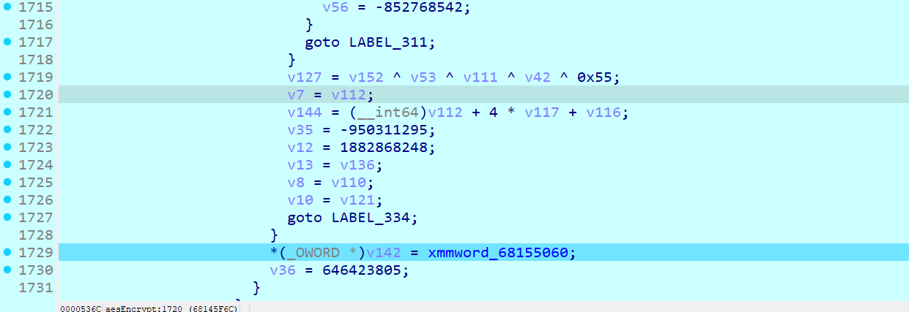

~~~python
class AES:

    MIX_C  = [[0x2, 0x3, 0x1, 0x1], [0x1, 0x2, 0x3, 0x1], [0x1, 0x1, 0x2, 0x3], [0x3, 0x1, 0x1, 0x2]]
    I_MIXC = [[0xe, 0xb, 0xd, 0x9], [0x9, 0xe, 0xb, 0xd], [0xd, 0x9, 0xe, 0xb], [0xb, 0xd, 0x9, 0xe]]
    RCon   = [0x01000000, 0x02000000, 0x04000000, 0x08000000, 0x10000000, 0x20000000, 0x40000000, 0x80000000, 0x1B000000, 0x36000000]
    # 可以直接改S_BOX，数组长度无所谓，交给格式化，只要是256长度即可
    S_BOX = [[0x63, 0x7C, 0x77, 0x7B, 0xF2, 0x6B, 0x6F, 0xC5, 0x30, 0x01, 0x67, 0x2B, 0xFE, 0xD7, 0xAB, 0x76],
             [0xCA, 0x82, 0xC9, 0x7D, 0xFA, 0x59, 0x47, 0xF0, 0xAD, 0xD4, 0xA2, 0xAF, 0x9C, 0xA4, 0x72, 0xC0],
             [0xB7, 0xFD, 0x93, 0x26, 0x36, 0x3F, 0xF7, 0xCC, 0x34, 0xA5, 0xE5, 0xF1, 0x71, 0xD8, 0x31, 0x15],
             [0x04, 0xC7, 0x23, 0xC3, 0x18, 0x96, 0x05, 0x9A, 0x07, 0x12, 0x80, 0xE2, 0xEB, 0x27, 0xB2, 0x75],
             [0x09, 0x83, 0x2C, 0x1A, 0x1B, 0x6E, 0x5A, 0xA0, 0x52, 0x3B, 0xD6, 0xB3, 0x29, 0xE3, 0x2F, 0x84],
             [0x53, 0xD1, 0x00, 0xED, 0x20, 0xFC, 0xB1, 0x5B, 0x6A, 0xCB, 0xBE, 0x39, 0x4A, 0x4C, 0x58, 0xCF],
             [0xD0, 0xEF, 0xAA, 0xFB, 0x43, 0x4D, 0x33, 0x85, 0x45, 0xF9, 0x02, 0x7F, 0x50, 0x3C, 0x9F, 0xA8],
             [0x51, 0xA3, 0x40, 0x8F, 0x92, 0x9D, 0x38, 0xF5, 0xBC, 0xB6, 0xDA, 0x21, 0x10, 0xFF, 0xF3, 0xD2],
             [0xCD, 0x0C, 0x13, 0xEC, 0x5F, 0x97, 0x44, 0x17, 0xC4, 0xA7, 0x7E, 0x3D, 0x64, 0x5D, 0x19, 0x73],
             [0x60, 0x81, 0x4F, 0xDC, 0x22, 0x2A, 0x90, 0x88, 0x46, 0xEE, 0xB8, 0x14, 0xDE, 0x5E, 0x0B, 0xDB],
             [0xE0, 0x32, 0x3A, 0x0A, 0x49, 0x06, 0x24, 0x5C, 0xC2, 0xD3, 0xAC, 0x62, 0x91, 0x95, 0xE4, 0x79],
             [0xE7, 0xC8, 0x37, 0x6D, 0x8D, 0xD5, 0x4E, 0xA9, 0x6C, 0x56, 0xF4, 0xEA, 0x65, 0x7A, 0xAE, 0x08],
             [0xBA, 0x78, 0x25, 0x2E, 0x1C, 0xA6, 0xB4, 0xC6, 0xE8, 0xDD, 0x74, 0x1F, 0x4B, 0xBD, 0x8B, 0x8A],
             [0x70, 0x3E, 0xB5, 0x66, 0x48, 0x03, 0xF6, 0x0E, 0x61, 0x35, 0x57, 0xB9, 0x86, 0xC1, 0x1D, 0x9E],
             [0xE1, 0xF8, 0x98, 0x11, 0x69, 0xD9, 0x8E, 0x94, 0x9B, 0x1E, 0x87, 0xE9, 0xCE, 0x55, 0x28, 0xDF],
             [0x8C, 0xA1, 0x89, 0x0D, 0xBF, 0xE6, 0x42, 0x68, 0x41, 0x99, 0x2D, 0x0F, 0xB0, 0x54, 0xBB, 0x16]]

    def format_SBOX(self, isRE=False):
        if isRE:
            if len(self.I_SBOX) == 256:
                self.I_SBOX = [self.I_SBOX[j:j + 16] for j in range(0, 256, 16)]
        else:
            if len(self.S_BOX) == 256:
                self.S_BOX = [self.S_BOX[j:j + 16] for j in range(0, 256, 16)]

    I_SBOX = [[0x52, 0x09, 0x6A, 0xD5, 0x30, 0x36, 0xA5, 0x38, 0xBF, 0x40, 0xA3, 0x9E, 0x81, 0xF3, 0xD7, 0xFB],
              [0x7C, 0xE3, 0x39, 0x82, 0x9B, 0x2F, 0xFF, 0x87, 0x34, 0x8E, 0x43, 0x44, 0xC4, 0xDE, 0xE9, 0xCB],
              [0x54, 0x7B, 0x94, 0x32, 0xA6, 0xC2, 0x23, 0x3D, 0xEE, 0x4C, 0x95, 0x0B, 0x42, 0xFA, 0xC3, 0x4E],
              [0x08, 0x2E, 0xA1, 0x66, 0x28, 0xD9, 0x24, 0xB2, 0x76, 0x5B, 0xA2, 0x49, 0x6D, 0x8B, 0xD1, 0x25],
              [0x72, 0xF8, 0xF6, 0x64, 0x86, 0x68, 0x98, 0x16, 0xD4, 0xA4, 0x5C, 0xCC, 0x5D, 0x65, 0xB6, 0x92],
              [0x6C, 0x70, 0x48, 0x50, 0xFD, 0xED, 0xB9, 0xDA, 0x5E, 0x15, 0x46, 0x57, 0xA7, 0x8D, 0x9D, 0x84],
              [0x90, 0xD8, 0xAB, 0x00, 0x8C, 0xBC, 0xD3, 0x0A, 0xF7, 0xE4, 0x58, 0x05, 0xB8, 0xB3, 0x45, 0x06],
              [0xD0, 0x2C, 0x1E, 0x8F, 0xCA, 0x3F, 0x0F, 0x02, 0xC1, 0xAF, 0xBD, 0x03, 0x01, 0x13, 0x8A, 0x6B],
              [0x3A, 0x91, 0x11, 0x41, 0x4F, 0x67, 0xDC, 0xEA, 0x97, 0xF2, 0xCF, 0xCE, 0xF0, 0xB4, 0xE6, 0x73],
              [0x96, 0xAC, 0x74, 0x22, 0xE7, 0xAD, 0x35, 0x85, 0xE2, 0xF9, 0x37, 0xE8, 0x1C, 0x75, 0xDF, 0x6E],
              [0x47, 0xF1, 0x1A, 0x71, 0x1D, 0x29, 0xC5, 0x89, 0x6F, 0xB7, 0x62, 0x0E, 0xAA, 0x18, 0xBE, 0x1B],
              [0xFC, 0x56, 0x3E, 0x4B, 0xC6, 0xD2, 0x79, 0x20, 0x9A, 0xDB, 0xC0, 0xFE, 0x78, 0xCD, 0x5A, 0xF4],
              [0x1F, 0xDD, 0xA8, 0x33, 0x88, 0x07, 0xC7, 0x31, 0xB1, 0x12, 0x10, 0x59, 0x27, 0x80, 0xEC, 0x5F],
              [0x60, 0x51, 0x7F, 0xA9, 0x19, 0xB5, 0x4A, 0x0D, 0x2D, 0xE5, 0x7A, 0x9F, 0x93, 0xC9, 0x9C, 0xEF],
              [0xA0, 0xE0, 0x3B, 0x4D, 0xAE, 0x2A, 0xF5, 0xB0, 0xC8, 0xEB, 0xBB, 0x3C, 0x83, 0x53, 0x99, 0x61],
              [0x17, 0x2B, 0x04, 0x7E, 0xBA, 0x77, 0xD6, 0x26, 0xE1, 0x69, 0x14, 0x63, 0x55, 0x21, 0x0C, 0x7D]]

    def SubBytes(self, State):
        # 字节替换
        return [self.S_BOX[i][j] for i, j in
               [(_ >> 4, _ & 0xF) for _ in State]]

    def SubBytes_Inv(self, State):
        # 字节逆替换
        return [self.I_SBOX[i][j] for i, j in
               [(_ >> 4, _ & 0xF) for _ in State]]

    def ShiftRows(self, S):
        # 行移位
        return [S[ 0], S[ 5], S[10], S[15],
                S[ 4], S[ 9], S[14], S[ 3],
                S[ 8], S[13], S[ 2], S[ 7],
                S[12], S[ 1], S[ 6], S[11]]

    def ShiftRows_Inv(self, S):
        # 逆行移位
        return [S[ 0], S[13], S[10], S[ 7],
                S[ 4], S[ 1], S[14], S[11],
                S[ 8], S[ 5], S[ 2], S[15],
                S[12], S[ 9], S[ 6], S[ 3]]

    def MixColumns(self, State):
        # 列混合
        return self.Matrix_Mul(self.MIX_C, State)

    def MixColumns_Inv(self, State):
        # 逆列混合
        return self.Matrix_Mul(self.I_MIXC, State)

    def RotWord(self, _4byte_block):
        # 用于生成轮密钥的字移位
        return ((_4byte_block & 0xffffff) << 8) + (_4byte_block >> 24)

    def SubWord(self, _4byte_block):
        # 用于生成密钥的字节替换
        result = 0
        for position in range(4):
            i = _4byte_block >> position * 8 + 4 & 0xf
            j = _4byte_block >> position * 8 & 0xf
            result ^= self.S_BOX[i][j] << position * 8
        return result

    def mod(self, poly, mod = 0b100011011):
        # poly模多项式mod
        while poly.bit_length() > 8:
            poly ^= mod << poly.bit_length() - 9
        return poly

    def mul(self, poly1, poly2):
        # 多项式相乘
        result = 0
        for index in range(poly2.bit_length()):
            if poly2 & 1 << index:
                result ^= poly1 << index
        return result

    def Matrix_Mul(self, M1, M2):  # M1 = MIX_C  M2 = State
        # 用于列混合的矩阵相乘
        M = [0] * 16
        for row in range(4):
            for col in range(4):
                for Round in range(4):
                    M[row + col*4] ^= self.mul(M1[row][Round], M2[Round+col*4])
                M[row + col*4] = self.mod(M[row + col*4]) ^ 0x55
        return M

    def gen_ISBOX(self):
        new_contrary_sbox = [0] * 256
        for i in range(256):
            line = (self.S_BOX[i//16][i%16] & 0xf0) >> 4
            rol = self.S_BOX[i//16][i%16] & 0xf
            new_contrary_sbox[(line * 16) + rol] = i
        return new_contrary_sbox

    def round_key_generator(self, _16bytes_key):
        self.format_SBOX()
        if not self.I_SBOX: # S_BOX魔改了，I_SBOX未知
            self.I_SBOX = self.gen_ISBOX()
            print(list(map(hex, self.I_SBOX)))
            self.format_SBOX(isRE=True)
        # 轮密钥产生
        w = [_16bytes_key >> 96,
             _16bytes_key >> 64 & 0xFFFFFFFF,
             _16bytes_key >> 32 & 0xFFFFFFFF,
             _16bytes_key & 0xFFFFFFFF] + [0]*40
        for i in range(4, 44):
            temp = w[i-1]
            if not i % 4:
                temp = self.SubWord(self.RotWord(temp)) ^ self.RCon[i//4-1]
            w[i] = w[i-4] ^ temp
        return [self.num_2_16bytes(
                    sum([w[4*i] << 96, w[4*i+1] << 64,
                         w[4*i+2] << 32, w[4*i+3]])
                    ) for i in range(11)]

    def AddRoundKey(self, State, RoundKeys, index):
        # 异或轮密钥
        return self._16bytes_xor(State, RoundKeys[index])

    def _16bytes_xor(self, _16bytes_1, _16bytes_2):
        return [_16bytes_1[i] ^ _16bytes_2[i] for i in range(16)]

    def _16bytes2num(cls, _16bytes):
        # 16字节转数字
        return int.from_bytes(_16bytes, byteorder = 'big')

    def num_2_16bytes(cls, num):
        # 数字转16字节
        return num.to_bytes(16, byteorder = 'big')

    def aes_encrypt(self, plaintext_list, RoundKeys):
        State = plaintext_list
        State = self.AddRoundKey(State, RoundKeys, 0)
        for Round in range(1, 10):
            State = self.SubBytes(State)
            State = self.ShiftRows(State)
            State = self.MixColumns(State)
            State = self.AddRoundKey(State, RoundKeys, Round)
        State = self.SubBytes(State)
        State = self.ShiftRows(State)
        State = self.AddRoundKey(State, RoundKeys, 10)
        return State

    def aes_decrypt(self, ciphertext_list, RoundKeys):
        State = ciphertext_list
        State = self.AddRoundKey(State, RoundKeys, 10)
        for Round in range(1, 10):
            State = self.ShiftRows_Inv(State)
            State = self.SubBytes_Inv(State)
            State = self.AddRoundKey(State, RoundKeys, 10-Round)
            State = self.MixColumns_Inv(State)
        State = self.ShiftRows_Inv(State)
        State = self.SubBytes_Inv(State)
        State = self.AddRoundKey(State, RoundKeys, 0)
        return State

if __name__ == '__main__':

    aes = AES()
    key = 0x24258A5B6A20625DD2716432FDE75EC4
    RoundKeys = aes.round_key_generator(key)
    ciphertext = 0x22EBB54091629CF7E213FFA88C54D980
    ciphertext = aes.num_2_16bytes(ciphertext)
    plaintext = aes.aes_decrypt(ciphertext, RoundKeys)
    print('plaintext = ' + hex(aes._16bytes2num(plaintext)))

~~~

在crackme.exe里动态提取下key和比较值填到板子里即可，然后在Matrix_Mul四次异或后再加个异或0x55

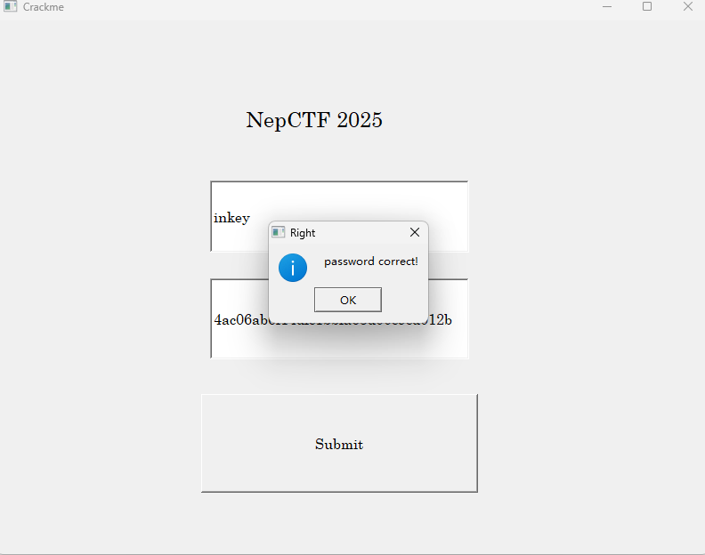

校验成功！

## realme

主函数的rc4是假的，查看main汇编发现下方有个函数没有被正常反编译出来，手动转为函数发现是另一个rc4_enc函数

猜测哪里替换掉了enc，继续main往上翻发现一处爆红，同样按下p键转为函数

~~~c
// write access to const memory has been detected, the output may be wrong!
void *__cdecl sub_4015C0(int a1, char a2)
{
  void *result; // eax

  sub_401023("%s", a2);
  if ( CloseHandle((HANDLE)0x1234) || GetLastError() != 6 )
    return 0;
  *(&loc_407080 + 1) ^= 0xD0u;
  *(&loc_40B104 + 2) ^= 0xCBu;
  loc_40B078 ^= 0x61u;
  result = &loc_40B079;
  loc_40B079 ^= 0x5Fu;
  return result;
}
~~~

可以看到对loc_407080处的字节做了异或处理

但调试的时候并没有断下来，继续找发现一处爆红的反调试，发现如果检测到调试进不去if

~~~c
// write access to const memory has been detected, the output may be wrong!
void *sub_401500()
{
  void *result; // eax

  result = (void *)(NtCurrentPeb()->NtGlobalFlag & 0x70);
  if ( !result )
  {
    *(&loc_40902A + 1) ^= 0x65u;
    *((_BYTE *)&loc_40902A + 2) ^= 0xFAu;
    *(&loc_407080 + 2) ^= 5u;
    result = &loc_40B077;
    loc_40B077 ^= 0x10u;
  }
  return result;
}
~~~

手动patch下，可以发现跳转函数修改为了sub_4015C0（正好是上面的）

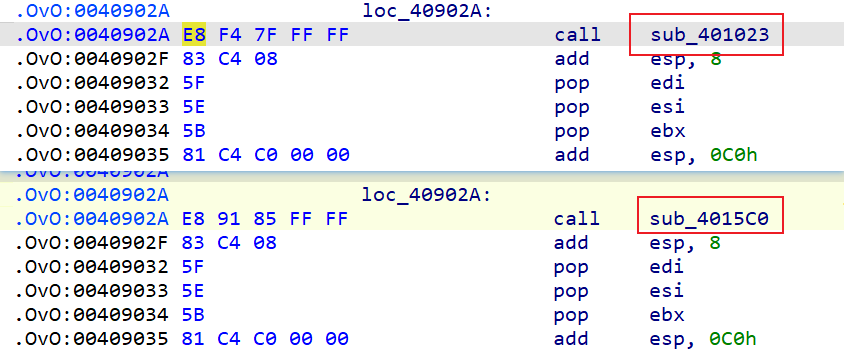

这里基本确定思路，过了反调试即可

还有处反调试

~~~c
// write access to const memory has been detected, the output may be wrong!
void *__cdecl sub_4015C0(int a1, char a2)
{
  void *result; // eax

  sub_401023("%s", a2);
  if ( CloseHandle((HANDLE)0x1234) || GetLastError() != 6 )
    return 0;
  *(&loc_407080 + 1) ^= 0xD0u;
  *(&loc_40B104 + 2) ^= 0xCBu;
  loc_40B078 ^= 0x61u;
  result = &loc_40B079;
  loc_40B079 ^= 0x5Fu;
  return result;
}
~~~

把反调试过掉后就是真实逻辑，如下

~~~c
int __cdecl main_0(int argc, const char **argv, const char **envp)
{
  char v4; // [esp+0h] [ebp-104h]
  char v5; // [esp+0h] [ebp-104h]
  unsigned int i; // [esp+D0h] [ebp-34h]
  _BYTE v7[40]; // [esp+DCh] [ebp-28h] BYREF

  __CheckForDebuggerJustMyCode(&unk_41200F);
  qmemcpy(v7, "PY", 2);
  v7[2] = -94;
  v7[3] = -108;
  v7[4] = 46;
  v7[5] = -114;
  v7[6] = 92;
  v7[7] = -107;
  v7[8] = 121;
  v7[9] = 22;
  v7[10] = -27;
  v7[11] = 54;
  v7[12] = 96;
  v7[13] = -57;
  v7[14] = -24;
  v7[15] = 6;
  v7[16] = 51;
  v7[17] = 120;
  v7[18] = -16;
  v7[19] = -48;
  v7[20] = 54;
  v7[21] = -56;
  v7[22] = 115;
  v7[23] = 27;
  v7[24] = 101;
  v7[25] = 64;
  v7[26] = -75;
  v7[27] = -44;
  v7[28] = -24;
  v7[29] = -100;
  v7[30] = 101;
  v7[31] = -12;
  v7[32] = -70;
  v7[33] = 98;
  v7[34] = -48;
  sub_40108C("Please input the flag:\n", v4);
  sub_4011C2("%s", byte_410158);
  sub_401050(byte_410158, Str);
  for ( i = 0; i < 0x23; ++i )
  {
    if ( byte_410158[i] != v7[i] )
    {
      sub_40108C("Wrong flag!\n", v5);
      return 0;
    }
  }
  sub_40108C("Correct flag!\n", v5);
  return 0;
}
// attributes: thunk
int __cdecl sub_401050(char *a1, char *Str)
{
  return sub_407000(a1, Str);
}
int __cdecl sub_407000(char *a1, char *Str)
{
  size_t v2; // eax
  size_t v3; // eax
  _BYTE v5[516]; // [esp+190h] [ebp-208h] BYREF

  __CheckForDebuggerJustMyCode(&unk_41200F);
  memset(v5, 0, 0x200u);
  v2 = strlen(Str);
  sub_40B000(v5, Str, v2);
  v3 = strlen(a1);
  return ((int (__cdecl *)(_BYTE *, char *, size_t))sub_401A60)(v5, a1, v3);
}
void *__cdecl sub_40B000(int a1, int a2, unsigned int a3)
{
  void *result; // eax
  char v4; // [esp+D3h] [ebp-129h]
  _BYTE v5[264]; // [esp+DCh] [ebp-120h] BYREF
  int v6; // [esp+1E4h] [ebp-18h]
  int i; // [esp+1F0h] [ebp-Ch]

  v6 = 0;
  result = memset(v5, 0, 0x100u);
  for ( i = 0; i < 256; ++i )
  {
    *(_BYTE *)(i + a1) = i ^ 0xCF;
    v5[i] = *(_BYTE *)(a2 + i % a3);
    result = (void *)(i + 1);
  }
  for ( i = 0; i < 256; ++i )
  {
    v6 = ((unsigned __int8)v5[i] + v6 + *(unsigned __int8 *)(i + a1)) % 256;
    v4 = *(_BYTE *)(i + a1);
    *(_BYTE *)(i + a1) = *(_BYTE *)(v6 + a1);
    *(_BYTE *)(v6 + a1) = v4 ^ 0xAD;
    result = (void *)(i + 1);
  }
  return result;
}
unsigned int __cdecl sub_401A60(int a1, int a2, unsigned int a3)
{
  unsigned int result; // eax
  int v4; // ecx
  char v5; // al
  char v6; // [esp+D3h] [ebp-35h]
  unsigned int i; // [esp+DCh] [ebp-2Ch]
  int v8; // [esp+F4h] [ebp-14h]
  int v9; // [esp+100h] [ebp-8h]

  __CheckForDebuggerJustMyCode(&unk_41200F);
  v9 = 0;
  v8 = 0;
  for ( i = 0; ; ++i )
  {
    result = i;
    if ( i >= a3 )
      break;
    v9 = (v9 + 1) % 256;
    v8 = (v8 + v9 * *(unsigned __int8 *)(v9 + a1)) % 256;
    v6 = *(_BYTE *)(v9 + a1);
    *(_BYTE *)(v9 + a1) = *(_BYTE *)(v8 + a1);
    *(_BYTE *)(v8 + a1) = v6;
    v4 = (*(unsigned __int8 *)(v8 + a1) + *(unsigned __int8 *)(v9 + a1)) % 256;
    if ( i % 2 )
      v5 = *(_BYTE *)(v4 + a1) + *(_BYTE *)(i + a2);
    else
      v5 = *(_BYTE *)(i + a2) - *(_BYTE *)(v4 + a1);
    *(_BYTE *)(i + a2) = v5;
  }
  return result;
}
~~~

python解密

~~~python
def KSA(key):
    """ Key-Scheduling Algorithm (KSA) 密钥调度算法"""
    S = list(range(256))
    S = [i^0xcf for i in S]
    j = 0
    for i in range(256):
        j = (j + S[i] + key[i % len(key)]) % 256
        S[i], S[j] = S[j], S[i] ^ 0xad
    return S

def PRGA(S):
    """ Pseudo-Random Generation Algorithm (PRGA) 伪随机数生成算法"""
    i, j = 0, 0
    k = 0
    K = []
    while k < 36:
        i = (i + 1) % 256
        j = (j + i * S[i]) % 256
        S[i], S[j] = S[j], S[i]
        K.append(S[(S[i] + S[j]) % 256])
        k += 1
    return K

def RC4(key, text):
    """ RC4 encryption/decryption """
    S = KSA(key)
    keystream = PRGA(S)
    res = []
    for i in range(len(text)):
        if i % 2:
            res.append((text[i] - keystream[i % len(keystream)])&0xff)
        else:
            res.append((text[i] + keystream[i % len(keystream)])&0xff)
    return bytes(res)

key = b"Y0u_Can't_F1nd_Me!"
text = [ord("P"), ord("Y"), -94, -108, 46, -114, 92, -107, 121, 22, -27, 54, 96, -57, -24, 6, 51, 120, -16, -48, 54, -56, 115, 27, 101, 64, -75, -44, -24, -100, 101, -12, -70, 98, -48]
text = [i&0xff for i in text]
print(len(text))
print(RC4(key, text))

~~~

flag为`NepCTF{Y0u_FiN1sH_Th1s_E3sy_Smc!!!}`

## speedmino

直接解压找到main.lua

第一眼看到个rc4加密calcData

~~~lua
def KSA(key):
    """ Key-Scheduling Algorithm (KSA) 密钥调度算法"""
    S = list(range(256))
    j = 0
    for i in range(256):
        j = (j + S[i] + key[i % len(key)]) % 256
        S[i], S[j] = S[j], S[i]
    return S

def PRGA(S):
    """ Pseudo-Random Generation Algorithm (PRGA) 伪随机数生成算法"""
    i, j = 0, 0
    while True:
        i = (i + 1) % 256
        j = (j + S[i]) % 256
        S[i], S[j] = S[j], S[i]
        K = S[(S[i] + S[j]) % 256]
        yield K

def RC4(key, text):
    """ RC4 encryption/decryption """
    S = KSA(key)
    keystream = PRGA(S)
    res = []
    for char in text:
        res.append((char - next(keystream))&0xff)
    return bytes(res)

key = b"Speedmino Created By MrZ and modified by zxc"
text = [222,174,208,225,137,95,76,120,104,84,161,74,222,237,242,91,249,20,13,126,69,81,231,170,178,8,164,164,169,2,191,138,156,165,185,42,75,23,89,160,5,134,82,78,10,120,108,98,114,159,59,243,87,214,243]
print(len(text))
print(RC4(key, text))
~~~

解密是假的flag `FAKE{D0_You_F1nd_A_DLL_1s_5tran9e?!Challenge_Starts!!!}`

misc的flag也在这个代码里，只是不需要逆向可以改分数之类的，也可以直接代码求解

~~~python
def KSA(key):
    """ Key-Scheduling Algorithm (KSA) 密钥调度算法"""
    S = list(range(256))
    j = 0
    for i in range(256):
        j = (j + S[i] + key[i % len(key)]) % 256
        S[i], S[j] = S[j], S[i]
    return S

i = 0
j = 0

def RC4(text):
    """ RC4 encryption/decryption """
    res = []
    global i, j, S
    for char in text:
        i = (i + 1) % 256
        j = (j + S[i]) % 256
        S[i], S[j] = S[j], S[i]
        K = S[(S[i] + S[j]) % 256]
        res.append((char + K)&0xff)
    return bytes(res)

key = b"Speedmino Created By MrZ and modified by zxc"
S = KSA(key)
text = [187,24,5,131,58,243,176,235,179,159,170,155,201,23,6,3,210,27,113,11,161,94,245,41,29,43,199,8,200,252,86,17,72,177,52,252,20,74,111,53,28,6,190,108,47,16,237,148,82,253,148,6]
print(len(text))
RC4([222,174,208,225,137,95,76,120,104,84,161,74,222,237,242,91,249,20,13,126,69,81,231,170,178,8,164,164,169,2,191,138,156,165,185,42,75,23,89,160,5,134,82,78,10,120,108,98,114,159,59,243,87,214,243])
for _ in range(2600):
    text = RC4(text)
print(text)
~~~

fake flag提示和dll有关，首先搜到了liblove相关的库

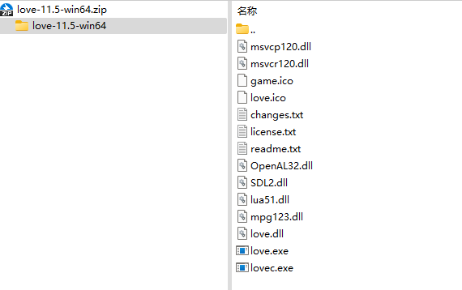

发现好几个dll确实一样，基本可以排除OpenAl32.dll、SDL2.dll、mpg123.dll、lua51.dll的问题

在version.dll中搜到lovely-injector（https://github.com/ethangreen-dev/lovely-injector，基本可以确定魔改了lua什么的）

根据github介绍，理论上应该会把修补的lua源文件转储到`MOD_DIR/lovely/dump`，MOD_DIR应该是`%AppData%/Balatro/Mods`，但是实际上没找到，推测魔改了

dllmain发现dump-all参数，查看releases说明和源码

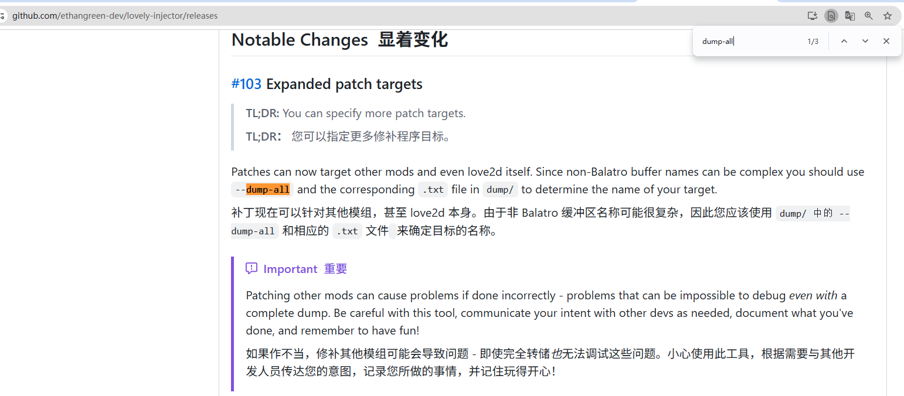

~~~rust
let dump_all = args.contains(&"--dump-all".to_string());

// Initialize the lovely runtime.
let rt = Lovely::init(
    &|a, b, c, d, e| LuaLoadbufferx_Detour.call(a, b, c, d, e),
    lualib::get_lualib(),
    dump_all,
);
~~~

保证v16等于1可以直接sub_7FFE3E184A80传参时候传1

~~~c
qmemcpy(v14, "--dump-all", 10);
  if ( v5 )
  {
    v15 = 0LL;
    while ( *(_QWORD *)(v4 + v15 + 16) != 10LL
         || *(_QWORD *)v14 ^ **(_QWORD **)(v4 + v15 + 8) | (unsigned __int16)(v14[4] ^ *(_WORD *)(*(_QWORD *)(v4 + v15 + 8) + 8LL)) )
    {
      v15 += 24LL;
      if ( 24 * v5 == v15 )
        goto LABEL_35;
    }
    v16 = 1;
  }
  else
  {
LABEL_35:
    v16 = 0;
  }
sub_7FFE3E1655C0(v14, 10LL, 1LL);
sub_7FFE3E1622A0(v28);
sub_7FFE3E184A80((unsigned int)Src, 1, (unsigned int)&unk_7FFE3E380CB0, (unsigned int)v28, v16);
~~~

直接上动调，debugger option把application换成exe，sub_7FFE3E184A80执行前修改掉v16值，不断F9直到弹出了崩溃提示框

~~~
njector has crashed: \npanicked at crates\\lovely-core\\src\\lib.rs:213:13:\nThe byte buffer '[27, 76, 74, 2, 10, 108, 0, 2, 5, 0, 0, 4, 24, 24, 2, 0, 0, 27, 2, 1, 2, 32, 2, 1, 2, 85, 3, 18, 128, 41, 3, 2, 0, 85, 4, 14, 128, 34, 4, 3, 3, 1, 2, 4, 0, 88, 4, 5, 128, 23, 4, 2, 2, 26, 4, 3, 4, 8, 4, 1, 0, 88, 4, 1, 128, 76, 2, 2, 0, 36, 4, 3, 2, 9, 4, 1, 0, 88, 4, 1, 128, 88, 4, 2, 128, 22, 3, 2, 3, 88, 4, 241, 127, 22, 2, 2, 2, 88, 3, 237, 127, 41, 3, 127, 1, 76, 3, 2, 0, 128, 6, 0, 2, 10, 173, 1, 0, 1, 14, 2, 1, 3, 37, 41, 1, 1, 0, 53, 2, 0, 0, 45, 3, 0, 0, 21, 3, 3, 0, 21, 4, 0, 0, 4, 3, 4, 0, 88, 3, 2, 128, 43, 3, 1, 0, 76, 3, 2, 0, 41, 3, 1, 0, 21, 4, 0, 0, 41, 5, 1, 0, 77, 3, 22, 128, 56, 7, 6, 2, 22, 8, 0, 6, 56, 8, 8, 2, 34, 7, 8, 7, 56, 8, 6, 0, 27, 8, 1, 8, 41, 9, 5, 0, 37, 8, 9, 8, 36, 8, 7, 8, 45, 9, 0, 0, 56, 9, 6, 9, 4, 8, 9, 0, 88, 9, 2, 128, 43, 9, 1, 0, 76, 9, 2, 0, 22, 9, 2, 6, 45, 10, 1, 0, 18, 12, 6, 0, 56, 13, 6, 0, 66, 10, 3, 2, 60, 10, 9, 2, 79, 3, 234, 127, 43, 3, 2, 0, 76, 3, 2, 0, 2, 192, 1, 192, 1, 3, 0, 0, 3, 231, 2, 3, 255, 2, 2, 128, 1, 4, 187, 2, 1, 1, 7, 0, 3, 0, 7, 51, 1, 0, 0, 53, 2, 1, 0, 51, 3, 2, 0, 18, 4, 3, 0, 18, 6, 0, 0, 50, 0, 0, 128, 68, 4, 2, 0, 0, 1, 56, 0, 0, 3, 154, 157, 2, 3, 198, 181, 5, 3, 166, 228, 26, 3, 145, 211, 40, 3, 251, 211, 6, 3, 130, 215, 129, 1, 3, 228, 242, 168, 1, 3, 196, 168, 159, 1, 3, 129, 221, 199, 1, 3, 195, 223, 144, 4, 3, 199, 157, 185, 2, 3, 244, 143, 63, 3, 251, 215, 153, 3, 3, 135, 233, 138, 6, 3, 242, 165, 200, 9, 3, 205, 174, 162, 3, 3, 234, 245, 245, 2, 3, 213, 168, 236, 1, 3, 146, 157, 203, 6, 3, 152, 209, 149, 7, 3, 246, 170, 197, 18, 3, 247, 210, 143, 5, 3, 213, 139, 191, 12, 3, 214, 210, 200, 21, 3, 234, 243, 163, 22, 3, 142, 196, 209, 3, 3, 174, 249, 132, 10, 3, 245, 231, 208, 32, 3, 226, 207, 157, 23, 3, 152, 231, 164, 45, 3, 243, 136, 170, 26, 3, 164, 165, 253, 53, 3, 128, 168, 133, 41, 3, 231, 151, 177, 73, 3, 225, 221, 153, 65, 3, 199, 246, 137, 42, 3, 182, 136, 193, 51, 3, 187, 219, 151, 34, 3, 169, 164, 247, 74, 3, 178, 144, 215, 10, 3, 132, 173, 234, 19, 3, 225, 205, 134, 105, 3, 241, 197, 180, 41, 3, 141, 251, 232, 61, 3, 169, 160, 191, 114, 3, 147, 240, 245, 122, 3, 188, 151, 166, 44, 3, 174, 131, 161, 25, 3, 217, 242, 144, 13, 3, 201, 230, 169, 131, 1, 3, 241, 204, 225, 173, 1, 3, 178, 143, 222, 120, 3, 170, 153, 191, 185, 1, 3, 197, 231, 163, 171, 1, 3, 163, 175, 244, 160, 1, 0, 0]' for target \x1bLJ\x02\nl contains invalid UTF-8: Utf8Error { valid_up_to: 28, error_len: Some(1) }
~~~

IDA里搜字符串提取出来，可以看到lua字节码，写入到文件，使用[在线反编译网站](https://luadec.metaworm.site/)加载二进制文件后拿到反编译代码

~~~lua
-- filename: 
-- version: luajit2
-- line: [0, 0] id: 0
local function r1_0(r0_2, r1_2)
  -- line: [0, 0] id: 2
  -- notice: unreachable block#9
  local r2_2 = r0_2 * 384 + 0 + r1_2
  while true do
    -- LOOP
    local r3_2 = 2
    while true do
      -- LOOP
      if r2_2 < r3_2 * r3_2 then
        local r4_2 = (r2_2 - 1) % 5
        if r4_2 ~= 0 then
          return r2_2
        end
      end
      local r4_2 = r2_2 % r3_2
      if r4_2 == 0 then
        break
      end
      r3_2 = r3_2 + 1
    end
    r2_2 = r2_2 + 1
  end
end
local r2_0 = {
  nil,
  36506,
  88774,
  438822,
  666001,
  109051,
  2124674,
  2767204,
  2610244,
  3272321,
  8662979,
  5131975,
  1034228,
  6712315,
  12760199,
  20058866,
  6854477,
  6126314,
  3871829,
  13815442,
  15034520,
  38884726,
  10742135,
  26199509,
  45230422,
  46725610,
  7627278,
  21052590,
  68432885,
  48719842,
  94974872,
  55215219,
  113201828,
  86070272,
  153897959,
  136736481,
  88243015,
  108020790,
  71691707,
  157143593,
  22399026,
  41588356,
  220309217,
  86844145,
  129645965,
  240111657,
  257783827,
  92900284,
  52969902,
  27539801,
  275411785,
  364406385,
  253200306,
  389008554,
  359199685,
  337450915
}
return (function(r0_1)
  -- line: [0, 0] id: 1
  local r1_1 = 1
  local r2_1 = {
    nil,
    359,
    383
  }
  local r3_1 = r2_0
  if #r0_1 ~= #r0_1 then
    return false
  end
  for r6_1 = 1, #r0_1, 1 do
    if (r0_1[r6_1] + 64) ^ 5 % r2_1[r6_1] * r2_1[(r6_1 + 1)] ~= r2_0[r6_1] then
      return false
    end
    r2_1[r6_1 + 2] = r1_0(r6_1, r0_1[r6_1])
  end
  return true
end)(r0_0)

~~~

逆向求解

~~~python
def enc(id, v):
    r2_2 = id * 384 + v
    while True:
        r3_2 = 2
        while True:
            if r2_2 < r3_2 * r3_2:
                r4_2 = (r2_2 -1) % 5
                if r4_2 != 0:
                    return r2_2
            r4_2 = r2_2 % r3_2
            if r4_2 == 0:
                break
            r3_2 += 1
        r2_2 += 1

cmp = [0, 36506, 88774, 438822, 666001, 109051, 2124674, 2767204, 2610244, 3272321, 8662979, 5131975, 1034228, 6712315, 12760199, 20058866, 6854477, 6126314, 3871829, 13815442, 15034520, 38884726, 10742135, 26199509, 45230422, 46725610, 7627278, 21052590, 68432885, 48719842, 94974872, 55215219, 113201828, 86070272, 153897959, 136736481, 88243015, 108020790, 71691707, 157143593, 22399026, 41588356, 220309217, 86844145, 129645965, 240111657, 257783827, 92900284, 52969902, 27539801, 275411785, 364406385, 253200306, 389008554, 359199685, 337450915]
r2_1 = [0, 359, 383]
for i in range(1, len(cmp)):
    for j in range(256):
        if ((j+64)**5)%(r2_1[i]*r2_1[i+1]) == cmp[i]:
            print(j, end=",")
            r2_1.append(enc(i, j))
            break
~~~

得到230,210,245,223,98,97,151,114,63,90,139,78,204,42,227,68,202,55,242,163,103,108,231,197,142,255,180,98,123,0,184,145,164,171,247,41,92,21,89,100,22,125,87,98,10,142,70,107,101,142,60,65,168,214,243

猜测替换了密文，再来个caldata解密即可

~~~python
def KSA(key):
    """ Key-Scheduling Algorithm (KSA) 密钥调度算法"""
    S = list(range(256))
    j = 0
    for i in range(256):
        j = (j + S[i] + key[i % len(key)]) % 256
        S[i], S[j] = S[j], S[i]
    return S

def PRGA(S):
    """ Pseudo-Random Generation Algorithm (PRGA) 伪随机数生成算法"""
    i, j = 0, 0
    while True:
        i = (i + 1) % 256
        j = (j + S[i]) % 256
        S[i], S[j] = S[j], S[i]
        K = S[(S[i] + S[j]) % 256]
        yield K

def RC4(key, text):
    """ RC4 encryption/decryption """
    S = KSA(key)
    keystream = PRGA(S)
    res = []
    for char in text:
        res.append((char - next(keystream))&0xff)
    return bytes(res)

key = b"Speedmino Created By MrZ and modified by zxc"
text = [230,210,245,223,98,97,151,114,63,90,139,78,204,42,227,68,202,55,242,163,103,108,231,197,142,255,180,98,123,0,184,145,164,171,247,41,92,21,89,100,22,125,87,98,10,142,70,107,101,142,60,65,168,214,243,55]
print(len(text))
print(RC4(key, text))
~~~

得到`NepCTF{Y0u_c4n_M0dDing_LOVE2D_g@mE_By_l0vely_iNjector!}`

lua反编译github：https://github.com/weaweawe01/luajit_decompile/

## QRS

启动后提示Failed to deserialize query string: missing field \`input`，可以加上参数

给了符号表，搜索qrs发现QRS::e12c96f7a24fc73e1::axum_extract::b2a92c317a3cdec81有TEA类加密特征

~~~c
// Hidden C++ exception states: #wind=13
signed __int64 *__fastcall QRS::e12c96f7a24fc73e1::axum_extract::b2a92c317a3cdec81(
        signed __int64 *a1,
        __int64 a2,
        const void *a3,
        signed __int64 a4)
{
  // [COLLAPSED LOCAL DECLARATIONS. PRESS NUMPAD "+" TO EXPAND]

  v41 = -2LL;
  if ( a4 < 0 )
  {
    v8 = 0LL;
    goto LABEL_27;
  }
  if ( a4 )
  {
    v8 = 1LL;
    v9 = _rust_alloc(a4, 1LL);
    if ( v9 )
    {
      v10 = v9;
      goto LABEL_6;
    }
LABEL_27:
    alloc::raw_vec::handle_error(v8, a4);
  }
  v10 = 1LL;
LABEL_6:
  memcpy_0((void *)v10, a3, a4);
  v38 = a4;
  v39 = v10;
  v40 = a4;
  v11 = a4 & 7;
  v32 = a1;
  if ( (a4 & 7) == 0 )
  {
    v35 = (unsigned int *)v10;
    v17 = a4;
    Size = a4;
    if ( a4 )
      goto LABEL_10;
LABEL_22:
    v38 = 0LL;
    v39 = 1LL;
    v40 = 0LL;
    goto LABEL_23;
  }
  v12 = 8 - v11;
  Src = (void *)_rust_alloc_zeroed(8 - v11, 1LL);
  if ( !Src )
    alloc::raw_vec::handle_error(1LL, v12);
  Sizea = v12;
  alloc::raw_vec::RawVecInner<A>::reserve::do_reserve_and_handle((unsigned int)&v38, a4, v12, 1, 1LL);
  v13 = v38;
  v14 = v39;
  v15 = v40;
  memcpy_0((void *)(v39 + v40), Src, Sizea);
  _rust_dealloc(Src, Sizea, 1LL);
  v16 = (__int64)(Sizea + v15) < 0;
  v17 = Sizea + v15;
  v35 = (unsigned int *)v14;
  if ( v16 )
  {
    v18 = 0LL;
LABEL_30:
    alloc::raw_vec::handle_error(v18, v17);
  }
  Size = v13;
  if ( !v17 )
    goto LABEL_22;
LABEL_10:
  v18 = 1LL;
  v19 = _rust_alloc(v17, 1LL);
  if ( !v19 )
    goto LABEL_30;
  v20 = v19;
  v38 = v17;
  v39 = v19;
  v40 = 0LL;
  v21 = v17 & 0x7FFFFFFFFFFFFFF8LL;
  if ( (v17 & 0x7FFFFFFFFFFFFFF8LL) != 0 )
  {
    v22 = 0LL;
    v23 = v35;
    do
    {
      Srca = (void *)v21;
      v24 = *v23;
      v25 = v23[1];
      v26 = 48;
      TickCount = GetTickCount();
      v28 = 0;
      do
      {
        v24 += (v25 + ((16 * v25) ^ (v25 >> 5))) ^ (*(_DWORD *)(a2 + 4LL * (v28 & 3)) + v28);
        v25 += (v24 + ((16 * v24) ^ (v24 >> 5))) ^ (v28 + TickCount + *(_DWORD *)(a2 + (((v28 + TickCount) >> 9) & 0xC)));
        v28 += TickCount;
        --v26;
      }
      while ( v26 );
      if ( (unsigned __int64)(v38 - v22) > 3 )
      {
        v29 = Srca;
      }
      else
      {
        alloc::raw_vec::RawVecInner<A>::reserve::do_reserve_and_handle((unsigned int)&v38, v22, 4, 1, 1LL);
        v29 = Srca;
        v20 = v39;
        v22 = v40;
      }
      *(_DWORD *)(v20 + v22) = v24;
      v30 = v22 + 4;
      v40 = v30;
      if ( (unsigned __int64)(v38 - v30) <= 3 )
      {
        alloc::raw_vec::RawVecInner<A>::reserve::do_reserve_and_handle((unsigned int)&v38, v30, 4, 1, 1LL);
        v30 = v40;
      }
      v23 += 2;
      v21 = (__int64)v29 - 8;
      v20 = v39;
      *(_DWORD *)(v39 + v30) = v25;
      v22 = v30 + 4;
      v40 = v22;
    }
    while ( v21 );
  }
LABEL_23:
  v32[2] = v40;
  *v32 = v38;
  v32[1] = v39;
  if ( Size )
    _rust_dealloc(v35, Size, 1LL);
  return v32;
}
~~~

查看调用函数可以在附近找到密文和密钥

~~~c
si128 = _mm_load_si128((const __m128i *)&_xmm);
v76 = v10;
QRS::e12c96f7a24fc73e1::axum_extract::b2a92c317a3cdec81(&v58, (__int64)&si128, v10, v11);
v12 = (__m128i *)_rust_alloc(32LL, 1LL);
if ( !v12 )
alloc::alloc::handle_alloc_error(1LL, 32LL);
*v12 = (__m128i)_xmm_cdee8146e3b77ae8c745973c083ea621;
v12[1] = _mm_load_si128((const __m128i *)&_xmm);
~~~

但是不知道delta（TickCount），按理说不是固定的，所以调试看下发现每次返回都是0x68547369

~~~python
from ctypes import c_uint32

def xtea_decrypt(r, v, key):
    v0, v1 = c_uint32(v[0]), c_uint32(v[1])
    delta = 0x68547369
    total = c_uint32(delta * r)
    for i in range(r):
        v1.value -= (((v0.value << 4) ^ (v0.value >> 5)) + v0.value) ^ (total.value + key[((total.value >> 9) & 12)//4])
        total.value -= delta
        v0.value -= (((v1.value << 4) ^ (v1.value >> 5)) + v1.value) ^ (total.value + key[total.value & 3])
    return v0.value, v1.value

if __name__ == "__main__":
    k = [0x01234567, 0x89ABCDEF, 0xFEDCBA98, 0x76543210]
    v = [0x083EA621, 0xC745973C, 0xE3B77AE8, 0xCDEE8146, 0x7DC86B96, 0x6B8C9D3B, 0x79B14342, 0x2ECF0F0D]
    for i in range(0, len(v), 2):
        v[i:i+2] = xtea_decrypt(48, v[i:i+2], k)
    v = "".join([int.to_bytes(v[i], byteorder='little', length=4).decode() for i in range(len(v))])
    print(v)
~~~

解密得到flag为a4747f82be106d3f8c4d747c744d7ee5

## FlutterPro

考察点第一次见，出题人说抹掉了so文件的大部分信息，所以直接blutter会报错

~~~
sym = dynsym.get_symbol_by_name('_kDartVmSnapshotData')[0]
AttributeError: 'NoneType' object has no attribute 'get_symbol_by_name'
~~~

需要分析blutter源码，其中有个extract_dart_info往里深入分析，发现最后了下面这个字符串去libflutter里获取dart_version

~~~python
epos = data.find(b' (stable) (')
~~~

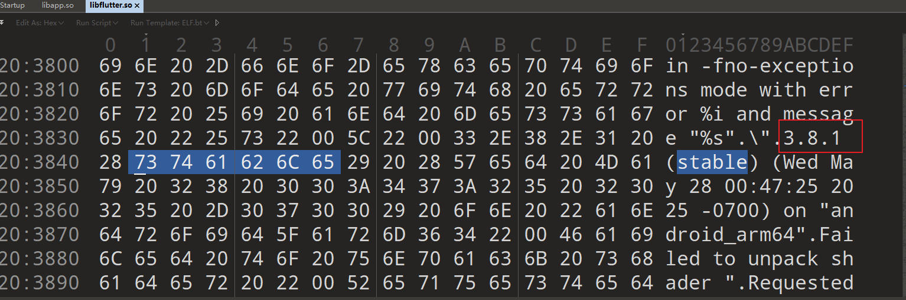

确定dart版本3.8.1

结合参数说明再命令行后添加`--dart-version 3.8.1_android_arm64`

~~~python
parser.add_argument('--dart-version', help='Run without libflutter (indir become libapp.so) by specify dart version such as "3.4.2_android_arm64"')
~~~

开始艰难的编译

* 报错1：https://gcc.gnu.org/bugzilla/show_bug.cgi?id=96555，需要升级gcc、g++等从11到12

  ~~~
  sudo apt install gcc-12 g++-12
  sudo update-alternatives --install /usr/bin/gcc gcc /usr/bin/gcc-12 120
  sudo update-alternatives --install /usr/bin/g++ g++ /usr/bin/g++-12 120
  ~~~

* 报错2：

  ~~~
  /home/adam/blutter/blutter/src/pch.h:12:10: fatal error: format: No such file or directory
     12 | #include <format>
  ~~~

  最后ai告诉我又需要升级到13，和上面一样

最终可以了，注意要输入libapp.so路径而不是目录否则报错

~~~
python3 blutter.py /mnt/e/CTF/flag_archives/CTFs/NepCTF2025/flutterpro/arm64-v8a/libapp.so /mnt/e/CTF/flag_archiv
es/CTFs/NepCTF2025/flutterpro/output --dart-version 3.8.1_android_arm64
~~~

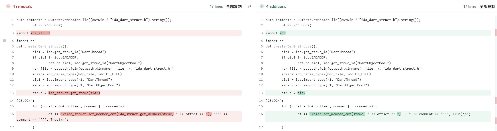

由于ida9了所以有些api没更新需要修改下blutter\src\DartDumper.cpp内容如上

拿到addName后可以还原大部分符号表，然后搜flutterpro一个个函数查看，在onTap里找到sub_202D08函数

~~~c
__int64 flutterpro_main__W1::_onTap_202cd0()
{
  _QWORD *v0; // x15
  __int64 v1; // x26
  __int64 v2; // x28
  __int64 v3; // x29
  __int64 v4; // x30

  *(v0 - 2) = v3;
  *(v0 - 1) = v4;
  if ( (unsigned __int64)(v0 - 2) <= *(_QWORD *)(v1 + 56) )
    StackOverflowSharedWithoutFPURegsStub_32d378(*v0, *(unsigned int *)(*v0 + 23LL) + (v2 << 32));
  return sub_202D08();
}
__int64 __usercall sub_202D08@<X0>(
        __int64 a1@<X0>,
        __int64 a2@<X1>,
        __int64 a3@<X2>,
        __int64 a4@<X3>,
        __int64 a5@<X4>,
        __int64 a6@<X5>,
        __int64 a7@<X6>,
        __int64 a8@<X7>,
        __int64 a9@<X8>)
{
  // [COLLAPSED LOCAL DECLARATIONS. PRESS NUMPAD "+" TO EXPAND]

  *(_QWORD *)(v9 - 16) = v15;
  *(_QWORD *)(v9 - 8) = v16;
  v17 = v9 - 16;
  *(_QWORD *)(v9 - 24) = a2;
  if ( (unsigned __int64)(v9 - 96) <= *(_QWORD *)(v12 + 56) )
    StackOverflowSharedWithoutFPURegsStub_32d378(a1, a2, a3, a4, a5, a6, a7, a8, a9);
  ContextStub_32c1e0 = AllocateContextStub_32c1e0();
  v19 = *(_QWORD *)(v17 - 8);
  *(_QWORD *)(v17 - 16) = ContextStub_32c1e0;
  *(_DWORD *)(ContextStub_32c1e0 + 15) = v19;
  ClosureStub_32c5a4 = AllocateClosureStub_32c5a4(v19, v13[6113], ContextStub_32c1e0);
  sub_12AC40(*(_QWORD *)(v17 - 8), ClosureStub_32c5a4, v21, v22, v23, v24, v25, v26);
  v27 = *(_QWORD *)(v17 - 8);
  if ( *(_DWORD *)&byte_7[*(unsigned int *)(v27 + 19) + (v14 << 32)] != 128 )
    goto LABEL_44;
  ArrayStub_32d270 = AllocateArrayStub_32d270(v27, v13[5917], 16LL);
  *(_QWORD *)(v17 - 32) = ArrayStub_32d270;
  v37 = 0LL;
  while ( 1 )
  {
    *(_QWORD *)(v17 - 24) = v37;
    if ( (unsigned __int64)v36 <= *(_QWORD *)(v12 + 56) )
      ArrayStub_32d270 = StackOverflowSharedWithoutFPURegsStub_32d378(
                           ArrayStub_32d270,
                           v29,
                           v30,
                           v37,
                           v31,
                           v32,
                           v33,
                           v34,
                           v35);
    if ( v37 >= 8 )
      break;
    v38 = AllocateArrayStub_32d270(ArrayStub_32d270, v13[272], 16LL);
    for ( i = 0LL; ; ++i )
    {
      if ( (unsigned __int64)v36 <= *(_QWORD *)(v12 + 56) )
        v38 = StackOverflowSharedWithoutFPURegsStub_32d378(v38, i, v39, v40, v31, v32, v33, v34, v35);
      if ( i >= 8 )
        break;
      *(_DWORD *)(v38 + 4 * i + 15) = 0;
      v39 = i + 1;
    }
    v29 = *(_QWORD *)(v17 - 24);
    v30 = *(_QWORD *)(v17 - 32);
    *(_DWORD *)(v30 + 4 * v29 + 15) = v38;
    v37 = v29 + 1;
    ArrayStub_32d270 = v30;
  }
  v42 = ArrayStub_32d270;
  v43 = 0LL;
  while ( 1 )
  {
    v44 = *(_QWORD *)(v17 - 8);
    *(_QWORD *)(v17 - 56) = v43;
    if ( (unsigned __int64)v36 <= *(_QWORD *)(v12 + 56) )
      ArrayStub_32d270 = StackOverflowSharedWithoutFPURegsStub_32d378(
                           ArrayStub_32d270,
                           v29,
                           v42,
                           v44,
                           v43,
                           v32,
                           v33,
                           v34,
                           v35);
    if ( v43 >= 8 )
      break;
    v32 = 8 * v43;
    *(_QWORD *)(v17 - 48) = 8 * v43;
    v33 = 0LL;
    while ( 1 )
    {
      *(_QWORD *)(v17 - 24) = v33;
      if ( (unsigned __int64)v36 <= *(_QWORD *)(v12 + 56) )
        StackOverflowSharedWithoutFPURegsStub_32d378(ArrayStub_32d270, v29, v42, v44, v43, v32, v33, v34, v35);
      if ( v33 >= 8 )
        break;
      v45 = *(unsigned int *)(v42 + 4 * v43 + 15) + (v14 << 32);
      *(_QWORD *)(v17 - 40) = v45;
      v46 = *(unsigned int *)(v44 + 19) + (v14 << 32);
      MintSharedWithoutFPURegsStub_32d4f8 = 2 * ((int)v32 + (int)v33);
      if ( v32 + v33 != MintSharedWithoutFPURegsStub_32d4f8 >> 1 )
      {
        MintSharedWithoutFPURegsStub_32d4f8 = AllocateMintSharedWithoutFPURegsStub_32d4f8(
                                                v42,
                                                v44,
                                                v43,
                                                v32,
                                                v33,
                                                v45,
                                                v46);
        *(_QWORD *)(MintSharedWithoutFPURegsStub_32d4f8 + 7) = v48;
      }
      *v36 = MintSharedWithoutFPURegsStub_32d4f8;
      v36[1] = v46;
      v49 = dart_core__StringBase::op_at_3090f4(MintSharedWithoutFPURegsStub_32d4f8, v29, v42, v44, v43);
      v50 = sub_272F98(v49, v13[462], v49);
      if ( !((__int64)*(int *)(v50 + 19) >> 1) )
      {
        v71 = RangeErrorSharedWithoutFPURegsStub_32d7c0(0LL, 0LL, v50, v51, v52, v53, v54, v55, v56);
        goto LABEL_46;
      }
      v58 = *(unsigned __int8 *)(v50 + 23);
      v59 = *(_QWORD *)(v17 - 24);
      v60 = 2 * (int)v59;
      if ( v59 != v60 >> 1 )
      {
        v60 = AllocateMintSharedWithoutFPURegsStub_32d4f8(v59, v58, v52, v53, v54, v55, v56);
        *(_QWORD *)(v60 + 7) = v61;
      }
      v62 = 2 * v58;
      v63 = *(_QWORD *)(v17 - 40);
      v64 = (unsigned int)*(_QWORD *)(v63 - 1) >> 12;
      v57[1] = v60;
      v57[2] = v63;
      *v57 = v62;
      (*(void (**)(void))(v10 + 8 * (v64 - 1377)))();
      ArrayStub_32d270 = *(_QWORD *)(v17 - 24);
      v33 = ArrayStub_32d270 + 1;
      v44 = *(_QWORD *)(v17 - 8);
      v43 = *(_QWORD *)(v17 - 56);
      v42 = *(_QWORD *)(v17 - 32);
      v32 = *(_QWORD *)(v17 - 48);
    }
    ArrayStub_32d270 = v43++;
    v42 = *(_QWORD *)(v17 - 32);
  }
  v66 = sub_203624(v44, *(_QWORD *)(v17 - 32), *(unsigned int *)(v44 + 31) + (v14 << 32));
  *(_QWORD *)(v17 - 40) = v66;
  v71 = *(unsigned int *)(v66 + 11);
  v72 = (__int64)(int)v71 >> 1;
  *(_QWORD *)(v17 - 56) = v72;
  v73 = v13[59];
  v74 = 0LL;
  while ( 1 )
  {
    *(_QWORD *)(v17 - 48) = v74;
    if ( (unsigned __int64)v70 <= *(_QWORD *)(v12 + 56) )
LABEL_46:
      StackOverflowSharedWithoutFPURegsStub_32d378(v71, v65, v66, v72, v74, v73, v67, v68, v69);
    if ( v74 >= 8 )
      break;
    v75 = v72;
    v65 = v74;
    if ( v74 < v72 )
    {
      v67 = v73;
      v76 = 0LL;
      goto LABEL_34;
    }
    v75 = RangeErrorSharedWithoutFPURegsStub_32d7c0(v72, v74, v66, v72, v74, v73, v67, v68, v69);
LABEL_48:
    StackOverflowSharedWithoutFPURegsStub_32d378(v75, v65, v66, v72, v74, v76, v67, v68, v69);
    while ( v76 < 8 )
    {
      v77 = *(unsigned int *)(v66 + 4 * v74 + 15) + (v14 << 32);
      v78 = 2 * (int)v76;
      if ( v76 != v78 >> 1 )
      {
        v78 = AllocateMintSharedWithoutFPURegsStub_32d4f8(v66, v72, v74, v76, v67, v77, v69);
        *(_QWORD *)(v78 + 7) = v79;
      }
      v80 = (unsigned int)*(_QWORD *)(v77 - 1) >> 12;
      *v70 = v78;
      v70[1] = v77;
      v81 = (*(__int64 (**)(void))(v10 + 8 * (v80 - 4090)))();
      v82 = (__int64)(int)v81 >> 1;
      if ( (v81 & 1) != 0 )
        v82 = *(_QWORD *)(v81 + 7);
      v83 = sub_2030D8(v81, v82);
      v84 = *(_QWORD *)(v17 - 32);
      *v85 = v83;
      v85[1] = v84;
      v65 = dart_core__StringBase::op_add_309274(v83, v86, v87, v88, v89);
      v75 = *(_QWORD *)(v17 - 24);
      v76 = v75 + 1;
      v67 = v65;
      v66 = *(_QWORD *)(v17 - 40);
      v74 = *(_QWORD *)(v17 - 48);
      v72 = *(_QWORD *)(v17 - 56);
LABEL_34:
      *(_QWORD *)(v17 - 32) = v67;
      *(_QWORD *)(v17 - 24) = v76;
      if ( (unsigned __int64)v70 <= *(_QWORD *)(v12 + 56) )
        goto LABEL_48;
    }
    v71 = v74++;
    v73 = *(_QWORD *)(v17 - 32);
    v66 = *(_QWORD *)(v17 - 40);
    v72 = *(_QWORD *)(v17 - 56);
  }
  v90 = (unsigned int)*(_QWORD *)(v73 - 1) >> 12;
  *v70 = v13[5916];
  v70[1] = v73;
  v27 = (*(__int64 (**)(void))(v10 + 8 * v90))();
  if ( (v27 & 0x10) != 0 )
  {
LABEL_44:
    v99 = AllocateClosureStub_32c5a4(v27, v13[6115], *(_QWORD *)(v17 - 16));
    sub_12AC40(*(_QWORD *)(v17 - 8), v99, v100, v101, v102, v103, v104, v105);
    return v11;
  }
  else
  {
    v91 = AllocateClosureStub_32c5a4(v27, v13[6114], *(_QWORD *)(v17 - 16));
    sub_12AC40(*(_QWORD *)(v17 - 8), v91, v92, v93, v94, v95, v96, v97);
    return v11;
  }
}
~~~

很难读，有些函数没有参数的一般是ida没有识别出来可以双击进去出来再F5

但关注到很大的数组v13，可以设置其类型为DartObjectPool*（在变量上按下Y，其他大数组也可以这么改），得到结构体双击进去可以看到很多字符串

从上往下一个个函数翻找字符串（下面这个错了两位，不知道啥原因）

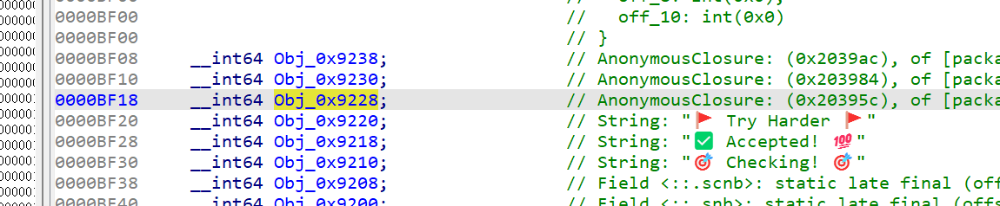

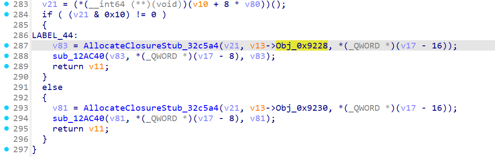

交叉引用LABEL_44可以发现一处疑似比较长度的位置

~~~c
if ( *(_DWORD *)&byte_7[*(unsigned int *)(v21 + 19) + (v14 << 32)] != 128 )
    goto LABEL_44;
~~~

hook这个cmp地址的寄存器，可以发现是输入长度的2倍

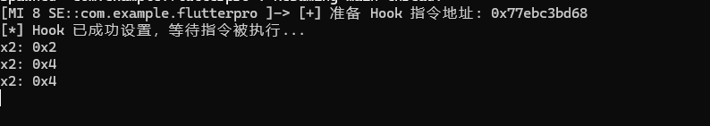

~~~js
var libapp = null;

function onLibappLoaded() {
    const INSTRUCTION_OFFSET = 0x202D68; 
    const absoluteAddr = libapp.add(INSTRUCTION_OFFSET);
    console.log(`[+] 准备 Hook 指令地址: ${absoluteAddr}`);

    try {
        Interceptor.attach(absoluteAddr, {
            // 当程序执行流程到达这个地址时，onEnter 回调会被触发
            onEnter: function (args) {
                console.log(`x2: ${this.context.x2} `);
            }
        });

        console.log("[*] Hook 已成功设置，等待指令被执行...");

    } catch (error) {
        console.error(`[!] Hook 失败: ${error.message}`);
        console.error(`[!] 请检查地址 ${absoluteAddr} 是否有效且具有可执行权限。`);
    }
}

// 保留你原来的健壮的 libapp.so 加载逻辑，无需改动
function tryLoadLibapp() {
    try {
        libapp = Module.findBaseAddress('libapp.so');
    } catch (e) {
        if (e instanceof TypeError && e.message === "not a function") {
            libapp = Process.findModuleByName('libapp.so');
            if (libapp != null) {
                libapp = libapp.base;
            }
        } else {
            throw e;
        }
    }
    if (libapp === null)
        setTimeout(tryLoadLibapp, 500);
    else
        onLibappLoaded();
}

// 启动脚本
tryLoadLibapp();
~~~

由此可知长度应该是64，之后进入8*8循环，对应输入长度

~~~c
while ( 1 )
{
    *(_QWORD *)(v17 - 24) = v31;
    if ( (unsigned __int64)v30 <= *(_QWORD *)(v12 + 56) )
      ArrayStub_32d270 = StackOverflowSharedWithoutFPURegsStub_32d378(
                           ArrayStub_32d270,
                           v23,
                           v24,
                           v31,
                           v25,
                           v26,
                           v27,
                           v28,
                           v29);
    if ( v31 >= 8 )
      break;
    v32 = AllocateArrayStub_32d270(ArrayStub_32d270, v13->Obj_0x148c0, 16LL);
    for ( i = 0LL; ; ++i )
    {
      if ( (unsigned __int64)v30 <= *(_QWORD *)(v12 + 56) )
        v32 = StackOverflowSharedWithoutFPURegsStub_32d378(v32, i, v33, v34, v25, v26, v27, v28, v29);
      if ( i >= 8 )
        break;
      *(_DWORD *)(v32 + 4 * i + 15) = 0;
      v33 = i + 1;
    }
    v23 = *(_QWORD *)(v17 - 24);
    v24 = *(_QWORD *)(v17 - 32);
    *(_DWORD *)(v24 + 4 * v23 + 15) = v32;
    v31 = v23 + 1;
    ArrayStub_32d270 = v24;
}
~~~

hook下面的sub_203624函数发现输入的正好是8个a

~~~js
const ShowNullField = false;
const MaxDepth = 5;
var libapp = null;

function dumpArgs(step, address, bufSize) {

    var buf = Memory.readByteArray(address, bufSize)

    console.log('Argument ' + step + ' address ' + address.toString() + ' ' + 'buffer: ' + bufSize.toString() + '\n\n Value:\n' +hexdump(buf, {
        offset: 0,
        length: bufSize,
        header: false,
        ansi: false
    }));

    console.log("Trying interpret that arg is pointer")
    console.log("=====================================")
    try{

    console.log(Memory.readCString(ptr(address)));
    console.log(ptr(address).readCString());
    console.log(hexdump(ptr(address)));
    }catch(e){
        console.log(e);
    }

    console.log('')
    console.log('----------------------------------------------------')
    console.log('')
}

function onLibappLoaded() {
    const fn_addr = 0x203624;
    Interceptor.attach(libapp.add(fn_addr), {
        onEnter: function () {
            init(this.context);
            let objPtr = getArg(this.context, 0);
            const [tptr, cls, values] = getTaggedObjectValue(objPtr);
            console.log(`${cls.name}@${tptr.toString().slice(2)} =`, JSON.stringify(values, null, 2));
            let objPtr1 = getArg(this.context, 1);
            const [tptr1, cls1, values1] = getTaggedObjectValue(objPtr1);
            console.log(`${cls1.name}@${tptr1.toString().slice(2)} =`, JSON.stringify(values1, null, 2));
            let objPtr2 = getArg(this.context, 2);
            const [tptr2, cls2, values2] = getTaggedObjectValue(objPtr2);
            console.log(`${cls2.name}@${tptr2.toString().slice(2)} =`, JSON.stringify(values2, null, 2));
        },
        onLeave: function(retval){
            dumpArgs(0,retval,500);
        }
    });
}
~~~

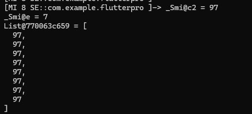

进函数分析下代码，发现又出现了3组8*8循环

~~~c
__int64 __usercall sub_203624@<X0>(
        __int64 a1@<X1>,
        __int64 a2@<X2>,
        __int64 a3@<X4>,
        __int64 a4@<X5>,
        __int64 a5@<X6>,
        __int64 a6@<X7>,
        __int64 a7@<X8>)
{
  // [COLLAPSED LOCAL DECLARATIONS. PRESS NUMPAD "+" TO EXPAND]

  *(_QWORD *)(v7 - 16) = v13;
  *(_QWORD *)(v7 - 8) = v14;
  v15 = v7 - 16;
  v16 = a2;
  *(_QWORD *)(v7 - 24) = a1;
  *(_QWORD *)(v7 - 32) = a2;
  if ( (unsigned __int64)(v7 - 128) <= *(_QWORD *)(v10 + 56) )
    v16 = StackOverflowSharedWithoutFPURegsStub_32d378(a2, a1, a2, a1, a3, a4, a5, a6, a7);
  ArrayStub_32d270 = AllocateArrayStub_32d270(v16, v11->Obj_0x9858, 16LL);
  *(_QWORD *)(v15 - 32) = ArrayStub_32d270;
  v26 = 0LL;
  while ( 1 )
  {
    *(_QWORD *)(v15 - 24) = v26;
    if ( (unsigned __int64)v25 <= *(_QWORD *)(v10 + 56) )
      ArrayStub_32d270 = StackOverflowSharedWithoutFPURegsStub_32d378(
                           ArrayStub_32d270,
                           v18,
                           v19,
                           v26,
                           v20,
                           v21,
                           v22,
                           v23,
                           v24);
    if ( v26 >= 8 )
      break;
    v27 = AllocateArrayStub_32d270(ArrayStub_32d270, v11->Obj_0x148c0, 16LL);
    for ( i = 0LL; ; ++i )
    {
      if ( (unsigned __int64)v25 <= *(_QWORD *)(v10 + 56) )
        v27 = StackOverflowSharedWithoutFPURegsStub_32d378(v27, i, v28, v29, v20, v21, v22, v23, v24);
      if ( i >= 8 )
        break;
      *(_DWORD *)(v27 + 4 * i + 15) = 0;
      v28 = i + 1;
    }
    v18 = *(_QWORD *)(v15 - 24);
    v19 = *(_QWORD *)(v15 - 32);
    *(_DWORD *)(v19 + 4 * v18 + 15) = v27;
    v26 = v18 + 1;
    ArrayStub_32d270 = v19;
  }
  v31 = *(_QWORD *)(v15 - 8);
  v32 = ArrayStub_32d270;
  MintSharedWithoutFPURegsStub_32d4f8 = *(unsigned int *)(v31 + 11);
  v34 = (__int64)(int)MintSharedWithoutFPURegsStub_32d4f8 >> 1;
  *(_QWORD *)(v15 - 72) = v34;
  v35 = 0LL;
  while ( 1 )
  {
    v36 = *(_QWORD *)(v15 - 16);
    *(_QWORD *)(v15 - 64) = v35;
    if ( (unsigned __int64)v25 <= *(_QWORD *)(v10 + 56) )
      MintSharedWithoutFPURegsStub_32d4f8 = StackOverflowSharedWithoutFPURegsStub_32d378(
                                              MintSharedWithoutFPURegsStub_32d4f8,
                                              v18,
                                              v32,
                                              v31,
                                              v34,
                                              v36,
                                              v35,
                                              v23,
                                              v24);
    if ( v35 >= 8 )
      return *(_QWORD *)(v15 - 32);
    v23 = 0LL;
LABEL_18:
    *(_QWORD *)(v15 - 56) = v23;
    if ( (unsigned __int64)v25 <= *(_QWORD *)(v10 + 56) )
      MintSharedWithoutFPURegsStub_32d4f8 = StackOverflowSharedWithoutFPURegsStub_32d378(
                                              MintSharedWithoutFPURegsStub_32d4f8,
                                              v18,
                                              v32,
                                              v31,
                                              v34,
                                              v36,
                                              v35,
                                              v23,
                                              v24);
    if ( v23 < 8 )
      break;
    v18 = v35++;
    v31 = *(_QWORD *)(v15 - 8);
    v32 = *(_QWORD *)(v15 - 32);
    v34 = *(_QWORD *)(v15 - 72);
  }
  if ( (unsigned __int64)v35 < 8 )
  {
    MintSharedWithoutFPURegsStub_32d4f8 = 2 * (int)v23;
    if ( v23 != MintSharedWithoutFPURegsStub_32d4f8 >> 1 )
    {
      MintSharedWithoutFPURegsStub_32d4f8 = AllocateMintSharedWithoutFPURegsStub_32d4f8(
                                              v32,
                                              v31,
                                              v34,
                                              v36,
                                              v35,
                                              v23,
                                              v24);
      *(_QWORD *)(MintSharedWithoutFPURegsStub_32d4f8 + 7) = v23;
    }
    v37 = MintSharedWithoutFPURegsStub_32d4f8;
    *(_QWORD *)(v15 - 48) = MintSharedWithoutFPURegsStub_32d4f8;
    v24 = 0LL;
    goto LABEL_25;
  }
  MintSharedWithoutFPURegsStub_32d4f8 = RangeErrorSharedWithoutFPURegsStub_32d7c0(
                                          8LL,
                                          v35,
                                          v32,
                                          v31,
                                          v34,
                                          v36,
                                          v35,
                                          v23,
                                          v24);
LABEL_42:
  MintSharedWithoutFPURegsStub_32d4f8 = StackOverflowSharedWithoutFPURegsStub_32d378(
                                          MintSharedWithoutFPURegsStub_32d4f8,
                                          v37,
                                          v32,
                                          v31,
                                          v34,
                                          v36,
                                          v35,
                                          v23,
                                          v24);
  while ( 1 )
  {
    if ( v24 >= 8 )
    {
      v18 = v23++;
      v31 = *(_QWORD *)(v15 - 8);
      v36 = *(_QWORD *)(v15 - 16);
      v35 = *(_QWORD *)(v15 - 64);
      v32 = *(_QWORD *)(v15 - 32);
      v34 = *(_QWORD *)(v15 - 72);
      goto LABEL_18;
    }
    v38 = *(unsigned int *)(v32 + 4 * v35 + 15) + (v12 << 32);
    *(_QWORD *)(v15 - 40) = v38;
    v39 = (unsigned int)*(_QWORD *)(v38 - 1) >> 12;
    *v25 = v37;
    v25[1] = v38;
    v40 = (*(__int64 (**)(void))(v8 + 8 * (v39 - 4090)))();
    v48 = *(_QWORD *)(v15 - 72);
    v49 = *(_QWORD *)(v15 - 64);
    *(_QWORD *)(v15 - 80) = v40;
    if ( v49 >= v48 )
      break;
    v50 = *(unsigned int *)(*(_QWORD *)(v15 - 8) + 4LL * *(_QWORD *)(v15 - 64) + 15) + (v12 << 32);
    v51 = (unsigned int)*(_QWORD *)(v50 - 1) >> 12;
    *v47 = 2LL * *(_QWORD *)(v15 - 24);
    v47[1] = v50;
    v52 = (*(__int64 (**)(void))(v8 + 8 * (v51 - 4090)))();
    v59 = *(_QWORD *)(v15 - 16);
    *(_QWORD *)(v15 - 88) = v52;
    v60 = (__int64)*(int *)(v59 + 11) >> 1;
    v61 = *(_QWORD *)(v15 - 24);
    if ( v61 >= v60 )
      goto LABEL_44;
    v62 = *(unsigned int *)&byte_9[4 * *(_QWORD *)(v15 - 24) + 6 + *(unsigned int *)(v59 + 15) + (v12 << 32)]
        + (v12 << 32);
    v63 = (unsigned int)*(_QWORD *)(v62 - 1) >> 12;
    *v58 = *(_QWORD *)(v15 - 48);
    v58[1] = v62;
    v64 = (*(__int64 (**)(void))(v8 + 8 * (v63 - 4090)))();
    v71 = *(_QWORD *)(v15 - 88);
    v72 = (__int64)(int)v71 >> 1;
    if ( (v71 & 1) != 0 )
      v72 = *(_QWORD *)(v71 + 7);
    v73 = (__int64)(int)v64 >> 1;
    if ( (v64 & 1) != 0 )
      v73 = *(_QWORD *)(v64 + 7);
    v74 = v72 * v73;
    v75 = *(_QWORD *)(v15 - 80);
    v76 = (__int64)(int)v75 >> 1;
    if ( (v75 & 1) != 0 )
      v76 = *(_QWORD *)(v75 + 7);
    v77 = 2 * ((int)v76 + (int)v74);
    if ( v76 + v74 != v77 >> 1 )
    {
      v77 = AllocateMintSharedWithoutFPURegsStub_32d4f8(v76, v76 + v74, v65, v66, v67, v68, v69);
      *(_QWORD *)(v77 + 7) = v78;
    }
    v79 = v77;
    v80 = *(_QWORD *)(v15 - 40);
    v81 = (unsigned int)*(_QWORD *)(v80 - 1) >> 12;
    v70[1] = *(_QWORD *)(v15 - 48);
    v70[2] = v80;
    *v70 = v79;
    MintSharedWithoutFPURegsStub_32d4f8 = (*(__int64 (**)(void))(v8 + 8 * (v81 - 1377)))();
    v24 = *(_QWORD *)(v15 - 24) + 1LL;
    v31 = *(_QWORD *)(v15 - 8);
    v36 = *(_QWORD *)(v15 - 16);
    v35 = *(_QWORD *)(v15 - 64);
    v23 = *(_QWORD *)(v15 - 56);
    v32 = *(_QWORD *)(v15 - 32);
    v37 = *(_QWORD *)(v15 - 48);
    v34 = *(_QWORD *)(v15 - 72);
LABEL_25:
    *(_QWORD *)(v15 - 24) = v24;
    if ( (unsigned __int64)v25 <= *(_QWORD *)(v10 + 56) )
      goto LABEL_42;
  }
  v60 = RangeErrorSharedWithoutFPURegsStub_32d7c0(v48, v49, v40, v41, v42, v43, v44, v45, v46);
LABEL_44:
  RangeErrorSharedWithoutFPURegsStub_32d7c0(v60, v61, v59, v52, v53, v54, v55, v56, v57);
  *(_DWORD *)((char *)&qword_18
            + *(unsigned int *)&byte_9[*(unsigned int *)(*(_QWORD *)v83 + 23LL) + 6 + (v12 << 32)]
            + (v12 << 32)
            + 3) = v11->Obj_0x9220;
  return v9;
}
~~~

观察到其中有一条`v74 = v72 * v73;`十分可疑，直接hook这里X1、X2、X0

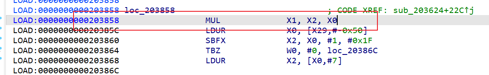

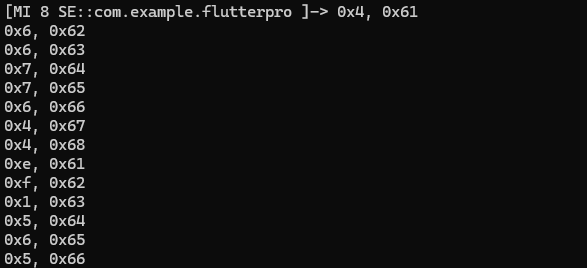

发现做了512次乘法，每个字符都做了8次乘法，基本可以确定是8*8矩阵乘法，另一个矩阵我们也提取了出来

~~~
4	14	6	5	7	5	7	2	
6	15	5	3	6	1	6	13	
6	1	4	9	7	3	4	3	
7	5	7	4	6	5	4	5	
7	6	6	9	6	12	4	14	
6	5	7	5	7	2	6	15	
4	1	6	12	7	3	6	15	
4	3	7	5	7	4	6	5	

97	98	99	100	101	102	103	104	
105	106	107	108	109	110	111	112	
113	114	115	116	117	118	119	120	
121	122	65	66	67	68	69	70	
71	72	73	74	75	76	77	78	
79	80	81	82	83	84	85	86	
87	88	89	90	48	49	50	51	
52	53	54	55	56	57	43	45	

4417	4958	4834	5245	5329	3521	4321	7274
4769	5358	5218	5661	5753	3801	4665	7850
5121	5758	5602	6077	6177	4081	5009	8426
3501	4940	3840	3941	4281	2679	3613	5696
3273	3658	3586	3893	3951	2611	3203	5402
3625	4058	3970	4309	4375	2891	3547	5978
3074	3813	3236	3392	3638	2268	2945	4447
2321	2651	2486	2655	2741	1845	2212	3739
~~~

继续找别的sub函数hook，hook 0x2030D8发现输入正好是之前矩阵结果，第一轮传入乘法矩阵第一行以及输入矩阵最后一行

~~~
_Smi@2 = 1
List@77006259e9 = [
  4417,
  4958,
  4834,
  5245,
  5329,
  3521,
  4321,
  7274
]
List@7700624189 = [
  52,
  53,
  54,
  55,
  56,
  57,
  43,
  45
]
Argument 0 address 0x7700625c29 buffer: 500
~~~

同时在这个函数里发现了调用了很多包含奇特符号的字符串

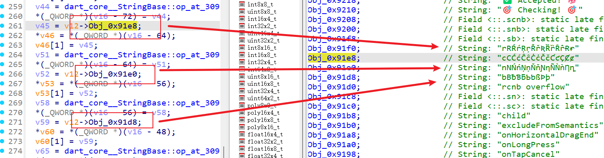

猜测这里进行特殊加密，可以去搜索，发现是RCNB加密

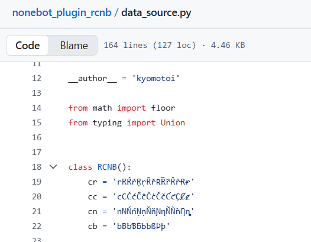

基本确定算法，直接找密文，在循环结束后找到Obj_0x9860，对应的正好是包含类似字符的字符串

搜到一个python rcnb库可以pip安装下，尝试解码发现是128字节，猜测两字节一组一个数

~~~python
import rcnb

dec = rcnb.decodeBytes("RƇǹþRȻňBRÇȠƀŔćnBŔCÑƁRĈȵþRƇƞƀŔȼNBŔCŇÞŔĊņßŔĈŃƀŔĊȠƃŔċȵƄRčņßŔcȠbŕĊNƄŔcǹƃŔĆŅƁŔĆŇƅŔĊƞƁŔĉȵƁRčńƁRȻƝƅŕĊņþRȼȠƁŔćƞbŔćŅƀŔĉŅƁŔĊÑBRĊȵƁRȼȵƄŕćȵƀRȻņBŔćņƁŔCƞƁŔĈÑƀŔĉƞƄRĊnƃRȼņƃŕĆŃþRƇƝƄŔcnƁRÇnBRȻŅßŔcńƃRćǸƄRčŅÞŔċȠBŔcÑBŔĊńƀŔĈńƀŔĊńƃŔċnƃRƇņƀŔcňƁŕċÑƃŔCÑƀŔĈǹƁŔĉņßŔČŇƀŔČǹþRƇƝÞŔCňÞŕĊňƁ")
print(dec, len(dec))
print([int.from_bytes(dec[i:i+2], "little") for i in range(0, len(dec), 2)])
~~~

~~~
[9999, 44816, 22032, 22291, 37138, 46859, 527, 54041, 28178, 20757, 532, 40469, 16150, 18702, 5650, 61725, 4114, 60178, 531, 29973, 4373, 12558, 48656, 7454, 33553, 45075, 32787, 44308, 32021, 56588, 36625, 44572, 39696, 35603, 34578, 21012, 57620, 21004, 13329, 42779, 64270, 38673, 54031, 38672, 46609, 65290, 16398, 12566, 63761, 14357, 3092, 14869, 45589, 55822, 56593, 57374, 36882, 26388, 47892, 33302, 50454, 65038, 30738, 11038]
~~~

基本确认就是乘法矩阵结果，写个求逆矩阵即可

~~~python
import rcnb

dec = rcnb.decodeBytes("RƇǹþRȻňBRÇȠƀŔćnBŔCÑƁRĈȵþRƇƞƀŔȼNBŔCŇÞŔĊņßŔĈŃƀŔĊȠƃŔċȵƄRčņßŔcȠbŕĊNƄŔcǹƃŔĆŅƁŔĆŇƅŔĊƞƁŔĉȵƁRčńƁRȻƝƅŕĊņþRȼȠƁŔćƞbŔćŅƀŔĉŅƁŔĊÑBRĊȵƁRȼȵƄŕćȵƀRȻņBŔćņƁŔCƞƁŔĈÑƀŔĉƞƄRĊnƃRȼņƃŕĆŃþRƇƝƄŔcnƁRÇnBRȻŅßŔcńƃRćǸƄRčŅÞŔċȠBŔcÑBŔĊńƀŔĈńƀŔĊńƃŔċnƃRƇņƀŔcňƁŕċÑƃŔCÑƀŔĈǹƁŔĉņßŔČŇƀŔČǹþRƇƝÞŔCňÞŕĊňƁ")
print(dec, len(dec))
cmp = [int.from_bytes(dec[i:i+2], "big") for i in range(0, len(dec), 2)]
print(cmp)
import numpy as np

def solve_for_A(list_b, list_c, size=8):
    """
    根据 B 和 C 的平铺列表，求解矩阵方程 A * B = C 中的 A。

    参数:
    list_b (list): 矩阵 B 的平铺列表 (长度为 size*size)。
    list_c (list): 矩阵 C 的平铺列表 (长度为 size*size)。
    size (int): 矩阵的维度 (例如 8x8 矩阵，size=8)。

    返回:
    (numpy.ndarray, list) 或 (None, None): 返回结果矩阵 A 和其平铺列表，
                                          如果 B 不可逆则返回 None。
    """
    try:
        # 1. 将输入列表转换为 8x8 NumPy 矩阵
        matrix_b = np.array(list_b).reshape(size, size)
        matrix_c = np.array(list_c).reshape(size, size)

        # 2. 计算 B 的逆矩阵 (B_inv)
        # np.linalg.inv 会在矩阵不可逆（奇异矩阵）时抛出异常
        matrix_b_inv = np.linalg.inv(matrix_b)

        # 3. 计算 A = C * B_inv
        # 在 NumPy 中，@ 符号代表标准的矩阵乘法
        matrix_a = matrix_c @ matrix_b_inv

        # 4. (可选) 将结果矩阵平铺回列表
        list_a = matrix_a.flatten().tolist()

        return matrix_a, list_a

    except np.linalg.LinAlgError:
        # 如果 B 是奇异矩阵（行列式为0），则不可逆
        print("错误：输入的矩阵 B 是奇异矩阵，不可逆，无法求解唯一的 A。")
        return None, None

# 设置打印选项，使得浮点数矩阵显示为整数，便于阅读
np.set_printoptions(suppress=True, formatter={'float_kind': '{:.0f}'.format})

# 求解 A
result_matrix_A, result_list_A = solve_for_A(B, cmp)

# 打印结果
if result_matrix_A is not None:
    print("求解得到的矩阵 A 为:")
    print(result_matrix_A)
print(result_list_A)
print("".join([chr(round(i)) for i in result_list_A]))
~~~

## reboot

题目好像提示了uboot

使用DNA解包（我也不知道干啥的）

新建工程-把img文件放到DNA_input-选择4分解[img]-去bootloader目录里拿出来kernel

kernel用arm小端打开，可以借助findcrypt找到aes不断往前交叉引用查找定位核心函数

~~~c
__int64 __fastcall sub_2C338(__int64 a1, __int64 a2)
{
  __int64 v4; // x8
  __int64 v5; // x0
  unsigned __int64 v6; // x2
  __int64 v7; // x22
  unsigned __int64 *v8; // x21
  __int64 v9; // x2
  __int64 v10; // x3
  __int64 v11; // x8
  __int64 i; // x9
  __int64 v13; // x11
  unsigned __int64 v14; // x13
  char v15; // w12
  __int64 v16; // x2
  __int64 v17; // x3
  __int64 result; // x0
  const char *v19; // x0
  _QWORD v20[4]; // [xsp+0h] [xbp-40h] BYREF
  _QWORD v21[2]; // [xsp+20h] [xbp-20h] BYREF
  _QWORD v22[2]; // [xsp+30h] [xbp-10h] BYREF
  _BYTE v23[8]; // [xsp+58h] [xbp+18h] BYREF

  v4 = 0LL;
  v22[0] = 0xB70AA913DD265F73LL;
  v22[1] = 0x6793D4501B916634LL;
  v21[0] = 0xE4E982B28636BEEDLL;
  v21[1] = 0xA66116CE554E1940LL;
  do
  {
    v23[v4] = *(_BYTE *)(a1 + v4);
    ++v4;
  }
  while ( v4 != 7 );
  v23[7] = *(_BYTE *)(len(a1) + a1 - 1);
  v5 = len(a1);
  v6 = (v5 - 1) & 0xFFFFFFFFFFFFFFF8LL;
  v7 = v5 - 8;
  v8 = (_QWORD *)((char *)v20 - ((v6 + 15) & 0xFFFFFFFFFFFFFFF0LL));
  memset(v8, 0, v6);
  if ( v7 )
  {
    v11 = 0LL;
    for ( i = 0LL; i != v7; ++i )
    {
      v13 = *(unsigned __int8 *)(a1 + 7 + i);
      v14 = i & 0xFFFFFFFFFFFFFFF8LL;
      v15 = ~(_BYTE)v11 & 0x38;
      v11 += 8LL;
      *(unsigned __int64 *)((char *)v8 + v14) |= v13 << v15;
    }
  }
  v20[0] = 0xFA621D351B13AD59LL;
  v20[1] = 0x98D77D18853ED39CLL;
  v20[2] = 0x161D73C048D8C430LL;
  v20[3] = 0x319303DC25D27456LL;
  sub_2BC74(qword_76D58, v8, v9, v10);
  sub_2BC74(qword_76D58, v8 + 2, v16, v17);
  result = sub_7278();
  if ( (int)result >= 1 )
  {
    if ( a1 )
    {
      if ( len(a1) == 40
        && !(unsigned int)aes_enc((__int64)v21, (__int64)v23, 8, (__int64)v22)
        && !(unsigned int)sub_6B500((unsigned __int8 *)v8, (unsigned __int8 *)v20, 32LL) )
      {
        sub_7394();
        return sub_2B2B0(0LL, a2);
      }
      v19 = "Variable not implemented";
    }
    else
    {
      v19 = "missing verity";
    }
    return sub_2B298(v19, a2);
  }
  return result;
}
~~~

aes加密这部分可以看出来就是检测flag头，已经确定了为NepCTF{}不用去研究算法了。关注sub_2BC74函数，里面函数不是很多，可以交给ai来分析

定位到sbox，搜到是[Camellia](https://github.com/kobayasy/Camellia)算法，但是应该魔改了哪里，真恶心人啊

官方wp说的是需要使用unicorn模拟执行，但是讲的很不清楚，放假抽空找些资料学习下unicorn

* https://eps1l0h.github.io/2023/01/18/unicorn%E5%88%9D%E6%8E%A2/
* https://mp.weixin.qq.com/s?__biz=Mzk0MjU4OTUxMw==&mid=2247488726&idx=1&sn=206bad4d62e759ebe748e952d1477a3d&chksm=c314bede4a3d102d899c3e390e9e6a39759675bf54a0ebce8398780e8054e6614e198fa40337&mpshare=1&scene=23&srcid=0808Dt3NsP0XqLV8mIQSO3qJ&sharer_shareinfo=4c281ecade9ff3014273b8e5ca5f8496&sharer_shareinfo_first=4c281ecade9ff3014273b8e5ca5f8496#rd
* https://www.fxmx2.top/posts/ctf/nepctf-reboot/

## XSafa

驱动题，不会
