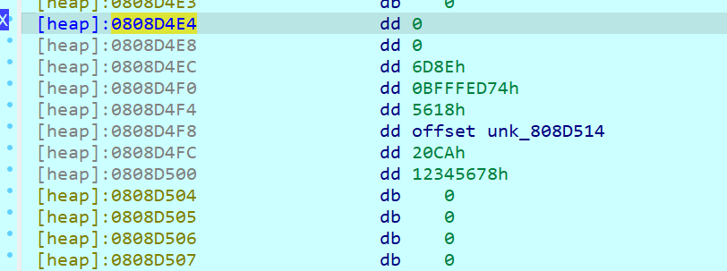

# QWB2024-final 复现

## S1mpLeVM

非常简单，唯一坑点就是你跑一遍代码会修改quest（vm opcode），需要记得恢复即可

首先让gemini仿照vm给出流程打印，然后自己微调观察流程

~~~python
opcode = open("quest", "rb").read()
import sys

# C 代码中的 0x80000000 (INT_MIN)
INT_MIN = -2147483648
MUL = []
XOR = []
class StackVM:
    def __init__(self):
        """
        初始化虚拟机
        """
        self.stack = []
        self.ip = 0  # 指令指针 (Instruction Pointer), 模拟 v6
        self.input_ptr = 0  # 输入数据指针, 模拟 a1
        self.register_v5 = 0  # 模拟 v5 寄存器

        self.bytecode = []
        self.input_data = []

        self.output = ""  # 存储 case 5 打印的字符
        self.running = False

    def _push(self, value):
        """压栈，确保值为32位有符号整数"""
        s32_value = value
        self.stack.append(s32_value)
        print(f"  PUSH {s32_value}")

    def _pop(self):
        """弹栈，如果栈为空则返回 INT_MIN"""
        if not self.stack:
            print(f"  POP <empty> (default: {INT_MIN})")
            return INT_MIN

        value = self.stack.pop()
        print(f"  POP {value}")
        return value

    def _read_opcode(self):
        """读取并推进 IP，返回操作码 (val - 16)"""
        if self.ip >= len(self.bytecode):
            self.running = False
            return -1  # 表示执行结束

        value = self.bytecode[self.ip]
        self.ip += 1
        return value - 16  # C 代码中的 v3 = *a2 - 16

    def _read_immediate(self):
        """读取一个立即数 (signed char) 并推进 IP"""
        if self.ip >= len(self.bytecode):
            print("ERROR: Tried to read immediate past end of bytecode")
            raise IndexError("Bytecode underflow while reading immediate")

        value = self.bytecode[self.ip]
        self.ip += 1
        s8_value = value
        return s8_value

    def _read_input(self):
        """读取当前 input_ptr 指向的输入 (signed char)"""
        if self.input_ptr >= len(self.input_data):
            print("ERROR: Tried to read past end of input data")
            # C 代码中可能会读取无效内存，这里返回 0 模拟
            return 0

        value = self.input_data[self.input_ptr]
        s8_value = value
        print(f"  Read input at [{self.input_ptr}]")
        return s8_value

    def run(self, input_data_str, bytecode_bytes):
        """
        执行 VM
        :param input_data_str: 作为输入的字符串 (模拟 a1)
        :param bytecode_bytes: 作为字节码的 bytes 对象 (模拟 a2)
        """
        # --- 初始化 ---
        self.stack = []
        self.ip = 0
        self.input_ptr = 0
        self.register_v5 = 0x80000000  # 模拟 v5 未初始化的状态 (v48)
        self.output = ""

        # 将输入转换为 C 代码使用的格式
        # input_data 是 char*，所以是字节列表
        self.input_data = [ord(c) for c in input_data_str]
        # bytecode 是 char*，所以是字节列表 (0-255)
        self.bytecode = list(bytecode_bytes)

        self.running = True
        print("--- VM Start ---")
        print(f"Input: '{input_data_str}' ({len(self.input_data)} bytes)")
        print(f"Bytecode: {bytecode_bytes.hex()} ({len(self.bytecode)} bytes)")

        while self.running:
            start_ip = self.ip
            opcode = self._read_opcode()

            if not self.running:
                print("--- VM Halt (End of bytecode) ---")
                break

            op_str = f"[IP:{start_ip:02d}] Opcode {opcode:02d} (0x{opcode:X})"

            try:
                if opcode == 0:  # case 0u: MODULO
                    print(f"{op_str}: MODULO (%)")
                    v7 = self._pop()
                    v8 = self._pop()
                    if v8 == 0:
                        print("  ERROR: Division by zero")
                        result = 0  # C 中是未定义行为，这里我们压入0
                    else:
                        # C 的 % 行为：符号取决于被除数
                        result = v7 % v8
                    self._push(result)

                elif opcode == 1:  # case 1u: PUSH_IMMEDIATE
                    imm = self._read_immediate()
                    print(f"{op_str}: PUSH_IMMEDIATE {imm}")
                    self._push(imm)

                elif opcode == 2:  # case 2u: POP_TO_REGISTER
                    print(f"{op_str}: POP_TO_REGISTER (v5)")
                    self.register_v5 = self._pop()
                    print(f"  v5 = {self.register_v5}")

                elif opcode == 3:  # case 3u: MULTIPLY
                    print(f"{op_str}: MULTIPLY (*)")
                    v15 = self._pop()
                    MUL.append(v15)
                    v16 = self._pop()
                    self._push(v15 * v16)

                elif opcode == 4:  # case 4u: ADD
                    print(f"{op_str}: ADD (+)")
                    v20 = self._pop()
                    v21 = self._pop()
                    self._push(v21 + v20)  # 注意 C 代码是 v21 + v20

                elif opcode == 5:  # case 5u: PRINT_CHAR
                    char_val = self.register_v5 & 0xFF  # 打印为 char
                    char = chr(char_val)
                    self.output += char
                    print(f"print: {char}")

                elif opcode == 6:  # case 6u: PUSH_INPUT
                    print(f"{op_str}: PUSH_INPUT (from *a1)")
                    val = self._read_input()
                    self._push(val)

                elif opcode == 7:  # case 7u: GET_BIT
                    print(f"{op_str}: GET_BIT (>> & 1)")
                    v27_index = self._pop()
                    v28_value = self._pop()
                    result = (v28_value >> v27_index) & 1
                    self._push(result)

                elif opcode == 8:  # case 8u: XOR
                    print(f"{op_str}: XOR (^)")
                    v32 = self._pop()
                    XOR.append(v32)
                    v33 = self._pop()
                    if v32 ^ v33 == 0:
                        print("Yes")
                        exit(0)
                    self._push(v32 ^ v33)

                elif opcode == 9:  # case 9u: CONSUME_INPUT
                    print(f"{op_str}: CONSUME_INPUT (a1++)")
                    self.input_ptr += 1
                    print(f"  Input pointer advanced to {self.input_ptr}")

                elif opcode == 10:  # case 0xAu: RETURN
                    print(f"{op_str}: RETURN (v5)")
                    self.running = False
                    print(f"--- VM Finish ---")
                    print(f"Final Return Value (v5): {self.register_v5}")
                    return self.register_v5

                elif opcode == 11:  # case 0xBu: SUBTRACT
                    print(f"{op_str}: SUBTRACT (-)")
                    v37 = self._pop()
                    v38 = self._pop()
                    # C 代码是 v37 - v38 (A - B)
                    self._push(v37 - v38)

                elif opcode == 12:  # case 0xCu: DIVIDE
                    print(f"{op_str}: DIVIDE (/)")
                    v42 = self._pop()  # A
                    v43 = self._pop()  # B
                    if v43 == 0:
                        print("  ERROR: Division by zero")
                        result = 0  # C 中是未定义行为
                    else:
                        # 模拟 C 的整数除法 (向零截断)
                        result = int(v42 / v43)
                    self._push(result)

                else:  # default:
                    print(f"{op_str}: UNKNOWN OPCODE")
                    print("ERROR: WTF are u doinggg...")
                    self.running = False
                    raise ValueError(f"Unknown Opcode: {opcode}")

            except Exception as e:
                print(f"--- VM CRASH ---")
                print(f"ERROR at IP {start_ip} (Opcode {opcode}): {e}")
                self.running = False

        return self.register_v5

vm = StackVM()
vm.run("a"*32, opcode)

print(MUL)
print(XOR)
~~~

可知代码逐字符检查，首先取每一比特位做乘法然后取和，然后再异或一个数，最后把所有32个异或完的结果求和返回，检查是否为0，因此异或的值就是要比较的数

直接提取出所有乘数和异或值，然后z3求解即可

~~~python
from z3 import *
MUL = [2, 3, 67, 37, 41, 11, 13, 89, 2, 3, 67, 5, 7, 47, 61, 29, 2, 67, 37, 7, 43, 11, 13, 31, 97, 3, 41, 73, 11, 13, 53, 29, 97, 67, 3, 11, 43, 13, 47, 83, 67, 5, 37, 71, 7, 11, 89, 29, 2, 3, 5, 11, 13, 83, 53, 61, 2, 3, 7, 71, 43, 83, 29, 31, 7, 73, 11, 13, 53, 89, 29, 31, 2, 3, 5, 37, 7, 43, 13, 61, 2, 5, 7, 43, 11, 13, 53, 89, 5, 7, 73, 43, 11, 13, 59, 31, 3, 5, 73, 41, 43, 13, 83, 89, 2, 7, 71, 11, 43, 13, 29, 61, 2, 5, 7, 11, 13, 79, 47, 83, 3, 67, 37, 5, 73, 11, 13, 61, 2, 67, 5, 7, 71, 11, 13, 61, 67, 3, 5, 37, 43, 11, 13, 61, 2, 3, 37, 7, 71, 41, 11, 29, 3, 5, 41, 11, 43, 47, 53, 29, 2, 3, 7, 71, 43, 13, 47, 79, 2, 3, 5, 37, 11, 43, 13, 79, 97, 67, 5, 37, 7, 41, 11, 61, 3, 71, 7, 43, 11, 79, 53, 61, 2, 3, 71, 73, 11, 13, 61, 31, 97, 2, 3, 67, 5, 11, 13, 83, 2, 3, 5, 37, 7, 41, 11, 53, 2, 3, 73, 43, 11, 13, 53, 61, 2, 67, 3, 37, 7, 11, 47, 59, 2, 37, 5, 73, 13, 47, 53, 59, 2, 67, 71, 73, 41, 11, 13, 89, 2, 3, 67, 37, 73, 11, 43, 59]
XOR = [70, 56, 70, 77, 74, 90, 87, 82, 60, 67, 86, 95, 64, 94, 85, 66, 33, 69, 64, 98, 67, 71, 94, 93, 90, 32, 65, 82, 68, 65, 93, 96]
s = Solver()
a = [BitVec(f'a{i}', 8) for i in range(32)]
for i in range(0, 256, 8):
    s.add(XOR[i//8]==sum([MUL[i+j]*((a[i//8]>>j)&1) for j in range(8)]))
for i in range(32):
    s.add(ULE(a[i], 128))
if s.check() == sat:
    ans = s.model()
    for i in a:
        print(chr(ans[i].as_long()), end="")
~~~

`s1mpl3_VM_us3s_link3d_l1st_st4ck`

## UnsafeFile

给了个CE的文件，查看文本可知decodeFunction里藏东西了，使用https://github.com/demopath/decodeFunction工具把luac提取出来，然后[在线反编译](https://www.luatool.cn/)

拿到的数据量非常大，

~~~
local L0_1, L1_1, L2_1, L3_1, L4_1, L5_1, L6_1, L7_1, L8_1, L9_1, L10_1, L11_1, L12_1, L13_1, L14_1, L15_1, L16_1, L17_1, L18_1, L19_1, L20_1, L21_1, L22_1, L23_1, L24_1, L25_1, L26_1, L27_1, L28_1, L29_1, L30_1, L31_1, L32_1, L33_1, L34_1, L35_1, L36_1, L37_1, L38_1, L39_1, L40_1, L41_1, L42_1, L43_1, L44_1, L45_1, L46_1, L47_1, L48_1, L49_1, L50_1
L0_1 = {}
L1_1 = 77
L2_1 = 90
L3_1 = 144
L4_1 = 0
L5_1 = 3
L6_1 = 0
L7_1 = 0
L8_1 = 0
L9_1 = 4
L10_1 = 0
L11_1 = 0
L12_1 = 0
L13_1 = 255
L14_1 = 255
L15_1 = 0
L16_1 = 0
L17_1 = 184
L18_1 = 0
L19_1 = 0
L20_1 = 0
L21_1 = 0
L22_1 = 0
L23_1 = 0
L24_1 = 0
L25_1 = 64
L26_1 = 0
L27_1 = 0
L28_1 = 0
L29_1 = 0
L30_1 = 0
L31_1 = 0
L32_1 = 0
L33_1 = 0
L34_1 = 0
L35_1 = 0
L36_1 = 0
L37_1 = 0
L38_1 = 0
L39_1 = 0
L40_1 = 0
L41_1 = 0
L42_1 = 0
L43_1 = 0
L44_1 = 0
L45_1 = 0
L46_1 = 0
L47_1 = 0
L48_1 = 0
L49_1 = 0
L50_1 = 0
L0_1[1] = L1_1
L0_1[2] = L2_1
L0_1[3] = L3_1
L0_1[4] = L4_1
L0_1[5] = L5_1
L0_1[6] = L6_1
L0_1[7] = L7_1
L0_1[8] = L8_1
L0_1[9] = L9_1
L0_1[10] = L10_1
L0_1[11] = L11_1
L0_1[12] = L12_1
L0_1[13] = L13_1
L0_1[14] = L14_1
L0_1[15] = L15_1
L0_1[16] = L16_1
L0_1[17] = L17_1
L0_1[18] = L18_1
L0_1[19] = L19_1
L0_1[20] = L20_1
L0_1[21] = L21_1
L0_1[22] = L22_1
L0_1[23] = L23_1
L0_1[24] = L24_1
L0_1[25] = L25_1
L0_1[26] = L26_1
L0_1[27] = L27_1
L0_1[28] = L28_1
L0_1[29] = L29_1
L0_1[30] = L30_1
L0_1[31] = L31_1
L0_1[32] = L32_1
L0_1[33] = L33_1
L0_1[34] = L34_1
L0_1[35] = L35_1
L0_1[36] = L36_1
L0_1[37] = L37_1
L0_1[38] = L38_1
L0_1[39] = L39_1
L0_1[40] = L40_1
L0_1[41] = L41_1
L0_1[42] = L42_1
L0_1[43] = L43_1
L0_1[44] = L44_1
L0_1[45] = L45_1
L0_1[46] = L46_1
L0_1[47] = L47_1
L0_1[48] = L48_1
L0_1[49] = L49_1
L0_1[50] = L50_1
...
~~~

但是可以看出来其实就是个赋值数组的操作，因此考虑转为python代码提取数组值

~~~python
L0_1 = [0]*42497
code = open("[反编译]ce.luac", "r").readlines()[2:84994]
for line in code:
    exec(line.strip())
with open("out", "wb") as f:
    f.write(bytes(L0_1)[1:])
~~~

提取出来正是一个dll，我们再回到Lua代码最后

~~~lua
data = L0_1
L0_1 = "C:\\system.dll"
L1_1 = "io"
L1_1 = _ENV[L1_1]
L2_1 = "open"
L1_1 = L1_1[L2_1]
L2_1 = L0_1
L3_1 = "wb"
L1_1 = L1_1(L2_1, L3_1)
if L1_1 then
  L2_1 = "ipairs"
  L2_1 = _ENV[L2_1]
  L3_1 = data
  L2_1, L3_1, L4_1 = L2_1(L3_1)
  for L5_1, L6_1 in L2_1, L3_1, L4_1 do
    L9_1 = "write"
    L8_1 = L1_1
    L7_1 = L1_1[L9_1]
    L9_1 = "string"
    L9_1 = _ENV[L9_1]
    L10_1 = "char"
    L9_1 = L9_1[L10_1]
    L10_1 = L6_1
    L9_1, L10_1, L11_1, L12_1, L13_1, L14_1, L15_1, L16_1, L17_1, L18_1, L19_1, L20_1, L21_1, L22_1, L23_1, L24_1, L25_1, L26_1, L27_1, L28_1, L29_1, L30_1, L31_1, L32_1, L33_1, L34_1, L35_1, L36_1, L37_1, L38_1, L39_1, L40_1, L41_1, L42_1, L43_1, L44_1, L45_1, L46_1, L47_1, L48_1, L49_1, L50_1 = L9_1(L10_1)
    L7_1(L8_1, L9_1, L10_1, L11_1, L12_1, L13_1, L14_1, L15_1, L16_1, L17_1, L18_1, L19_1, L20_1, L21_1, L22_1, L23_1, L24_1, L25_1, L26_1, L27_1, L28_1, L29_1, L30_1, L31_1, L32_1, L33_1, L34_1, L35_1, L36_1, L37_1, L38_1, L39_1, L40_1, L41_1, L42_1, L43_1, L44_1, L45_1, L46_1, L47_1, L48_1, L49_1, L50_1)
  end
  L4_1 = "close"
  L3_1 = L1_1
  L2_1 = L1_1[L4_1]
  L2_1(L3_1)
end
L2_1 = "injectDLL"
L2_1 = _ENV[L2_1]
L3_1 = "C:\\system.dll"
L2_1(L3_1)
L2_1 = "sleep"
L2_1 = _ENV[L2_1]
L3_1 = 5
L2_1(L3_1)
L2_1 = [[
alloc(newmem,256)
label(returnhere)
label(originalcode)
label(exit)

newmem:

originalcode:
xor eax,5A

mov ecx, eax
shr eax, 4
shl ecx, 4
or eax, ecx

mov ecx,[ebp-1C]

exit:
jmp returnhere

"system.dll"+25C6:
jmp newmem
nop
returnhere:

]]
L3_1 = "autoAssemble"
L3_1 = _ENV[L3_1]
L4_1 = L2_1
L3_1(L4_1)
L3_1 = "writeByte"
L3_1 = _ENV[L3_1]
L4_1 = "system.dll+C6DC"
L5_1 = 1
L3_1(L4_1, L5_1)
L3_1 = "activateProtection"
L3_1 = _ENV[L3_1]
L3_1()
L3_1 = "enableDRM"
L3_1 = _ENV[L3_1]
L3_1()
~~~

对导出的system.dll做了注入操作，替换了`"system.dll"+25C6`处的指令

分析可知先做了异或再hex高低交换，交叉引用其所在的函数sub_10002560可以发现发生在写入文件操作之前，sub_100028E0再交叉引用可以发现.yr文件写入，可以知道这里就是核心逻辑

~~~c
// bad sp value at call has been detected, the output may be wrong!
int __usercall sub_100028E0@<eax>(_DWORD *a1@<edx>, _DWORD *a2@<ecx>, int a3@<ebp>)
{
  int v5; // esi
  int v6; // esi
  char v7; // al
  int v8; // eax
  __m128 *v9; // edi
  int v10; // esi
  char *v11; // edi
  int v12; // esi
  void *v13; // edx
  __m128 *v14; // ecx
  void *v15; // ecx
  __m128 *v16; // edx
  int v17; // eax
  char v18; // cl
  char **v20; // [esp-1B4h] [ebp-1C0h]
  char v21; // [esp-1ACh] [ebp-1B8h]
  char v22; // [esp-1ABh] [ebp-1B7h]
  char v23; // [esp-1AAh] [ebp-1B6h] BYREF
  char v24; // [esp-1A9h] [ebp-1B5h]
  _DWORD v25[46]; // [esp-1A8h] [ebp-1B4h] BYREF
  _DWORD *v26; // [esp-F0h] [ebp-FCh] BYREF
  void **v27; // [esp-ECh] [ebp-F8h] BYREF
  _DWORD v28[14]; // [esp-E8h] [ebp-F4h] BYREF
  char v29; // [esp-AFh] [ebp-BBh]
  int v30; // [esp-ACh] [ebp-B8h]
  int v31; // [esp-A8h] [ebp-B4h]
  char v32; // [esp-A4h] [ebp-B0h]
  int v33; // [esp-A0h] [ebp-ACh]
  _BYTE v34[76]; // [esp-88h] [ebp-94h] BYREF
  __int64 v35; // [esp-3Ch] [ebp-48h] BYREF
  int v36; // [esp-34h] [ebp-40h]
  int v37; // [esp-30h] [ebp-3Ch] BYREF
  int v38; // [esp-2Ch] [ebp-38h]
  char **v39; // [esp-24h] [ebp-30h]
  __int64 v40; // [esp-20h] [ebp-2Ch]
  char *v41; // [esp-18h] [ebp-24h] BYREF
  char *v42; // [esp-14h] [ebp-20h]
  int *v43; // [esp-10h] [ebp-1Ch]
  __m128 *ExceptionList; // [esp-Ch] [ebp-18h] BYREF
  char *v45; // [esp-8h] [ebp-14h]
  int v46; // [esp-4h] [ebp-10h]
  int v47; // [esp+0h] [ebp-Ch] BYREF
  void *v48; // [esp+4h] [ebp-8h]
  int v49; // [esp+8h] [ebp-4h] BYREF
  void *retaddr; // [esp+Ch] [ebp+0h]

  v47 = a3;
  v48 = retaddr;
  v46 = -1;
  v45 = (char *)&loc_10006D5D;
  ExceptionList = (__m128 *)NtCurrentTeb()->NtTib.ExceptionList;
  v43 = &v49;
  memset(v25, 0, sizeof(v25));
  if ( a2[5] > 0xFu )
    a2 = (_DWORD *)*a2;
  v25[0] = &unk_10009310;
  std::ios::ios(&v25[28]);
  std::istream::istream(v25, &v25[4], 0, 0);
  v46 = 1;
  *(_DWORD *)((char *)v25 + *(_DWORD *)(v25[0] + 4)) = &std::ifstream::`vftable';
  *(_DWORD *)(&v21 + *(_DWORD *)(v25[0] + 4)) = *(_DWORD *)(v25[0] + 4) - 112;
  std::streambuf::streambuf(&v25[4], v47, v48);
  v25[4] = &std::filebuf::`vftable';
  LOBYTE(v25[22]) = 0;
  BYTE1(v25[19]) = 0;
  std::streambuf::_Init(&v25[4]);
  v25[23] = 0;
  v25[20] = dword_1000C708;
  v25[21] = dword_1000C70C;
  v25[18] = 0;
  v46 = dword_1000C70C;
  LOBYTE(v46) = 2;
  if ( !sub_10004FB0(a2, 33, v46) )
    std::ios::setstate((char *)v25 + *(_DWORD *)(v25[0] + 4), 2, 0);
  *(_DWORD *)((char *)v25 + *(_DWORD *)(v25[0] + 4)) = &std::ifstream::`vftable';
  *(_DWORD *)(&v21 + *(_DWORD *)(v25[0] + 4)) = *(_DWORD *)(v25[0] + 4) - 112;
  memset(&v26, 0, 3u);
  if ( a1[5] > 0xFu )
    a1 = (_DWORD *)*a1;
  v26 = &unk_10009318;
  std::ios::ios(v34);
  std::ostream::ostream(&v26, &v27, 0, 4);
  v46 = 5;
  *(_DWORD **)((char *)&v26 + v26[1]) = &std::ofstream::`vftable';
  *(_DWORD *)((char *)&v25[45] + v26[1]) = v26[1] - 104;
  std::streambuf::streambuf(&v27, v47, v48);
  v27 = &std::filebuf::`vftable';
  v32 = 0;
  v29 = 0;
  std::streambuf::_Init(&v27);
  v33 = 0;
  v30 = dword_1000C708;
  v31 = dword_1000C70C;
  v28[13] = 0;
  v46 = dword_1000C70C;
  LOBYTE(v46) = 6;
  if ( !sub_10004FB0(a1, 34, v46) )
    std::ios::setstate((char *)&v26 + v26[1], 2, 0);
  *(_DWORD **)((char *)&v26 + v26[1]) = &std::ofstream::`vftable';
  *(_DWORD *)((char *)&v25[45] + v26[1]) = v26[1] - 104;
  v40 = 0LL;
  v41 = 0;
  LOWORD(v39) = 1;
  v5 = *(_DWORD *)(v25[0] + 4);
  HIWORD(v39) = HIWORD(v38);
  v6 = *(_DWORD *)((char *)&v25[14] + v5);
  HIWORD(v20) = HIWORD(v38);
  BYTE1(v20) = 0;
  LOBYTE(v20) = v6 == 0;
  v41 = 0;
  LOBYTE(v46) = 8;
  v38 = (int)v39;
  v39 = v20;
  v24 = 0;
  if ( v6 )
  {
    v22 = v38;
    goto LABEL_12;
  }
  v23 = (char)v39;
  v7 = v38;
  v22 = v38;
  while ( 1 )
  {
    if ( !v7 )
      v22 = 1;
    if ( !v6 )
      break;
    if ( v23 )
      goto LABEL_35;
    v17 = std::streambuf::sgetc(v6);
    if ( v17 == -1 )
    {
      v6 = 0;
LABEL_35:
      v18 = v24;
      goto LABEL_36;
    }
    v18 = v17;
    v24 = v17;
LABEL_36:
    v23 = v18;
    if ( (char *)HIDWORD(v40) == v41 )
    {
      sub_10005740(HIDWORD(v40), &v23);
    }
    else
    {
      *(_BYTE *)HIDWORD(v40) = v18;
      ++HIDWORD(v40);
    }
    if ( !v6 || std::streambuf::sbumpc(v6) == -1 )
      goto LABEL_14;
    LOBYTE(v39) = 0;
LABEL_12:
    v8 = std::streambuf::sgetc(v6);
    if ( v8 == -1 )
LABEL_14:
      v6 = 0;
    else
      v24 = v8;
    v7 = v22;
    v23 = 1;
  }
  v36 = 0;
  v37 = 4;
  v35 = 0LL;
  v38 = 10;
  ExceptionList = 0;
  v45 = 0;
  v46 = 0;
  if ( dword_1000C6F0 != (_DWORD)Src )
  {
    sub_10002240((unsigned int *)&ExceptionList, dword_1000C6F0 - (_DWORD)Src);
    v9 = ExceptionList;
    v10 = dword_1000C6F0 - (_DWORD)Src;
    memmove(ExceptionList, Src, dword_1000C6F0 - (_DWORD)Src);
    v45 = (char *)v9 + v10;
  }
  LOBYTE(v46) = 10;
  v39 = &v41;
  v41 = 0;
  v42 = 0;
  v43 = 0;
  if ( (void *)dword_1000C6E4 != dword_1000C6E0 )
  {
    sub_10002240((unsigned int *)&v41, dword_1000C6E4 - (_DWORD)dword_1000C6E0);
    v11 = v41;
    v12 = dword_1000C6E4 - (_DWORD)dword_1000C6E0;
    memmove(v41, dword_1000C6E0, dword_1000C6E4 - (_DWORD)dword_1000C6E0);
    v42 = &v11[v12];
  }
  LOBYTE(v46) = 9;
  sub_10001AB0((int)&v37, (int)&v47, (char **)&v35, 0, 0, 0, v41, (int)v42, (int)v43, ExceptionList, (int)v45, v46);
  v46 = 0;
  v45 = (char *)(HIDWORD(v35) - v35);
  std::ostream::write(&v26, v35);
  sub_10002560((int)&dword_1000C6E0);
  ExceptionList = 0;
  v43 = (int *)(dword_1000C6E4 - (_DWORD)dword_1000C6E0);
  std::ostream::write(&v26, dword_1000C6E0);
  ExceptionList = 0;
  v43 = (int *)(dword_1000C6F0 - (_DWORD)Src);
  std::ostream::write(&v26, Src);
  v13 = (void *)v35;
  if ( (_DWORD)v35 )
  {
    v14 = (__m128 *)(v36 - v35);
    if ( (unsigned int)(v36 - v35) < 0x1000
      || (v13 = *(void **)(v35 - 4), v14 = (__m128 *)((char *)v14 + 35), (unsigned int)(v35 - (_DWORD)v13 - 4) <= 0x1F) )
    {
      ExceptionList = v14;
      sub_10005930(v13);
      v35 = 0LL;
      v36 = 0;
      goto LABEL_27;
    }
LABEL_30:
    invalid_parameter_noinfo_noreturn();
  }
LABEL_27:
  v15 = (void *)v40;
  if ( (_DWORD)v40 )
  {
    v16 = (__m128 *)&v41[-v40];
    if ( (unsigned int)&v41[-v40] >= 0x1000 )
    {
      v15 = *(void **)(v40 - 4);
      v16 = (__m128 *)((char *)v16 + 35);
      if ( (unsigned int)(v40 - (_DWORD)v15 - 4) > 0x1F )
        goto LABEL_30;
    }
    ExceptionList = v16;
    sub_10005930(v15);
    v40 = 0LL;
    v41 = 0;
  }
  *(_DWORD **)((char *)&v26 + v26[1]) = &std::ofstream::`vftable';
  *(_DWORD *)((char *)&v25[45] + v26[1]) = v26[1] - 104;
  sub_10004C40(v45, v46);
  std::ostream::~ostream<char,std::char_traits<char>>(v28);
  std::ios::~ios<char,std::char_traits<char>>(v34);
  *(_DWORD *)((char *)v25 + *(_DWORD *)(v25[0] + 4)) = &std::ifstream::`vftable';
  *(_DWORD *)(&v21 + *(_DWORD *)(v25[0] + 4)) = *(_DWORD *)(v25[0] + 4) - 112;
  sub_10004C40(v45, v46);
  std::istream::~istream<char,std::char_traits<char>>(&v25[6]);
  return std::ios::~ios<char,std::char_traits<char>>(&v25[28]);
}
~~~

写入的是dword_1000C6E0，sub_10001AB0是aes的cbc加密，src是iv、dword_1000C6E0是密钥，v35是密文，因此只需要提取后32字节，前16字节逆向解密拿到密钥，后16字节直接是iv，然后解密前面的密文即可

~~~python
with open("secret.pdf.yr", "rb") as f:
    data = list(f.read())
print(len(data))
for i in range(len(data)-32, len(data)-16):
    data[i] = ((data[i]>>4) | (data[i]<<4)) & 0xff
    data[i] ^= 0x5a
key = data[-32:-16]
iv = data[-16:]
print(bytes(key).hex())
print(bytes(iv).hex())
from Crypto.Cipher import AES
aes = AES.new(bytes(key), AES.MODE_CBC, bytes(iv))
with open("secret1.pdf", "wb") as f:
    f.write(bytes(aes.decrypt(bytes(data[:-32]))))
~~~

解密后就是标准的pdf，里面flag为`flag{7he_Che47_En9INe_74BLE_I5_N07_54fE#cf17565a3d91fdbf}`

## pvb

妙不可言的一个题，pvb查了下有个bvp恶意后门代码，virustotal上也能查出来，有专门分析恶意代码的帖子：https://www.qianxin.com/news/detail?news_id=6484

调试起来慢慢一个个函数看，定位到一个读取自身到v43的函数

接着是一个读取自身结尾数据段的函数，里面首先读取了最后4字节作为段的长度，然后截取后面长度字节到v39

在这个函数里出现解压前面读取数据的操作

重点分析sub_804AF60做了什么

~~~c
int __cdecl sub_804AF60(int a1, int a2)
{
  int result; // eax
  _DWORD v3[6]; // [esp+1Ch] [ebp-3Ch] BYREF
  int v4; // [esp+34h] [ebp-24h]
  int *v5; // [esp+38h] [ebp-20h]
  int v6; // [esp+3Ch] [ebp-1Ch] BYREF

  memset(v3, 0, 16);
  v4 = 4;
  v5 = &v6;
  result = sub_804FD50(a1, v3);
  if ( !result && v4 == 4 )
  {
    if ( *(_DWORD *)(a2 + 1280) != v6 )
      return 23;
  }
  else
  {
    v6 = *(_DWORD *)(a2 + 1280);
    result = sub_804FF50(a1, v3);
    if ( result )
      return 14;
  }
  return result;
}
~~~

关键是sub_804FD50，里面的sub_805FC60又是异或0x47的解密，

~~~c
int __cdecl sub_804FD50(int a1, int a2)
{
  int v3; // edi
  int v4; // eax
  int v5; // ebx
  unsigned int v6; // eax
  int v7; // eax
  _DWORD *v8; // eax
  unsigned int v9; // [esp+28h] [ebp-30h]
  pthread_mutex_t *mutex; // [esp+2Ch] [ebp-2Ch]
  _DWORD v11[7]; // [esp+3Ch] [ebp-1Ch] BYREF

  if ( !a2 || !a1 )
    return -268435447;
  v3 = 258;
  mutex = (pthread_mutex_t *)(a1 + 12);
  sub_8060180((pthread_mutex_t *)(a1 + 12));
  v4 = *(_DWORD *)(a1 + 4);
  if ( v4 )
  {
    while ( *(_QWORD *)v4 != *(_QWORD *)(a2 + 8) )
    {
      v4 = *(_DWORD *)(v4 + 16);
      if ( !v4 )
      {
LABEL_22:
        v3 = 258;
        sub_80601D0(mutex);
        return v3;
      }
    }
    v5 = *(_DWORD *)(v4 + 12);
    v3 = 258;
    if ( !v5 )
      goto LABEL_20;
    while ( *(_QWORD *)v5 != *(_QWORD *)a2 )
    {
      v5 = *(_DWORD *)(v5 + 36);
      if ( !v5 )
        goto LABEL_22;
    }
    v6 = *(_DWORD *)(a2 + 24);
    v11[0] = 0;
    v9 = v6;
    memmove_0((void *)(a2 + 16), (const void *)(v5 + 8), 0xCu);
    if ( *(_DWORD *)(a2 + 28) )
    {
      v3 = 259;
      if ( v9 < *(_DWORD *)(v5 + 16) )
        goto LABEL_20;
    }
    else
    {
      v3 = 0xF0000001;
      v8 = calloc_0(*(_DWORD *)(v5 + 16));
      *(_DWORD *)(a2 + 28) = v8;
      if ( !v8 )
        goto LABEL_20;
      v9 = *(_DWORD *)(v5 + 16);
    }
    if ( *(_BYTE *)(v5 + 32) != 1 )
    {
      v3 = 262;
      v7 = sub_8050840(0, 0, 0);
      if ( *(_DWORD *)(v5 + 28) != sub_8050840(v7, *(_DWORD *)(v5 + 20), *(_DWORD *)(v5 + 24)) )
        goto LABEL_20;
      *(_BYTE *)(v5 + 32) = 1;
    }
    sub_805FC60(*(_DWORD *)(v5 + 20), *(_DWORD *)(v5 + 24));
    v11[0] = v9;
    if ( !sub_80511E0(*(_BYTE **)(v5 + 20), *(_DWORD *)(v5 + 24), *(_DWORD *)(a2 + 28), v11)
      && *(_DWORD *)(v5 + 16) == v11[0] )
    {
      v3 = 0;
      sub_805FD70(*(_DWORD *)(v5 + 20), *(_DWORD *)(v5 + 24));
    }
    else
    {
      v3 = 261;
      sub_805FD70(*(_DWORD *)(v5 + 20), *(_DWORD *)(v5 + 24));
    }
  }
LABEL_20:
  sub_80601D0(mutex);
  return v3;
}
~~~

v5是个结构体，每个单位是dword，可以找到对应数据（\*(v5+20)，也就是unk_808D514），数据下面是长度0x20ca（*\(v5+24)），再往下是\*(v5+28)，貌似是一个校验值，可以肯定`if ( *(_DWORD *)(v5 + 28) != sub_8050840(v7, *(_DWORD *)(v5 + 20), *(_DWORD *)(v5 + 24)) )`这里基本不成立，所以才到不了下面说的解密解压函数，因此在这里需要修改控制流使得不跳转LABEL_20

继续往下执行就到了核心sub_805FC60和sub_80511E0这两个函数，一个解密一个解压，解密完已经可以看到ELF的迹象

sub_80511E0传入的是解密完的数据、解密完数据的长度、一个缓冲区、v11指向\*(v5 + 16)，值为0x5618，猜测是解压后的数据长度

因此按理说此时运行完会给出解压后的数据，但实际上F8跳过sub_80511E0时报错，重新调试检查发现传入的第四个参数v11[0]长度并不是0x5618，往前交叉引用v9，可以发现正确长度赋值是在else里的

因此在if下断点让他跳进else里执行，再走一遍前面的流程到sub_80511E0，此时解压出来的就是正确的elf，长度正好是0x5618

导出来可以成功反编译

~~~c
__int64 __fastcall main(int a1, char **a2, char **a3)
{
  _QWORD v4[8]; // [rsp+10h] [rbp-130h] BYREF
  char v5; // [rsp+50h] [rbp-F0h]
  _QWORD s1[4]; // [rsp+60h] [rbp-E0h] BYREF
  char v7; // [rsp+80h] [rbp-C0h]
  _QWORD s[4]; // [rsp+90h] [rbp-B0h] BYREF
  char v9; // [rsp+B0h] [rbp-90h]
  char src[8]; // [rsp+C0h] [rbp-80h] BYREF
  __int64 v11; // [rsp+C8h] [rbp-78h]
  __int64 v12; // [rsp+D0h] [rbp-70h]
  __int64 v13; // [rsp+D8h] [rbp-68h]
  __int64 v14; // [rsp+E0h] [rbp-60h]
  __int64 v15; // [rsp+E8h] [rbp-58h]
  _QWORD s2[4]; // [rsp+F0h] [rbp-50h] BYREF
  char v17; // [rsp+110h] [rbp-30h]
  _QWORD v18[2]; // [rsp+120h] [rbp-20h] BYREF
  char v19; // [rsp+130h] [rbp-10h]
  __int64 v20; // [rsp+133h] [rbp-Dh]
  char v21; // [rsp+13Bh] [rbp-5h]
  int i; // [rsp+13Ch] [rbp-4h]

  v20 = 0LL;
  v21 = 0;
  v18[0] = 0x807060504030201LL;
  v18[1] = 0x100F0E0D0C0B0A09LL;
  v19 = 0;
  s2[0] = 0x40083E4C3E24C8C2LL;
  s2[1] = 0x97449AA824B72843LL;
  s2[2] = 0x7C8B646005849084LL;
  s2[3] = 0x2DC5F322CCC5BCCBLL;
  v17 = 0;
  *(_QWORD *)src = 0LL;
  v11 = 0LL;
  v12 = 0LL;
  v13 = 0LL;
  v14 = 0LL;
  v15 = 0LL;
  memset(s, 0, sizeof(s));
  v9 = 0;
  memset(s1, 0, sizeof(s1));
  v7 = 0;
  memset(v4, 0, sizeof(v4));
  v5 = 0;
  memset(s, 0, sizeof(s));
  memset(s1, 0, sizeof(s1));
  memset(v4, 0, sizeof(v4));
  memset(src, 0, 0x30uLL);
  sub_2A89(src, 34LL);
  if ( strlen(src) == 32 )
  {
    strcpy((char *)s, src);
    for ( i = 0; i <= 3; ++i )
      sub_2867(v18, &s[i], 8LL, &s1[i], 1LL);
    if ( !memcmp(s1, s2, 0x20uLL) )
      printf(":D");
    else
      printf(":(");
    return 0LL;
  }
  else
  {
    puts(":(");
    return 0LL;
  }
}
~~~

sub_2867是加密函数，根据v5值选择不同加密方式，应该是加密解密选项

~~~c
__int64 __fastcall sub_2867(__int64 *a1, __int64 *a2, unsigned int a3, __int64 *a4, int a5)
{
  __int64 v7; // [rsp+2Ch] [rbp-24h] BYREF
  char v8; // [rsp+34h] [rbp-1Ch]
  __int64 v9; // [rsp+35h] [rbp-1Bh] BYREF
  char v10; // [rsp+3Dh] [rbp-13h]
  __int64 v11; // [rsp+3Eh] [rbp-12h] BYREF
  char v12; // [rsp+46h] [rbp-Ah]
  __int64 v13; // [rsp+47h] [rbp-9h] BYREF
  char v14; // [rsp+4Fh] [rbp-1h]

  v13 = 0LL;
  v14 = 0;
  v11 = 0LL;
  v12 = 0;
  v9 = 0LL;
  v10 = 0;
  v7 = 0LL;
  v8 = 0;
  v13 = *a1;
  v11 = a1[1];
  v9 = *a1;
  if ( a5 == 1 )
  {
    v7 = *a2;
    if ( (unsigned int)sub_1F57((__int64)&v13, (__int64)&v7, a3, a4, 1) )
      return 0xFFFFFFFFLL;
    v7 = *a4;
    if ( (unsigned int)sub_1F57((__int64)&v11, (__int64)&v7, 8, a4, 2) )
      return 0xFFFFFFFFLL;
    v7 = *a4;
    if ( (unsigned int)sub_1F57((__int64)&v9, (__int64)&v7, 8, a4, 1) )
      return 0xFFFFFFFFLL;
  }
  else
  {
    if ( a5 != 2 )
    {
      puts("Invalid args!");
      return 0xFFFFFFFELL;
    }
    sub_11D9(a2, &v7);
    if ( (unsigned int)sub_1F57((__int64)&v13, (__int64)&v7, 8, a4, 2) )
      return 0xFFFFFFFFLL;
    v7 = *a4;
    if ( (unsigned int)sub_1F57((__int64)&v11, (__int64)&v7, 8, a4, 1) )
      return 0xFFFFFFFFLL;
    v7 = *a4;
    if ( (unsigned int)sub_1F57((__int64)&v9, (__int64)&v7, 8, a4, 2) )
      return 0xFFFFFFFFLL;
  }
  return 0LL;
}
~~~

1对应加密、2就对应解密；可以发现重复了3次，很明显3DES，直接cyberchef解密得到`720beb0ddce3a8911eee6ccd54a59391`