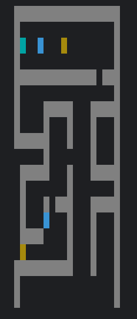

# 强网杯 2024 复现

接近一年了，拐回来看看，自己发生了什么变化

## 斯内克

贪吃蛇游戏，绑定了虚拟键盘值，但是很混乱

~~~c
__int64 sub_7FF7A0F718C0()
{
  char *v0; // rdi
  __int64 i; // rcx
  _BYTE v3[32]; // [rsp+0h] [rbp-20h] BYREF
  char v4; // [rsp+20h] [rbp+0h] BYREF
  _INPUT_RECORD Buffer; // [rsp+28h] [rbp+8h] BYREF
  DWORD NumberOfEventsRead[11]; // [rsp+54h] [rbp+34h] BYREF
  _BYTE v7[2072]; // [rsp+80h] [rbp+60h] BYREF
  HANDLE hConsoleInput; // [rsp+898h] [rbp+878h]
  int j; // [rsp+8B4h] [rbp+894h]
  int m; // [rsp+8D4h] [rbp+8B4h]
  int k; // [rsp+8F4h] [rbp+8D4h]
  int n; // [rsp+914h] [rbp+8F4h]
  int wVirtualKeyCode; // [rsp+CE4h] [rbp+CC4h]

  v0 = &v4;
  for ( i = 582LL; i; --i )
  {
    *(_DWORD *)v0 = -858993460;
    v0 += 4;
  }
  hConsoleInput = GetStdHandle(0xFFFFFFF6);
  if ( PeekConsoleInputW(hConsoleInput, &Buffer, 1u, NumberOfEventsRead) )
  {
    if ( NumberOfEventsRead[0] )
    {
      ReadConsoleInputW(hConsoleInput, &Buffer, 1u, NumberOfEventsRead);
      if ( Buffer.Event.KeyEvent.wVirtualKeyCode != last_move )
      {
        wVirtualKeyCode = Buffer.Event.KeyEvent.wVirtualKeyCode;
        if ( Buffer.Event.KeyEvent.wVirtualKeyCode == 0x25 )// 下
        {
          ++step;
          last_move = 37;
          dword_7FF7A0F7F490 = 3;
          for ( j = 0; j < 1152; ++j )
            *((_BYTE *)lpAddress + j) = ((int)*((unsigned __int8 *)lpAddress + j) >> 5) | (8 * *((_BYTE *)lpAddress + j));
        }
        else
        {
          switch ( wVirtualKeyCode )
          {
            case 0x26:                          // 左
              ++step;
              dword_7FF7A0F7F490 = 0;
              last_move = 38;
              j_memcpy(v7, lpAddress, 0x480uLL);
              for ( k = 0; k < 1152; ++k )
                *((_BYTE *)lpAddress + k) = v7[(k + 6) % 1152];
              break;
            case 0x27:                          // 上
              ++step;
              last_move = 39;
              dword_7FF7A0F7F490 = 2;
              for ( m = 0; m < 1152; ++m )
                *((_BYTE *)lpAddress + m) -= 102;
              break;
            case 0x28:                          // 右
              ++step;
              last_move = 40;
              dword_7FF7A0F7F490 = 1;
              for ( n = 0; n < 1152; ++n )
                *((_BYTE *)lpAddress + n) += 30;
              break;
          }
        }
      }
    }
  }
  return sub_7FF7A0F71384((__int64)v3, (__int64)&unk_7FF7A0F7C1B0);
}
~~~

可以发现每次移动都会修改内存lpAddress的1152字节，此外新的方向键不按下是不会改变方向

交叉引用找到初始化地方

~~~c
__int64 sub_7FF7A0F71C70()
{
  char *v0; // rdi
  __int64 i; // rcx
  _BYTE v3[32]; // [rsp+0h] [rbp-20h] BYREF
  char v4; // [rsp+20h] [rbp+0h] BYREF
  DWORD flOldProtect[59]; // [rsp+24h] [rbp+4h] BYREF

  v0 = &v4;
  for ( i = 10LL; i; --i )
  {
    *(_DWORD *)v0 = -858993460;
    v0 += 4;
  }
  lpAddress = VirtualAlloc(0LL, 0x800uLL, 0x3000u, 4u);
  j_memcpy(lpAddress, &unk_7FF7A0F7F000, 1152uLL);
  VirtualProtect(lpAddress, 0x480uLL, 0x40u, flOldProtect);
  Block = malloc(0x18uLL);
  *((_DWORD *)Block + 2) = 2;
  *((_QWORD *)Block + 2) = malloc(8LL * *((int *)Block + 2));
  *(_DWORD *)Block = 10;
  *((_DWORD *)Block + 1) = 10;
  srand(0xDEADBEEF);
  LODWORD(tgt) = rand() % 20;
  HIDWORD(tgt) = rand() % 20;
  return sub_7FF7A0F71384((__int64)v3, (__int64)&unk_7FF7A0F7C240);
}
~~~

提取出来，此外观察到srand初始seed值固定，因此每次生成金币（目标）坐标是相同的

回到main找到check点

~~~c
__int64 sub_7FF7A0F72880()
{
  char *v0; // rdi
  __int64 i; // rcx
  _BYTE v3[32]; // [rsp+0h] [rbp-20h] BYREF
  char v4; // [rsp+20h] [rbp+0h] BYREF
  __int64 v5; // [rsp+848h] [rbp+828h]
  _BYTE Buf2[48]; // [rsp+868h] [rbp+848h] BYREF
  void *v7; // [rsp+898h] [rbp+878h]
  void *v8; // [rsp+8B8h] [rbp+898h]
  void *v10; // [rsp+8F8h] [rbp+8D8h]
  int v11; // [rsp+CC4h] [rbp+CA4h]

  v0 = &v4;
  for ( i = 574LL; i; --i )
  {
    *(_DWORD *)v0 = -858993460;
    v0 += 4;
  }
  v5 = *(_QWORD *)Block;
  v11 = dword_7FF7A0F7F490;
  if ( dword_7FF7A0F7F490 )
  {
    switch ( v11 )
    {
      case 1:
        LODWORD(v5) = v5 + 1;
        break;
      case 2:
        --HIDWORD(v5);
        break;
      case 3:
        ++HIDWORD(v5);
        break;
    }
  }
  else
  {
    LODWORD(v5) = v5 - 1;
  }
  if ( (unsigned int)v5 >= 0x14 || HIDWORD(v5) >= 0x14 )
  {
    printf("Game Over!\n");
    printf("In order to survive in the primeval forest, you have to grow in the fastest way possible.\n");
    exit(0);
  }
  if ( v5 == tgt )
  {
    ++dword_7FF7A0F7FA1C;
    ++*((_DWORD *)Block + 2);
    v7 = lpAddress;
    md5((__int64)lpAddress, 1152LL, (__int64)Buf2);	// 找关键特征确认md5
    if ( !j_memcmp(&unk_7FF7A0F7F480, Buf2, 0x10uLL) )
    {
      v8 = lpAddress;
      if ( (unsigned __int8)((__int64 (__fastcall *)(char *))lpAddress)(Str) )
      {
        printf("Game Over!\n");
        exit(1);
      }
    }
    do
    {
      LODWORD(tgt) = rand() % 20;
      HIDWORD(tgt) = rand() % 20;
    }
    while ( tgt == v5 );
  }
  else
  {
    v10 = realloc(*((void **)Block + 2), 8LL * (*((_DWORD *)Block + 2) - 1));
    if ( !v10 )
    {
      printf("Memory allocation failed.\n");
      exit(1);
    }
    *((_QWORD *)Block + 2) = v10;
  }
  *(_QWORD *)Block = v5;
  return sub_7FF7A0F71384((__int64)v3, (__int64)&unk_7FF7A0F7C010);
}
~~~

发现对lpaddress做了md5 check

这道题当时出的不太好，印象里出题人放了提示说是要求贪吃蛇尽可能少的转向，也就是说有一定的算法在里头，比如到达某个点此时方向向右，新的目标点在右上角，那么此时不应该向上而是继续向右，然后再向上

ai模拟了随机数生成，然后我们每到达一个目标就对修改后的数组做一次md5检查

~~~python
from ctypes import c_uint32
from hashlib import md5

class MsvcrtRand:
    """
    A Python class that simulates the C rand() function from the
    Microsoft Visual C++ Runtime (MSVCRT).

    The constants and algorithm are based on the well-known LCG
    used by Microsoft's C standard library.
    """

    def __init__(self, seed=1):
        """
        Initializes the random number generator.
        The default seed is 1, same as the C standard.
        """
        # The internal state of the generator. We use ctypes.c_uint32
        # to ensure the arithmetic wraps around at 2^32, just like in C.
        self.seed = c_uint32(seed)

    def srand(self, seed):
        """
        Equivalent to C's srand(). Sets a new seed.
        """
        self.seed = c_uint32(seed)

    def rand(self):
        """
        Equivalent to C's rand(). Generates the next random number.
        The number is always between 0 and 32767 (RAND_MAX on MSVCRT).
        """
        # 1. Update the internal seed using the LCG formula:
        # next_seed = (current_seed * 214013 + 2531011)
        self.seed.value = self.seed.value * 214013 + 2531011

        # 2. Generate the output value:
        # result = (next_seed / 2^16) & 0x7FFF
        # In bitwise terms, this is a right shift by 16 and then a bitwise AND.
        return (self.seed.value >> 16) & 0x7FFF

def down(v):
    for i in range(len(v)):
        v[i] = ((v[i] >> 5) | (v[i] << 3)) & 0xff
    return v

def up(v):
    for i in range(len(v)):
        v[i] -= 102
        v[i] &= 0xff
    return v

def left(v):
    return v[6:]+v[:6]

def right(v):
    for i in range(len(v)):
        v[i] += 30
        v[i] &= 0xff
    return v

# 创建一个模拟器实例
c_rand_generator = MsvcrtRand()
# 使用 srand() 播种
c_rand_generator.srand(0xDEADBEEF)

lpaddress = [0xBD, 0xBD, 0xBD, 0xBD, 0xBD, 0xBD, 0xBD, 0xBD, 0xBD, 0xBD, 0xBD, 0x38, 0x4C, 0xB0, 0x38, 0x6D, 0xEE, 0x3F, 0xC4, 0xB4, 0xB4, 0x09, 0x6A, 0xF0, 0x38, 0x2C, 0x79, 0xF6, 0x34, 0xE9, 0x89, 0x38, 0xAC, 0x7F, 0x35, 0xD4, 0xB4, 0xB4, 0x38, 0x6D, 0x77, 0xF6, 0xB6, 0x38, 0x6D, 0x78, 0xF6, 0xB6, 0x2B, 0x18, 0xB4, 0xB4, 0xB4, 0x3B, 0x81, 0x81, 0x81, 0x81, 0xEF, 0x4E, 0x38, 0x4C, 0x7D, 0xF6, 0x33, 0xD4, 0xB4, 0xB4, 0xB0, 0xE8, 0xF4, 0xB4, 0xB4, 0xB4, 0xB4, 0xB0, 0xE8, 0xF6, 0x2B, 0x27, 0xA3, 0x1D, 0x3B, 0xF4, 0xB4, 0xB4, 0xB4, 0x38, 0x4A, 0xC0, 0xB4, 0xB0, 0xF8, 0x04, 0x38, 0x89, 0xE3, 0xC3, 0xCA, 0x3B, 0xF4, 0xB4, 0xB4, 0xB4, 0x38, 0x4A, 0xC0, 0xC4, 0xB0, 0xF8, 0x04, 0x38, 0xB3, 0x67, 0xE3, 0x16, 0x3B, 0xF4, 0xB4, 0xB4, 0xB4, 0x38, 0x4A, 0xC0, 0xD4, 0xB0, 0xF8, 0x04, 0x38, 0xB6, 0xD3, 0xB6, 0xA9, 0x3B, 0xF4, 0xB4, 0xB4, 0xB4, 0x38, 0x4A, 0xC0, 0xE4, 0xB0, 0xF8, 0x04, 0x38, 0x89, 0xD8, 0xC7, 0x33, 0x3B, 0xF4, 0xB4, 0xB4, 0xB4, 0x38, 0x4A, 0xC0, 0xB4, 0x2B, 0xF4, 0xB4, 0xB4, 0xB4, 0x38, 0x4A, 0x50, 0xB4, 0x38, 0x4C, 0xED, 0xB5, 0xD4, 0xB4, 0xB4, 0x4C, 0xF4, 0xD4, 0x2C, 0xF8, 0x85, 0x37, 0x3B, 0xF4, 0xB4, 0xB4, 0xB4, 0x38, 0x4A, 0xC0, 0xC4, 0x2B, 0xF4, 0xB4, 0xB4, 0xB4, 0x38, 0x4A, 0x50, 0xC4, 0x38, 0x4C, 0xED, 0xB5, 0xD4, 0xB4, 0xB4, 0x4C, 0xF4, 0xD4, 0x2C, 0xF8, 0x85, 0x37, 0x3B, 0xF4, 0xB4, 0xB4, 0xB4, 0x38, 0x4A, 0xC0, 0xD4, 0x2B, 0xF4, 0xB4, 0xB4, 0xB4, 0x38, 0x4A, 0x50, 0xD4, 0x38, 0x4C, 0xED, 0xB5, 0xD4, 0xB4, 0xB4, 0x4C, 0xF4, 0xD4, 0x2C, 0xF8, 0x85, 0x37, 0x3B, 0xF4, 0xB4, 0xB4, 0xB4, 0x38, 0x4A, 0xC0, 0xE4, 0x2B, 0xF4, 0xB4, 0xB4, 0xB4, 0x38, 0x4A, 0x50, 0xE4, 0x38, 0x4C, 0xED, 0xB5, 0xD4, 0xB4, 0xB4, 0x4C, 0xF4, 0xD4, 0x2C, 0xF8, 0x85, 0x37, 0xB0, 0xEC, 0xFE, 0xB4, 0xB4, 0xB4, 0xB4, 0xB4, 0xB4, 0xB4, 0x6F, 0x14, 0x4C, 0xEC, 0xFE, 0xB4, 0xB4, 0xB4, 0x2F, 0xC0, 0x2C, 0xEC, 0xFE, 0xB4, 0xB4, 0xB4, 0xCC, 0x6C, 0xFE, 0xB4, 0xB4, 0xB4, 0xB6, 0x24, 0xCC, 0x72, 0xB4, 0xB4, 0xB4, 0x3B, 0xF4, 0xB4, 0xB4, 0xB4, 0x38, 0x4A, 0xC0, 0xB4, 0x2B, 0xF4, 0xB4, 0xB4, 0xB4, 0x38, 0x4A, 0x50, 0xC4, 0x4C, 0x79, 0x85, 0x37, 0xD0, 0xD2, 0xF4, 0x5B, 0xF4, 0xB4, 0xB4, 0xB4, 0x38, 0x4A, 0xE1, 0xC4, 0x4C, 0xF9, 0x05, 0x37, 0xD0, 0x62, 0x04, 0xE3, 0x60, 0x5B, 0xF4, 0xB4, 0xB4, 0xB4, 0x38, 0x4A, 0xE1, 0xC4, 0xE4, 0x79, 0x05, 0x37, 0x4C, 0xE9, 0xF4, 0xCC, 0xE2, 0xE4, 0x4C, 0xE1, 0x4C, 0xF9, 0xED, 0x38, 0xF8, 0x4C, 0xE8, 0xF4, 0xF8, 0xE4, 0xE0, 0xA8, 0x4C, 0xC1, 0xE3, 0x60, 0xE4, 0x79, 0x04, 0x37, 0x4C, 0xD0, 0x2B, 0xF4, 0xB4, 0xB4, 0xB4, 0x38, 0x4A, 0x50, 0xB4, 0x2C, 0xF8, 0x85, 0x37, 0x4C, 0xE8, 0xF6, 0x4C, 0x69, 0xF4, 0xE4, 0x40, 0x4C, 0xD0, 0x2C, 0xE8, 0xF4, 0x3B, 0xF4, 0xB4, 0xB4, 0xB4, 0x38, 0x4A, 0xC0, 0xC4, 0x2B, 0xF4, 0xB4, 0xB4, 0xB4, 0x38, 0x4A, 0x50, 0xB4, 0x4C, 0x79, 0x85, 0x37, 0xD0, 0xD2, 0xF4, 0x5B, 0xF4, 0xB4, 0xB4, 0xB4, 0x38, 0x4A, 0xE1, 0xB4, 0x4C, 0xF9, 0x05, 0x37, 0xD0, 0x62, 0x04, 0xE3, 0x60, 0x5B, 0xF4, 0xB4, 0xB4, 0xB4, 0x38, 0x4A, 0xE1, 0xB4, 0xE4, 0x79, 0x05, 0x37, 0x4C, 0xE9, 0xF4, 0xD0, 0x62, 0x64, 0xCC, 0xE2, 0xE4, 0x4C, 0xE1, 0x4C, 0xF9, 0xED, 0x38, 0xF8, 0x4C, 0xE8, 0xF4, 0xF8, 0xE4, 0xE0, 0xA8, 0x4C, 0xC1, 0xE3, 0x60, 0xE4, 0x79, 0x04, 0x37, 0x4C, 0xD0, 0x2B, 0xF4, 0xB4, 0xB4, 0xB4, 0x38, 0x4A, 0x50, 0xC4, 0x2C, 0xF8, 0x85, 0x37, 0x52, 0x54, 0x2F, 0x2F, 0x2F, 0xB0, 0xEC, 0x00, 0xB4, 0xB4, 0xB4, 0xB4, 0xB4, 0xB4, 0xB4, 0x6F, 0x14, 0x4C, 0xEC, 0x00, 0xB4, 0xB4, 0xB4, 0x2F, 0xC0, 0x2C, 0xEC, 0x00, 0xB4, 0xB4, 0xB4, 0xCC, 0x6C, 0x00, 0xB4, 0xB4, 0xB4, 0xB6, 0x24, 0xCC, 0x72, 0xB4, 0xB4, 0xB4, 0x3B, 0xF4, 0xB4, 0xB4, 0xB4, 0x38, 0x4A, 0xC0, 0xD4, 0x2B, 0xF4, 0xB4, 0xB4, 0xB4, 0x38, 0x4A, 0x50, 0xE4, 0x4C, 0x79, 0x85, 0x37, 0xD0, 0xD2, 0xF4, 0x5B, 0xF4, 0xB4, 0xB4, 0xB4, 0x38, 0x4A, 0xE1, 0xE4, 0x4C, 0xF9, 0x05, 0x37, 0xD0, 0x62, 0x04, 0xE3, 0x60, 0x5B, 0xF4, 0xB4, 0xB4, 0xB4, 0x38, 0x4A, 0xE1, 0xE4, 0xE4, 0x79, 0x05, 0x37, 0x4C, 0xE9, 0xF4, 0xCC, 0xE2, 0xE4, 0x4C, 0xE1, 0x4C, 0xF9, 0xED, 0x38, 0xF8, 0x4C, 0xE8, 0xF4, 0xF8, 0xE4, 0xE0, 0xA8, 0x4C, 0xC1, 0xE3, 0x60, 0xE4, 0x79, 0x04, 0x37, 0x4C, 0xD0, 0x2B, 0xF4, 0xB4, 0xB4, 0xB4, 0x38, 0x4A, 0x50, 0xD4, 0x2C, 0xF8, 0x85, 0x37, 0x4C, 0xE8, 0xF6, 0x4C, 0x69, 0xF4, 0xE4, 0x40, 0x4C, 0xD0, 0x2C, 0xE8, 0xF4, 0x3B, 0xF4, 0xB4, 0xB4, 0xB4, 0x38, 0x4A, 0xC0, 0xE4, 0x2B, 0xF4, 0xB4, 0xB4, 0xB4, 0x38, 0x4A, 0x50, 0xD4, 0x4C, 0x79, 0x85, 0x37, 0xD0, 0xD2, 0xF4, 0x5B, 0xF4, 0xB4, 0xB4, 0xB4, 0x38, 0x4A, 0xE1, 0xD4, 0x4C, 0xF9, 0x05, 0x37, 0xD0, 0x62, 0x04, 0xE3, 0x60, 0x5B, 0xF4, 0xB4, 0xB4, 0xB4, 0x38, 0x4A, 0xE1, 0xD4, 0xE4, 0x79, 0x05, 0x37, 0x4C, 0xE9, 0xF4, 0xD0, 0x62, 0x64, 0xCC, 0xE2, 0xE4, 0x4C, 0xE1, 0x4C, 0xF9, 0xED, 0x38, 0xF8, 0x4C, 0xE8, 0xF4, 0xF8, 0xE4, 0xE0, 0xA8, 0x4C, 0xC1, 0xE3, 0x60, 0xE4, 0x79, 0x04, 0x37, 0x4C, 0xD0, 0x2B, 0xF4, 0xB4, 0xB4, 0xB4, 0x38, 0x4A, 0x50, 0xE4, 0x2C, 0xF8, 0x85, 0x37, 0x52, 0x54, 0x2F, 0x2F, 0x2F, 0x3B, 0xF4, 0xB4, 0xB4, 0xB4, 0x38, 0x4A, 0xC0, 0xB4, 0x2B, 0xF4, 0xB4, 0xB4, 0xB4, 0x38, 0x4A, 0x50, 0xD4, 0x4C, 0x79, 0x85, 0x37, 0x4C, 0xF8, 0x04, 0x37, 0xE3, 0xD0, 0x2B, 0xF4, 0xB4, 0xB4, 0xB4, 0x38, 0x4A, 0x50, 0xB4, 0x2C, 0xF8, 0x85, 0x37, 0x3B, 0xF4, 0xB4, 0xB4, 0xB4, 0x38, 0x4A, 0xC0, 0xC4, 0x2B, 0xF4, 0xB4, 0xB4, 0xB4, 0x38, 0x4A, 0x50, 0xE4, 0x4C, 0x79, 0x85, 0x37, 0x4C, 0xF8, 0x04, 0x37, 0xE3, 0xD0, 0x2B, 0xF4, 0xB4, 0xB4, 0xB4, 0x38, 0x4A, 0x50, 0xC4, 0x2C, 0xF8, 0x85, 0x37, 0x3B, 0xF4, 0xB4, 0xB4, 0xB4, 0x38, 0x4A, 0xC0, 0xE4, 0x2B, 0xF4, 0xB4, 0xB4, 0xB4, 0x38, 0x4A, 0x50, 0xB4, 0x4C, 0x79, 0x85, 0x37, 0x4C, 0xF8, 0x04, 0x37, 0xE3, 0xD0, 0x2B, 0xF4, 0xB4, 0xB4, 0xB4, 0x38, 0x4A, 0x50, 0xE4, 0x2C, 0xF8, 0x85, 0x37, 0x3B, 0xF4, 0xB4, 0xB4, 0xB4, 0x38, 0x4A, 0xC0, 0xC4, 0x2B, 0xF4, 0xB4, 0xB4, 0xB4, 0x38, 0x4A, 0x50, 0xD4, 0x4C, 0x79, 0x85, 0x37, 0x4C, 0xF8, 0x04, 0x37, 0xE3, 0xD0, 0x2B, 0xF4, 0xB4, 0xB4, 0xB4, 0x38, 0x4A, 0x50, 0xD4, 0x2C, 0xF8, 0x85, 0x37, 0xA0, 0xEC, 0x42, 0xB4, 0xB4, 0xB4, 0x3D, 0xA0, 0xEC, 0x52, 0xB4, 0xB4, 0xB4, 0xBE, 0xA0, 0xEC, 0x62, 0xB4, 0xB4, 0xB4, 0x51, 0xA0, 0xEC, 0x6F, 0xB4, 0xB4, 0xB4, 0x3D, 0xA0, 0xEC, 0x7F, 0xB4, 0xB4, 0xB4, 0x5B, 0xA0, 0xEC, 0x12, 0xB4, 0xB4, 0xB4, 0x8D, 0xA0, 0xEC, 0x22, 0xB4, 0xB4, 0xB4, 0x65, 0xA0, 0xEC, 0x32, 0xB4, 0xB4, 0xB4, 0xA7, 0xA0, 0xEC, 0xBF, 0xB4, 0xB4, 0xB4, 0x4D, 0xA0, 0xEC, 0xCF, 0xB4, 0xB4, 0xB4, 0xAC, 0xA0, 0xEC, 0xDF, 0xB4, 0xB4, 0xB4, 0xF8, 0xA0, 0xEC, 0xEF, 0xB4, 0xB4, 0xB4, 0x06, 0xA0, 0xEC, 0xFF, 0xB4, 0xB4, 0xB4, 0xE9, 0xA0, 0xEC, 0x8F, 0xB4, 0xB4, 0xB4, 0x3B, 0xA0, 0xEC, 0x9F, 0xB4, 0xB4, 0xB4, 0xA3, 0xA0, 0xEC, 0xAF, 0xB4, 0xB4, 0xB4, 0x31, 0xB0, 0xEC, 0xF5, 0xC4, 0xB4, 0xB4, 0xB4, 0xB4, 0xB4, 0xB4, 0x6F, 0x14, 0x4C, 0xEC, 0xF5, 0xC4, 0xB4, 0xB4, 0x2F, 0xC0, 0x2C, 0xEC, 0xF5, 0xC4, 0xB4, 0xB4, 0xCC, 0x6C, 0xF5, 0xC4, 0xB4, 0xB4, 0xB5, 0x68, 0xE6, 0x38, 0xCA, 0xEC, 0xF5, 0xC4, 0xB4, 0xB4, 0x24, 0x1B, 0xF8, 0x04, 0x37, 0x38, 0xCA, 0x6D, 0xF5, 0xC4, 0xB4, 0xB4, 0x24, 0x1B, 0x7D, 0x85, 0x42, 0xB4, 0xB4, 0xB4, 0x63, 0xD0, 0xF7, 0xF4, 0xD3, 0xC0, 0x6F, 0xF4, 0x6F, 0x00, 0xBB, 0xC4, 0x38, 0x4C, 0x3F, 0xBD, 0xBD, 0xBD, 0xBD, 0xBD]
print(len(lpaddress))
start = [10, 10]
tgt = [c_rand_generator.rand()%20, c_rand_generator.rand()%20][::-1]
# 上下左右 -1 1 -2 2
direction = 2
path = ""
while True:
    new_direction = [0, 0]
    row = tgt[0] - start[0]
    col = tgt[1] - start[1]
    print(f"{start}-->{tgt}")
    # print(f"下*{row}" if row > 0 else f"上*{-row}")
    # print(f"右*{col}" if col > 0 else f"左*{-col}")
    if direction == 2:     # 上一次向右
        if row > 0:
            lpaddress = down(lpaddress)
            direction = 1
            path += "S"
        elif row < 0:
            lpaddress = up(lpaddress)
            direction = -1
            path += "W"
        if col < 0:
            lpaddress = left(lpaddress)
            direction = -2
            path += "A"
    elif direction == -2:   # 上一次向左
        if row > 0:
            lpaddress = down(lpaddress)
            direction = 1
            path += "S"
        elif row < 0:
            lpaddress = up(lpaddress)
            direction = -1
            path += "W"
        if col > 0:
            lpaddress = right(lpaddress)
            direction = 2
            path += "D"
    elif direction == 1:   # 上一次向下
        if col > 0:
            lpaddress = right(lpaddress)
            direction = 2
            path += "D"
        elif col < 0:
            lpaddress = left(lpaddress)
            direction = -2
            path += "A"
        if row < 0:
            lpaddress = up(lpaddress)
            direction = -1
            path += "W"
    elif direction == -1:   # 上一次向上
        if col > 0:
            lpaddress = right(lpaddress)
            direction = 2
            path += "D"
        elif col < 0:
            lpaddress = left(lpaddress)
            direction = -2
            path += "A"
        if row > 0:
            lpaddress = down(lpaddress)
            direction = 1
            path += "S"
    print(path)
    if md5(bytes(lpaddress)).hexdigest().upper() == "9C06C08F882D7981E91D663364CE5E2E":
        with open("func", "wb") as f:
            f.write(bytes(lpaddress))
        break
    start = tgt
    while tgt == start:
        tgt = [c_rand_generator.rand()%20, c_rand_generator.rand()%20][::-1]
~~~

最终正确的字节数组写入func，ida检查发现就是个xtea

~~~python
from ctypes import c_uint32

def xtea_decrypt(r, v, key, id):
    v0, v1 = c_uint32(v[0]), c_uint32(v[1])
    delta = 0x9E3779B9
    total = c_uint32(delta * r * (id+2)//2)
    for i in range(r):
        v1.value -= (((v0.value << 4) ^ (v0.value >> 5)) + v0.value) ^ (total.value + key[(total.value >> 11) & 3])
        total.value -= delta
        v0.value -= (((v1.value << 4) ^ (v1.value >> 5)) + v1.value) ^ (total.value + key[total.value & 3])
    return v0.value, v1.value

k = b"W31c0m3. 2 QWBs8"
k = [int.from_bytes(k[i:i+4], byteorder="little") for i in range(0, 16, 4)]
v = [i&0xff for i in [-104, -96, -39, -104, -70, -105, 27, 113, -101, -127, 68, 47, 85, -72, 55, -33]]
v = [int.from_bytes(bytes(v[i:i+4]), byteorder="little") for i in range(0, len(v), 4)]
v[2] ^= v[1]
v[3] ^= v[0]
v[1] ^= v[3]
v[0] ^= v[2]
for i in range(0, len(v), 2):
    v[i:i+2] = xtea_decrypt(32, v[i:i+2], k, i)
v = "".join([int.to_bytes(v[i], byteorder='little', length=4).decode() for i in range(len(v))])
print(v)
~~~

## mips

> Someone has found the mips binary, along with an emulator to execute it. What can you find in them?
>
> USAGE
>
> ./emu ./mips_bin

很明显emu是模拟器，后面是mips编写的代码

~~~c
int __fastcall ftext(int argc, const char **argv, const char **envp)
{
  int *v3; // $v0
  int *v4; // $s0
  _BYTE *v5; // $a0
  int i; // $v1
  char v7; // $a1
  int v8; // $s2
  int v9; // $s0
  int *v11; // $v0
  int *v12; // $v1
  int v13; // $a2
  int v14; // $a1
  int v15; // $a0
  int v16; // $v1
  int v17; // $v0
  int v18; // $v1
  int v19; // $v0
  _DWORD v20[8]; // [sp+20h] [-38h] BYREF
  _DWORD v21[6]; // [sp+40h] [-18h] BYREF

  qmemcpy(v21, "sxrujtv`labiVzbp`vpg|", 21);
  memset(v20, 0, sizeof(v20));
  v3 = (int *)mmap((void *)0x23000, 0x1000u, 7, 2050, -1, 0);
  v4 = 0;
  if ( v3 != (int *)-1 )
    v4 = v3;
  v5 = &opcodes;
  for ( i = 0; i != 96; ++i )
  {
    v7 = i & 3 ^ *v5;
    *v5++ = v7;
  }
  v8 = fork();
  if ( v8 )
  {
    do
    {
      v9 = waitpid(v8, 0, 1);
      sleep(1);
    }
    while ( !v9 );
  }
  else
  {
    v11 = (int *)&opcodes;
    v12 = v4;
    do
    {
      v13 = v11[1];
      v14 = v11[2];
      v15 = v11[3];
      *v12 = *v11;
      v12[1] = v13;
      v12[2] = v14;
      v12[3] = v15;
      v11 += 4;
      v12[3] = v15;
      v12 += 4;
    }
    while ( v11 != &stdio_user_locking );
    v16 = v21[1];
    v4[512] = v21[0];
    v4[513] = v16;
    v17 = v21[2];
    v4[513] = v16;
    v4[514] = v17;
    v18 = v21[3];
    v4[514] = v17;
    v4[515] = v18;
    v19 = v21[4];
    v4[515] = v18;
    v4[516] = v19;
    *((_BYTE *)v4 + 2068) = HIBYTE(v21[5]);
    puts("input your flag, be fast:");
    read(0, v20, 32);
    if ( strlen(v20) != 22 )
      write(1, &unk_40EE5C, 4);
    if ( ((int (__fastcall *)(_DWORD *))v4)(v20) )
      write(1, "wrong\n", 7);
    else
      write(1, "right\n", 7);
  }
  return 0;
}
~~~

直接实现逻辑提取opcode

~~~python
s = [0x00, 0x81, 0x42, 0x26, 0x3C, 0x08, 0x02, 0x01, 0x35, 0x28, 0x3A, 0x03, 0x24, 0x0B, 0x02, 0x16, 0x24, 0x0A, 0x02, 0x03, 0x11, 0x61, 0x02, 0x05, 0x00, 0x01, 0x02, 0x03, 0x21, 0x28, 0x02, 0x02, 0x21, 0x09, 0x02, 0x02, 0x21, 0x4B, 0xFD, 0xFC, 0x11, 0x41, 0x02, 0x09, 0x00, 0x01, 0x02, 0x03, 0x01, 0x8D, 0x62, 0x25, 0x01, 0xAC, 0x6A, 0x25, 0x81, 0x2D, 0x02, 0x03, 0x81, 0x0C, 0x02, 0x03, 0x01, 0x8B, 0x62, 0x25, 0x01, 0xAD, 0x6A, 0x25, 0x11, 0xA1, 0xFD, 0xF7, 0x00, 0x01, 0x02, 0x03, 0x24, 0x0A, 0x02, 0x02, 0x01, 0x61, 0x12, 0x26, 0x03, 0xE1, 0x02, 0x0B, 0x00, 0x01, 0x02, 0x03]
for i in range(96):
    s[i] = i & 3 ^ s[i]

s += [0]*(2068-96)
cmp = b"sxrujtv`labiVzbp`vpg|"
s[512*4:512*4+21] = list(cmp)
with open("func", "wb") as f:
    f.write(bytes(s))
~~~

ida mips大端打开

~~~c
__int64 __fastcall sub_0(char *a1)
{
  __int64 v2; // $a5
  __int64 v3; // $a6
  __int64 v4; // $a7

  v2 = 145408LL;
  v3 = 21LL;
  v4 = 0LL;
  while ( !(*a1 ^ *(char *)v2 ^ (unsigned __int64)v3) )
  {
    v2 = (int)v2 + 1;
    a1 = (char *)((int)a1 + 1);
    v3 = (int)v3 - 1;
    if ( !v3 )
      return v4;
  }
  return 1LL;
}
~~~

实现逻辑

~~~python
cmp = b"sxrujtv`labiVzbp`vpg|"
v = 0x15
for i in range(len(cmp)):
    print(chr(v^cmp[i]), end="")
    v -= 1
~~~

得到`flag{dynamic_reverse}`，很明显假的flag

能分析的地方只有emu了，非常可疑，结合fake flag提示我们打开动态调试，看到底哪里开始出现mips相关东西

调试发现最后一个函数是mips解析器，打印了input your flag等

但是还是没法定位，尝试编译qemu-6.2也失败，没法对比

最终找到方法：搜索0x23000成功定位一处有花指令的地方

去除花指令后得到函数如下

~~~c
__int64 __fastcall sub_7FFFF76FF8E4(__int64 a1)
{
  __int64 result; // rax
  int v2; // [rsp+10h] [rbp-20h]
  int i; // [rsp+14h] [rbp-1Ch]
  int j; // [rsp+18h] [rbp-18h]
  __int64 v5; // [rsp+20h] [rbp-10h]
  __int64 v6; // [rsp+28h] [rbp-8h]

  v5 = *(_QWORD *)(a1 + 528);
  v2 = 0;
  result = *(unsigned int *)(v5 + 128);
  if ( *(_DWORD *)(v5 + 128) == 143360 )
  {
    result = (unsigned int)dword_7FFFF7FF4318;
    if ( dword_7FFFF7FF4318 )
    {
      v6 = sub_7FFFF76FF48E((__int64)&unk_7FFFF7FF5280);
      for ( i = 0; i <= 21; ++i )
        *(_BYTE *)(i + v6) ^= dword_7FFFF7FF4324;
      swap(v6, 7, 11);
      result = swap(v6, 12, 16);
      for ( j = 0; j <= 21; ++j )
      {
        result = cmp[j];
        if ( *(unsigned __int8 *)(j + v6) != (_DWORD)result )
        {
          v2 = 1;
          break;
        }
      }
      if ( !v2 && j == 22 )
        dword_7FFFF7FF431C = 1;
    }
  }
  return result;
}
~~~

交叉引用unk数组发现检查了flag头

开始写rc4解密，由于不知道异或的dword值，所以爆破

~~~python
def KSA(key):
    """ Key-Scheduling Algorithm (KSA) 密钥调度算法"""
    S = list(range(256))
    j = 0
    for i in range(256):
        j = (j + S[i] + key[i%len(key)]) % 256
        S[i], S[j] = S[j], S[i]
    return S

def PRGA(S):
    """ Pseudo-Random Generation Algorithm (PRGA) 伪随机数生成算法"""
    i, j = 0, 0
    while True:
        i = (i + 1) % 256
        j = (j + S[i]) % 256
        S[i], S[j] = S[j], S[i]
        K = S[(S[i] + S[j]) % 256]
        yield K

def rol(v, b):
    return ((v << b) | (v >> (8-b))) & 0xff

def RC4(key, text):
    """ RC4 encryption/decryption """
    S = KSA(key)
    keystream = PRGA(S)
    flag = ""
    for i in range(len(text)):
        char = text[i]
        xor = [0xDE, 0xAD, 0xBE, 0xEF]
        rc4_xor = next(keystream)
        for j in range(32, 127):
            v3 = ((rol(j, 7) << 6) ^ 0xC0 | (rol(j, 7) >> 2) ^ 0x3B) ^ 0xBE
            v3 &= 0xff
            tmp = rc4_xor ^ xor[i&3] ^ rol(rol(rol(v3, 5) ^ 0xAD, 4) ^ 0xDE, 3)
            if tmp == char:
                flag += chr(j)
                break
        if j == 127:
            return
    return flag

for j in range(256):
    cmp = [0x000000C4, 0x000000EE, 0x0000003C, 0x000000BB, 0x000000E7, 0x000000FD, 0x00000067, 0x0000001D, 0x000000F8, 0x00000097, 0x00000068, 0x0000009D, 0x0000000B, 0x0000007F, 0x000000C7, 0x00000080, 0x000000DF, 0x000000F9, 0x0000004B, 0x000000A0, 0x00000046, 0x00000091]
    cmp[12], cmp[16] = cmp[16], cmp[12]
    cmp[7], cmp[11] = cmp[11], cmp[7]
    for i in range(len(cmp)):
        cmp[i] ^= j
    key = b"6105t3"
    flag = RC4(key, cmp)
    if flag:
        print(f"{j}: {RC4(key, cmp)}")
~~~

找到flag

## solve2-apk

参考了，做起来真的好麻烦

* https://aar0n3906.github.io/2024/11/28/%E5%BC%BA%E7%BD%91%E6%9D%AF2024%E9%83%A8%E5%88%86re/
* https://blog.hxzzz.asia/archives/311/

java层混淆，不管，直接jeb搜failure字符串，找到如下代码

~~~java
package U0;

import Q.d;
import W.c;
import W0.j;
import androidx.compose.ui.platform.Q0;
import b0.n;
import com.a.myapplication.MainActivity;
import d0.E;
import d0.H;
import d0.K;
import d0.o;
import g1.a;
import h1.h;
import h1.i;
import java.util.Arrays;
import l.p;
import o.l;
import q1.w;
import v.d0;
import w0.k;
import x.T;
import z.g;

public final class f extends i implements a {
    public final int f;
    public final Object g;
    public final Object h;
    public final Object i;

    public f(Object object0, Object object1, Object object2, int v) {
        this.f = v;
        this.g = object0;
        this.h = object1;
        this.i = object2;
        super(0);
    }

    public f(l l0, n n0, a a0) {
        this.f = 3;
        this.g = l0;
        this.h = n0;
        this.i = (i)a0;
        super(0);
    }

    @Override  // g1.a
    public final Object d() {
        Object[] arr_object3;
        H h1;
        H h0;
        boolean z;
        switch(this.f) {
            case 0: {
                goto label_10;
            }
            case 1: {
                ((androidx.compose.ui.platform.a)this.g).removeOnAttachStateChangeListener(((Q0)this.h));
                h.e(((d)this.i), "listener");
                c.B(((androidx.compose.ui.platform.a)this.g)).a.remove(((d)this.i));
                return j.a;
            }
            case 2: {
                goto label_178;
            }
        }

        l l0 = (l)this.g;
        O.d d0 = l.u0(l0, ((n)this.h), ((a)(((i)this.i))));
        if(d0 != null) {
            p p0 = l0.t;
            if(!k.a(p0.A, 0L)) {
                long v = p0.x0(d0, p0.A);
                return d0.f(c.a(-O.c.d(v), -O.c.e(v)));
            }

            throw new IllegalStateException("Expected BringIntoViewRequester to not be used before parents are placed.");
        }

        return null;
    label_10:
        new MainActivity();
        String s = (String)((T)this.h).getValue();
        h.e(s, "s");
        byte[] arr_b = new byte[0];
        int[] arr_v = new int[0];
        int[] arr_v1 = new int[0];
        int v1 = 0;
        int v2 = 0;
        int v3 = 0;
        int v4 = 0;
        int v5 = 0;
        int v6 = 0;
        long v7 = 0x5BE935D0EDBFE83CL;
        int v8 = 24;
        while(Long.compare(v7, 0L) != 0) {
            long v9 = 0x404C98D80D628D27L;
            if(Long.compare(v7, 0x404C98D80D628D27L) == 0) {
                arr_v1[v1] = 0;
                v7 = 0x767AEC22C91BE2BFL;
            }

            long v10 = 8904566903685903062L;
            if(Long.compare(v7, 8904566903685903062L) == 0) {
                v7 = 0x29CB0C5AA5BA5210L;
            }

            long v11 = 0x7F6F5B8E28C072CFL;
            if(Long.compare(v7, 0x7F6F5B8E28C072CFL) == 0) {
                v2 -= 1640531527;
                v7 = 0x1E7D57CBFEE24485L;
            }

            long v12 = 0x123CFD69BDE0364DL;
            if(Long.compare(v7, 0x123CFD69BDE0364DL) == 0) {
                ++v3;
                v7 = 0x3C57CEFFB4FFAFF4L;
            }

            long v13 = 2705319197673083720L;
            if(Long.compare(v7, 2705319197673083720L) == 0) {
                v7 = v8 == 0 ? 0x250D59D18CBA666DL : 0x7032C3F4B5EFAB31L;
            }

            long v14 = 0x41593FC8BF139758L;
            if(Long.compare(v7, 0x41593FC8BF139758L) == 0) {
                v7 = 0x69E4449C056151ACL;
                v8 = 24;
            }

            if(Long.compare(v7, 0x1F45282B0E978C91L) == 0) {
                v7 = 0x380BE8BE1044EE6DL;
            }

            long v15 = 0x2CEBD4941DD371AAL;
            if(Long.compare(v7, 0x29CB0C5AA5BA5210L) == 0) {
                v3 = 0;
                v7 = 0x2CEBD4941DD371AAL;
            }

            if(Long.compare(v7, 0x5260B3C741DB1316L) == 0) {
                v7 = 0x39E2DF14B65FB5B7L;
            }

            if(v7 == 0x380BE8BE1044EE6DL) {
                arr_v1[v1] |= (arr_b[v3] & 0xFF) << v8;
            }
            else {
                v13 = v7;
            }

            if(Long.compare(v13, 0x2CEBD4941DD371AAL) == 0) {
                v13 = v3 >= 8 ? 0x2A7EB92B8AF86758L : 2503205216640455778L;
            }

            long v16 = 0x55CB210B059B852DL;
            long v17 = 0x5335127A3A0A4907L;
            if(Long.compare(v13, 0x55CB210B059B852DL) == 0) {
                v8 += -8;
                v13 = 0x5335127A3A0A4907L;
            }

            long v18 = 2368350050472760653L;
            if(Long.compare(v13, 2368350050472760653L) == 0) {
                v13 = 0x5A88D049059402F6L;
            }

            long v19 = 0x26D3DBBBECB952A4L;
            if(v13 == 0x26D3DBBBECB952A4L) {
                break;
            }

            if(v13 != 0x7032C3F4B5EFAB31L) {
                v16 = v13;
            }

            if(v16 == 0x5335127A3A0A4907L) {
                ++v3;
                v16 = 0x767AEC22C91BE2BFL;
            }

            if(v16 == 0x69E4449C056151ACL) {
                ++v1;
            }
            else {
                v17 = v16;
            }

            long v20 = 0x169A506C8792840DL;
            if(v17 == 0x169A506C8792840DL) {
                v3 += 2;
            }
            else {
                v15 = v17;
            }

            long v21 = 8829928630187910250L;
            if(v15 != 8829928630187910250L) {
                v11 = v15;
            }

            if(Long.compare(v11, 0x1E7D57CBFEE24485L) == 0) {
                v4 = (v5 << 4 ^ v5) + (v2 ^ v5 >>> 5) + v4;
                v11 = 0x50E57F91E168FAC9L;
            }

            long v22 = 8153458827322010710L;
            long v23 = 0x2654EF16F510CF25L;
            if(Long.compare(v11, 8153458827322010710L) == 0) {
                v2 = 0;
                v11 = 0x2654EF16F510CF25L;
            }

            long v24 = 0x2981462384F2153CL;
            if(Long.compare(v11, 0x2981462384F2153CL) == 0) {
                arr_v = new int[]{0x5E5440B0, 2057046228, 0x4A1ED228, 0x233FE7C, 0x96461450, -2002358035, 0xF79BFC89, 0x20C3D75F};
                v11 = 0x62E816E54253B307L;
            }

            if(Long.compare(v11, 0x33C51F874ED9F174L) == 0) {
                v6 = 0x20;
                v11 = 0x4D784B3DF54B096FL;
            }

            if(v11 != 0x767AEC22C91BE2BFL) {
                v10 = v11;
            }
            else if(v3 < 0x20) {
                v10 = 0x1F45282B0E978C91L;
            }

            if(v10 == 0x2A7EB92B8AF86758L) {
                v3 = 0;
                v10 = 0x3C57CEFFB4FFAFF4L;
            }

            if(Long.compare(v10, 0x2654EF16F510CF25L) != 0) {
                v21 = v10;
            }
            else if(v6 > 0) {
                --v6;
            }
            else {
                --v6;
                v21 = 0x1E65F68B123E6E17L;
            }

            if(Long.compare(v21, 0x5BE935D0EDBFE83CL) == 0) {
                v21 = s.length() >= 0x20 ? 0x1E47617FF0CE8BE3L : 0x7C99975CB23FC36BL;
            }

            if(v21 == 0x1E47617FF0CE8BE3L) {
                arr_b = Arrays.copyOf(s.getBytes(), 0x20);
            }
            else {
                v24 = v21;
            }

            if(Long.compare(v24, 0x1E65F68B123E6E17L) == 0) {
                arr_v1[v3] = v4;
                v24 = 0x6F35E9E1070E87BEL;
            }

            if(Long.compare(v24, 0x3C57CEFFB4FFAFF4L) != 0) {
                v18 = v24;
            }
            else if(v3 >= 8) {
                v18 = 0x752D25A60BA93D48L;
            }

            if(v18 == 0x752D25A60BA93D48L) {
                z = H0.a.successWithString(s);
                goto label_171;
            }

            if(v18 != 0x250D59D18CBA666DL) {
                v14 = v18;
            }

            if(v14 == 0x62E816E54253B307L) {
                arr_v1 = new int[8];
            }
            else {
                v9 = v14;
            }

            if(v9 != 0x5A88D049059402F6L) {
                v12 = v9;
            }
            else if(arr_v1[v3] != arr_v[v3]) {
                v12 = 0x5260B3C741DB1316L;
            }

            if(v12 != 0x7C99975CB23FC36BL) {
                v19 = v12;
            }

            if(v19 == 2503205216640455778L) {
                v19 = 0x33C51F874ED9F174L;
            }

            if(v19 == 0x6F35E9E1070E87BEL) {
                arr_v1[v3 + 1] = v5;
            }
            else {
                v20 = v19;
            }

            v7 = 0x491A503216BAC9F4L;
            if(v20 == 0x491A503216BAC9F4L) {
                v5 = arr_v1[v3 + 1];
            }
            else {
                v22 = v20;
            }

            if(v22 == 0x50E57F91E168FAC9L) {
                v5 = (v4 << 4 ^ v4) + (v4 >>> 5 ^ v2) + v5;
            }
            else {
                v23 = v22;
            }

            if(v23 == 0x39E2DF14B65FB5B7L) {
                break;
            }

            if(v23 == 0x4D784B3DF54B096FL) {
                v4 = arr_v1[v3];
            }
            else {
                v7 = v23;
            }
        }

        z = false;
    label_171:
        e e0 = new e(((d0)this.i), (z ? "success" : "failure"), null);
        w.o(((v1.d)this.g), null, 0, e0, 3);
        return j.a;
    label_178:
        E e1 = (E)this.g;
        int v25 = 0;
        e1.A.i = 0;
        g g0 = e1.A.a.p();
        int v26 = g0.g;
        if(v26 > 0) {
            Object[] arr_object = g0.e;
            int v27 = 0;
            do {
            label_186:
                E e2 = ((androidx.compose.ui.node.a)arr_object[v27]).A.o;
                h.b(e2);
                e2.k = e2.l;
                e2.l = 0x7FFFFFFF;
                if(e2.m == 2) {
                    e2.m = 3;
                }

                ++v27;
                if(v27 < v26) {
                    goto label_186;
                }

                goto label_194;
            }
            while(true);
        }
        else {
        label_194:
            h0 = e1.A;
            g g1 = h0.a.p();
            int v28 = g1.g;
            if(v28 > 0) {
                Object[] arr_object1 = g1.e;
                int v29 = 0;
                do {
                label_200:
                    E e3 = ((androidx.compose.ui.node.a)arr_object1[v29]).A.o;
                    h.b(e3);
                    e3.t.d = false;
                    ++v29;
                    if(v29 < v28) {
                        goto label_200;
                    }

                    goto label_205;
                }
                while(true);
            }
            else {
            label_205:
                o o0 = e1.v().L;
                h1 = (H)this.i;
                if(o0 != null) {
                    boolean z1 = o0.k;
                    z.d d1 = (z.d)h1.a.j();
                    int v30 = d1.e.g;
                    for(int v31 = 0; v31 < v30; ++v31) {
                        K k0 = ((androidx.compose.ui.node.a)d1.get(v31)).z.c.u0();
                        if(k0 != null) {
                            k0.k = z1;
                        }
                    }
                }
            }
        }

        ((o)this.h).f0().d();
        if(e1.v().L != null) {
            z.d d2 = (z.d)h1.a.j();
            int v32 = d2.e.g;
            for(int v33 = 0; v33 < v32; ++v33) {
                K k1 = ((androidx.compose.ui.node.a)d2.get(v33)).z.c.u0();
                if(k1 != null) {
                    k1.k = false;
                }
            }
        }

        androidx.compose.ui.node.a a0 = h0.a;
        g g2 = a0.p();
        int v34 = g2.g;
        if(v34 > 0) {
            Object[] arr_object2 = g2.e;
            int v35 = 0;
            do {
            label_235:
                E e4 = ((androidx.compose.ui.node.a)arr_object2[v35]).A.o;
                h.b(e4);
                if(e4.k != e4.l && e4.l == 0x7FFFFFFF) {
                    e4.b0();
                }

                ++v35;
                if(v35 < v34) {
                    goto label_235;
                }

                goto label_241;
            }
            while(true);
        }
        else {
        label_241:
            g g3 = a0.p();
            int v36 = g3.g;
            if(v36 <= 0) {
                return j.a;
            }

            arr_object3 = g3.e;
        }

        do {
            E e5 = ((androidx.compose.ui.node.a)arr_object3[v25]).A.o;
            h.b(e5);
            e5.t.e = e5.t.d;
            ++v25;
        }
        while(v25 < v36);

        return j.a;
    }
}
~~~

可以看到tea类加密特征

一个很大的坑点，jeb反编译不太对，他的key没有反编译出来，可以根据控制流来看到底哪里反编译不对（有点事后诸葛了）

测试发现GDA没问题，哎

~~~java
public final Object d(){
   int i8;
   int i13;
   int i23;
   int i28;
   f g;
   E a;
   int i33;
   H o;
   g g2;
   p l;
   long k;
   K k1;
   d uod1;
   K k2;
   f uof = this;
   switch (uof.f){
       case 0:
         MainActivity mainActivity = new MainActivity();
         String value = uof.h.getValue();
         h.e(value, "s");
         byte[] uobyteArray = new byte[0];
         int[] ointArray = new int[0];
         int[] ointArray1 = new int[0];
         int[] ointArray2 = new int[0];
         int i = 0;
         int i1 = i;
         int i2 = i1;
         int i3 = i2;
         int i4 = i3;
         int i5 = i4;
         int i6 = 0x5be935d0edbfe83c;
         int i7 = 24;
         while (true) {
            i8 = 3;
            if (i6) {
               int i9 = 0x404c98d80d628d27;
               int i10 = 0x767aec22c91be2bf;
               if (!(i6 - i9)) {
                  ointArray1[i] = 0;
                  i6 = i10;
               }
               int i11 = 0x7b93606ba4e5f2d6;
               int i12 = 4;
               i13 = 1;
               int i14 = 0x29cb0c5aa5ba5210;
               if (!(i6 - i11)) {
                  ointArray2 = new int[i12];
                  ointArray2[0] = 0x23a9b1c0;
                  ointArray2[1] = 0x484eae0c;
                  ointArray2[2] = 0x39ddb928;
                  ointArray2[3] = 0x1061ecc6;
                  i6 = i14;
               }
               int i15 = 0x7f6f5b8e28c072cf;
               int i16 = 0x1e7d57cbfee24485;
               if (!(i6 - i15)) {
                  i1 = i1 - 0x61c88647;
                  i6 = i16;
               }
               int i17 = 0x123cfd69bde0364d;
               if (!(i6 - i17)) {
                  i2 = i2 + 1;
                  i6 = 0x3c57ceffb4ffaff4;
               }
               int i18 = 0x258b397a15595348;
               int i19 = 0x7032c3f4b5efab31;
               if (!(i6 - i18)) {
                  i6 = (!i7)? 0x250d59d18cba666d: i19;
               }
               int i20 = 0x41593fc8bf139758;
               int i21 = 0x69e4449c056151ac;
               if (!(i6 - i20)) {
                  i6 = i21;
                  i7 = 24;
               }
               int i22 = 0x380be8be1044ee6d;
               if (!(i6 - 0x1f45282b0e978c91)) {
                  i6 = i22;
               }
               i14 = 0x2cebd4941dd371aa;
               if (!(i6 - i14)) {
                  i2 = 0;
                  i6 = i14;
               }
               if (!(i6 - 0x5260b3c741db1316)) {
                  i6 = 0x39e2df14b65fb5b7;
               }
               if (!(i6 - i22)) {
                  i23 = uobyteArray[i2] & 0x00ff;
                  i23 = i23 << i7;
                  i6 = ointArray1[i] | i23;
                  ointArray1[i] = i6;
               }else {
                  i18 = i6;
               }
               i22 = 0x2a7eb92b8af86758;
               i23 = 8;
               if (!(i18 - i14)) {
                  i18 = (i2 < i23)? 0x22bd2be1c9c25462: i22;
               }
               int i24 = 0x55cb210b059b852d;
               int i25 = 0x5335127a3a0a4907;
               if (!(i18 - i24)) {
                  i7 = i7 - 8;
                  i18 = i25;
               }
               int i26 = 0x20de11d2a635154d;
               if (!(i18 - i26)) {
                  i18 = 0x5a88d049059402f6;
               }
               int i27 = 0x26d3dbbbecb952a4;
               if (!(i18 - i27)) {
               label_02b5 :
                  i28 = 0;
                  break ;
               }else if(!(i18 - i19)){
                  i24 = i18;
               }
               if (!(i24 - i25)) {
                  i2 = i2 + 1;
                  i24 = i10;
               }
               if (!(i24 - i21)) {
                  i = i + 1;
               }else {
                  i25 = i24;
               }
               i18 = 0x169a506c8792840d;
               if (!(i25 - i18)) {
                  i2 = i2 + 2;
               }else {
                  i14 = i25;
               }
               i19 = 0x7a8a354e6266e46a;
               if (i14 - i19) {
                  i15 = i14;
               }
               i14 = 0x50e57f91e168fac9;
               if (!(i15 - i16)) {
                  i6 = i4 << 4;
                  i6 = i6 + ointArray2[0];
                  i6 = i6 ^ i4;
                  int i29 = i4 >> 5;
                  i29 = i1 ^ i29;
                  i6 = i6 + i29;
                  i6 = i6 + ointArray2[i13];
                  i3 = i6 + i3;
                  i15 = i14;
               }
               i16 = 0x7126e79ac54d2c56;
               i21 = 0x2654ef16f510cf25;
               if (!(i15 - i16)) {
                  i1 = 0;
                  i15 = i21;
               }
               i24 = 0x2981462384f2153c;
               i25 = 0x62e816e54253b307;
               if (!(i15 - i24)) {
                  ointArray = new int[i23];
                  ointArray[0] = 0x5e5440b0;
                  ointArray[i13] = 0x7a9c08d4;
                  ointArray[2] = 0x4a1ed228;
                  ointArray[i8] = 0x233fe7c;
                  ointArray[i12] = -1773792176;
                  ointArray[5] = -2002358035;
                  ointArray[6] = -140772215;
                  ointArray[7] = 0x20c3d75f;
                  i15 = i25;
               }
               i12 = 32;
               if (!(i15 - 0x33c51f874ed9f174)) {
                  i5 = i12;
                  i15 = 0x4d784b3df54b096f;
               }
               if (!(i15 - i10)) {
                  if (i2 < i12) {
                     i11 = 0x1f45282b0e978c91;
                  }
               }else {
                  i11 = i15;
               }
               if (!(i11 - i22)) {
                  i2 = 0;
                  i11 = 0x3c57ceffb4ffaff4;
               }
               i10 = 0x1e65f68b123e6e17;
               if (!(i11 - i21)) {
                  i13 = i5 - 1;
                  if (i5 > 0) {
                     i5 = i13;
                  }else {
                     i5 = i13;
                     i19 = i10;
                  }
               }else {
                  i19 = i11;
               }
               i13 = 0x5be935d0edbfe83c;
               i11 = 0x1e47617ff0ce8be3;
               if (!(i19 - i13)) {
                  i19 = (value.length() < i12)? 0x7c99975cb23fc36b: i11;
               }
               if (!(i19 - i11)) {
                  uobyteArray = Arrays.copyOf(value.getBytes(), i12);
               }else {
                  i24 = i19;
               }
               i13 = 0x6f35e9e1070e87be;
               if (!(i24 - i10)) {
                  ointArray1[i2] = i3;
                  i24 = i13;
               }
               i10 = 0x752d25a60ba93d48;
               if (!(i24 - 0x3c57ceffb4ffaff4)) {
                  if (i2 >= i23) {
                     i26 = i10;
                  }
               }else {
                  i26 = i24;
               }
               if (!(i26 - i10)) {
                  i28 = a.successWithString(value);
                  break ;
               }else if(!(i26 - 0x250d59d18cba666d)){
                  i20 = i26;
               }
               if (!(i20 - i25)) {
                  ointArray1 = new int[i23];
               }else {
                  i9 = i20;
               }
               if (!(i9 - 0x5a88d049059402f6)) {
                  if (ointArray1[i2] != ointArray[i2]) {
                     i17 = 0x5260b3c741db1316;
                  }
               }else {
                  i17 = i9;
               }
               if (i17 - 0x7c99975cb23fc36b) {
                  i27 = i17;
               }
               if (!(i27 - 0x22bd2be1c9c25462)) {
                  i27 = 0x33c51f874ed9f174;
               }
               if (!(i27 - i13)) {
                  i12 = i2 + 1;
                  ointArray1[i12] = i4;
               }else {
                  i18 = i27;
               }
               i6 = 0x491a503216bac9f4;
               if (!(i18 - i6)) {
                  i12 = i2 + 1;
                  i4 = ointArray1[i12];
               }else {
                  i16 = i18;
               }
               if (!(i16 - i14)) {
                  i12 = i3 << 4;
                  i12 = i12 + ointArray2[2];
                  i12 = i12 ^ i3;
                  i13 = i3 >> 5;
                  i13 = i13 ^ i1;
                  i12 = i12 + i13;
                  i12 = i12 + ointArray2[i8];
                  i12 = i12 + i4;
                  i4 = i12;
               }else {
                  i21 = i16;
               }
               if (!(i21 - 0x39e2df14b65fb5b7)) {
                  goto label_02b5 ;
               }else if(!(i21 - 0x4d784b3df54b096f)){
                  i3 = ointArray1[i2];
               }else {
                  i6 = i21;
               }
            }else {
               goto label_02b5 ;
            }
         }
         value = (i28)? "success": "failure";
         w.o(uof.g, null, 0, new e(uof.i, value, null), i8);
         return j.a;
         break;
       case 1:
       case 2:
         g = uof.g;
         a = g.A;
         int i31 = 0;
         a.i = i31;
         g og = a.a.p();
         g g1 = og.g;
         int i32 = Integer.MAX_VALUE;
         if (g1 > null) {
            og = og.e;
            i33 = i31;
            do {
               o = og[i33].A.o;
               h.b(o);
               o.k = o.l;
               o.l = i32;
               if (o.m == 2) {
                  o.m = 3;
               }
            } while ((i33 = i33 + 1) >= g1);
         }
         a = g.A;
         g1 = a.a.p();
         if ((g2 = g1.g) > null) {
            g1 = g1.e;
            i8 = i31;
            do {
               H o1 = g1[i8].A.o;
               h.b(o1);
               o1.t.d = i31;
            } while ((i8 = i8 + 1) >= g2);
         }
         l = g.v().L;
         f i34 = uof.i;
         if (l != null) {
            k = l.k;
            d uod = i34.a.j();
            g g3 = uod.e.g;
            i13 = i31;
            while (i13 < g3) {
               if ((k1 = uod.get(i13).z.c.u0()) != null) {
                  k1.k = k;
               }
               i13 = i13 + 1;
            }
         }
         uof.h.f0().d();
         if (g.v().L != null) {
            uod1 = i34.a.j();
            g1 = uod1.e.g;
            i33 = i31;
            while (i33 < g1) {
               if ((k2 = uod1.get(i33).z.c.u0()) != null) {
                  k2.k = i31;
               }
               i33 = i33 + 1;
            }
         }
         H a1 = a.a;
         og = a1.p();
         if ((g1 = og.g) > null) {
            og = og.e;
            i33 = i31;
            do {
               o = og[i33].A.o;
               h.b(o);
               E l1 = o.l;
               if (o.k != l1 && l1 == i32) {
                  o.b0();
               }
            } while ((i33 = i33 + 1) >= g1);
         }
         g og1 = a1.p();
         if ((og = og1.g) > null) {
            og1 = og1.e;
            do {
               H o2 = og1[i31].A.o;
               h.b(o2);
               E t = o2.t;
               t.e = t.d;
            } while ((i31 = i31 + 1) >= og);
         }
         return j.a;
         break;
       default:
         f g4 = uof.g;
         if ((uod1 = l.u0(g4, uof.h, uof.i)) != null) {
            l t1 = g4.t;
            if (!k.a(t1.A, 0)) {
               long l2 = t1.x0(uod1, t1.A);
               uod1 = uod1.f(c.a((- c.d(l2)), (- c.e(l2))));
            }else {
               throw new IllegalStateException("Expected BringIntoViewRequester to not be used before parents are placed.");
            }
         }else {
            uod1 = null;
         }
         return uod1;
   }
   g = uof.g;
   g.removeOnAttachStateChangeListener(uof.h);
   f i30 = uof.i;
   h.e(i30, "listener");
   c.B(g).a.remove(i30);
   return j.a;
}
~~~

然后tea解密可以做了

~~~python
from ctypes import c_uint32

def tea_decrypt(r, v, key, delta):
    v0, v1 = c_uint32(v[0]), c_uint32(v[1])
    total = c_uint32(delta * r)
    for i in range(r):
        v1.value -= ((v0.value << 4) + key[2] ^ v0.value) + (total.value ^ (v0.value >> 5)) + key[3]
        v0.value -= ((v1.value << 4) + key[0] ^ v1.value) + (total.value ^ (v1.value >> 5)) + key[1]
        total.value -= delta
    return v0.value, v1.value

k = [0x23a9b1c0, 0x484eae0c, 0x39ddb928, 0x1061ecc6]
v = [0x5E5440B0, 2057046228, 0x4A1ED228, 0x233FE7C, 0x96461450, -2002358035, 0xF79BFC89, 0x20C3D75F]
delta = 0x9e3779b9
for i in range(0, len(v), 2):
    v[i:i+2] = tea_decrypt(32, v[i:i+2], k, delta)
print(list(map(hex, v)))
v = "".join([int.to_bytes(v[i], byteorder='big', length=4).decode() for i in range(len(v))])
print(v)
~~~

得到`Come on you are about to get it>`

但是观察到`e e0 = new e(((d0)this.i), (z ? "success" : "failure"), null);`这里面有一个三元运算检查了z变量，往上找发现`z = H0.a.successWithString(s);`

由此可知需要继续逆向successWithString函数（很遗憾jeb失败，反倒jadx可以了，后续发现jadx还是太难用，jeb可以在拖文件进去的时候设置`dcmp_dex-第一行把值修改大`增加反编译时间）

同样非常抽象，含有大量控制流混淆，观察到一些数组变量最终指向了该类里的一个非常大的静态数组变量

转为hex查询可知为twofish加密

简单跟踪下输入str做了什么，如下可以看到有判断长度、有复制给新的数组

然后这些数组拿去做了各种操作猜测是加密步骤

需要去找密文和密钥，代码全读了一遍没找到长的数组，观察到有些地方有赋值单个数组值，大小16字节，对应每次加密16字节

发现有比较的地方，基本确认是密文值，但是控制流太难读了，基本要靠调试来做，上jeb动态调试，需要用np修改模拟器上的apk里的manifest里的`android:debugger="true"`

注意有长度校验，因此输入应该是`Come on you are about to get it>`+32位（可以借助adb shell input text "Come\ on\ you\ are\ about\ to\ get\ it\\>aaaaaaaaaaaaaaaaaaaaaaaaaaaaaaaa"，是的空格需要转义），然后我找到所有比较的地方下断点找到密文（最后发现只有0x2af2处的才是twofish比较）

~~~python
from twofish import Twofish

key = bytes.fromhex("000102030405060708090a0b0c0d0e0f")
enc = bytes.fromhex("9F2E80D3382216DFEC96FC8F1A228873")
t = Twofish(key)
print(t.decrypt(enc))
~~~

得到flag前半段为`flag{iT3N0t7H@tH`，这时候还要去找后半段到底做了什么，把flag前半部分替换上，+16个a，16次比较都对后发现跳转到了新的比较

其中v2还是比较值，把类型修改成`[B`即可自动转化为字节数组，由于不知道是什么加密我们尝试多改几次输入看结果，修改输入的最后一个字节为b发现v63只变化了最后1字节，从2E变为2D，！！！很明显异或大法！

~~~
(97^0x2e, 98^0x2d)
(79, 79)
~~~

很好就是个简单异或

~~~python
cmp = bytes.fromhex("A9D976BD77BB569A31B3DEA8658E1A32")
enc = bytes.fromhex("88FD2198268378AD67BAF6A76FBC4B2E")
for i in range(16):
    print(chr(cmp[i]^97^enc[i]), end="")
~~~

得到`@E6D0YOV7hInkS0}`，至此flag为`flag{iT3N0t7H@tH@E6D0YOV7hInkS0}`

## boxx

可视化下地图

~~~python
maze = list(map(int, "11111111111111111111111111111111111111111141111111111111111111030011111111111111110110111111111111110000021111111111111111101111111111111111111011111111111111110110011000100010001001000000001000100010010000000010001111100111111111100000001000000000001000000010000011111110001111100000100000100010001001111000001000100010010000000011111000100100000000000000001001000000001111100010010000000000000000100000000000000000000001111111111111111110010000000000000000100120030004000000001001000000000000000010011111111111111011100100000000000000001001000011111000111110010000100010001000100111111000100010001000000010000000100010001111100010001111100010000000100000001000100010111000111110001000300010001000100011110000100010001000400000001000100010011111111110001000100100000000000000001001000000000000000010111111111111111111111400000000000000000110111111111111100001101000000000001000011010000000000010000110103000000000100001101110111011111000011000000000000000000110111111111111011111100000001000000000011000000000000000100110000000100000001001111111111000000010011000000000000000200111111111111111111111000000000000000000000000000000000000000000000000000000000000000000000000000000000000000000000000000011111111111111111111140000000000000000011000000111111100000110000000300001000001100000010000010000011000000100002100000110000001111111000001100000000000000000011111111111111111111110000000100000000001100000001000000001111000000010000000010010111111100000000100100000000000000001001111111111111111111100000000000000000000000000000000000000000000000000000000000000000000000000000000000000000000000000001111111111111111111110000000000000000001101111111111111110011010000000000000100110101111111111111001101010000000000010011010101111111111100110101010000000000001101010101111111111011000100010000000000111111111111111111111100000000000001000011000000111111110110110000001000000001001111111111111111111111000000000000004000110000001111111110101100000000000003000011111101111111110111110000000000000020001111111111111111111111400000300000000000110111111111111100001101000000020000000011010111111111110110110101000001000001001101010111110111010011000101000101000100110111010101010101101101000000000000000011111111111111110111110000001000000000001100000011111110111011000000100000030100111111111400000001001100000000000000010011011111111111111100110100000000000000001111111111111111111111000000000000000000111111111111111111111100000100000000000011011111111111111100110100000000000001001101011111111111110011010100002100000000110101011111011111101101010100000100000011000101011111011110111111010100000100001100000101011111011011011111010100000100110100000101011111001101011111010100000011000300000000011111111111011111010100001100000000000101011111011111111111000100114000000000000001001111111111111111111111111111111111111111114000000000002003001101110111111111110011010000000000000000110101111111011111001101014000010000010011010101111101010100110101010001010101001101010101110101011011000300010000000000110111011111111111101100000010000100000011111111111111111110110003000000000041001101111111111111110011010000000100000000110101111111011111101101010000010000010011010101111111111100110000000000000000001111111111111111111111000000000000010000110111111111111111001101000000000000010011010111111111111100110101000000000000001101011101110111111011000101300101000100111111002111010101001100000101000001010011011111410111111100110100000001000000001101011111011111111011010100000000000100110001111111111111001111110000000000000011000001111111111110110111110000000000001101000000000000000011111111111111111111111111111111111111111111111111111111111111111111111111111111111100000000001111111111011111111011111111110111111110111111111101111111101111111111011111111011111111110111111110111111111100000000001111111111111111111011111111111111111110111111111111111111101111111111111111111011111111111111111110111111111111111111101111111111111111111011111111111111111111111111111111111111111111111111111111111111111111111111111111111111111111111111111111111111111111111111111111111111111111111111111011110111101111111110111101111011111111101111011110111111111011110111101111111110111101111011111111110111011101111111111101110111011111111111011010101111111111111010101011111111111110101010111111111111110111011111111111111111111111111111111111111111111111111111111111111111111111111111111111111111111111111111111111111111111111111111111111111111111111111111111111111111111111111111011111111111111111110111111111111111111101111111111111111111011111111111111111110111111111111111111100000000011111111111011111110111111111110111111101111111111101111111011111111111011111110111111111110111111101111111111101111111011111111111000000000111111111111111111111111111111111111111111111111111111111111111111111111111111111111111111111111111111111111111111111111111111111111111000001111111111111110111011111111111111101110111111111111111011101111111111111110111011111111111111101110111111111111111011101111111111111110111011111111111111101110111111111111111000001111111111111111111111111111111111111111111111111111111100011111111111111111010111111111111111110101111111111111111100011111111111111111111111111111111111111111111111110000000000000000000000000000000000000000000000000000000000000000000000000000000000000000000000000000000000000000000000000000000000000000000000000000000000000000000000000000000000000000000000000000000000000000000000000000000000000000000000000000000000000000000000000000000000000000000000000000000000000000000000000000000000000000000000000000000000000000000000000000000000000000000000000000000000000000"))[:-400]
print(len(maze))
for i in range(0, len(maze), 400):
    for j in range(20):
        for k in range(20):
            if maze[i+20*j+k] == 0:
                print(" ", end="")
            elif maze[i+20*j+k] == 1:
                print(f"\033[47m \033[0m", end="")
            elif maze[i+20*j+k] == 2:
                print(f"\033[46m \033[0m", end="")
            elif maze[i+20*j+k] == 3:
                print(f"\033[44m \033[0m", end="")
            elif maze[i+20*j+k] == 4:
                print(f"\033[43m \033[0m", end="")
        print()
    print()
~~~

发现前九个图是推箱子地图，后面四个是qwb！，结合题目提示`flag是每个关卡中每个箱子移动的最短的次数拼接的md5码值和几个字符，1.flag{四个字符_md5值}，2.注意同一张图箱子不一定只有一个哦3.同一关需要计算所有箱子的总的最小移动次数，将每一关的最短次数拼接  解释：例如第一关是3第二关是5，就是md5(35...)`

由下面代码可知初始位置在2

~~~c
int __fastcall sub_401530(int a1)
{
  _DWORD *v1; // rax
  int j; // [rsp+28h] [rbp-8h]
  int i; // [rsp+2Ch] [rbp-4h]

  LODWORD(v1) = printf(&Format);
  for ( i = 0; i <= 19; ++i )
  {
    for ( j = 0; j <= 19; ++j )
    {
      if ( dword_404040[400 * a1 + 20 * i + j] == 2 )
      {
        dword_40D040 = j;
        dword_40D044 = i;
      }
      LODWORD(v1) = dword_404040[400 * a1 + 20 * i + j];
      if ( (_DWORD)v1 == 3 )
      {
        v1 = dword_40D060;
        ++dword_40D060[a1];
      }
    }
  }
  return (int)v1;
}
~~~

结合图可以知道黄色的4是目标，那么蓝色的3就是箱子，ai写代码实现推箱子

~~~python
maze1 = "11111111111111111111111111111111111111111141111111111111111111030011111111111111110110111111111111110000021111111111111111101111111111111111111011111111111111110110011000100010001001000000001000100010010000000010001111100111111111100000001000000000001000000010000011111110001111100000100000100010001001111000001000100010010000000011111000100100000000000000001001000000001111100010010000000000000000100000000000000000000001111111111111111110010000000000000000100120030004000000001001000000000000000010011111111111111011100100000000000000001001000011111000111110010000100010001000100111111000100010001000000010000000100010001111100010001111100010000000100000001000100010111000111110001000300010001000100011110000100010001000400000001000100010011111111110001000100100000000000000001001000000000000000010111111111111111111111400000000000000000110111111111111100001101000000000001000011010000000000010000110103000000000100001101110111011111000011000000000000000000110111111111111011111100000001000000000011000000000000000100110000000100000001001111111111000000010011000000000000000200111111111111111111111000000000000000000000000000000000000000000000000000000000000000000000000000000000000000000000000000011111111111111111111140000000000000000011000000111111100000110000000300001000001100000010000010000011000000100002100000110000001111111000001100000000000000000011111111111111111111110000000100000000001100000001000000001111000000010000000010010111111100000000100100000000000000001001111111111111111111100000000000000000000000000000000000000000000000000000000000000000000000000000000000000000000000000001111111111111111111110000000000000000001101111111111111110011010000000000000100110101111111111111001101010000000000010011010101111111111100110101010000000000001101010101111111111011000100010000000000111111111111111111111100000000000001000011000000111111110110110000001000000001001111111111111111111111000000000000004000110000001111111110101100000000000003000011111101111111110111110000000000000020001111111111111111111111400000300000000000110111111111111100001101000000020000000011010111111111110110110101000001000001001101010111110111010011000101000101000100110111010101010101101101000000000000000011111111111111110111110000001000000000001100000011111110111011000000100000030100111111111400000001001100000000000000010011011111111111111100110100000000000000001111111111111111111111000000000000000000111111111111111111111100000100000000000011011111111111111100110100000000000001001101011111111111110011010100002100000000110101011111011111101101010100000100000011000101011111011110111111010100000100001100000101011111011011011111010100000100110100000101011111001101011111010100000011000300000000011111111111011111010100001100000000000101011111011111111111000100114000000000000001001111111111111111111111111111111111111111114000000000002003001101110111111111110011010000000000000000110101111111011111001101014000010000010011010101111101010100110101010001010101001101010101110101011011000300010000000000110111011111111111101100000010000100000011111111111111111110110003000000000041001101111111111111110011010000000100000000110101111111011111101101010000010000010011010101111111111100110000000000000000001111111111111111111111000000000000010000110111111111111111001101000000000000010011010111111111111100110101000000000000001101011101110111111011000101300101000100111111002111010101001100000101000001010011011111410111111100110100000001000000001101011111011111111011010100000000000100110001111111111111001111110000000000000011000001111111111110110111110000000000001101000000000000000011111111111111111111111111111111111111111111111111111111111111111111111111111111111100000000001111111111011111111011111111110111111110111111111101111111101111111111011111111011111111110111111110111111111100000000001111111111111111111011111111111111111110111111111111111111101111111111111111111011111111111111111110111111111111111111101111111111111111111011111111111111111111111111111111111111111111111111111111111111111111111111111111111111111111111111111111111111111111111111111111111111111111111111111011110111101111111110111101111011111111101111011110111111111011110111101111111110111101111011111111110111011101111111111101110111011111111111011010101111111111111010101011111111111110101010111111111111110111011111111111111111111111111111111111111111111111111111111111111111111111111111111111111111111111111111111111111111111111111111111111111111111111111111111111111111111111111111011111111111111111110111111111111111111101111111111111111111011111111111111111110111111111111111111100000000011111111111011111110111111111110111111101111111111101111111011111111111011111110111111111110111111101111111111101111111011111111111000000000111111111111111111111111111111111111111111111111111111111111111111111111111111111111111111111111111111111111111111111111111111111111111000001111111111111110111011111111111111101110111111111111111011101111111111111110111011111111111111101110111111111111111011101111111111111110111011111111111111101110111111111111111000001111111111111111111111111111111111111111111111111111111100011111111111111111010111111111111111110101111111111111111100011111111111111111111111111111111111111111111111110000000000000000000000000000000000000000000000000000000000000000000000000000000000000000000000000000000000000000000000000000000000000000000000000000000000000000000000000000000000000000000000000000000000000000000000000000000000000000000000000000000000000000000000000000000000000000000000000000000000000000000000000000000000000000000000000000000000000000000000000000000000000000000000000000000000000000"
maze = list(map(int, maze1))[:-400]
print(len(maze))
for i in range(0, len(maze), 400):
    for j in range(20):
        for k in range(20):
            if maze[i+20*j+k] == 0:
                print(" ", end="")
            elif maze[i+20*j+k] == 1:
                print(f"\033[47m \033[0m", end="")
            elif maze[i+20*j+k] == 2:
                print(f"\033[46m \033[0m", end="")
            elif maze[i+20*j+k] == 3:
                print(f"\033[44m \033[0m", end="")
            elif maze[i+20*j+k] == 4:
                print(f"\033[43m \033[0m", end="")
        print()
    print()

import heapq
from collections import deque

# ==============================================================================
# A* 算法求解器
# ==============================================================================
def solve_sokoban(grid, player_pos, initial_boxes, targets):
    """
    使用 A* 算法求解推箱子问题。

    :param grid: 2D 列表，表示地图 (0=地面, 1=墙)。
    :param player_pos: 玩家初始位置元组 (row, col)。
    :param initial_boxes: 箱子初始位置的 frozenset。
    :param targets: 目标点位置的 frozenset。
    :return: 最短步数（整数）或 None (如果无解)。
    """

    height, width = len(grid), len(grid[0])

    # 预先计算并缓存死局位置：所有非目标点的角落。
    deadlocks = frozenset(
        (r, c) for r in range(height) for c in range(width)
        if (r, c) not in targets and (
            # 检查左上角：必须不在第一行和第一列
                (r > 0 and c > 0 and grid[r - 1][c] == 1 and grid[r][c - 1] == 1) or
                # 检查右上角：必须不在第一行和最后一列
                (r > 0 and c < width - 1 and grid[r - 1][c] == 1 and grid[r][c + 1] == 1) or
                # 检查左下角：必须不在最后一行和第一列
                (r < height - 1 and c > 0 and grid[r + 1][c] == 1 and grid[r][c - 1] == 1) or
                # 检查右下角：必须不在最后一行和最后一列
                (r < height - 1 and c < width - 1 and grid[r + 1][c] == 1 and grid[r][c + 1] == 1)
        )
    )

    def heuristic(boxes):
        """启发式函数：所有箱子到最近目标点的曼哈顿距离之和。"""
        return sum(min(abs(br - tr) + abs(bc - tc) for tr, tc in targets) for br, bc in boxes)

    # 优先队列结构: (优先级, 步数, 玩家位置, 箱子位置集合)
    start_state = (player_pos, initial_boxes)
    pq = [(heuristic(initial_boxes), 0, player_pos, initial_boxes)]

    # 访问过的状态集合，避免重复搜索
    visited = {start_state}

    while pq:
        _, g_cost, player, current_boxes = heapq.heappop(pq)

        # 检查是否所有箱子都在目标点
        if current_boxes == targets:
            return g_cost

        # 寻找当前玩家在不推箱子的情况下所有可达的位置
        q = deque([player])
        reachable = {player}
        while q:
            r, c = q.popleft()
            for dr, dc in [(0, 1), (0, -1), (1, 0), (-1, 0)]:
                nr, nc = r + dr, c + dc
                if (0 <= nr < height and 0 <= nc < width and
                        grid[nr][nc] == 0 and (nr, nc) not in current_boxes and
                        (nr, nc) not in reachable):
                    reachable.add((nr, nc))
                    q.append((nr, nc))

        # 遍历所有箱子，尝试从可达位置推动它们
        for br, bc in current_boxes:
            for dr, dc in [(0, 1), (0, -1), (1, 0), (-1, 0)]:
                push_from_pos = (br - dr, bc - dc)
                push_to_pos = (br + dr, bc + dc)

                # 如果玩家能到达推箱子的位置，并且箱子能被推到合法位置
                if (push_from_pos in reachable and
                        0 <= push_to_pos[0] < height and 0 <= push_to_pos[1] < width and
                        grid[push_to_pos[0]][push_to_pos[1]] == 0 and
                        push_to_pos not in current_boxes):

                    # 死局检测：如果推入死角，则放弃此路径
                    if push_to_pos in deadlocks:
                        continue

                    # 创建新的状态
                    new_boxes = frozenset(current_boxes - {(br, bc)} | {push_to_pos})
                    new_player_pos = (br, bc)
                    new_state = (new_player_pos, new_boxes)

                    if new_state not in visited:
                        new_g = g_cost + 1
                        new_h = heuristic(new_boxes)
                        heapq.heappush(pq, (new_g + new_h, new_g, new_player_pos, new_boxes))
                        visited.add(new_state)

    return None  # 如果队列为空仍未找到解，则无解

# ==============================================================================
# 数据处理和主函数
# ==============================================================================
def parse_and_run(flat_maze_str, width=20, height=20):
    """解析完整的迷宫字符串并对每个地图求解。"""

    # 1. 清理和转换输入数据
    # 过滤掉非数字字符，然后转换为整数列表
    cleaned_str = "".join(filter(str.isdigit, flat_maze_str))
    flat_maze = list(map(int, cleaned_str))

    chunk_size = width * height
    num_maps = len(flat_maze) // chunk_size

    for i in range(num_maps):
        print(f"--- 正在分析地图 {i + 1} ---")

        # 2. 提取单个地图数据
        start_idx = i * chunk_size
        map_data_1d = flat_maze[start_idx: start_idx + chunk_size]

        # 3. 构建2D网格并提取元素位置
        grid = [[0] * width for _ in range(height)]
        player_pos, boxes, targets = None, set(), set()

        for r in range(height):
            for c in range(width):
                val = map_data_1d[r * width + c]
                grid[r][c] = 1 if val == 1 else 0  # 1是墙, 其他都是可通行地面
                if val == 2:
                    player_pos = (r, c)
                elif val == 3:
                    boxes.add((r, c))
                elif val == 4:
                    targets.add((r, c))

        if not player_pos or not boxes or not targets:
            print(f"地图 {i + 1} 数据不完整 (缺少玩家、箱子或目标)，跳过。\n")
            continue

        if len(boxes) != len(targets):
            print(f"地图 {i + 1} 箱子数量 ({len(boxes)}) 与目标点数量 ({len(targets)}) 不匹配，可能无解。\n")
            # continue # 也可以选择继续尝试求解

        # 4. 调用求解器并打印结果
        solution = solve_sokoban(grid, player_pos, frozenset(boxes), frozenset(targets))

        if solution is not None:
            print(f"✅ 地图 {i + 1} 最短路径: {solution} 步\n")
        else:
            print(f"❌ 地图 {i + 1}: 无解\n")

if __name__ == '__main__':
    parse_and_run(maze1)
~~~

~~~
--- 正在分析地图 1 ---
✅ 地图 1 最短路径: 2 步

--- 正在分析地图 2 ---
✅ 地图 2 最短路径: 12 步

--- 正在分析地图 3 ---
✅ 地图 3 最短路径: 13 步

--- 正在分析地图 4 ---
✅ 地图 4 最短路径: 9 步

--- 正在分析地图 5 ---
✅ 地图 5 最短路径: 21 步

--- 正在分析地图 6 ---
✅ 地图 6 最短路径: 13 步

--- 正在分析地图 7 ---
✅ 地图 7 最短路径: 25 步

--- 正在分析地图 8 ---
✅ 地图 8 最短路径: 31 步

--- 正在分析地图 9 ---
✅ 地图 9 最短路径: 3 步

--- 正在分析地图 10 ---
地图 10 数据不完整 (缺少玩家、箱子或目标)，跳过。

--- 正在分析地图 11 ---
地图 11 数据不完整 (缺少玩家、箱子或目标)，跳过。

--- 正在分析地图 12 ---
地图 12 数据不完整 (缺少玩家、箱子或目标)，跳过。

--- 正在分析地图 13 ---
地图 13 数据不完整 (缺少玩家、箱子或目标)，跳过。

--- 正在分析地图 14 ---
地图 14 数据不完整 (缺少玩家、箱子或目标)，跳过。

~~~

拼接起来就可以得到flag

## remem

IDA打开一堆ELF报错，需要修复ELF头，经过对比发现需要修改eindent的4、5位，分别对应elf位数和大小端，一般都是小端才对

| 宏名称     | 下标 | 目的           |
| :--------- | :--- | :------------- |
| EI_MAG0    | 0    | 文件标识       |
| EI_MAG1    | 1    | 文件标识       |
| EI_MAG2    | 2    | 文件标识       |
| EI_MAG3    | 3    | 文件标识       |
| EI_CLASS   | 4    | 文件类         |
| EI_DATA    | 5    | 数据编码       |
| EI_VERSION | 6    | 文件版本       |
| EI_PAD     | 7    | 补齐字节开始处 |

尝试方法就是先修改小端，ida还是报错再修改位数

分析代码可知实现了VM虚拟机，，然后每个case里都是一种高度抽象化的操作

完全可以动态调试分析出每个case的作用

~~~c
__int64 sub_4028BD()
{
  __int64 v0; // rdx
  __int64 v1; // rax
  __int64 v2; // rdx
  __int64 v3; // rax
  __int64 v4; // rdx
  __int64 v5; // rax
  int v6; // eax
  __int64 v7; // rax
  __int64 result; // rax
  _BYTE v9[4]; // [rsp+10h] [rbp-1E0h] BYREF
  int v10; // [rsp+14h] [rbp-1DCh]
  int v11; // [rsp+18h] [rbp-1D8h]
  unsigned int v12; // [rsp+1Ch] [rbp-1D4h]
  __int64 v13; // [rsp+20h] [rbp-1D0h]
  __int64 v14; // [rsp+28h] [rbp-1C8h]
  _QWORD v15[6]; // [rsp+30h] [rbp-1C0h]
  _QWORD v16[44]; // [rsp+60h] [rbp-190h]
  _BYTE v17[40]; // [rsp+1C0h] [rbp-30h] BYREF
  unsigned __int64 v18; // [rsp+1E8h] [rbp-8h]

  v18 = __readfsqword(0x28u);
  sub_40D990(v17, 30LL, off_4C98F8);
  v17[sub_401180(v17) - 1] = 0;
  v12 = sub_4496A0(v17);
  if ( v12 == -1 )
  {
    sub_40CD70("failed");
    sub_40C0E0(1LL);
  }
  if ( v12 )
  {
    sub_4495E0(v12, v9, 0LL);
    sub_4017C3(v17);
    v16[0] = (unsigned int)dword_4CB4F4;
    v16[1] = (unsigned int)dword_4CB4F4;
    v16[2] = (unsigned int)dword_4CB4F8;
    v16[3] = (unsigned int)dword_4CB4F8;
    v16[4] = (unsigned int)dword_4CB4F4;
    v16[5] = (unsigned int)dword_4CB4F8;
    v16[6] = (unsigned int)dword_4CB4F4;
    v16[7] = (unsigned int)dword_4CB4F4;
    v16[8] = (unsigned int)dword_4CB4FC;
    v16[9] = (unsigned int)dword_4CB4FC;
    v16[10] = (unsigned int)dword_4CB500;
    v16[11] = (unsigned int)dword_4CB4FC;
    v16[12] = (unsigned int)dword_4CB500;
    v16[13] = (unsigned int)dword_4CB500;
    v16[14] = (unsigned int)dword_4CB504;
    v16[15] = (unsigned int)dword_4CB504;
    v16[16] = 0LL;
    v16[17] = 0LL;
    v13 = 1LL;
    v14 = (unsigned int)dword_4CB4F4;
    v10 = 0;
    v11 = 0;
    while ( 1 )
    {
      switch ( dword_4C9100[dword_4CB4F0] )
      {
        case 0xF0:
          v0 = v16[--v10 + 18];
          v1 = add(v16[--v10 + 18], v0);
          v16[v10++ + 18] = v1;
          dword_4CB4F0 += 3;
          break;
        case 0xF1:
          v2 = v16[--v10 + 18];
          v3 = sub(v16[--v10 + 18], v2);
          v16[v10++ + 18] = v3;
          dword_4CB4F0 += 3;
          break;
        case 0xF2:
          v14 = mul(v14);
          dword_4CB4F0 += 2;
          break;
        case 0xF3:
          v14 = xor(v14 ^ v15[--v11]);
          dword_4CB4F0 += 3;
          break;
        case 0xF5:
          v4 = v16[--v10 + 18];
          v14 = sub_40268D(v16[--v10 + 18], v4);
          dword_4CB4F0 += 3;
          break;
        case 0xF6:
          v5 = mod(v16[--v10 + 18], (unsigned int)dword_4CB508);
          v15[v11] = v5;
          dword_4CB4F0 += 2;
          ++v11;
          break;
        case 0xF7:
          v6 = v10++;
          v16[v6 + 18] = v14;
          v7 = v13++;
          v14 = v16[v7];
          ++dword_4CB4F0;
          break;
        case 0xF8:
          if ( v14 )
          {
            sub_40DEF0("failed");
            sub_40C0E0(1LL);
          }
          sub_40DEF0("good");
          sub_40C0E0(99LL);
        default:
          continue;
      }
    }
  }
  if ( !(unsigned __int8)sub_401FE5(v17) )
  {
    sub_40DEF0("failed");
    sub_40C0E0(1LL);
  }
  result = 0LL;
  if ( v18 != __readfsqword(0x28u) )
    sub_44D6A0(v17);
  return result;
}
~~~

* 0xF0：add
* 0xF1：sub
* 0xF2：mul，当data（下一个）值是0时，做平方运算；否则乘以mul函数里面的常量（包含输入的内容）
* 0xF3：xor
* 0xF5：没用到
* 0xF6：mod
* 0xF7：push
* 0xF8：结束

由于不知道v16对应的什么输入，我们输入flag{aaaabbbbccccddddeeee}来确定，得到了[0x0000000061616161, 0x0000000061616161, 0x0000000062626262, 0x0000000062626262, 0x0000000061616161, 0x0000000062626262, 0x0000000061616161, 0x0000000061616161, 0x0000000063636363, 0x0000000063636363, 0x0000000064646464, 0x0000000063636363, 0x0000000064646464, 0x0000000064646464, 0x0000000065656565, 0x0000000065656565]

写出vm打印日志

~~~
0x61616161*0x61616161=0x250af0d6728ca6c1
0x250af0d6728ca6c1*0x3=0x6f20d28357a5f443
push 0x6f20d28357a5f443
0x61616161*0x62626262=0x256cb3faf7b06922
0x256cb3faf7b06922*0x6=0xe08c37e1ce2276cc
push 0xe08c37e1ce2276cc
0x62626262*0x52=0x1f83838364
push 0x1f83838364
0x62626262*0x6=0x24e4e4e4c
push 0x24e4e4e4c
0x61616161*0x61616161=0x250af0d6728ca6c1
0x250af0d6728ca6c1*0x2=0x4a15e1ace5194d82
push 0x4a15e1ace5194d82
0x62626262*0xd=0x4fefefefa
push 0x4fefefefa
0x61616161*0x11=0x677777771
push 0x677777771
0x61616161*0x63636363=0x25ce771f7cd42b83
0x25ce771f7cd42b83*0x5=0xbd08539d7024d98f
push 0xbd08539d7024d98f
0x63636363*0x63636363=0x269605749727b849
0x269605749727b849*0x5=0xc0ee1b46f3c6996d
push 0xc0ee1b46f3c6996d
0x63636363*0x58=0x222a2a2a08
push 0x222a2a2a08
0x64646464*0x63636363=0x26f9cc9f24517eac
0x26f9cc9f24517eac*0x4=0x9be7327c9145fab0
push 0x9be7327c9145fab0
0x63636363*0x63636363=0x269605749727b849
0x269605749727b849*0x5=0xc0ee1b46f3c6996d
push 0xc0ee1b46f3c6996d
0x64646464*0xe8=0x5afafafaa0
push 0x5afafafaa0
0x64646464*0x64646464=0x275e95ccb57e4710
0x275e95ccb57e4710*0x23=0x61ee7afcd043b730
push 0x61ee7afcd043b730
0x65656565*0x8=0x32b2b2b28
push 0x32b2b2b28
0x65656565*0x65656565=0x28292a2adbdad9d9
0x28292a2adbdad9d9*0x10=0x8292a2adbdad9d90
push 0x8292a2adbdad9d90
0x8292a2adbdad9d90+0x32b2b2b28=0x8292a2b0e8d8c8b8
0x8292a2b0e8d8c8b8-0x61ee7afcd043b730=0x20a427b418951188
0x20a427b418951188%0x5E2F4391=0x419f271
0x5afafafaa0+0xc0ee1b46f3c6996d=0xc0ee1ba1eec1940d
0xc0ee1ba1eec1940d-0x9be7327c9145fab0=0x2506e9255d7b995d
0x2506e9255d7b995d%0x5E2F4391=0x109f5428
0x222a2a2a08+0xc0ee1b46f3c6996d=0xc0ee1b691df0c375
0xc0ee1b691df0c375-0xbd08539d7024d98f=0x3e5c7cbadcbe9e6
0x3e5c7cbadcbe9e6%0x5E2F4391=0x2863eefe
0x677777771+0x4fefefefa=0xb7676766b
0xb7676766b+0x4a15e1ace5194d82=0x4a15e1b85b8fc3ed
0x4a15e1b85b8fc3ed%0x5E2F4391=0x589aec7b
0x24e4e4e4c+0x1f83838364=0x21d1d1d1b0
0x21d1d1d1b0+0xe08c37e1ce2276cc=0xe08c38039ff4487c
0xe08c38039ff4487c-0x6f20d28357a5f443=0x716b6580484e5439
0x716b6580484e5439%0x5E2F4391=0x311d81cd
push 0x0
0x0^0x311d81cd^0x42db9f06=0x73c61ecb
0x73c61ecb^0x589aec7b^0x35368926=0x1e6a7b96
0x1e6a7b96^0x2863eefe^0x509a3978=0x6693ac10
0x6693ac10^0x109f5428^0x1ebfa92f=0x68b35117
0x68b35117^0x419f271^0x555cc98c=0x39f66aea
0x39f66aea has to be 0
End!
~~~

结合ai分析提取出方程组等式

~~~
0x42DB9F06 == (-3 * c0 * c0 + 6 * c0 * c1 + 88 * c1)%0x5E2F4391
0x35368926 == (2 * c0 * c0 + 17 * c0 + 13 * c1)%0x5E2F4391
0x509A3978 == (-5 * c0 * c2 + 5 * c2 * c2 + 88 * c2)%0x5E2F4391
0x1EBFA92F == (-4 * c2 * c3 + 5 * c2 * c2 + 232 * c3)%0x5E2F4391
0x555CC98C == (-35 * c3 * c3 + 16 * c4 * c4 + 8 * c4)%0x5E2F4391
~~~

剩下的交给密码手做吧，貌似z3求解不了，ai也给不出好的脚本

## ez_vm

又是白盒aes，真得学会它了，不能拖了

* https://bbs.kanxue.com/thread-280335.htm （写的超级好，重点看**故障对密文影响**以及**轮密钥还原初始密钥**）
* https://mp.weixin.qq.com/s/ZJDZlqAkmmzZCI1U9avj3w

学完aes找wp

* https://www.cnblogs.com/gaoyucan/p/18524224（sink佬的）
* https://bbs.kanxue.com/thread-284639.htm（sleepalone佬的）

怎么他们各个都是反编译大神，指令我都搞不懂

慢慢学了（待更新）
