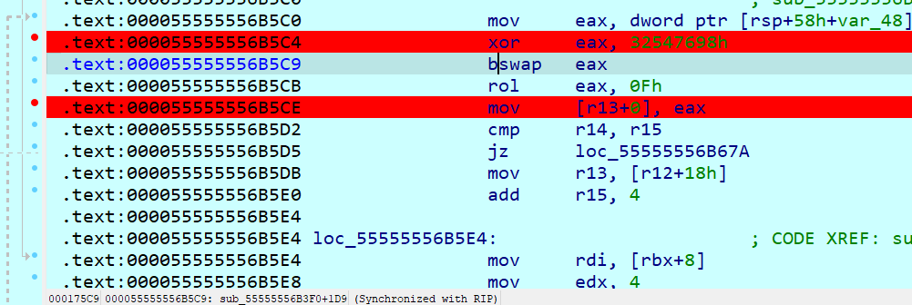
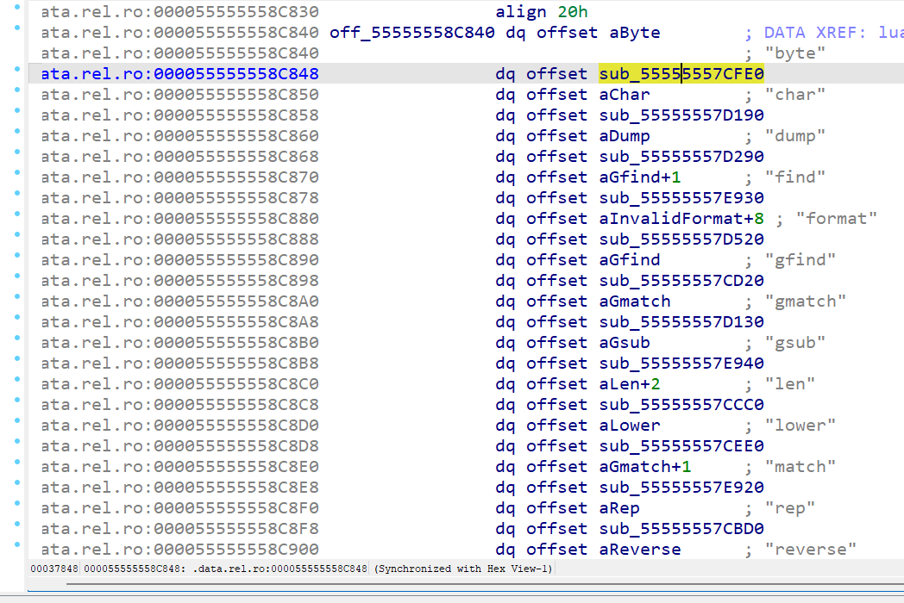

SUCTF 2025 复现

## SU_BBRE

给了IDA的反汇编代码文本，很短，直接分析就好

main函数要求输入19字符存入src，并依次调用了function2、function0，并传入src缓冲区

function2初始化了16字节，然后"suctf"、5、输入字符串、16作为参数分别传入function5

function5里arg0（"suctf"）、arg1（5）传入function3，ai分析为rc4 KSA

function5里arg2（输入字符串）、arg3（16）传入function4，ai分析 PRGA

所以很明显rc4解密即可

~~~python
def KSA(key):
    """ Key-Scheduling Algorithm (KSA) 密钥调度算法"""
    S = list(range(256))
    j = 0
    for i in range(256):
        j = (j + S[i] + key[i % len(key)]) % 256
        S[i], S[j] = S[j], S[i]
    return S

def PRGA(S):
    """ Pseudo-Random Generation Algorithm (PRGA) 伪随机数生成算法"""
    i, j = 0, 0
    while True:
        i = (i + 1) % 256
        j = (j + S[i]) % 256
        S[i], S[j] = S[j], S[i]
        K = S[(S[i] + S[j]) % 256]
        yield K

def RC4(key, text):
    """ RC4 encryption/decryption """
    S = KSA(key)
    keystream = PRGA(S)
    res = []
    for char in text:
        res.append(char ^ next(keystream))
    return bytes(res)

flag = ""
key = b"suctf"
text = [0x2f, 0x5a, 0x57, 0x65, 0x14, 0x8f, 0x69, 0xcd, 0x93, 0x29, 0x1a, 0x55, 0x18, 0x40, 0xe4, 0x5e]
flag += RC4(key, text).decode()
print(flag)
~~~

得到`We1com3ToReWorld`，但很明显不符合长度

继续看发现还有function1没有被用到，而且里面出现了"congratulate!!!"，由此可知有某种方式可以跳转到function1，直接想到缓冲区溢出，可以看到function0正好出现了没有长度限制的strcpy，只需要输入16字节（正好是我们前面rc4解密的长度），其中12字节负责填充，4字节负责覆盖ebp，接着三个字节是function1的地址，这样就可以直接retn到function1

因此完整flag为`We1com3ToReWorld="@AndPWNT00`

~~~python
flag += bytes.fromhex("40223d")[::-1].decode()
s = list(b"AmbMSIN)(")
for i in range(0,len(s)):
    s[i] += i
flag += "".join(map(chr, s))
print(flag)
~~~

这道题巧妙地融合了一点pwn的东西进来，非常签到啊

## SU_minesweeper

题如其名，找扫雷图就行，然后z3求解

~~~python
mine = [0x03, 0x04, 0xFF, 0xFF, 0xFF, 0x05, 0xFF, 0xFF, 0xFF, 0xFF, 0xFF, 0x04, 0x04, 0xFF, 0xFF, 0xFF, 0xFF, 0x02, 0xFF, 0xFF,
        0x04, 0xFF, 0x07, 0xFF, 0xFF, 0xFF, 0x04, 0x06, 0x06, 0xFF, 0xFF, 0xFF, 0xFF, 0x06, 0x05, 0x06, 0x04, 0xFF, 0x05, 0xFF,
        0x04, 0x07, 0xFF, 0x08, 0xFF, 0x06, 0xFF, 0xFF, 0x06, 0x06, 0x05, 0xFF, 0xFF, 0xFF, 0xFF, 0xFF, 0x03, 0x03, 0xFF, 0x03,
        0xFF, 0x05, 0x06, 0x06, 0xFF, 0xFF, 0xFF, 0xFF, 0x04, 0x05, 0x04, 0x05, 0x07, 0x06, 0xFF, 0xFF, 0x04, 0xFF, 0x02, 0x01,
        0xFF, 0xFF, 0xFF, 0x03, 0x04, 0xFF, 0xFF, 0x05, 0x04, 0x03, 0xFF, 0xFF, 0x07, 0x04, 0x03, 0xFF, 0xFF, 0x01, 0x01, 0xFF,
        0xFF, 0x04, 0x03, 0xFF, 0x02, 0xFF, 0x04, 0x03, 0xFF, 0xFF, 0x02, 0xFF, 0x05, 0x04, 0xFF, 0xFF, 0x02, 0x02, 0xFF, 0xFF,
        0x04, 0xFF, 0x04, 0xFF, 0x03, 0x05, 0x06, 0xFF, 0xFF, 0x00, 0xFF, 0xFF, 0xFF, 0x02, 0xFF, 0xFF, 0xFF, 0x01, 0x04, 0xFF,
        0xFF, 0x07, 0x05, 0xFF, 0xFF, 0x03, 0x03, 0x02, 0xFF, 0xFF, 0x04, 0xFF, 0xFF, 0x05, 0x07, 0xFF, 0x03, 0x02, 0x04, 0x04,
        0xFF, 0x07, 0x05, 0x04, 0x03, 0xFF, 0xFF, 0x04, 0xFF, 0x02, 0x04, 0x05, 0xFF, 0xFF, 0x06, 0x05, 0x04, 0xFF, 0x02, 0xFF,
        0xFF, 0x07, 0x04, 0xFF, 0xFF, 0x03, 0xFF, 0x04, 0x04, 0xFF, 0xFF, 0xFF, 0xFF, 0xFF, 0xFF, 0xFF, 0x04, 0x03, 0x02, 0x02,
        0xFF, 0xFF, 0x02, 0x04, 0x03, 0x05, 0xFF, 0xFF, 0x05, 0xFF, 0x04, 0xFF, 0x06, 0xFF, 0xFF, 0x06, 0xFF, 0xFF, 0xFF, 0xFF,
        0x03, 0x03, 0xFF, 0x04, 0xFF, 0xFF, 0xFF, 0xFF, 0xFF, 0x06, 0xFF, 0x06, 0x06, 0xFF, 0x07, 0x06, 0x04, 0xFF, 0x04, 0x03,
        0xFF, 0x04, 0x03, 0x05, 0x04, 0xFF, 0xFF, 0xFF, 0xFF, 0xFF, 0xFF, 0xFF, 0x04, 0x06, 0x07, 0xFF, 0xFF, 0x04, 0xFF, 0xFF,
        0xFF, 0x07, 0xFF, 0x05, 0xFF, 0x05, 0xFF, 0xFF, 0x06, 0x07, 0x07, 0xFF, 0x05, 0x06, 0x06, 0xFF, 0xFF, 0x02, 0x04, 0x04,
        0xFF, 0xFF, 0xFF, 0xFF, 0xFF, 0x06, 0xFF, 0xFF, 0x07, 0x07, 0x06, 0xFF, 0x06, 0xFF, 0xFF, 0xFF, 0xFF, 0x03, 0xFF, 0x03,
        0x05, 0xFF, 0x07, 0xFF, 0x05, 0xFF, 0x06, 0xFF, 0x05, 0xFF, 0xFF, 0x07, 0x08, 0xFF, 0xFF, 0x03, 0xFF, 0x03, 0xFF, 0xFF,
        0xFF, 0xFF, 0xFF, 0x03, 0xFF, 0xFF, 0xFF, 0xFF, 0xFF, 0xFF, 0xFF, 0x06, 0x05, 0x03, 0xFF, 0x04, 0x05, 0x05, 0x03, 0xFF,
        0xFF, 0x06, 0x05, 0x05, 0x06, 0xFF, 0x06, 0x05, 0x02, 0x04, 0x03, 0x04, 0xFF, 0xFF, 0x03, 0x04, 0x04, 0x06, 0x05, 0xFF,
        0x03, 0xFF, 0x05, 0x05, 0x05, 0xFF, 0xFF, 0x05, 0xFF, 0xFF, 0x04, 0xFF, 0xFF, 0x04, 0xFF, 0x07, 0x07, 0x08, 0x06, 0xFF,
        0xFF, 0xFF, 0xFF, 0x05, 0xFF, 0xFF, 0xFF, 0x04, 0xFF, 0x03, 0xFF, 0x03, 0xFF, 0xFF, 0xFF, 0xFF, 0xFF, 0xFF, 0x05, 0x03]

# pip install z3-solver
from z3 import Int, Solver, Or

def solve_mines_z3(counts):
    """
    counts: list of 400 integers (row-major)
    returns: 20x20 list of 0/1 if a solution exists, else None
    """
    if len(counts) != 400:
        raise ValueError("counts must have length 400")

    H = W = 20
    # 创建变量
    X = [[Int(f"x_{r}_{c}") for c in range(W)] for r in range(H)]
    s = Solver()

    # 约束每个变量为 0 或 1（整数）
    for r in range(H):
        for c in range(W):
            s.add(X[r][c] >= 0, X[r][c] <= 1)

    # 每个格子的约束：邻域和等于给定的 counts
    for r in range(H):
        for c in range(W):
            neigh = []
            if counts[r * W + c] == 0xff:
                continue
            for dr in (-1, 0, 1):
                for dc in (-1, 0, 1):
                    nr, nc = r + dr, c + dc
                    if 0 <= nr < H and 0 <= nc < W:
                        neigh.append(X[nr][nc])
            s.add(sum(neigh) == counts[r * W + c])

    if s.check() == "sat" or s.check().r == 1:
        m = s.model()
        grid = [[m.evaluate(X[r][c]).as_long() for c in range(W)] for r in range(H)]
        return grid
    else:
        return None

# 简单示例（替换 counts 为你实际的 400 个数字）
if __name__ == "__main__":
    counts = mine  # 400 个整数
    grid = solve_mines_z3(counts)
    if grid is None:
        print("无可行解")
    else:
        for row in grid:
            print("".join(str(x) for x in row))
    pass
~~~

拿到01地雷图，然后去逆向下面这个逻辑

~~~c
__int64 __fastcall sub_555555555352(__int64 a1, int a2, int a3)
{
  if ( a2 >= 0 && a3 >= 0 && a2 <= 19 && a3 <= 19 )
    return ((int)*(unsigned __int8 *)((20 * a2 + a3) / 8 + a1) >> ((20 * a2 + a3) & 7)) & 1;
  else
    return 0LL;
}

__int64 __fastcall sub_555555555277(__int64 a1, const char *a2)
{
  char v2; // bl
  int v4; // [rsp+18h] [rbp-18h]
  int i; // [rsp+1Ch] [rbp-14h]

  v4 = strlen(a2);
  if ( a2[v4 - 1] == 10 )
    --v4;
  if ( (v4 & 1) != 0 )
    sub_5555555551E9();
  for ( i = 0; i < v4 / 2; ++i )
  {
    v2 = 16 * sub_55555555522B((unsigned __int8)a2[2 * i]);
    *(_BYTE *)(i + a1) = sub_55555555522B((unsigned __int8)a2[2 * i + 1]) | v2;
  }
  return (unsigned int)(v4 / 2);
}

__int64 __fastcall sub_55555555522B(unsigned __int8 a1)
{
  if ( a1 > 0x2Fu && a1 <= 0x39u )
    return (unsigned int)a1 - 42;
  if ( a1 <= 0x60u || a1 > 0x66u )
    sub_5555555551E9();
  return (unsigned int)a1 - 97;
}
~~~

上面首先对输入进行检查，长度100，是否为hex字符，然后循环移位6位，根据新的hex值得到50字节，然后50字节按照小端存储的顺序依次取1bit作为是否有雷，解密如下

~~~python
bin = "1101101011011011100101101111110110100011011110001010011011011111101011011101000000000100100111001000010001110001000000011110000000000111001101001111000100010001111000000111111100101110101100001101100010001001101101101001000010110110111101101101100001110110100110101011111000110011111001101101111000010101011011011101110011110110101110000010100001100010000110101011111010000110111101110011011110111110"
s = []
for i in range(0, len(bin), 8):
    s.append(int(bin[i:i+8][::-1], 2))
s = bytes(s).hex()
for i in range(len(s)):
    if int(s[i], 16) in range(6, 16):
        print(str(hex(int(s[i], 16)-6)[2:]), end="")
    else:
        print(str(hex(int(s[i], 16)+10)[2:]), end="")

~~~

得到`f57503596fb80f955fa5cad3cb282aa18ac62922a1981ea7b53b07a30709b508f3176601154250d509b7bee0f2170b898617`

## SU_Harmony

~~~java
public Object #~@0>#handleInput(Object functionObject, Object newTarget, Index this) {
    console.info("You input: ", this.message);
    testNapi = import { default as testNapi } from "@normalized:Y&&&libentry.so&";
    check = testNapi.check(this.message);
    console.log("Result:", check);
    if (("right" == check ? 1 : 0) != 0) {
        this.inputBackgroundColor = Color.Green;
        return null;
    }
    if (("error" == check ? 1 : 0) != 0) {
        this.inputBackgroundColor = Color.Red;
        return null;
    }
    this.inputBackgroundColor = Color.Gray;
    return null;
}
~~~

可以看到调用了testNapi的check，check逻辑在so里。函数不多，很容易找到逻辑sub_3750

可以发现比较多的固定字节（交叉引用看下可以发现只用来赋值，没有修改过），有点混淆的感觉，直接n重命名为数值（下划线+数字），同样还发现了一些返回固定值的函数，也做下重命名。最终得到

~~~c
__int64 __fastcall sub_3750(__int64 a1, __int64 a2)
{
  // [COLLAPSED LOCAL DECLARATIONS. PRESS NUMPAD "+" TO EXPAND]

  s[3] = __readfsqword(0x28u);
  v231 = 2LL;
  memset(s, 0, 0x10uLL);
  memset(v233, 0, sizeof(v233));
  napi_get_cb_info(a1, a2, &v231, s, 0LL);
  napi_typeof(a1, s[0], v229);
  memset(v232, 0, sizeof(v232));
  v2 = s[0];
  value_string_utf8 = napi_get_value_string_utf8(a1, s[0], v232, 256LL, &v228);
  v200 = 9;
  v202 = (char)_7(a1, v2, v3) + v200;
  v201 = 4 * (char)2();
  v4 = 0();
  if ( (v4 * v201 + v202) / (unsigned int)8 == 1 )
    goto LABEL_19;
  v199 = 1.0;
  if ( !value_string_utf8 )
    v199 = 0.0;
  v226 = v199 * (-(double)3 - (double)3 + (double)7);
  v196 = 9;
  v198 = (char)_7(a1, v2, (v4 * v201 + v202) % (unsigned int)8) + v196;
  v197 = 10 * (char)2();
  v5 = 0();
  v6 = (v5 * v197 + v198) % (unsigned int)8;
  if ( (v5 * v197 + v198) / (unsigned int)8 == 1
    || (v193 = 3, v194 = (char)6(a1, v2, v6) + v193, v195 = byte_F669 * 9 * (char)_3() + v194, v195 == (char)_9()) )
  {
    v190 = 9;
    v192 = (char)_7(a1, v2, v6) + v190;
    v191 = 6 * (char)2();
    v7 = 0();
    if ( (v7 * v191 + v192) / (unsigned int)8 == 1 )
      BUG();
    v187 = 9;
    v189 = (char)_7(a1, v2, (v7 * v191 + v192) % (unsigned int)8) + v187;
    v188 = (char)2();
    v8 = 0();
    v6 = (v189 + 10 * v8 * v188) % (unsigned int)8;
    v227 = (int)(v226 * (double)(int)((v189 + 10 * v8 * v188) / (unsigned int)8 - 1));
  }
  else
  {
    v227 = 4;
  }
  v184 = 9;
  v186 = (char)_7(a1, v2, v6) + v184;
  v185 = 9 * (char)2();
  if ( (((char)0() * v185 + v186) / (unsigned int)8 - 1) * v227 )
  {
    OH_LOG_Print(0LL, 4LL, 12800LL, "Native Log", "input error");
    napi_create_string_utf8(a1, "error", 5LL, &v230);
    v178 = 9;
    v180 = (char)_7(a1, "error", v9) + v178;
    v179 = (char)2();
    v10 = 0();
    v224 = (double)(int)((v180 + 10 * v10 * v179) / (unsigned int)8 - 1) * (-(double)3 - (double)3 + (double)7);
    v181 = 9;
    v183 = (char)_7(a1, "error", (v180 + 10 * v10 * v179) % (unsigned int)8) + v181;
    v182 = 10 * (char)2();
    v11 = 0();
    v12 = (v11 * v182 + v183) % (unsigned int)8;
    if ( (v11 * v182 + v183) / (unsigned int)8 == 1
      || (v175 = 3, v176 = (char)6(a1, "error", v12) + v175,
                    v177 = byte_F669 * 9 * (char)_3() + v176,
                    v177 == (char)_9()) )
    {
      v172 = 9;
      v174 = (char)_7(a1, "error", v12) + v172;
      v173 = 6 * (char)2();
      v13 = 0();
      if ( (v13 * v173 + v174) / (unsigned int)8 == 1 )
        BUG();
      v169 = 9;
      v171 = (char)_7(a1, "error", (v13 * v173 + v174) % (unsigned int)8) + v169;
      v170 = (char)2();
      v225 = (int)(v224 * (double)(int)((v171 + 10 * (char)0() * v170) / (unsigned int)8 - 1));
    }
    else
    {
      v225 = 4;
    }
    if ( v225 > 0 )
      return v230;
  }
LABEL_19:
  v14 = 0LL;
  v15 = &byte_4;
  OH_LOG_Print(0LL, 4LL, 12800LL, "Native Log", "Your input : %{public}s \nlen:%{public}d", v232, v228);
  v166 = 9;
  v168 = (char)_7(0LL, 4LL, v16) + v166;
  v167 = (char)2();
  v17 = 0();
  v18 = (v17 * v167 + v168) % (unsigned int)8;
  if ( (v17 * v167 + v168) / (unsigned int)8 == 1 )
    goto LABEL_37;
  v165 = 1.0;
  if ( v228 == 32 )
    v165 = 0.0;
  v222 = v165 * (-(double)3 - (double)3 + (double)7);
  v162 = 9;
  v164 = (char)_7(0LL, 4LL, v18) + v162;
  v163 = 10 * (char)2();
  v19 = 0();
  v20 = (v19 * v163 + v164) % (unsigned int)8;
  if ( (v19 * v163 + v164) / (unsigned int)8 == 1
    || (v159 = 3, v160 = (char)6(0LL, 4LL, v20) + v159, v161 = byte_F669 * 9 * (char)_3() + v160, v161 == (char)_9()) )
  {
    v156 = 9;
    v158 = (char)_7(0LL, 4LL, v20) + v156;
    v157 = 6 * (char)2();
    v21 = 0();
    if ( (v21 * v157 + v158) / (unsigned int)8 == 1 )
      BUG();
    v153 = 9;
    v155 = (char)_7(0LL, 4LL, (v21 * v157 + v158) % (unsigned int)8) + v153;
    v154 = (char)2();
    v22 = 0();
    v20 = (v155 + 10 * v22 * v154) % (unsigned int)8;
    v223 = (int)(v222 * (double)(int)((v155 + 10 * v22 * v154) / (unsigned int)8 - 1));
  }
  else
  {
    v223 = 4;
  }
  v150 = 9;
  v152 = (char)_7(0LL, 4LL, v20) + v150;
  v151 = 6 * (char)2();
  v23 = 0();
  v18 = (unsigned int)1;
  if ( ((v23 * v151 + v152) / (unsigned int)8 - (_DWORD)v18) * v223 )
  {
    OH_LOG_Print(0LL, 4LL, 12800LL, "Native Log", "input length error");
    v14 = a1;
    v15 = "error";
    napi_create_string_utf8(a1, "error", 5LL, &v230);
    v144 = 9;
    v146 = (char)_7(a1, "error", v24) + v144;
    v145 = (char)2();
    v25 = 0();
    v220 = (double)(int)((7 * v25 * v145 + v146) / (unsigned int)8 - 1) * (-(double)3 - (double)3 + (double)7);
    v147 = 9;
    v149 = (char)_7(a1, "error", (7 * v25 * v145 + v146) % (unsigned int)8) + v147;
    v148 = 10 * (char)2();
    v26 = 0();
    v18 = (v26 * v148 + v149) % (unsigned int)8;
    if ( (v26 * v148 + v149) / (unsigned int)8 == 1
      || (v141 = 3, v142 = (char)6(a1, "error", v18) + v141,
                    v143 = byte_F669 * 9 * (char)_3() + v142,
                    v143 == (char)_9()) )
    {
      v138 = 9;
      v140 = (char)_7(a1, "error", v18) + v138;
      v139 = 6 * (char)2();
      v27 = 0();
      if ( (v27 * v139 + v140) / (unsigned int)8 == 1 )
        BUG();
      v135 = 9;
      v137 = (char)_7(a1, "error", (v27 * v139 + v140) % (unsigned int)8) + v135;
      v136 = (char)2();
      v28 = 0();
      v18 = (v137 + 10 * v28 * v136) % (unsigned int)8;
      v221 = (int)(v220 * (double)(int)((v137 + 10 * v28 * v136) / (unsigned int)8 - 1));
    }
    else
    {
      v221 = 4;
    }
    if ( v221 > 0 )
      return v230;
  }
LABEL_37:
  for ( i = 0; ; ++i )
  {
    v129 = 9;
    v131 = (char)_7(v14, v15, v18) + v129;
    v130 = (char)2();
    v29 = 0();
    v218 = (double)(int)((v131 + 2 * v29 * v130) / (unsigned int)8 - 1) * (-(double)3 - (double)3 + (double)7);
    v132 = 9;
    v134 = (char)_7(v14, v15, (v131 + 2 * v29 * v130) % (unsigned int)8) + v132;
    v133 = 10 * (char)2();
    v30 = 0();
    v18 = (v30 * v133 + v134) % (unsigned int)8;
    if ( (v30 * v133 + v134) / (unsigned int)8 == 1
      || (v126 = 3, v127 = (char)6(v14, v15, v18) + v126, v128 = byte_F669 * 9 * (char)_3() + v127, v128 == (char)_9()) )
    {
      v123 = 9;
      v125 = (char)_7(v14, v15, v18) + v123;
      v124 = 6 * (char)2();
      v31 = 0();
      if ( (v31 * v124 + v125) / (unsigned int)8 == 1 )
        BUG();
      v120 = 9;
      v122 = (char)_7(v14, v15, (v31 * v124 + v125) % (unsigned int)8) + v120;
      v121 = (char)2();
      v32 = 0();
      v18 = (v122 + 10 * v32 * v121) % (unsigned int)8;
      v219 = (int)(v218 * (double)(int)((v122 + 10 * v32 * v121) / (unsigned int)8 - 1));
    }
    else
    {
      v219 = 4;
    }
    if ( i >= v219 )
      break;
    for ( j = 0; j < 8; ++j )
    {
      v233[j] = v232[j];
      v14 = 0LL;
      v15 = &byte_4;
      LODWORD(v55) = v233[j];
      OH_LOG_Print(0LL, 4LL, 12800LL, "Native Log", "input2uintArray[%{public}d] = %{public}x", (unsigned int)j, v55);
    }
  }
  for ( k = 0; ; ++k )
  {
    v114 = 9;
    v116 = (char)_7(v14, v15, v18) + v114;
    v115 = (char)2();
    v33 = 0();
    v216 = (double)(int)((3 * v33 * v115 + v116) / (unsigned int)8 - 1) * (-(double)3 - (double)3 + (double)7);
    v117 = 9;
    v119 = (char)_7(v14, v15, (3 * v33 * v115 + v116) % (unsigned int)8) + v117;
    v118 = 10 * (char)2();
    v34 = 0();
    v18 = (v34 * v118 + v119) % (unsigned int)8;
    if ( (v34 * v118 + v119) / (unsigned int)8 == 1
      || (v111 = 3, v112 = (char)6(v14, v15, v18) + v111, v113 = byte_F669 * 9 * (char)_3() + v112, v113 == (char)_9()) )
    {
      v108 = 9;
      v110 = (char)_7(v14, v15, v18) + v108;
      v109 = 6 * (char)2();
      v35 = 0();
      if ( (v35 * v109 + v110) / (unsigned int)8 == 1 )
        BUG();
      v105 = 9;
      v107 = (char)_7(v14, v15, (v35 * v109 + v110) % (unsigned int)8) + v105;
      v106 = (char)2();
      v36 = 0();
      v18 = (v107 + 10 * v36 * v106) % (unsigned int)8;
      v217 = (int)(v216 * (double)(int)((v107 + 10 * v36 * v106) / (unsigned int)8 - 1));
    }
    else
    {
      v217 = 4;
    }
    if ( k >= v217 )
      break;
    for ( m = 0; m < 8; ++m )
    {
      v102 = 9;
      v104 = (char)_7(v14, v15, v18) + v102;
      v103 = 8 * (char)2();
      v37 = 0();
      v18 = (v37 * v103 + v104) % (unsigned int)8;
      if ( (v37 * v103 + v104) / (unsigned int)8 != 1 )
      {
        v14 = (unsigned int)v233[m];
        v15 = &a99927228993060[64 * (__int64)m];
        v101 = 1.0;
        if ( (unsigned int)sub_57B0(v14, v15, v18) )
          v101 = 0.0;
        v214 = v101 * (-(double)3 - (double)3 + (double)7);
        v98 = 9;
        v100 = (char)_7(v14, v15, v38) + v98;
        v99 = 10 * (char)2();
        v39 = 0();
        v40 = (v39 * v99 + v100) % (unsigned int)8;
        if ( (v39 * v99 + v100) / (unsigned int)8 == 1
          || (v95 = 3, v96 = (char)6(v14, v15, v40) + v95, v97 = byte_F669 * 9 * (char)_3() + v96, v97 == (char)_9()) )
        {
          v92 = 9;
          v94 = (char)_7(v14, v15, v40) + v92;
          v93 = 6 * (char)2();
          v41 = 0();
          if ( (v41 * v93 + v94) / (unsigned int)8 == 1 )
            BUG();
          v89 = 9;
          v91 = (char)_7(v14, v15, (v41 * v93 + v94) % (unsigned int)8) + v89;
          v90 = (char)2();
          v42 = 0();
          v40 = (v91 + 10 * v42 * v90) % (unsigned int)8;
          v215 = (int)(v214 * (double)(int)((v91 + 10 * v42 * v90) / (unsigned int)8 - 1));
        }
        else
        {
          v215 = 4;
        }
        v86 = 9;
        v88 = (char)_7(v14, v15, v40) + v86;
        v87 = 9 * (char)2();
        v43 = 0();
        v18 = (unsigned int)1;
        if ( ((v43 * v87 + v88) / (unsigned int)8 - (_DWORD)v18) * v215 )
        {
          v14 = a1;
          v15 = "error";
          napi_create_string_utf8(a1, "error", 5LL, &v230);
          v80 = 9;
          v82 = (char)_7(a1, "error", v44) + v80;
          v81 = (char)2();
          v45 = 0();
          v212 = (double)(int)((v82 + 10 * v45 * v81) / (unsigned int)8 - 1) * (-(double)3 - (double)3 + (double)7);
          v83 = 9;
          v85 = (char)_7(a1, "error", (v82 + 10 * v45 * v81) % (unsigned int)8) + v83;
          v84 = 10 * (char)2();
          v46 = 0();
          v18 = (v46 * v84 + v85) % (unsigned int)8;
          if ( (v46 * v84 + v85) / (unsigned int)8 == 1
            || (v77 = 3, v78 = (char)6(a1, "error", v18) + v77,
                         v79 = byte_F669 * 9 * (char)_3() + v78,
                         v79 == (char)_9()) )
          {
            v74 = 9;
            v76 = (char)_7(a1, "error", v18) + v74;
            v75 = 6 * (char)2();
            v47 = 0();
            if ( (v47 * v75 + v76) / (unsigned int)8 == 1 )
              BUG();
            v71 = 9;
            v73 = (char)_7(a1, "error", (v47 * v75 + v76) % (unsigned int)8) + v71;
            v72 = (char)2();
            v48 = 0();
            v18 = (v73 + 10 * v48 * v72) % (unsigned int)8;
            v213 = (int)(v212 * (double)(int)((v73 + 10 * v48 * v72) / (unsigned int)8 - 1));
          }
          else
          {
            v213 = 4;
          }
          if ( v213 > 0 )
            return v230;
        }
      }
    }
  }
  napi_create_string_utf8(a1, "right", 5LL, &v230);
  v65 = 9;
  v67 = (char)_7(a1, "right", v49) + v65;
  v66 = (char)2();
  v50 = 0();
  v210 = (double)(int)((v67 + 6 * v50 * v66) / (unsigned int)8 - 1) * (-(double)3 - (double)3 + (double)7);
  v68 = 9;
  v70 = (char)_7(a1, "right", (v67 + 6 * v50 * v66) % (unsigned int)8) + v68;
  v69 = 10 * (char)2();
  v51 = 0();
  v52 = (v51 * v69 + v70) % (unsigned int)8;
  if ( (v51 * v69 + v70) / (unsigned int)8 == 1
    || (v62 = 3, v63 = (char)6(a1, "right", v52) + v62, v64 = byte_F669 * 9 * (char)_3() + v63, v64 == (char)_9()) )
  {
    v59 = 9;
    v61 = (char)_7(a1, "right", v52) + v59;
    v60 = 6 * (char)2();
    v53 = 0();
    if ( (v53 * v60 + v61) / (unsigned int)8 == 1 )
      BUG();
    v56 = 9;
    v58 = (char)_7(a1, "right", (v53 * v60 + v61) % (unsigned int)8) + v56;
    v57 = (char)2();
    v211 = (int)(v210 * (double)(int)((v58 + 10 * (char)0() * v57) / (unsigned int)8 - 1));
  }
  else
  {
    v211 = 4;
  }
  if ( v211 <= 0 )
    BUG();
  return v230;
}
~~~

大概算下就知道了大部分带有混淆的都没什么用，抽取真实逻辑即可

~~~c
memset(v232, 0, sizeof(v232));
v2 = s[0];
value_string_utf8 = napi_get_value_string_utf8(a1, s[0], v232, 256LL, &v228);
OH_LOG_Print(0LL, 4LL, 12800LL, "Native Log", "Your input : %{public}s \nlen:%{public}d", v232, v228);
for ( j = 0; j < 8; ++j )
{
  v233[j] = v232[j];
  v14 = 0LL;
  v15 = &byte_4;
  LODWORD(v55) = v233[j];
  OH_LOG_Print(0LL, 4LL, 12800LL, "Native Log", "input2uintArray[%{public}d] = %{public}x", (unsigned int)j, v55);
}
for ( m = 0; m < 8; ++m )
{
    v14 = (unsigned int)v233[m];
    v15 = &a99927228993060[64 * (__int64)m];
    v101 = 1.0;
    if ( (unsigned int)sub_57B0(v14, v15, v18) )
      v101 = 0.0;
    v214 = v101 * (-(double)3 - (double)3 + (double)7);
	v215 = v214;
    if ( v215 )
    {
      v14 = a1;
      v15 = "error";
      napi_create_string_utf8(a1, "error", 5LL, &v230);
      v80 = 9;
      v82 = (char)_7(a1, "error", v44) + v80;
      v81 = (char)2();
      v45 = 0();
      v212 = (double)(int)((v82 + 10 * v45 * v81) / (unsigned int)8 - 1) * (-(double)3 - (double)3 + (double)7);
      v83 = 9;
      v85 = (char)_7(a1, "error", (v82 + 10 * v45 * v81) % (unsigned int)8) + v83;
      v84 = 10 * (char)2();
      v46 = 0();
      v18 = (v46 * v84 + v85) % (unsigned int)8;
      if ( (v46 * v84 + v85) / (unsigned int)8 == 1
        || (v77 = 3, v78 = (char)6(a1, "error", v18) + v77,
                     v79 = byte_F669 * 9 * (char)_3() + v78,
                     v79 == (char)_9()) )
      {
        v74 = 9;
        v76 = (char)_7(a1, "error", v18) + v74;
        v75 = 6 * (char)2();
        v47 = 0();
        if ( (v47 * v75 + v76) / (unsigned int)8 == 1 )
          BUG();
        v71 = 9;
        v73 = (char)_7(a1, "error", (v47 * v75 + v76) % (unsigned int)8) + v71;
        v72 = (char)2();
        v48 = 0();
        v18 = (v73 + 10 * v48 * v72) % (unsigned int)8;
        v213 = (int)(v212 * (double)(int)((v73 + 10 * v48 * v72) / (unsigned int)8 - 1));
      }
      else
      {
        v213 = 4;
      }
      if ( v213 > 0 )
        return v230;
    }
  }
}
napi_create_string_utf8(a1, "right", 5LL, &v230);
v65 = 9;
v67 = (char)_7(a1, "right", v49) + v65;
v66 = (char)2();
v50 = 0();
v210 = (double)(int)((v67 + 6 * v50 * v66) / (unsigned int)8 - 1) * (-(double)3 - (double)3 + (double)7);
v68 = 9;
v70 = (char)_7(a1, "right", (v67 + 6 * v50 * v66) % (unsigned int)8) + v68;
v69 = 10 * (char)2();
v51 = 0();
v52 = (v51 * v69 + v70) % (unsigned int)8;
if ( (v51 * v69 + v70) / (unsigned int)8 == 1
|| (v62 = 3, v63 = (char)6(a1, "right", v52) + v62, v64 = byte_F669 * 9 * (char)_3() + v63, v64 == (char)_9()) )
{
v59 = 9;
v61 = (char)_7(a1, "right", v52) + v59;
v60 = 6 * (char)2();
v53 = 0();
if ( (v53 * v60 + v61) / (unsigned int)8 == 1 )
  BUG();
v56 = 9;
v58 = (char)_7(a1, "right", (v53 * v60 + v61) % (unsigned int)8) + v56;
v57 = (char)2();
v211 = (int)(v210 * (double)(int)((v58 + 10 * (char)0() * v57) / (unsigned int)8 - 1));
}
else
{
v211 = 4;
}
if ( v211 <= 0 )
BUG();
return v230;
~~~

关键是a99927228993060和sub_57B0

~~~c
__int64 __fastcall sub_57B0(unsigned int a1, const char *a2)
{
  // [COLLAPSED LOCAL DECLARATIONS. PRESS NUMPAD "+" TO EXPAND]

  v65 = __readfsqword(0x28u);
  memset(s, 0, 0x1388uLL);
  memset(v62, 0, 0x1388uLL);
  memset(v61, 0, 0x1388uLL);
  memset(v60, 0, 0x1388uLL);
  memset(s1, 0, 0x1388uLL);
  sub_62F0(a1, v64);
  sub_6D20(v64, v64, s);
  sub_8270(v64, 2LL, v62);
  sub_9890(s, v62, v61);
  sub_A8F0(v61, "3", v60);
  sub_C160(v60, s1);
  v49 = 9;
  v51 = (char)_7() + v49;
  v50 = (char)2();
  if ( ((char)0() * v50 + v51) / (unsigned int)8 == 1 )
    goto LABEL_19;
  v48 = 1.0;
  if ( strcmp(s1, a2) )
    v48 = 0.0;
~~~

有一处明显的比较，分别分析中间的六个函数：

* sub_62F0：一个明显的int2str

  ~~~c
  v55 = a1;
  while ( 1 )
  {
    v19 = 1.0;
    if ( !v55 )
      v19 = 0.0;
    v3 = v54++;
    a2[v3] = v55 % 0xA + 48;
    v55 /= 0xAu;
  }
  a2[v54] = 0;
  return sub_CC10(a2);
  ~~~

* sub_6D20：两个数字字符串乘法

  ~~~c
  unsigned __int64 __fastcall sub_6D20(const char *a1, const char *a2, char *a3)
  {
    // [COLLAPSED LOCAL DECLARATIONS. PRESS NUMPAD "+" TO EXPAND]
  
    v125 = __readfsqword(0x28u);
    v109 = strlen(a1);
    v108 = strlen(a2);
    v107 = v108 + v109;
    memset(v124, 0, 0x4E20uLL);
      for ( j = v109 - 1; j >= 0; --j )
      {
          for ( m = v108 - 1; m >= 0; --m )
          {
            v102 = m + j + 1;
            v101 = v124[v102] + (a2[m] - 48) * (a1[j] - 48);
            v124[v102] = v101 % 10;
            v124[m + j] += v101 / 10;
          }
      }
    for ( n = 0; ; ++n )
    {
      v68 = 0;
      if ( n < v107 )
        v68 = v124[n] == 0;
      v117 = (double)v68;
        v118 = (int)v117;
      if ( !v118 )
        break;
    }
    v49 = 1.0;
    if ( n != v107 )
      v49 = 0.0;
    v115 = v49;
      v116 = (int)v115;
    if ( !v116 )
      goto LABEL_53;
    strcpy(a3, "0"); // retn
    if ( v114 <= 0 )
    {
      *a3 = 0;
        while ( n < v107 )
        {
          src = v124[n] + 48;
          strncat(a3, &src, 1uLL);	// retn
          ++n;
        }
    }
    return __readfsqword(0x28u);
  }
  ~~~

* sub_8270：里面sub_CC10实现了反转，sub_8270是数字字符串和一个数字（a2）乘法

  ~~~c
  strcpy(s, a1);
  sub_CC10(s);
  v111 = 0;
  *a3 = 0;
  for ( j = 0; j < strlen(s); ++j )
  {
      v108 = v111 + a2 * (s[j] - 48);
      v111 = v108 / 10;
      v126 = v108 % 10 + 48;
      strncat(a3, &v126, 1uLL);
  }
  sub_CC10(a3);
  ~~~

* sub_9890：两个数字字符串加法

  ~~~c
  memset(s, 0, sizeof(s));
  memset(dest, 0, 0x1388uLL);
  strcpy(s, a1);
  strcpy(dest, a2);
  sub_CC10(s);
  sub_CC10(dest);
  v82 = strlen(s);
  v81 = strlen(dest);
  v80 = 0;
    *a3 = 0;
  for ( j = 0; j < v75; ++j )
  {
    if ( j >= v82 )
      v59 = 0;
    else
      v59 = s[j] - 48;
    if ( j >= v81 )
      v58 = 0;
    else
      v58 = dest[j] - 48;
    v77 = v80 + v58 + v59;
    v80 = v77 / 10;
    v93 = v77 % 10 + 48;
    strncat(a3, &v93, 1uLL);
  }
  sub_CC10(a3);
  ~~~

* sub_A8F0：两个数字字符串减法

  ~~~c
   memset(s, 0, sizeof(s));
    memset(dest, 0, 0x1388uLL);
    strcpy(s, a1);
    strcpy(dest, a2);
    sub_CC10(s);
    sub_CC10(dest);
    v120 = strlen(s);
    v119 = strlen(dest);
    v118 = 0;
    *a3 = 0;
  for ( j = 0; j < v120; ++j )
      {
        if ( j >= v119 )
          v99 = 0;
        else
          v99 = dest[j] - 48;
        v115 = s[j] - 48 - v99 - v118;
  ~~~

* sub_C160：数字字符串转二进制字符串

  ~~~c
  v60 = strlen(a1);
    v59 = 0;
    *a2 = 0;
  for ( j = 0; j < v60; ++j )
      {
        v56 = a1[j] - 48 + 10 * v59;
        v59 = v56 % 2;
        src = v56 / 2 + 48;
  ~~~

至此，确定了输入的数字为n，则验证了$\frac{n^{2}+2*n-3}{2}=cmp$，直接z3求解就可以了，限制下范围

~~~python
from z3 import *
cmp = [999272289930604998, 1332475531266467542, 1074388003071116830, 1419324015697459326, 978270870200633520, 369789474534896558, 344214162681978048, 2213954953857181622]
flag = ""
for i in range(len(cmp)):
    s = Solver()
    x = Int("x")
    s.add((x*x+2*x-3)==cmp[i]*2)
    s.add(x>= 0x20202020)
    s.add(x<= 0x7f7f7f7f)
    if s.check() == sat:
        ans = s.model()
        flag += int.to_bytes(abs(ans[x].as_long()), 4, "little").decode()
    else:
        s = Solver()
        x = Int("x")
        s.add((x * x + 2 * x - 3) == cmp[i] * 2+1)
        if s.check() == sat:
            ans = s.model()
            flag += int.to_bytes(abs(ans[x].as_long()), 4, "little").decode()
    print(flag)
~~~

`SUCTF{Ma7h_WorldIs_S2_B3aut1ful}`

## SU_mapmap2

很明显地图，0x440009uLL查看bin可以发现计算的正是adsw方向

~~~c
if ( v0 > 0x16 || ((0x440009uLL >> v0) & 1) == 0 )// adsw
      wrong();
~~~

逻辑是看不懂一点，尝试动调发现正确的v8会变化，错误就返回了初始值

~~~c
for ( i = 0LL; ; ++i )
  {
    v3 = len(v10);
    if ( i >= v3 )
      break;
    v0 = *(char *)get(v10, i) - 97;
    if ( v0 > 0x16 || ((0x440009uLL >> v0) & 1) == 0 )// adsw
      wrong();
    v1 = v8;
    v6 = *(char *)get(v10, i) >> 4;
    v2 = sub_4631C2(v1, (__int64)&v6);
    v7 = *(_BYTE *)get(v10, i) & 0xF;
    v8 = *(_QWORD *)sub_4632EE(v2, (__int64)&v7);
    if ( !v8 )
      wrong();
  }
~~~

尝试pintool爆破发现指令数虽然稳定，但是走错路径指令数也会增加，所以最好的方法还是利用IDApython来实现爆破

尝试爆破的过程中给我恍惚间干到L3HCTF了，idapython脚本写的又臭又复杂，看了别人的wp，代码很简洁，难受

~~~python
def get_next_move(i):
    global correct_path, MOVES
    if bytes([correct_path[-1]]) == b"a":
        MOVES = b"wsa"
    elif bytes([correct_path[-1]]) == b"d":
        MOVES = b"wsd"
    elif bytes([correct_path[-1]]) == b"s":
        MOVES = b"sda"
    elif bytes([correct_path[-1]]) == b"w":
        MOVES = b"wda"

rbp = ida_dbg.get_reg_val('rbp')
rax = ida_dbg.get_reg_val('rax')
i = idc.get_wide_dword(rbp-0x48)
path = idc.get_bytes(idc.get_wide_dword(rbp-0x40), 268)
global correct_path, MOVES
if i != 268:
    if i >= len(correct_path):
        if rax != 0x000000000065B3C0:
            correct_path += bytes([path[i]])
            get_next_move(i)
            idc.patch_byte(idc.get_wide_dword(rbp-0x40)+i+1, MOVES[0])
            print("right: ", correct_path.decode())
            idc.patch_dword(rbp-0x48, i+1)
        else:
            print("wrong: ", (correct_path + bytes([path[i]])).decode())
            if correct_path == b"":
                MOVES = b"adws"
            while True:
                if path[i] != MOVES[-1]:
                    idc.patch_byte(idc.get_wide_dword(rbp-0x40)+i, MOVES[MOVES.index(path[i])+1]) 
                    break 
                else:
                    correct_path = correct_path[:-1]
                    get_next_move(i)
                    i -= 1
            idc.patch_dword(rbp-0x48, 0)
    else:
        idc.patch_dword(rbp-0x48, i+1)
    ida_dbg.set_reg_val('rip', 0x462DE4)
~~~

核心思想是利用条件断点和全局变量，初始值设置

~~~python
correct_path=b""
MOVES = b""
~~~

然后断点断在0x462E99，每次到这里读取第几位（i）以及path值，以及global的变量，然后实现模拟DFS来爆破路径

下面是其他大佬做的，有一些启发：

* SU官方wp，用gdb做的：https://github.com/team-su/SUCTF-2025/tree/master/rev/mapmap2/writeup

* qiling做的，头一次听说：https://lrhtony.cn/2025/01/14/2025suctf/

* 真正高档原理的，是一个树查找：https://carbo.ink/2025/01/14/2025suctf/#SU-mapmap2-%E8%B5%9B%E5%90%8E

* 真正DFS实现的：https://blog.xmcve.com/2025/01/14/SUCTF2025-Writeup/#title-19

  这个真得学学，不太会IDApython控制调试流程，让调试器自己跑；代码如下，下断点位置差不多

  ~~~python
  from idaapi import *
  
  origin_status=get_qword(0x63F530)
  final_status=get_qword(0x63F538)
  
  # 获取相关数据的地址 
  rbp=get_reg_val('rbp')
  input_addr=rbp-0x40	# 这里和我的都差不多
  i_addr=rbp-0x48
  status_addr=rbp-0x50
  path=get_qword(input_addr)# 路径数组
  flag=''
  isVisited=dict()# 存储状态被访问的情况,防止走回头路
  
  def get_status():
      return get_qword(status_addr)
  
  def set_status(status):
      patch_qword(status_addr,status)
  
  def get_i():
      return get_qword(i_addr)
  def set_i(i):
      patch_qword(i_addr,i)
  
  def get_code(pos):
      return get_byte(path+pos)
  
  def set_code(off,code):
      patch_byte(path+off,ord(code))
  
  # 判断指定状态向指定方向移动后的状态
  def run_is_legal(status, code):
      # 设置初始状态
      set_status(status)
      set_code(0,code)
      set_i(0) # 无限循环
  
      # 运行,获取新状态
      continue_process()
      wait_for_next_event(WFNE_SUSP,-1)# 等待下一个调试事件
      new_status=get_status()# 获取新的状态
      
      print(f'code:{code} new_status:{hex(new_status)}')
      return new_status
  
  # 搜索指定状态的路径,DFS深搜
  def search(status):
      global flag
      global isVisited
      print("search status:",hex(status))
      if status==final_status:
          return True
      if status in isVisited:
          return False
      else:
          isVisited[status]=True
  
      new_status=run_is_legal(status, 'w')
      if new_status!=origin_status and new_status!=status:
          if search(new_status):
              flag+='w'
              return True
  
      new_status=run_is_legal(status, 'd')
      if new_status!=origin_status and new_status!=status:
          if search(new_status):
              flag+='d'
              return True
  
      new_status=run_is_legal(status, 's')
      if new_status!=origin_status and new_status!=status:
          if search(new_status):
              flag+='s'
              return True
  
      new_status=run_is_legal(status, 'a')
      if new_status!=origin_status and new_status!=status:
          if search(new_status):
              flag+='a'
              return True
      return False
  
  print(f'original status:{hex(origin_status)},final_status:{hex(final_status)}')
  search(origin_status)
  print("flag:",flag[::-1])# 递归需要倒序flag才是正确结果
  ~~~

  

## SU_vm_master

vm逻辑比较复杂，藏在了qword_55555555E040[a1]里，qword_55555555E040初始化赋值了多个函数结构体地址，实现vm_print不太好做

~~~c
__int64 __fastcall sub_5555555562A9(__int64 a1)
{
  __int64 result; // rax
  __int64 v2; // rax

  qword_55555555EC38 = 0x3FF8LL;
  qword_55555555EC40 = a1;
  result = 0xDEADBEEFLL;
  for ( qword_55555555EC30 = 0xDEADBEEFLL; a1 != 0xDEADBEEFLL; a1 = *((_QWORD *)&unk_55555555EB40 + 32) )
  {
    v2 = qword_55555555E040[a1];
    *((_QWORD *)&unk_55555555EB40 + 32) = a1 + 1;
    result = (*(__int64 (__fastcall **)(__int64, void *, __int64 *))(*(_QWORD *)v2 + 16LL))(
               v2,
               &unk_55555555EB40,
               &qword_55555555EB28);
  }
  return result;
}
~~~

但是观察到函数结构体如下，每个结构体的最后一个函数是实际vm操作，其中出现了大量运算函数，我们可以利用idapython条件断点插桩打印trace的log

~~~assembly
.data.rel.ro:000055555555D978 _data_rel_ro    segment qword public 'DATA' use64
.data.rel.ro:000055555555D978                 assume cs:_data_rel_ro
.data.rel.ro:000055555555D978                 ;org 55555555D978h
.data.rel.ro:000055555555D978 ; `vtable for'CLASS3
.data.rel.ro:000055555555D978 _ZTV6CLASS3     dq 0                    ; offset to this
.data.rel.ro:000055555555D980                 dq offset _ZTI6CLASS3   ; `typeinfo for'CLASS3
.data.rel.ro:000055555555D988 off_55555555D988 dq offset sub_55555555A730
.data.rel.ro:000055555555D988                                         ; DATA XREF: sub_5555555564AB+A5↑o
.data.rel.ro:000055555555D988                                         ; sub_5555555564AB+1769↑o
.data.rel.ro:000055555555D990                 dq offset sub_55555555AB14
.data.rel.ro:000055555555D998                 dq offset sub_55555555A736
.data.rel.ro:000055555555D9A0 ; `vtable for'CLASS4
.data.rel.ro:000055555555D9A0 _ZTV6CLASS4     dq 0                    ; offset to this
.data.rel.ro:000055555555D9A8                 dq offset _ZTI6CLASS4   ; `typeinfo for'CLASS4
.data.rel.ro:000055555555D9B0 off_55555555D9B0 dq offset sub_55555555A760
.data.rel.ro:000055555555D9B0                                         ; DATA XREF: sub_5555555564AB+14E↑o
.data.rel.ro:000055555555D9B0                                         ; sub_5555555564AB+41E1↑o
.data.rel.ro:000055555555D9B8                 dq offset sub_55555555AB44
.data.rel.ro:000055555555D9C0                 dq offset sub_55555555A766
.data.rel.ro:000055555555D9C8 ; `vtable for'CLASS5
.data.rel.ro:000055555555D9C8 _ZTV6CLASS5     dq 0                    ; offset to this
.data.rel.ro:000055555555D9D0                 dq offset _ZTI6CLASS5   ; `typeinfo for'CLASS5
.data.rel.ro:000055555555D9D8 off_55555555D9D8 dq offset sub_55555555A7E2
.data.rel.ro:000055555555D9D8                                         ; DATA XREF: sub_5555555564AB+3D3↑o
.data.rel.ro:000055555555D9D8                                         ; sub_5555555564AB+3138↑o
.data.rel.ro:000055555555D9E0                 dq offset sub_55555555AAFC
.data.rel.ro:000055555555D9E8                 dq offset sub_55555555A7E8
.data.rel.ro:000055555555D9F0 ; `vtable for'CLASS6
.data.rel.ro:000055555555D9F0 _ZTV6CLASS6     dq 0                    ; offset to this
.data.rel.ro:000055555555D9F8                 dq offset _ZTI6CLASS6   ; `typeinfo for'CLASS6
.data.rel.ro:000055555555DA00 off_55555555DA00 dq offset sub_55555555A862
.data.rel.ro:000055555555DA00                                         ; DATA XREF: sub_5555555564AB+2299↑o
.data.rel.ro:000055555555DA00                                         ; sub_5555555564AB+2D83↑o ...
.data.rel.ro:000055555555DA08                 dq offset sub_55555555AACC
.data.rel.ro:000055555555DA10                 dq offset sub_55555555A868
.data.rel.ro:000055555555DA18 ; `vtable for'CLASS7
.data.rel.ro:000055555555DA18 _ZTV6CLASS7     dq 0                    ; offset to this
.data.rel.ro:000055555555DA20                 dq offset _ZTI6CLASS7   ; `typeinfo for'CLASS7
.data.rel.ro:000055555555DA28 off_55555555DA28 dq offset sub_55555555A8CE
.data.rel.ro:000055555555DA28                                         ; DATA XREF: sub_5555555564AB+22CC↑o
.data.rel.ro:000055555555DA28                                         ; sub_5555555564AB+27D3↑o ...
.data.rel.ro:000055555555DA30                 dq offset sub_55555555AAE4
.data.rel.ro:000055555555DA38                 dq offset sub_55555555A8D4
.data.rel.ro:000055555555DA40 ; `vtable for'CLASS8
.data.rel.ro:000055555555DA40 _ZTV6CLASS8     dq 0                    ; offset to this
.data.rel.ro:000055555555DA48                 dq offset _ZTI6CLASS8   ; `typeinfo for'CLASS8
.data.rel.ro:000055555555DA50 off_55555555DA50 dq offset sub_55555555A992
.data.rel.ro:000055555555DA50                                         ; DATA XREF: sub_5555555564AB+A54↑o
.data.rel.ro:000055555555DA50                                         ; sub_5555555564AB+125B↑o ...
.data.rel.ro:000055555555DA58                 dq offset sub_55555555AB2C
.data.rel.ro:000055555555DA60                 dq offset sub_55555555A998
.data.rel.ro:000055555555DA68 ; `vtable for'CLASS9
.data.rel.ro:000055555555DA68 _ZTV6CLASS9     dq 0                    ; offset to this
.data.rel.ro:000055555555DA70                 dq offset _ZTI6CLASS9   ; `typeinfo for'CLASS9
.data.rel.ro:000055555555DA78 off_55555555DA78 dq offset sub_55555555A9B6
.data.rel.ro:000055555555DA78                                         ; DATA XREF: sub_5555555564AB+40E↑o
.data.rel.ro:000055555555DA78                                         ; sub_5555555564AB+60B↑o ...
.data.rel.ro:000055555555DA80                 dq offset sub_55555555AB5C
.data.rel.ro:000055555555DA88                 dq offset sub_55555555A9BC
.data.rel.ro:000055555555DA90 ; `vtable for'CLASS14
.data.rel.ro:000055555555DA90 _ZTV7CLASS14    dq 0                    ; offset to this
.data.rel.ro:000055555555DA98                 dq offset _ZTI7CLASS14  ; `typeinfo for'CLASS14
.data.rel.ro:000055555555DAA0 off_55555555DAA0 dq offset sub_55555555AAAA
.data.rel.ro:000055555555DAA0                                         ; DATA XREF: sub_5555555564AB+F8↑o
.data.rel.ro:000055555555DAA0                                         ; sub_5555555564AB+449↑o ...
.data.rel.ro:000055555555DAA8                 dq offset sub_55555555AC04
.data.rel.ro:000055555555DAB0                 dq offset sub_55555555A9D0
.data.rel.ro:000055555555DAB8                 dq offset add
.data.rel.ro:000055555555DAC0 ; `vtable for'CLASS15
.data.rel.ro:000055555555DAC0 _ZTV7CLASS15    dq 0                    ; offset to this
.data.rel.ro:000055555555DAC8                 dq offset _ZTI7CLASS15  ; `typeinfo for'CLASS15
.data.rel.ro:000055555555DAD0 off_55555555DAD0 dq offset sub_55555555AAA4
.data.rel.ro:000055555555DAD0                                         ; DATA XREF: sub_5555555564AB+71D↑o
.data.rel.ro:000055555555DAD0                                         ; sub_5555555564AB+29D9↑o ...
.data.rel.ro:000055555555DAD8                 dq offset sub_55555555ABEC
.data.rel.ro:000055555555DAE0                 dq offset sub_55555555A9D0
.data.rel.ro:000055555555DAE8                 dq offset sub
.data.rel.ro:000055555555DAF0 ; `vtable for'CLASS19
.data.rel.ro:000055555555DAF0 _ZTV7CLASS19    dq 0                    ; offset to this
.data.rel.ro:000055555555DAF8                 dq offset _ZTI7CLASS19  ; `typeinfo for'CLASS19
.data.rel.ro:000055555555DB00 off_55555555DB00 dq offset sub_55555555AA9E
.data.rel.ro:000055555555DB00                                         ; DATA XREF: sub_5555555564AB+647↑o
.data.rel.ro:000055555555DB00                                         ; sub_5555555564AB+682↑o ...
.data.rel.ro:000055555555DB08                 dq offset sub_55555555ABA4
.data.rel.ro:000055555555DB10                 dq offset sub_55555555A9D0
.data.rel.ro:000055555555DB18                 dq offset and
.data.rel.ro:000055555555DB20 ; `vtable for'CLASS21
.data.rel.ro:000055555555DB20 _ZTV7CLASS21    dq 0                    ; offset to this
.data.rel.ro:000055555555DB28                 dq offset _ZTI7CLASS21  ; `typeinfo for'CLASS21
.data.rel.ro:000055555555DB30 off_55555555DB30 dq offset sub_55555555AA98
.data.rel.ro:000055555555DB30                                         ; DATA XREF: sub_5555555564AB+1E4↑o
.data.rel.ro:000055555555DB30                                         ; sub_5555555564AB+78C↑o
.data.rel.ro:000055555555DB38                 dq offset sub_55555555AB8C
.data.rel.ro:000055555555DB40                 dq offset sub_55555555A9D0
.data.rel.ro:000055555555DB48                 dq offset or
.data.rel.ro:000055555555DB50 ; `vtable for'CLASS20
.data.rel.ro:000055555555DB50 _ZTV7CLASS20    dq 0                    ; offset to this
.data.rel.ro:000055555555DB58                 dq offset _ZTI7CLASS20  ; `typeinfo for'CLASS20
.data.rel.ro:000055555555DB60 off_55555555DB60 dq offset sub_55555555AA92
.data.rel.ro:000055555555DB60                                         ; DATA XREF: sub_5555555564AB+133↑o
.data.rel.ro:000055555555DB60                                         ; sub_5555555564AB+3A55↑o ...
.data.rel.ro:000055555555DB68                 dq offset sub_55555555ABD4
.data.rel.ro:000055555555DB70                 dq offset sub_55555555A9D0
.data.rel.ro:000055555555DB78                 dq offset xor
.data.rel.ro:000055555555DB80 ; `vtable for'CLASS22
.data.rel.ro:000055555555DB80 _ZTV7CLASS22    dq 0                    ; offset to this
.data.rel.ro:000055555555DB88                 dq offset _ZTI7CLASS22  ; `typeinfo for'CLASS22
.data.rel.ro:000055555555DB90 off_55555555DB90 dq offset sub_55555555AA8C
.data.rel.ro:000055555555DB90                                         ; DATA XREF: sub_5555555564AB+1A9↑o
.data.rel.ro:000055555555DB90                                         ; sub_5555555564AB+2317↑o ...
.data.rel.ro:000055555555DB98                 dq offset sub_55555555ABBC
.data.rel.ro:000055555555DBA0                 dq offset sub_55555555A9D0
.data.rel.ro:000055555555DBA8                 dq offset shl
.data.rel.ro:000055555555DBB0 ; `vtable for'CLASS23
.data.rel.ro:000055555555DBB0 _ZTV7CLASS23    dq 0                    ; offset to this
.data.rel.ro:000055555555DBB8                 dq offset _ZTI7CLASS23  ; `typeinfo for'CLASS23
.data.rel.ro:000055555555DBC0 off_55555555DBC0 dq offset sub_55555555AA86
.data.rel.ro:000055555555DBC0                                         ; DATA XREF: sub_5555555564AB+484↑o
.data.rel.ro:000055555555DBC8                 dq offset sub_55555555AB74
.data.rel.ro:000055555555DBD0                 dq offset sub_55555555A9D0
.data.rel.ro:000055555555DBD8                 dq offset shr
~~~

具体断在每个运算函数里的运算指令上，获取两个操作数并计算运算完的结果，如下实现了右移运算

~~~python
a=ida_dbg.get_reg_val('rax')
b=ida_dbg.get_reg_val('cl')
print(f"shr {hex(a)}, {hex(b)} = {hex((a>>b)&0xffffffffffffffff)}")
~~~

ida动调输入括号内值为a-z0-5 32位字符，跑完导出trace.log，我直接拉到最后发现了生成的密文

~~~
shr 0xdbe53826, 0x10 = 0xdbe5
shr 0xdbe53826, 0x8 = 0xdbe538
shr 0xdbe53826, 0x0 = 0xdbe53826
shr 0xdbe53826, 0x18 = 0xdb
add 0x810, 0x4 = 0x814
shr 0x32add12d, 0x10 = 0x32ad
shr 0x32add12d, 0x8 = 0x32add1
shr 0x32add12d, 0x0 = 0x32add12d
shr 0x32add12d, 0x18 = 0x32
add 0x810, 0x8 = 0x818
shr 0x9008d483, 0x10 = 0x9008
shr 0x9008d483, 0x8 = 0x9008d4
shr 0x9008d483, 0x0 = 0x9008d483
shr 0x9008d483, 0x18 = 0x90
add 0x810, 0xc = 0x81c
shr 0xfd5682b, 0x10 = 0xfd5
shr 0xfd5682b, 0x8 = 0xfd568
shr 0xfd5682b, 0x0 = 0xfd5682b
shr 0xfd5682b, 0x18 = 0xf
add 0x3de8, 0x100 = 0x3ee8
sub 0x3fb8, 0x10 = 0x3fa8
sub 0x10, 0x10 = 0x0
add 0x810, 0x10 = 0x820
add 0x810, 0x10 = 0x820
add 0x3ee8, 0x100 = 0x3fe8
add 0x3fe8, 0x10 = 0x3ff8
~~~

密文内容为`693927372C3E6713247C303C7FEF72EEE53826DBADD12D3208D48390D5682B0F`，明显后四组dword出现了，比如0xfd5682b对应`D5682B0F`，但是明显移位不是标准的。按照它的移位思路搜索37693927，发现在log中间搜到了

~~~
shr 0x37693927, 0x10 = 0x3769
shr 0x37693927, 0x8 = 0x376939
shr 0x37693927, 0x0 = 0x37693927
shr 0x37693927, 0x18 = 0x37
add 0x800, 0x4 = 0x804
shr 0x132c3e67, 0x10 = 0x132c
shr 0x132c3e67, 0x8 = 0x132c3e
shr 0x132c3e67, 0x0 = 0x132c3e67
shr 0x132c3e67, 0x18 = 0x13
add 0x800, 0x8 = 0x808
shr 0x3c247c30, 0x10 = 0x3c24
shr 0x3c247c30, 0x8 = 0x3c247c
shr 0x3c247c30, 0x0 = 0x3c247c30
shr 0x3c247c30, 0x18 = 0x3c
add 0x800, 0xc = 0x80c
shr 0xee7fef72, 0x10 = 0xee7f
shr 0xee7fef72, 0x8 = 0xee7fef
shr 0xee7fef72, 0x0 = 0xee7fef72
shr 0xee7fef72, 0x18 = 0xee
~~~

由此可知加密算法是16字节一组，非常像是对称加密

我们尝试验证下输入32位a但却发现16字节并不相同，搜索输入发现使用的正是CBC模式

~~~
xor 0x6e696874656d6f73, 0x6867666564636261 = 0x60e0e11010e0d12	// iv值为somethingnotgood
xor 0x646f6f67746f6e67, 0x706f6e6d6c6b6a69 = 0x1400010a1804040e

xor 0x13673e2c37273969, 0x7877767574737271 = 0x6b10485943544b18	// 第一个异或正是上一组的密文
xor 0xee72ef7f3c307c24, 0x3534333231307a79 = 0xdb46dc4d0d00065d
~~~

现在我们开始确认加密方式，常见的就是des、aes、sm4等，交给ai分析发现了0xa3b1bac6特征，正是SM4密钥扩展的地方

~~~
xor 0x65736f6d, 0xa3b1bac6 = 0xc6c2d5ab
xor 0x6e746869, 0x56aa3350 = 0x38de5b39
xor 0x72677665, 0x677d9197 = 0x151ae7f2
xor 0x64796261, 0xb27022dc = 0xd60940bd
~~~

~~~
b"".join([i.to_bytes(byteorder="little", length=4) for i in [0x65736f6d, 0x6e746869, 0x72677665, 0x64796261]]) 
b'moseihtnevgrabyd'	// somethingverybad
~~~

发现密钥也做了移位魔改，尝试去cyberchef SM4发现根本不对，基本确定SM4魔改了一些地方

动态调试对比SM4算法，可以确认多处地方做了移位魔改，也就是拼接4字节时候做的是下面的操作

~~~
b[3]<<24|b[0]<<16|b[1]<<8|b[2]
~~~

此外我们还可以发现向上查找密文，可以看到每个dword密文都异或了0xdeadbeef

~~~
xor 0x96fd72eb, 0x7f39f523 = 0xe9c487c8
xor 0xdead0000, 0xbeef = 0xdeadbeef
xor 0xe9c487c8, 0xdeadbeef = 0x37693927
shl 0x1f, 0x2 = 0x7c
add 0x3de8, 0x7c = 0x3e64
add 0x1f, 0x1 = 0x20
add 0x800, 0x0 = 0x800
~~~

我们直接尝试在SM4基础上修改，只增加shift_transform、inverse_shift_transform和异或0xdeadbeef

~~~python
cmp = [0xF0, 0xA8, 0xBC, 0x50, 0xD9, 0x3A, 0xF7, 0xCE, 0x49, 0x28, 0xEA, 0x77, 0x33, 0xB4, 0x17, 0xB0, 0x8E, 0xB9, 0xA5, 0xAD, 0xD2, 0x72, 0xDE, 0x2F, 0x46, 0x72, 0xF2, 0x4C, 0x6D, 0x41, 0x34, 0x38]

def shift_transform(X):
    new_X = []
    for i in X:
        tmp = i.to_bytes(4, byteorder='big')
        new_X.append(tmp[3]<<24|tmp[0]<<16|tmp[1]<<8|tmp[2])
    return new_X

def inverse_shift_transform(X):
    new_X = []
    for i in X:
        tmp = i.to_bytes(4, byteorder='big')
        # 加密变换: (b0, b1, b2, b3) -> (b3, b0, b1, b2)
        # 解密逆变换: (c0, c1, c2, c3) -> (c1, c2, c3, c0)
        new_X.append(tmp[1] << 24 | tmp[2] << 16 | tmp[3] << 8 | tmp[0])
    return new_X

from Crypto.Util.number import long_to_bytes

S_BOX = [0xD6, 0x90, 0xE9, 0xFE, 0xCC, 0xE1, 0x3D, 0xB7, 0x16, 0xB6, 0x14, 0xC2, 0x28, 0xFB, 0x2C, 0x05,
         0x2B, 0x67, 0x9A, 0x76, 0x2A, 0xBE, 0x04, 0xC3, 0xAA, 0x44, 0x13, 0x26, 0x49, 0x86, 0x06, 0x99,
         0x9C, 0x42, 0x50, 0xF4, 0x91, 0xEF, 0x98, 0x7A, 0x33, 0x54, 0x0B, 0x43, 0xED, 0xCF, 0xAC, 0x62,
         0xE4, 0xB3, 0x1C, 0xA9, 0xC9, 0x08, 0xE8, 0x95, 0x80, 0xDF, 0x94, 0xFA, 0x75, 0x8F, 0x3F, 0xA6,
         0x47, 0x07, 0xA7, 0xFC, 0xF3, 0x73, 0x17, 0xBA, 0x83, 0x59, 0x3C, 0x19, 0xE6, 0x85, 0x4F, 0xA8,
         0x68, 0x6B, 0x81, 0xB2, 0x71, 0x64, 0xDA, 0x8B, 0xF8, 0xEB, 0x0F, 0x4B, 0x70, 0x56, 0x9D, 0x35,
         0x1E, 0x24, 0x0E, 0x5E, 0x63, 0x58, 0xD1, 0xA2, 0x25, 0x22, 0x7C, 0x3B, 0x01, 0x21, 0x78, 0x87,
         0xD4, 0x00, 0x46, 0x57, 0x9F, 0xD3, 0x27, 0x52, 0x4C, 0x36, 0x02, 0xE7, 0xA0, 0xC4, 0xC8, 0x9E,
         0xEA, 0xBF, 0x8A, 0xD2, 0x40, 0xC7, 0x38, 0xB5, 0xA3, 0xF7, 0xF2, 0xCE, 0xF9, 0x61, 0x15, 0xA1,
         0xE0, 0xAE, 0x5D, 0xA4, 0x9B, 0x34, 0x1A, 0x55, 0xAD, 0x93, 0x32, 0x30, 0xF5, 0x8C, 0xB1, 0xE3,
         0x1D, 0xF6, 0xE2, 0x2E, 0x82, 0x66, 0xCA, 0x60, 0xC0, 0x29, 0x23, 0xAB, 0x0D, 0x53, 0x4E, 0x6F,
         0xD5, 0xDB, 0x37, 0x45, 0xDE, 0xFD, 0x8E, 0x2F, 0x03, 0xFF, 0x6A, 0x72, 0x6D, 0x6C, 0x5B, 0x51,
         0x8D, 0x1B, 0xAF, 0x92, 0xBB, 0xDD, 0xBC, 0x7F, 0x11, 0xD9, 0x5C, 0x41, 0x1F, 0x10, 0x5A, 0xD8,
         0x0A, 0xC1, 0x31, 0x88, 0xA5, 0xCD, 0x7B, 0xBD, 0x2D, 0x74, 0xD0, 0x12, 0xB8, 0xE5, 0xB4, 0xB0,
         0x89, 0x69, 0x97, 0x4A, 0x0C, 0x96, 0x77, 0x7E, 0x65, 0xB9, 0xF1, 0x09, 0xC5, 0x6E, 0xC6, 0x84,
         0x18, 0xF0, 0x7D, 0xEC, 0x3A, 0xDC, 0x4D, 0x20, 0x79, 0xEE, 0x5F, 0x3E, 0xD7, 0xCB, 0x39, 0x48
         ]

FK = [0xa3b1bac6, 0x56aa3350, 0x677d9197, 0xb27022dc]
CK = [
    0x00070e15, 0x1c232a31, 0x383f464d, 0x545b6269,
    0x70777e85, 0x8c939aa1, 0xa8afb6bd, 0xc4cbd2d9,
    0xe0e7eef5, 0xfc030a11, 0x181f262d, 0x343b4249,
    0x50575e65, 0x6c737a81, 0x888f969d, 0xa4abb2b9,
    0xc0c7ced5, 0xdce3eaf1, 0xf8ff060d, 0x141b2229,
    0x30373e45, 0x4c535a61, 0x686f767d, 0x848b9299,
    0xa0a7aeb5, 0xbcc3cad1, 0xd8dfe6ed, 0xf4fb0209,
    0x10171e25, 0x2c333a41, 0x484f565d, 0x646b7279
]

def wd_to_byte(wd, bys):
    bys.extend([(wd >> i) & 0xff for i in range(24, -1, -8)])

def bys_to_wd(bys):
    ret = 0
    for i in range(4):
        bits = 24 - i * 8
        ret |= (bys[i] << bits)
    return ret

def s_box(wd):
    """
    进行非线性变换，查S盒
    :param wd: 输入一个32bits字
    :return: 返回一个32bits字   ->int
    """
    ret = []
    for i in range(0, 4):
        byte = (wd >> (24 - i * 8)) & 0xff
        row = byte >> 4
        col = byte & 0x0f
        index = (row * 16 + col)
        ret.append(S_BOX[index])
    return bys_to_wd(ret)

def rotate_left(wd, bit):
    """
    :param wd: 待移位的字
    :param bit: 循环左移位数
    :return:
    """
    return (wd << bit & 0xffffffff) | (wd >> (32 - bit))

def Linear_transformation(wd):
    """
    进行线性变换L
    :param wd: 32bits输入
    """
    return wd ^ rotate_left(wd, 2) ^ rotate_left(wd, 10) ^ rotate_left(wd, 18) ^ rotate_left(wd, 24)

def Tx(k1, k2, k3, ck):
    """
    密钥扩展算法的合成变换
    """
    xor = k1 ^ k2 ^ k3 ^ ck
    t = s_box(k1 ^ k2 ^ k3 ^ ck)
    return t ^ rotate_left(t, 13) ^ rotate_left(t, 23)

def T(x1, x2, x3, rk):
    """
    加密算法轮函数的合成变换
    """
    t = x1 ^ x2 ^ x3 ^ rk
    # t = shift_transform([t])[0]
    t = s_box(t)
    return t ^ rotate_left(t, 2) ^ rotate_left(t, 10) ^ rotate_left(t, 18) ^ rotate_left(t, 24)

def key_extend(main_key):
    MK = [(main_key >> (128 - (i + 1) * 32)) & 0xffffffff for i in range(4)]
    MK = shift_transform(MK)
    # 将128bits分为4个字
    keys = [FK[i] ^ MK[i] for i in range(4)]
    # 生成K0~K3
    RK = []
    for i in range(32):
        t = Tx(keys[i + 1], keys[i + 2], keys[i + 3], CK[i])
        k = keys[i] ^ t
        keys.append(k)
        RK.append(k)
    return RK

def R(x0, x1, x2, x3):
    # 使用位运算符将数值限制在32位范围内
    x0 &= 0xffffffff
    x1 &= 0xffffffff
    x2 &= 0xffffffff
    x3 &= 0xffffffff
    s = f"{x3:08x}{x2:08x}{x1:08x}{x0:08x}"
    return s

def encode(plaintext, rk):
    X = [plaintext >> (128 - (i + 1) * 32) & 0xffffffff for i in range(4)]
    X = shift_transform(X)
    for i in range(32):
        t = T(X[1], X[2], X[3], rk[i])
        c = (t ^ X[0])
        X = X[1:] + [c^0xdeadbeef]
    X = inverse_shift_transform(X)
    ciphertext = R(X[0], X[1], X[2], X[3])
    # 进行反序处理
    return ciphertext

def decode(ciphertext, rk):
    ciphertext = int(ciphertext, 16)
    X = [ciphertext >> (128 - (i + 1) * 32) & 0xffffffff for i in range(4)][::-1]
    X = shift_transform(X)
    for i in range(31, -1, -1):
        t = T(X[0], X[1], X[2], rk[i])
        prev_X0 = (X[3] ^ 0xdeadbeef) ^ t
        X = [prev_X0, X[0], X[1], X[2]]
    X = inverse_shift_transform(X)[::-1]
    plaintext = R(X[0], X[1], X[2], X[3])
    return plaintext

if __name__ == '__main__':
    plaintext = int(b"abcdefghijklmnop".hex(), 16)^int(b"somethingnotgood".hex(), 16)
    main_key = int(b"somethingverybad".hex(), 16)
    rk = key_extend(main_key)
    print("加密:")
    ciphertext = encode(plaintext, rk)
    print(ciphertext)
    ciphertext = "F0A8BC50D93AF7CE4928EA7733B417B0"
    print("解密:")
    m = int(decode(ciphertext, rk), 16)
    print(long_to_bytes(m^int(b"somethingnotgood".hex(), 16)))

    ciphertext = "8EB9A5ADD272DE2F4672F24C6D413438"
    print("解密:")
    m = int(decode(ciphertext, rk), 16)
    print(long_to_bytes(m ^ int("F0A8BC50D93AF7CE4928EA7733B417B0", 16)))

~~~

最终得到`b2ed053c767f41709dc1605c8c346c69`

## SU_ezlua

有点像强网杯那个emu，应该是魔改了lua（5.1版本），对比正常lua5.1发现没法跑chall.luac，会报错`lua5.1: chall.luac: bad constant in precompiled chunk`

直接搜lua5.1源码，找到[LoadConstants](https://github.com/UPenn-RoboCup/lua5.1.5/blob/ae35ca3f967640675f66ecee8c56efa29e4d2351/src/lundump.c#L100)，可以发现`LUA_TNUMBER`被魔改

源码：

~~~c
static void LoadConstants(LoadState* S, Proto* f)
{
 int i,n;
 n=LoadInt(S);
 f->k=luaM_newvector(S->L,n,TValue);
 f->sizek=n;
 for (i=0; i<n; i++) setnilvalue(&f->k[i]);
 for (i=0; i<n; i++)
 {
  TValue* o=&f->k[i];
  int t=LoadChar(S);
  switch (t)
  {
   case LUA_TNIL:
   	setnilvalue(o);
	break;
   case LUA_TBOOLEAN:
   	setbvalue(o,LoadChar(S)!=0);
	break;
   case LUA_TNUMBER:
	setnvalue(o,LoadNumber(S));
	break;
   case LUA_TSTRING:
	setsvalue2n(S->L,o,LoadString(S));
	break;
   default:
	error(S,"bad constant");
	break;
  }
 }
 n=LoadInt(S);
 f->p=luaM_newvector(S->L,n,Proto*);
 f->sizep=n;
 for (i=0; i<n; i++) f->p[i]=NULL;
 for (i=0; i<n; i++) f->p[i]=LoadFunction(S,f->source);
}
~~~

题目给的lua，可以发现等于3的地方直接break，而出现了新的定义0x3f，并做了一系列解密操作，得到新的同时把0x3f替换为了3

~~~c
for ( i = 0LL; ; i += 16LL )
    {
      v53 = (_DWORD *)(i + v47);
      if ( sub_55555556EFA0(a1[1], (char *)v196, 1uLL) )
      {
        sub_5555555658B0(
          *a1,
          (unsigned int)"%s: %s in precompiled chunk",
          a1[3],
          (unsigned int)"unexpected end",
          v54,
          v55);
        sub_555555561BD0(*a1, 3u, v103, v104, v105);
      }
      if ( LOBYTE(v196[0]) == 3 )
        break;
      if ( SLOBYTE(v196[0]) <= 3 )
      {
        if ( LOBYTE(v196[0]) )
        {
          if ( LOBYTE(v196[0]) != 1 )
            goto LABEL_76;
          if ( sub_55555556EFA0(a1[1], (char *)v196, 1uLL) )
          {
            sub_5555555658B0(
              *a1,
              (unsigned int)"%s: %s in precompiled chunk",
              a1[3],
              (unsigned int)"unexpected end",
              v50,
              v51);
            sub_555555561BD0(*a1, 3u, v119, v120, v121);
          }
          v52 = LOBYTE(v196[0]) == 0;
          v53[2] = 1;
          *v53 = !v52;
        }
        else
        {
          v53[2] = 0;
        }
LABEL_33:
        if ( v194 == i )
          goto LABEL_42;
        goto LABEL_34;
      }
      if ( LOBYTE(v196[0]) == 4 )
      {
        v112 = sub_55555556B2C0(a1);
        v53[2] = 4;
        *(_QWORD *)v53 = v112;
        goto LABEL_33;
      }
      if ( LOBYTE(v196[0]) != 63 )
      {
LABEL_76:
        sub_5555555658B0(
          *a1,
          (unsigned int)"%s: %s in precompiled chunk",
          a1[3],
          (unsigned int)"bad constant",
          v54,
          v55);
        sub_555555561BD0(*a1, 3u, v109, v110, v111);
      }
      if ( sub_55555556EFA0(a1[1], (char *)v196, 4uLL) )
      {
        sub_5555555658B0(
          *a1,
          (unsigned int)"%s: %s in precompiled chunk",
          a1[3],
          (unsigned int)"unexpected end",
          v56,
          v57);
        sub_555555561BD0(*a1, 3u, v125, v126, v127);
      }
      v58 = v196[0];
      v53[2] = 3;
      *(double *)v53 = (double)(int)__ROL4__(_byteswap_ulong(v58 ^ 0x32547698), 15);
      if ( v194 == i )
        goto LABEL_42;
LABEL_34:
      v47 = *(_QWORD *)(v11 + 16);
    }
~~~

尝试解密替换

~~~python
import struct

def decrypt(encrypted_bytes: bytes) -> float:
    tmp = int.from_bytes(encrypted_bytes, 'little')
    tmp ^= 0x32547698
    tmp = int.from_bytes(tmp.to_bytes(4, 'little'), 'big')
    tmp = ((tmp << 15) | (tmp >> 17)) & 0xFFFFFFFF
    return tmp

with open("chall.luac", "rb") as f:
    data = f.read()
data = list(data)
k = 0
i = 0
new_data = []
while i < len(data):
    if data[i] == 0x3f:
        k += 1
        if k == 32:
            new_data.append(data[i])
            i += 1
            continue
        new_data.append(3)
        new_data += list(struct.pack('<d', decrypt(bytes(data[i+1:i+5]))))
        i += 5
    else:
        new_data.append(data[i])
        i += 1
data = new_data
with open("chall_recover.luac", "wb") as f:
    f.write(bytes(data))
~~~

此时再去lua chall.luac报错发生变化，新的报错为`lua: chall_recover.luac: bad code in precompiled chunk`，往上找发现还有一处魔改

~~~c
v29 = v196[0];
  if ( SLODWORD(v196[0]) < 0 )
  {
    sub_5555555658B0(*a1, (unsigned int)"%s: %s in precompiled chunk", a1[3], (unsigned int)"bad integer", v27, v28);
    sub_555555561BD0(*a1, 3u, v40, v41, v42);
  }
  v30 = sub_5555555651D0(*a1, 0LL, 0LL, 4LL * SLODWORD(v196[0]));
  *(_DWORD *)(v11 + 80) = v29;
  *(_QWORD *)(v11 + 24) = v30;
  v31 = v30;
  if ( v29 > 0 )
  {
    v32 = 0LL;
    v33 = 4LL * (unsigned int)(v29 - 1);
    while ( 1 )
    {
      v34 = (_DWORD *)(v32 + v31);
      if ( sub_55555556EFA0(a1[1], (char *)v196, 4uLL) )
      {
        sub_5555555658B0(
          *a1,
          (unsigned int)"%s: %s in precompiled chunk",
          a1[3],
          (unsigned int)"unexpected end",
          v35,
          v36);
        sub_555555561BD0(*a1, 3u, v37, v38, v39);
      }
      *v34 = __ROL4__(_byteswap_ulong(LODWORD(v196[0]) ^ 0x32547698), 15);
      if ( v33 == v32 )
        break;
      v31 = *(_QWORD *)(v11 + 24);
      v32 += 4LL;
    }
  }
~~~

调试可知根据v29的值循环做v29次和上面相同的解密，而且有多轮，很难定位，第一轮在chall.lua的0x24处（循环0x17次），我们可以采用条件断点打印出解密前和解密后的值，然后去luac里替换即可。分别打印两次eax的值即可

~~~python
import struct

def decrypt(encrypted_bytes: bytes) -> float:
    tmp = int.from_bytes(encrypted_bytes, 'little')
    tmp ^= 0x32547698
    tmp = int.from_bytes(tmp.to_bytes(4, 'little'), 'big')
    tmp = ((tmp << 15) | (tmp >> 17)) & 0xFFFFFFFF
    return tmp

with open("chall.luac", "rb") as f:
    data = f.read()
data = list(data)
k = 0
i = 0
while i < len(data):
    if data[i] == 0x3f:
        k += 1
        if k == 32:
            i += 1
            continue
        data[i] = 3
        data[i+1:i+5] = list(struct.pack('>d', float(decrypt(bytes(data[i+1:i+5])))))
        i += 5
    else:
        i += 1

load_code = [0x32543e98, 0x32547898, 0x32543e18, 0x32547818, 0x33543e98, 0x33547898, 0x33543e18, 0x33547818, 0x30543e98, 0x30547898, 0x30543e18, 0x30547818, 0x31543e98, 0x31547898, 0x31543e18, 0x31547818, 0x36543e98, 0x36547898, 0x36543e18, 0x36547818, 0x36547c18, 0x32554e18, 0x32554a98, 0x32547499, 0x3254f418, 0x3354749b, 0x3354fc1b, 0xb053fa9b, 0x3254769c, 0x3356ce9b, 0x3354749c, 0x2254379b, 0x33547c1d, 0xb05e7a1d, 0x3254f69d, 0x325d769e, 0x33574e9d, 0x325ef699, 0x31547c9d, 0x3154fc1d, 0x3257769e, 0x3654f49e, 0x3357ce9d, 0x3654741e, 0x33574e9d, 0x325e769a, 0x31547c9d, 0x3257f69d, 0x3654741e, 0x33574e9d, 0x325ef69a, 0x3256769d, 0x3354fc1d, 0xb75ffa9d, 0x3255769e, 0xb350ee9e, 0xb3506e9f, 0x3350ce9d, 0x33547c1e, 0xb7587a9e, 0x3255f69e, 0xb3516e9f, 0xb351ee9f, 0x33504e9e, 0x345e5c99, 0xdcab481b, 0x32564a99, 0x32554a98, 0x3254fc98, 0xb255fa18, 0x33547c99, 0x3254f699, 0x3354741a, 0x33574e99, 0x3354fc99, 0x30547c9a, 0x3254f69a, 0x3054741b, 0x33574e9a, 0x3354f41a, 0x3357ce99, 0x33547c9a, 0x3054fc9a, 0x3254769b, 0x3154f49b, 0x3357ce9a, 0x3354741b, 0x33574e9a, 0x3354fc9a, 0x30547c9b, 0x3254f69b, 0x3154741c, 0x33574e9b, 0x3354f41b, 0x3257ce9a, 0x3254cc98, 0x3254ca98, 0x32554a98, 0xb2555898, 0x32545b98, 0x3254f418, 0x33547c99, 0xb3567a19, 0x3254f699, 0x3255769a, 0x33574e99, 0x3054fc99, 0x3256769a, 0x3054fc1a, 0x33547c9b, 0xb3527a1b, 0x3254f69b, 0xb2556e1c, 0x33574e9b, 0x3154f49b, 0x3257ce9a, 0x3354ce99, 0x32577699, 0x3054fc99, 0x3256769a, 0x3054fc1a, 0x33547c9b, 0xb3527a1b, 0x3254f69b, 0xb1556e1c, 0x33574e9b, 0x3654f49b, 0x3257ce9a, 0x3354ce99, 0x32577699, 0x3054fc99, 0x3256769a, 0x3054fc1a, 0x33547c9b, 0xb3527a1b, 0x3254f69b, 0xb6556e1c, 0x33574e9b, 0x3754f49b, 0x3257ce9a, 0x3354ce99, 0x32577699, 0x32564a99, 0x32554a98, 0x32547c9b, 0xb2527a1b, 0x3255f69b, 0x33564e9b, 0x3252769a, 0x3354749b, 0x3354f41b, 0x3054749c, 0x3254379b, 0x365d6418, 0xccab481b, 0x3354f499, 0x3354749b, 0x3354f41b, 0x3054749c, 0x3454371b, 0x36547a1d, 0x37576e9d, 0x3254fc9d, 0xb05ffa1d, 0x3255769e, 0x305dd69e, 0xb059ee9e, 0x3357ce9d, 0x375e6e1d, 0xb15ed699, 0x3654fa1a, 0x33547a1d, 0x375d6498, 0x30576418, 0xcaab489b, 0x32554a98, 0x3254f49b, 0x32547419, 0x3254f419, 0x3254741c, 0x3354fc9c, 0xb35dfa1c, 0x3255769d, 0x3356ce9c, 0xb05dec9c, 0x3054749d, 0x3d54371c, 0xb0566e9e, 0xb0585619, 0x33547a9e, 0x34576e9e, 0xb058d619, 0x3354fa9a, 0x33547a1e, 0x34566498, 0x30576418, 0x31547c9e, 0x3354fc9e, 0xb159fa1e, 0x3255769f, 0xb05fee9f, 0x3357ce9e, 0x36547c9f, 0x3354fa9f, 0x33547a10, 0x3a5bec9f, 0x36547410, 0x33574e9f, 0x35547a9f, 0x33574e9e, 0x3258769b, 0x3253769e, 0x3354fc9e, 0xb759fa9e, 0x3252769f, 0x3356ce9e, 0x3458dc1b, 0x31576e9e, 0xb058d619, 0xddab489c, 0x3256ca9b, 0x32554a98, 0x3254e299, 0x32577699, 0x3254fc99, 0x3256769a, 0x3255f69a, 0x3257ce19, 0x3254fc19, 0x3256769a, 0x3254f69a, 0x3257cc99, 0x3254ca99, 0x32554a98, 0x32547c98, 0x3254f418, 0x32564e18, 0x33547c98, 0xb3547a18, 0x3054f498, 0x32564e18, 0x32554a98, 0x32547c9d, 0x3256f69d, 0x3254741e, 0x33574e9d, 0x325e769b, 0x32547c9d, 0x3256f69d, 0x3354749e, 0x33574e9d, 0x325ef69b, 0x32547c9d, 0x3256f69d, 0x3354741e, 0x33574e9d, 0x325e769c, 0x32547c9d, 0x3256f69d, 0x3054749e, 0x33574e9d, 0x325ef69c, 0x3054741a, 0x3154f49a, 0x3254741d, 0x3154f41d, 0x3254741e, 0x2854371d, 0x32547c9f, 0x3654fc9f, 0x36547c10, 0x3250f690, 0x33564e90, 0x3256f690, 0x3257ce9f, 0x33544e9f, 0x325a769a, 0x37547c9f, 0x3051ee9f, 0x37547410, 0x33574e9f, 0x325af69a, 0x37547c9f, 0x3454fc9f, 0x34547c90, 0x3454fc10, 0x32557691, 0x3554f491, 0x3357ce90, 0x3145ee90, 0x30556e11, 0x33574e90, 0x3554fc10, 0x32557691, 0x3354f491, 0x3357ce90, 0x3145ee10, 0x3357ce9f, 0x3554ee1f, 0x37547410, 0x33574e9f, 0x325a7698, 0x37547c9f, 0x3454fc9f, 0x34547c90, 0x3454fc10, 0x32547691, 0x3554f491, 0x3357ce90, 0x3645ee90, 0x30546e11, 0x33574e90, 0x3554fc10, 0x32547691, 0x3354f491, 0x3357ce90, 0x3645ee10, 0x3357ce9f, 0x3555ee1f, 0x37547410, 0x33574e9f, 0x325af698, 0xd6ab489d, 0x3254769d, 0x3255f69d, 0x32574a9d, 0x32554a98, 0x32547499, 0x3254f419, 0x33547c9b, 0x3254f69b, 0x3257769c, 0x33574e9b, 0x32527698, 0x3354741b, 0x3054f49b, 0x3054741c, 0x3f54371b, 0x31547c9d, 0x3254f69d, 0x36536b1e, 0x34516f9e, 0x33574e9d, 0x325e769a, 0x31547c9d, 0x3254f69d, 0x36536b1e, 0x34516f9e, 0xb6586e9e, 0x33574e9d, 0x325ef69a, 0x36547c1d, 0x3250f69d, 0x3251769e, 0x3257f69e, 0x33504e1d, 0x325ff69a, 0x325e769a, 0x3256769d, 0x3754fc9d, 0x3250769e, 0x3356ce9d, 0x37547c9e, 0x3251f69e, 0x33564e9e, 0x345e5c99, 0xc3ab489b, 0x37547c1b, 0x3256f69b, 0x33564e9b, 0x32527699, 0xb456d898, 0x32545b98, 0x3254721b, 0x3255729b, 0x32564a9b, 0x32554a98, 0x32547c98, 0x3254f418, 0x32564e18, 0x33547c98, 0xb3547a18, 0x33554e98, 0x3054fc98, 0xb055fa18, 0x32547699, 0x3356ce98, 0xb155d898, 0x32545b18, 0x3154fc18, 0x3255ce18, 0x3054fc98, 0xb655fa98, 0x32547699, 0x3654f419, 0x3754749a, 0x3350ce98, 0xb755d818, 0x32545b18, 0x3154fc18, 0x3255ce18, 0x3054fc98, 0xb655fa98, 0x32547699, 0x3154f499, 0x3357ce98, 0xb455d898, 0x32545b18, 0x3154fc18, 0x3255ce18, 0x3454fc18, 0x30547c99, 0xb6567a99, 0x3254f699, 0x3554749a, 0x3554f41a, 0x32504e99, 0x3354ce98, 0x3254c298, 0x33545b18, 0x3254fc98, 0x3a547499, 0x3256ce18, 0x32545b18, 0x3154fc18, 0x3255ce18, 0x32554a98]
replace_code = [0x24, 0x7, 0x4024, 0x4007, 0x8024, 0x8007, 0xc024, 0xc007, 0x10024, 0x10007, 0x14024, 0x14007, 0x18024, 0x18007, 0x1c024, 0x1c007, 0x20024, 0x20007, 0x24024, 0x24007, 0x24005, 0x80401c, 0x80001e, 0x81, 0x4041, 0x8181, 0xc1c5, 0x3c101c6, 0x200, 0x10081dc, 0x8201, 0x800801a0, 0xc285, 0x5414286, 0x2c0, 0x4800300, 0x180829c, 0x50000c0, 0x18285, 0x1c2c5, 0x1800300, 0x20341, 0x18082dc, 0x24301, 0x180829c, 0x5000100, 0x18285, 0x18002c0, 0x24301, 0x180829c, 0x5000140, 0x1000280, 0xc2c5, 0x5c282c6, 0x800300, 0x240834c, 0x240838c, 0x20082dc, 0xc305, 0x6428306, 0x800340, 0x2c0838c, 0x2c083cc, 0x200831c, 0x5030095, 0x7ff7419f, 0x100009e, 0x80001e, 0x45, 0xc04046, 0x8085, 0xc0, 0xc101, 0x180809c, 0x80c5, 0x10105, 0x140, 0x14181, 0x180811c, 0xc141, 0x18080dc, 0x8105, 0x10145, 0x180, 0x181c1, 0x180815c, 0xc181, 0x180811c, 0x8145, 0x10185, 0x1c0, 0x1c201, 0x180819c, 0xc1c1, 0x180015c, 0x5d, 0x5e, 0x80001e, 0xc00017, 0x80000016, 0x4041, 0x8085, 0x140c086, 0xc0, 0x800100, 0x180809c, 0x100c5, 0x1000100, 0x14145, 0x8185, 0x340c186, 0x1c0, 0xc0420c, 0x180819c, 0x181c1, 0x180015c, 0x80dc, 0x1800080, 0x100c5, 0x1000100, 0x14145, 0x8185, 0x340c186, 0x1c0, 0xc1c20c, 0x180819c, 0x201c1, 0x180015c, 0x80dc, 0x1800080, 0x100c5, 0x1000100, 0x14145, 0x8185, 0x340c186, 0x1c0, 0xc2420c, 0x180819c, 0x281c1, 0x180015c, 0x80dc, 0x1800080, 0x100009e, 0x80001e, 0x185, 0x3404186, 0x8001c0, 0x100819c, 0x3000100, 0x8181, 0xc1c1, 0x10201, 0x800001a0, 0x4824009, 0x7fff419f, 0x80c1, 0x8181, 0xc1c1, 0x10201, 0x800341a0, 0x24286, 0x182828c, 0x2c5, 0x5c142c6, 0x800300, 0x4810350, 0x6c1034c, 0x18082dc, 0x502c28c, 0x54180d0, 0x24146, 0xc286, 0x4828009, 0x1814009, 0x7ffc019f, 0x80001e, 0x1c1, 0x4081, 0x40c1, 0x4201, 0x8245, 0x4c0c246, 0x800280, 0x100825c, 0x4c1024d, 0x10281, 0x8007c220, 0x141030c, 0x6414090, 0x8306, 0x183030c, 0x64140d0, 0x8146, 0xc306, 0x1030009, 0x1814009, 0x18305, 0x8345, 0x6c1c346, 0x800380, 0x5c103cc, 0x180835c, 0x20385, 0x83c6, 0xc406, 0x78403cd, 0x24401, 0x180839c, 0x38386, 0x180831c, 0x6000180, 0x3800300, 0x8345, 0x6c28346, 0x3000380, 0x100835c, 0x60341d5, 0x181830c, 0x64140d0, 0x7ff7821f, 0x10001de, 0x80001e, 0xca, 0x1800080, 0xc5, 0x1000100, 0x800140, 0x18040dc, 0x40c5, 0x1000100, 0x140, 0x18000dd, 0xde, 0x80001e, 0x5, 0x4041, 0x100401c, 0x8005, 0x40c006, 0x10041, 0x100401c, 0x80001e, 0x285, 0x10002c0, 0x4301, 0x180829c, 0x5000180, 0x285, 0x10002c0, 0x8301, 0x180829c, 0x50001c0, 0x285, 0x10002c0, 0xc301, 0x180829c, 0x5000200, 0x285, 0x10002c0, 0x10301, 0x180829c, 0x5000240, 0x14101, 0x18141, 0x4281, 0x1c2c1, 0x4301, 0x800d42a0, 0x385, 0x203c5, 0x24405, 0x2000440, 0x100841c, 0x1000440, 0x18003dc, 0x839c, 0x7000100, 0x28385, 0x28103cc, 0x2c401, 0x180839c, 0x7000140, 0x28385, 0x303c5, 0x30405, 0x34445, 0x800480, 0x384c1, 0x180845c, 0x881844c, 0x81448c, 0x180841c, 0x3c445, 0x800480, 0x84c1, 0x180845c, 0x881c44c, 0x18083dc, 0x3c3cc, 0x2c401, 0x180839c, 0x7000000, 0x28385, 0x303c5, 0x30405, 0x34445, 0x480, 0x384c1, 0x180845c, 0x882044c, 0x1448c, 0x180841c, 0x3c445, 0x480, 0x84c1, 0x180845c, 0x882444c, 0x18083dc, 0x83c3cc, 0x2c401, 0x180839c, 0x7000040, 0x7ff2029f, 0x280, 0x8002c0, 0x180029e, 0x80001e, 0x81, 0x40c1, 0x8185, 0x1c0, 0x1800200, 0x180819c, 0x3000000, 0xc181, 0x101c1, 0x14201, 0x8006c1a0, 0x18285, 0x2c0, 0x8382430e, 0x8283030c, 0x180829c, 0x5000100, 0x18285, 0x2c0, 0x8382430e, 0x8283030c, 0x642030c, 0x180829c, 0x5000140, 0x24285, 0x20002c0, 0x2800300, 0x1800340, 0x200c29c, 0x5800140, 0x5000100, 0x1000280, 0x282c5, 0x2000300, 0x10082dc, 0x28305, 0x2800340, 0x100831c, 0x5030095, 0x7ff8819f, 0x2c185, 0x10001c0, 0x100819c, 0x3000080, 0x1430057, 0x80000016, 0x4182, 0x800182, 0x100019e, 0x80001e, 0x5, 0x4041, 0x100401c, 0x8005, 0x40c006, 0x80801c, 0x10045, 0xc14046, 0x80, 0x100805c, 0xc18057, 0x80004016, 0x1c045, 0x80405c, 0x10045, 0xc20046, 0x80, 0x240c1, 0x28101, 0x200805c, 0xc2c057, 0x80004016, 0x1c045, 0x80405c, 0x10045, 0xc20046, 0x80, 0x180c1, 0x180805c, 0xc30057, 0x80004016, 0x1c045, 0x80405c, 0x34045, 0x10085, 0x1420086, 0xc0, 0x38101, 0x3c141, 0x200009c, 0x805c, 0x5a, 0x8000c016, 0x45, 0x40081, 0x100405c, 0x80004016, 0x1c045, 0x80405c, 0x80001e]
k = 0
for i in range(len(data)):
    if k == len(load_code):
        break
    if int.from_bytes(data[i:i+4], byteorder='little') == load_code[k]:
        data[i:i+4] = list(replace_code[k].to_bytes(4, byteorder='little'))
        print(f"{i}: {load_code[k]}->{replace_code[k]}")
        k += 1
with open("chall_recover.luac", "wb") as f:
    f.write(bytes(data))
~~~

此时再去反编译可以成功了，但是依然有不少乱码报错

~~~
(base) adam@DESKTOP-2DV4AQ5:/mnt/e/CTF/flag_archives/CTFs/SUCTF2025/SU_ezlua$ /home/adam/luadec/luadec/luadec ./chall_recover.luac
cannot find blockend > 22 , pc = 21, f->sizecode = 23
cannot find blockend > 23 , pc = 22, f->sizecode = 23
cannot find blockend > 44 , pc = 43, f->sizecode = 45
cannot find blockend > 45 , pc = 44, f->sizecode = 45
cannot find blockend > 29 , pc = 28, f->sizecode = 30
cannot find blockend > 30 , pc = 29, f->sizecode = 30
cannot find blockend > 45 , pc = 44, f->sizecode = 46
cannot find blockend > 46 , pc = 45, f->sizecode = 46
cannot find blockend > 31 , pc = 30, f->sizecode = 32
cannot find blockend > 32 , pc = 31, f->sizecode = 32
cannot find blockend > 45 , pc = 44, f->sizecode = 46
cannot find blockend > 46 , pc = 45, f->sizecode = 46
cannot find blockend > 11 , pc = 10, f->sizecode = 12
cannot find blockend > 12 , pc = 11, f->sizecode = 12
cannot find blockend > 7 , pc = 6, f->sizecode = 8
cannot find blockend > 8 , pc = 7, f->sizecode = 8
cannot find blockend > 84 , pc = 83, f->sizecode = 85
cannot find blockend > 85 , pc = 84, f->sizecode = 85
cannot find blockend > 49 , pc = 48, f->sizecode = 50
cannot find blockend > 50 , pc = 49, f->sizecode = 50
cannot find blockend > 49 , pc = 48, f->sizecode = 50
cannot find blockend > 50 , pc = 49, f->sizecode = 50
-- Decompiled using luadec 2.2 rev: 895d923 for Lua 5.1 from https://github.com/viruscamp/luadec
-- Command line: ./chall_recover.luac

currLocVar >= 0 && locVarIndex < 0 : f=0_0 pc=1 r=3 locVarIndex=-1 currLocVar=3 varname=l_1_3 startpc=0 endpc=0 at ./chall_recover.luac
currLocVar >= 0 && locVarIndex < 0 : f=0_0 pc=1 r=4 locVarIndex=-1 currLocVar=4 varname=l_1_4 startpc=0 endpc=0 at ./chall_recover.luac
currLocVar >= 0 && locVarIndex < 0 : f=0_0 pc=1 r=5 locVarIndex=-1 currLocVar=5 varname=l_1_5 startpc=0 endpc=0 at ./chall_recover.luac
currLocVar >= 0 && locVarIndex < 0 : f=0_3 pc=0 r=2 locVarIndex=-1 currLocVar=2 varname=l_4_2 startpc=0 endpc=0 at ./chall_recover.luac
currLocVar >= 0 && locVarIndex < 0 : f=0_3 pc=0 r=3 locVarIndex=-1 currLocVar=3 varname=l_4_3 startpc=0 endpc=0 at ./chall_recover.luac
currLocVar >= 0 && locVarIndex < 0 : f=0_3 pc=4 r=3 locVarIndex=-1 currLocVar=5 varname=l_4_5 startpc=0 endpc=0 at ./chall_recover.luac
currLocVar >= 0 && locVarIndex < 0 : f=0_3 pc=8 r=7 locVarIndex=-1 currLocVar=10 varname=l_4_10 startpc=0 endpc=0 at ./chall_recover.luac
currLocVar != locVarIndex : f=0_4 pc=2 r=4 currLocVar=4 locVarIndex=7 varname=l_5_7 startpc=1 endpc=45 at ./chall_recover.luac
currLocVar >= 0 && locVarIndex < 0 : f=0_4 pc=2 r=5 locVarIndex=-1 currLocVar=5 varname=l_5_5 startpc=0 endpc=0 at ./chall_recover.luac
currLocVar >= 0 && locVarIndex < 0 : f=0_4 pc=2 r=6 locVarIndex=-1 currLocVar=6 varname=l_5_6 startpc=0 endpc=0 at ./chall_recover.luac
currLocVar >= 0 && locVarIndex < 0 : f=0_4 pc=2 r=7 locVarIndex=-1 currLocVar=7 varname=l_5_7 startpc=1 endpc=45 at ./chall_recover.luac
currLocVar >= 0 && locVarIndex < 0 : f=0_4 pc=9 r=8 locVarIndex=-1 currLocVar=8 varname=l_5_8 startpc=10 endpc=44 at ./chall_recover.luac
currLocVar >= 0 && locVarIndex < 0 : f=0_4 pc=9 r=9 locVarIndex=-1 currLocVar=9 varname=l_5_9 startpc=10 endpc=44 at ./chall_recover.luac
currLocVar >= 0 && locVarIndex < 0 : f=0_4 pc=9 r=10 locVarIndex=-1 currLocVar=10 varname=l_5_10 startpc=10 endpc=44 at ./chall_recover.luac
currLocVar >= 0 && locVarIndex < 0 : f=0_4 pc=10 r=11 locVarIndex=-1 currLocVar=11 varname=l_5_11 startpc=11 endpc=43 at ./chall_recover.luac
currLocVar >= 0 && locVarIndex < 0 : f=0_7 pc=0 r=3 locVarIndex=-1 currLocVar=3 varname=l_8_3 startpc=0 endpc=0 at ./chall_recover.luac
currLocVar != locVarIndex : f=0_8 pc=0 r=1 currLocVar=1 locVarIndex=2 varname=l_9_2 startpc=1 endpc=49 at ./chall_recover.luac
currLocVar >= 0 && locVarIndex < 0 : f=0_8 pc=0 r=2 locVarIndex=-1 currLocVar=2 varname=l_9_2 startpc=1 endpc=49 at ./chall_recover.luac
currLocVar >= 0 && locVarIndex < 0 : f=0_8 pc=1 r=3 locVarIndex=-1 currLocVar=3 varname=l_9_3 startpc=2 endpc=49 at ./chall_recover.luac
currLocVar >= 0 && locVarIndex < 0 : f=0_8 pc=1 r=4 locVarIndex=-1 currLocVar=4 varname=l_9_4 startpc=0 endpc=0 at ./chall_recover.luac
currLocVar >= 0 && locVarIndex < 0 : f=0_8 pc=1 r=5 locVarIndex=-1 currLocVar=5 varname=l_9_5 startpc=0 endpc=0 at ./chall_recover.luac
currLocVar != locVarIndex : f=0_8 pc=9 r=4 currLocVar=6 locVarIndex=7 varname=l_9_7 startpc=10 endpc=40 at ./chall_recover.luac
currLocVar != locVarIndex : f=0_8 pc=9 r=5 currLocVar=7 locVarIndex=8 varname=l_9_8 startpc=10 endpc=40 at ./chall_recover.luac
currLocVar >= 0 && locVarIndex < 0 : f=0_8 pc=9 r=6 locVarIndex=-1 currLocVar=8 varname=l_9_8 startpc=10 endpc=40 at ./chall_recover.luac
currLocVar >= 0 && locVarIndex < 0 : f=0_8 pc=10 r=7 locVarIndex=-1 currLocVar=9 varname=l_9_9 startpc=11 endpc=39 at ./chall_recover.luac
currLocVar >= 0 && locVarIndex < 0 : f=0_8 pc=10 r=8 locVarIndex=-1 currLocVar=10 varname=l_9_10 startpc=0 endpc=0 at ./chall_recover.luac
currLocVar >= 0 && locVarIndex < 0 : f=0_8 pc=10 r=9 locVarIndex=-1 currLocVar=11 varname=l_9_11 startpc=0 endpc=0 at ./chall_recover.luac
currLocVar != locVarIndex : f=0_8 pc=46 r=4 currLocVar=12 locVarIndex=15 varname=l_9_15 startpc=47 endpc=47 at ./chall_recover.luac
currLocVar >= 0 && locVarIndex < 0 : f=0_8 pc=46 r=5 locVarIndex=-1 currLocVar=13 varname=l_9_13 startpc=0 endpc=0 at ./chall_recover.luac
currLocVar >= 0 && locVarIndex < 0 : f=0_8 pc=46 r=6 locVarIndex=-1 currLocVar=14 varname=l_9_14 startpc=0 endpc=0 at ./chall_recover.luac
currLocVar >= 0 && locVarIndex < 0 : f=0_8 pc=46 r=7 locVarIndex=-1 currLocVar=15 varname=l_9_15 startpc=47 endpc=47 at ./chall_recover.luac
-- params : ...
-- function num : 0
� = function(l_1_0)
  -- function num : 0_0
  local l_1_3, l_1_4, l_1_5 = nil
  local l_1_2 = nil
  local l_1_1 = ""
  for l_1_9 = 3.0386519416174e-319, ((n�N-��)["��\205"])(l_1_0), 3.0386519416174e-319 do
    local l_1_6, l_1_7, l_1_8 = nil
    -- DECOMPILER ERROR at PC12: Confused about usage of register: R9 in 'UnsetPending'

    l_1_6 = ((n�N-��)["L/��"])(l_1_0, R9_PC12)
N)(l_1_6, 2.0553130866996e-320), 5.8497372467604e-320)
    l_1_8 = ((͌)(l_1_6, 5.8497372467604e-320)
    l_1_1 = l_1_1 .. ((n�N-��)["n�L"])(l_1_2, l_1_7 + 3.0386519416174e-319, l_1_7 + 3.0386519416174e-319) .. ((n�N-��)["n�L"])(l_1_2, l_1_8 + 3.0386519416174e-319, l_1_8 + 3.0386519416174e-319)
  end
  return l_1_1
end

�N��-͎ = function(l_2_0)
  -- function num : 0_1
  local l_2_1 = (n�N-��)["l\r,N"]
  local l_2_2 = ((͌)(l_2_0, 7.2669862907444e-317)
N)(l_2_0, 4.0790059720653e-320), 7.2669862907444e-317)
N)(l_2_0, 6.1026988574311e-320), 7.2669862907444e-317)
  do
N)(l_2_0, 7.114545300114e-320), 7.2669862907444e-317), .end
    do return l_2_1(l_2_2, l_2_3, l_2_4, l_2_5, l_2_6, l_2_7, l_2_8) end
    -- DECOMPILER ERROR at PC29: Confused about usage of register R2 for local variables in 'ReleaseLocals'

  end
end

���-͎ = function(l_3_0, l_3_1)
  -- function num : 0_2
  if l_3_1 == nil then
    l_3_1 = 3.0386519416174e-319
  end
  local l_3_2 = ((n�N-��)["L/��"])(l_3_0, l_3_1)
�)(((n�N-��)["L/��"])(l_3_0, l_3_1 + 3.0386519416174e-319), 4.0790059720653e-320))
�)(((n�N-��)["L/��"])(l_3_0, l_3_1 + 3.162020133384e-322), 6.1026988574311e-320))
�)(((n�N-��)["L/��"])(l_3_0, l_3_1 + 1.0434666440167e-320), 7.114545300114e-320))
  return l_3_2
end

Nl�-�-� = function(l_4_0, l_4_1)
  -- function num : 0_3
  local l_4_2, l_4_3, l_4_5, l_4_10 = nil, nil, nil, nil
  local l_4_4 = nil
  for l_4_9 = 0, 7.2669862907444e-317, 3.0386519416174e-319 do
    local l_4_6, l_4_7, l_4_8 = , ((n�N-��)["��\205"])(l_4_1)
    -- DECOMPILER ERROR at PC9: Confused about usage of register: R9 in 'UnsetPending'

    l_4_0[R9_PC9] = R9_PC9
  end
  for l_4_14 = 0, 7.2669862907444e-317, 3.0386519416174e-319 do
    local l_4_11, l_4_12, l_4_13 = 0
    -- DECOMPILER ERROR at PC16: Confused about usage of register: R9 in 'UnsetPending'

    -- DECOMPILER ERROR at PC21: Confused about usage of register: R9 in 'UnsetPending'

    l_4_11 = (l_4_11 + l_4_0[R9_PC9] + ((n�N-��)["L/��"])(l_4_1, R9_PC9 % l_4_12 + 3.0386519416174e-319)) % 1.4197470398894e-319
    -- DECOMPILER ERROR at PC26: Confused about usage of register: R9 in 'UnsetPending'

    l_4_13 = l_4_0[R9_PC9]
    -- DECOMPILER ERROR at PC28: Confused about usage of register: R9 in 'UnsetPending'

    l_4_0[R9_PC9] = l_4_0[l_4_11]
    l_4_0[l_4_11] = l_4_13
  end
end

Nl�lN/� = function(l_5_0, l_5_1)
  -- function num : 0_4
  local l_5_4, l_5_5, l_5_6 = nil, nil, nil
  local l_5_7 = nil
  local l_5_2 = nil
  local l_5_3 = nil
  for l_5_11 = 0, ((n�N-��)["��\205"])(l_5_1) - 3.0386519416174e-319, 3.0386519416174e-319 do
    local l_5_8, l_5_9, l_5_10 = nil, nil, ""
    -- DECOMPILER ERROR at PC12: Overwrote pending register: R2 in 'AssignReg'

    -- DECOMPILER ERROR at PC15: Overwrote pending register: R3 in 'AssignReg'

    l_5_8 = l_5_0[l_5_7]
    l_5_0[l_5_7] = l_5_0[l_5_2]
    l_5_0[l_5_2] = l_5_8
    -- DECOMPILER ERROR at PC24: Confused about usage of register: R11 in 'UnsetPending'

    l_5_9 = (
             �N)(((n�N-��)["L/��"])(l_5_1, R11_PC24 + 3.0386519416174e-319), l_5_0[((͌)(l_5_0[l_5_7] - l_5_0[l_5_2], 7.2669862907444e-317)])
    l_5_10 = l_5_10 .. ((n�N-��)["l\r,N"])(l_5_9)
    -- DECOMPILER ERROR at PC42: Overwrote pending register: R3 in 'AssignReg'

  end
  -- DECOMPILER ERROR at PC44: Confused about usage of register: R7 in 'UnsetPending'

  return l_5_10
end

Nl� = function(l_6_0, l_6_1)
  -- function num : 0_5
  -- DECOMPILER ERROR at PC1: Overwrote pending register: R2 in 'AssignReg'

  local l_6_2 = nil
  ;
  (Nl�-�-�)(l_6_2, l_6_1)
  local l_6_3 = Nl�lN/�
  local l_6_4 = l_6_2
  do
    local l_6_5 = l_6_0
    do return l_6_3(l_6_4, l_6_5) end
    -- DECOMPILER ERROR at PC11: Confused about usage of register R4 for local variables in 'ReleaseLocals'

  end
end

�,-� = function()
  -- function num : 0_6
  (N-͎)("�N��\236")
  ;
  ((�n)["\172\015-\142"])(0)
end

��lN/� = function(l_8_0, l_8_1, l_8_2)
  -- function num : 0_7
  local l_8_3 = nil
  -- DECOMPILER ERROR at PC4: Overwrote pending register: R6 in 'AssignReg'

  local l_8_6 = nil
  -- DECOMPILER ERROR at PC9: Overwrote pending register: R7 in 'AssignReg'

  local l_8_7 = nil
  -- DECOMPILER ERROR at PC14: Overwrote pending register: R8 in 'AssignReg'

  local l_8_8 = nil
  -- DECOMPILER ERROR at PC19: Overwrote pending register: R9 in 'AssignReg'

  local l_8_9 = nil
  local l_8_4 = nil
  local l_8_5 = nil
  for l_8_13 = 3.0386519416174e-319, 8.1263917427968e-320, 3.0386519416174e-319 do
    local l_8_10 = nil
    -- DECOMPILER ERROR at PC34: Overwrote pending register: R4 in 'AssignReg'

    -- DECOMPILER ERROR at PC39: Overwrote pending register: R5 in 'AssignReg'

    l_8_0 = ((͌)(l_8_0 + (
                         �N)((
N)(l_8_1, 2.561236308041e-320) + l_8_4), 1.2222695755748e-309)
    l_8_1 = ((͌)(l_8_1 + (
                         �N)((
N)(l_8_0, 2.561236308041e-320) + l_8_10), 1.2222695755748e-309)
  end
  return l_8_0, l_8_1
end

�lm = function(l_9_0)
  -- function num : 0_8
  local l_9_1, l_9_4, l_9_5, l_9_10, l_9_11, l_9_13, l_9_14 = nil
  local l_9_2 = nil
  do
    local l_9_3 = ""
    l_9_0 = (Nl�)(l_9_0, "\142\r-nn\r���L\172,m\172/")
    for l_9_9 = 0, 1.0434666440167e-320, 3.0386519416174e-319 do
      local l_9_6, l_9_7, l_9_8 = nil
      -- DECOMPILER ERROR at PC13: Confused about usage of register: R9 in 'UnsetPending'

      l_9_7 = (���-͎)(l_9_0, 3.0386519416174e-319 + 4.0790059720653e-320 * R9_PC13)
      l_9_8 = (���-͎)(l_9_0, 3.0386519416174e-319 + 4.0790059720653e-320 * R9_PC13 + 2.0553130866996e-320)
      l_9_7 = (��lN/�)(l_9_7, l_9_8, l_9_6)
      l_9_3 = l_9_3 .. (�N��-͎)(l_9_7) .. (�N��-͎)(l_9_8)
    end
�)(l_9_3) = (
    do return l_9_3 == ",l\006l\006\006F��\006��\006fF,l��L�Flf�LF�F,\'ff\006\'&,\006\198,��Ll\006�Fl\'\a\006\204,�FlF��\134\a�l\198" end
    -- DECOMPILER ERROR: 1 unprocessed JMP targets
  end
end

�,-� = function()
  -- function num : 0_9
  (N-͎)("-\205\014��\004̍,�G\004")
  local l_10_0 = ((-�)["N\172,\140"])()
  if ((n�N-��)["��\205"])(l_10_0) ~= 4.1530288633879e-317 then
    (�,-�)()
  end
  if ((n�N-��)["n�L"])(l_10_0, 3.0386519416174e-319, 3.0671595293825e-320) ~= "j�h��o" then
    (�,-�)()
  end
  if ((n�N-��)["n�L"])(l_10_0, 4.1530288633879e-317) ~= "\175" then
    (�,-�)()
  end
�lm)(((n�N-��)["n�L"])(l_10_0, 3.5730827507239e-320, 8.5058341588029e-320)) then
    (N-͎)("l�NN�l\142")
  else
    ;
    (�,-�)()
  end
end

;
(�,-�)()
~~~

继续找还有可能魔改的位置，结合上面字符串乱码以及LoadConstants里还有个`LUA_TSTRING`，合理猜测LoadString动了手脚

~~~c
if ( LOBYTE(v199[0]) == 4 )
      {
        v115 = sub_55555556B2C0(a1);
        v53[2] = 4;
        *(_QWORD *)v53 = v115;
        goto LABEL_33;
      }
~~~

定位到case 4（LUA_TSTRING），进到sub_55555556B2C0函数找

~~~c
__int64 __fastcall sub_55555556B2C0(__int64 *a1)
{
  // [COLLAPSED LOCAL DECLARATIONS. PRESS NUMPAD "+" TO EXPAND]

  v2 = a1[1];
  v17[1] = __readfsqword(0x28u);
  if ( sub_55555556EFA0(v2, v17, 8LL) )
  {
    sub_5555555658B0(*a1, (unsigned int)"%s: %s in precompiled chunk", a1[3], (unsigned int)"unexpected end", v3, v4);
    sub_555555561BD0(*a1, 3u, v11, v12, v13);
  }
  result = 0LL;
  if ( v17[0] )
  {
    v6 = sub_55555556F070(*a1, a1[2]);
    if ( sub_55555556EFA0(a1[1], v6, v17[0]) )
    {
      sub_5555555658B0(*a1, (unsigned int)"%s: %s in precompiled chunk", a1[3], (unsigned int)"unexpected end", v7, v8);
      sub_555555561BD0(*a1, 3u, v14, v15, v16);
    }
    if ( v17[0] )
    {
      v9 = 0LL;
      do
      {
        *(_BYTE *)(v6 + v9) = __ROL1__(*(_BYTE *)(v6 + v9), 3);
        ++v9;
      }
      while ( v17[0] > v9 );
      v10 = v17[0] - 1LL;
    }
    else
    {
      v10 = -1LL;
    }
    return sub_555555569A50(*a1, v6, v10);
  }
  return result;
}
~~~

一眼就看到了有个循环左移3位，发现和0x3f类似，首先找到4，然后紧跟他的八字节表示字符串长度，然后是长度个字节（最后一个是0字节）

在原脚本基础上修改即可，最终脚本如下

~~~python
import struct

def decrypt(encrypted_bytes: bytes) -> float:
    tmp = int.from_bytes(encrypted_bytes, 'little')
    tmp ^= 0x32547698
    tmp = int.from_bytes(tmp.to_bytes(4, 'little'), 'big')
    tmp = ((tmp << 15) | (tmp >> 17)) & 0xFFFFFFFF
    return tmp

with open("chall.luac", "rb") as f:
    data = f.read()
data = list(data)
print(len(data))
i = 16  # 前16个里的4不是LoadString
while i < len(data):
    if data[i] == 4:
        if data[i+5:i+9] == [0]*4:  # 基本确定是LoadString
            str_len = int.from_bytes(data[i+1:i+9], 'little')
            for j in range(str_len-1):
                data[i+9+j] = ((data[i+9+j] << 3) | (data[i+9+j] >> 5)) & 0xff
            i += 9 + str_len
    else:
        i += 1
k = 0
i = 0
new_data = []
while i < len(data):
    if data[i] == 0x3f:
        k += 1
        if k == 32:
            new_data.append(data[i])
            i += 1
            continue
        new_data.append(3)
        new_data += list(struct.pack('<d', decrypt(bytes(data[i+1:i+5]))))
        i += 5
    else:
        new_data.append(data[i])
        i += 1
data = new_data
load_code = [0x32543e98, 0x32547898, 0x32543e18, 0x32547818, 0x33543e98, 0x33547898, 0x33543e18, 0x33547818, 0x30543e98, 0x30547898, 0x30543e18, 0x30547818, 0x31543e98, 0x31547898, 0x31543e18, 0x31547818, 0x36543e98, 0x36547898, 0x36543e18, 0x36547818, 0x36547c18, 0x32554e18, 0x32554a98, 0x32547499, 0x3254f418, 0x3354749b, 0x3354fc1b, 0xb053fa9b, 0x3254769c, 0x3356ce9b, 0x3354749c, 0x2254379b, 0x33547c1d, 0xb05e7a1d, 0x3254f69d, 0x325d769e, 0x33574e9d, 0x325ef699, 0x31547c9d, 0x3154fc1d, 0x3257769e, 0x3654f49e, 0x3357ce9d, 0x3654741e, 0x33574e9d, 0x325e769a, 0x31547c9d, 0x3257f69d, 0x3654741e, 0x33574e9d, 0x325ef69a, 0x3256769d, 0x3354fc1d, 0xb75ffa9d, 0x3255769e, 0xb350ee9e, 0xb3506e9f, 0x3350ce9d, 0x33547c1e, 0xb7587a9e, 0x3255f69e, 0xb3516e9f, 0xb351ee9f, 0x33504e9e, 0x345e5c99, 0xdcab481b, 0x32564a99, 0x32554a98, 0x3254fc98, 0xb255fa18, 0x33547c99, 0x3254f699, 0x3354741a, 0x33574e99, 0x3354fc99, 0x30547c9a, 0x3254f69a, 0x3054741b, 0x33574e9a, 0x3354f41a, 0x3357ce99, 0x33547c9a, 0x3054fc9a, 0x3254769b, 0x3154f49b, 0x3357ce9a, 0x3354741b, 0x33574e9a, 0x3354fc9a, 0x30547c9b, 0x3254f69b, 0x3154741c, 0x33574e9b, 0x3354f41b, 0x3257ce9a, 0x3254cc98, 0x3254ca98, 0x32554a98, 0xb2555898, 0x32545b98, 0x3254f418, 0x33547c99, 0xb3567a19, 0x3254f699, 0x3255769a, 0x33574e99, 0x3054fc99, 0x3256769a, 0x3054fc1a, 0x33547c9b, 0xb3527a1b, 0x3254f69b, 0xb2556e1c, 0x33574e9b, 0x3154f49b, 0x3257ce9a, 0x3354ce99, 0x32577699, 0x3054fc99, 0x3256769a, 0x3054fc1a, 0x33547c9b, 0xb3527a1b, 0x3254f69b, 0xb1556e1c, 0x33574e9b, 0x3654f49b, 0x3257ce9a, 0x3354ce99, 0x32577699, 0x3054fc99, 0x3256769a, 0x3054fc1a, 0x33547c9b, 0xb3527a1b, 0x3254f69b, 0xb6556e1c, 0x33574e9b, 0x3754f49b, 0x3257ce9a, 0x3354ce99, 0x32577699, 0x32564a99, 0x32554a98, 0x32547c9b, 0xb2527a1b, 0x3255f69b, 0x33564e9b, 0x3252769a, 0x3354749b, 0x3354f41b, 0x3054749c, 0x3254379b, 0x365d6418, 0xccab481b, 0x3354f499, 0x3354749b, 0x3354f41b, 0x3054749c, 0x3454371b, 0x36547a1d, 0x37576e9d, 0x3254fc9d, 0xb05ffa1d, 0x3255769e, 0x305dd69e, 0xb059ee9e, 0x3357ce9d, 0x375e6e1d, 0xb15ed699, 0x3654fa1a, 0x33547a1d, 0x375d6498, 0x30576418, 0xcaab489b, 0x32554a98, 0x3254f49b, 0x32547419, 0x3254f419, 0x3254741c, 0x3354fc9c, 0xb35dfa1c, 0x3255769d, 0x3356ce9c, 0xb05dec9c, 0x3054749d, 0x3d54371c, 0xb0566e9e, 0xb0585619, 0x33547a9e, 0x34576e9e, 0xb058d619, 0x3354fa9a, 0x33547a1e, 0x34566498, 0x30576418, 0x31547c9e, 0x3354fc9e, 0xb159fa1e, 0x3255769f, 0xb05fee9f, 0x3357ce9e, 0x36547c9f, 0x3354fa9f, 0x33547a10, 0x3a5bec9f, 0x36547410, 0x33574e9f, 0x35547a9f, 0x33574e9e, 0x3258769b, 0x3253769e, 0x3354fc9e, 0xb759fa9e, 0x3252769f, 0x3356ce9e, 0x3458dc1b, 0x31576e9e, 0xb058d619, 0xddab489c, 0x3256ca9b, 0x32554a98, 0x3254e299, 0x32577699, 0x3254fc99, 0x3256769a, 0x3255f69a, 0x3257ce19, 0x3254fc19, 0x3256769a, 0x3254f69a, 0x3257cc99, 0x3254ca99, 0x32554a98, 0x32547c98, 0x3254f418, 0x32564e18, 0x33547c98, 0xb3547a18, 0x3054f498, 0x32564e18, 0x32554a98, 0x32547c9d, 0x3256f69d, 0x3254741e, 0x33574e9d, 0x325e769b, 0x32547c9d, 0x3256f69d, 0x3354749e, 0x33574e9d, 0x325ef69b, 0x32547c9d, 0x3256f69d, 0x3354741e, 0x33574e9d, 0x325e769c, 0x32547c9d, 0x3256f69d, 0x3054749e, 0x33574e9d, 0x325ef69c, 0x3054741a, 0x3154f49a, 0x3254741d, 0x3154f41d, 0x3254741e, 0x2854371d, 0x32547c9f, 0x3654fc9f, 0x36547c10, 0x3250f690, 0x33564e90, 0x3256f690, 0x3257ce9f, 0x33544e9f, 0x325a769a, 0x37547c9f, 0x3051ee9f, 0x37547410, 0x33574e9f, 0x325af69a, 0x37547c9f, 0x3454fc9f, 0x34547c90, 0x3454fc10, 0x32557691, 0x3554f491, 0x3357ce90, 0x3145ee90, 0x30556e11, 0x33574e90, 0x3554fc10, 0x32557691, 0x3354f491, 0x3357ce90, 0x3145ee10, 0x3357ce9f, 0x3554ee1f, 0x37547410, 0x33574e9f, 0x325a7698, 0x37547c9f, 0x3454fc9f, 0x34547c90, 0x3454fc10, 0x32547691, 0x3554f491, 0x3357ce90, 0x3645ee90, 0x30546e11, 0x33574e90, 0x3554fc10, 0x32547691, 0x3354f491, 0x3357ce90, 0x3645ee10, 0x3357ce9f, 0x3555ee1f, 0x37547410, 0x33574e9f, 0x325af698, 0xd6ab489d, 0x3254769d, 0x3255f69d, 0x32574a9d, 0x32554a98, 0x32547499, 0x3254f419, 0x33547c9b, 0x3254f69b, 0x3257769c, 0x33574e9b, 0x32527698, 0x3354741b, 0x3054f49b, 0x3054741c, 0x3f54371b, 0x31547c9d, 0x3254f69d, 0x36536b1e, 0x34516f9e, 0x33574e9d, 0x325e769a, 0x31547c9d, 0x3254f69d, 0x36536b1e, 0x34516f9e, 0xb6586e9e, 0x33574e9d, 0x325ef69a, 0x36547c1d, 0x3250f69d, 0x3251769e, 0x3257f69e, 0x33504e1d, 0x325ff69a, 0x325e769a, 0x3256769d, 0x3754fc9d, 0x3250769e, 0x3356ce9d, 0x37547c9e, 0x3251f69e, 0x33564e9e, 0x345e5c99, 0xc3ab489b, 0x37547c1b, 0x3256f69b, 0x33564e9b, 0x32527699, 0xb456d898, 0x32545b98, 0x3254721b, 0x3255729b, 0x32564a9b, 0x32554a98, 0x32547c98, 0x3254f418, 0x32564e18, 0x33547c98, 0xb3547a18, 0x33554e98, 0x3054fc98, 0xb055fa18, 0x32547699, 0x3356ce98, 0xb155d898, 0x32545b18, 0x3154fc18, 0x3255ce18, 0x3054fc98, 0xb655fa98, 0x32547699, 0x3654f419, 0x3754749a, 0x3350ce98, 0xb755d818, 0x32545b18, 0x3154fc18, 0x3255ce18, 0x3054fc98, 0xb655fa98, 0x32547699, 0x3154f499, 0x3357ce98, 0xb455d898, 0x32545b18, 0x3154fc18, 0x3255ce18, 0x3454fc18, 0x30547c99, 0xb6567a99, 0x3254f699, 0x3554749a, 0x3554f41a, 0x32504e99, 0x3354ce98, 0x3254c298, 0x33545b18, 0x3254fc98, 0x3a547499, 0x3256ce18, 0x32545b18, 0x3154fc18, 0x3255ce18, 0x32554a98]
replace_code = [0x24, 0x7, 0x4024, 0x4007, 0x8024, 0x8007, 0xc024, 0xc007, 0x10024, 0x10007, 0x14024, 0x14007, 0x18024, 0x18007, 0x1c024, 0x1c007, 0x20024, 0x20007, 0x24024, 0x24007, 0x24005, 0x80401c, 0x80001e, 0x81, 0x4041, 0x8181, 0xc1c5, 0x3c101c6, 0x200, 0x10081dc, 0x8201, 0x800801a0, 0xc285, 0x5414286, 0x2c0, 0x4800300, 0x180829c, 0x50000c0, 0x18285, 0x1c2c5, 0x1800300, 0x20341, 0x18082dc, 0x24301, 0x180829c, 0x5000100, 0x18285, 0x18002c0, 0x24301, 0x180829c, 0x5000140, 0x1000280, 0xc2c5, 0x5c282c6, 0x800300, 0x240834c, 0x240838c, 0x20082dc, 0xc305, 0x6428306, 0x800340, 0x2c0838c, 0x2c083cc, 0x200831c, 0x5030095, 0x7ff7419f, 0x100009e, 0x80001e, 0x45, 0xc04046, 0x8085, 0xc0, 0xc101, 0x180809c, 0x80c5, 0x10105, 0x140, 0x14181, 0x180811c, 0xc141, 0x18080dc, 0x8105, 0x10145, 0x180, 0x181c1, 0x180815c, 0xc181, 0x180811c, 0x8145, 0x10185, 0x1c0, 0x1c201, 0x180819c, 0xc1c1, 0x180015c, 0x5d, 0x5e, 0x80001e, 0xc00017, 0x80000016, 0x4041, 0x8085, 0x140c086, 0xc0, 0x800100, 0x180809c, 0x100c5, 0x1000100, 0x14145, 0x8185, 0x340c186, 0x1c0, 0xc0420c, 0x180819c, 0x181c1, 0x180015c, 0x80dc, 0x1800080, 0x100c5, 0x1000100, 0x14145, 0x8185, 0x340c186, 0x1c0, 0xc1c20c, 0x180819c, 0x201c1, 0x180015c, 0x80dc, 0x1800080, 0x100c5, 0x1000100, 0x14145, 0x8185, 0x340c186, 0x1c0, 0xc2420c, 0x180819c, 0x281c1, 0x180015c, 0x80dc, 0x1800080, 0x100009e, 0x80001e, 0x185, 0x3404186, 0x8001c0, 0x100819c, 0x3000100, 0x8181, 0xc1c1, 0x10201, 0x800001a0, 0x4824009, 0x7fff419f, 0x80c1, 0x8181, 0xc1c1, 0x10201, 0x800341a0, 0x24286, 0x182828c, 0x2c5, 0x5c142c6, 0x800300, 0x4810350, 0x6c1034c, 0x18082dc, 0x502c28c, 0x54180d0, 0x24146, 0xc286, 0x4828009, 0x1814009, 0x7ffc019f, 0x80001e, 0x1c1, 0x4081, 0x40c1, 0x4201, 0x8245, 0x4c0c246, 0x800280, 0x100825c, 0x4c1024d, 0x10281, 0x8007c220, 0x141030c, 0x6414090, 0x8306, 0x183030c, 0x64140d0, 0x8146, 0xc306, 0x1030009, 0x1814009, 0x18305, 0x8345, 0x6c1c346, 0x800380, 0x5c103cc, 0x180835c, 0x20385, 0x83c6, 0xc406, 0x78403cd, 0x24401, 0x180839c, 0x38386, 0x180831c, 0x6000180, 0x3800300, 0x8345, 0x6c28346, 0x3000380, 0x100835c, 0x60341d5, 0x181830c, 0x64140d0, 0x7ff7821f, 0x10001de, 0x80001e, 0xca, 0x1800080, 0xc5, 0x1000100, 0x800140, 0x18040dc, 0x40c5, 0x1000100, 0x140, 0x18000dd, 0xde, 0x80001e, 0x5, 0x4041, 0x100401c, 0x8005, 0x40c006, 0x10041, 0x100401c, 0x80001e, 0x285, 0x10002c0, 0x4301, 0x180829c, 0x5000180, 0x285, 0x10002c0, 0x8301, 0x180829c, 0x50001c0, 0x285, 0x10002c0, 0xc301, 0x180829c, 0x5000200, 0x285, 0x10002c0, 0x10301, 0x180829c, 0x5000240, 0x14101, 0x18141, 0x4281, 0x1c2c1, 0x4301, 0x800d42a0, 0x385, 0x203c5, 0x24405, 0x2000440, 0x100841c, 0x1000440, 0x18003dc, 0x839c, 0x7000100, 0x28385, 0x28103cc, 0x2c401, 0x180839c, 0x7000140, 0x28385, 0x303c5, 0x30405, 0x34445, 0x800480, 0x384c1, 0x180845c, 0x881844c, 0x81448c, 0x180841c, 0x3c445, 0x800480, 0x84c1, 0x180845c, 0x881c44c, 0x18083dc, 0x3c3cc, 0x2c401, 0x180839c, 0x7000000, 0x28385, 0x303c5, 0x30405, 0x34445, 0x480, 0x384c1, 0x180845c, 0x882044c, 0x1448c, 0x180841c, 0x3c445, 0x480, 0x84c1, 0x180845c, 0x882444c, 0x18083dc, 0x83c3cc, 0x2c401, 0x180839c, 0x7000040, 0x7ff2029f, 0x280, 0x8002c0, 0x180029e, 0x80001e, 0x81, 0x40c1, 0x8185, 0x1c0, 0x1800200, 0x180819c, 0x3000000, 0xc181, 0x101c1, 0x14201, 0x8006c1a0, 0x18285, 0x2c0, 0x8382430e, 0x8283030c, 0x180829c, 0x5000100, 0x18285, 0x2c0, 0x8382430e, 0x8283030c, 0x642030c, 0x180829c, 0x5000140, 0x24285, 0x20002c0, 0x2800300, 0x1800340, 0x200c29c, 0x5800140, 0x5000100, 0x1000280, 0x282c5, 0x2000300, 0x10082dc, 0x28305, 0x2800340, 0x100831c, 0x5030095, 0x7ff8819f, 0x2c185, 0x10001c0, 0x100819c, 0x3000080, 0x1430057, 0x80000016, 0x4182, 0x800182, 0x100019e, 0x80001e, 0x5, 0x4041, 0x100401c, 0x8005, 0x40c006, 0x80801c, 0x10045, 0xc14046, 0x80, 0x100805c, 0xc18057, 0x80004016, 0x1c045, 0x80405c, 0x10045, 0xc20046, 0x80, 0x240c1, 0x28101, 0x200805c, 0xc2c057, 0x80004016, 0x1c045, 0x80405c, 0x10045, 0xc20046, 0x80, 0x180c1, 0x180805c, 0xc30057, 0x80004016, 0x1c045, 0x80405c, 0x34045, 0x10085, 0x1420086, 0xc0, 0x38101, 0x3c141, 0x200009c, 0x805c, 0x5a, 0x8000c016, 0x45, 0x40081, 0x100405c, 0x80004016, 0x1c045, 0x80405c, 0x80001e]
k = 0
print(len(data))
for i in range(len(data)):
    if k == len(load_code):
        break
    if int.from_bytes(data[i:i+4], byteorder='little') == load_code[k]:
        data[i:i+4] = list(replace_code[k].to_bytes(4, byteorder='little'))
        # print(f"{i}: {hex(load_code[k])}->{hex(replace_code[k])}")
        k += 1
print(len(data))
with open("chall_recover.luac", "wb") as f:
    f.write(bytes(data))
~~~

此时字符串全部还原成功，最后尝试发现luadec5.1不太好用，但是[unluac](https://github.com/scratchminer/unluac)会好一些（注意要新编译一份，release里的太老了）；测试发现unluac还是有点问题，最后使用的[在线反编译](https://www.luatool.cn/)

~~~lua
local L0_1, L1_1

function L0_1(A0_2)
  local L1_2, L2_2, L3_2, L4_2, L5_2, L6_2, L7_2, L8_2, L9_2, L10_2, L11_2, L12_2, L13_2, L14_2, L15_2
  L2_2 = ""
  L1_2 = "0123456789abcdef"
  L6_2 = 1
  L7_2 = string
  L7_2 = L7_2.len
  L8_2 = A0_2
  L7_2 = L7_2(L8_2)
  L8_2 = 1
  for L9_2 = L6_2, L7_2, L8_2 do
    L10_2 = string
    L10_2 = L10_2.byte
    L11_2 = A0_2
    L12_2 = L9_2
    L10_2 = L10_2(L11_2, L12_2)
    L3_2 = L10_2
    L10_2 = And
    L11_2 = Shr
    L12_2 = L3_2
    L13_2 = 4
    L11_2 = L11_2(L12_2, L13_2)
    L12_2 = 15
    L10_2 = L10_2(L11_2, L12_2)
    L4_2 = L10_2
    L10_2 = And
    L11_2 = L3_2
    L12_2 = 15
    L10_2 = L10_2(L11_2, L12_2)
    L5_2 = L10_2
    L10_2 = L2_2
    L11_2 = string
    L11_2 = L11_2.sub
    L12_2 = L1_2
    L13_2 = L4_2 + 1
    L14_2 = L4_2 + 1
    L11_2 = L11_2(L12_2, L13_2, L14_2)
    L12_2 = string
    L12_2 = L12_2.sub
    L13_2 = L1_2
    L14_2 = L5_2 + 1
    L15_2 = L5_2 + 1
    L12_2 = L12_2(L13_2, L14_2, L15_2)
    L2_2 = L10_2 .. L11_2 .. L12_2
  end
  return L2_2
end

hex = L0_1

function L0_1(A0_2)
  local L1_2, L2_2, L3_2, L4_2, L5_2, L6_2, L7_2, L8_2
  L1_2 = string
  L1_2 = L1_2.char
  L2_2 = And
  L3_2 = A0_2
  L4_2 = 255
  L2_2 = L2_2(L3_2, L4_2)
  L3_2 = And
  L4_2 = Shr
  L5_2 = A0_2
  L6_2 = 8
  L4_2 = L4_2(L5_2, L6_2)
  L5_2 = 255
  L3_2 = L3_2(L4_2, L5_2)
  L4_2 = And
  L5_2 = Shr
  L6_2 = A0_2
  L7_2 = 16
  L5_2 = L5_2(L6_2, L7_2)
  L6_2 = 255
  L4_2 = L4_2(L5_2, L6_2)
  L5_2 = And
  L6_2 = Shr
  L7_2 = A0_2
  L8_2 = 24
  L6_2 = L6_2(L7_2, L8_2)
  L7_2 = 255
  L5_2, L6_2, L7_2, L8_2 = L5_2(L6_2, L7_2)
  return L1_2(L2_2, L3_2, L4_2, L5_2, L6_2, L7_2, L8_2)
end

from_uint = L0_1

function L0_1(A0_2, A1_2)
  local L2_2, L3_2, L4_2, L5_2, L6_2, L7_2, L8_2
  if A1_2 == nil then
    A1_2 = 1
  end
  L2_2 = string
  L2_2 = L2_2.byte
  L3_2 = A0_2
  L4_2 = A1_2
  L2_2 = L2_2(L3_2, L4_2)
  L3_2 = Or
  L4_2 = L2_2
  L5_2 = Shl
  L6_2 = string
  L6_2 = L6_2.byte
  L7_2 = A0_2
  L8_2 = A1_2 + 1
  L6_2 = L6_2(L7_2, L8_2)
  L7_2 = 8
  L5_2, L6_2, L7_2, L8_2 = L5_2(L6_2, L7_2)
  L3_2 = L3_2(L4_2, L5_2, L6_2, L7_2, L8_2)
  L2_2 = L3_2
  L3_2 = Or
  L4_2 = L2_2
  L5_2 = Shl
  L6_2 = string
  L6_2 = L6_2.byte
  L7_2 = A0_2
  L8_2 = A1_2 + 2
  L6_2 = L6_2(L7_2, L8_2)
  L7_2 = 16
  L5_2, L6_2, L7_2, L8_2 = L5_2(L6_2, L7_2)
  L3_2 = L3_2(L4_2, L5_2, L6_2, L7_2, L8_2)
  L2_2 = L3_2
  L3_2 = Or
  L4_2 = L2_2
  L5_2 = Shl
  L6_2 = string
  L6_2 = L6_2.byte
  L7_2 = A0_2
  L8_2 = A1_2 + 3
  L6_2 = L6_2(L7_2, L8_2)
  L7_2 = 24
  L5_2, L6_2, L7_2, L8_2 = L5_2(L6_2, L7_2)
  L3_2 = L3_2(L4_2, L5_2, L6_2, L7_2, L8_2)
  L2_2 = L3_2
  return L2_2
end

to_uint = L0_1

function L0_1(A0_2, A1_2)
  local L2_2, L3_2, L4_2, L5_2, L6_2, L7_2, L8_2, L9_2, L10_2, L11_2, L12_2, L13_2
  L6_2 = string
  L6_2 = L6_2.len
  L7_2 = A1_2
  L6_2 = L6_2(L7_2)
  L4_2 = L6_2
  L6_2 = 0
  L7_2 = 255
  L8_2 = 1
  for L9_2 = L6_2, L7_2, L8_2 do
    A0_2[L9_2] = L9_2
  end
  L3_2 = 0
  L6_2 = 0
  L7_2 = 255
  L8_2 = 1
  for L9_2 = L6_2, L7_2, L8_2 do
    L10_2 = A0_2[L9_2]
    L10_2 = L3_2 + L10_2
    L11_2 = string
    L11_2 = L11_2.byte
    L12_2 = A1_2
    L13_2 = L9_2 % L4_2
    L13_2 = L13_2 + 1
    L11_2 = L11_2(L12_2, L13_2)
    L10_2 = L10_2 + L11_2
    L3_2 = L10_2 % 256
    L5_2 = A0_2[L9_2]
    L10_2 = A0_2[L3_2]
    A0_2[L9_2] = L10_2
    A0_2[L3_2] = L5_2
  end
end

rc4init = L0_1

function L0_1(A0_2, A1_2)
  local L2_2, L3_2, L4_2, L5_2, L6_2, L7_2, L8_2, L9_2, L10_2, L11_2, L12_2, L13_2, L14_2, L15_2, L16_2
  L7_2 = ""
  L2_2 = 0
  L3_2 = 0
  L8_2 = 0
  L9_2 = string
  L9_2 = L9_2.len
  L10_2 = A1_2
  L9_2 = L9_2(L10_2)
  L9_2 = L9_2 - 1
  L10_2 = 1
  for L11_2 = L8_2, L9_2, L10_2 do
    L12_2 = L2_2 + 1
    L2_2 = L12_2 % 256
    L12_2 = A0_2[L2_2]
    L12_2 = L3_2 + L12_2
    L3_2 = L12_2 % 256
    L5_2 = A0_2[L2_2]
    L12_2 = A0_2[L3_2]
    A0_2[L2_2] = L12_2
    A0_2[L3_2] = L5_2
    L12_2 = Xor
    L13_2 = string
    L13_2 = L13_2.byte
    L14_2 = A1_2
    L15_2 = L11_2 + 1
    L13_2 = L13_2(L14_2, L15_2)
    L14_2 = And
    L15_2 = A0_2[L2_2]
    L16_2 = A0_2[L3_2]
    L15_2 = L15_2 - L16_2
    L16_2 = 255
    L14_2 = L14_2(L15_2, L16_2)
    L14_2 = A0_2[L14_2]
    L12_2 = L12_2(L13_2, L14_2)
    L6_2 = L12_2
    L12_2 = L7_2
    L13_2 = string
    L13_2 = L13_2.char
    L14_2 = L6_2
    L13_2 = L13_2(L14_2)
    L7_2 = L12_2 .. L13_2
    L12_2 = L3_2 + L6_2
    L3_2 = L12_2 % 256
  end
  return L7_2
end

rc4crypt = L0_1

function L0_1(A0_2, A1_2)
  local L2_2, L3_2, L4_2, L5_2
  L3_2 = {}
  L2_2 = L3_2
  L3_2 = rc4init
  L4_2 = L2_2
  L5_2 = A1_2
  L3_2(L4_2, L5_2)
  L3_2 = rc4crypt
  L4_2 = L2_2
  L5_2 = A0_2
  return L3_2(L4_2, L5_2)
end

rc4 = L0_1

function L0_1()
  local L0_2, L1_2
  L0_2 = print
  L1_2 = "wrong"
  L0_2(L1_2)
  L0_2 = os
  L0_2 = L0_2.exit
  L1_2 = 0
  L0_2(L1_2)
end

fail = L0_1

function L0_1(A0_2, A1_2, A2_2)
  local L3_2, L4_2, L5_2, L6_2, L7_2, L8_2, L9_2, L10_2, L11_2, L12_2, L13_2, L14_2, L15_2, L16_2, L17_2, L18_2, L19_2
  L10_2 = to_uint
  L11_2 = A2_2
  L12_2 = 1
  L10_2 = L10_2(L11_2, L12_2)
  L6_2 = L10_2
  L10_2 = to_uint
  L11_2 = A2_2
  L12_2 = 5
  L10_2 = L10_2(L11_2, L12_2)
  L7_2 = L10_2
  L10_2 = to_uint
  L11_2 = A2_2
  L12_2 = 9
  L10_2 = L10_2(L11_2, L12_2)
  L8_2 = L10_2
  L10_2 = to_uint
  L11_2 = A2_2
  L12_2 = 13
  L10_2 = L10_2(L11_2, L12_2)
  L9_2 = L10_2
  L4_2 = 305419896
  L5_2 = 0
  L10_2 = 1
  L11_2 = 32
  L12_2 = 1
  for L13_2 = L10_2, L11_2, L12_2 do
    L14_2 = to_uint
    L15_2 = rc4
    L16_2 = from_uint
    L17_2 = L4_2
    L16_2 = L16_2(L17_2)
    L17_2 = A2_2
    L15_2, L16_2, L17_2, L18_2, L19_2 = L15_2(L16_2, L17_2)
    L14_2 = L14_2(L15_2, L16_2, L17_2, L18_2, L19_2)
    L4_2 = L14_2
    L14_2 = And
    L15_2 = L5_2 + L4_2
    L16_2 = 4294967295
    L14_2 = L14_2(L15_2, L16_2)
    L5_2 = L14_2
    L14_2 = And
    L15_2 = Xor
    L16_2 = Xor
    L17_2 = Shl
    L18_2 = A1_2
    L19_2 = 4
    L17_2 = L17_2(L18_2, L19_2)
    L17_2 = L17_2 + L6_2
    L18_2 = A1_2 + L5_2
    L16_2 = L16_2(L17_2, L18_2)
    L17_2 = Shr
    L18_2 = A1_2
    L19_2 = 5
    L17_2 = L17_2(L18_2, L19_2)
    L17_2 = L17_2 + L7_2
    L15_2 = L15_2(L16_2, L17_2)
    L15_2 = A0_2 + L15_2
    L16_2 = 4294967295
    L14_2 = L14_2(L15_2, L16_2)
    A0_2 = L14_2
    L14_2 = And
    L15_2 = Xor
    L16_2 = Xor
    L17_2 = Shl
    L18_2 = A0_2
    L19_2 = 4
    L17_2 = L17_2(L18_2, L19_2)
    L17_2 = L17_2 + L8_2
    L18_2 = A0_2 + L5_2
    L16_2 = L16_2(L17_2, L18_2)
    L17_2 = Shr
    L18_2 = A0_2
    L19_2 = 5
    L17_2 = L17_2(L18_2, L19_2)
    L17_2 = L17_2 + L9_2
    L15_2 = L15_2(L16_2, L17_2)
    L15_2 = A1_2 + L15_2
    L16_2 = 4294967295
    L14_2 = L14_2(L15_2, L16_2)
    A1_2 = L14_2
  end
  L10_2 = A0_2
  L11_2 = A1_2
  return L10_2, L11_2
end

encrypt = L0_1

function L0_1(A0_2)
  local L1_2, L2_2, L3_2, L4_2, L5_2, L6_2, L7_2, L8_2, L9_2, L10_2, L11_2, L12_2, L13_2
  L2_2 = ""
  L3_2 = "thisshouldbeakey"
  L6_2 = rc4
  L7_2 = A0_2
  L8_2 = L3_2
  L6_2 = L6_2(L7_2, L8_2)
  A0_2 = L6_2
  L6_2 = 0
  L7_2 = 3
  L8_2 = 1
  for L9_2 = L6_2, L7_2, L8_2 do
    L10_2 = to_uint
    L11_2 = A0_2
    L12_2 = 8 * L9_2
    L12_2 = 1 + L12_2
    L10_2 = L10_2(L11_2, L12_2)
    L4_2 = L10_2
    L10_2 = to_uint
    L11_2 = A0_2
    L12_2 = 8 * L9_2
    L12_2 = 1 + L12_2
    L12_2 = L12_2 + 4
    L10_2 = L10_2(L11_2, L12_2)
    L5_2 = L10_2
    L10_2 = encrypt
    L11_2 = L4_2
    L12_2 = L5_2
    L13_2 = L3_2
    L10_2, L11_2 = L10_2(L11_2, L12_2, L13_2)
    L5_2 = L11_2
    L4_2 = L10_2
    L10_2 = L2_2
    L11_2 = from_uint
    L12_2 = L4_2
    L11_2 = L11_2(L12_2)
    L12_2 = from_uint
    L13_2 = L5_2
    L12_2 = L12_2(L13_2)
    L2_2 = L10_2 .. L11_2 .. L12_2
  end
  L6_2 = hex
  L7_2 = L2_2
  L6_2 = L6_2(L7_2)
  L2_2 = L6_2
  L6_2 = L2_2 == "ac0c0027f0e4032acf7bd2c37b252a933091a06aeebc072c980fa62c24f486c6"
  return L6_2
end

check = L0_1

function L0_1()
  local L0_2, L1_2, L2_2, L3_2, L4_2, L5_2
  L0_2 = print
  L1_2 = "input flag: "
  L0_2(L1_2)
  L0_2 = io
  L0_2 = L0_2.read
  L0_2 = L0_2()
  L1_2 = string
  L1_2 = L1_2.len
  L2_2 = L0_2
  L1_2 = L1_2(L2_2)
  if L1_2 ~= 39 then
    L1_2 = fail
    L1_2()
  end
  L1_2 = string
  L1_2 = L1_2.sub
  L2_2 = L0_2
  L3_2 = 1
  L4_2 = 6
  L1_2 = L1_2(L2_2, L3_2, L4_2)
  if L1_2 ~= "SUCTF{" then
    L1_2 = fail
    L1_2()
  end
  L1_2 = string
  L1_2 = L1_2.sub
  L2_2 = L0_2
  L3_2 = 39
  L1_2 = L1_2(L2_2, L3_2)
  if L1_2 ~= "}" then
    L1_2 = fail
    L1_2()
  end
  L1_2 = check
  L2_2 = string
  L2_2 = L2_2.sub
  L3_2 = L0_2
  L4_2 = 7
  L5_2 = 38
  L2_2, L3_2, L4_2, L5_2 = L2_2(L3_2, L4_2, L5_2)
  L1_2 = L1_2(L2_2, L3_2, L4_2, L5_2)
  if L1_2 then
    L1_2 = print
    L2_2 = "correct"
    L1_2(L2_2)
  else
    L1_2 = fail
    L1_2()
  end
end

main = L0_1
L0_1 = main
L0_1()

~~~

尝试解密发现死活不对，查了wp发现还有一个string.byte魔改，猜测正常做法是发现这里不对，去找原生函数，由于代码里只有string系列原生，直接搜相关函数，比如sub、byte、char、len

定位后一个个看，直接就看到byte里出现了奇怪的异或和加法

~~~c
__int64 __fastcall sub_55555557CFE0(__int64 a1)
{
  __int64 v1; // rax
  __int64 v2; // r13
  __int64 v3; // rbp
  __int64 v4; // r12
  __int64 v5; // rax
  __int64 v6; // r13
  __int64 v7; // r15
  __int64 v8; // rax
  int v9; // ecx
  int v10; // r8d
  int v11; // r9d
  unsigned int v12; // r13d
  int v13; // r12d
  __int64 v14; // rdx
  __int64 v15; // r14
  __int64 v16; // r12
  char v17; // si
  _QWORD v19[9]; // [rsp+0h] [rbp-48h] BYREF

  v19[1] = __readfsqword(0x28u);
  v1 = luaL_checklstring(a1, 1LL, v19);
  v2 = v19[0];
  v3 = v1;
  v4 = luaL_optinteger(a1, 2LL, 1LL);
  v5 = v2 + v4 + 1;
  v6 = v19[0];
  if ( v4 < 0 )
    v4 = v5;
  v7 = 0LL;
  if ( v4 >= 0 )
    v7 = v4;
  v8 = luaL_optinteger(a1, 3LL, v7);
  if ( v8 < 0 )
    v8 += v6 + 1;
  if ( v8 < 0 )
    v8 = 0LL;
  if ( v4 <= 0 )
    v7 = 1LL;
  if ( (unsigned __int64)v8 > v19[0] )
    v8 = v19[0];
  v12 = 0;
  if ( v7 <= v8 )
  {
    v13 = v8 - v7 + 1;
    v12 = v13;
    v14 = v7 + v13;
    if ( v14 <= v8 )
      luaL_error(a1, (unsigned int)"string slice too long", v14, v9, v10, v11, v19[0]);
    luaL_checkstack(a1, (unsigned int)v13, "string slice too long");
    if ( v13 > 0 )
    {
      v15 = v7 - 1;
      v16 = v7 + (unsigned int)(v13 - 1);
      do
      {
        v17 = v15 ^ *(_BYTE *)(v3 + v15);
        ++v15;
        lua_pushinteger(a1, (unsigned __int8)(v17 + 35));
      }
      while ( v16 != v15 );
    }
  }
  return v12;
}
~~~

下断点调试看，发现v3正是传入的字节数组，因此对字符串取值进行了处理，比较复杂，很多点需要注意，比如delta每轮都在变化，RC4异或完最后还更新了j等等

~~~python
from ctypes import c_uint32

def KSA(key):
    """ Key-Scheduling Algorithm (KSA) 密钥调度算法"""
    S = list(range(256))
    j = 0
    for i in range(256):
        j = (j + S[i] + key[i % len(key)]) % 256
        S[i], S[j] = S[j], S[i]
    return S

def RC4(key, text):
    """ RC4 encryption/decryption """
    S = KSA(key)
    res = []
    i, j = 0, 0
    for char in text:
        i = (i + 1) % 256
        j = (j + S[i]) % 256
        S[i], S[j] = S[j], S[i]
        K = S[(S[i] - S[j]) % 256]
        res.append(char ^ K)
        j = (j + res[-1]) % 256
    return bytes(res)

def RC4_reverse(key, text):
    """ RC4 reverse """
    S = KSA(key)
    res = []
    i, j = 0, 0
    for char in text:
        i = (i + 1) % 256
        j = (j + S[i]) % 256
        S[i], S[j] = S[j], S[i]
        K = S[(S[i] - S[j]) % 256]
        res.append(char ^ K)
        j = (j + char) % 256
    return bytes(res)

def tea_decrypt(r, v, key, delta):
    v0, v1 = c_uint32(v[0]), c_uint32(v[1])
    # delta = 0x9e3779b9
    total = c_uint32(0)
    deltas = []
    for i in range(32):
        delta = int.from_bytes(encrypt(RC4(encrypt(b"thisshouldbeakey"), encrypt(delta.to_bytes(4, byteorder="little")))), byteorder="little")
        deltas.append(delta)
        total.value += delta
    deltas.reverse()
    for i in range(r):
        v1.value -= ((v0.value << 4) + key[2]) ^ (v0.value + total.value) ^ ((v0.value >> 5) + key[3])
        v0.value -= ((v1.value << 4) + key[0]) ^ (v1.value + total.value) ^ ((v1.value >> 5) + key[1])
        total.value -= deltas[i]
    return v0.value, v1.value

def decrypt(b):
    b = list(b)
    for i in range(len(b)):
        b[i] = ((b[i]-35)^i)&0xff
    return bytes(b)

def encrypt(b):
    b = list(b)
    for i in range(len(b)):
        b[i] = ((b[i]^i)+35)&0xff
    return bytes(b)

v = list(bytes.fromhex("ac0c0027f0e4032acf7bd2c37b252a933091a06aeebc072c980fa62c24f486c6"))
v = decrypt(v)
v = [int.from_bytes(bytes(v[i:i+4]), byteorder="little") for i in range(0, len(v), 4)]
key = encrypt(b"thisshouldbeakey")
k = [int.from_bytes(key[i:i+4], byteorder="little") for i in range(0, len(key), 4)]
delta = 305419896
for i in range(0, len(v), 2):
    v[i:i+2] = tea_decrypt(32, v[i:i+2], k, delta)
v = list(b"".join([int.to_bytes(v[i], byteorder='little', length=4) for i in range(len(v))]))
v = decrypt(v)
print(decrypt(RC4_reverse(key, v)))

~~~

## SU_APP

不想搞安卓了，回头看看吧
