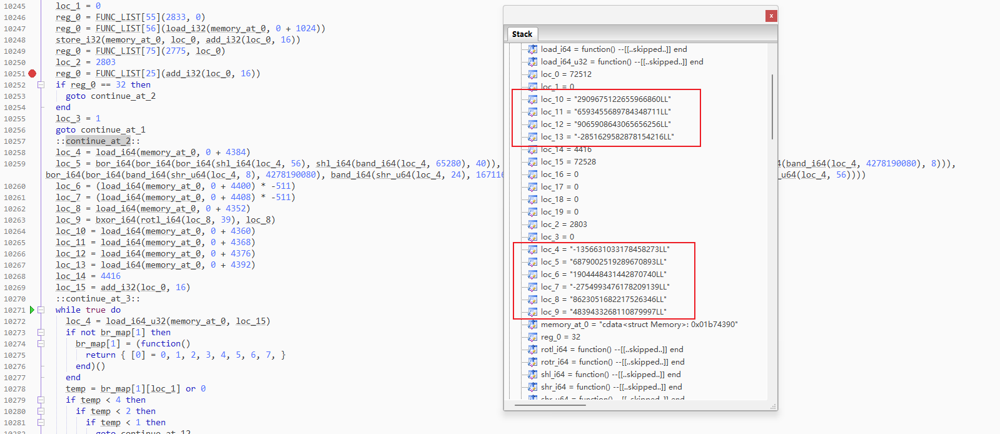
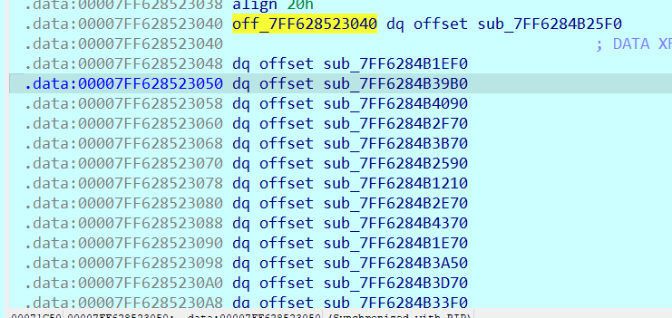
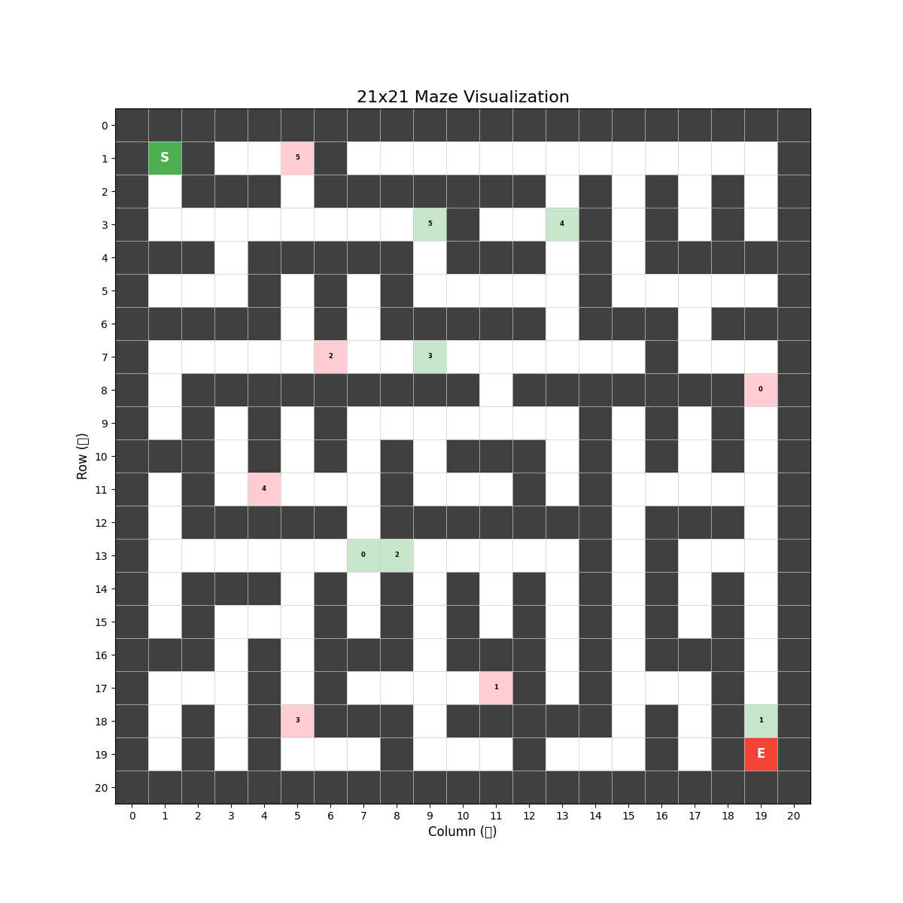

# SekaiCTF 2025 复现

## Sekai Bank - Signature

根据题目名称知道和签名相关，发现给的app联网了，所以直接找api相关

找到一个ApiService的抽象类

~~~java
public interface ApiService {
    public static class RefreshTokenRequest {
        private String refreshToken;

        public RefreshTokenRequest(String s) {
            this.refreshToken = s;
        }

        public String getRefreshToken() {
            return this.refreshToken;
        }

        public void setRefreshToken(String s) {
            this.refreshToken = s;
        }
    }

    @PUT("auth/pin/change")
    Call changePin(@Body PinRequest arg1);

    @GET("user/search/{username}")
    Call findUserByUsername(@Path("username") String arg1);

    @GET("user/balance")
    Call getBalance();

    @POST("flag")
    Call getFlag(@Body FlagRequest arg1);

    @GET("user/profile")
    Call getProfile();

    @GET("transactions/recent")
    Call getRecentTransactions();

    @GET("transactions/{id}")
    Call getTransaction(@Path("id") String arg1);

    @GET("transactions")
    Call getTransactions(@Query("page") int arg1, @Query("limit") int arg2);

    @GET("user/profile")
    Call getUserProfile();

    @GET("health")
    Call healthCheck();

    @POST("auth/login")
    Call login(@Body LoginRequest arg1);

    @POST("auth/logout")
    Call logout();

    @POST("auth/refresh")
    Call refreshToken(@Body RefreshTokenRequest arg1);

    @POST("auth/register")
    Call register(@Body RegisterRequest arg1);

    @POST("transactions/send")
    Call sendMoney(@Body SendMoneyRequest arg1);

    @POST("auth/pin/setup")
    Call setupPin(@Body PinRequest arg1);

    @POST("auth/pin/verify")
    Call verifyPin(@Body PinRequest arg1);
}
~~~

里面有个getFlag，但是没有被调用，因此需要我们主动调用。FlagRequest类如下，可以知道需要post传参一个bool值unmask_flag

~~~java
package com.sekai.bank.models.requests;

public class FlagRequest {
    private boolean unmask_flag;

    public FlagRequest(boolean z) {
        this.unmask_flag = z;
    }

    public boolean getUnmaskFlag() {
        return this.unmask_flag;
    }

    public void setUnmaskFlag(boolean z) {
        this.unmask_flag = z;
    }
}
~~~

有了ApiService来看ApiClient

~~~java
public class ApiClient {
    class AuthInterceptor implements Interceptor {
        private AuthInterceptor() {
        }

        AuthInterceptor(ApiClient-IA apiClient-IA0) {
        }

        private Request addAuthHeader(Request request0, String s) {
            return request0.newBuilder().header("Authorization", "Bearer " + s).build();
        }

        private boolean executeTokenRefresh(String s) throws Exception {
            RefreshTokenRequest apiService$RefreshTokenRequest0 = new RefreshTokenRequest(s);
            Response response0 = ApiClient.this.apiService.refreshToken(apiService$RefreshTokenRequest0).execute();
            if(response0.isSuccessful() && response0.body() != null && ((ApiResponse)response0.body()).isSuccess()) {
                AuthResponse authResponse0 = (AuthResponse)((ApiResponse)response0.body()).getData();
                ApiClient.this.tokenManager.saveTokens(authResponse0.getAccessToken(), authResponse0.getRefreshToken(), authResponse0.getUser().getId(), authResponse0.getUser().getUsername(), System.currentTimeMillis() + authResponse0.getExpiresIn() * 1000L).get(3L, TimeUnit.SECONDS);
                return true;
            }

            return false;
        }

        private String getAccessTokenWithTimeout() {
            try {
                return (String)ApiClient.this.tokenManager.getAccessToken().get(2L, TimeUnit.SECONDS);
            }
            catch(Exception unused_ex) {
                return null;
            }
        }

        private okhttp3.Response handleTokenRefresh(Chain interceptor$Chain0, Request request0) throws IOException {
            if(this.refreshToken()) {
                String s = this.getAccessTokenWithTimeout();
                return s == null || s.isEmpty() ? interceptor$Chain0.proceed(request0) : interceptor$Chain0.proceed(this.addAuthHeader(request0, s));
            }

            return interceptor$Chain0.proceed(request0);
        }

        @Override  // okhttp3.Interceptor
        public okhttp3.Response intercept(Chain interceptor$Chain0) throws IOException {
            Request request0 = interceptor$Chain0.request();
            if(this.isAuthEndpoint(request0.url().toString())) {
                return interceptor$Chain0.proceed(request0);
            }

            String s = this.getAccessTokenWithTimeout();
            if(s != null && !s.isEmpty()) {
                okhttp3.Response response0 = interceptor$Chain0.proceed(this.addAuthHeader(request0, s));
                if(response0.code() == 401 && !this.isRefreshEndpoint(request0.url().toString())) {
                    response0.close();
                    return this.handleTokenRefresh(interceptor$Chain0, request0);
                }

                return response0;
            }

            return interceptor$Chain0.proceed(request0);
        }

        private boolean isAuthEndpoint(String s) {
            return s.contains("/auth/login") || s.contains("/auth/register") || s.contains("/health");
        }

        private boolean isRefreshEndpoint(String s) {
            return s.contains("/auth/refresh");
        }

        private boolean refreshToken() {
            try {
                TimeUnit timeUnit0 = TimeUnit.SECONDS;
                String s = (String)ApiClient.this.tokenManager.getRefreshToken().get(2L, timeUnit0);
                if(s != null && !s.isEmpty()) {
                    return this.executeTokenRefresh(s);
                }
            }
            catch(Exception exception0) {
                Log.w("SekaiBank-API", "Token refresh failed: " + exception0.getMessage());
                return false;
            }

            return false;
        }
    }

    class ErrorInterceptor implements Interceptor {
        private ErrorInterceptor() {
        }

        ErrorInterceptor(ApiClient-IA apiClient-IA0) {
        }

        private void handleErrorCode(int v) {
            if(v == 403) {
                ApiClient.this.tokenManager.clearTokens();
            }
        }

        @Override  // okhttp3.Interceptor
        public okhttp3.Response intercept(Chain interceptor$Chain0) throws IOException {
            okhttp3.Response response0 = interceptor$Chain0.proceed(interceptor$Chain0.request());
            this.handleErrorCode(response0.code());
            return response0;
        }
    }

    class SignatureInterceptor implements Interceptor {
        private SignatureInterceptor() {
        }

        SignatureInterceptor(ApiClient-IA apiClient-IA0) {
        }

        private String calculateHMAC(String s, byte[] arr_b) throws GeneralSecurityException {
            Mac mac0 = Mac.getInstance("HmacSHA256");
            mac0.init(new SecretKeySpec(arr_b, "HmacSHA256"));
            byte[] arr_b1 = mac0.doFinal(s.getBytes(StandardCharsets.UTF_8));
            StringBuilder stringBuilder0 = new StringBuilder();
            for(int v = 0; v < arr_b1.length; ++v) {
                String s1 = Integer.toHexString(arr_b1[v] & 0xFF);
                if(s1.length() == 1) {
                    stringBuilder0.append('0');
                }

                stringBuilder0.append(s1);
            }

            return stringBuilder0.toString().toLowerCase();
        }

        private String generateSignature(Request request0) throws IOException, GeneralSecurityException {
            Signature[] arr_signature;
            String s = request0.method() + ("/api" + this.getEndpointPath(request0)) + this.getRequestBodyAsString(request0);
            PackageManager packageManager0 = SekaiApplication.getInstance().getPackageManager();
            try {
                if(Build.VERSION.SDK_INT >= 28) {
                    PackageInfo packageInfo0 = packageManager0.getPackageInfo("com.sekai.bank", 0x8000000);
                    SigningInfo signingInfo0 = packageInfo0.signingInfo;
                    if(signingInfo0 == null) {
                        arr_signature = packageInfo0.signatures;
                    }
                    else if(signingInfo0.hasMultipleSigners()) {
                        arr_signature = signingInfo0.getApkContentsSigners();
                    }
                    else {
                        arr_signature = signingInfo0.getSigningCertificateHistory();
                    }
                }
                else {
                    arr_signature = packageManager0.getPackageInfo("com.sekai.bank", 0x40).signatures;
                }

                if(arr_signature != null && arr_signature.length > 0) {
                    MessageDigest messageDigest0 = MessageDigest.getInstance("SHA-256");
                    for(int v = 0; v < arr_signature.length; ++v) {
                        messageDigest0.update(arr_signature[v].toByteArray());
                    }

                    return this.calculateHMAC(s, messageDigest0.digest());
                }

                throw new GeneralSecurityException("No app signature found");
            }
            catch(PackageManager.NameNotFoundException | NoSuchAlgorithmException packageManager$NameNotFoundException0) {
                throw new GeneralSecurityException("Unable to extract app signature", packageManager$NameNotFoundException0);
            }
        }

        private String getEndpointPath(Request request0) {
            String s = request0.url().toString();
            return s.startsWith("https://sekaibank-api.chals.sekai.team/api") ? s.substring(42) : request0.url().encodedPath();
        }

        private String getRequestBodyAsString(Request request0) throws IOException {
            RequestBody requestBody0 = request0.body();
            if(requestBody0 == null) {
                return "{}";
            }

            if(this.isMultipartBody(requestBody0)) {
                Log.d("SekaiBank-API", "Multipart request detected, using empty body for signature");
                return "{}";
            }

            Buffer buffer0 = new Buffer();
            requestBody0.writeTo(buffer0);
            return buffer0.readUtf8();
        }

        @Override  // okhttp3.Interceptor
        public okhttp3.Response intercept(Chain interceptor$Chain0) throws IOException {
            Request request0 = interceptor$Chain0.request();
            try {
                String s = this.generateSignature(request0);
                return interceptor$Chain0.proceed(request0.newBuilder().header("X-Signature", s).build());
            }
            catch(Exception exception0) {
                Log.e("SekaiBank-API", "Failed to generate signature: " + exception0.getMessage());
                return interceptor$Chain0.proceed(request0);
            }
        }

        private boolean isMultipartBody(RequestBody requestBody0) {
            MediaType mediaType0 = requestBody0.contentType();
            return mediaType0 != null && mediaType0.type().equals("multipart") && mediaType0.subtype().equals("form-data");
        }
    }

    private static final String BASE_URL = "https://sekaibank-api.chals.sekai.team/api/";
    private static final int REFRESH_TIMEOUT_SECONDS = 3;
    private static final String TAG = "SekaiBank-API";
    private static final int TIMEOUT_SECONDS = 30;
    private static final int TOKEN_TIMEOUT_SECONDS = 2;
    private final ApiService apiService;
    private final Retrofit retrofit;
    private final TokenManager tokenManager;

    public ApiClient(TokenManager tokenManager0) {
        this.tokenManager = tokenManager0;
        Gson gson0 = new GsonBuilder().setDateFormat("yyyy-MM-dd\'T\'HH:mm:ss.SSSZ").create();
        OkHttpClient okHttpClient0 = new Builder().connectTimeout(30L, TimeUnit.SECONDS).readTimeout(30L, TimeUnit.SECONDS).writeTimeout(30L, TimeUnit.SECONDS).addInterceptor(this.createLoggingInterceptor()).addInterceptor(new SignatureInterceptor(this, null)).addInterceptor(new AuthInterceptor(this, null)).addInterceptor(new ErrorInterceptor(this, null)).build();
        Retrofit retrofit0 = new retrofit2.Retrofit.Builder().baseUrl("https://sekaibank-api.chals.sekai.team/api/").client(okHttpClient0).addConverterFactory(GsonConverterFactory.create(gson0)).build();
        this.retrofit = retrofit0;
        this.apiService = (ApiService)retrofit0.create(ApiService.class);
    }

    private HttpLoggingInterceptor createLoggingInterceptor() {
        HttpLoggingInterceptor httpLoggingInterceptor0 = new HttpLoggingInterceptor();
        httpLoggingInterceptor0.setLevel(Level.BODY);
        return httpLoggingInterceptor0;
    }

    public ApiService getApiService() {
        return this.apiService;
    }
}
~~~

粗略看下可以知道核心在SignatureInterceptor类里，generateSignature正是题目说的签名。可以知道接口开头是`https://sekaibank-api.chals.sekai.team/api`，header里需要带有**X-Signature**，这个值正是由generateSignature生成

所以重点分析generateSignature，可以知道里面又调用了calculateHMAC，传入的s是接口拼接后的内容，传入的messageDigest0.digest()是每个apl固定的，所以我们可以直接hook calculateHMAC替换掉s，拿到正确的HMAC值，然后模拟requests post即可。首先hook替换掉calculateHMAC的输入值（随便login即可）

~~~js
Java.perform(function () {
    let SignatureInterceptor = Java.use("com.sekai.bank.network.ApiClient$SignatureInterceptor");
    SignatureInterceptor["generateSignature"].implementation = function (request) {
        console.log(`SignatureInterceptor.generateSignature is called: request=${request}`);
        let result = this["generateSignature"](request);
        console.log(`result=${result}`);
        return result;
    };
    SignatureInterceptor["calculateHMAC"].implementation = function (str, bArr) {
        console.log(`SignatureInterceptor.calculateHMAC is called: str=${str}, bArr=${bArr}`);
        str = "POST/api/flag{\"unmask_flag\":true}"
        console.log(`SignatureInterceptor.calculateHMAC is called: str=${str}, bArr=${bArr}`);
        let result = this["calculateHMAC"](str, bArr);
        console.log(`SignatureInterceptor.calculateHMAC result=${result}`);
        return result;
    };
})
~~~

拿到HMAC值为440ba2925730d137259f297fd6fba02af2f7b6c414dd16a1ac336e9047cdb8f5

~~~
SignatureInterceptor.generateSignature is called: request=Request{method=POST, url=https://sekaibank-api.chals.sekai.team/api/auth/login, tags={class retrofit2.Invocation=com.sekai.bank.network.ApiService.login() [com.sekai.bank.models.requests.LoginRequest@83c094c]}}
SignatureInterceptor.calculateHMAC is called: str=POST/api/auth/login{"password":"aaaaaa","username":"aaaa"}, bArr=63,60,-8,-125,10,-52,-106,83,13,85,100,49,127,-28,-128,-85,88,29,-4,85,-20,-113,-27,94,103,-35,-37,-31,-3,-74,5,-66
SignatureInterceptor.calculateHMAC is called: str=POST/api/flag{"unmask_flag":true}, bArr=63,60,-8,-125,10,-52,-106,83,13,85,100,49,127,-28,-128,-85,88,29,-4,85,-20,-113,-27,94,103,-35,-37,-31,-3,-74,5,-66
SignatureInterceptor.calculateHMAC result=440ba2925730d137259f297fd6fba02af2f7b6c414dd16a1ac336e9047cdb8f5
result=440ba2925730d137259f297fd6fba02af2f7b6c414dd16a1ac336e9047cdb8f5
~~~

~~~python
import requests

data = requests.post("http://149.28.148.83:3000/api/flag", json={"unmask_flag": True}, headers={"X-Signature": "440ba2925730d137259f297fd6fba02af2f7b6c414dd16a1ac336e9047cdb8f5"})
print(data.text)
~~~

## Gondola

试了好多遍普通lua跑不起来，最后发现需要编译[luajit](https://github.com/LuaJIT/LuaJIT)，同时搭配[ZeroBrane Studio](https://studio.zerobrane.com/doc-luajit-debugging)进行调试

重点关注FUNC_LIST[78]函数，里面是逻辑校验部分。前面调试可知对输入做了长度校验，要求必须32，否则直接返回1

~~~lua
FUNC_LIST[78] = function()
	local loc_0 = 0
	local loc_1 = 0
	local loc_2 = 0
	local loc_3 = 0
	local loc_4 = 0
	local loc_5 = 0
	local loc_6 = 0
	local loc_7 = 0
	local loc_8 = 0
	local loc_9 = 0
	local loc_10 = 0
	local loc_11 = 0
	local loc_12 = 0
	local loc_13 = 0
	local loc_14 = 0
	local loc_15 = 0
	local loc_16 = 0
	local loc_17 = 0
	local loc_18 = 0
	local loc_19 = 0
	local reg_0
	local br_map, temp = {}, nil
	loc_0 = sub_i32(GLOBAL_LIST[0].value, 128)
	GLOBAL_LIST[0].value = loc_0
	loc_1 = 0
	reg_0 = FUNC_LIST[55](2833, 0)	
	reg_0 = FUNC_LIST[56](load_i32(memory_at_0, 0 + 1024))	-- 打印Enter flag
	store_i32(memory_at_0, loc_0, add_i32(loc_0, 16))
	reg_0 = FUNC_LIST[75](2775, loc_0)	-- 输入
	loc_2 = 2803
	reg_0 = FUNC_LIST[25](add_i32(loc_0, 16))	-- 获取输入长度
	if reg_0 == 32 then
		goto continue_at_2
	end
	loc_3 = 1
	goto continue_at_1
	::continue_at_2::
	loc_4 = load_i64(memory_at_0, 0 + 4384)
	loc_5 = bor_i64(bor_i64(bor_i64(shl_i64(loc_4, 56), shl_i64(band_i64(loc_4, 65280), 40)), bor_i64(shl_i64(band_i64(loc_4, 16711680), 24), shl_i64(band_i64(loc_4, 4278190080), 8))), bor_i64(bor_i64(band_i64(shr_u64(loc_4, 8), 4278190080), band_i64(shr_u64(loc_4, 24), 16711680)), bor_i64(band_i64(shr_u64(loc_4, 40), 65280), shr_u64(loc_4, 56))))
	loc_6 = (load_i64(memory_at_0, 0 + 4400) * -511)
	loc_7 = (load_i64(memory_at_0, 0 + 4408) * -511)
	loc_8 = load_i64(memory_at_0, 0 + 4352)
	loc_9 = bxor_i64(rotl_i64(loc_8, 39), loc_8)
	loc_10 = load_i64(memory_at_0, 0 + 4360)
	loc_11 = load_i64(memory_at_0, 0 + 4368)
	loc_12 = load_i64(memory_at_0, 0 + 4376)
	loc_13 = load_i64(memory_at_0, 0 + 4392)
	loc_14 = 4416
	loc_15 = add_i32(loc_0, 16)
	::continue_at_3::
	while true do
		loc_4 = load_i64_u32(memory_at_0, loc_15)
		if not br_map[1] then
			br_map[1] = (function()
				return { [0] = 0, 1, 2, 3, 4, 5, 6, 7, }
			end)()
		end
		temp = br_map[1][loc_1] or 0
		if temp < 4 then
			if temp < 2 then
				if temp < 1 then
					goto continue_at_12
				else
					goto continue_at_11
				end
			elseif temp > 2 then
				goto continue_at_9
			else
				goto continue_at_10
			end
		elseif temp > 4 then
			if temp < 6 then
				goto continue_at_7
			elseif temp > 6 then
				goto continue_at_5
			else
				goto continue_at_6
			end
		else
			goto continue_at_8
		end
		::continue_at_12::
		loc_16 = band_i64(loc_4, 62)
		loc_17 = bor_i64(loc_16, 1)
		loc_18 = (bxor_i64(rotl_i64(loc_8, (band_i64(shl_i64(-2841402449925361436, loc_16), 36) + 49)), loc_9) + bxor_i64((rotr_i64(shr_u64(4759118972362874166, loc_16), loc_17) - loc_4), -3306012594466711124))
		loc_17 = rotl_i64((shl_i64(loc_18, bor_i64(band_i64((band_i64(shr_u64(4356822460271002287, loc_16), loc_4) + 28), 62), 1)) + loc_18), bor_i64(band_i64(rotl_i64(-3599654368322586570, loc_17), 14), 1))
		loc_17 = bxor_i64(shl_i64(loc_17, bor_i64(band_i64(((shr_u64((loc_4 * 742925643253982954), 56) + loc_4) * 47), 62), 1)), loc_17)
		loc_4 = bxor_i64(bxor_i64(rotr_i64(loc_17, bor_i64((shl_i64(-4774275202249070850, loc_16) * loc_4), 1)), rotl_i64(loc_17, 57)), loc_17)
		goto continue_at_4
		::continue_at_11::
		loc_18 = (loc_10 * bor_i64((loc_4 * 180512385711709), 7380094324862376181))
		loc_16 = band_i64(loc_4, 62)
		loc_17 = bor_i64(loc_16, 1)
		loc_18 = bxor_i64(shr_u64(loc_18, bor_i64(band_i64(rotr_i64((band_i64(shr_u64(1383475029465073410, loc_16), loc_4) - loc_4), loc_17), 62), 1)), loc_18)
		loc_4 = bxor_i64(bxor_i64(rotl_i64(loc_18, bor_i64(shr_u64(((loc_4 * -8341237817759413455) + 5858299301512691920), loc_17), 1)), rotl_i64(loc_18, bor_i64(shr_u64(shl_i64((1003390 - loc_4), loc_17), 15), 1))), loc_18)
		loc_4 = (bor_i64(bor_i64(bor_i64(shl_i64(loc_4, 56), shl_i64(band_i64(loc_4, 65280), 40)), bor_i64(shl_i64(band_i64(loc_4, 16711680), 24), shl_i64(band_i64(loc_4, 4278190080), 8))), bor_i64(bor_i64(band_i64(shr_u64(loc_4, 8), 4278190080), band_i64(shr_u64(loc_4, 24), 16711680)), bor_i64(band_i64(shr_u64(loc_4, 40), 65280), shr_u64(loc_4, 56)))) + band_i64((shl_i64(-6512376135701343602, loc_16) + 9021780107656055508), 4886913136624203210))
		goto continue_at_4
		::continue_at_10::
		loc_16 = band_i64(loc_4, 62)
		loc_17 = (bxor_i64(bxor_i64(rotr_i64(loc_11, bor_i64(bxor_i64((loc_4 * 52), loc_4), 1)), rotr_i64(loc_11, bxor_i64(shl_i64(1150443877981745306, loc_16), 11))), loc_11) * bor_i64(bxor_i64((shl_i64(-1314727533138742334, loc_16) + loc_4), -1), 1))
		loc_17 = bxor_i64(bxor_i64(rotl_i64(loc_17, bor_i64(shr_u64(((band_i64(loc_4, 81990) * 48316) + 15360), 11), 1)), rotl_i64(loc_17, 53)), loc_17)
		loc_16 = bxor_i64(bxor_i64(rotl_i64(loc_17, bor_i64(shr_u64((shl_i64(shr_u64(6474080420971629382, loc_16), 11) + 1321443404618737664), 56), 1)), rotl_i64(loc_17, bor_i64((0 - band_i64(loc_4, 14)), 27))), loc_17)
		loc_16 = (loc_16 - shl_i64(loc_16, bor_i64(band_i64((29 - loc_4), 62), 1)))
		loc_4 = bxor_i64(bxor_i64(rotl_i64(loc_16, 63), rotr_i64(loc_16, bor_i64((band_i64((rotr_i64(499867118132017422, bor_i64(loc_4, 1)) - loc_4), loc_4) - loc_4), 1))), loc_16)
		goto continue_at_4
		::continue_at_9::
		loc_16 = band_i64(loc_4, 62)
		loc_17 = bor_i64(loc_16, 1)
		loc_18 = bxor_i64((rotl_i64(loc_12, bor_i64(rotr_i64(rotl_i64(-3680473152504818101, loc_17), loc_17), 1)) + rotl_i64(bxor_i64(band_i64((2924367758 - loc_4), loc_4), -1), 49)), rotl_i64(shr_u64(bor_i64(loc_4, 323389404160168651), loc_17), loc_17))
		loc_19 = shr_u64(4824063971456177356, loc_16)
		loc_18 = bxor_i64(shr_u64(loc_18, bor_i64(shr_u64(bor_i64(shl_i64(band_i64(loc_19, 1792), 40), shl_i64(band_i64(loc_19, 12582912), 24)), 45), 1)), loc_18)
		loc_18 = bxor_i64(bxor_i64(rotl_i64(loc_18, bor_i64(shr_u64((loc_4 + 565), 5), 1)), rotr_i64(loc_18, bor_i64(shr_u64(shl_i64(-7575533352951092208, loc_16), 56), 1))), loc_18)
		loc_18 = bxor_i64(shl_i64(loc_18, bor_i64(band_i64(loc_4, 46), 17)), loc_18)
		loc_18 = (shl_i64(loc_18, bor_i64(band_i64((bxor_i64(shl_i64(-5156880989505199132, loc_16), -1) * loc_4), 62), 1)) + loc_18)
		loc_4 = (loc_18 - shl_i64(loc_18, bor_i64(band_i64(shl_i64((shr_u64(5172634985249747992, loc_16) - loc_4), loc_17), 62), 1)))
		goto continue_at_4
		::continue_at_8::
		reg_0 = bxor_i64(rotl_i64(loc_5, bor_i64((loc_4 * 55), 1)), -4619238845427684646)
		loc_4 = bxor_i64((loc_4 + -4616715144965187269), -8569173798327520083)
		loc_4 = ((reg_0 + bor_i64(band_i64(shr_u64(loc_4, 8), 3741319168), bor_i64(bor_i64(shl_i64(loc_4, 56), shl_i64(band_i64(loc_4, 65280), 40)), bor_i64(shl_i64(band_i64(loc_4, 16711680), 24), shl_i64(band_i64(loc_4, 4278190080), 8))))) + 1047094)
		loc_4 = bxor_i64(shl_i64(loc_4, 39), loc_4)
		goto continue_at_4
		::continue_at_7::
		loc_17 = (loc_13 + bxor_i64(loc_4, 36051668767407190))
		loc_18 = band_i64(loc_4, 62)
		loc_16 = bor_i64(loc_18, 1)
		loc_17 = ((loc_17 - bor_i64(rotl_i64(rotr_i64(-7384894205260299553, loc_16), loc_16), -2299178146027875472)) + shl_i64(loc_17, bor_i64(band_i64(((band_i64(loc_4, 8) * loc_4) + 26), 58), 1)))
		loc_4 = bxor_i64(bxor_i64(loc_17, shl_i64(loc_17, bor_i64(band_i64((shl_i64(shr_i64(-4331792876883399301, loc_18), loc_16) + loc_4), 62), 1))), 5185608289172264064)
		goto continue_at_4
		::continue_at_6::
		loc_16 = band_i64(loc_4, 62)
		loc_17 = bor_i64(loc_16, 1)
		loc_17 = (loc_6 + band_i64(rotr_i64(shr_u64(bor_i64(loc_4, -5056680446052056208), loc_17), loc_17), -7361207612496853418))
		loc_17 = bxor_i64(bxor_i64(rotr_i64(loc_17, bxor_i64(band_i64(loc_16, (loc_4 + 40)), 13)), rotl_i64(loc_17, bor_i64((bxor_i64((loc_4 + 22), 30) - loc_4), 1))), loc_17)
		loc_4 = (((((-6610288770926234540 - loc_4) * 3123491549520060319) + bxor_i64(loc_17, -1)) + shl_i64((loc_17 + 1), bor_i64(band_i64(bor_i64(shr_u64(2315141858787142786, loc_16), loc_4), 62), 1))) * 8796093022209)
		goto continue_at_4
		::continue_at_5::
		loc_16 = band_i64(loc_4, 62)
		loc_17 = bor_i64(loc_16, 1)
		loc_17 = (loc_7 + band_i64(rotr_i64(shr_u64(bor_i64(loc_4, -5056680446052056208), loc_17), loc_17), -7361207612496853418))
		loc_17 = bxor_i64(bxor_i64(rotr_i64(loc_17, bxor_i64(band_i64(loc_16, (loc_4 + 40)), 13)), rotl_i64(loc_17, bor_i64((bxor_i64((loc_4 + 22), 30) - loc_4), 1))), loc_17)
		loc_4 = (((((-6610288770926234540 - loc_4) * 3123491549520060319) + bxor_i64(loc_17, -1)) + shl_i64((loc_17 + 1), bor_i64(band_i64(bor_i64(shr_u64(2315141858787142786, loc_16), loc_4), 62), 1))) * 8796093022209)
		::continue_at_4::
		loc_3 = 0
		if loc_4 ~= load_i64(memory_at_0, loc_14) then
			goto continue_at_1
		end
		loc_15 = add_i32(loc_15, 4)
		loc_14 = add_i32(loc_14, 8)
		loc_1 = add_i32(loc_1, 1)
		if loc_1 ~= 8 then
			goto continue_at_3
		end
		break
	end
	loc_2 = 2819
	::continue_at_1::
	reg_0 = FUNC_LIST[77](loc_2)	-- 打印Incorrect flag!
	GLOBAL_LIST[0].value = add_i32(loc_0, 128)
	reg_0 = loc_3
	return reg_0
end
~~~

长度正确会来到`continue_at_2`处开始一系列初始化，多次切换输入后发现这些值是固定的，如下图所示

再往后进入循环分8次，每次读取4字节，然后根据temp分别跳转到8个加密位置

~~~lua
temp = br_map[1][loc_1] or 0
if temp < 4 then
    if temp < 2 then
        if temp < 1 then
            goto continue_at_12
        else
            goto continue_at_11
        end
    elseif temp > 2 then
        goto continue_at_9
    else
        goto continue_at_10
    end
elseif temp > 4 then
    if temp < 6 then
        goto continue_at_7
    elseif temp > 6 then
        goto continue_at_5
    else
        goto continue_at_6
    end
else
    goto continue_at_8
end
~~~

以第一个dword加密代码为例分析，loc\_4是输入

~~~lua
::continue_at_12::
loc_16 = band_i64(loc_4, 62)
loc_17 = bor_i64(loc_16, 1)
loc_18 = (bxor_i64(rotl_i64(loc_8, (band_i64(shl_i64(-2841402449925361436, loc_16), 36) + 49)), loc_9) + bxor_i64((rotr_i64(shr_u64(4759118972362874166, loc_16), loc_17) - loc_4), -3306012594466711124))
loc_17 = rotl_i64((shl_i64(loc_18, bor_i64(band_i64((band_i64(shr_u64(4356822460271002287, loc_16), loc_4) + 28), 62), 1)) + loc_18), bor_i64(band_i64(rotl_i64(-3599654368322586570, loc_17), 14), 1))
loc_17 = bxor_i64(shl_i64(loc_17, bor_i64(band_i64(((shr_u64((loc_4 * 742925643253982954), 56) + loc_4) * 47), 62), 1)), loc_17)
loc_4 = bxor_i64(bxor_i64(rotr_i64(loc_17, bor_i64((shl_i64(-4774275202249070850, loc_16) * loc_4), 1)), rotl_i64(loc_17, 57)), loc_17)
goto continue_at_4
::continue_at_11::
loc_18 = (loc_10 * bor_i64((loc_4 * 180512385711709), 7380094324862376181))
loc_16 = band_i64(loc_4, 62)
loc_17 = bor_i64(loc_16, 1)
loc_18 = bxor_i64(shr_u64(loc_18, bor_i64(band_i64(rotr_i64((band_i64(shr_u64(1383475029465073410, loc_16), loc_4) - loc_4), loc_17), 62), 1)), loc_18)
loc_4 = bxor_i64(bxor_i64(rotl_i64(loc_18, bor_i64(shr_u64(((loc_4 * -8341237817759413455) + 5858299301512691920), loc_17), 1)), rotl_i64(loc_18, bor_i64(shr_u64(shl_i64((1003390 - loc_4), loc_17), 15), 1))), loc_18)
loc_4 = (bor_i64(bor_i64(bor_i64(shl_i64(loc_4, 56), shl_i64(band_i64(loc_4, 65280), 40)), bor_i64(shl_i64(band_i64(loc_4, 16711680), 24), shl_i64(band_i64(loc_4, 4278190080), 8))), bor_i64(bor_i64(band_i64(shr_u64(loc_4, 8), 4278190080), band_i64(shr_u64(loc_4, 24), 16711680)), bor_i64(band_i64(shr_u64(loc_4, 40), 65280), shr_u64(loc_4, 56)))) + band_i64((shl_i64(-6512376135701343602, loc_16) + 9021780107656055508), 4886913136624203210))
goto continue_at_4
~~~

可以知道做的基本都是按位运算操作，比如and、or、xor这些，本来希望尝试直接在luajit代码上做修改来爆破，结果发现非常慢，主要还是字符太多了，还是得上python写多线程

懒得写python脚本复现了，贴个朋友的脚本

~~~python
from z3 import *
from multiprocessing import Pool

with open("mem.bin", "rb") as f:
    mem = bytearray(f.read())

def load(mem, addr, size=8, signed=False, endian='little'):
    return int.from_bytes(mem[addr:addr+size], byteorder=endian, signed=signed)
# --------------------
# 64位运算工具函数
# --------------------
def shl_i64(x, k, bits=64):
    mask = (1 << bits) - 1
    k %= bits
    return (x << k) & mask

def shr_u64(x, k, bits=64):
    mask = (1 << bits) - 1
    k %= bits
    return (x >> k) & mask

def shr_i64(x, k, bits=64):
    mask = (1 << bits) - 1
    k %= bits
    if x & (1 << (bits - 1)):
        # 负数算术右移
        x |= ~mask
    return (x >> k) & mask

def band_i64(x, y, bits=64):
    mask = (1 << bits) - 1
    return (x & y) & mask

def bor_i64(x, y, bits=64):
    mask = (1 << bits) - 1
    return (x | y) & mask

def bxor_i64(x, y, bits=64):
    mask = (1 << bits) - 1
    return (x ^ y) & mask

def rotl_i64(x, k, bits=64):
    mask = (1 << bits) - 1
    k %= bits
    x &= mask
    return ((x << k) | (x >> (bits - k))) & mask

def rotr_i64(x, k, bits=64):
    mask = (1 << bits) - 1
    k %= bits
    x &= mask
    return ((x >> k) | (x << (bits - k))) & mask

def add_i32(x, y, bits=32):
    mask = (1 << bits) - 1
    return (x + y) & mask

def part0(loc_4, loc_8, loc_9):
    mask64 = (1 << 64) - 1
    loc_16 = band_i64(loc_4, 62) & mask64
    loc_17 = bor_i64(loc_16, 1) & mask64
    loc_18 = (bxor_i64(rotl_i64(loc_8, (band_i64(shl_i64(-2841402449925361436, loc_16), 36) + 49)), loc_9)
              + bxor_i64((rotr_i64(shr_u64(4759118972362874166, loc_16), loc_17) - loc_4), -3306012594466711124)) & mask64
    loc_17 = rotl_i64((shl_i64(loc_18, bor_i64(band_i64((band_i64(shr_u64(4356822460271002287, loc_16), loc_4) + 28), 62), 1)) + loc_18),
                      bor_i64(band_i64(rotl_i64(-3599654368322586570, loc_17), 14), 1)) & mask64
    loc_17 = bxor_i64(shl_i64(loc_17, bor_i64(band_i64(((shr_u64((loc_4 * 742925643253982954), 56) + loc_4) * 47), 62), 1)), loc_17) & mask64
    loc_4 = bxor_i64(bxor_i64(rotr_i64(loc_17, bor_i64((shl_i64(-4774275202249070850, loc_16) * loc_4), 1)), rotl_i64(loc_17, 57)), loc_17) & mask64
    return loc_4 & mask64

def part1(loc_4, loc_10):
    mask64 = (1 << 64) - 1
    loc_16 = band_i64(loc_4, 62) & mask64
    loc_17 = bor_i64(loc_16, 1) & mask64
    loc_18 = (loc_10 * bor_i64((loc_4 * 180512385711709), 7380094324862376181)) & mask64
    loc_18 = bxor_i64(shr_u64(loc_18, bor_i64(band_i64(rotr_i64((band_i64(shr_u64(1383475029465073410, loc_16), loc_4) - loc_4), loc_17), 62), 1)), loc_18) & mask64
    loc_4 = bxor_i64(bxor_i64(rotl_i64(loc_18, bor_i64(shr_u64(((loc_4 * -8341237817759413455) + 5858299301512691920), loc_17), 1)),
                              rotl_i64(loc_18, bor_i64(shr_u64(shl_i64((1003390 - loc_4), loc_17), 15), 1))), loc_18) & mask64
    loc_4 = (bor_i64(bor_i64(bor_i64(shl_i64(loc_4, 56), shl_i64(band_i64(loc_4, 65280), 40)),
                             bor_i64(shl_i64(band_i64(loc_4, 16711680), 24), shl_i64(band_i64(loc_4, 4278190080), 8))),
                     bor_i64(bor_i64(band_i64(shr_u64(loc_4, 8), 4278190080), band_i64(shr_u64(loc_4, 24), 16711680)),
                             bor_i64(band_i64(shr_u64(loc_4, 40), 65280), shr_u64(loc_4, 56)))) + band_i64((shl_i64(-6512376135701343602, loc_16) + 9021780107656055508), 4886913136624203210)) & mask64
    return loc_4 & mask64

def part2(loc_4, loc_11):
    mask64 = (1 << 64) - 1
    loc_16 = band_i64(loc_4, 62) & mask64
    loc_17 = (bxor_i64(bxor_i64(rotr_i64(loc_11, bor_i64(bxor_i64((loc_4 * 52), loc_4), 1)),
                             rotr_i64(loc_11, bxor_i64(shl_i64(1150443877981745306, loc_16), 11))), loc_11) * bor_i64(bxor_i64((shl_i64(-1314727533138742334, loc_16) + loc_4), -1), 1)) & mask64
    loc_17 = bxor_i64(bxor_i64(rotl_i64(loc_17, bor_i64(shr_u64(((band_i64(loc_4, 81990) * 48316) + 15360), 11), 1)),
                              rotl_i64(loc_17, 53)), loc_17) & mask64
    loc_16 = bxor_i64(bxor_i64(rotl_i64(loc_17, bor_i64(shr_u64((shl_i64(shr_u64(6474080420971629382, loc_16), 11) + 1321443404618737664), 56), 1)),
                              rotl_i64(loc_17, bor_i64((0 - band_i64(loc_4, 14)), 27))), loc_17) & mask64
    loc_16 = (loc_16 - shl_i64(loc_16, bor_i64(band_i64((29 - loc_4), 62), 1))) & mask64
    loc_4 = bxor_i64(bxor_i64(rotl_i64(loc_16, 63), rotr_i64(loc_16, bor_i64((band_i64((rotr_i64(499867118132017422, bor_i64(loc_4, 1)) - loc_4), loc_4) - loc_4), 1))), loc_16) & mask64
    return loc_4 & mask64

def part3(loc_4, loc_12):
    mask64 = (1 << 64) - 1
    loc_16 = band_i64(loc_4, 62) & mask64
    loc_17 = bor_i64(loc_16, 1) & mask64
    loc_18 = bxor_i64((rotl_i64(loc_12, bor_i64(rotr_i64(rotl_i64(-3680473152504818101, loc_17), loc_17), 1)) + rotl_i64(bxor_i64(band_i64((2924367758 - loc_4), loc_4), -1), 49)),
                      rotl_i64(shr_u64(bor_i64(loc_4, 323389404160168651), loc_17), loc_17)) & mask64
    loc_19 = shr_u64(4824063971456177356, loc_16) & mask64
    loc_18 = bxor_i64(shr_u64(loc_18, bor_i64(shr_u64(bor_i64(shl_i64(band_i64(loc_19, 1792), 40), shl_i64(band_i64(loc_19, 12582912), 24)), 45), 1)), loc_18) & mask64
    loc_18 = bxor_i64(bxor_i64(rotl_i64(loc_18, bor_i64(shr_u64((loc_4 + 565), 5), 1)),
                              rotr_i64(loc_18, bor_i64(shr_u64(shl_i64(-7575533352951092208, loc_16), 56), 1))), loc_18) & mask64
    loc_18 = bxor_i64(shl_i64(loc_18, bor_i64(band_i64(loc_4, 46), 17)), loc_18) & mask64
    loc_18 = (shl_i64(loc_18, bor_i64(band_i64((bxor_i64(shl_i64(-5156880989505199132, loc_16), -1) * loc_4), 62), 1)) + loc_18) & mask64
    loc_4 = (loc_18 - shl_i64(loc_18, bor_i64(band_i64(shl_i64((shr_u64(5172634985249747992, loc_16) - loc_4), loc_17), 62), 1))) & mask64
    return loc_4 & mask64

def part4(loc_4 , loc_5):
    mask64 = (1 << 64) - 1
    reg_0 = bxor_i64(rotl_i64(loc_5, bor_i64((loc_4 * 55), 1)), -4619238845427684646) & mask64
    loc_4 = bxor_i64((loc_4 + -4616715144965187269), -8569173798327520083) & mask64
    loc_4 = ((reg_0 + bor_i64(band_i64(shr_u64(loc_4, 8), 3741319168),
                             bor_i64(bor_i64(shl_i64(loc_4, 56), shl_i64(band_i64(loc_4, 65280), 40)),
                                     bor_i64(shl_i64(band_i64(loc_4, 16711680), 24), shl_i64(band_i64(loc_4, 4278190080), 8))))) + 1047094) & mask64
    loc_4 = bxor_i64(shl_i64(loc_4, 39), loc_4) & mask64
    return loc_4 & mask64

def part5(loc_4, loc_13):
    mask64 = (1 << 64) - 1
    loc_17 = (loc_13 + bxor_i64(loc_4, 36051668767407190)) & mask64
    loc_18 = band_i64(loc_4, 62) & mask64
    loc_16 = bor_i64(loc_18, 1) & mask64
    loc_17 = (loc_17 - bor_i64(rotl_i64(rotr_i64(-7384894205260299553, loc_16), loc_16), -2299178146027875472) + shl_i64(loc_13 + bxor_i64(loc_4, 36051668767407190), bor_i64(band_i64(((band_i64(loc_4, 8) * loc_4) + 26), 58), 1))) & mask64
    loc_4 = bxor_i64(bxor_i64(loc_17, shl_i64(loc_17, bor_i64(band_i64((shl_i64(shr_i64(-4331792876883399301, loc_18), loc_16) + loc_4), 62), 1))), 5185608289172264064) & mask64
    return loc_4 & mask64

def part6(loc_4, loc_6):
    mask64 = (1 << 64) - 1
    loc_16 = band_i64(loc_4, 62) & mask64
    loc_17 = bor_i64(loc_16, 1) & mask64
    loc_17 = (loc_6 + band_i64(rotr_i64(shr_u64(bor_i64(loc_4, -5056680446052056208), loc_17), loc_17), -7361207612496853418)) & mask64
    loc_17 = bxor_i64(bxor_i64(rotr_i64(loc_17, bxor_i64(band_i64(loc_16, (loc_4 + 40)), 13)),
                              rotl_i64(loc_17, bor_i64((bxor_i64((loc_4 + 22), 30) - loc_4), 1))), loc_17) & mask64
    loc_4 = (((((-6610288770926234540 - loc_4) * 3123491549520060319) + bxor_i64(loc_17, -1)) + shl_i64((loc_17 + 1), bor_i64(band_i64(bor_i64(shr_u64(2315141858787142786, loc_16), loc_4), 62), 1))) * 8796093022209) & mask64
    return loc_4 & mask64

def part7(loc_4, loc_7):
    mask64 = (1 << 64) - 1

    loc_16 = band_i64(loc_4, 62) & mask64
    loc_17 = bor_i64(loc_16, 1) & mask64

    loc_17 = (loc_7 + band_i64(
        rotr_i64(shr_u64(bor_i64(loc_4, -5056680446052056208 & mask64), loc_17), loc_17),
        -7361207612496853418 & mask64)
    ) & mask64

    loc_17 = bxor_i64(
        bxor_i64(
            rotr_i64(loc_17, bxor_i64(band_i64(loc_16, (loc_4 + 40)), 13)),
            rotl_i64(loc_17, bor_i64((bxor_i64((loc_4 + 22), 30) - loc_4), 1)))
        , loc_17
    ) & mask64

    loc_4 = (
        (((-6610288770926234540 & mask64) - loc_4) * (3123491549520060319 & mask64)
         + bxor_i64(loc_17, -1 & mask64))
         + shl_i64((loc_17 + 1),
                   bor_i64(band_i64(bor_i64(shr_u64(2315141858787142786 & mask64, loc_16), loc_4), 62), 1)))
    loc_4 = (loc_4 * (8796093022209 & mask64)) & mask64

    return loc_4 & mask64

def worker0(b0):
    loc_8 = 0x77AB3BD16E69044A
    loc_9 = 0x43291EEABBF4ECFD
    target = load(mem, 4416)
    results = []
    for b1 in range(32, 127):
        for b2 in range(32, 127):
            for b3 in range(32, 127):
                t = b0 | (b1 << 8) | (b2 << 16) | (b3 << 24)
                out = part0(t, loc_8, loc_9)
                if out == target:
                    results.append((t, [b0,b1,b2,b3]))
    return results

def worker1(b0):
    loc_10 = 0x28613E1BA1B3368C
    target = load(mem, 4424)
    results = []
    for b1 in range(32, 127):
        for b2 in range(32, 127):
            for b3 in range(32, 127):
                t = b0 | (b1 << 8) | (b2 << 16) | (b3 << 24)
                out = part1(t, loc_10)
                if out == target:
                    results.append((t, [b0,b1,b2,b3]))
    return results

def worker2(b0):
    loc_11 = 0x5B80A90427DFD027
    target = load(mem, 4432)
    results = []
    for b1 in range(32, 127):
        for b2 in range(32, 127):
            for b3 in range(32, 127):
                t = b0 | (b1 << 8) | (b2 << 16) | (b3 << 24)
                out = part2(t, loc_11)
                if out == target:
                    results.append((t, [b0,b1,b2,b3]))
    return results

def worker3(b0):
    loc_12 = 0x7DD093E0AC1273C0
    target = load(mem, 4440)
    results = []
    for b1 in range(32, 127):
        for b2 in range(32, 127):
            for b3 in range(32, 127):
                t = b0 | (b1 << 8) | (b2 << 16) | (b3 << 24)
                out = part3(t, loc_12)
                if out == target:
                    results.append((t, [b0,b1,b2,b3]))
    return results

def worker4(b0):
    loc_5 = 0x5F77205843472CED
    target = load(mem, 4448)
    results = []
    for b1 in range(32, 127):
        for b2 in range(32, 127):
            for b3 in range(32, 127):
                t = b0 | (b1 << 8) | (b2 << 16) | (b3 << 24)
                out = part4(t, loc_5)
                if out == target:
                    results.append((t, [b0,b1,b2,b3]))
    return results

def worker5(b0):
    loc_13 = 0xD86CFA00C18D6218
    target = load(mem, 4456)
    results = []
    for b1 in range(32, 127):
        for b2 in range(32, 127):
            for b3 in range(32, 127):
                t = b0 | (b1 << 8) | (b2 << 16) | (b3 << 24)
                out = part5(t, loc_13)
                if out == target:
                    results.append((t, [b0,b1,b2,b3]))
    return results

def worker6(b0):
    loc_6 = 0x1A6DF5C21933C1D4
    target = load(mem, 4464)
    results = []
    for b1 in range(32, 127):
        for b2 in range(32, 127):
            for b3 in range(32, 127):
                t = b0 | (b1 << 8) | (b2 << 16) | (b3 << 24)
                out = part6(t, loc_6)
                if out == target:
                    results.append((t, [b0,b1,b2,b3]))
    return results

def worker7(b0):
    loc_7 = 0xD9C44C07ADE1168D
    target = load(mem,4472)
    results = []
    for b1 in range(32, 127):
        for b2 in range(32, 127):
            for b3 in range(32, 127):
                t = b0 | (b1 << 8) | (b2 << 16) | (b3 << 24)
                out = part7(t, loc_7)
                if out == target:
                    results.append((t, [b0,b1,b2,b3]))
    return results

if __name__ == "__main__":

    with Pool() as pool:
        all_results = pool.map(worker0, range(32,127))

    for group in all_results:
        for t, chars in group:
            print(f"t=0x{t:08X}, chars={''.join(chr(c) for c in chars)}")
    print("\n")

    with Pool() as pool:
        all_results = pool.map(worker1, range(32,127))

    for group in all_results:
        for t, chars in group:
            print(f"t=0x{t:08X}, chars={''.join(chr(c) for c in chars)}")
    print("\n")

    with Pool() as pool:
        all_results = pool.map(worker2, range(32,127))

    for group in all_results:
        for t, chars in group:
            print(f"t=0x{t:08X}, chars={''.join(chr(c) for c in chars)}")
    print("\n")

    with Pool() as pool:
        all_results = pool.map(worker3, range(32,127))

    for group in all_results:
        for t, chars in group:
            print(f"t=0x{t:08X}, chars={''.join(chr(c) for c in chars)}")
    print("\n")

    with Pool() as pool:
        all_results = pool.map(worker4, range(32,127))

    for group in all_results:
        for t, chars in group:
            print(f"t=0x{t:08X}, chars={''.join(chr(c) for c in chars)}")
    print("\n")

    with Pool() as pool:
        all_results = pool.map(worker5, range(32,127))

    for group in all_results:
        for t, chars in group:
            print(f"t=0x{t:08X}, chars={''.join(chr(c) for c in chars)}")
    print("\n")

    with Pool() as pool:
        all_results = pool.map(worker6, range(32,127))

    for group in all_results:
        for t, chars in group:
            print(f"t=0x{t:08X}, chars={''.join(chr(c) for c in chars)}")
    print("\n")
   
    with Pool() as pool:
        all_results = pool.map(worker7, range(32,127))

    for group in all_results:
        for t, chars in group:
            print(f"t=0x{t:08X}, chars={''.join(chr(c) for c in chars)}")
    print("\n")
~~~

中间有部分多解，官方放出了flag的sha256值

~~~python
import hashlib
import itertools
charset = "abcdefghijklmnopqrstuvwxyz0123456789_"
prefix = "SEKAI{lua_wa"
suffix = "s_very_fun_3hee}"
target = "204d015073f84763c0ff865d0fc4e046f882e2ade6afcf7bcb56904a6b96eb38"

for combo in itertools.product(charset, repeat=4):
    mid = "".join(combo)
    candidate = prefix + mid + suffix
    if hashlib.sha256(candidate.encode()).hexdigest() == target:
        print(candidate)
        break
~~~

## sekai-craft

> Attached zip is a Minecraft save file.
>
> Developed/tested on 1.21.8. When you click on the button, Minecraft can freeze for a few seconds - this is normal. It can also crash due to OOM (out of memory) - this is normal too.
>
> Wrap result string in `SEKAI{}` before submitting.

挺有意思的，在我的世界游戏包里藏了flag逻辑，拿了个2血

在datapacks/mvm/data/mvm/function/mvm.mcfunction中找到了类似log的地方

观察到开头设置了大量bit位以及一些变量

~~~
scoreboard players set $zero bit 0
scoreboard players set $two bit 2
scoreboard players set delta_0 bit 0
scoreboard players set delta_1 bit 1
scoreboard players set delta_2 bit 0
scoreboard players set delta_3 bit 1
scoreboard players set delta_4 bit 1
scoreboard players set delta_5 bit 0
scoreboard players set delta_6 bit 1
scoreboard players set delta_7 bit 1
scoreboard players set delta_8 bit 0
scoreboard players set delta_9 bit 0
scoreboard players set delta_10 bit 0
scoreboard players set delta_11 bit 1
scoreboard players set delta_12 bit 1
scoreboard players set delta_13 bit 0
scoreboard players set delta_14 bit 0
scoreboard players set delta_15 bit 1
scoreboard players set delta_16 bit 1
scoreboard players set delta_17 bit 1
scoreboard players set delta_18 bit 1
scoreboard players set delta_19 bit 1
scoreboard players set delta_20 bit 0
scoreboard players set delta_21 bit 1
scoreboard players set delta_22 bit 1
scoreboard players set delta_23 bit 1
scoreboard players set delta_24 bit 0
scoreboard players set delta_25 bit 1
scoreboard players set delta_26 bit 0
scoreboard players set delta_27 bit 1
scoreboard players set delta_28 bit 0
scoreboard players set delta_29 bit 0
scoreboard players set delta_30 bit 0
scoreboard players set delta_31 bit 0
...
scoreboard players set k0_0 bit 0
scoreboard players set k0_1 bit 1
scoreboard players set k0_2 bit 0
scoreboard players set k0_3 bit 1
scoreboard players set k0_4 bit 1
scoreboard players set k0_5 bit 0
scoreboard players set k0_6 bit 1
scoreboard players set k0_7 bit 1
scoreboard players set k0_8 bit 0
scoreboard players set k0_9 bit 0
scoreboard players set k0_10 bit 0
scoreboard players set k0_11 bit 1
scoreboard players set k0_12 bit 1
scoreboard players set k0_13 bit 1
scoreboard players set k0_14 bit 0
scoreboard players set k0_15 bit 0
scoreboard players set k0_16 bit 0
scoreboard players set k0_17 bit 0
scoreboard players set k0_18 bit 1
scoreboard players set k0_19 bit 0
scoreboard players set k0_20 bit 1
scoreboard players set k0_21 bit 1
scoreboard players set k0_22 bit 1
scoreboard players set k0_23 bit 0
scoreboard players set k0_24 bit 1
scoreboard players set k0_25 bit 1
scoreboard players set k0_26 bit 1
scoreboard players set k0_27 bit 1
scoreboard players set k0_28 bit 1
scoreboard players set k0_29 bit 0
scoreboard players set k0_30 bit 1
scoreboard players set k0_31 bit 0
scoreboard players set k1_0 bit 1
scoreboard players set k1_1 bit 1
scoreboard players set k1_2 bit 0
scoreboard players set k1_3 bit 1
scoreboard players set k1_4 bit 1
scoreboard players set k1_5 bit 1
scoreboard players set k1_6 bit 1
scoreboard players set k1_7 bit 1
scoreboard players set k1_8 bit 0
scoreboard players set k1_9 bit 0
scoreboard players set k1_10 bit 0
scoreboard players set k1_11 bit 0
scoreboard players set k1_12 bit 0
scoreboard players set k1_13 bit 1
scoreboard players set k1_14 bit 1
scoreboard players set k1_15 bit 0
scoreboard players set k1_16 bit 0
scoreboard players set k1_17 bit 1
scoreboard players set k1_18 bit 0
scoreboard players set k1_19 bit 1
scoreboard players set k1_20 bit 1
scoreboard players set k1_21 bit 1
scoreboard players set k1_22 bit 1
scoreboard players set k1_23 bit 1
scoreboard players set k1_24 bit 1
scoreboard players set k1_25 bit 0
scoreboard players set k1_26 bit 0
scoreboard players set k1_27 bit 0
scoreboard players set k1_28 bit 1
scoreboard players set k1_29 bit 1
scoreboard players set k1_30 bit 1
scoreboard players set k1_31 bit 1
scoreboard players set k2_0 bit 1
scoreboard players set k2_1 bit 0
scoreboard players set k2_2 bit 0
scoreboard players set k2_3 bit 1
scoreboard players set k2_4 bit 1
scoreboard players set k2_5 bit 1
scoreboard players set k2_6 bit 0
scoreboard players set k2_7 bit 0
scoreboard players set k2_8 bit 0
scoreboard players set k2_9 bit 1
scoreboard players set k2_10 bit 0
scoreboard players set k2_11 bit 0
scoreboard players set k2_12 bit 0
scoreboard players set k2_13 bit 1
scoreboard players set k2_14 bit 0
scoreboard players set k2_15 bit 0
scoreboard players set k2_16 bit 0
scoreboard players set k2_17 bit 0
scoreboard players set k2_18 bit 1
scoreboard players set k2_19 bit 1
scoreboard players set k2_20 bit 1
scoreboard players set k2_21 bit 0
scoreboard players set k2_22 bit 0
scoreboard players set k2_23 bit 1
scoreboard players set k2_24 bit 0
scoreboard players set k2_25 bit 0
scoreboard players set k2_26 bit 0
scoreboard players set k2_27 bit 1
scoreboard players set k2_28 bit 0
scoreboard players set k2_29 bit 1
scoreboard players set k2_30 bit 0
scoreboard players set k2_31 bit 0
scoreboard players set k3_0 bit 1
scoreboard players set k3_1 bit 0
scoreboard players set k3_2 bit 0
scoreboard players set k3_3 bit 1
scoreboard players set k3_4 bit 1
scoreboard players set k3_5 bit 1
scoreboard players set k3_6 bit 0
scoreboard players set k3_7 bit 1
scoreboard players set k3_8 bit 0
scoreboard players set k3_9 bit 0
scoreboard players set k3_10 bit 1
scoreboard players set k3_11 bit 1
scoreboard players set k3_12 bit 0
scoreboard players set k3_13 bit 1
scoreboard players set k3_14 bit 0
scoreboard players set k3_15 bit 0
scoreboard players set k3_16 bit 0
scoreboard players set k3_17 bit 0
scoreboard players set k3_18 bit 1
scoreboard players set k3_19 bit 0
scoreboard players set k3_20 bit 0
scoreboard players set k3_21 bit 0
scoreboard players set k3_22 bit 0
scoreboard players set k3_23 bit 0
scoreboard players set k3_24 bit 0
scoreboard players set k3_25 bit 0
scoreboard players set k3_26 bit 0
scoreboard players set k3_27 bit 1
scoreboard players set k3_28 bit 0
scoreboard players set k3_29 bit 0
scoreboard players set k3_30 bit 0
scoreboard players set k3_31 bit 1
scoreboard players set cipher0_0 bit 1
scoreboard players set cipher0_1 bit 1
scoreboard players set cipher0_2 bit 1
scoreboard players set cipher0_3 bit 1
scoreboard players set cipher0_4 bit 1
scoreboard players set cipher0_5 bit 1
scoreboard players set cipher0_6 bit 1
scoreboard players set cipher0_7 bit 1
scoreboard players set cipher0_8 bit 0
scoreboard players set cipher0_9 bit 0
scoreboard players set cipher0_10 bit 1
scoreboard players set cipher0_11 bit 0
scoreboard players set cipher0_12 bit 1
scoreboard players set cipher0_13 bit 0
scoreboard players set cipher0_14 bit 1
scoreboard players set cipher0_15 bit 1
scoreboard players set cipher0_16 bit 1
scoreboard players set cipher0_17 bit 0
scoreboard players set cipher0_18 bit 0
scoreboard players set cipher0_19 bit 0
scoreboard players set cipher0_20 bit 0
scoreboard players set cipher0_21 bit 1
scoreboard players set cipher0_22 bit 0
scoreboard players set cipher0_23 bit 0
scoreboard players set cipher0_24 bit 0
scoreboard players set cipher0_25 bit 0
scoreboard players set cipher0_26 bit 0
scoreboard players set cipher0_27 bit 0
scoreboard players set cipher0_28 bit 1
scoreboard players set cipher0_29 bit 0
scoreboard players set cipher0_30 bit 0
scoreboard players set cipher0_31 bit 0
scoreboard players set cipher1_0 bit 1
scoreboard players set cipher1_1 bit 0
scoreboard players set cipher1_2 bit 1
scoreboard players set cipher1_3 bit 1
scoreboard players set cipher1_4 bit 0
scoreboard players set cipher1_5 bit 1
scoreboard players set cipher1_6 bit 0
scoreboard players set cipher1_7 bit 1
scoreboard players set cipher1_8 bit 0
scoreboard players set cipher1_9 bit 1
scoreboard players set cipher1_10 bit 1
scoreboard players set cipher1_11 bit 1
scoreboard players set cipher1_12 bit 0
scoreboard players set cipher1_13 bit 1
scoreboard players set cipher1_14 bit 0
scoreboard players set cipher1_15 bit 0
scoreboard players set cipher1_16 bit 1
scoreboard players set cipher1_17 bit 1
scoreboard players set cipher1_18 bit 0
scoreboard players set cipher1_19 bit 1
scoreboard players set cipher1_20 bit 0
scoreboard players set cipher1_21 bit 1
scoreboard players set cipher1_22 bit 0
scoreboard players set cipher1_23 bit 0
scoreboard players set cipher1_24 bit 1
scoreboard players set cipher1_25 bit 1
scoreboard players set cipher1_26 bit 0
scoreboard players set cipher1_27 bit 0
scoreboard players set cipher1_28 bit 0
scoreboard players set cipher1_29 bit 1
scoreboard players set cipher1_30 bit 0
scoreboard players set cipher1_31 bit 1
scoreboard players set cipher2_0 bit 0
scoreboard players set cipher2_1 bit 1
scoreboard players set cipher2_2 bit 1
scoreboard players set cipher2_3 bit 1
scoreboard players set cipher2_4 bit 1
scoreboard players set cipher2_5 bit 0
scoreboard players set cipher2_6 bit 1
scoreboard players set cipher2_7 bit 0
scoreboard players set cipher2_8 bit 1
scoreboard players set cipher2_9 bit 0
scoreboard players set cipher2_10 bit 1
scoreboard players set cipher2_11 bit 1
scoreboard players set cipher2_12 bit 0
scoreboard players set cipher2_13 bit 0
scoreboard players set cipher2_14 bit 0
scoreboard players set cipher2_15 bit 1
scoreboard players set cipher2_16 bit 1
scoreboard players set cipher2_17 bit 1
scoreboard players set cipher2_18 bit 0
scoreboard players set cipher2_19 bit 0
scoreboard players set cipher2_20 bit 0
scoreboard players set cipher2_21 bit 0
scoreboard players set cipher2_22 bit 1
scoreboard players set cipher2_23 bit 1
scoreboard players set cipher2_24 bit 0
scoreboard players set cipher2_25 bit 0
scoreboard players set cipher2_26 bit 1
scoreboard players set cipher2_27 bit 0
scoreboard players set cipher2_28 bit 0
scoreboard players set cipher2_29 bit 0
scoreboard players set cipher2_30 bit 0
scoreboard players set cipher2_31 bit 0
scoreboard players set cipher3_0 bit 1
scoreboard players set cipher3_1 bit 1
scoreboard players set cipher3_2 bit 0
scoreboard players set cipher3_3 bit 1
scoreboard players set cipher3_4 bit 0
scoreboard players set cipher3_5 bit 0
scoreboard players set cipher3_6 bit 1
scoreboard players set cipher3_7 bit 0
scoreboard players set cipher3_8 bit 1
scoreboard players set cipher3_9 bit 0
scoreboard players set cipher3_10 bit 1
scoreboard players set cipher3_11 bit 1
scoreboard players set cipher3_12 bit 1
scoreboard players set cipher3_13 bit 0
scoreboard players set cipher3_14 bit 1
scoreboard players set cipher3_15 bit 0
scoreboard players set cipher3_16 bit 0
scoreboard players set cipher3_17 bit 1
scoreboard players set cipher3_18 bit 1
scoreboard players set cipher3_19 bit 0
scoreboard players set cipher3_20 bit 0
scoreboard players set cipher3_21 bit 1
scoreboard players set cipher3_22 bit 0
scoreboard players set cipher3_23 bit 1
scoreboard players set cipher3_24 bit 1
scoreboard players set cipher3_25 bit 0
scoreboard players set cipher3_26 bit 1
scoreboard players set cipher3_27 bit 0
scoreboard players set cipher3_28 bit 1
scoreboard players set cipher3_29 bit 0
scoreboard players set cipher3_30 bit 0
scoreboard players set cipher3_31 bit 0
scoreboard players set v0_0 bit 0
scoreboard players set v1_0 bit 0
scoreboard players set sum_0 bit 0
scoreboard players set v0_1 bit 0
scoreboard players set v1_1 bit 0
scoreboard players set sum_1 bit 0
scoreboard players set v0_2 bit 0
scoreboard players set v1_2 bit 0
scoreboard players set sum_2 bit 0
scoreboard players set v0_3 bit 0
scoreboard players set v1_3 bit 0
scoreboard players set sum_3 bit 0
scoreboard players set v0_4 bit 0
scoreboard players set v1_4 bit 0
scoreboard players set sum_4 bit 0
scoreboard players set v0_5 bit 0
scoreboard players set v1_5 bit 0
scoreboard players set sum_5 bit 0
scoreboard players set v0_6 bit 0
scoreboard players set v1_6 bit 0
scoreboard players set sum_6 bit 0
scoreboard players set v0_7 bit 0
scoreboard players set v1_7 bit 0
scoreboard players set sum_7 bit 0
scoreboard players set v0_8 bit 0
scoreboard players set v1_8 bit 0
scoreboard players set sum_8 bit 0
scoreboard players set v0_9 bit 0
scoreboard players set v1_9 bit 0
scoreboard players set sum_9 bit 0
scoreboard players set v0_10 bit 0
scoreboard players set v1_10 bit 0
scoreboard players set sum_10 bit 0
scoreboard players set v0_11 bit 0
scoreboard players set v1_11 bit 0
scoreboard players set sum_11 bit 0
scoreboard players set v0_12 bit 0
scoreboard players set v1_12 bit 0
scoreboard players set sum_12 bit 0
scoreboard players set v0_13 bit 0
scoreboard players set v1_13 bit 0
scoreboard players set sum_13 bit 0
scoreboard players set v0_14 bit 0
scoreboard players set v1_14 bit 0
scoreboard players set sum_14 bit 0
scoreboard players set v0_15 bit 0
scoreboard players set v1_15 bit 0
scoreboard players set sum_15 bit 0
scoreboard players set v0_16 bit 0
scoreboard players set v1_16 bit 0
scoreboard players set sum_16 bit 0
scoreboard players set v0_17 bit 0
scoreboard players set v1_17 bit 0
scoreboard players set sum_17 bit 0
scoreboard players set v0_18 bit 0
scoreboard players set v1_18 bit 0
scoreboard players set sum_18 bit 0
scoreboard players set v0_19 bit 0
scoreboard players set v1_19 bit 0
scoreboard players set sum_19 bit 0
scoreboard players set v0_20 bit 0
scoreboard players set v1_20 bit 0
scoreboard players set sum_20 bit 0
scoreboard players set v0_21 bit 0
scoreboard players set v1_21 bit 0
scoreboard players set sum_21 bit 0
scoreboard players set v0_22 bit 0
scoreboard players set v1_22 bit 0
scoreboard players set sum_22 bit 0
scoreboard players set v0_23 bit 0
scoreboard players set v1_23 bit 0
scoreboard players set sum_23 bit 0
scoreboard players set v0_24 bit 0
scoreboard players set v1_24 bit 0
scoreboard players set sum_24 bit 0
scoreboard players set v0_25 bit 0
scoreboard players set v1_25 bit 0
scoreboard players set sum_25 bit 0
scoreboard players set v0_26 bit 0
scoreboard players set v1_26 bit 0
scoreboard players set sum_26 bit 0
scoreboard players set v0_27 bit 0
scoreboard players set v1_27 bit 0
scoreboard players set sum_27 bit 0
scoreboard players set v0_28 bit 0
scoreboard players set v1_28 bit 0
scoreboard players set sum_28 bit 0
scoreboard players set v0_29 bit 0
scoreboard players set v1_29 bit 0
scoreboard players set sum_29 bit 0
scoreboard players set v0_30 bit 0
scoreboard players set v1_30 bit 0
scoreboard players set sum_30 bit 0
scoreboard players set v0_31 bit 0
scoreboard players set v1_31 bit 0
scoreboard players set sum_31 bit 0
~~~

从命名里我们隐约能感觉到有sum、delta、k0-k4、cipher、v0、v1，八成是TEA类加密

然后我们发现有重复的log记录，因此让ai写了个提取重复段落的脚本

~~~python
import hashlib
from collections import defaultdict

def find_duplicate_blocks(filepath, min_lines=5, encoding='utf-8'):
    """
    在一个文件中查找并报告重复的大段内容（连续的行）。

    Args:
        filepath (str): 文件的路径。
        min_lines (int): 一个代码块被视为“大段”所需的最小行数。
        encoding (str): 文件的编码格式。

    Returns:
        list: 一个包含所有重复内容组的列表。列表中的每个元素都是一个字典，
              格式为: {'locations': [行号列表], 'length': 块长度, 'content': '内容'}
    """
    try:
        with open(filepath, 'r', encoding=encoding) as f:
            lines = f.readlines()
    except FileNotFoundError:
        print(f"错误: 文件 '{filepath}' 未找到。")
        return []
    except Exception as e:
        print(f"读取文件时发生错误: {e}")
        return []

    num_lines = len(lines)
    if num_lines < min_lines * 2:
        return []  # 文件太短，不可能包含重复块

    # 步骤 1: 播种 - 使用哈希找到所有长度为 min_lines 的重复块的起始位置
    seeds = defaultdict(list)
    for i in range(num_lines - min_lines + 1):
        # 将一个代码块合并成一个字符串用于哈希计算
        block_for_hash = "".join(lines[i:i + min_lines])
        # 使用 SHA256 哈希算法为内容块生成一个“指纹”
        block_hash = hashlib.sha256(block_for_hash.encode(encoding, errors='ignore')).hexdigest()
        seeds[block_hash].append(i)

    # 过滤掉只出现一次的块，只保留重复出现的种子
    duplicate_seeds = {h: locs for h, locs in seeds.items() if len(locs) > 1}

    # 步骤 2: 扩展 - 从种子位置扩展匹配，并记录结果
    processed_lines = [False] * num_lines
    final_duplicates = []

    # 按文件顺序处理，以确保我们先处理前面的块
    # sorted_hashes = sorted(duplicate_seeds.keys(), key=lambda h: duplicate_seeds[h][0])

    # 使用一个简单的列表来迭代，避免在迭代时修改字典
    seed_items = sorted(duplicate_seeds.items(), key=lambda item: item[1][0])

    for _, locations in seed_items:
        # 如果这个种子的第一个起始位置已经被处理过，说明它是一个更大重复块的一部分，跳过
        if processed_lines[locations[0]]:
            continue

        # 开始扩展匹配
        current_length = min_lines
        while True:
            # 检查组内所有位置是否都能进行扩展
            try:
                # 获取第一个位置的下一行内容
                next_line_content = lines[locations[0] + current_length]
                all_match = True
                # 检查其他所有位置的下一行是否与第一个位置的相同
                for i in range(1, len(locations)):
                    if lines[locations[i] + current_length] != next_line_content:
                        all_match = False
                        break

                if all_match:
                    current_length += 1
                else:
                    break  # 内容不匹配，停止扩展
            except IndexError:
                # 任何一个位置到达了文件末尾，停止扩展
                break

        # 记录找到的完整重复块
        # 将0-based索引转换为1-based的行号，方便阅读
        report_locations = [loc + 1 for loc in locations]
        block_content = "".join(lines[locations[0]:locations[0] + current_length])

        final_duplicates.append({
            'locations': report_locations,
            'length': current_length,
            'content': block_content
        })

        # 步骤 3: 标记处理过的行，避免重复报告
        for loc in locations:
            for i in range(current_length):
                processed_lines[loc + i] = True

    return final_duplicates

if __name__ == '__main__':
    # --- 使用示例 ---

    # 1. 创建一个用于测试的临时文件
    dummy_content = open("datapacks/mvm/data/mvm/function/mvm.mcfunction").read()
    test_filepath = "my_test_file.txt"
    with open(test_filepath, "w", encoding="utf-8") as f:
        f.write(dummy_content)

    # 2. 调用函数进行查找
    # 我们定义一个块至少需要3行才算数
    min_block_size = 3
    duplicates = find_duplicate_blocks(test_filepath, min_lines=min_block_size)

    # 3. 格式化并打印结果
    if not duplicates:
        print(f"在文件 '{test_filepath}' 中没有找到超过 {min_block_size} 行的重复内容块。")
    else:
        print(f"在文件 '{test_filepath}' 中找到 {len(duplicates)} 组重复的内容块：\n")
        # 按块的长度降序排序，优先显示最大的重复块
        duplicates.sort(key=lambda x: x['length'], reverse=True)

        for i, dup_group in enumerate(duplicates):
            print(f"--- 组 {i + 1} ---")
            print(f"  长度: {dup_group['length']} 行")
            print(f"  位置 (起始行号): {dup_group['locations']}")
            print("  内容预览:")
            print("-" * 10)
            # 为了美观，给内容加上缩进
            indented_content = "".join([f"    {line}" for line in dup_group['content'].splitlines(True)])
            print(indented_content)
            print("-" * 10)
            print("\n")
~~~

看结果可以发现有两组重复片段，其中第一组非常长而且重复了64次，我们直接提取出来；另一组不算长，观察下可以发现是将v0、v1、sum置0的代码，不用看它了

我们先取出一组bit计算

~~~
scoreboard players operation $t0_sum_0 bit = sum_0 bit
scoreboard players operation $t0_sum_0 bit += delta_0 bit
scoreboard players operation $t0_sum_0 bit %= $two bit
scoreboard players operation $t1_sum_0 bit = sum_0 bit
scoreboard players operation $t1_sum_0 bit *= delta_0 bit
scoreboard players operation sum_0 bit = $t0_sum_0 bit
scoreboard players operation sum_0 bit += $cc bit
scoreboard players operation sum_0 bit %= $two bit
scoreboard players operation $t2_sum_0 bit = $cc bit
scoreboard players operation $t2_sum_0 bit *= $t0_sum_0 bit
scoreboard players operation $cc bit = $t1_sum_0 bit
scoreboard players operation $cc bit += $t2_sum_0 bit
scoreboard players operation $cc bit %= $two bit
~~~

可以看到实现的是全加器功能，相当于sum+=delta。接着取了sum\_0和sum\_1，也就是&3操作

~~~
scoreboard players operation $i0 bit = sum_0 bit
scoreboard players operation $i1 bit = sum_1 bit
execute if score $i0 bit matches 0 if score $i1 bit matches 0 run scoreboard players operation kSel_0 bit = k0_0 bit
execute if score $i0 bit matches 0 if score $i1 bit matches 0 run scoreboard players operation kSel_1 bit = k0_1 bit
execute if score $i0 bit matches 0 if score $i1 bit matches 0 run scoreboard players operation kSel_2 bit = k0_2 bit
execute if score $i0 bit matches 0 if score $i1 bit matches 0 run scoreboard players operation kSel_3 bit = k0_3 bit
execute if score $i0 bit matches 0 if score $i1 bit matches 0 run scoreboard players operation kSel_4 bit = k0_4 bit
execute if score $i0 bit matches 0 if score $i1 bit matches 0 run scoreboard players operation kSel_5 bit = k0_5 bit
execute if score $i0 bit matches 0 if score $i1 bit matches 0 run scoreboard players operation kSel_6 bit = k0_6 bit
execute if score $i0 bit matches 0 if score $i1 bit matches 0 run scoreboard players operation kSel_7 bit = k0_7 bit
execute if score $i0 bit matches 0 if score $i1 bit matches 0 run scoreboard players operation kSel_8 bit = k0_8 bit
execute if score $i0 bit matches 0 if score $i1 bit matches 0 run scoreboard players operation kSel_9 bit = k0_9 bit
execute if score $i0 bit matches 0 if score $i1 bit matches 0 run scoreboard players operation kSel_10 bit = k0_10 bit
execute if score $i0 bit matches 0 if score $i1 bit matches 0 run scoreboard players operation kSel_11 bit = k0_11 bit
execute if score $i0 bit matches 0 if score $i1 bit matches 0 run scoreboard players operation kSel_12 bit = k0_12 bit
execute if score $i0 bit matches 0 if score $i1 bit matches 0 run scoreboard players operation kSel_13 bit = k0_13 bit
execute if score $i0 bit matches 0 if score $i1 bit matches 0 run scoreboard players operation kSel_14 bit = k0_14 bit
execute if score $i0 bit matches 0 if score $i1 bit matches 0 run scoreboard players operation kSel_15 bit = k0_15 bit
execute if score $i0 bit matches 0 if score $i1 bit matches 0 run scoreboard players operation kSel_16 bit = k0_16 bit
execute if score $i0 bit matches 0 if score $i1 bit matches 0 run scoreboard players operation kSel_17 bit = k0_17 bit
execute if score $i0 bit matches 0 if score $i1 bit matches 0 run scoreboard players operation kSel_18 bit = k0_18 bit
execute if score $i0 bit matches 0 if score $i1 bit matches 0 run scoreboard players operation kSel_19 bit = k0_19 bit
execute if score $i0 bit matches 0 if score $i1 bit matches 0 run scoreboard players operation kSel_20 bit = k0_20 bit
execute if score $i0 bit matches 0 if score $i1 bit matches 0 run scoreboard players operation kSel_21 bit = k0_21 bit
execute if score $i0 bit matches 0 if score $i1 bit matches 0 run scoreboard players operation kSel_22 bit = k0_22 bit
execute if score $i0 bit matches 0 if score $i1 bit matches 0 run scoreboard players operation kSel_23 bit = k0_23 bit
execute if score $i0 bit matches 0 if score $i1 bit matches 0 run scoreboard players operation kSel_24 bit = k0_24 bit
execute if score $i0 bit matches 0 if score $i1 bit matches 0 run scoreboard players operation kSel_25 bit = k0_25 bit
execute if score $i0 bit matches 0 if score $i1 bit matches 0 run scoreboard players operation kSel_26 bit = k0_26 bit
execute if score $i0 bit matches 0 if score $i1 bit matches 0 run scoreboard players operation kSel_27 bit = k0_27 bit
execute if score $i0 bit matches 0 if score $i1 bit matches 0 run scoreboard players operation kSel_28 bit = k0_28 bit
execute if score $i0 bit matches 0 if score $i1 bit matches 0 run scoreboard players operation kSel_29 bit = k0_29 bit
execute if score $i0 bit matches 0 if score $i1 bit matches 0 run scoreboard players operation kSel_30 bit = k0_30 bit
execute if score $i0 bit matches 0 if score $i1 bit matches 0 run scoreboard players operation kSel_31 bit = k0_31 bit
execute if score $i0 bit matches 1 if score $i1 bit matches 0 run scoreboard players operation kSel_0 bit = k1_0 bit
execute if score $i0 bit matches 1 if score $i1 bit matches 0 run scoreboard players operation kSel_1 bit = k1_1 bit
execute if score $i0 bit matches 1 if score $i1 bit matches 0 run scoreboard players operation kSel_2 bit = k1_2 bit
execute if score $i0 bit matches 1 if score $i1 bit matches 0 run scoreboard players operation kSel_3 bit = k1_3 bit
execute if score $i0 bit matches 1 if score $i1 bit matches 0 run scoreboard players operation kSel_4 bit = k1_4 bit
execute if score $i0 bit matches 1 if score $i1 bit matches 0 run scoreboard players operation kSel_5 bit = k1_5 bit
execute if score $i0 bit matches 1 if score $i1 bit matches 0 run scoreboard players operation kSel_6 bit = k1_6 bit
execute if score $i0 bit matches 1 if score $i1 bit matches 0 run scoreboard players operation kSel_7 bit = k1_7 bit
execute if score $i0 bit matches 1 if score $i1 bit matches 0 run scoreboard players operation kSel_8 bit = k1_8 bit
execute if score $i0 bit matches 1 if score $i1 bit matches 0 run scoreboard players operation kSel_9 bit = k1_9 bit
execute if score $i0 bit matches 1 if score $i1 bit matches 0 run scoreboard players operation kSel_10 bit = k1_10 bit
execute if score $i0 bit matches 1 if score $i1 bit matches 0 run scoreboard players operation kSel_11 bit = k1_11 bit
execute if score $i0 bit matches 1 if score $i1 bit matches 0 run scoreboard players operation kSel_12 bit = k1_12 bit
execute if score $i0 bit matches 1 if score $i1 bit matches 0 run scoreboard players operation kSel_13 bit = k1_13 bit
execute if score $i0 bit matches 1 if score $i1 bit matches 0 run scoreboard players operation kSel_14 bit = k1_14 bit
execute if score $i0 bit matches 1 if score $i1 bit matches 0 run scoreboard players operation kSel_15 bit = k1_15 bit
execute if score $i0 bit matches 1 if score $i1 bit matches 0 run scoreboard players operation kSel_16 bit = k1_16 bit
execute if score $i0 bit matches 1 if score $i1 bit matches 0 run scoreboard players operation kSel_17 bit = k1_17 bit
execute if score $i0 bit matches 1 if score $i1 bit matches 0 run scoreboard players operation kSel_18 bit = k1_18 bit
execute if score $i0 bit matches 1 if score $i1 bit matches 0 run scoreboard players operation kSel_19 bit = k1_19 bit
execute if score $i0 bit matches 1 if score $i1 bit matches 0 run scoreboard players operation kSel_20 bit = k1_20 bit
execute if score $i0 bit matches 1 if score $i1 bit matches 0 run scoreboard players operation kSel_21 bit = k1_21 bit
execute if score $i0 bit matches 1 if score $i1 bit matches 0 run scoreboard players operation kSel_22 bit = k1_22 bit
execute if score $i0 bit matches 1 if score $i1 bit matches 0 run scoreboard players operation kSel_23 bit = k1_23 bit
execute if score $i0 bit matches 1 if score $i1 bit matches 0 run scoreboard players operation kSel_24 bit = k1_24 bit
execute if score $i0 bit matches 1 if score $i1 bit matches 0 run scoreboard players operation kSel_25 bit = k1_25 bit
execute if score $i0 bit matches 1 if score $i1 bit matches 0 run scoreboard players operation kSel_26 bit = k1_26 bit
execute if score $i0 bit matches 1 if score $i1 bit matches 0 run scoreboard players operation kSel_27 bit = k1_27 bit
execute if score $i0 bit matches 1 if score $i1 bit matches 0 run scoreboard players operation kSel_28 bit = k1_28 bit
execute if score $i0 bit matches 1 if score $i1 bit matches 0 run scoreboard players operation kSel_29 bit = k1_29 bit
execute if score $i0 bit matches 1 if score $i1 bit matches 0 run scoreboard players operation kSel_30 bit = k1_30 bit
execute if score $i0 bit matches 1 if score $i1 bit matches 0 run scoreboard players operation kSel_31 bit = k1_31 bit
execute if score $i0 bit matches 0 if score $i1 bit matches 1 run scoreboard players operation kSel_0 bit = k2_0 bit
execute if score $i0 bit matches 0 if score $i1 bit matches 1 run scoreboard players operation kSel_1 bit = k2_1 bit
execute if score $i0 bit matches 0 if score $i1 bit matches 1 run scoreboard players operation kSel_2 bit = k2_2 bit
execute if score $i0 bit matches 0 if score $i1 bit matches 1 run scoreboard players operation kSel_3 bit = k2_3 bit
execute if score $i0 bit matches 0 if score $i1 bit matches 1 run scoreboard players operation kSel_4 bit = k2_4 bit
execute if score $i0 bit matches 0 if score $i1 bit matches 1 run scoreboard players operation kSel_5 bit = k2_5 bit
execute if score $i0 bit matches 0 if score $i1 bit matches 1 run scoreboard players operation kSel_6 bit = k2_6 bit
execute if score $i0 bit matches 0 if score $i1 bit matches 1 run scoreboard players operation kSel_7 bit = k2_7 bit
execute if score $i0 bit matches 0 if score $i1 bit matches 1 run scoreboard players operation kSel_8 bit = k2_8 bit
execute if score $i0 bit matches 0 if score $i1 bit matches 1 run scoreboard players operation kSel_9 bit = k2_9 bit
execute if score $i0 bit matches 0 if score $i1 bit matches 1 run scoreboard players operation kSel_10 bit = k2_10 bit
execute if score $i0 bit matches 0 if score $i1 bit matches 1 run scoreboard players operation kSel_11 bit = k2_11 bit
execute if score $i0 bit matches 0 if score $i1 bit matches 1 run scoreboard players operation kSel_12 bit = k2_12 bit
execute if score $i0 bit matches 0 if score $i1 bit matches 1 run scoreboard players operation kSel_13 bit = k2_13 bit
execute if score $i0 bit matches 0 if score $i1 bit matches 1 run scoreboard players operation kSel_14 bit = k2_14 bit
execute if score $i0 bit matches 0 if score $i1 bit matches 1 run scoreboard players operation kSel_15 bit = k2_15 bit
execute if score $i0 bit matches 0 if score $i1 bit matches 1 run scoreboard players operation kSel_16 bit = k2_16 bit
execute if score $i0 bit matches 0 if score $i1 bit matches 1 run scoreboard players operation kSel_17 bit = k2_17 bit
execute if score $i0 bit matches 0 if score $i1 bit matches 1 run scoreboard players operation kSel_18 bit = k2_18 bit
execute if score $i0 bit matches 0 if score $i1 bit matches 1 run scoreboard players operation kSel_19 bit = k2_19 bit
execute if score $i0 bit matches 0 if score $i1 bit matches 1 run scoreboard players operation kSel_20 bit = k2_20 bit
execute if score $i0 bit matches 0 if score $i1 bit matches 1 run scoreboard players operation kSel_21 bit = k2_21 bit
execute if score $i0 bit matches 0 if score $i1 bit matches 1 run scoreboard players operation kSel_22 bit = k2_22 bit
execute if score $i0 bit matches 0 if score $i1 bit matches 1 run scoreboard players operation kSel_23 bit = k2_23 bit
execute if score $i0 bit matches 0 if score $i1 bit matches 1 run scoreboard players operation kSel_24 bit = k2_24 bit
execute if score $i0 bit matches 0 if score $i1 bit matches 1 run scoreboard players operation kSel_25 bit = k2_25 bit
execute if score $i0 bit matches 0 if score $i1 bit matches 1 run scoreboard players operation kSel_26 bit = k2_26 bit
execute if score $i0 bit matches 0 if score $i1 bit matches 1 run scoreboard players operation kSel_27 bit = k2_27 bit
execute if score $i0 bit matches 0 if score $i1 bit matches 1 run scoreboard players operation kSel_28 bit = k2_28 bit
execute if score $i0 bit matches 0 if score $i1 bit matches 1 run scoreboard players operation kSel_29 bit = k2_29 bit
execute if score $i0 bit matches 0 if score $i1 bit matches 1 run scoreboard players operation kSel_30 bit = k2_30 bit
execute if score $i0 bit matches 0 if score $i1 bit matches 1 run scoreboard players operation kSel_31 bit = k2_31 bit
execute if score $i0 bit matches 1 if score $i1 bit matches 1 run scoreboard players operation kSel_0 bit = k3_0 bit
execute if score $i0 bit matches 1 if score $i1 bit matches 1 run scoreboard players operation kSel_1 bit = k3_1 bit
execute if score $i0 bit matches 1 if score $i1 bit matches 1 run scoreboard players operation kSel_2 bit = k3_2 bit
execute if score $i0 bit matches 1 if score $i1 bit matches 1 run scoreboard players operation kSel_3 bit = k3_3 bit
execute if score $i0 bit matches 1 if score $i1 bit matches 1 run scoreboard players operation kSel_4 bit = k3_4 bit
execute if score $i0 bit matches 1 if score $i1 bit matches 1 run scoreboard players operation kSel_5 bit = k3_5 bit
execute if score $i0 bit matches 1 if score $i1 bit matches 1 run scoreboard players operation kSel_6 bit = k3_6 bit
execute if score $i0 bit matches 1 if score $i1 bit matches 1 run scoreboard players operation kSel_7 bit = k3_7 bit
execute if score $i0 bit matches 1 if score $i1 bit matches 1 run scoreboard players operation kSel_8 bit = k3_8 bit
execute if score $i0 bit matches 1 if score $i1 bit matches 1 run scoreboard players operation kSel_9 bit = k3_9 bit
execute if score $i0 bit matches 1 if score $i1 bit matches 1 run scoreboard players operation kSel_10 bit = k3_10 bit
execute if score $i0 bit matches 1 if score $i1 bit matches 1 run scoreboard players operation kSel_11 bit = k3_11 bit
execute if score $i0 bit matches 1 if score $i1 bit matches 1 run scoreboard players operation kSel_12 bit = k3_12 bit
execute if score $i0 bit matches 1 if score $i1 bit matches 1 run scoreboard players operation kSel_13 bit = k3_13 bit
execute if score $i0 bit matches 1 if score $i1 bit matches 1 run scoreboard players operation kSel_14 bit = k3_14 bit
execute if score $i0 bit matches 1 if score $i1 bit matches 1 run scoreboard players operation kSel_15 bit = k3_15 bit
execute if score $i0 bit matches 1 if score $i1 bit matches 1 run scoreboard players operation kSel_16 bit = k3_16 bit
execute if score $i0 bit matches 1 if score $i1 bit matches 1 run scoreboard players operation kSel_17 bit = k3_17 bit
execute if score $i0 bit matches 1 if score $i1 bit matches 1 run scoreboard players operation kSel_18 bit = k3_18 bit
execute if score $i0 bit matches 1 if score $i1 bit matches 1 run scoreboard players operation kSel_19 bit = k3_19 bit
execute if score $i0 bit matches 1 if score $i1 bit matches 1 run scoreboard players operation kSel_20 bit = k3_20 bit
execute if score $i0 bit matches 1 if score $i1 bit matches 1 run scoreboard players operation kSel_21 bit = k3_21 bit
execute if score $i0 bit matches 1 if score $i1 bit matches 1 run scoreboard players operation kSel_22 bit = k3_22 bit
execute if score $i0 bit matches 1 if score $i1 bit matches 1 run scoreboard players operation kSel_23 bit = k3_23 bit
execute if score $i0 bit matches 1 if score $i1 bit matches 1 run scoreboard players operation kSel_24 bit = k3_24 bit
execute if score $i0 bit matches 1 if score $i1 bit matches 1 run scoreboard players operation kSel_25 bit = k3_25 bit
execute if score $i0 bit matches 1 if score $i1 bit matches 1 run scoreboard players operation kSel_26 bit = k3_26 bit
execute if score $i0 bit matches 1 if score $i1 bit matches 1 run scoreboard players operation kSel_27 bit = k3_27 bit
execute if score $i0 bit matches 1 if score $i1 bit matches 1 run scoreboard players operation kSel_28 bit = k3_28 bit
execute if score $i0 bit matches 1 if score $i1 bit matches 1 run scoreboard players operation kSel_29 bit = k3_29 bit
execute if score $i0 bit matches 1 if score $i1 bit matches 1 run scoreboard players operation kSel_30 bit = k3_30 bit
execute if score $i0 bit matches 1 if score $i1 bit matches 1 run scoreboard players operation kSel_31 bit = k3_31 bit
~~~

可以看到根据结果去取值k

~~~
scoreboard players operation tmpA_0 bit = $zero bit
scoreboard players operation tmpA_1 bit = $zero bit
scoreboard players operation tmpA_2 bit = $zero bit
scoreboard players operation tmpA_3 bit = $zero bit
scoreboard players operation tmpA_4 bit = v1_0 bit
scoreboard players operation tmpA_5 bit = v1_1 bit
scoreboard players operation tmpA_6 bit = v1_2 bit
scoreboard players operation tmpA_7 bit = v1_3 bit
scoreboard players operation tmpA_8 bit = v1_4 bit
scoreboard players operation tmpA_9 bit = v1_5 bit
scoreboard players operation tmpA_10 bit = v1_6 bit
scoreboard players operation tmpA_11 bit = v1_7 bit
scoreboard players operation tmpA_12 bit = v1_8 bit
scoreboard players operation tmpA_13 bit = v1_9 bit
scoreboard players operation tmpA_14 bit = v1_10 bit
scoreboard players operation tmpA_15 bit = v1_11 bit
scoreboard players operation tmpA_16 bit = v1_12 bit
scoreboard players operation tmpA_17 bit = v1_13 bit
scoreboard players operation tmpA_18 bit = v1_14 bit
scoreboard players operation tmpA_19 bit = v1_15 bit
scoreboard players operation tmpA_20 bit = v1_16 bit
scoreboard players operation tmpA_21 bit = v1_17 bit
scoreboard players operation tmpA_22 bit = v1_18 bit
scoreboard players operation tmpA_23 bit = v1_19 bit
scoreboard players operation tmpA_24 bit = v1_20 bit
scoreboard players operation tmpA_25 bit = v1_21 bit
scoreboard players operation tmpA_26 bit = v1_22 bit
scoreboard players operation tmpA_27 bit = v1_23 bit
scoreboard players operation tmpA_28 bit = v1_24 bit
scoreboard players operation tmpA_29 bit = v1_25 bit
scoreboard players operation tmpA_30 bit = v1_26 bit
scoreboard players operation tmpA_31 bit = v1_27 bit
~~~

接着做的操作很明显v1<<4

~~~
scoreboard players operation tmpB_0 bit = v1_5 bit
scoreboard players operation tmpB_1 bit = v1_6 bit
scoreboard players operation tmpB_2 bit = v1_7 bit
scoreboard players operation tmpB_3 bit = v1_8 bit
scoreboard players operation tmpB_4 bit = v1_9 bit
scoreboard players operation tmpB_5 bit = v1_10 bit
scoreboard players operation tmpB_6 bit = v1_11 bit
scoreboard players operation tmpB_7 bit = v1_12 bit
scoreboard players operation tmpB_8 bit = v1_13 bit
scoreboard players operation tmpB_9 bit = v1_14 bit
scoreboard players operation tmpB_10 bit = v1_15 bit
scoreboard players operation tmpB_11 bit = v1_16 bit
scoreboard players operation tmpB_12 bit = v1_17 bit
scoreboard players operation tmpB_13 bit = v1_18 bit
scoreboard players operation tmpB_14 bit = v1_19 bit
scoreboard players operation tmpB_15 bit = v1_20 bit
scoreboard players operation tmpB_16 bit = v1_21 bit
scoreboard players operation tmpB_17 bit = v1_22 bit
scoreboard players operation tmpB_18 bit = v1_23 bit
scoreboard players operation tmpB_19 bit = v1_24 bit
scoreboard players operation tmpB_20 bit = v1_25 bit
scoreboard players operation tmpB_21 bit = v1_26 bit
scoreboard players operation tmpB_22 bit = v1_27 bit
scoreboard players operation tmpB_23 bit = v1_28 bit
scoreboard players operation tmpB_24 bit = v1_29 bit
scoreboard players operation tmpB_25 bit = v1_30 bit
scoreboard players operation tmpB_26 bit = v1_31 bit
scoreboard players operation tmpB_27 bit = $zero bit
scoreboard players operation tmpB_28 bit = $zero bit
scoreboard players operation tmpB_29 bit = $zero bit
scoreboard players operation tmpB_30 bit = $zero bit
scoreboard players operation tmpB_31 bit = $zero bit
~~~

然后是v1>>5

~~~
scoreboard players operation tmpT_0 bit = tmpA_0 bit
scoreboard players operation tmpT_0 bit += tmpB_0 bit
scoreboard players operation tmpT_0 bit %= $two bit
~~~

这里没有考虑进位，所以相当于异或，也就是说`(v1>>5)^(v1<<4)`

~~~
scoreboard players operation $t0_tmpT_0 bit = tmpT_0 bit
scoreboard players operation $t0_tmpT_0 bit += v1_0 bit
scoreboard players operation $t0_tmpT_0 bit %= $two bit
scoreboard players operation $t1_tmpT_0 bit = tmpT_0 bit
scoreboard players operation $t1_tmpT_0 bit *= v1_0 bit
scoreboard players operation tmpT_0 bit = $t0_tmpT_0 bit
scoreboard players operation tmpT_0 bit += $cc bit
scoreboard players operation tmpT_0 bit %= $two bit
scoreboard players operation $t2_tmpT_0 bit = $cc bit
scoreboard players operation $t2_tmpT_0 bit *= $t0_tmpT_0 bit
scoreboard players operation $cc bit = $t1_tmpT_0 bit
scoreboard players operation $cc bit += $t2_tmpT_0 bit
scoreboard players operation $cc bit %= $two bit
~~~

然后又实现了加法，也就是`((v1>>5)^(v1<<4))+v1`

~~~
scoreboard players operation tmpT_0 bit = tmpT_0 bit
scoreboard players operation tmpT_0 bit += kSel_0 bit
scoreboard players operation tmpT_0 bit %= $two bit
~~~

再然后异或了前面的k值，也就是`(((v1>>5)^(v1<<4))+v1)^k[sum&3]`

~~~
scoreboard players operation tmpT_0 bit = tmpT_0 bit
scoreboard players operation tmpT_0 bit += kSel_0 bit
scoreboard players operation tmpT_0 bit %= $two bit
~~~

最后加法，也就是`v0+=(((v1>>5)^(v1<<4))+v1)^k[sum&3]`

~~~
scoreboard players operation $t0_v0_0 bit = v0_0 bit
scoreboard players operation $t0_v0_0 bit += tmpT_0 bit
scoreboard players operation $t0_v0_0 bit %= $two bit
scoreboard players operation $t1_v0_0 bit = v0_0 bit
scoreboard players operation $t1_v0_0 bit *= tmpT_0 bit
scoreboard players operation v0_0 bit = $t0_v0_0 bit
scoreboard players operation v0_0 bit += $cc bit
scoreboard players operation v0_0 bit %= $two bit
scoreboard players operation $t2_v0_0 bit = $cc bit
scoreboard players operation $t2_v0_0 bit *= $t0_v0_0 bit
scoreboard players operation $cc bit = $t1_v0_0 bit
scoreboard players operation $cc bit += $t2_v0_0 bit
scoreboard players operation $cc bit %= $two bit
~~~

后面以此类推，得到XTEA加密算法

需要从初始化里提取密钥和密文，然后写解密算法即可（注意bit位要从大到小排列）

~~~python
from ctypes import c_uint32

def xtea_decrypt(r, v, key):
    v0, v1 = c_uint32(v[0]), c_uint32(v[1])
    delta = int.from_bytes(bytes.fromhex('0aef98da'), 'big')
    total = c_uint32(delta * r)
    for i in range(r):
        v1.value -= (((v0.value << 4) ^ (v0.value >> 5)) + v0.value) ^ key[(total.value>>11) & 3]
        v0.value -= (((v1.value << 4) ^ (v1.value >> 5)) + v1.value) ^ key[total.value & 3]
        total.value -= delta
    return v0.value, v1.value

if __name__ == "__main__":
    k = bytes.fromhex('5F7438DAF1FA60FB289C223988042CB9')
    k = [int.from_bytes(k[i:i+4], 'big') for i in range(0, len(k), 4)]
    v = bytes.fromhex('1021D4FFA32B2EAD04C38D5E15A65D4B')
    v = [int.from_bytes(v[i:i + 4], 'big') for i in range(0, len(v), 4)]
    for i in range(0, len(v), 2):
        v[i:i+2] = xtea_decrypt(32, v[i:i+2], k)
    v = "".join([int.to_bytes(v[i], byteorder='little', length=4).decode() for i in range(len(v))])
    print(v)
~~~

得到`s3k41cr4tg00d:^)`

## Miku Music Machine

这个题当时做出来了，但是印象里这个题卡了很久，最开始给的附件因为windows某些特性有点问题，好像跑出来结果很不稳定，最后需要看mmm-v2.exe

main非常简洁，可以看出来flag长度50，然后调用了某种MIDI设备相关的东西，跑起来可以发现会合成声音

~~~c
int __fastcall main(int argc, const char **argv, const char **envp)
{
  __int64 v5; // rax
  __int64 v6; // rbp
  int v7; // edi
  __int64 v8; // rbx
  __int64 v9; // r14
  unsigned __int8 v10; // si
  HMIDIOUT phmo; // [rsp+70h] [rbp+18h] BYREF

  if ( argc < 2 )
  {
    sub_7FF7C2814950("Usage: %s <prompt>\n", *argv);
    return 1;
  }
  v5 = -1LL;
  do
    ++v5;
  while ( argv[1][v5] );
  if ( v5 != 50 )
  {
    sub_7FF7C2814950("You should work on the length of your prompt!\n", argv, envp);
    return 1;
  }
  v6 = 0LL;
  if ( midiOutOpen(&phmo, 0, 0LL, 0LL, 0) )
  {
    sub_7FF7C2814950("Failed to open MIDI device.\n");
  }
  else
  {
    v7 = 22;
    v8 = 22LL;
    do
    {
      v9 = 4LL;
      v10 = byte_7FF7C2883000[v6] ^ argv[1][v6];
      do
      {
        if ( (v10 & 3) != 0 )
        {
          switch ( v10 & 3 )
          {
            case 1:
              ++v7;
              ++v8;
              break;
            case 2:
              v7 += 21;
              v8 += 21LL;
              break;
            case 3:
              --v7;
              --v8;
              break;
          }
        }
        else
        {
          v7 -= 21;
          v8 -= 21LL;
        }
        ((void (*)(void))*(&off_7FF7C2883040 + v8))();
        midiOutShortMsg(phmo, dwMsg);
        Sleep(0x1Eu);
        v10 >>= 2;
        --v9;
      }
      while ( v9 );
      ++v6;
    }
    while ( v6 < 50 );
    Sleep(0x3E8u);
    midiOutReset(phmo);
    midiOutClose(phmo);
    if ( v7 == 418 )
    {
      sub_7FF7C2814950("That was beautiful!\n");
      return 0;
    }
    sub_7FF7C2814950("I think you should work on your music.\n");
  }
  return 1;
}
~~~

看到switch-case的模式熟悉的话可以联想到迷宫，v10 & 3可知每次根据2bit值进行方向选择。比较关键的是这里的调用`((void (*)(void))*(&off_7FF7C2883040 + v8))();`，来看下汇编代码

~~~assembly
.text:00007FF6284B488C mov     r10, 85F13E9656DA4870h
.text:00007FF6284B4896 mov     rax, rva off_7FF628523040[r12+rbx*8]
.text:00007FF6284B489E call    cs:__guard_xfg_dispatch_icall_fptr
.text:00007FF6284B48A4 mov     edx, cs:dwMsg                   ; dwMsg
.text:00007FF6284B48AA mov     rcx, [rsp+58h+phmo]
~~~

发现调用了__guard_xfg_dispatch_icall_fptr，其中off_7FF628523040指向多组函数

等于根据v8值来决定跳转到哪个函数，观察这些函数结构，大部分满足下面结构，即赋值cs:dwMsg，然后一个赋值al

~~~c
.text:00007FF6284B25F0 sub_7FF6284B25F0 proc near              ; DATA XREF: .data:off_7FF628523040↓o
.text:00007FF6284B25F0 push    rbp
.text:00007FF6284B25F1 mov     rbp, rsp
.text:00007FF6284B25F4 mov     cs:dwMsg, 3E4F90h
.text:00007FF6284B25FE mov     al, 29h ; ')'
.text:00007FF6284B2600 nop
.text:00007FF6284B2601 nop
.text:00007FF6284B2602 nop
.text:00007FF6284B2603 nop
.text:00007FF6284B2604 nop
.text:00007FF6284B2605 pop     rbp
.text:00007FF6284B2606 retn
.text:00007FF6284B2606 sub_7FF6284B25F0 endp
~~~

但是在动态调试过程中碰到了异常，看下异常位置可以发现出现了无法反汇编的情况

~~~assembly
.text:00007FF6284B14F0 sub_7FF6284B14F0 proc near              ; DATA XREF: .rdata:00007FF628510427↓o
.text:00007FF6284B14F0                                         ; .data:00007FF628523900↓o
.text:00007FF6284B14F0 push    rbp
.text:00007FF6284B14F1 mov     rbp, rsp
.text:00007FF6284B14F4 mov     cs:dwMsg, 3E4090h
.text:00007FF6284B14FE
.text:00007FF6284B14FE loc_7FF6284B14FE:                       ; DATA XREF: sub_7FF6284B1570+E↓w
.text:00007FF6284B14FE int     29h                             ; Win8: RtlFailFast(ecx)
.text:00007FF6284B14FE sub_7FF6284B14F0 endp
.text:00007FF6284B14FE
.text:00007FF6284B1500 ; ---------------------------------------------------------------------------
.text:00007FF6284B1500 nop
.text:00007FF6284B1501 nop
.text:00007FF6284B1502 nop
.text:00007FF6284B1503 nop
.text:00007FF6284B1504 nop
.text:00007FF6284B1505 pop     rbp
.text:00007FF6284B1506 retn
~~~

因此我们首先来找下都有哪些出现了不符合其他模式的函数，让ai写一个匹配

~~~python
# -*- coding: utf-8 -*-

import idc
import idaapi
import idautils

def find_mov_not_followed_by_nop():
    """
    在整个程序中查找所有 'mov cs:dwMsg, <immediate>' 指令，
    并筛选出那些后面紧跟着的指令不是 'nop' 的地址及其所在函数。
    """
    
    # 1. 自动查找 dwMsg 变量的地址
    dwMsg_addr = idc.get_name_ea_simple("dwMsg")
    if dwMsg_addr == idc.BADADDR:
        print("错误：无法在数据库中找到 'dwMsg' 变量的地址。")
        return

    print(f"成功定位到 'dwMsg' 地址: {dwMsg_addr:#x}")
    
    found_items = []

    # 2. 遍历程序中的所有函数
    for func_ea in idautils.Functions():
        # 3. 遍历该函数中的每一条指令
        for ea in idautils.FuncItems(func_ea):
            
            # 4. 检查当前指令是否是我们寻找的目标 mov 指令
            #    - 助记符是 'mov'
            #    - 第一个操作数是内存地址，且地址等于 dwMsg_addr
            #    - 第二个操作数是立即数
            if (idc.print_insn_mnem(ea) == "mov" and
                    idc.get_operand_type(ea, 0) == idc.o_mem and
                    idc.get_operand_value(ea, 0) == dwMsg_addr and
                    idc.get_operand_type(ea, 1) == idc.o_imm):
                
                # 找到了目标 mov 指令，现在检查下一条指令
                next_ea = idc.next_head(ea)
                
                # 确保下一条指令地址有效
                if next_ea != idc.BADADDR:
                    # 5. 检查下一条指令的助记符是否不是 'nop'
                    if idc.print_insn_mnem(next_ea+2) != "nop":
                        # 条件满足！获取函数名并记录
                        func_name = idc.get_func_name(ea)
                        found_items.append((ea, func_name))
                        # 在输出窗口实时打印找到的结果
                        print(f"找到匹配项 -> 地址: {ea:#x} | 函数: {func_name} | 指令: '{idc.generate_disasm_line(ea, 0)}'")

    # --- 脚本执行完毕，打印总结 ---
    if not found_items:
        print("\n分析完成：未找到任何满足条件的指令。")
    else:
        print("\n--- 分析总结 ---")
        print(f"共找到 {len(found_items)} 处 'mov cs:dwMsg, ...' 指令后面不是 NOP:")
        for addr, name in found_items:
            print(f"地址: {addr:#x} -> 函数名: {name}")

# --- 运行脚本 ---
find_mov_not_followed_by_nop()
~~~

得到结果如下，发现8处不同寻常的

~~~
地址: 0x7ff6284b14f4 -> 函数名: sub_7FF6284B14F0
地址: 0x7ff6284b1574 -> 函数名: sub_7FF6284B1570
地址: 0x7ff6284b23d4 -> 函数名: sub_7FF6284B23D0
地址: 0x7ff6284b2974 -> 函数名: sub_7FF6284B2970
地址: 0x7ff6284b3654 -> 函数名: sub_7FF6284B3650
地址: 0x7ff6284b3f34 -> 函数名: sub_7FF6284B3F30
地址: 0x7ff6284b4214 -> 函数名: sub_7FF6284B4210
地址: 0x7ff6284b4434 -> 函数名: sub_7FF6284B4430
~~~

一个个看下，发现sub_7FF6284B1570正是对sub_7FF6284B14F0里面的一个地方做了异或处理

~~~c
.text:00007FF6284B1570 sub_7FF6284B1570 proc near              ; DATA XREF: .rdata:00007FF628510431↓o
.text:00007FF6284B1570                                         ; .data:00007FF628523618↓o
.text:00007FF6284B1570 push    rbp
.text:00007FF6284B1571 mov     rbp, rsp
.text:00007FF6284B1574 mov     cs:dwMsg, 3E4590h
.text:00007FF6284B157E xor     byte ptr cs:loc_7FF6284B14FE, 7Dh
.text:00007FF6284B1585 pop     rbp
.text:00007FF6284B1586 retn
.text:00007FF6284B1586 sub_7FF6284B1570 endp
~~~

手动patch完正好可以反编译为`mov     al, 29h`

联想到异常问题，我们可以知道需要走出一种方式使得异或函数（如sub_7FF6284B1570）执行先于int 29h函数（如sub_7FF6284B14F0），也就是说有些位置需要先走到，然后才能去下一个位置

查看off_7FF628523040发现有441个函数，正好是21\*21大小，合理猜测迷宫也是如此。我们的最终目标是v7=418，也就是v8=418的位置

现在需要找出来迷宫长什么样，没搞懂构造迷宫的原理，只能一个个探测

不过比赛期间做题发现0x7FFDF6E9F3EB处的`jmp     rax`是正确的跳转，不对的话会来到0x7FFDF6E9F3F7的`jmp     loc_7FFDF6E9F1A0`，而跳转的时候rbx值正是v8值

~~~assembly
ntdll.dll:00007FFDF6E9F3B0 4C 8B 1D 11 C0 mov     r11, cs:off_7FFDF6FAB3C8
ntdll.dll:00007FFDF6E9F3B0 10 00
ntdll.dll:00007FFDF6E9F3B7 4C 8B D0       mov     r10, rax
ntdll.dll:00007FFDF6E9F3BA 49 C1 EA 09    shr     r10, 9
ntdll.dll:00007FFDF6E9F3BE 4F 8B 1C D3    mov     r11, [r11+r10*8]
ntdll.dll:00007FFDF6E9F3C2 4C 8B D0       mov     r10, rax
ntdll.dll:00007FFDF6E9F3C5 49 C1 EA 03    shr     r10, 3
ntdll.dll:00007FFDF6E9F3C9 A8 0F          test    al, 0Fh
ntdll.dll:00007FFDF6E9F3CB 75 09          jnz     short loc_7FFDF6E9F3D6
ntdll.dll:00007FFDF6E9F3CD 4D 0F A3 D3    bt      r11, r10
ntdll.dll:00007FFDF6E9F3D1 73 0E          jnb     short loc_7FFDF6E9F3E1
ntdll.dll:00007FFDF6E9F3D3 48 FF E0       jmp     rax
ntdll.dll:00007FFDF6E9F3D6                ; ---------------------------------------------------------------------------
ntdll.dll:00007FFDF6E9F3D6
ntdll.dll:00007FFDF6E9F3D6                loc_7FFDF6E9F3D6:                       ; CODE XREF: ntdll.dll:ntdll_RtlRetrieveNtUserPfn+5CB↑j
ntdll.dll:00007FFDF6E9F3D6 49 0F BA F2 00 btr     r10, 0
ntdll.dll:00007FFDF6E9F3DB 4D 0F A3 D3    bt      r11, r10
ntdll.dll:00007FFDF6E9F3DF 73 0D          jnb     short loc_7FFDF6E9F3EE
ntdll.dll:00007FFDF6E9F3E1
ntdll.dll:00007FFDF6E9F3E1                loc_7FFDF6E9F3E1:                       ; CODE XREF: ntdll.dll:ntdll_RtlRetrieveNtUserPfn+5D1↑j
ntdll.dll:00007FFDF6E9F3E1 49 83 CA 01    or      r10, 1
ntdll.dll:00007FFDF6E9F3E5 4D 0F A3 D3    bt      r11, r10
ntdll.dll:00007FFDF6E9F3E9 73 03          jnb     short loc_7FFDF6E9F3EE
ntdll.dll:00007FFDF6E9F3EB 48 FF E0       jmp     rax
ntdll.dll:00007FFDF6E9F3EE                ; ---------------------------------------------------------------------------
ntdll.dll:00007FFDF6E9F3EE
ntdll.dll:00007FFDF6E9F3EE                loc_7FFDF6E9F3EE:                       ; CODE XREF: ntdll.dll:ntdll_RtlRetrieveNtUserPfn+5DF↑j
ntdll.dll:00007FFDF6E9F3EE                                                        ; ntdll.dll:ntdll_RtlRetrieveNtUserPfn+5E9↑j
ntdll.dll:00007FFDF6E9F3EE 41 BA 01 00 00 mov     r10d, 1
ntdll.dll:00007FFDF6E9F3EE 00
ntdll.dll:00007FFDF6E9F3F4 4D 33 DB       xor     r11, r11
ntdll.dll:00007FFDF6E9F3F7 E9 A4 FD FF FF jmp     loc_7FFDF6E9F1A0
~~~

所以只要下条件断点，让jmp的时候打印此时的rbx值，同时跳转回0x7FF6284B488C的`mov     r10, 85F13E9656DA4870h`，并修改rbx值，比如+1，通过这种方式把迷宫里的01分开

经过多次断点尝试选择了0x7FFDF6E9F3EE的`mov     r10d, 1`下打印错误条件断点，选择0x7FFDF6E9F3EB的`jmp     rax`下打印正确条件断点，中间可能会有报错，直接discard即可（或者直接忽略异常），把441以内的都跑一遍

~~~python
# 0x7FFDF6E9F3EE
import ida_dbg
ida_dbg.set_reg_val("rip", 0x00007FF6284B488C)
val = ida_dbg.get_reg_val("rbx")
print(f"w {val}")
val += 1
ida_dbg.set_reg_val("rbx", val)
# 0x7FFDF6E9F3EB
import ida_dbg
ida_dbg.set_reg_val("rip", 0x00007FF6284B488C)
val = ida_dbg.get_reg_val("rbx")
print(f"r {val}")
val += 1
ida_dbg.set_reg_val("rbx", val)
~~~

最后得到了区分的结果

~~~
w 0
w 1
w 2
w 3
w 4
w 5
w 6
w 7
w 8
w 9
w 10
w 11
w 12
w 13
w 14
w 15
w 16
w 17
w 18
w 19
w 20
w 21
r 22
w 23
r 24
r 25
r 26
w 27
r 28
r 29
r 30
r 31
r 32
r 33
r 34
r 35
r 36
r 37
r 38
r 39
r 40
w 41
w 42
r 43
w 44
w 45
w 46
r 47
w 48
w 49
w 50
w 51
w 52
w 53
w 54
r 55
w 56
r 57
w 58
r 59
w 60
r 61
w 62
w 63
r 64
r 65
r 66
r 67
r 68
r 69
r 70
r 71
r 72
w 73
r 74
r 75
r 76
w 77
r 78
w 79
r 80
w 81
r 82
w 83
w 84
w 85
w 86
r 87
w 88
w 89
w 90
w 91
w 92
r 93
w 94
w 95
w 96
r 97
w 98
r 99
w 100
w 101
w 102
w 103
w 104
w 105
r 106
r 107
r 108
w 109
r 110
w 111
r 112
w 113
r 114
r 115
r 116
r 117
r 118
w 119
r 120
r 121
r 122
r 123
r 124
w 125
w 126
w 127
w 128
w 129
w 130
r 131
w 132
r 133
w 134
w 135
w 136
w 137
w 138
r 139
w 140
w 141
w 142
r 143
w 144
w 145
w 146
w 147
r 148
r 149
r 150
r 151
r 152
r 153
r 154
r 155
r 156
r 157
r 158
r 159
r 160
r 161
r 162
w 163
r 164
r 165
r 166
w 167
w 168
r 169
w 170
w 171
w 172
w 173
w 174
w 175
w 176
w 177
w 178
r 179
w 180
w 181
w 182
w 183
w 184
w 185
w 186
r 187
w 188
w 189
r 190
w 191
r 192
w 193
r 194
w 195
r 196
r 197
r 198
r 199
r 200
r 201
r 202
w 203
r 204
w 205
r 206
w 207
r 208
w 209
w 210
w 211
w 212
r 213
w 214
r 215
w 216
r 217
w 218
r 219
w 220
w 221
w 222
r 223
w 224
r 225
w 226
r 227
w 228
r 229
w 230
w 231
r 232
w 233
r 234
r 235
r 236
r 237
r 238
w 239
r 240
r 241
r 242
w 243
r 244
w 245
r 246
r 247
r 248
r 249
r 250
w 251
w 252
r 253
w 254
w 255
w 256
w 257
w 258
r 259
w 260
w 261
w 262
w 263
w 264
w 265
w 266
r 267
w 268
w 269
w 270
r 271
w 272
w 273
r 274
r 275
r 276
r 277
r 278
r 279
r 280
r 281
r 282
r 283
r 284
r 285
r 286
w 287
r 288
w 289
r 290
r 291
r 292
w 293
w 294
r 295
w 296
w 297
w 298
r 299
w 300
r 301
w 302
r 303
w 304
r 305
w 306
r 307
w 308
r 309
w 310
r 311
w 312
r 313
w 314
w 315
r 316
w 317
r 318
r 319
r 320
w 321
r 322
w 323
r 324
w 325
r 326
w 327
r 328
w 329
r 330
w 331
r 332
w 333
r 334
w 335
w 336
w 337
w 338
r 339
w 340
r 341
w 342
w 343
w 344
r 345
w 346
w 347
w 348
r 349
w 350
r 351
w 352
w 353
w 354
r 355
w 356
w 357
r 358
r 359
r 360
w 361
r 362
w 363
r 364
r 365
r 366
r 367
r 368
w 369
r 370
w 371
r 372
r 373
r 374
w 375
r 376
w 377
w 378
r 379
w 380
r 381
w 382
r 383
w 384
w 385
w 386
r 387
w 388
w 389
w 390
w 391
w 392
r 393
w 394
r 395
w 396
r 397
w 398
w 399
r 400
w 401
r 402
w 403
r 404
r 405
r 406
w 407
r 408
r 409
r 410
w 411
r 412
r 413
r 414
w 415
r 416
w 417
r 418
w 419
w 420
w 421
w 422
w 423
w 424
w 425
w 426
w 427
w 428
w 429
w 430
w 431
w 432
w 433
w 434
w 435
w 436
w 437
w 438
w 439
w 440
~~~

提取下w的结果得到

~~~
[0, 1, 2, 3, 4, 5, 6, 7, 8, 9, 10, 11, 12, 13, 14, 15, 16, 17, 18, 19, 20, 21, 23, 27, 41, 42, 44, 45, 46, 48, 49, 50, 51, 52, 53, 54, 56, 58, 60, 62, 63, 73, 77, 79, 81, 83, 84, 85, 86, 88, 89, 90, 91, 92, 94, 95, 96, 98, 100, 101, 102, 103, 104, 105, 109, 111, 113, 119, 125, 126, 127, 128, 129, 130, 132, 134, 135, 136, 137, 138, 140, 141, 142, 144, 145, 146, 147, 163, 167, 168, 170, 171, 172, 173, 174, 175, 176, 177, 178, 180, 181, 182, 183, 184, 185, 186, 188, 189, 191, 193, 195, 203, 205, 207, 209, 210, 211, 212, 214, 216, 218, 220, 221, 222, 224, 226, 228, 230, 231, 233, 239, 243, 245, 251, 252, 254, 255, 256, 257, 258, 260, 261, 262, 263, 264, 265, 266, 268, 269, 270, 272, 273, 287, 289, 293, 294, 296, 297, 298, 300, 302, 304, 306, 308, 310, 312, 314, 315, 317, 321, 323, 325, 327, 329, 331, 333, 335, 336, 337, 338, 340, 342, 343, 344, 346, 347, 348, 350, 352, 353, 354, 356, 357, 361, 363, 369, 371, 375, 377, 378, 380, 382, 384, 385, 386, 388, 389, 390, 391, 392, 394, 396, 398, 399, 401, 403, 407, 411, 415, 417, 419, 420, 421, 422, 423, 424, 425, 426, 427, 428, 429, 430, 431, 432, 433, 434, 435, 436, 437, 438, 439, 440]
~~~

然后我们手动算下，前面8处特殊函数的先后顺序以及位置，利用matplotlib绘制地图

~~~python
# -*- coding: utf-8 -*-
import matplotlib.pyplot as plt
import numpy as np
from matplotlib.colors import ListedColormap

def draw_maze():
    """
    根据已知的约束条件绘制21x21的迷宫。
    """
    # --- 1. 定义迷宫数据 ---
    # 禁止通行的位置（墙壁）
    wall_positions = [0, 1, 2, 3, 4, 5, 6, 7, 8, 9, 10, 11, 12, 13, 14, 15, 16, 17, 18, 19, 20, 21, 23, 27, 41, 42, 44, 45, 46, 48, 49, 50, 51, 52, 53, 54, 56, 58, 60, 62, 63, 73, 77, 79, 81, 83, 84, 85, 86, 88, 89, 90, 91, 92, 94, 95, 96, 98, 100, 101, 102, 103, 104, 105, 109, 111, 113, 119, 125, 126, 127, 128, 129, 130, 132, 134, 135, 136, 137, 138, 140, 141, 142, 144, 145, 146, 147, 163, 167, 168, 170, 171, 172, 173, 174, 175, 176, 177, 178, 180, 181, 182, 183, 184, 185, 186, 188, 189, 191, 193, 195, 203, 205, 207, 209, 210, 211, 212, 214, 216, 218, 220, 221, 222, 224, 226, 228, 230, 231, 233, 239, 243, 245, 251, 252, 254, 255, 256, 257, 258, 260, 261, 262, 263, 264, 265, 266, 268, 269, 270, 272, 273, 287, 289, 293, 294, 296, 297, 298, 300, 302, 304, 306, 308, 310, 312, 314, 315, 317, 321, 323, 325, 327, 329, 331, 333, 335, 336, 337, 338, 340, 342, 343, 344, 346, 347, 348, 350, 352, 353, 354, 356, 357, 361, 363, 369, 371, 375, 377, 378, 380, 382, 384, 385, 386, 388, 389, 390, 391, 392, 394, 396, 398, 399, 401, 403, 407, 411, 415, 417, 419, 420, 421, 422, 423, 424, 425, 426, 427, 428, 429, 430, 431, 432, 433, 434, 435, 436, 437, 438, 439, 440]

    # 定义特殊位置
    red_trigger_pos = [187, 368, 153, 383, 235, 26]  # 触发条件的位置 (Trigger)
    green_dependent_pos = [280, 397, 281, 156, 76, 72]  # 依赖条件的位置 (Dependent)

    # 定义迷宫尺寸、起点和终点
    rows, cols = 21, 21
    start_pos = 22
    end_pos = 418

    # --- 2. 创建数字网格 ---
    # 0 = 通路, 1 = 墙壁, 2 = 起点, 3 = 终点, 4 = 红色触发点, 5 = 绿色依赖点
    grid = np.zeros((rows, cols), dtype=int)

    # 放置墙壁
    for p in wall_positions:
        if 0 <= p < rows * cols:
            row, col = p // cols, p % cols
            grid[row, col] = 1

    # 新增: 放置红色触发点
    for p in red_trigger_pos:
        if 0 <= p < rows * cols:
            row, col = p // cols, p % cols
            grid[row, col] = 4

    # 新增: 放置绿色依赖点
    for p in green_dependent_pos:
        if 0 <= p < rows * cols:
            row, col = p // cols, p % cols
            grid[row, col] = 5

    # 放置起点和终点 (在特殊点之后放置，以防被覆盖)
    start_row, start_col = start_pos // cols, start_pos % cols
    end_row, end_col = end_pos // cols, end_pos % cols
    grid[start_row, start_col] = 2
    grid[end_row, end_col] = 3

    # --- 3. 绘图 ---

    # 新增: 自定义颜色映射，增加了浅红和浅绿
    # 0-白色(通路), 1-深灰(墙壁), 2-深绿(起点), 3-深红(终点), 4-浅红(触发点), 5-浅绿(依赖点)
    cmap = ListedColormap(['#FFFFFF', '#404040', '#4CAF50', '#F44336', '#FFCDD2', '#C8E6C9'])

    fig, ax = plt.subplots(figsize=(12, 12))
    ax.imshow(grid, cmap=cmap, interpolation='nearest')

    # 添加网格线
    ax.set_xticks(np.arange(-.5, cols, 1), minor=True)
    ax.set_yticks(np.arange(-.5, rows, 1), minor=True)
    ax.grid(which='minor', color='#CCCCCC', linestyle='-', linewidth=0.5)
    ax.tick_params(which='minor', size=0)

    # 设置坐标轴
    ax.set_xticks(np.arange(0, cols, 1))
    ax.set_yticks(np.arange(0, rows, 1))
    ax.set_xticklabels(np.arange(0, cols, 1))
    ax.set_yticklabels(np.arange(0, rows, 1))

    # 在特殊点上添加其 ID 文本
    for i in range(len(red_trigger_pos)):
        p = red_trigger_pos[i]
        if 0 <= p < rows * cols:
            row, col = p // cols, p % cols
            ax.text(col, row, str(i), ha='center', va='center', color='black', fontsize=6, fontweight='bold')

    for i in range(len(green_dependent_pos)):
        p = green_dependent_pos[i]
        if 0 <= p < rows * cols:
            row, col = p // cols, p % cols
            ax.text(col, row, str(i), ha='center', va='center', color='black', fontsize=6, fontweight='bold')

    # 在起点和终点上添加 'S' 和 'E' 文本
    ax.text(start_col, start_row, 'S', ha='center', va='center', color='white', fontsize=12, fontweight='bold')
    ax.text(end_col, end_row, 'E', ha='center', va='center', color='white', fontsize=12, fontweight='bold')

    # 设置标题和标签
    ax.set_title('21x21 Maze Visualization', fontsize=16)
    ax.set_xlabel('Column (列)', fontsize=12)
    ax.set_ylabel('Row (行)', fontsize=12)

    # 显示图像
    plt.show()

if __name__ == '__main__':
    draw_maze()

~~~

得到了非常清晰的地图

然后我们去实现BFS求解路径，要保证先到达浅绿色的再到达浅红色的，可以手动设置下每一段要求解的起始点

~~~python
# https://blog.csdn.net/qq_62074533/article/details/134780682
maze = [0]*441
s = [0, 1, 2, 3, 4, 5, 6, 7, 8, 9, 10, 11, 12, 13, 14, 15, 16, 17, 18, 19, 20, 21, 23, 27, 41, 42, 44, 45, 46, 48, 49, 50, 51, 52, 53, 54, 56, 58, 60, 62, 63, 73, 77, 79, 81, 83, 84, 85, 86, 88, 89, 90, 91, 92, 94, 95, 96, 98, 100, 101, 102, 103, 104, 105, 109, 111, 113, 119, 125, 126, 127, 128, 129, 130, 132, 134, 135, 136, 137, 138, 140, 141, 142, 144, 145, 146, 147, 163, 167, 168, 170, 171, 172, 173, 174, 175, 176, 177, 178, 180, 181, 182, 183, 184, 185, 186, 188, 189, 191, 193, 195, 203, 205, 207, 209, 210, 211, 212, 214, 216, 218, 220, 221, 222, 224, 226, 228, 230, 231, 233, 239, 243, 245, 251, 252, 254, 255, 256, 257, 258, 260, 261, 262, 263, 264, 265, 266, 268, 269, 270, 272, 273, 287, 289, 293, 294, 296, 297, 298, 300, 302, 304, 306, 308, 310, 312, 314, 315, 317, 321, 323, 325, 327, 329, 331, 333, 335, 336, 337, 338, 340, 342, 343, 344, 346, 347, 348, 350, 352, 353, 354, 356, 357, 361, 363, 369, 371, 375, 377, 378, 380, 382, 384, 385, 386, 388, 389, 390, 391, 392, 394, 396, 398, 399, 401, 403, 407, 411, 415, 417, 419, 420, 421, 422, 423, 424, 425, 426, 427, 428, 429, 430, 431, 432, 433, 434, 435, 436, 437, 438, 439, 440]
for i in s:
    maze[i] = 1
width = 21
height = 21
visited = [0] * (width * height)  # 记录访问过的点

def BFS(maze, x, y, t_x, t_y):
    queue = [(x, y, '')]  # 设置队列，bfs用队列，dfs用栈
    while queue:
        x, y, path = queue.pop(0)
        if x < height and y < width and x >= 0 and y >= 0 and visited[x * width + y] != 1 and maze[x * width + y] != 1:
            visited[x * width + y] = 1  # 证明已经访问过了
            queue.append((x + 1, y, path + 's'))  # 只能字符串相加
            queue.append((x, y - 1, path + 'a'))
            queue.append((x, y + 1, path + 'd'))
            queue.append((x - 1, y, path + 'w'))
        else:
            continue
        if x == t_x and y == t_y:
            return path

flag = ""
flag += BFS(maze, 1, 1, 1, 5)
visited = [0] * (width * height)
flag += BFS(maze, 1, 5, 3, 9)
visited = [0] * (width * height)
flag += BFS(maze, 3, 9, 11, 4)
visited = [0] * (width * height)
flag += BFS(maze, 11, 4, 3, 13)
visited = [0] * (width * height)
flag += BFS(maze, 3, 13, 8, 19)
visited = [0] * (width * height)
flag += BFS(maze, 8, 19, 18, 5)
visited = [0] * (width * height)
flag += BFS(maze, 18, 5, 7, 6)
visited = [0] * (width * height)
flag += BFS(maze, 7, 6, 17, 11)
visited = [0] * (width * height)
flag += BFS(maze, 17, 11, 19, 19)
print(flag, len(flag))
~~~

得到路径后根据方向转为2比特，拼接起来转为字节然后再异或回去即可得到flag

~~~python
# flag =
s = {"w": "00", "d": "01", "s": "10", "a": "11"}
x = ""
for i in range(0, 200, 4):
    x += s[flag[i+3]] + s[flag[i+2]] + s[flag[i+1]] + s[flag[i]]
x = bytes.fromhex(hex(int(x, 2))[2:])
xor = [
    0x09, 0x40, 0x11, 0xE4, 0x1C, 0x81, 0x92, 0xDB, 0x0B, 0x75, 0x26, 0x6A, 0x2F, 0x7F, 0xDD, 0xD2,
    0x52, 0x21, 0x76, 0x9F, 0xDF, 0x8E, 0x8F, 0xCD, 0x9F, 0x84, 0x61, 0x3F, 0x6D, 0x7A, 0x87, 0x1E,
    0x21, 0x99, 0xC7, 0x65, 0xDC, 0xC8, 0x4A, 0x22, 0x7D, 0x28, 0x64, 0x69, 0xDC, 0x20, 0x34, 0xED,
    0xFB, 0xD7
]
for i in range(len(x)):
    print(chr(xor[i]^x[i]), end="")
~~~

flag为`SEKAI{https://www.youtube.com/watch?v=J---aiyznGQ}`，这道题非常酷

## Alchemy Master

挺难的，个位数解

先看server.py

~~~python
from pathlib import Path
from tempfile import TemporaryDirectory
import subprocess
import sys

launch_exe = Path(__file__).parent / 'launch.exe'

def main() -> None:
    if not launch_exe.exists():
        print('something is wrong! contact admins')
        return

    print('hi! please enter your cpp code line by line, then end it with a __END__ line')

    lines = []
    while True:
        l = input()
        if l == '__END__':
            break
        lines.append(l)

    code = '\n'.join(lines)

    print('gotcha, lets compile this!')
    with TemporaryDirectory() as tmpdir:
        cwd = str(Path(tmpdir).absolute())
        file_path = Path(tmpdir) / 'solution.cpp'
        file_path.write_text(code)

        completed = subprocess.run(
            [str(launch_exe.resolve()), str(file_path.resolve())],
            stdout=subprocess.PIPE,
            stderr=subprocess.STDOUT,
            text=True,
            cwd=cwd,
        )

        sys.stdout.write('=== cl.exe ===\n')
        sys.stdout.write(completed.stdout.replace(cwd + '\\', ''))
        sys.stdout.flush()

if __name__ == '__main__':
    main()

~~~

可以发现通过输入来拼接得到solution.cpp，作为参数传给了launch.exe

来看launch.exe，main里很明显调用了cl.exe以及plugin.dll

~~~c
lpProcessInformation[1] = (LPPROCESS_INFORMATION)"CL.exe";
  v75 = 6LL;
  sub_140001B10(Src, v14, &lpProcessInformation[1]);
  v15 = _std_fs_code_page();
  lpProcessInformation[1] = (LPPROCESS_INFORMATION)"x64";
  v75 = 3LL;
  sub_140001B10(v86, v15, &lpProcessInformation[1]);
  v16 = _std_fs_code_page();
  lpProcessInformation[1] = (LPPROCESS_INFORMATION)"HostX64";
  v75 = 7LL;
  sub_140001B10(v84, v16, &lpProcessInformation[1]);
  v17 = _std_fs_code_page();
  lpProcessInformation[1] = (LPPROCESS_INFORMATION)"bin";
  v75 = 3LL;
  sub_140001B10(v82, v17, &lpProcessInformation[1]);
  v18 = _std_fs_code_page();
  lpProcessInformation[1] = (LPPROCESS_INFORMATION)"14.44.35207";
  v75 = 11LL;
  sub_140001B10(v80, v18, &lpProcessInformation[1]);
  v19 = _std_fs_code_page();
  lpProcessInformation[1] = (LPPROCESS_INFORMATION)"MSVC";
  v75 = 4LL;
  sub_140001B10(v78, v19, &lpProcessInformation[1]);
  v20 = -1LL;
  v21 = -1LL;
  do
    ++v21;
  while ( Filename[v21] );
  v22 = _std_fs_code_page();
  lpProcessInformation[1] = (LPPROCESS_INFORMATION)Filename;
  v75 = v21;
  sub_140001B10(v76, v22, &lpProcessInformation[1]);
  v23 = (void *)sub_140002070(v76, &v106);
  v24 = (void *)sub_140002160(&v104, v23, v78);
  v25 = (void *)sub_140002160(&v102, v24, v80);
  v26 = (void *)sub_140002160(&v100, v25, v82);
  v27 = (void *)sub_140002160(&v98, v26, v84);
  v28 = (void *)sub_140002160(&v96, v27, v86);
  v29 = sub_140002160(&v94, v28, Src);
  v30 = (struct _PROCESS_INFORMATION *)v29;
  if ( *(_QWORD *)(v29 + 24) > 7uLL )
    v30 = *(struct _PROCESS_INFORMATION **)v29;
  v31 = *(_QWORD *)(v29 + 16);
  v32 = _std_fs_code_page();
  lpProcessInformation[1] = v30;
  v75 = v31;
  sub_140004A90(lpApplicationName, v32, (__int64)&lpProcessInformation[1]);
...
v48 = (CHAR *)lpCommandLine;
  if ( v114 > 0xF )
    v48 = lpCommandLine[0];
  v49 = (const CHAR *)lpApplicationName;
  if ( v120.m128i_i64[1] > 0xFuLL )
    v49 = lpApplicationName[0];
  if ( CreateProcessA(v49, v48, 0LL, 0LL, 1, 4u, 0LL, 0LL, &StartupInfo, &ProcessInformation) )
  {
    CloseHandle(ProcessInformation.hThread);
    v52 = _std_fs_code_page();
    lpProcessInformation[1] = (LPPROCESS_INFORMATION)"plugin.dll";
    v53 = 10;
    v75 = 10LL;
    sub_140001B10(v92, v52, &lpProcessInformation[1]);
    do
      ++v20;
    while ( Filename[v20] );
...
    v65 = VirtualAllocEx(ProcessInformation.hProcess, 0LL, v116.m128i_i64[0] + 1, 0x3000u, 4u);
            v66 = v65;
            if ( v65 )
            {
              v67 = lpBuffer;
              if ( v116.m128i_i64[1] > 0xFuLL )
                v67 = (LPCVOID *)lpBuffer[0];
              if ( WriteProcessMemory(ProcessInformation.hProcess, v65, v67, v116.m128i_i64[0] + 1, 0LL) )
              {
                CreateRemoteThread(
                  ProcessInformation.hProcess,
                  0LL,
                  0LL,
                  (LPTHREAD_START_ROUTINE)LoadLibraryA,
                  v66,
                  0,
                  0LL);
                WaitForSingleObject(ProcessInformation.hProcess, 0xFFFFFFFF);
                v4 = 0;
              }
              else
              {
                sub_140001010("unable to write memory\n");
              }
            }
~~~

代码实现了启动CL.exe，并通过其中的LoadLibraryA来注入plugin.dll到CL.exe的地址空间中，使plugin.dll先于编译工作前执行，相当于hook了什么

来看plugin.dll，搜索字符串定位到一处有比较的函数

~~~c
void __fastcall sub_180001E00(__int64 a1)
{
  __int64 *v1; // r9
  __int64 v2; // r9
  __int64 *v3; // r9
  __int64 v4; // r11
  _DWORD *v5; // rax
  int v6; // r10d
  char v7; // cl
  __int64 v8; // r8
  __int64 v11; // rcx
  unsigned __int64 v12; // rax

  v1 = *(__int64 **)(a1 + 16);
  if ( v1 )
  {
    v2 = *v1;
    if ( v2 )
    {
      v3 = *(__int64 **)(v2 + 56);
      if ( v3 )
      {
        while ( *((_BYTE *)v3 + 12) != 23 )
        {
          v3 = (__int64 *)*v3;
          if ( !v3 )
            return;
        }
        v4 = 0LL;
        do
        {
          v5 = &unk_180025D20;
          while ( *v5 != *((_DWORD *)v3 + 2) )
          {
            v5 += 2;
            if ( v5 == (_DWORD *)&unk_180025D68 )
              goto LABEL_36;
          }
          v6 = *((unsigned __int16 *)v5 + 2);
          v7 = 0;
          v8 = 0LL;
          while ( ((1 << v7) & v6) == 0 || qword_180029AB0[v8] )
          {
            ++v7;
            if ( (unsigned __int64)++v8 >= 7 )
            {
              if ( (v6 & 1) != 0 )
                --qword_180029AB0[0];
              if ( (v6 & 2) != 0 )
                --qword_180029AB8;
              if ( (v6 & 4) != 0 )
                --qword_180029AC0;
              if ( (v6 & 8) != 0 )
                --qword_180029AC8;
              if ( (v6 & 0x10) != 0 )
                --qword_180029AD0;
              if ( (v6 & 0x20) != 0 )
                --qword_180029AD8;
              if ( (v6 & 0x40) != 0 )
                --qword_180029AE0;
              _ECX = *((unsigned __int16 *)v5 + 3) | 0xFFFF0000;
              if ( dword_180029010 < 5 )
                _BitScanForward((unsigned int *)&_EAX, _ECX);
              else
                __asm { tzcnt   eax, ecx }
              v11 = 8LL * _EAX + 170672;
              v12 = *(_QWORD *)(v11 + 0x180000000LL) + 1LL;
              if ( v12 > 0x4268 )
                v12 = 17000LL;
              *(_QWORD *)(v11 + 0x180000000LL) = v12;
              break;
            }
          }
LABEL_36:
          v3 = (__int64 *)*v3;
        }
        while ( v3 );
        while ( qword_180029AB0[v4] == *(_QWORD *)((char *)&unk_180025D70 + v4 * 8) )
        {
          if ( (unsigned __int64)++v4 >= 7 )
          {
            sub_180001DB0("Good job! Here is your flag: SEKAI{real_flag_is_on_remote}\n");
            sub_18000A020(0LL);
            JUMPOUT(0x180001FBBLL);
          }
        }
      }
    }
  }
}
~~~

unk_180025D70值给出来了为[333, 727, 353, 746, 433, 765, 361]

交叉引用往前找，找到一处获取CL.exe句柄的函数

~~~c
__int64 sub_180002010()
{
  HMODULE ModuleHandleA; // rbx
  __int64 v1; // rcx
  __int64 v2; // rdx
  int v3; // ecx
  _BYTE v5[16]; // [rsp+28h] [rbp-50h] BYREF
  _BYTE v6[24]; // [rsp+38h] [rbp-40h] BYREF
  _BYTE v7[40]; // [rsp+50h] [rbp-28h] BYREF
  int v8; // [rsp+80h] [rbp+8h] BYREF

  ModuleHandleA = GetModuleHandleA("CL.exe");
  v8 = 0x6A5C1315;
  v2 = *(_QWORD *)sub_1800017A0(v1, v5, &v8);
  *(_DWORD *)(v2 + 24) = v8;
  v3 = v8;
  *(_QWORD *)(v2 + 32) = ModuleHandleA;
  if ( v3 == 0x117BAFFD )
  {
    sub_1800013F0();
    if ( (unsigned int)sub_180003230((char *)ModuleHandleA + 875168, sub_180001390, &qword_18002AF30) )
    {
      sub_180001220(v6, "unable to init 2");
      sub_180005D08(v6, &_TI2_AVruntime_error_std__);
      goto LABEL_7;
    }
    sub_180003510(ModuleHandleA + 218792);
  }
  sub_1800013F0();
  if ( (unsigned int)sub_180003230((char *)LoadLibraryExW, sub_180001FC0, &qword_18002AF48) )
  {
LABEL_7:
    sub_180001220(v7, "unable to init 2");
    sub_180005D08(v7, &_TI2_AVruntime_error_std__);
    JUMPOUT(0x18000210CLL);
  }
  return sub_180003510(LoadLibraryExW);
}
~~~

好难，放下别人的wp

* https://github.com/Pusty/writeups/tree/master/SekaiCTF2025#alchemy-master
* https://tkazer.github.io/2025/08/19/SekaiCTF2025/

## What in ternation

* https://github.com/project-sekai-ctf/sekaictf-2025/tree/main/reverse/what-in-ternation/solution
